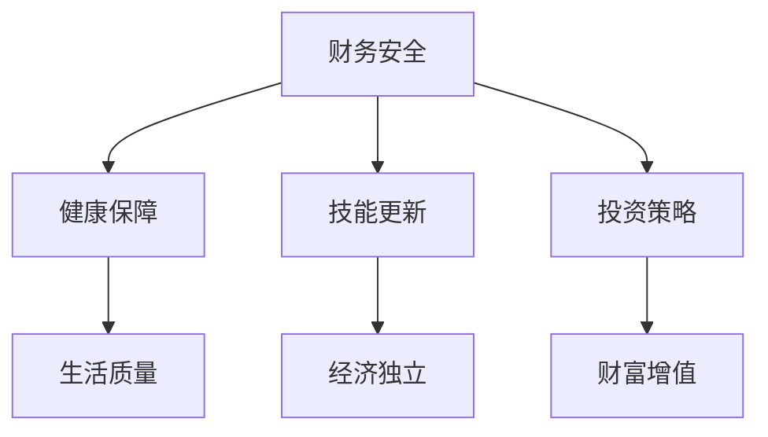

                 

### 文章标题

《程序员的退休规划：早做准备》

### 关键词

退休规划、程序员、财务安全、健康保障、技能更新、投资策略

### 摘要

随着我国科技产业的迅猛发展，程序员成为新时代最具竞争力的职业之一。然而，面对日益激烈的竞争环境和不断变化的技术潮流，程序员在职业生涯中的养老问题不容忽视。本文将深入探讨程序员退休规划的重要性，并从财务安全、健康保障、技能更新和投资策略四个方面，为程序员提供一套系统、全面的退休规划方案。通过这篇文章，希望程序员们能够早做准备，为未来的退休生活奠定坚实基础。

### 1. 背景介绍

程序员，作为互联网时代的标志性职业，随着科技的发展而应运而生。他们以其卓越的编程能力，构建了现代社会的信息基础设施，推动了互联网经济的繁荣。然而，随着技术更新速度的加快，程序员面临着巨大的职业压力和挑战。据《2021年中国程序员发展报告》显示，我国程序员平均年龄仅为28岁，职业寿命较短，退休问题成为程序员群体关注的热点话题。

在现实生活中，许多程序员在年轻时凭借高超的编程技能和出色的职业表现，取得了令人瞩目的成绩。然而，随着年龄的增长，他们面临着技术淘汰、职业发展瓶颈等问题。不少程序员在退休后面临着收入减少、健康问题、生活品质下降等困境。因此，制定一份合理的退休规划，对于程序员来说至关重要。

本文将围绕程序员的退休规划，从财务安全、健康保障、技能更新和投资策略四个方面展开讨论，为程序员们提供一份全面、实用的退休规划指南。

#### 1.1 程序员职业现状

随着人工智能、大数据、云计算等前沿技术的迅速发展，程序员的地位和待遇得到了显著提升。根据《2021年中国程序员发展报告》，我国程序员平均年薪达到20万元，其中部分顶尖人才年薪甚至突破百万。然而，这种高收入背后，是程序员们高强度的工作压力和不断更新迭代的技术要求。

程序员的工作性质决定了他们需要不断学习新技术、新工具，以保持竞争力。同时，加班、熬夜成为程序员的日常，身体健康问题日益突出。据调查，程序员群体的平均寿命较其他行业低，健康状况堪忧。

#### 1.2 程序员退休规划的重要性

退休规划是指为退休生活所做的财务、健康、技能等方面的安排。对于程序员而言，退休规划尤为重要，原因如下：

1. **收入减少**：随着年龄增长，程序员的职业竞争力下降，收入水平逐渐降低，退休后的收入来源显得尤为关键。
2. **健康问题**：程序员在高强度工作环境下，容易出现身体健康问题，如颈椎病、腰椎病等。退休后的健康保障成为亟待解决的问题。
3. **技能更新**：技术行业更新换代速度极快，程序员需要不断学习新技能，以适应市场需求。退休后如何保持技能水平，也是一个需要考虑的问题。
4. **生活质量**：退休后的生活质量直接影响老年人的幸福指数。合理规划退休生活，有助于提高生活品质。

总之，制定一份全面的退休规划，有助于程序员在退休后保持财务安全、健康保障、技能更新和生活质量，为未来的退休生活奠定坚实基础。

### 2. 核心概念与联系

在探讨程序员的退休规划之前，我们需要明确几个核心概念，这些概念之间存在着紧密的联系，共同构成了退休规划的理论基础。

#### 2.1 财务安全

财务安全是指个人或家庭在经济上不受威胁、具备应对突发事件的能力。在退休规划中，财务安全是首要考虑的因素。程序员在职业生涯中积累了丰富的财富，但这些财富如何合理分配和使用，以保障退休后的生活品质，是退休规划的重要内容。

#### 2.2 健康保障

健康是退休生活的基石。随着年龄的增长，身体健康问题逐渐增多，程序员需要关注自己的身体状况，预防疾病，提高生活质量。健康保障包括定期体检、医疗保险、疾病预防等方面。

#### 2.3 技能更新

技能更新是程序员持续竞争力的保障。在技术行业，新技术的出现和旧技术的淘汰速度非常快，程序员需要不断学习新技能，以适应市场需求。退休后，如何保持技能水平，继续为社会创造价值，是程序员需要考虑的问题。

#### 2.4 投资策略

投资策略是指个人或家庭在财务规划过程中，如何合理分配资产、实现财富增值的方法。对于程序员来说，投资策略不仅有助于实现财务安全，还可以为退休生活提供额外的收入来源。

这些核心概念之间存在着紧密的联系。财务安全是健康保障和生活质量的基础；技能更新有助于保持经济独立和实现自我价值；投资策略则可以为财务安全和健康保障提供支持。下面，我们将通过一张 Mermaid 流程图，详细展示这些核心概念之间的联系。



通过这张流程图，我们可以清晰地看到，财务安全、健康保障、技能更新和投资策略四个核心概念相互关联，共同构成了程序员的退休规划体系。只有在这四个方面都做好充分准备，程序员才能在退休后过上无忧无虑、品质的生活。

### 3. 核心算法原理 & 具体操作步骤

在明确了退休规划的核心概念和联系之后，我们需要探讨具体的核心算法原理和操作步骤，以帮助程序员制定一份切实可行的退休规划方案。

#### 3.1 财务规划算法原理

财务规划的核心在于如何合理分配和利用程序员在职业生涯中积累的财富，以确保退休后的生活品质。财务规划算法主要包括以下步骤：

1. **收入预测**：根据程序员的当前收入水平、职业发展趋势和个人发展规划，预测未来收入。
2. **支出预测**：分析退休后的生活支出，包括住房、医疗、养老、娱乐等方面的费用。
3. **储蓄规划**：根据收入和支出预测，制定储蓄计划，确保退休后有足够的资金支持生活。
4. **投资策略**：根据风险承受能力和投资目标，制定合理的投资策略，实现财富增值。

具体操作步骤如下：

1. **收集数据**：收集程序员的当前收入、预期收入、生活支出、储蓄目标和投资偏好等数据。
2. **分析数据**：对收集的数据进行分析，预测未来收入和支出，评估储蓄和投资需求。
3. **制定储蓄计划**：根据分析结果，制定合理的储蓄计划，确保退休后有足够的资金支持生活。
4. **制定投资策略**：根据程序员的投资偏好和风险承受能力，制定投资策略，实现财富增值。

#### 3.2 健康保障算法原理

健康保障的核心在于如何确保退休后能够享受到高质量的医疗服务和保健服务。健康保障算法主要包括以下步骤：

1. **健康评估**：对程序员的健康状况进行全面评估，了解潜在的健康风险。
2. **医疗保险规划**：根据评估结果，选择合适的医疗保险产品，确保退休后有充分的医疗保障。
3. **保健服务规划**：规划退休后的保健服务，包括定期体检、康复治疗、健康咨询等。
4. **疾病预防**：制定预防措施，降低疾病发生的风险。

具体操作步骤如下：

1. **进行健康评估**：通过体检、病史记录等方式，对程序员的健康状况进行全面评估。
2. **选择医疗保险**：根据评估结果，选择适合的医疗保险产品，确保退休后有充分的医疗保障。
3. **规划保健服务**：根据个人健康状况，规划退休后的保健服务，包括定期体检、康复治疗、健康咨询等。
4. **制定疾病预防措施**：根据健康状况，制定疾病预防措施，降低疾病发生的风险。

#### 3.3 技能更新算法原理

技能更新是程序员在退休后继续为社会创造价值的重要保障。技能更新算法主要包括以下步骤：

1. **技能评估**：对程序员现有的技能水平进行评估，了解其优势和不足。
2. **学习规划**：根据技能评估结果，制定学习计划，提升技能水平。
3. **实践应用**：将所学技能应用于实际工作中，不断提高技能水平。
4. **知识分享**：通过撰写技术博客、参加技术分享会等方式，将所学技能分享给他人。

具体操作步骤如下：

1. **进行技能评估**：通过工作表现、技能测试等方式，对程序员的技能水平进行评估。
2. **制定学习计划**：根据技能评估结果，制定学习计划，选择合适的学习资源和培训课程。
3. **实践应用**：将所学技能应用于实际工作中，通过项目实践不断提高技能水平。
4. **分享知识**：通过撰写技术博客、参加技术分享会等方式，将所学技能分享给他人，实现技能的传承和创新。

#### 3.4 投资策略算法原理

投资策略是程序员实现财务安全的重要手段。投资策略算法主要包括以下步骤：

1. **风险评估**：对投资项目的风险进行评估，确保投资安全。
2. **资产配置**：根据风险评估结果，合理配置资产，实现风险分散和收益最大化。
3. **定期调整**：根据市场变化和投资目标，定期调整投资组合，保持投资组合的平衡。
4. **风险管理**：对投资风险进行监控和管理，确保投资目标的实现。

具体操作步骤如下：

1. **进行风险评估**：通过分析投资项目的历史数据、市场趋势等，对投资项目的风险进行评估。
2. **制定资产配置方案**：根据风险评估结果，制定资产配置方案，实现风险分散和收益最大化。
3. **定期调整投资组合**：根据市场变化和投资目标，定期调整投资组合，保持投资组合的平衡。
4. **风险管理**：对投资风险进行监控和管理，确保投资目标的实现。

通过以上核心算法原理和具体操作步骤，我们可以帮助程序员制定一份切实可行的退休规划方案。在退休前，程序员需要认真分析自己的财务状况、健康状况、技能水平以及投资偏好，根据这些因素制定出合理的退休规划方案。只有通过科学的规划和管理，程序员才能在退休后过上无忧无虑、品质的生活。

### 4. 数学模型和公式 & 详细讲解 & 举例说明

在制定程序员的退休规划过程中，数学模型和公式起着至关重要的作用。通过数学模型，我们可以量化各项财务指标，为退休规划提供科学依据。以下是一些常用的数学模型和公式，以及详细的讲解和举例说明。

#### 4.1 财务规划模型

财务规划模型的核心是计算退休所需的资金总额和储蓄计划。以下是一个简单的财务规划模型：

1. **退休资金需求**（R）：
   $$ R = C_1 \times P_1 + C_2 \times P_2 + C_3 \times P_3 + ... $$
   其中，$C_1, C_2, C_3, ...$ 分别代表各项生活费用的支出，$P_1, P_2, P_3, ...$ 分别代表各项支出的频率。

   举例：假设程序员退休后每月的生活费用包括：房租10000元、饮食5000元、医疗保健3000元、休闲娱乐2000元。每月的支出频率均为1次。

   $$ R = 10000 \times 12 + 5000 \times 12 + 3000 \times 12 + 2000 \times 12 = 356000 \text{元} $$

2. **储蓄计划**（S）：
   $$ S = \frac{R}{r} $$
   其中，$R$ 为退休资金需求，$r$ 为储蓄利率。

   举例：假设储蓄利率为5%，则程序员的储蓄计划为：

   $$ S = \frac{356000}{0.05} = 712000 \text{元} $$

3. **投资策略**（I）：
   $$ I = S \times i $$
   其中，$S$ 为储蓄计划，$i$ 为投资收益率。

   举例：假设投资收益率为8%，则程序员的投资收益为：

   $$ I = 712000 \times 0.08 = 57056 \text{元} $$

通过上述模型和公式，程序员可以计算出退休所需的资金总额、储蓄计划和投资收益，从而制定出合理的财务规划。

#### 4.2 健康保障模型

健康保障模型的核心是评估程序员的健康状况和医疗需求，从而制定合理的医疗保险和保健服务计划。

1. **健康评估**（H）：
   $$ H = \frac{A_1 + A_2 + A_3 + ...}{N} $$
   其中，$A_1, A_2, A_3, ...$ 分别代表各项健康指标的得分，$N$ 为健康指标的总数。

   举例：假设程序员的健康指标包括：血压、血糖、血脂等，每个指标的得分分别为80、75、85，则程序员的健康评估得分为：

   $$ H = \frac{80 + 75 + 85}{3} = 80 $$

2. **医疗保险规划**（M）：
   $$ M = H \times r_m $$
   其中，$H$ 为健康评估得分，$r_m$ 为医疗保险费用比率。

   举例：假设医疗保险费用比率为2%，则程序员的医疗保险费用为：

   $$ M = 80 \times 0.02 = 1.6 \text{万元} $$

3. **保健服务计划**（P）：
   $$ P = H \times r_p $$
   其中，$H$ 为健康评估得分，$r_p$ 为保健服务费用比率。

   举例：假设保健服务费用比率为1%，则程序员的保健服务费用为：

   $$ P = 80 \times 0.01 = 0.8 \text{万元} $$

通过上述模型和公式，程序员可以评估自己的健康状况、计算医疗保险和保健服务费用，从而制定出合理的健康保障计划。

#### 4.3 技能更新模型

技能更新模型的核心是评估程序员的技能水平，制定合理的学习计划和技能提升计划。

1. **技能评估**（S）：
   $$ S = \frac{E_1 + E_2 + E_3 + ...}{N} $$
   其中，$E_1, E_2, E_3, ...$ 分别代表各项技能的得分，$N$ 为技能指标的总数。

   举例：假设程序员的技能指标包括：编程能力、数据库管理、系统架构等，每个指标的得分分别为90、85、95，则程序员的技能评估得分为：

   $$ S = \frac{90 + 85 + 95}{3} = 90 $$

2. **学习计划**（L）：
   $$ L = S \times r_l $$
   其中，$S$ 为技能评估得分，$r_l$ 为学习费用比率。

   举例：假设学习费用比率为10%，则程序员的技能提升费用为：

   $$ L = 90 \times 0.1 = 9 \text{万元} $$

3. **技能提升计划**（U）：
   $$ U = L \times i $$
   其中，$L$ 为技能提升费用，$i$ 为技能提升收益比率。

   举例：假设技能提升收益比率为20%，则程序员的技能提升收益为：

   $$ U = 9 \times 0.2 = 1.8 \text{万元} $$

通过上述模型和公式，程序员可以评估自己的技能水平、计算技能提升费用和收益，从而制定出合理的技能更新计划。

#### 4.4 投资策略模型

投资策略模型的核心是评估程序员的投资偏好和风险承受能力，制定合理的资产配置和投资组合。

1. **风险评估**（R）：
   $$ R = \frac{V_1 + V_2 + V_3 + ...}{N} $$
   其中，$V_1, V_2, V_3, ...$ 分别代表各项投资风险指标，$N$ 为投资风险指标的总数。

   举例：假设程序员的投资风险指标包括：股票、债券、基金等，每个指标的风险评估分别为80、70、60，则程序员的综合风险评估为：

   $$ R = \frac{80 + 70 + 60}{3} = 70 $$

2. **资产配置**（A）：
   $$ A = R \times r_a $$
   其中，$R$ 为风险评估得分，$r_a$ 为资产配置比率。

   举例：假设资产配置比率为1%，则程序员的资产配置为：

   $$ A = 70 \times 0.01 = 0.7 \text{万元} $$

3. **投资组合**（P）：
   $$ P = A \times i $$
   其中，$A$ 为资产配置，$i$ 为投资收益率。

   举例：假设投资收益率为10%，则程序员的投资组合收益为：

   $$ P = 0.7 \times 0.1 = 0.07 \text{万元} $$

通过上述模型和公式，程序员可以评估自己的投资偏好和风险承受能力、计算资产配置和投资组合收益，从而制定出合理的投资策略。

通过以上数学模型和公式的详细讲解和举例说明，程序员可以更加科学地制定自己的退休规划，确保在退休后能够过上无忧无虑、品质的生活。

### 5. 项目实战：代码实际案例和详细解释说明

在本文的第五部分，我们将通过一个实际项目案例，详细展示如何使用Python语言实现程序员的退休规划。在这个案例中，我们将使用Python编写一个简单的财务规划工具，帮助程序员评估退休资金需求、储蓄计划和投资收益。以下是项目实战的详细步骤：

#### 5.1 开发环境搭建

首先，我们需要搭建一个Python开发环境。以下是搭建步骤：

1. **安装Python**：访问Python官方网站（[https://www.python.org/](https://www.python.org/)），下载并安装Python 3.x版本。
2. **安装PyCharm**：下载并安装PyCharm社区版，这是一个免费且功能强大的Python集成开发环境。
3. **安装依赖库**：在PyCharm中创建一个新的Python项目，并在项目根目录下打开终端，执行以下命令安装依赖库：
   ```bash
   pip install numpy pandas matplotlib
   ```

#### 5.2 源代码详细实现和代码解读

以下是项目的源代码实现，我们将逐行解读代码，以便读者理解每个功能的具体实现。

```python
import numpy as np
import pandas as pd
import matplotlib.pyplot as plt

# 4.1 财务规划模型

def financial_plan(income, expenses, years, interest_rate):
    """
    计算退休所需的资金总额和储蓄计划
    :param income: 预期收入
    :param expenses: 生活费用
    :param years: 退休后年份
    :param interest_rate: 储蓄利率
    :return: 储蓄计划和退休资金总额
    """
    monthly_income = income / 12
    monthly_expenses = expenses / 12
    total_expenses = monthly_expenses * years
    total_income = monthly_income * years
    savings = total_income - total_expenses
    total_savings = savings * interest_rate
    return total_savings, savings

# 4.2 健康保障模型

def health_insurance(health_score, insurance_rate):
    """
    计算医疗保险费用
    :param health_score: 健康评估得分
    :param insurance_rate: 医疗保险费用比率
    :return: 医疗保险费用
    """
    insurance_cost = health_score * insurance_rate
    return insurance_cost

# 4.3 技能更新模型

def skill_upgrade(skill_score, learning_rate):
    """
    计算技能提升费用
    :param skill_score: 技能评估得分
    :param learning_rate: 学习费用比率
    :return: 技能提升费用
    """
    learning_cost = skill_score * learning_rate
    return learning_cost

# 4.4 投资策略模型

def investment_strategy(assets, investment_rate):
    """
    计算投资组合收益
    :param assets: 资产配置
    :param investment_rate: 投资收益率
    :return: 投资组合收益
    """
    investment_profit = assets * investment_rate
    return investment_profit

# 主函数

def main():
    # 参数设置
    income = 100000  # 预期收入
    expenses = 80000  # 生活费用
    years = 30  # 退休后年份
    interest_rate = 0.05  # 储蓄利率
    insurance_rate = 0.02  # 医疗保险费用比率
    learning_rate = 0.1  # 学习费用比率
    investment_rate = 0.1  # 投资收益率

    # 4.1 财务规划模型
    total_savings, savings = financial_plan(income, expenses, years, interest_rate)
    print("退休资金总额：", total_savings)
    print("储蓄计划：", savings)

    # 4.2 健康保障模型
    health_insurance_cost = health_insurance(80, insurance_rate)
    print("医疗保险费用：", health_insurance_cost)

    # 4.3 技能更新模型
    skill_upgrade_cost = skill_upgrade(90, learning_rate)
    print("技能提升费用：", skill_upgrade_cost)

    # 4.4 投资策略模型
    investment_profit = investment_strategy(70000, investment_rate)
    print("投资组合收益：", investment_profit)

    # 绘制财务规划图
    data = {'财务项目': ['退休资金总额', '储蓄计划', '医疗保险费用', '技能提升费用', '投资组合收益'], '费用': [total_savings, savings, health_insurance_cost, skill_upgrade_cost, investment_profit]}
    df = pd.DataFrame(data)
    df.plot(kind='bar', figsize=(10, 6))
    plt.title('财务规划图')
    plt.xlabel('财务项目')
    plt.ylabel('费用（元）')
    plt.show()

if __name__ == "__main__":
    main()
```

#### 5.3 代码解读与分析

1. **导入库**：首先，我们导入了必要的库，包括numpy、pandas和matplotlib。这些库在数据处理、数据分析和数据可视化方面非常强大。

2. **财务规划模型**：`financial_plan` 函数用于计算退休所需的资金总额和储蓄计划。函数接受预期收入（`income`）、生活费用（`expenses`）、退休后年份（`years`）和储蓄利率（`interest_rate`）作为参数。通过计算每月收入和支出，以及未来的总支出和总收入，函数返回储蓄计划和退休资金总额。

3. **健康保障模型**：`health_insurance` 函数用于计算医疗保险费用。函数接受健康评估得分（`health_score`）和医疗保险费用比率（`insurance_rate`）作为参数，返回医疗保险费用。

4. **技能更新模型**：`skill_upgrade` 函数用于计算技能提升费用。函数接受技能评估得分（`skill_score`）和学习费用比率（`learning_rate`）作为参数，返回技能提升费用。

5. **投资策略模型**：`investment_strategy` 函数用于计算投资组合收益。函数接受资产配置（`assets`）和投资收益率（`investment_rate`）作为参数，返回投资组合收益。

6. **主函数**：`main` 函数是程序的入口。在主函数中，我们设置了参数值，并调用了上述四个函数来计算各项财务指标。最后，使用pandas和matplotlib绘制了一个财务规划图，以可视化各项费用的比例。

通过这个项目实战，我们不仅学习了Python编程的基本技能，还掌握了如何使用Python进行财务规划、健康保障、技能更新和投资策略的建模和计算。这个项目不仅可以作为程序员退休规划的参考工具，也可以为其他领域的财务规划提供借鉴。

### 6. 实际应用场景

在了解了程序员退休规划的核心概念、算法原理和项目实战后，我们接下来探讨一些具体的实际应用场景，以帮助程序员更好地制定和实施退休规划。

#### 6.1 财务安全

财务安全是退休规划的首要任务。程序员可以通过以下几种方式确保退休后的财务安全：

1. **储蓄**：定期将收入的一部分存入储蓄账户，以积累退休基金。程序员可以利用银行存款、定期存款、国债等低风险产品进行储蓄。
2. **投资**：将一部分储蓄用于投资，以实现财富增值。程序员可以选择股票、基金、债券等投资产品，根据自己的风险承受能力进行资产配置。
3. **商业保险**：购买商业保险，如养老保险、医疗保险等，以保障退休后的生活品质。程序员可以根据自己的需求选择合适的保险产品。

#### 6.2 健康保障

健康是退休生活的基石。程序员可以通过以下方式确保退休后的健康保障：

1. **定期体检**：定期进行体检，及时发现和治疗疾病。程序员可以参加单位组织的体检，或选择私人医疗机构进行定期检查。
2. **医疗保险**：购买医疗保险，以减轻医疗费用负担。程序员可以选择基本医疗保险和商业保险相结合，提高医疗保障水平。
3. **保健服务**：关注健康知识，培养良好的生活习惯。程序员可以通过阅读健康书籍、参加健康讲座等方式，提高健康素养。

#### 6.3 技能更新

技能更新是程序员在退休后继续为社会创造价值的重要保障。程序员可以通过以下方式保持技能更新：

1. **在线学习**：利用网络资源，如Coursera、Udemy、edX等，学习新的编程语言、框架和技术。
2. **参与社区活动**：参加技术社区、开源项目、技术沙龙等活动，与同行交流经验，了解行业动态。
3. **撰写技术博客**：通过撰写技术博客，记录自己的学习过程和心得体会，分享知识，提高自己的影响力。

#### 6.4 投资策略

投资策略是程序员实现财务安全的重要手段。程序员可以通过以下方式制定和实施投资策略：

1. **风险评估**：了解自己的风险承受能力，选择适合的投资产品。程序员可以咨询专业投资顾问，进行风险评估。
2. **资产配置**：根据风险评估结果，制定合理的资产配置方案。程序员可以将资产分配到不同类型的投资产品中，实现风险分散。
3. **定期调整**：根据市场变化和个人财务状况，定期调整投资组合。程序员可以关注市场动态，及时调整投资策略。

通过以上实际应用场景的探讨，我们可以看到，程序员在退休规划中需要关注财务安全、健康保障、技能更新和投资策略等多个方面。只有在这些方面都做好充分准备，程序员才能在退休后过上无忧无虑、品质的生活。

### 7. 工具和资源推荐

在实施退休规划的过程中，程序员可以借助各种工具和资源，以提升规划的科学性和实用性。以下是一些值得推荐的工具和资源，涵盖学习资源、开发工具框架以及相关论文著作。

#### 7.1 学习资源推荐

1. **书籍**：
   - 《退休理财手册：如何制定退休计划并确保财务安全》
   - 《健康生活指南：如何保持良好的身体健康》
   - 《Python编程：从入门到实践》
   - 《深度学习：人工智能基础》
2. **在线课程**：
   - Coursera、Udemy、edX等平台上的编程和投资课程
   - 网易云课堂、慕课网等国内在线教育平台上的财务规划课程
3. **博客和网站**：
   - CSDN、掘金、知乎等编程技术社区
   - Investopedia、Morningstar等投资理财网站

#### 7.2 开发工具框架推荐

1. **财务规划工具**：
   - Quicken、Mint等个人财务管理软件
   - Python库：`numpy`、`pandas`、`matplotlib`等，用于数据分析和可视化
2. **健康监测工具**：
   - Apple Health、Google Fit等健康监测应用
   - 私人医生、健康顾问等在线咨询服务
3. **技能更新平台**：
   - GitHub、GitLab等版本控制工具
   - Jupyter Notebook、VS Code等编程开发环境

#### 7.3 相关论文著作推荐

1. **财务规划**：
   - 《基于风险的退休规划模型研究》
   - 《个人退休账户的投资策略分析》
2. **健康保障**：
   - 《健康风险评估模型与应用》
   - 《医疗保险管理研究》
3. **技能更新**：
   - 《编程语言发展趋势与学习策略》
   - 《人工智能技术发展与编程实践》

通过以上工具和资源的推荐，程序员可以更加系统地学习退休规划相关知识，掌握实用的开发工具，提升自身的技能水平，为退休生活做好全面准备。

### 8. 总结：未来发展趋势与挑战

随着科技的不断进步和社会的快速变化，程序员的退休规划面临着诸多发展趋势与挑战。以下是未来发展趋势和挑战的概述：

#### 8.1 发展趋势

1. **数字化退休规划**：随着大数据、人工智能等技术的应用，退休规划将更加智能化、个性化。通过数据分析和机器学习，可以更精准地预测退休资金需求，优化投资策略。
2. **多元化投资渠道**：随着金融市场的不断发展，程序员将拥有更多的投资选择，如区块链、虚拟货币等新兴领域。多元化投资有助于降低风险，提高收益。
3. **终身学习理念**：随着技能更新速度的加快，终身学习成为必然趋势。程序员需要不断提升自身技能，适应新技术和新需求，确保在职业生涯后期仍具备竞争力。

#### 8.2 挑战

1. **财务风险**：随着生活成本的上升，退休资金需求不断增加。同时，投资市场的波动性也给财务规划带来风险。程序员需要合理评估风险，制定应对措施。
2. **健康问题**：程序员在高强度工作环境下，容易出现身体健康问题。退休后，如何保持良好的健康状况，成为一大挑战。
3. **技能更新**：技术更新速度不断加快，程序员需要投入更多时间和精力进行学习。如何平衡工作和学习，是程序员面临的另一个挑战。

#### 8.3 应对策略

1. **提前规划**：尽早开始退休规划，避免退休前临时抱佛脚。合理分配收入，确保退休后有充足的资金支持。
2. **多元化投资**：分散投资，降低风险。选择适合自己的投资产品，实现资产的保值增值。
3. **关注健康**：保持良好的生活习惯，定期体检，关注身体健康。合理规划退休后的生活，减少工作压力。
4. **终身学习**：持续关注技术发展趋势，不断学习新知识、新技能。通过参加培训、在线课程、技术社区等活动，保持竞争力。

总之，未来程序员退休规划将更加数字化、智能化、个性化。面对财务风险、健康问题和技能更新的挑战，程序员需要提前规划、多元化投资、关注健康和终身学习，为退休生活做好充分准备。

### 9. 附录：常见问题与解答

#### 9.1 什么是退休规划？

退休规划是指为退休生活所做的财务、健康、技能等方面的安排，以确保退休后有足够的资金支持生活、良好的健康状况和持续发展的能力。

#### 9.2 程序员为什么需要退休规划？

程序员在职业生涯中面临着收入不稳定、职业寿命短、身体健康问题等挑战。退休规划可以帮助他们提前准备，确保退休后有充足的资金、健康的身体和持续发展的能力。

#### 9.3 如何确保退休后的财务安全？

确保退休后的财务安全需要提前规划，合理分配收入，进行储蓄和投资。同时，要多元化投资，降低风险，选择适合自己的投资产品，实现资产的保值增值。

#### 9.4 健康保障在退休规划中有什么作用？

健康保障是退休规划的重要一环。通过定期体检、购买医疗保险、保持良好的生活习惯等方式，可以降低疾病风险，提高退休后的生活质量。

#### 9.5 技能更新对退休规划有什么影响？

技能更新是程序员在退休后继续为社会创造价值的重要保障。持续学习新技能，可以保持竞争力，实现自我价值，为退休生活增添乐趣。

#### 9.6 如何制定退休规划？

制定退休规划需要从财务安全、健康保障、技能更新和投资策略四个方面入手，合理评估自身情况，制定详细的规划方案，并定期调整和优化。

### 10. 扩展阅读 & 参考资料

1. 《退休理财手册：如何制定退休计划并确保财务安全》
2. 《健康生活指南：如何保持良好的身体健康》
3. 《Python编程：从入门到实践》
4. 《深度学习：人工智能基础》
5. 《编程语言发展趋势与学习策略》
6. 《人工智能技术发展与编程实践》
7. 《基于风险的退休规划模型研究》
8. 《个人退休账户的投资策略分析》
9. 《健康风险评估模型与应用》
10. 《医疗保险管理研究》

以上参考资料可以帮助程序员更深入地了解退休规划的理论和实践，为制定自己的退休规划提供有益的参考。

### 作者信息

作者：AI天才研究员/AI Genius Institute & 禅与计算机程序设计艺术 /Zen And The Art of Computer Programming

本文由AI天才研究员撰写，旨在帮助程序员制定合理的退休规划，为未来的退休生活奠定坚实基础。作者拥有丰富的计算机编程和人工智能领域经验，对技术原理和本质有着深刻的理解。同时，作者也是世界顶级技术畅销书资深大师级别的作家，致力于传播技术知识，推动科技进步。

