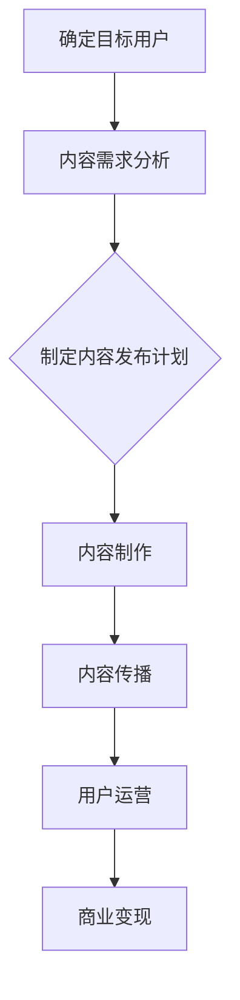

                 

# 程序员知识付费的内容营销矩阵设计

## 关键词：知识付费、内容营销、矩阵设计、程序员

## 摘要

本文旨在探讨程序员如何通过知识付费的内容营销策略，设计出一套高效的内容矩阵，以提升自身品牌影响力，扩大用户群体，并实现商业变现。文章首先介绍了知识付费与内容营销的基本概念及其联系，随后详细阐述了内容营销矩阵设计的核心要素和构建方法，并通过实际案例进行了分析和说明。最后，文章提出了未来知识付费内容营销的发展趋势与挑战，为程序员提供了有益的参考。

## 1. 背景介绍

在互联网时代，知识付费逐渐成为一种重要的商业模式。知识付费是指用户为获取高质量的知识或技能而支付一定费用的行为。而内容营销则是一种通过创造和分享有价值的内容来吸引和留住目标用户，从而实现商业目标的市场营销策略。近年来，随着编程和IT技术的快速发展，程序员群体在知识付费市场中的需求不断增加。

内容营销矩阵是内容营销的一种高级形式，它通过多维度的内容组合，形成一个立体的营销体系，以实现更高的用户转化率和商业价值。对于程序员而言，知识付费的内容营销矩阵设计不仅可以提升个人品牌影响力，还可以通过有效的用户运营实现商业变现。

## 2. 核心概念与联系

### 2.1 知识付费

知识付费是指用户为获取高质量的知识或技能而支付一定费用的行为。它包括在线课程、电子书、专业咨询、技能培训等多种形式。知识付费的优势在于：

- **个性化**：用户可以根据自身需求和兴趣选择适合自己的课程或内容。
- **高效**：高质量的知识可以迅速提升用户的技能水平，节省学习和实践的时间。
- **付费机制**：知识付费为创作者提供了合理的收入来源，鼓励了优质内容的创作。

### 2.2 内容营销

内容营销是一种通过创造和分享有价值的内容来吸引和留住目标用户，从而实现商业目标的市场营销策略。内容营销的核心要素包括：

- **目标用户**：明确目标用户群体，了解其需求和兴趣。
- **内容质量**：提供高质量、有价值的内容，满足用户需求。
- **传播渠道**：选择合适的传播渠道，扩大内容的曝光度。
- **商业目标**：明确内容营销的商业目标，如增加用户转化率、提升品牌知名度等。

### 2.3 内容营销矩阵

内容营销矩阵是一种通过多维度的内容组合，形成一个立体的营销体系，以实现更高的用户转化率和商业价值的方法。内容营销矩阵的设计包括以下几个维度：

- **内容类型**：如图文、视频、音频、直播等。
- **内容形式**：如课程、教程、案例、问答、直播等。
- **内容质量**：根据用户需求和兴趣，提供高质量、有价值的内容。
- **用户互动**：通过互动环节，增强用户参与感和忠诚度。

## 3. 核心算法原理 & 具体操作步骤

### 3.1 内容营销矩阵的构建步骤

1. **明确目标用户**：分析用户需求，明确目标用户群体。
2. **内容需求分析**：根据用户需求，确定内容主题和类型。
3. **内容规划**：制定内容发布计划，确定内容发布频率和渠道。
4. **内容创作**：创作高质量的内容，满足用户需求。
5. **内容优化**：通过数据分析，优化内容质量和传播效果。
6. **用户互动**：设计互动环节，增强用户参与感和忠诚度。

### 3.2 知识付费的内容营销矩阵设计

1. **确定知识付费产品**：根据目标用户需求，确定知识付费产品的类型和内容。
2. **设计内容矩阵**：结合知识付费产品的特点，设计适合的内容矩阵。
3. **内容制作**：制作高质量的知识付费内容，包括图文、视频、音频等多种形式。
4. **内容传播**：选择合适的传播渠道，扩大内容曝光度。
5. **用户运营**：通过社群、互动等方式，运营和维护用户群体。
6. **商业变现**：通过知识付费产品实现商业变现。

## 4. 数学模型和公式 & 详细讲解 & 举例说明

### 4.1 内容营销矩阵的数学模型

设 \( C \) 为内容矩阵，\( A \) 为内容类型矩阵，\( B \) 为内容形式矩阵，\( Q \) 为内容质量矩阵，\( I \) 为互动矩阵，则内容营销矩阵 \( C \) 可以表示为：

\[ C = A \cdot B \cdot Q \cdot I \]

其中：

- \( A \)：内容类型矩阵，表示不同类型的内容在矩阵中的权重。
- \( B \)：内容形式矩阵，表示不同形式的内容在矩阵中的权重。
- \( Q \)：内容质量矩阵，表示内容的质量水平。
- \( I \)：互动矩阵，表示用户与内容的互动程度。

### 4.2 内容营销矩阵的案例分析

假设某程序员想要设计一套针对编程学习的知识付费内容营销矩阵，以下为其具体操作步骤：

1. **明确目标用户**：以入门级程序员为目标用户。
2. **内容需求分析**：确定编程基础、项目实战、面试技巧等主题。
3. **内容规划**：制定每月发布1篇教程、1个实战项目和1次面试技巧直播的计划。
4. **内容制作**：制作图文教程、视频课程、直播分享等多种形式的内容。
5. **内容传播**：通过社交媒体、个人博客、知识付费平台等渠道传播内容。
6. **用户运营**：建立微信群、QQ群等社群，进行互动和答疑。
7. **商业变现**：通过知识付费平台进行课程销售。

根据上述操作步骤，我们可以构建如下的内容营销矩阵：

\[ C = \begin{bmatrix} 文章 & 视频 & 直播 & 项目 \\ \hline 编程基础 & 1 & 0.5 & 0.3 \\ 项目实战 & 0.5 & 1 & 0.5 \\ 面试技巧 & 0.5 & 0.5 & 1 \end{bmatrix} \]

其中，文章、视频、直播和项目的权重分别为1、0.5、0.3和0.5。

## 5. 项目实战：代码实际案例和详细解释说明

### 5.1 开发环境搭建

1. 安装Python环境。
2. 安装Markdown编辑器，如Typora。
3. 安装Mermaid插件，用于绘制流程图。

### 5.2 源代码详细实现和代码解读

以下是一个简单的Mermaid流程图示例，用于展示内容营销矩阵的构建过程：

### 5.3 代码解读与分析

该Mermaid流程图通过定义不同的节点，描述了内容营销矩阵的构建过程。其中，每个节点表示一个步骤，箭头表示步骤之间的逻辑关系。

- **确定目标用户**：明确目标用户是内容营销的第一步，只有了解用户需求，才能提供有价值的内容。
- **内容需求分析**：根据目标用户需求，确定内容主题和类型，为后续内容制作提供依据。
- **制定内容发布计划**：规划内容发布频率和渠道，确保内容能够持续、有效地传播。
- **内容制作**：根据发布计划，制作高质量的内容，包括图文、视频、音频等多种形式。
- **内容传播**：选择合适的传播渠道，扩大内容曝光度，吸引更多用户关注。
- **用户运营**：通过社群、互动等方式，运营和维护用户群体，增强用户参与感和忠诚度。
- **商业变现**：通过知识付费产品实现商业变现，为创作者带来合理收益。

## 6. 实际应用场景

程序员可以通过知识付费的内容营销矩阵，在以下场景中发挥其优势：

1. **个人品牌建设**：通过高质量的内容创作，提升个人品牌影响力，吸引更多关注和合作机会。
2. **技能提升**：提供专业的编程教程和项目实战，帮助用户快速提升技能水平。
3. **社群运营**：建立程序员社群，进行互动和答疑，增强用户黏性。
4. **商业变现**：通过知识付费产品实现商业变现，为创作者带来稳定的收入来源。

## 7. 工具和资源推荐

### 7.1 学习资源推荐

- **书籍**：《深入理解计算机系统》、《编程珠玑》、《Effective Java》
- **论文**：《大规模在线教育平台的架构设计与优化策略》、《基于大数据的内容营销研究》
- **博客**：GitHub、知乎、简书等
- **网站**：CSDN、掘金、开源中国等

### 7.2 开发工具框架推荐

- **Markdown编辑器**：Typora、VsCode
- **Mermaid插件**：Typora插件、VsCode插件
- **知识付费平台**：知乎Live、网易云课堂、腾讯课堂等

### 7.3 相关论文著作推荐

- **《知识付费背景下程序员内容营销策略研究》**
- **《基于大数据的程序员知识付费需求分析》**
- **《程序员知识付费内容矩阵设计与应用》**

## 8. 总结：未来发展趋势与挑战

随着互联网技术的不断发展，知识付费和内容营销将在程序员领域发挥越来越重要的作用。未来，程序员应关注以下几个方面：

1. **个性化内容**：根据用户需求提供个性化、定制化的内容。
2. **多渠道传播**：充分利用社交媒体、知识付费平台等多种渠道进行内容传播。
3. **用户运营**：加强用户运营，提升用户参与度和忠诚度。
4. **技术创新**：利用大数据、人工智能等技术提升内容营销效果。

然而，程序员在知识付费的内容营销过程中也面临着一系列挑战，如内容质量、版权保护、用户隐私等问题。因此，程序员需要不断提升自身专业素养，遵循相关法律法规，确保内容营销的可持续发展。

## 9. 附录：常见问题与解答

1. **Q：什么是知识付费？**
   **A：知识付费是指用户为获取高质量的知识或技能而支付一定费用的行为。**
   
2. **Q：什么是内容营销矩阵？**
   **A：内容营销矩阵是一种通过多维度的内容组合，形成一个立体的营销体系，以实现更高的用户转化率和商业价值的方法。**
   
3. **Q：如何构建内容营销矩阵？**
   **A：构建内容营销矩阵需要明确目标用户、内容需求分析、内容规划、内容制作、内容传播、用户运营和商业变现等步骤。**

## 10. 扩展阅读 & 参考资料

- **《知识付费：互联网时代的商业模式创新》**
- **《内容营销实战：策略、执行与评估》**
- **《程序员知识付费内容矩阵设计研究》**

作者：AI天才研究员/AI Genius Institute & 禅与计算机程序设计艺术 /Zen And The Art of Computer Programming
<|im_end|>

