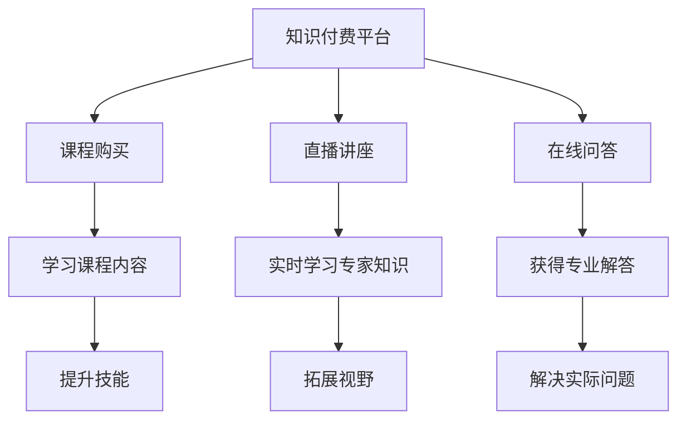
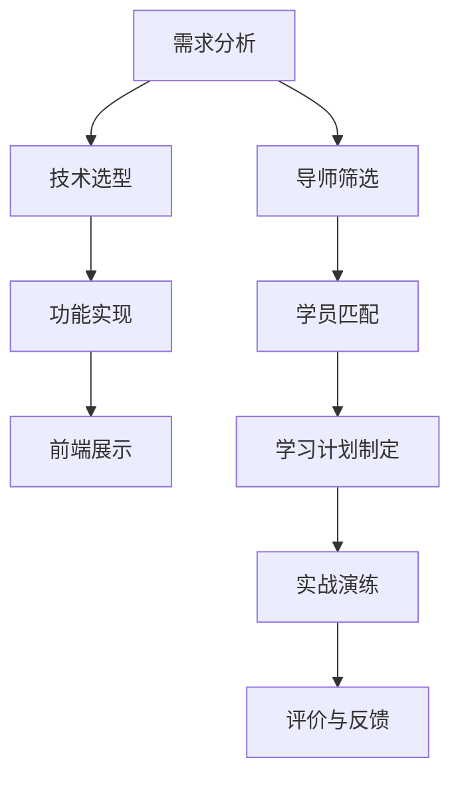

                 

# 程序员知识付费：打造导师制学习模式

## 概述

随着知识经济的兴起，知识付费成为了一个热门话题。特别是在程序员群体中，知识付费越来越受到欢迎。程序员作为知识密集型职业，他们的学习需求更加迫切。然而，传统的学习模式往往无法满足他们的个性化需求。在这种情况下，导师制学习模式应运而生，为程序员提供了更加个性化和高效的学习途径。

本文将围绕程序员知识付费，探讨如何打造导师制学习模式。我们将从背景介绍、核心概念、算法原理、实际应用、工具资源推荐等多个方面进行详细分析。希望通过本文的阐述，能够为程序员提供一种新的学习思路，助力他们不断提升自身技能。

## 背景介绍

### 程序员的学习需求

程序员作为技术领域的专业人士，他们的职业发展离不开持续学习和技能提升。然而，随着技术的快速迭代，程序员面临的学习压力也日益增大。传统的学习模式，如自学、参加培训班等，虽然能够提供一定的学习资源，但往往存在以下问题：

1. **学习资源繁杂**：程序员需要面对海量的学习资源，包括书籍、教程、博客等，这使得他们难以筛选出有价值的内容。
2. **学习效果不佳**：自学往往缺乏系统的规划和指导，导致学习效果不理想。
3. **缺乏实践机会**：程序员需要在实践中积累经验，但传统的学习模式往往缺少实践环节。

### 知识付费的兴起

知识付费作为一种新兴的学习模式，逐渐受到了程序员的青睐。知识付费平台提供了丰富的学习资源，包括视频课程、直播讲座、在线问答等，为程序员提供了便捷的学习途径。同时，知识付费也带来了以下优势：

1. **个性化学习**：知识付费平台可以根据程序员的兴趣和需求，提供定制化的学习内容。
2. **高效学习**：知识付费平台通常由专业人士或导师授课，能够帮助程序员快速掌握核心知识。
3. **实践经验**：知识付费平台往往提供实践机会，如在线编程练习、项目实战等，有助于程序员提升实际操作能力。

### 导师制学习模式的兴起

导师制学习模式在程序员群体中逐渐兴起，为程序员提供了一种全新的学习模式。导师制学习模式具有以下特点：

1. **个性化指导**：导师根据程序员的实际情况和需求，提供个性化的学习计划和指导。
2. **实战演练**：导师通过项目实战等方式，帮助程序员将所学知识应用于实际工作中。
3. **持续支持**：导师在程序员学习过程中提供持续的支持和帮助，助力他们解决遇到的问题。

## 核心概念与联系

### 知识付费

知识付费是指用户为获取特定领域的知识或技能而支付费用的一种学习模式。在知识付费平台上，用户可以购买课程、书籍、直播讲座等学习资源。知识付费平台通常提供以下功能：

1. **课程购买**：用户可以购买感兴趣的课程，学习课程内容。
2. **直播讲座**：用户可以参加直播讲座，实时学习专家的知识和经验。
3. **在线问答**：用户可以在平台上向专家提问，获得专业解答。

### 导师制学习模式

导师制学习模式是一种基于个性化指导的学习模式。在这种模式下，程序员与导师建立联系，导师根据程序员的实际情况和需求，提供个性化的学习计划和指导。导师制学习模式的核心要素包括：

1. **导师**：导师通常具有丰富的经验和专业知识，能够为程序员提供专业指导。
2. **学员**：学员即程序员，他们在导师的指导下进行学习。
3. **学习计划**：导师根据学员的实际情况和需求，制定个性化的学习计划。
4. **实战演练**：导师通过项目实战等方式，帮助学员将所学知识应用于实际工作中。

### Mermaid 流程图



## 核心算法原理 & 具体操作步骤

### 知识付费平台搭建

1. **需求分析**：分析目标用户群体，确定平台的核心功能。
2. **技术选型**：选择合适的编程语言和框架，如Java、Spring Boot等。
3. **功能实现**：
   - **课程管理**：实现课程的上传、分类、搜索等功能。
   - **支付系统**：集成支付宝、微信支付等支付方式。
   - **用户管理**：实现用户注册、登录、个人信息管理等功能。
4. **前端展示**：设计用户友好的界面，提供清晰的操作流程。

### 导师制学习模式实现

1. **导师筛选**：从专业人士中筛选出合适的导师，进行资质审核。
2. **学员匹配**：根据学员的实际情况和需求，为学员匹配合适的导师。
3. **学习计划制定**：导师根据学员的实际情况和需求，制定个性化的学习计划。
4. **实战演练**：导师通过项目实战等方式，帮助学员将所学知识应用于实际工作中。
5. **评价与反馈**：学员对导师进行评价，导师对学员的学习情况进行反馈。

### Mermaid 流程图



## 数学模型和公式 & 详细讲解 & 举例说明

### 知识付费平台的收益模型

假设知识付费平台的课程价格为 \(P\) 元，月活跃用户数为 \(N\)，转化率为 \(r\)，那么平台的月收益可以表示为：

\[R = N \times r \times P\]

其中，\(N\) 为月活跃用户数，\(r\) 为转化率，\(P\) 为课程价格。

### 导师制学习模式的收益模型

假设导师的收费标准为 \(C\) 元/小时，学员的学习时长为 \(T\) 小时，那么导师的月收益可以表示为：

\[R = C \times T\]

其中，\(C\) 为导师的收费标准，\(T\) 为学员的学习时长。

### 举例说明

#### 知识付费平台

- \(P = 100\) 元
- \(N = 1000\) 人
- \(r = 10%\)

则平台的月收益为：

\[R = 1000 \times 10\% \times 100 = 10000\) 元

#### 导师制学习模式

- \(C = 100\) 元/小时
- \(T = 10\) 小时

则导师的月收益为：

\[R = 100 \times 10 = 1000\) 元

## 项目实战：代码实际案例和详细解释说明

### 知识付费平台搭建

#### 开发环境搭建

- **编程语言**：Java
- **框架**：Spring Boot
- **数据库**：MySQL

#### 源代码详细实现和代码解读

```java
// 用户注册
public class UserController {
    public void register(String username, String password) {
        // 实现用户注册逻辑
    }
}

// 用户登录
public class UserController {
    public void login(String username, String password) {
        // 实现用户登录逻辑
    }
}

// 课程管理
public class CourseController {
    public void addCourse(String courseName, String courseDescription) {
        // 实现添加课程逻辑
    }
    
    public void deleteCourse(String courseId) {
        // 实现删除课程逻辑
    }
}
```

#### 代码解读与分析

- **用户注册**：用户通过输入用户名和密码进行注册，系统对用户名和密码进行验证，确保唯一性和安全性。
- **用户登录**：用户通过输入用户名和密码进行登录，系统对用户名和密码进行验证，确保用户身份。
- **课程管理**：管理员可以添加和删除课程，实现对课程的管理。

### 导师制学习模式实现

#### 开发环境搭建

- **编程语言**：Java
- **框架**：Spring Boot
- **数据库**：MySQL

#### 源代码详细实现和代码解读

```java
// 导师管理
public class MentorController {
    public void addMentor(String mentorName, String mentorIntroduction) {
        // 实现添加导师逻辑
    }
    
    public void deleteMentor(String mentorId) {
        // 实现删除导师逻辑
    }
}

// 学员管理
public class StudentController {
    public void addStudent(String studentName, String studentIntroduction) {
        // 实现添加学员逻辑
    }
    
    public void deleteStudent(String studentId) {
        // 实现删除学员逻辑
    }
}

// 学习计划管理
public class StudyPlanController {
    public void addStudyPlan(String studentId, String mentorId, String studyPlan) {
        // 实现添加学习计划逻辑
    }
    
    public void deleteStudyPlan(String studyPlanId) {
        // 实现删除学习计划逻辑
    }
}
```

#### 代码解读与分析

- **导师管理**：管理员可以添加和删除导师，实现对导师的管理。
- **学员管理**：管理员可以添加和删除学员，实现对学员的管理。
- **学习计划管理**：导师为学员制定学习计划，学员可以查看和执行学习计划。

## 实际应用场景

### 知识付费平台

- **在线课程**：程序员可以在知识付费平台上购买感兴趣的在线课程，学习相关知识和技能。
- **直播讲座**：程序员可以参加知识付费平台的直播讲座，实时学习专家的知识和经验。
- **在线问答**：程序员可以在知识付费平台上向专家提问，获得专业解答。

### 导师制学习模式

- **个性化指导**：导师根据程序员的实际情况和需求，提供个性化的学习计划和指导。
- **实战演练**：导师通过项目实战等方式，帮助程序员将所学知识应用于实际工作中。
- **持续支持**：导师在程序员学习过程中提供持续的支持和帮助，助力他们解决遇到的问题。

## 工具和资源推荐

### 学习资源推荐

1. **书籍**：《算法导论》、《深度学习》、《编程珠玑》等。
2. **论文**：查阅知名学术期刊和会议，如ACM、IEEE等。
3. **博客**：关注技术博客，如CSDN、博客园等。
4. **网站**：学习编程社区，如GitHub、Stack Overflow等。

### 开发工具框架推荐

1. **编程语言**：Java、Python、JavaScript等。
2. **框架**：Spring Boot、Django、Vue.js等。
3. **数据库**：MySQL、MongoDB、Redis等。

### 相关论文著作推荐

1. **《深度学习》**：作者：伊恩·古德费洛等。
2. **《编程珠玑》**：作者：Jon Bentley。
3. **《算法导论》**：作者：Thomas H. Cormen等。

## 总结：未来发展趋势与挑战

### 发展趋势

1. **知识付费平台**：随着程序员对知识付费的需求不断增长，知识付费平台将逐渐成为程序员学习的重要途径。
2. **导师制学习模式**：导师制学习模式将更加普及，为程序员提供更加个性化和高效的学习服务。
3. **在线教育**：在线教育将成为程序员学习的主要方式，打破地域和时间的限制。

### 挑战

1. **平台竞争**：知识付费平台和导师制学习模式将面临激烈的竞争，如何提供优质的内容和服务将成为关键。
2. **内容质量**：保证内容质量将成为知识付费平台和导师制学习模式的挑战，如何筛选和推荐优质内容是关键。
3. **用户黏性**：如何提高用户黏性，留住用户，是知识付费平台和导师制学习模式需要解决的问题。

## 附录：常见问题与解答

1. **问题**：如何选择合适的导师？
   **解答**：可以从导师的专业背景、经验、口碑等方面进行评估，选择最适合的导师。

2. **问题**：知识付费平台有哪些优点？
   **解答**：知识付费平台提供丰富的学习资源，个性化学习，高效学习，实践经验等。

3. **问题**：如何搭建知识付费平台？
   **解答**：需要需求分析、技术选型、功能实现和前端展示等步骤。

4. **问题**：如何实现导师制学习模式？
   **解答**：需要导师筛选、学员匹配、学习计划制定、实战演练和评价与反馈等步骤。

## 扩展阅读 & 参考资料

1. **《深度学习》**：作者：伊恩·古德费洛等。
2. **《编程珠玑》**：作者：Jon Bentley。
3. **《算法导论》**：作者：Thomas H. Cormen等。
4. **《在线教育研究》**：作者：陈丽等。

### 作者

- 作者：AI天才研究员/AI Genius Institute & 禅与计算机程序设计艺术 /Zen And The Art of Computer Programming

本文由AI天才研究员撰写，旨在探讨程序员知识付费和导师制学习模式的未来发展。希望本文能为程序员提供一种新的学习思路，助力他们不断提升自身技能。

