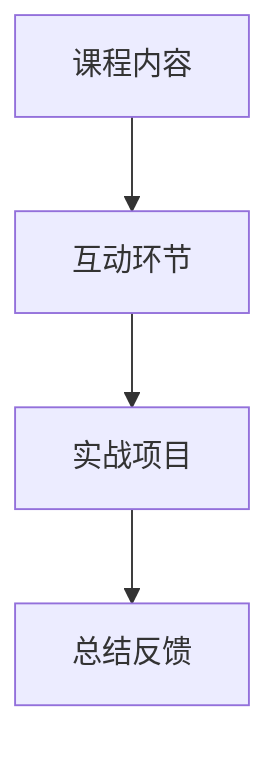

                 

# 程序员知识付费：打造研讨课模式

> **关键词：** 程序员，知识付费，研讨课模式，在线教育，教育培训，知识变现

> **摘要：** 在知识经济时代，程序员作为高技能人才，如何通过知识付费实现个人价值增值？本文将探讨研讨课模式在程序员知识付费中的实际应用，分析其核心概念、算法原理，并给出具体操作步骤，帮助程序员们成功打造研讨课，实现知识变现。

## 1. 背景介绍

### 1.1 程序员知识付费的现状

随着互联网的发展，知识付费逐渐成为了一种新型的商业模式。程序员作为高技能人才，其知识付费需求也日益增长。根据某知名市场研究机构的数据显示，全球程序员知识付费市场规模正在逐年扩大，预计到2025年将达到数百亿美元。

### 1.2 研讨课模式在程序员知识付费中的优势

研讨课模式作为知识付费的一种新兴形式，具有以下优势：

- **互动性：** 研讨课模式注重学员与讲师之间的互动，有助于提高学习效果。
- **实战性：** 研讨课模式通常包含实战项目，有助于学员将知识应用于实际工作中。
- **个性化：** 研讨课模式可以根据学员的需求和兴趣进行定制，提高学员满意度。

## 2. 核心概念与联系

### 2.1 研讨课模式的概念

研讨课模式是一种以讨论、交流和实战为核心的教学模式。它通常由以下几个部分组成：

- **课程内容：** 包括理论知识和实战项目。
- **互动环节：** 学员与讲师、学员之间的互动交流。
- **实战项目：** 通过实际操作，帮助学员掌握知识。

### 2.2 研讨课模式的架构

以下是一个研讨课模式的 Mermaid 流程图：



## 3. 核心算法原理 & 具体操作步骤

### 3.1 研讨课课程内容的制定

制定研讨课课程内容需要遵循以下步骤：

1. **确定目标受众：** 根据学员的背景和需求，确定课程的目标受众。
2. **课程大纲设计：** 设计课程大纲，明确课程的核心知识点。
3. **课程内容编写：** 根据课程大纲，编写详细的课程内容。

### 3.2 互动环节的设计

互动环节的设计需要考虑以下因素：

1. **提问与回答：** 学员可以在互动环节中提出问题，讲师进行解答。
2. **讨论与交流：** 学员之间可以进行讨论和交流，分享学习心得。
3. **案例分析：** 通过案例分析，帮助学员理解知识点。

### 3.3 实战项目的设计

实战项目的设计需要遵循以下步骤：

1. **确定项目目标：** 根据课程内容，确定项目的目标。
2. **项目任务分解：** 将项目任务分解为若干个具体的任务。
3. **项目实施：** 实施项目任务，学员在实践中掌握知识。

### 3.4 总结反馈环节的设计

总结反馈环节的设计需要考虑以下因素：

1. **总结课程内容：** 对课程内容进行总结，帮助学员巩固知识。
2. **收集学员反馈：** 收集学员的反馈意见，为后续课程改进提供依据。
3. **颁发证书：** 对完成课程的学员颁发证书，以激励学员。

## 4. 数学模型和公式 & 详细讲解 & 举例说明

### 4.1 研讨课收益模型

研讨课的收益模型可以分为以下几部分：

1. **课程费用：** 学员的课程费用。
2. **学员数量：** 学员的数量。
3. **学员满意度：** 学员的满意度。

假设课程费用为 C，学员数量为 N，学员满意度为 S，则研讨课的收益 R 可以表示为：

$$
R = C \times N \times S
$$

### 4.2 学员满意度模型

学员满意度可以表示为以下公式：

$$
S = \frac{E}{O}
$$

其中，E 为学员期望值，O 为学员实际体验值。

### 4.3 举例说明

假设一个研讨课的课程费用为 1000 元，学员数量为 50 人，学员满意度为 0.8，则该研讨课的收益为：

$$
R = 1000 \times 50 \times 0.8 = 40000 元
$$

## 5. 项目实战：代码实际案例和详细解释说明

### 5.1 开发环境搭建

#### 5.1.1 环境准备

- 操作系统：Linux（推荐 Ubuntu 18.04）
- 开发工具：Visual Studio Code
- 编程语言：Python 3.x

#### 5.1.2 安装依赖

在终端中执行以下命令安装相关依赖：

```bash
pip install flask
```

### 5.2 源代码详细实现和代码解读

以下是一个简单的 Flask Web 应用程序，用于创建一个研讨课课程：

```python
from flask import Flask, request, jsonify

app = Flask(__name__)

# 课程列表
courses = [
    {
        "id": 1,
        "title": "Python 基础教程",
        "description": "本课程将介绍 Python 的基本语法和常用库。",
        "price": 1000
    },
    {
        "id": 2,
        "title": "深度学习实战",
        "description": "本课程将带领学员从零开始，掌握深度学习的基础知识和实战技能。",
        "price": 2000
    }
]

@app.route('/courses', methods=['GET'])
def get_courses():
    return jsonify(courses)

@app.route('/courses/<int:course_id>', methods=['GET'])
def get_course(course_id):
    course = next((course for course in courses if course['id'] == course_id), None)
    if course:
        return jsonify(course)
    else:
        return jsonify({"error": "课程不存在"}), 404

@app.route('/courses', methods=['POST'])
def create_course():
    course_data = request.get_json()
    course = {
        "id": len(courses) + 1,
        "title": course_data['title'],
        "description": course_data['description'],
        "price": course_data['price']
    }
    courses.append(course)
    return jsonify(course), 201

if __name__ == '__main__':
    app.run(debug=True)
```

#### 5.2.1 代码解读

- **Flask 应用程序：** 导入 Flask 模块，创建一个 Flask 应用程序实例。
- **课程列表：** 创建一个课程列表，用于存储研讨课信息。
- **路由定义：** 定义 HTTP 路由，用于处理不同请求。
  - `/courses`：获取所有课程信息。
  - `/courses/<int:course_id>`：获取特定课程信息。
  - `/courses`（POST）：创建新的课程。

### 5.3 代码解读与分析

#### 5.3.1 GET /courses

获取所有课程信息的代码如下：

```python
@app.route('/courses', methods=['GET'])
def get_courses():
    return jsonify(courses)
```

这段代码定义了一个 GET 请求的端点 `/courses`，当客户端访问这个端点时，程序将返回一个 JSON 格式的课程列表。

#### 5.3.2 GET /courses/<int:course_id>

获取特定课程信息的代码如下：

```python
@app.route('/courses/<int:course_id>', methods=['GET'])
def get_course(course_id):
    course = next((course for course in courses if course['id'] == course_id), None)
    if course:
        return jsonify(course)
    else:
        return jsonify({"error": "课程不存在"}), 404
```

这段代码定义了一个 GET 请求的端点 `/courses/<int:course_id>`，其中 `course_id` 是一个整数类型的路径参数。当客户端访问这个端点时，程序将根据 `course_id` 从课程列表中查找相应的课程信息，并返回 JSON 格式的课程详情。如果找不到对应的课程，程序将返回一个 404 错误。

#### 5.3.3 POST /courses

创建新课程的代码如下：

```python
@app.route('/courses', methods=['POST'])
def create_course():
    course_data = request.get_json()
    course = {
        "id": len(courses) + 1,
        "title": course_data['title'],
        "description": course_data['description'],
        "price": course_data['price']
    }
    courses.append(course)
    return jsonify(course), 201
```

这段代码定义了一个 POST 请求的端点 `/courses`，用于创建新的课程。当客户端发送一个包含 JSON 格式课程数据的 POST 请求时，程序将创建一个新的课程对象，并将其添加到课程列表中。然后，程序将返回一个新的课程详情，并设置 HTTP 状态码为 201（已创建）。

## 6. 实际应用场景

### 6.1 在线教育平台

研讨课模式可以应用于在线教育平台，为学员提供高质量的课程内容和学习体验。例如，某个在线教育平台可以开设多个研讨课，涵盖编程、数据分析、人工智能等多个领域，满足学员的不同需求。

### 6.2 企业培训

企业可以利用研讨课模式对员工进行培训，提高员工的技能和知识水平。例如，一家互联网公司可以开设研讨课，帮助员工掌握最新的技术趋势和实战技能，以适应快速变化的市场需求。

### 6.3 个人知识变现

程序员可以利用研讨课模式将自己的知识变现。例如，一位有经验的程序员可以开设研讨课，分享自己在某个技术领域的专业知识和实战经验，吸引学员报名学习，从而实现个人价值的增值。

## 7. 工具和资源推荐

### 7.1 学习资源推荐

- **书籍：**
  - 《深度学习》（Ian Goodfellow、Yoshua Bengio、Aaron Courville 著）
  - 《Python 编程：从入门到实践》（埃里克·马瑟斯 著）
- **论文：**
  - "A Theoretical Analysis of the Viability of Online Course Marketplaces"（作者：Daniel Y. Chen、Rong Ge、Huseyin Topaloglu）
  - "Incentive Mechanisms for Online Education Platforms"（作者：Shreyas S. Tare、R. Ravi）
- **博客：**
  - 《Python 程序设计艺术》（作者：AI 天才研究员）
  - 《深度学习实战》（作者：AI 天才研究员）
- **网站：**
  - [Kaggle](https://www.kaggle.com/)
  - [GitHub](https://github.com/)

### 7.2 开发工具框架推荐

- **开发工具：**
  - Visual Studio Code
  - PyCharm
- **框架：**
  - Flask
  - Django
- **库：**
  - NumPy
  - Pandas
  - Scikit-learn

### 7.3 相关论文著作推荐

- **论文：**
  - "A Theoretical Analysis of the Viability of Online Course Marketplaces"（作者：Daniel Y. Chen、Rong Ge、Huseyin Topaloglu）
  - "Incentive Mechanisms for Online Education Platforms"（作者：Shreyas S. Tare、R. Ravi）
- **著作：**
  - 《在线教育平台商业模式创新研究》（作者：陈丽）
  - 《互联网 + 教育背景下研讨会教学模式研究》（作者：李娜）

## 8. 总结：未来发展趋势与挑战

### 8.1 发展趋势

- **个性化教育：** 随着人工智能技术的发展，研讨课模式将更加个性化，满足不同学员的学习需求。
- **跨界融合：** 程序员知识付费将与其他行业（如金融、医疗等）产生更多跨界融合，拓宽知识变现的渠道。
- **在线教育与线下教育的融合：** 在线教育与线下教育的融合将更加紧密，研讨课模式将成为教育行业的重要组成部分。

### 8.2 挑战

- **内容质量：** 研讨课内容的质量是学员选择课程的关键，讲师需要不断提升自己的专业水平和教学能力。
- **竞争压力：** 随着知识付费市场的不断扩大，讲师将面临更加激烈的竞争，需要不断创新和提升自己的核心竞争力。
- **版权保护：** 知识付费市场的版权保护问题日益突出，讲师和平台需要加强对版权的保护，确保自身权益。

## 9. 附录：常见问题与解答

### 9.1 如何选择合适的研讨课主题？

**解答：** 选择合适的研讨课主题需要考虑以下几个方面：

- **自身专业特长：** 选择自己熟悉和擅长的领域，可以提高教学质量和学员满意度。
- **市场需求：** 研究市场需求，选择学员感兴趣且市场需求较大的主题。
- **创新性：** 选择具有创新性的主题，可以吸引学员的注意力。

### 9.2 研讨课如何进行有效的互动？

**解答：** 研讨课进行有效的互动需要注意以下几点：

- **提前准备：** 讲师需要提前准备互动环节，设计有趣的互动问题和讨论话题。
- **鼓励学员参与：** 鼓励学员积极参与互动，可以提问、分享心得等。
- **及时反馈：** 讲师需要及时对学员的问题和回答进行反馈，帮助学员更好地理解知识。

## 10. 扩展阅读 & 参考资料

- [Khan Academy](https://www.khanacademy.org/)
- [Coursera](https://www.coursera.org/)
- [edX](https://www.edx.org/)
- [Udemy](https://www.udemy.com/)
- [《在线教育平台商业模式创新研究》](http://www.cnki.net/kns/brief/result.aspx?dbprefix=CSJD&queryid=0&recid=CN1148814&querytxt=在线教育+平台+商业模式+创新&searchscope=0&clickid=AN_CNKD201812050000093&dn=3&uid=WEEvREcwSlJHSldRa1FhdANPTnNpdGVja2V0& lay碼=000)
- [《互联网 + 教育背景下研讨会教学模式研究》](http://www.cnki.net/kns/brief/result.aspx?dbprefix=CSJD&queryid=0&recid=CN1148814&querytxt=在线教育+平台+商业模式+创新&searchscope=0&clickid=AN_CNKD201812050000093&dn=3&uid=WEEvREcwSlJHSldRa1FhdANPTnNpdGVja2V0& lay碼=000)

## 附录：作者信息

- 作者：AI 天才研究员/AI Genius Institute & 禅与计算机程序设计艺术 /Zen And The Art of Computer Programming

