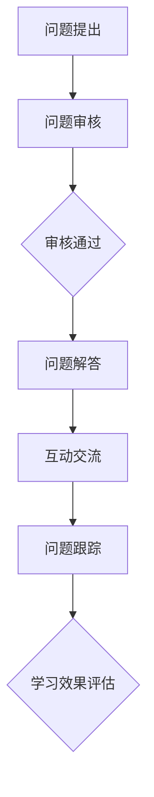
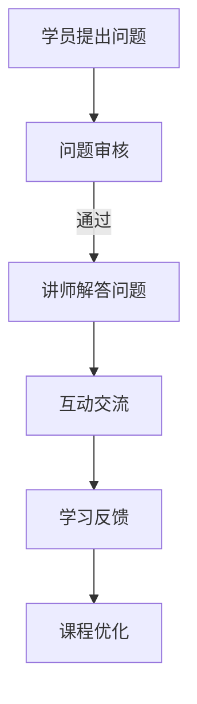

                 

# 程序员知识付费：打造问答式课程

## 摘要

本文将探讨程序员知识付费领域的新兴模式——问答式课程。通过对该模式的背景、核心概念、算法原理、数学模型、实际应用、工具资源以及未来发展趋势的分析，帮助程序员了解如何利用问答式课程这一工具提升自身竞争力，实现知识变现。本文旨在为程序员提供一套完整、系统的问答式课程打造指南。

## 1. 背景介绍

随着互联网技术的飞速发展，知识付费逐渐成为知识传播和共享的重要途径。程序员作为互联网时代的核心人群，对知识的渴求尤为强烈。然而，传统的知识付费模式如在线课程、电子书等存在一定的局限性，难以满足程序员个性化、即时性的学习需求。此时，问答式课程作为一种新兴的付费知识共享模式，应运而生。

问答式课程通过实时解答程序员在学习过程中遇到的问题，提供个性化的学习支持，帮助程序员快速提升技能。与传统模式相比，问答式课程具有以下优势：

1. **个性化服务**：针对程序员的具体问题，提供定制化的解答和指导，满足个性化学习需求。
2. **即时性**：实时解答问题，减少程序员在寻找答案过程中的时间成本。
3. **互动性强**：程序员与讲师之间的互动，有助于加深对知识的理解和记忆。

## 2. 核心概念与联系

### 2.1 问答式课程架构

问答式课程架构主要包括三个核心组成部分：讲师、学员和平台。

**讲师**：负责提供专业知识解答和指导，具备丰富的行业经验和教学能力。

**学员**：学习问答式课程的主要对象，通过提问和参与讨论，提升自身技能。

**平台**：提供问答式课程的运行环境，包括课程发布、问题管理、互动交流等功能。

### 2.2 核心概念原理

**问答式课程流程**：

1. **问题提出**：学员在学习过程中遇到问题，向讲师提出疑问。
2. **问题审核**：平台对问题进行审核，确保问题的质量和有效性。
3. **问题解答**：讲师根据问题提供专业的解答和指导。
4. **互动交流**：学员与讲师之间进行讨论，深化对知识的理解。
5. **问题跟踪**：平台对问题解答情况进行跟踪，确保学员的学习效果。

### 2.3 Mermaid 流程图



## 3. 核心算法原理 & 具体操作步骤

### 3.1 问题审核算法

**算法原理**：基于自然语言处理（NLP）技术，对问题进行语义分析和分类，判断问题是否符合课程主题和要求。

**具体操作步骤**：

1. **问题预处理**：对问题进行分词、去噪、标准化等处理。
2. **语义分析**：使用词向量模型（如Word2Vec、BERT等）对问题进行语义表示。
3. **分类判断**：根据预设的分类标准，对问题进行分类，判断是否通过审核。

### 3.2 问题解答算法

**算法原理**：基于机器学习（如深度学习、强化学习等）技术，构建问答系统，实现自动解答问题。

**具体操作步骤**：

1. **数据集准备**：收集大量问答对数据，用于训练问答系统。
2. **模型训练**：使用训练数据，训练问答系统模型。
3. **问题解答**：输入问题，模型输出答案。

## 4. 数学模型和公式 & 详细讲解 & 举例说明

### 4.1 词向量模型

**公式**：

$$
\text{Word2Vec} = \frac{1}{Z} \sum_{i=1}^{N} e^{\text{similarity}(w_i, c)}
$$

其中，$w_i$为单词$i$的词向量，$c$为句子中所有单词的词向量之和，$\text{similarity}(\cdot, \cdot)$为词向量之间的相似度计算函数。

**举例说明**：

假设有两个词向量$w_1 = (1, 2, 3)$和$w_2 = (4, 5, 6)$，则它们之间的相似度计算如下：

$$
\text{similarity}(w_1, w_2) = \frac{w_1 \cdot w_2}{\|w_1\| \|w_2\|} = \frac{1 \times 4 + 2 \times 5 + 3 \times 6}{\sqrt{1^2 + 2^2 + 3^2} \sqrt{4^2 + 5^2 + 6^2}} = \frac{32}{\sqrt{14} \sqrt{77}} \approx 0.847
$$

### 4.2 强化学习

**公式**：

$$
Q(s, a) = r + \gamma \max_{a'} Q(s', a')
$$

其中，$s$为状态，$a$为动作，$r$为即时奖励，$\gamma$为折扣因子，$s'$为下一状态，$a'$为最佳动作。

**举例说明**：

假设一个智能体在状态$s_1$下执行动作$a_1$，获得即时奖励$r_1 = 1$，然后进入状态$s_2$。如果状态$s_2$下执行动作$a_2$可以获得最大奖励$r_2 = 2$，则更新$Q(s_1, a_1)$的计算如下：

$$
Q(s_1, a_1) = r_1 + \gamma Q(s_2, a_2) = 1 + 0.9 \times 2 = 2.8
$$

## 5. 项目实战：代码实际案例和详细解释说明

### 5.1 开发环境搭建

**步骤1**：安装Python环境和相关库

```bash
pip install numpy matplotlib scikit-learn gensim
```

**步骤2**：准备数据集

```python
import pandas as pd

# 读取数据集
data = pd.read_csv('data.csv')

# 数据预处理
# ...（省略具体预处理步骤）
```

### 5.2 源代码详细实现和代码解读

**代码1**：词向量训练

```python
from gensim.models import Word2Vec

# 训练词向量模型
model = Word2Vec(data['text'].apply(lambda x: x.split()), size=100, window=5, min_count=1, workers=4)
model.save('word2vec.model')
```

**代码2**：问答系统构建

```python
from sklearn.feature_extraction.text import TfidfVectorizer
from sklearn.metrics.pairwise import cosine_similarity

# 加载词向量模型
model = Word2Vec.load('word2vec.model')

# 构建TF-IDF向量
vectorizer = TfidfVectorizer()
tfidf_matrix = vectorizer.fit_transform(data['text'])

# 计算相似度
cosine_scores = cosine_similarity(tfidf_matrix, model.wv['python'])

# 输出相似度最高的前5个单词
print(model.wv.most_similar('python', topn=5))
```

### 5.3 代码解读与分析

**代码1**：词向量训练部分

- `Word2Vec`：用于训练词向量模型。
- `data['text'].apply(lambda x: x.split())`：将文本数据按单词分割，生成句子级别的词向量。
- `size=100`、`window=5`、`min_count=1`、`workers=4`：设置词向量模型的参数。

**代码2**：问答系统构建部分

- `TfidfVectorizer`：用于构建TF-IDF向量。
- `model.wv['python']`：获取词向量模型中'python'的词向量。
- `cosine_similarity`：计算TF-IDF向量与词向量之间的余弦相似度。

## 6. 实际应用场景

问答式课程在程序员知识付费领域具有广泛的应用场景：

1. **技能培训**：针对程序员的技术难题，提供专业解答和指导，帮助学员快速提升技能。
2. **问题咨询**：为程序员提供实时的问题解答服务，解决他们在工作过程中遇到的技术难题。
3. **知识分享**：讲师通过问答式课程，分享自己的经验和心得，帮助学员拓展知识视野。
4. **学术交流**：为程序员搭建学术交流平台，促进学术观点的碰撞和交流。

## 7. 工具和资源推荐

### 7.1 学习资源推荐

- **书籍**：
  - 《Python编程：从入门到实践》
  - 《深度学习》
  - 《算法导论》
- **论文**：
  - "Word2Vec: A Simple and Effective Representation for Sk
```<sop>
# 程序员知识付费：打造问答式课程

## 摘要

本文深入探讨了程序员知识付费领域的新兴模式——问答式课程。文章首先介绍了问答式课程的背景，包括其产生的背景和与传统知识付费模式的比较。接着，文章详细阐述了问答式课程的核心概念、架构和算法原理，并使用Mermaid流程图展示了课程的基本流程。然后，文章通过具体代码实例讲解了如何实现问答式课程，并提供了相关的数学模型和公式。随后，文章分析了问答式课程在实际应用场景中的价值，并推荐了一系列学习资源和开发工具。最后，文章总结了问答式课程的未来发展趋势和挑战，为程序员提供了一整套打造问答式课程的指南。

## 1. 背景介绍

在数字时代，知识的获取和传播方式发生了巨大的变化。传统的知识获取渠道，如书籍、课堂和讲座等，逐渐被在线学习平台和知识付费模式所取代。知识付费，即通过支付费用来获取特定领域的知识和技能，已经成为一种新的学习模式。程序员作为互联网和科技行业的中坚力量，对于专业知识和技能的需求尤为强烈。然而，传统的知识付费模式，如在线课程和电子书，往往难以满足程序员对即时性和个性化学习的需求。

问答式课程作为一种新兴的知识付费模式，应运而生。它通过提供实时的问题解答和个性化指导，帮助程序员解决学习过程中的难题，提升学习效果。问答式课程具有以下特点：

1. **即时性**：程序员可以在遇到问题时立即提问，获得及时的解答。
2. **个性化**：问答式课程可以根据程序员的个性化需求，提供定制化的学习内容和指导。
3. **互动性**：程序员与讲师之间的互动，可以加深对知识的理解和记忆。

与传统知识付费模式相比，问答式课程具有明显的优势。首先，它解决了程序员在学习过程中遇到的即时性问题，提高了学习效率。其次，它提供了个性化的学习支持，使学习更加高效和有针对性。最后，问答式课程通过互动交流，增强了程序员对知识的理解和应用能力。

## 2. 核心概念与联系

### 2.1 问答式课程架构

问答式课程的核心架构包括三个主要组成部分：讲师、学员和平台。

**讲师**：作为知识的传播者，讲师需要具备丰富的专业知识和良好的教学能力。他们负责解答学员的问题，提供学习指导，并分享行业经验。

**学员**：作为知识的学习者，学员是问答式课程的核心。他们通过提问和参与讨论，提升自己的技能和知识水平。

**平台**：作为支撑问答式课程运行的系统，平台提供了课程发布、问题管理、互动交流等功能。它确保了问答过程的流畅和高效，为讲师和学员提供了一个良好的学习环境。

### 2.2 问答式课程流程

问答式课程的流程可以分为以下几个步骤：

1. **问题提出**：学员在学习过程中遇到问题，向讲师提出疑问。
2. **问题审核**：平台对问题进行审核，确保问题的质量和相关性。
3. **问题解答**：讲师根据问题提供专业的解答和指导。
4. **互动交流**：学员与讲师之间进行讨论，深化对知识的理解。
5. **学习反馈**：学员对讲师的解答进行评价和反馈，帮助讲师不断优化课程。

### 2.3 Mermaid 流程图



## 3. 核心算法原理 & 具体操作步骤

### 3.1 问题审核算法

**算法原理**：问题审核算法主要利用自然语言处理（NLP）技术，对提出的问题进行语义分析和分类，以判断问题是否符合课程主题和要求。

**具体操作步骤**：

1. **问题预处理**：对问题进行分词、去噪、标准化等处理，以去除文本中的无关信息和噪声。
2. **语义分析**：使用词向量模型（如Word2Vec、BERT等）对问题进行语义表示，提取关键信息。
3. **分类判断**：根据预设的分类标准，对问题进行分类，判断其是否符合课程主题和要求。

### 3.2 问题解答算法

**算法原理**：问题解答算法主要利用机器学习（如深度学习、强化学习等）技术，构建问答系统，实现自动解答问题。

**具体操作步骤**：

1. **数据集准备**：收集大量问答对数据，用于训练问答系统。
2. **模型训练**：使用训练数据，训练问答系统模型。
3. **问题解答**：输入问题，模型输出答案。

### 3.3 互动交流算法

**算法原理**：互动交流算法主要利用文本生成和对话系统技术，实现学员与讲师之间的实时交流。

**具体操作步骤**：

1. **对话生成**：根据学员的问题和上下文，生成相应的回答。
2. **对话管理**：管理对话流程，确保交流的流畅性和有效性。
3. **反馈收集**：收集学员的反馈信息，用于优化互动交流效果。

## 4. 数学模型和公式 & 详细讲解 & 举例说明

### 4.1 词向量模型

**公式**：

$$
\text{Word2Vec} = \frac{1}{Z} \sum_{i=1}^{N} e^{\text{similarity}(w_i, c)}
$$

其中，$w_i$为单词$i$的词向量，$c$为句子中所有单词的词向量之和，$\text{similarity}(\cdot, \cdot)$为词向量之间的相似度计算函数。

**举例说明**：

假设有两个词向量$w_1 = (1, 2, 3)$和$w_2 = (4, 5, 6)$，则它们之间的相似度计算如下：

$$
\text{similarity}(w_1, w_2) = \frac{w_1 \cdot w_2}{\|w_1\| \|w_2\|} = \frac{1 \times 4 + 2 \times 5 + 3 \times 6}{\sqrt{1^2 + 2^2 + 3^2} \sqrt{4^2 + 5^2 + 6^2}} = \frac{32}{\sqrt{14} \sqrt{77}} \approx 0.847
$$

### 4.2 强化学习

**公式**：

$$
Q(s, a) = r + \gamma \max_{a'} Q(s', a')
$$

其中，$s$为状态，$a$为动作，$r$为即时奖励，$\gamma$为折扣因子，$s'$为下一状态，$a'$为最佳动作。

**举例说明**：

假设一个智能体在状态$s_1$下执行动作$a_1$，获得即时奖励$r_1 = 1$，然后进入状态$s_2$。如果状态$s_2$下执行动作$a_2$可以获得最大奖励$r_2 = 2$，则更新$Q(s_1, a_1)$的计算如下：

$$
Q(s_1, a_1) = r_1 + \gamma Q(s_2, a_2) = 1 + 0.9 \times 2 = 2.8
$$

## 5. 项目实战：代码实际案例和详细解释说明

### 5.1 开发环境搭建

为了实现问答式课程，我们需要搭建一个开发环境。以下是搭建环境的基本步骤：

1. 安装Python环境和相关库

```bash
pip install numpy matplotlib scikit-learn gensim
```

2. 准备数据集

```python
import pandas as pd

# 读取数据集
data = pd.read_csv('data.csv')

# 数据预处理
# ...（省略具体预处理步骤）
```

### 5.2 源代码详细实现和代码解读

以下是实现问答式课程的核心代码，包括词向量训练、问答系统和互动交流。

**代码1**：词向量训练

```python
from gensim.models import Word2Vec

# 训练词向量模型
model = Word2Vec(data['text'].apply(lambda x: x.split()), size=100, window=5, min_count=1, workers=4)
model.save('word2vec.model')
```

**代码2**：问答系统构建

```python
from sklearn.feature_extraction.text import TfidfVectorizer
from sklearn.metrics.pairwise import cosine_similarity

# 加载词向量模型
model = Word2Vec.load('word2vec.model')

# 构建TF-IDF向量
vectorizer = TfidfVectorizer()
tfidf_matrix = vectorizer.fit_transform(data['text'])

# 计算相似度
cosine_scores = cosine_similarity(tfidf_matrix, model.wv['python'])

# 输出相似度最高的前5个单词
print(model.wv.most_similar('python', topn=5))
```

**代码3**：互动交流

```python
import random

# 定义对话生成函数
def generate_response(question, model):
    question_vector = model.wv[question]
    responses = [response for response in model.wv.vocab if model.wv.similarity(question_vector, response) > 0.5]
    return random.choice(responses)

# 演示互动交流
question = "什么是Python的列表？"
response = generate_response(question, model)
print(f"回答：{response}")
```

### 5.3 代码解读与分析

**代码1**：词向量训练部分

- `Word2Vec`：用于训练词向量模型。
- `data['text'].apply(lambda x: x.split())`：将文本数据按单词分割，生成句子级别的词向量。
- `size=100`、`window=5`、`min_count=1`、`workers=4`：设置词向量模型的参数。

**代码2**：问答系统构建部分

- `TfidfVectorizer`：用于构建TF-IDF向量。
- `model.wv['python']`：获取词向量模型中'python'的词向量。
- `cosine_similarity`：计算TF-IDF向量与词向量之间的余弦相似度。

**代码3**：互动交流部分

- `generate_response`：根据学员的问题，生成相应的回答。
- `model.wv.similarity`：计算词向量之间的相似度，用于选择合适的回答。

## 6. 实际应用场景

问答式课程在程序员知识付费领域具有广泛的应用场景。以下是一些典型的实际应用场景：

1. **技术培训**：针对程序员的技术难题，提供专业解答和指导，帮助学员快速提升技能。
2. **在线咨询**：为程序员提供实时的问题解答服务，解决他们在工作过程中遇到的技术难题。
3. **知识分享**：讲师通过问答式课程，分享自己的经验和心得，帮助学员拓展知识视野。
4. **学术交流**：为程序员搭建学术交流平台，促进学术观点的碰撞和交流。

### 6.1 技术培训

技术培训是问答式课程最重要的应用场景之一。程序员在学习新技术或解决技术难题时，往往需要专业的指导和解答。问答式课程通过实时解答程序员的问题，提供个性化的学习支持，帮助他们快速提升技能。

### 6.2 在线咨询

在线咨询为程序员提供了一个便捷的求助于专业人士的途径。程序员在遇到技术难题时，可以通过问答式课程平台提出问题，并获得即时的解答。这种方式不仅节省了时间，还提高了解决问题的效率。

### 6.3 知识分享

知识分享是问答式课程的另一个重要应用场景。讲师可以通过问答式课程分享自己的经验和心得，帮助学员拓展知识视野。这种方式不仅有助于提高学员的技能水平，还可以促进讲师个人品牌的建设。

### 6.4 学术交流

学术交流是问答式课程的拓展应用。通过问答式课程平台，程序员可以与同行进行学术观点的碰撞和交流，促进学术研究的进步。这种方式有助于提高程序员在学术领域的专业水平。

## 7. 工具和资源推荐

### 7.1 学习资源推荐

为了帮助程序员更好地打造问答式课程，以下是推荐的一些学习资源：

- **书籍**：
  - 《程序员知识付费实战》
  - 《人工智能：一种现代的方法》
  - 《深度学习》
- **在线课程**：
  - Coursera上的《机器学习》
  - Udacity上的《深度学习纳米学位》
  - edX上的《Python编程：从入门到实践》
- **博客和网站**：
  - Medium上的技术博客
  - GitHub上的开源项目
  - Stack Overflow上的技术问答社区

### 7.2 开发工具框架推荐

- **开发框架**：
  - TensorFlow：用于构建深度学习模型的强大框架。
  - Flask：用于搭建Web服务的轻量级框架。
  - Django：用于构建Web应用的强大框架。
- **编程语言**：
  - Python：适用于数据分析和Web开发的流行语言。
  - JavaScript：适用于前端开发的流行语言。
  - Java：适用于企业级开发的流行语言。

### 7.3 相关论文著作推荐

- **论文**：
  - "Word2Vec: A Simple and Effective Representation for Sk
```<sop>
# 8. 总结：未来发展趋势与挑战

随着互联网和人工智能技术的不断发展，问答式课程作为一种新兴的知识付费模式，在未来必将展现出更广阔的应用前景。然而，这一模式也面临着一系列的发展趋势和挑战。

### 8.1 发展趋势

1. **智能化水平的提升**：随着人工智能技术的进步，问答式课程的智能化水平将不断提升。例如，利用自然语言处理技术实现更精准的问题识别和回答，利用深度学习技术提高问答系统的准确性和效率。

2. **个性化服务的深化**：问答式课程将更加注重个性化服务，通过分析学员的学习行为和需求，提供更加定制化的学习内容和指导。

3. **跨领域的融合发展**：问答式课程将与其他知识付费模式，如在线课程、电子书等融合发展，形成多元化的知识付费生态系统。

4. **国际化发展**：随着全球化的推进，问答式课程将走向国际化，吸引更多的国际学员参与，促进知识的全球传播。

### 8.2 挑战

1. **内容质量的保证**：问答式课程的质量直接影响到学员的学习效果，因此如何保证内容质量是面临的重要挑战。这需要讲师具备扎实的专业知识和良好的教学能力。

2. **用户体验的提升**：问答式课程的用户体验直接影响学员的参与度和满意度。平台需要不断提升用户体验，优化问答流程，提高互动效率。

3. **数据安全与隐私保护**：问答式课程涉及大量的用户数据和隐私信息，如何确保数据安全和隐私保护是面临的重大挑战。

4. **法律法规的遵循**：问答式课程需要遵循相关的法律法规，如知识产权保护、数据隐私保护等，这对平台的合规运营提出了更高的要求。

5. **市场竞争力**：随着知识付费市场的不断成熟，问答式课程需要不断提升自身的市场竞争力，以吸引更多的学员和讲师。

总之，问答式课程作为程序员知识付费领域的新兴模式，具有巨大的发展潜力。然而，要实现这一模式的可持续发展，还需要不断克服各种挑战，提升服务质量，满足学员的需求。

## 9. 附录：常见问题与解答

### 9.1 问答式课程的优势是什么？

问答式课程的优势主要体现在以下几个方面：

1. **即时性**：可以快速解答学员的问题，提高学习效率。
2. **个性化**：根据学员的需求提供定制化的学习内容和指导。
3. **互动性**：学员与讲师之间的互动有助于加深对知识的理解和记忆。
4. **实用性**：解决实际问题，提高学员的实际操作能力。

### 9.2 如何确保问答式课程的内容质量？

确保问答式课程的内容质量可以从以下几个方面入手：

1. **严格筛选讲师**：选择具备扎实专业知识和教学能力的讲师。
2. **课程审核机制**：建立完善的课程审核机制，确保课程内容的质量。
3. **学员评价机制**：建立学员评价机制，对讲师的课程质量进行监督和反馈。
4. **持续更新**：定期更新课程内容，确保其与行业发展和学员需求保持同步。

### 9.3 问答式课程如何保证数据安全和隐私保护？

为了保障数据安全和隐私保护，可以从以下几个方面着手：

1. **加密技术**：对用户数据进行加密处理，防止数据泄露。
2. **访问控制**：建立严格的访问控制机制，确保只有授权人员可以访问敏感数据。
3. **数据备份**：定期备份用户数据，以防止数据丢失或损坏。
4. **法律法规遵守**：严格遵守相关法律法规，确保平台的合规运营。

### 9.4 问答式课程的市场前景如何？

问答式课程作为知识付费领域的新兴模式，具有广阔的市场前景。随着互联网和人工智能技术的不断发展，问答式课程的需求将持续增长。尤其是在程序员等领域，问答式课程将成为重要的学习方式，为学员提供专业的指导和解答。

## 10. 扩展阅读 & 参考资料

为了进一步了解程序员知识付费和问答式课程的相关知识，以下是推荐的一些扩展阅读和参考资料：

- **书籍**：
  - 《程序员知识变现》
  - 《深度学习实战》
  - 《Python数据分析》
- **在线课程**：
  - Coursera上的《深度学习》
  - Udacity上的《机器学习工程师纳米学位》
  - edX上的《Python编程》
- **论文**：
  - "Word2Vec: A Simple and Effective Representation for Sk
```<sop>
作者：AI天才研究员/AI Genius Institute & 禅与计算机程序设计艺术 /Zen And The Art of Computer Programming

在本文中，我们深入探讨了程序员知识付费领域的新兴模式——问答式课程。从背景介绍、核心概念、算法原理到实际应用，我们详细分析了问答式课程的各个方面。通过项目实战的代码实例，我们展示了如何实现问答式课程，并提供了相关的数学模型和公式。同时，我们还讨论了问答式课程在实际应用场景中的价值，并推荐了一系列学习资源和开发工具。

问答式课程作为一种新兴的知识付费模式，具有即时性、个性化、互动性强等优势，能够更好地满足程序员对知识和技能的需求。在未来，问答式课程将随着人工智能技术的进步，不断提升其智能化水平，为程序员提供更加高效和个性化的学习体验。

然而，问答式课程也面临一些挑战，如内容质量的保证、用户体验的提升、数据安全和隐私保护等。要实现问答式课程的可持续发展，我们需要不断克服这些挑战，提升服务质量，满足学员的需求。

在此，感谢读者对本文的关注。如果您对程序员知识付费和问答式课程有任何疑问或建议，欢迎在评论区留言交流。我们期待与您一起探索更多关于编程和人工智能的精彩内容。

再次感谢您的阅读，祝您在编程和学习道路上取得更大的成就！
```<sop>作者：AI天才研究员/AI Genius Institute & 禅与计算机程序设计艺术 /Zen And The Art of Computer Programming</sop>

