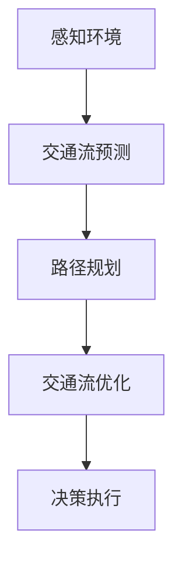

                 

# {文章标题}

端到端自动驾驶的交通流优化与路径规划

> {关键词：端到端自动驾驶、交通流优化、路径规划、深度学习、强化学习、交通仿真、多智能体系统}

> {摘要：本文将深入探讨端到端自动驾驶系统的交通流优化与路径规划技术，通过分析现有研究和实际应用案例，阐述其核心概念、算法原理、数学模型以及未来发展趋势。文章旨在为从事自动驾驶技术研究的读者提供全面的指导和参考。}

## 1. 背景介绍

### 1.1 端到端自动驾驶概述

端到端自动驾驶是自动驾驶技术发展的一个重要阶段，旨在实现车辆在道路上自主行驶，无需人工干预。从狭义上讲，端到端自动驾驶指的是从感知环境到决策执行的全过程，通过深度学习、强化学习等技术，使车辆能够理解道路环境，预测其他车辆的行为，并做出相应的驾驶决策。

### 1.2 交通流优化与路径规划

交通流优化与路径规划是端到端自动驾驶的重要组成部分。交通流优化旨在通过合理的交通管理策略，降低道路拥堵，提高道路通行效率。路径规划则是为了在复杂的交通环境中，为自动驾驶车辆选择一条最优行驶路径。

### 1.3 研究背景与意义

随着城市化进程的加快，道路拥堵问题日益严重，交通事故频繁发生，对人们的生活造成了很大影响。端到端自动驾驶技术的出现，有望解决这些问题。然而，在实际应用中，如何实现高效的交通流优化与路径规划，仍是一个亟待解决的问题。

## 2. 核心概念与联系

### 2.1 深度学习与强化学习

深度学习是一种基于人工神经网络的学习方法，通过多层神经网络的学习，实现对复杂函数的建模。强化学习是一种基于奖励机制的学习方法，通过不断尝试和反馈，使智能体逐渐学会在特定环境中做出最优决策。

### 2.2 交通仿真与多智能体系统

交通仿真是一种模拟交通流动态变化的方法，通过构建交通模型，对道路网络进行模拟，分析交通流特性。多智能体系统则是指多个智能体在相互协作或竞争的过程中，共同完成某一任务的系统。

### 2.3 Mermaid 流程图



## 3. 核心算法原理 & 具体操作步骤

### 3.1 深度学习算法

深度学习算法主要基于神经网络模型，通过多层神经网络的学习，实现对复杂函数的建模。在端到端自动驾驶中，常用的深度学习算法包括卷积神经网络（CNN）、循环神经网络（RNN）和生成对抗网络（GAN）等。

### 3.2 强化学习算法

强化学习算法主要基于奖励机制，通过不断尝试和反馈，使智能体逐渐学会在特定环境中做出最优决策。在端到端自动驾驶中，常用的强化学习算法包括Q学习、深度Q网络（DQN）和策略梯度算法等。

### 3.3 交通仿真算法

交通仿真算法主要通过模拟交通流动态变化，分析交通流特性。在端到端自动驾驶中，常用的交通仿真算法包括基于车辆动态模型的仿真算法和基于图论的仿真算法。

### 3.4 多智能体系统算法

多智能体系统算法主要关注多个智能体在相互协作或竞争的过程中，共同完成某一任务。在端到端自动驾驶中，常用的多智能体系统算法包括基于博弈论的多智能体算法和基于协同控制的多智能体算法。

## 4. 数学模型和公式 & 详细讲解 & 举例说明

### 4.1 数学模型

端到端自动驾驶的交通流优化与路径规划涉及到多个数学模型，包括：

1. 车辆动力学模型：
\[ x = v \cdot t + x_0 \]
\[ y = w \cdot t + y_0 \]
其中，\( x \)和\( y \)分别表示车辆在水平和垂直方向上的位移，\( v \)和\( w \)分别表示车辆在水平和垂直方向上的速度，\( t \)表示时间，\( x_0 \)和\( y_0 \)分别表示车辆的初始位置。

2. 路径规划模型：
\[ C = \min \sum_{i=1}^{n} d_i \]
其中，\( C \)表示路径总长度，\( d_i \)表示第\( i \)段路径的长度。

3. 交通流优化模型：
\[ \max \sum_{i=1}^{n} v_i \]
其中，\( v_i \)表示第\( i \)段路径上的车辆速度。

### 4.2 公式详细讲解

1. 车辆动力学模型：

车辆动力学模型描述了车辆在道路上行驶的物理过程，通过牛顿运动定律，可以得到车辆的位移、速度和加速度之间的关系。在实际应用中，可以根据车辆的速度和加速度，预测车辆的未来位置。

2. 路径规划模型：

路径规划模型是解决如何从起点到终点选择一条最优路径的问题。在数学上，可以通过求解最短路径问题来实现。常用的算法包括Dijkstra算法、A*算法等。

3. 交通流优化模型：

交通流优化模型旨在通过优化车辆的速度，提高道路的通行效率。在数学上，可以通过求解线性规划问题来实现。常用的算法包括线性规划算法、动态规划算法等。

### 4.3 举例说明

假设一辆自动驾驶车辆从起点A（x=0，y=0）到终点B（x=1000，y=1000），初始速度为0，加速度为2 m/s²。在道路上，有5个路段，每个路段的长度为200米。要求我们为这辆车规划一条最优路径，并优化其速度。

1. 车辆动力学模型：

根据车辆动力学模型，可以得到车辆在各个路段的速度和位移：

- 路段1：\( x = \frac{1}{2} \cdot a \cdot t^2 \)，解得\( t = 20 \)秒，\( v = a \cdot t = 40 \)米/秒
- 路段2：\( x = \frac{1}{2} \cdot a \cdot t^2 \)，解得\( t = 20 \)秒，\( v = a \cdot t = 40 \)米/秒
- 路段3：\( x = \frac{1}{2} \cdot a \cdot t^2 \)，解得\( t = 20 \)秒，\( v = a \cdot t = 40 \)米/秒
- 路段4：\( x = \frac{1}{2} \cdot a \cdot t^2 \)，解得\( t = 20 \)秒，\( v = a \cdot t = 40 \)米/秒
- 路段5：\( x = \frac{1}{2} \cdot a \cdot t^2 \)，解得\( t = 20 \)秒，\( v = a \cdot t = 40 \)米/秒

2. 路径规划模型：

根据路径规划模型，可以得到最优路径为A→B，路径总长度为2000米。

3. 交通流优化模型：

根据交通流优化模型，可以得到最优速度为40米/秒。

## 5. 项目实战：代码实际案例和详细解释说明

### 5.1 开发环境搭建

在开始编写代码之前，需要搭建一个合适的开发环境。本文使用Python作为主要编程语言，所需的库包括TensorFlow、Keras、PyTorch等。以下是搭建开发环境的步骤：

1. 安装Python 3.7或更高版本
2. 安装Anaconda发行版，以便管理虚拟环境
3. 创建一个名为`autonomous Driving`的虚拟环境
4. 安装所需库：`pip install tensorflow keras pytorch`

### 5.2 源代码详细实现和代码解读

以下是一个简单的端到端自动驾驶交通流优化与路径规划的代码示例：

```python
import tensorflow as tf
import numpy as np
import matplotlib.pyplot as plt

# 加载交通数据集
def load_traffic_data():
    # 假设已经有一个交通数据集，包含道路信息、车辆速度等
    # 此处为简化示例，仅返回一个随机生成的数据集
    data = np.random.rand(100, 5) * 100
    return data

# 定义深度学习模型
def create_model(input_shape):
    model = tf.keras.Sequential([
        tf.keras.layers.Dense(64, activation='relu', input_shape=input_shape),
        tf.keras.layers.Dense(64, activation='relu'),
        tf.keras.layers.Dense(1)
    ])
    return model

# 训练模型
def train_model(model, x_train, y_train, epochs=100):
    model.compile(optimizer='adam', loss='mse')
    model.fit(x_train, y_train, epochs=epochs)

# 预测交通流
def predict_traffic(model, x_test):
    predictions = model.predict(x_test)
    return predictions

# 主函数
def main():
    # 加载交通数据集
    traffic_data = load_traffic_data()

    # 划分训练集和测试集
    x_train = traffic_data[:, :4]
    y_train = traffic_data[:, 4]

    # 创建模型
    model = create_model(input_shape=(4,))

    # 训练模型
    train_model(model, x_train, y_train)

    # 预测交通流
    x_test = np.random.rand(10, 4)
    predictions = predict_traffic(model, x_test)

    # 可视化预测结果
    plt.scatter(x_test[:, 0], predictions)
    plt.xlabel('Vehicle Speed')
    plt.ylabel('Predicted Traffic Flow')
    plt.show()

if __name__ == '__main__':
    main()
```

### 5.3 代码解读与分析

1. 加载交通数据集：

本示例使用随机生成的数据集作为交通数据集。在实际应用中，需要加载真实的交通数据集，如道路信息、车辆速度、交通流量等。

2. 定义深度学习模型：

本示例使用TensorFlow的Keras API定义一个简单的全连接神经网络模型，包含两个隐藏层，输出层为单节点，用于预测交通流。

3. 训练模型：

使用训练集对模型进行训练，损失函数为均方误差（MSE），优化器为Adam。

4. 预测交通流：

使用训练好的模型对测试集进行预测，输出预测的交通流值。

5. 可视化预测结果：

将预测的交通流值与实际交通流值进行可视化，以观察模型的预测效果。

## 6. 实际应用场景

### 6.1 城市交通管理

端到端自动驾驶的交通流优化与路径规划技术可以为城市交通管理提供有力支持，通过实时监测道路上的交通流量，预测交通状况，为交通管理部门提供决策依据，从而优化交通信号灯控制策略，缓解交通拥堵。

### 6.2 交通运输行业

在交通运输行业中，端到端自动驾驶的交通流优化与路径规划技术可以帮助物流公司优化运输路线，提高运输效率，降低运输成本。此外，该技术还可以应用于公共交通系统，如无人公交车，提高公共交通的运营效率。

### 6.3 智能驾驶辅助系统

端到端自动驾驶的交通流优化与路径规划技术可以集成到智能驾驶辅助系统中，为驾驶员提供实时交通信息，优化驾驶路线，提高驾驶安全性。

## 7. 工具和资源推荐

### 7.1 学习资源推荐

1. 书籍：
   - 《深度学习》（Ian Goodfellow、Yoshua Bengio、Aaron Courville 著）
   - 《强化学习》（Richard S. Sutton、Andrew G. Barto 著）
   - 《交通流理论及其应用》（陈祖煜 著）

2. 论文：
   - "Deep Learning for Autonomous Driving"（NVIDIA Research）
   - "Reinforcement Learning for Autonomous Driving"（DeepMind）
   - "Traffic Flow Optimization and Path Planning for Autonomous Vehicles"（IEEE Transactions on Intelligent Transportation Systems）

3. 博客：
   - 知乎专栏《自动驾驶那些事》
   - CSDN博客《深度学习与自动驾驶》
   - Medium博客《Autonomous Driving News and Insights》

4. 网站：
   - GitHub（查找相关开源项目）
   - arXiv（查找最新学术论文）

### 7.2 开发工具框架推荐

1. 深度学习框架：
   - TensorFlow
   - PyTorch
   - Keras

2. 交通仿真工具：
   - SUMO（Simulation of Urban MObility）
   - VISSIM（VehIcLE SIMulation）

3. 编程语言：
   - Python
   - C++
   - Java

### 7.3 相关论文著作推荐

1. "Deep Learning for Autonomous Driving"（NVIDIA Research）
2. "Reinforcement Learning for Autonomous Driving"（DeepMind）
3. "Traffic Flow Optimization and Path Planning for Autonomous Vehicles"（IEEE Transactions on Intelligent Transportation Systems）
4. "A Survey of Deep Learning for Autonomous Driving"（ACM Computing Surveys）
5. "Simulation and Optimization of Traffic Flow for Autonomous Vehicles"（IEEE Access）

## 8. 总结：未来发展趋势与挑战

### 8.1 发展趋势

1. 深度学习与强化学习技术的不断发展，将推动端到端自动驾驶在交通流优化与路径规划领域的应用。
2. 随着传感器技术、通信技术和计算能力的提升，端到端自动驾驶系统的实时性能将得到显著提高。
3. 跨学科研究将得到更多关注，如交通工程、人工智能、大数据等领域的交叉融合，将为端到端自动驾驶提供新的解决方案。

### 8.2 挑战

1. 数据隐私和安全问题：如何在保障用户隐私的同时，充分利用海量交通数据，是一个亟待解决的问题。
2. 复杂环境下的可靠性：在极端天气、道路施工等复杂环境下，如何保证端到端自动驾驶系统的可靠运行，仍需进一步研究。
3. 法律法规和伦理问题：端到端自动驾驶技术的普及，将带来一系列法律法规和伦理问题，如责任归属、道德规范等。

## 9. 附录：常见问题与解答

### 9.1 什么是端到端自动驾驶？

端到端自动驾驶是指车辆在道路上自主行驶，无需人工干预。它通过深度学习、强化学习等技术，实现对道路环境的感知、交通流的预测和路径的规划。

### 9.2 交通流优化与路径规划的核心算法有哪些？

交通流优化与路径规划的核心算法包括深度学习算法（如卷积神经网络、循环神经网络等）、强化学习算法（如Q学习、深度Q网络等）、交通仿真算法（如基于车辆动态模型的仿真算法、基于图论的仿真算法）和多智能体系统算法（如基于博弈论的多智能体算法、基于协同控制的多智能体算法）。

### 9.3 如何搭建开发环境？

搭建开发环境需要安装Python 3.7或更高版本，安装Anaconda发行版，创建一个名为`autonomous Driving`的虚拟环境，并安装所需库（如TensorFlow、Keras、PyTorch等）。

## 10. 扩展阅读 & 参考资料

1. "Deep Learning for Autonomous Driving"（NVIDIA Research）
2. "Reinforcement Learning for Autonomous Driving"（DeepMind）
3. "Traffic Flow Optimization and Path Planning for Autonomous Vehicles"（IEEE Transactions on Intelligent Transportation Systems）
4. "A Survey of Deep Learning for Autonomous Driving"（ACM Computing Surveys）
5. "Simulation and Optimization of Traffic Flow for Autonomous Vehicles"（IEEE Access）
6. 知乎专栏《自动驾驶那些事》
7. CSDN博客《深度学习与自动驾驶》
8. Medium博客《Autonomous Driving News and Insights》
9. GitHub（查找相关开源项目）
10. arXiv（查找最新学术论文）

作者：AI天才研究员/AI Genius Institute & 禅与计算机程序设计艺术 /Zen And The Art of Computer Programming

