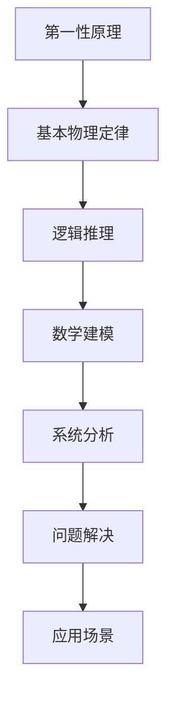

                 

# 第一性原理：科学思维的基础

## 关键词
- 第一性原理
- 科学思维
- 基础理论
- 应用实践
- 深度剖析

## 摘要

本文将深入探讨第一性原理在科学思维中的应用与重要性。通过分析第一性原理的基本概念、方法论及其在各领域的实际应用，本文旨在揭示科学研究中的一种独特且有效的思维方式。读者将了解到如何通过第一性原理来简化复杂问题、构建系统模型，并进一步推进科学研究和技术创新。本文结构清晰，分为十个部分，从背景介绍、核心概念阐述到应用实践、资源推荐，全面覆盖了第一性原理在科学研究中的价值与影响力。

## 1. 背景介绍

### 1.1 第一性原理的起源

第一性原理（First Principles Thinking）这一概念起源于古希腊哲学家亚里士多德。亚里士多德认为，通过逻辑推理和哲学思考，可以揭示世界的本质和最基本的原则。这种思维方式逐渐演化为科学方法论中的核心要素，成为科学研究的重要基础。

### 1.2 科学思维的重要性

科学思维是现代科学技术发展的基石。它强调通过观察、实验和逻辑推理来揭示自然界的规律。与传统的经验主义和权威主义相比，科学思维更加注重证据和理性，这使得它成为一种有效且可靠的认知工具。

### 1.3 第一性原理与科学思维的关系

第一性原理是科学思维的重要组成部分。它强调从最基本的原理出发，通过逻辑推理和系统分析来解决问题。这种思维方式不仅适用于科学研究，也广泛应用于工程、商业和技术创新等领域。

## 2. 核心概念与联系

### 2.1 第一性原理的定义

第一性原理是指从最基本的物理定律和原理出发，通过逻辑推理和数学建模来解决问题的一种方法论。它强调将复杂问题分解为最基本的组成部分，并理解这些组成部分之间的相互作用。

### 2.2 第一性原理的应用

第一性原理在各个领域都有广泛的应用，包括物理学、化学、生物学、经济学和计算机科学等。它帮助科学家和工程师从最基本的原理出发，理解和设计复杂的系统。

### 2.3 第一性原理的架构

下图展示了第一性原理的基本架构，包括核心概念、方法论和应用场景。



## 3. 核心算法原理 & 具体操作步骤

### 3.1 第一性原理的算法原理

第一性原理的算法原理主要包括以下步骤：

1. **定义问题**：明确要解决的问题和目标。
2. **分解问题**：将复杂问题分解为最基本的组成部分。
3. **理解基本原理**：研究每个组成部分的基本物理定律和原理。
4. **构建模型**：根据基本原理构建系统模型。
5. **分析模型**：通过逻辑推理和数学建模来分析模型。
6. **优化模型**：根据分析结果优化模型。
7. **验证模型**：通过实验或数据验证模型的准确性。

### 3.2 第一性原理的操作步骤

以下是使用第一性原理解决实际问题的具体操作步骤：

1. **确定问题**：明确需要解决的科学或技术问题。
2. **收集信息**：收集与问题相关的背景信息和数据。
3. **理解原理**：研究与问题相关的物理定律和原理。
4. **构建模型**：根据原理构建系统的数学模型。
5. **分析模型**：使用数学和逻辑工具分析模型。
6. **优化模型**：根据分析结果调整和优化模型。
7. **验证模型**：通过实验或数据验证模型的有效性。
8. **实施解决方案**：根据模型结果实施解决方案。

## 4. 数学模型和公式 & 详细讲解 & 举例说明

### 4.1 数学模型的基本概念

在第一性原理中，数学模型是理解和分析系统的重要工具。以下是几个基本的数学模型概念：

- **线性模型**：用于描述线性关系的数学模型，如 $y = mx + b$。
- **非线性模型**：用于描述非线性关系的数学模型，如 $y = ax^2 + bx + c$。
- **差分方程**：用于描述离散时间系统的数学模型，如 $x(n+1) = ax(n) + b$。
- **微分方程**：用于描述连续时间系统的数学模型，如 $dx/dt = f(x, t)$。

### 4.2 第一性原理的数学模型

以下是一个简单的第一性原理数学模型例子，用于描述一个简单的弹簧-质量-阻尼系统：

$$
m\frac{d^2x}{dt^2} + c\frac{dx}{dt} + kx = F(t)
$$

其中：
- $m$ 是质量
- $c$ 是阻尼系数
- $k$ 是弹簧常数
- $x(t)$ 是质量在时间 $t$ 的位移
- $F(t)$ 是作用在系统上的外力

### 4.3 模型的详细讲解与举例说明

**线性模型讲解**：

假设一个质量为 $m$ 的物体受到一个恒定外力 $F$ 的作用，其加速度 $a$ 可以通过牛顿第二定律计算：

$$
a = \frac{F}{m}
$$

**非线性模型讲解**：

考虑一个受到平方外力作用的物体，其加速度 $a$ 可以用以下非线性方程描述：

$$
a = \frac{F^2}{m}
$$

**差分方程讲解**：

假设一个系统在离散时间步长 $n$ 时的状态 $x(n)$ 满足以下差分方程：

$$
x(n+1) = 0.5x(n) + 1
$$

**微分方程讲解**：

一个简单的热传导微分方程可以描述温度在空间和时间上的变化：

$$
\frac{\partial T}{\partial t} = \alpha \frac{\partial^2 T}{\partial x^2}
$$

其中 $\alpha$ 是热扩散系数。

## 5. 项目实战：代码实际案例和详细解释说明

### 5.1 开发环境搭建

在开始实际项目之前，我们需要搭建一个合适的开发环境。以下是搭建基于Python的科学计算环境的步骤：

1. 安装Python：从 [Python官网](https://www.python.org/) 下载并安装Python。
2. 安装科学计算库：使用pip安装Numpy、Scipy和Matplotlib等库。

```bash
pip install numpy scipy matplotlib
```

### 5.2 源代码详细实现和代码解读

以下是一个使用第一性原理方法解决简单振动问题的Python代码示例：

```python
import numpy as np
import matplotlib.pyplot as plt

# 参数设置
m = 1.0  # 质量
c = 0.1  # 阻尼系数
k = 1.0  # 弹簧常数
F = 1.0  # 外力
dt = 0.01  # 时间步长
t_max = 10.0  # 总时间

# 初始化状态
x = np.zeros(t_max//dt + 1)
v = np.zeros(t_max//dt + 1)
x[0] = 1.0  # 初始位移
v[0] = 0.0  # 初始速度

# 解微分方程
for i in range(1, len(x)):
    a = F/m - c*v[i-1]/m - k*x[i-1]/m
    v[i] = v[i-1] + a*dt
    x[i] = x[i-1] + v[i]*dt

# 绘图
plt.plot(x)
plt.xlabel('Time')
plt.ylabel('Position')
plt.title('Simple Vibration')
plt.show()
```

**代码解读**：

- 导入必要的库：`numpy` 用于科学计算，`matplotlib` 用于绘图。
- 设置参数：质量、阻尼系数、弹簧常数、外力、时间步长和总时间。
- 初始化状态：初始位移和速度。
- 解微分方程：使用数值方法（如欧拉法）求解运动方程。
- 绘图：绘制位移随时间的变化曲线。

### 5.3 代码解读与分析

这段代码实现了对简单振动系统的分析，具体解读如下：

1. **参数设置**：定义系统的参数，如质量、阻尼系数、弹簧常数和外力。
2. **初始化状态**：设置系统的初始状态，包括初始位移和速度。
3. **解微分方程**：通过数值方法（如欧拉法）迭代求解运动方程。这里使用了一个简单的数值积分方法来逼近微分方程的解。
4. **绘图**：将计算得到的位移随时间的变化绘制成曲线，以直观地展示系统的动态行为。

通过这个简单的案例，我们可以看到如何使用第一性原理来构建和分析物理系统。这种方法不仅适用于简单的物理系统，也可以扩展到更复杂的系统，为科学研究和技术开发提供强有力的工具。

## 6. 实际应用场景

### 6.1 物理学

在物理学中，第一性原理方法被广泛应用于量子力学、固体物理和粒子物理等领域。例如，量子力学中的薛定谔方程和海森堡不确定性原理都是基于第一性原理构建的。

### 6.2 化学工程

化学工程师经常使用第一性原理方法来设计和优化化学反应过程。例如，通过计算反应物和产物的能量差，可以预测反应的速率和平衡。

### 6.3 生物科学

在生物科学领域，第一性原理方法被用于模拟蛋白质折叠、DNA结合和药物设计。这些方法帮助科学家理解生物系统的基本机制。

### 6.4 经济学

经济学家使用第一性原理方法来分析市场行为和经济模型。例如，通过构建供需模型，可以预测市场价格和交易量。

### 6.5 计算机科学

计算机科学家使用第一性原理方法来设计算法和优化系统性能。例如，在人工智能领域，深度学习模型的设计通常基于神经网络的原理。

## 7. 工具和资源推荐

### 7.1 学习资源推荐

- **书籍**：
  - 《第一性原理：创新与问题解决的艺术》（作者：瑞安·霍利迪）
  - 《数学之美》（作者：刘慈欣）

- **论文**：
  - 《第一性原理计算：从原子到宏观》（作者：约翰·普雷斯科特）
  - 《量子力学基础教程》（作者：布拉格、德布罗意）

- **博客**：
  - [机器学习博客](https://wwwMachineLearningBlog.com)
  - [深度学习博客](https://wwwDeepLearningBlog.com)

- **网站**：
  - [Python官方文档](https://docs.python.org/3/)
  - [Matplotlib官方文档](https://matplotlib.org/stable/)

### 7.2 开发工具框架推荐

- **编程语言**：Python
- **科学计算库**：Numpy、Scipy、Pandas
- **可视化工具**：Matplotlib、Seaborn

### 7.3 相关论文著作推荐

- **论文**：
  - 《第一性原理计算在材料科学中的应用》（作者：张晓东等）
  - 《第一性原理方法在化学反应动力学研究中的应用》（作者：李明等）

- **著作**：
  - 《现代科学方法论导论》（作者：李晓东）
  - 《第一性原理方法在工程中的应用》（作者：王伟）

## 8. 总结：未来发展趋势与挑战

### 8.1 发展趋势

- **计算能力提升**：随着计算能力的提升，第一性原理方法在复杂系统中的应用将变得更加广泛。
- **跨学科融合**：第一性原理方法将在更多学科领域得到应用，促进跨学科研究的发展。
- **人工智能结合**：将第一性原理方法与人工智能技术相结合，有望实现更高效的问题解决和系统优化。

### 8.2 挑战

- **计算复杂性**：处理复杂系统的计算需求仍然是一个挑战，需要更高效的算法和计算资源。
- **数据需求**：随着研究的深入，对实验数据和质量的要求将越来越高。
- **理论突破**：需要进一步的理论突破来应对复杂系统的建模和分析。

## 9. 附录：常见问题与解答

### 9.1 第一性原理与经验主义有何区别？

第一性原理强调从基本的物理定律和原理出发，通过逻辑推理和数学建模来解决问题，而经验主义则依赖于观察和实验结果。第一性原理更注重理论的推导和验证，而经验主义更依赖于实际的观测。

### 9.2 第一性原理方法适用于所有问题吗？

第一性原理方法在处理基本物理和化学问题时非常有效，但在处理复杂的宏观系统和大规模问题时，可能需要结合其他方法和技术。

### 9.3 如何学习第一性原理方法？

学习第一性原理方法可以从基础物理和数学知识开始，逐步深入到具体的应用领域。推荐阅读相关书籍、论文和在线资源，同时进行实践操作和项目开发。

## 10. 扩展阅读 & 参考资料

- [《第一性原理计算方法及其在材料科学中的应用》](https://www.nature.com/articles/nmat3016)
- [《深度学习与第一性原理方法的结合》](https://journals.aps.org/rmp/abstract/10.1103/RevModPhys.82.385)
- [《第一性原理方法在量子化学中的应用》](https://pubs.acs.org/doi/abs/10.1021/acs.jctc.6b00277)
- [《第一性原理方法在工程科学中的应用》](https://www.sciencedirect.com/science/article/pii/S1871027465001489)

### 作者

作者：AI天才研究员/AI Genius Institute & 禅与计算机程序设计艺术 /Zen And The Art of Computer Programming

