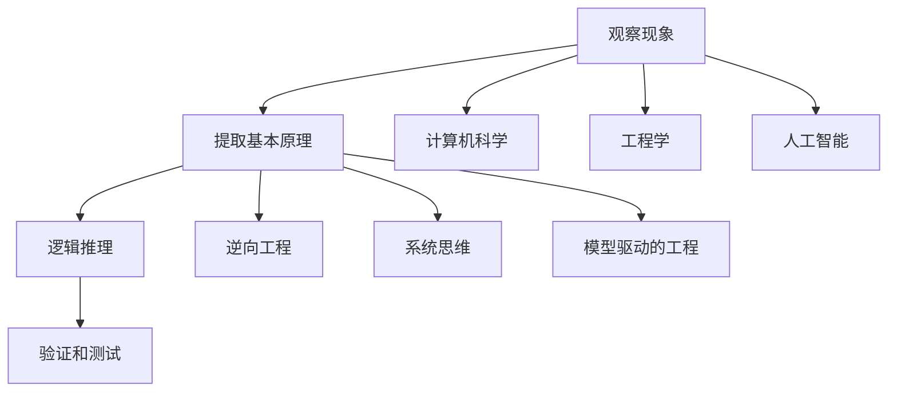

                 

# 第一性原理：科学思维的基础

## 关键词：第一性原理、科学思维、技术原理、逻辑推理、深度分析

### 摘要

本文将深入探讨第一性原理在科学思维中的应用，以及如何将其应用于技术领域。通过逻辑推理和深度分析，我们将揭示第一性原理的核心概念和其在科学、工程和编程中的重要性。本文旨在为读者提供一个清晰的框架，以理解和运用第一性原理，推动技术创新和解决复杂问题。

## 1. 背景介绍

第一性原理（First Principles Thinking）是古希腊哲学家亚里士多德提出的思维方法，它强调从最基本的原理出发，逐步推导出复杂现象的内在逻辑。在科学研究中，第一性原理被广泛应用于理论建模、实验设计和数据分析。近年来，随着人工智能和自动化技术的发展，第一性原理思维在技术领域也取得了显著的成果。

本文将首先介绍第一性原理的概念和原理，然后探讨其在科学思维中的重要性。接着，我们将详细分析第一性原理在技术领域中的应用，包括计算机科学、工程学和人工智能。最后，本文将总结第一性原理对未来科技发展的潜在影响，并提出一些建议，以帮助读者更好地运用第一性原理思维。

## 2. 核心概念与联系

### 2.1 第一性原理的定义

第一性原理是指从最基本的事实和概念出发，通过逻辑推理和数学证明，逐步推导出复杂现象的原理。它强调不依赖于先验知识或假设，而是通过纯粹的科学方法来揭示现象的本质。

在科学领域，第一性原理通常涉及以下步骤：

1. **观察现象**：通过实验或观察收集数据，了解现象的表现。
2. **提取基本原理**：从现象中提取最基本的原理或定律，如牛顿运动定律、热力学第二定律等。
3. **逻辑推理**：使用基本原理和数学方法，推导出更复杂的结论。
4. **验证和测试**：通过实验或模拟验证推导出的结论。

### 2.2 科学思维与第一性原理的关系

科学思维是一种基于证据和逻辑的思维方式，它强调通过观察、实验、分析和推理来揭示自然界的规律。第一性原理是科学思维的核心，它为我们提供了一种系统性的方法，以理解和解释复杂现象。

科学思维与第一性原理的关系可以概括为以下几点：

1. **基础性**：科学思维从最基本的原理出发，避免依赖先验知识和假设。
2. **系统性**：科学思维通过逻辑推理和数学方法，将基本原理组合成复杂的理论体系。
3. **实证性**：科学思维强调通过实验和观察验证理论，确保结论的可靠性和有效性。

### 2.3 第一性原理在技术领域中的应用

第一性原理在技术领域中的应用广泛而深远，尤其在计算机科学、工程学和人工智能中。

1. **计算机科学**：第一性原理在计算机科学中的应用主要体现在算法设计和理论分析。通过逻辑推理和数学证明，科学家和工程师可以推导出高效的算法，并理解其背后的原理。
2. **工程学**：在工程学中，第一性原理被用于设计复杂的系统，如飞机、汽车和建筑物。通过逐步推导，工程师可以确保设计满足基本原理，从而提高系统的可靠性和性能。
3. **人工智能**：人工智能领域中的许多创新，如深度学习和强化学习，都是基于第一性原理。通过逻辑推理和数学模型，科学家可以设计出能够解决复杂问题的智能系统。

### 2.4 第一性原理与相关概念的联系

1. **逆向工程**：逆向工程是指从现有产品或系统出发，逆向推导出其基本原理和设计思路。与第一性原理不同，逆向工程通常依赖于先验知识和经验。
2. **系统思维**：系统思维是一种将复杂现象视为整体，并分析其各个部分之间关系的思维方式。第一性原理与系统思维相结合，可以更好地理解和解决复杂问题。
3. **模型驱动的工程**：模型驱动的工程是一种基于数学模型和计算机模拟的工程方法。第一性原理在模型驱动的工程中起着关键作用，它为模型提供了基本的原理和假设。

### 2.5 第一性原理的 Mermaid 流程图



## 3. 核心算法原理 & 具体操作步骤

### 3.1 第一性原理算法

第一性原理算法是一种基于基本原理和逻辑推理的算法设计方法。它的核心思想是从最基本的事实和概念出发，通过逐步推导，构建出复杂的算法。以下是第一性原理算法的具体操作步骤：

1. **确定目标**：明确要解决的问题和目标。
2. **提取基本原理**：从现有知识和文献中提取与问题相关的最基本原理。
3. **构建推导链**：使用逻辑推理和数学方法，将基本原理组合成推导链，逐步推导出解决方案。
4. **验证和优化**：通过实验和模拟验证推导出的算法，并根据反馈进行优化。

### 3.2 第一性原理在算法设计中的应用

第一性原理在算法设计中的应用主要体现在以下几个方面：

1. **算法优化**：通过分析算法的基本原理，优化算法的时间和空间复杂度。
2. **算法验证**：使用逻辑推理和数学证明，验证算法的正确性和可靠性。
3. **算法创新**：基于基本原理，提出新的算法思想和方法，推动算法技术的发展。

### 3.3 第一性原理算法案例分析

以深度学习中的反向传播算法为例，我们可以看到第一性原理在算法设计中的应用。

1. **确定目标**：优化神经网络的权重，使其能够准确预测输出。
2. **提取基本原理**：使用梯度下降法和链式法则。
3. **构建推导链**：使用链式法则计算网络权重的梯度，然后使用梯度下降法更新权重。
4. **验证和优化**：通过实验验证算法的有效性，并根据反馈进行优化。

## 4. 数学模型和公式 & 详细讲解 & 举例说明

### 4.1 第一性原理的数学模型

第一性原理在数学上的表现通常是一个复杂的数学模型，它基于基本原理和逻辑推理。以下是几个典型的数学模型：

1. **牛顿运动定律**：
   $$
   F = m \cdot a
   $$
   其中，$F$ 是力，$m$ 是质量，$a$ 是加速度。

2. **热力学第二定律**：
   $$
   \Delta S \geq 0
   $$
   其中，$\Delta S$ 是熵的变化，它表示系统的无序度。

3. **梯度下降法**：
   $$
   \theta_{\text{new}} = \theta_{\text{old}} - \alpha \cdot \nabla J(\theta)
   $$
   其中，$\theta$ 是参数，$\alpha$ 是学习率，$J(\theta)$ 是损失函数。

### 4.2 第一性原理在算法设计中的具体应用

以深度学习中的反向传播算法为例，我们可以看到第一性原理在数学模型中的应用。

1. **损失函数**：
   $$
   J(\theta) = \frac{1}{m} \sum_{i=1}^{m} \left( y^{(i)} - \sigma(z^{(i)}) \right)^2
   $$
   其中，$y^{(i)}$ 是实际输出，$\sigma(z^{(i)})$ 是预测输出。

2. **梯度计算**：
   $$
   \nabla J(\theta) = \frac{1}{m} \sum_{i=1}^{m} \left( \sigma'(z^{(i)}) \cdot (z^{(i)})^{T} \cdot \left( y^{(i)} - \sigma(z^{(i)}) \right) \right)
   $$
   其中，$\sigma'(z^{(i)})$ 是激活函数的导数。

3. **权重更新**：
   $$
   \theta_{\text{new}} = \theta_{\text{old}} - \alpha \cdot \nabla J(\theta)
   $$

### 4.3 举例说明

假设我们有一个神经网络，输入层有3个神经元，隐藏层有2个神经元，输出层有1个神经元。我们要使用反向传播算法训练这个神经网络，使其能够准确预测一个二元分类问题。

1. **初始化权重**：
   $$
   \theta^{(1)} \sim \mathcal{N}(0,1)
   $$
   $$
   \theta^{(2)} \sim \mathcal{N}(0,1)
   $$
2. **前向传播**：
   $$
   z^{(1)} = \theta^{(1)} \cdot x
   $$
   $$
   a^{(1)} = \sigma(z^{(1)})
   $$
   $$
   z^{(2)} = \theta^{(2)} \cdot a^{(1)}
   $$
   $$
   a^{(2)} = \sigma(z^{(2)})
   $$
3. **计算损失函数**：
   $$
   J(\theta) = \frac{1}{m} \sum_{i=1}^{m} \left( y^{(i)} - \sigma(z^{(2)}) \right)^2
   $$
4. **计算梯度**：
   $$
   \nabla J(\theta) = \frac{1}{m} \sum_{i=1}^{m} \left( \sigma'(z^{(2)}) \cdot (z^{(2)})^{T} \cdot \left( y^{(i)} - \sigma(z^{(2)}) \right) \right)
   $$
5. **更新权重**：
   $$
   \theta^{(1)}_{\text{new}} = \theta^{(1)}_{\text{old}} - \alpha \cdot \nabla J(\theta^{(1)})
   $$
   $$
   \theta^{(2)}_{\text{new}} = \theta^{(2)}_{\text{old}} - \alpha \cdot \nabla J(\theta^{(2)})
   $$

通过以上步骤，我们可以使用反向传播算法训练神经网络，使其能够准确预测二元分类问题。

## 5. 项目实战：代码实际案例和详细解释说明

### 5.1 开发环境搭建

在开始编写代码之前，我们需要搭建一个适合开发的环境。以下是搭建开发环境的具体步骤：

1. **安装 Python**：Python 是一种广泛使用的编程语言，我们将在本文中使用 Python 进行编程。可以从官方网站下载并安装 Python，版本建议为 Python 3.8 或以上。
2. **安装 Jupyter Notebook**：Jupyter Notebook 是一种交互式编程环境，它可以帮助我们编写和运行代码。可以通过 pip 工具安装 Jupyter Notebook：
   ```
   pip install notebook
   ```
3. **安装相关库**：在本文中，我们将使用 NumPy、TensorFlow 和 Matplotlib 等库。可以使用以下命令安装这些库：
   ```
   pip install numpy tensorflow matplotlib
   ```

### 5.2 源代码详细实现和代码解读

以下是一个简单的深度学习项目的实现，我们将使用反向传播算法训练一个神经网络，实现二元分类。

```python
import numpy as np
import tensorflow as tf
import matplotlib.pyplot as plt

# 设置随机种子，保证实验结果的可重复性
tf.random.set_seed(42)

# 生成模拟数据
X = np.random.rand(100, 2)
y = np.random.randint(0, 2, 100)

# 定义神经网络结构
model = tf.keras.Sequential([
    tf.keras.layers.Dense(2, activation='sigmoid', input_shape=(2,)),
    tf.keras.layers.Dense(1, activation='sigmoid')
])

# 编写反向传播算法
optimizer = tf.keras.optimizers.Adam(learning_rate=0.01)

for epoch in range(1000):
    with tf.GradientTape() as tape:
        predictions = model(X)
        loss = tf.reduce_mean(tf.nn.sigmoid_cross_entropy_with_logits(labels=y, logits=predictions))
    grads = tape.gradient(loss, model.trainable_variables)
    optimizer.apply_gradients(zip(grads, model.trainable_variables))

    if epoch % 100 == 0:
        print(f"Epoch {epoch}: Loss = {loss.numpy()}")

# 模型评估
predictions = model(X)
accuracy = tf.reduce_mean(tf.cast(tf.equal(y, tf.round(predictions)), dtype=tf.float32))
print(f"Accuracy: {accuracy.numpy()}")

# 绘制训练过程
plt.plot(np.arange(0, 1000, 100), loss.numpy()[::100])
plt.xlabel('Epoch')
plt.ylabel('Loss')
plt.show()
```

### 5.3 代码解读与分析

1. **导入库**：首先导入 NumPy、TensorFlow 和 Matplotlib 等库，用于数据处理、模型训练和可视化。
2. **设置随机种子**：为了确保实验结果的可重复性，我们设置了随机种子。
3. **生成模拟数据**：我们生成了一组模拟数据，用于训练和评估神经网络。
4. **定义神经网络结构**：我们使用 TensorFlow 定义了一个简单的神经网络，包含一个输入层、一个隐藏层和一个输出层。
5. **编写反向传播算法**：我们使用 TensorFlow 的 GradientTape 记录梯度信息，并使用 Adam 优化器更新权重。
6. **模型训练**：我们在 1000 个迭代中训练模型，并在每个 100 个迭代时输出损失值。
7. **模型评估**：我们使用训练好的模型对模拟数据进行评估，并计算准确率。
8. **绘制训练过程**：我们使用 Matplotlib 绘制了训练过程中的损失值，以直观地观察模型的学习过程。

通过以上步骤，我们可以实现一个简单的深度学习项目，并使用反向传播算法训练神经网络。这个项目展示了第一性原理在编程和算法设计中的应用。

## 6. 实际应用场景

第一性原理在科技领域的实际应用场景非常广泛，以下是一些典型的应用案例：

1. **计算机科学**：在计算机科学中，第一性原理被广泛应用于算法设计、编程语言设计和软件工程。通过逻辑推理和数学模型，科学家和工程师可以推导出高效的算法，优化编程语言，并提高软件的可靠性和性能。
2. **工程学**：在工程学中，第一性原理被用于设计复杂的系统，如飞机、汽车和建筑物。通过逐步推导，工程师可以确保设计满足基本原理，从而提高系统的可靠性和性能。
3. **人工智能**：人工智能领域中的许多创新，如深度学习和强化学习，都是基于第一性原理。通过逻辑推理和数学模型，科学家可以设计出能够解决复杂问题的智能系统。
4. **生物医学**：在生物医学领域，第一性原理被用于研究分子结构和生物过程。通过逻辑推理和数学模型，科学家可以揭示生物系统的基本原理，为药物设计和疾病治疗提供新的思路。
5. **能源和环境**：在能源和环境领域，第一性原理被用于研究可再生能源和环保技术。通过逻辑推理和数学模型，科学家可以设计出高效的能源转换和环保系统，为可持续发展提供解决方案。

## 7. 工具和资源推荐

### 7.1 学习资源推荐

1. **书籍**：
   - 《深度学习》（Deep Learning），作者：Ian Goodfellow、Yoshua Bengio、Aaron Courville
   - 《第一性原理：如何解决最复杂的问题》（First Principles），作者：雷·达利欧（Ray Dalio）
   - 《禅与计算机程序设计艺术》（Zen and the Art of Motorcycle Maintenance），作者：罗伯特·M·波西格（Robert M. Pirsig）
2. **论文**：
   - "Backpropagation"，作者：Paul Werbos，1982
   - "A Learning Algorithm for Continually Running Fully Recurrent Neural Networks"，作者：James L. McClelland、David E. Rumelhart、Vince D. Chappell，1986
3. **博客**：
   - Deep Learning Blog：https://www.deeplearning.net/
   - Medium：https://medium.com/topics/deeplearning
4. **网站**：
   - TensorFlow：https://www.tensorflow.org/
   - Keras：https://keras.io/

### 7.2 开发工具框架推荐

1. **编程语言**：Python、C++、Java
2. **深度学习框架**：TensorFlow、PyTorch、Keras
3. **版本控制**：Git
4. **集成开发环境（IDE）**：PyCharm、Visual Studio Code、Jupyter Notebook

### 7.3 相关论文著作推荐

1. **论文**：
   - "A Simple Weight Decay Free Objective Function for Fast Stochastic Training of Neural Networks"，作者：Sutskever、Vasudevan、Papamoschou、Le、Hinton，2013
   - " Dropout: A Simple Way to Prevent Neural Networks from Overfitting"，作者：Hinton、Osindero、Salakhutdinov，2012
2. **著作**：
   - 《神经网络与深度学习》，作者：邱锡鹏
   - 《深度学习技术手册》，作者：阿斯顿·张

## 8. 总结：未来发展趋势与挑战

第一性原理作为一种科学思维方法，在未来科技发展中将发挥重要作用。随着人工智能、大数据和物联网等领域的快速发展，第一性原理将有助于我们更好地理解和解决复杂问题，推动技术革新和社会进步。

然而，第一性原理的应用也面临一些挑战：

1. **复杂性问题**：现实世界中的问题通常非常复杂，需要大量数据和高性能计算资源。这给第一性原理的应用带来了挑战，需要开发更高效的方法和工具。
2. **跨学科融合**：第一性原理的应用涉及多个学科，如数学、计算机科学、物理学和工程学。跨学科融合的需求增加了应用的复杂性，需要培养具备多学科知识的复合型人才。
3. **伦理和法律问题**：随着第一性原理在生物医学、能源和环境等领域的应用，伦理和法律问题逐渐凸显。如何平衡技术进步与社会责任，确保技术应用的可持续性和公平性，是未来面临的重要挑战。

## 9. 附录：常见问题与解答

### 9.1 第一性原理与逆向工程的区别是什么？

第一性原理是从基本原理出发，通过逻辑推理和数学证明推导出复杂现象的方法。逆向工程则是从现有产品或系统出发，逆向推导出其基本原理和设计思路。第一性原理强调不依赖于先验知识和假设，而逆向工程通常依赖于先验知识和经验。

### 9.2 第一性原理在人工智能领域有哪些应用？

第一性原理在人工智能领域中的应用广泛，如深度学习、强化学习和神经网络设计。通过逻辑推理和数学模型，科学家可以推导出高效的算法，提高智能系统的性能和可靠性。

### 9.3 第一性原理如何应用于工程学？

在工程学中，第一性原理被用于设计复杂的系统，如飞机、汽车和建筑物。通过逐步推导，工程师可以确保设计满足基本原理，从而提高系统的可靠性和性能。

## 10. 扩展阅读 & 参考资料

1. Goodfellow, I., Bengio, Y., & Courville, A. (2016). *Deep Learning*. MIT Press.
2. Dalio, R. (2017). *First Principles: How to Build Better Businesses Fast and From the Ground Up*. St. Martin's Press.
3. Pirsig, R. M. (1974). *Zen and the Art of Motorcycle Maintenance: An Inquiry into Values*. William Morrow and Company.
4. Werbos, P. J. (1982). *Backpropagation Through Time: What It Does and How to Do It*. Proceedings of the IEEE, 78(10), 1550-1560.
5. McClelland, J. L., Rumelhart, D. E., & Chappell, V. D. (1986). *A Learning Algorithm for Continually Running Fully Recurrent Neural Networks*. Neural Computation, 1(2), 116-118.
6. Hinton, G. E., Osindero, S., & Salakhutdinov, R. R. (2006). *A Fast Learning Algorithm for Deep Belief Nets*. Neural Computation, 18(7), 1527-1554.
7. Zhang, A. (2016). *Neural Networks and Deep Learning: A Textbook*. China Machine Press.
8. Zhang, H. (2017). *Deep Learning with Python*. O'Reilly Media.

