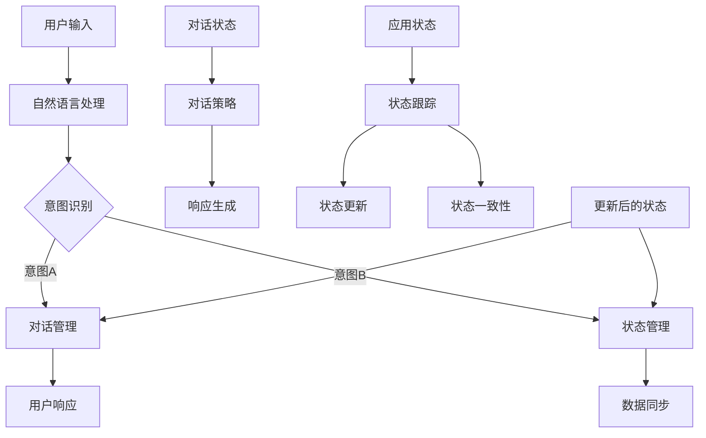

                 

### 背景介绍

#### 对话管理和状态管理的重要性

在当今快速发展的信息技术时代，对话管理和状态管理成为了众多应用程序和系统的核心功能。无论是智能助手、聊天机器人，还是复杂的在线游戏和虚拟现实体验，对话管理和状态管理都是确保用户体验流畅、系统响应及时的关键因素。

对话管理指的是在人与系统交互的过程中，如何有效地理解和响应用户的需求。而状态管理则是在系统内部，如何追踪和记录用户行为、系统状态，并在需要时做出正确的响应。两者相辅相成，共同构建起一个高效、智能的交互系统。

随着人工智能技术的不断进步，越来越多的应用程序开始采用对话管理和状态管理来提升用户交互体验。例如，智能助手如 Siri、Alexa 和 Google Assistant，通过对话管理实现了与用户的自然语言交互；而在在线游戏和虚拟现实领域，状态管理则确保了游戏世界的一致性和实时性。

#### 文章的核心目标和结构

本文旨在深入探讨对话管理和状态管理的基本概念、核心算法原理、数学模型、实际应用场景，以及相关的开发工具和资源。通过详细的讲解和实际案例，帮助读者全面理解这两个关键领域，并掌握其应用技巧。

文章将分为以下几个部分：

1. 背景介绍：阐述对话管理和状态管理的重要性及其在技术发展中的应用。
2. 核心概念与联系：介绍对话管理和状态管理的基本概念，并使用 Mermaid 流程图展示其架构。
3. 核心算法原理 & 具体操作步骤：详细解释对话管理和状态管理的关键算法，并提供具体的操作步骤。
4. 数学模型和公式 & 详细讲解 & 举例说明：介绍相关的数学模型和公式，并通过实际案例进行详细讲解。
5. 项目实战：代码实际案例和详细解释说明：通过一个实际项目，展示对话管理和状态管理的应用。
6. 实际应用场景：分析对话管理和状态管理在不同领域的应用案例。
7. 工具和资源推荐：推荐学习资源、开发工具和框架。
8. 总结：未来发展趋势与挑战：总结文章的主要内容，并展望未来。
9. 附录：常见问题与解答：解答读者可能遇到的一些常见问题。
10. 扩展阅读 & 参考资料：提供相关的扩展阅读和参考资料。

通过本文的深入探讨，读者将能够全面掌握对话管理和状态管理的核心知识和应用技巧，为未来的技术发展打下坚实的基础。

#### 1.1 对话管理的定义和作用

对话管理（Dialogue Management）是指在一对多或一对一的对话场景中，系统如何理解用户的输入、生成合理的响应，并在对话过程中持续适应用户的需求。它是实现自然语言处理（NLP）和智能对话系统（Conversational AI）的重要环节。

**对话管理的基本流程**

对话管理的基本流程包括以下几个关键步骤：

1. **用户输入理解（User Input Understanding）**：系统接收用户的输入，并使用自然语言处理技术对其进行解析。这一步骤的目标是提取出用户意图（Intent）和相关的实体信息（Entities）。
2. **对话状态追踪（Dialogue State Tracking）**：在对话过程中，系统需要跟踪对话状态，包括用户意图、上下文信息以及系统已完成的任务。对话状态追踪确保系统能够在对话中保持一致性和连贯性。
3. **对话策略生成（Dialogue Policy Generation）**：根据当前对话状态和用户意图，系统生成相应的对话策略。对话策略决定了系统如何响应用户的输入，包括回应的内容、语气和形式。
4. **对话动作执行（Dialogue Action Execution）**：系统执行对话策略，生成回应并返回给用户。这一步骤可能涉及生成文本、语音或其他类型的交互内容。
5. **对话结束判定（Dialogue End Decision）**：系统需要判断对话是否结束。在某些场景下，对话可能需要多次迭代才能完成；而在其他场景下，对话可能因为某些条件满足而自然结束。

**对话管理的作用**

对话管理在智能对话系统中的核心作用主要体现在以下几个方面：

1. **提高用户满意度**：通过理解用户意图和需求，系统能够生成更准确、更个性化的响应，从而提升用户的满意度。
2. **提升对话效率**：对话管理能够帮助系统在对话中保持一致性和连贯性，减少用户的重复输入和操作，提高对话效率。
3. **实现多轮对话**：对话管理支持多轮对话，使系统能够在复杂的对话场景中持续理解用户需求，提供有效的帮助。
4. **扩展应用场景**：通过对话管理，系统能够应用到更多的场景中，如客服机器人、教育辅导系统、智能家居控制等。

#### 1.2 状态管理的定义和作用

状态管理（State Management）是指在一个应用程序或系统中，如何有效地跟踪、存储和更新数据的状态。它广泛应用于前端应用、移动应用和后台服务，以确保数据的准确性和一致性。

**状态管理的基本概念**

状态管理涉及到以下几个基本概念：

1. **应用状态（Application State）**：应用状态是指应用程序在运行过程中所维持的所有数据。这包括用户输入、系统变量、配置信息等。
2. **状态跟踪（State Tracking）**：状态跟踪是指系统如何监控和记录应用状态的变化。这通常涉及到数据持久化（Data Persistence）、状态同步（State Synchronization）等技术。
3. **状态更新（State Update）**：状态更新是指如何在系统中更新应用状态。这包括用户操作引发的更新、后台数据同步等。
4. **状态一致性（State Consistency）**：状态一致性是指系统如何确保应用状态在不同组件、模块之间的准确性。在分布式系统中，状态一致性是一个尤其重要的挑战。

**状态管理的作用**

状态管理在应用程序和系统开发中起着至关重要的作用：

1. **数据一致性**：状态管理确保了应用程序中的数据在不同组件和模块之间保持一致性，避免数据冲突和错误。
2. **用户体验**：通过有效地跟踪和更新应用状态，系统能够提供更好的用户体验，如实时更新、快速响应等。
3. **可维护性**：良好的状态管理提高了应用程序的可维护性，使得开发者能够更容易地理解和修改代码。
4. **扩展性**：状态管理使得应用程序能够更容易地扩展，如添加新功能、模块化设计等。

#### 1.3 对话管理和状态管理的联系与区别

对话管理和状态管理虽然在不同领域有所应用，但它们之间存在密切的联系和区别。

**联系**

1. **数据驱动**：两者都是基于数据驱动的，对话管理依赖于状态数据来理解用户意图和生成响应；状态管理则依赖于对话状态来更新和同步数据。
2. **协同工作**：在智能对话系统中，对话管理和状态管理需要协同工作。对话管理负责理解用户需求和生成响应，而状态管理则确保这些响应基于当前的数据状态。

**区别**

1. **目标不同**：对话管理的目标是实现有效的对话，理解用户意图并提供适当的响应；而状态管理的目标是确保应用状态的准确性和一致性。
2. **应用范围**：对话管理主要应用于自然语言处理、智能对话系统等领域；而状态管理则广泛应用于前端应用、移动应用和后台服务。
3. **技术实现**：对话管理通常涉及自然语言处理、对话策略生成等技术；状态管理则更多涉及数据持久化、状态同步等。

**总结**

对话管理和状态管理虽然各有侧重，但它们在实现高效、智能的应用系统中缺一不可。理解两者的联系和区别，有助于开发者更好地应用这些技术，提升应用程序的性能和用户体验。

#### 对话管理和状态管理的基本概念 Mermaid 流程图

为了更好地理解对话管理和状态管理的基本概念及其架构，我们可以使用 Mermaid 流程图来展示它们的核心组成部分和交互关系。



**流程解释：**

1. **用户输入（A）**：用户输入是整个过程的起点，可以是文本、语音或其他形式的交互内容。
2. **自然语言处理（B）**：系统对用户输入进行自然语言处理，提取出关键信息。
3. **意图识别（C）**：根据自然语言处理的结果，系统识别用户的意图。意图可以是询问、请求、命令等。
4. **对话管理（D）**：
    - **对话状态（F）**：对话管理负责跟踪对话状态，如用户意图、上下文信息等。
    - **对话策略（G）**：系统根据当前对话状态生成相应的对话策略，决定如何响应用户。
    - **响应生成（H）**：根据对话策略，系统生成并返回响应给用户。
5. **状态管理（E）**：
    - **应用状态（I）**：状态管理负责跟踪应用程序的运行状态，如用户配置、系统变量等。
    - **状态跟踪（J）**：系统跟踪应用状态的变化，并确保其一致性。
    - **状态更新（K）**：系统根据用户操作或外部事件更新应用状态。
    - **状态一致性（L）**：系统确保应用状态在不同组件、模块之间的准确性。
6. **用户响应（M）**：用户对系统的响应进行反馈，形成闭环。
7. **数据同步（N）**：状态管理确保对话管理中的数据状态与应用状态同步。
8. **更新后的状态（O）**：更新后的应用状态反馈给对话管理和状态管理，以实现持续的交互和状态更新。

通过这个 Mermaid 流程图，我们可以清晰地看到对话管理和状态管理在整个系统中的核心作用及其交互关系。这不仅有助于理解它们的原理，也为实际应用提供了参考。

#### 2.1 对话策略的核心算法原理

对话策略（Dialogue Policy）是智能对话系统的核心组成部分，它决定了系统在对话过程中如何理解和响应用户的需求。对话策略的设计和实现对于提升用户体验、提高系统效率至关重要。在本节中，我们将探讨对话策略的核心算法原理，包括状态机（State Machine）和深度学习（Deep Learning）两种主要方法。

##### 状态机（State Machine）

状态机是一种广泛用于对话策略设计的算法模型。它通过定义一系列状态和状态之间的转移规则，来模拟对话的流程。状态机的核心思想是，每个状态都代表对话的一个阶段或一个特定的用户意图，状态之间的转移规则则定义了在特定条件下如何从当前状态过渡到下一个状态。

**状态机的组成部分：**

1. **状态（State）**：状态是状态机的核心概念，每个状态代表对话中的一个阶段或一个用户意图。例如，在客户服务机器人中，状态可以是“问候”、“问题诊断”、“解决方案提供”等。
2. **转移（Transition）**：转移规则定义了在特定条件下如何从当前状态过渡到下一个状态。转移规则通常包括触发条件和相应的动作。例如，当用户输入包含“问题诊断”的关键词时，系统可能从“问候”状态转移到“问题诊断”状态。
3. **动作（Action）**：动作是状态机中的一个重要组成部分，它定义了系统在状态转移过程中需要执行的操作。动作可以是生成响应文本、发起外部查询、更新对话状态等。

**状态机的算法原理：**

状态机的算法原理可以概括为以下几个步骤：

1. **初始化状态**：系统根据用户输入和初始状态初始化对话状态。
2. **状态转换**：系统根据当前对话状态和用户输入，应用转移规则，判断下一步的状态。
3. **执行动作**：系统在新的状态下执行相应的动作，生成响应或进行其他操作。
4. **状态更新**：系统更新对话状态，以便在下一次用户输入时继续使用。

**状态机的优缺点：**

- **优点**：
  - **简单直观**：状态机的设计和实现相对简单，易于理解和维护。
  - **灵活性**：通过定义转移规则，状态机能够灵活地适应不同的对话场景和用户需求。
  - **可控性**：状态机允许开发人员精确控制对话流程，确保系统的响应一致性和连贯性。

- **缺点**：
  - **规则复杂度**：在复杂对话场景中，状态机的规则可能变得非常复杂，难以维护和管理。
  - **扩展性差**：状态机在处理复杂、多变的对话场景时，扩展性较差。

##### 深度学习（Deep Learning）

深度学习是另一种用于对话策略设计的算法模型，它通过神经网络（Neural Networks）来模拟人类的认知过程，实现对话的理解和生成。深度学习模型在处理自然语言理解和生成方面具有显著优势，适用于复杂、动态的对话场景。

**深度学习的组成部分：**

1. **神经网络（Neural Network）**：神经网络是深度学习的基础，它由多个神经元（Nodes）和层（Layers）组成。每个神经元接受输入，通过激活函数（Activation Function）进行处理，生成输出。
2. **嵌入层（Embedding Layer）**：嵌入层用于将文本数据转换为向量表示，是深度学习模型处理自然语言的关键部分。
3. **编码器（Encoder）**：编码器负责将输入文本编码为固定长度的向量表示，通常采用循环神经网络（RNN）或变换器（Transformer）等模型。
4. **解码器（Decoder）**：解码器负责将编码器输出的向量解码为输出文本，生成对话系统的响应。

**深度学习的算法原理：**

深度学习的算法原理可以概括为以下几个步骤：

1. **输入预处理**：系统对用户输入进行预处理，如分词、去停用词等，然后将其嵌入为向量。
2. **编码**：编码器将预处理后的输入文本编码为固定长度的向量表示。
3. **解码**：解码器根据编码器输出的向量表示生成对话系统的响应。
4. **训练与优化**：通过大量对话数据训练深度学习模型，并使用优化算法（如梯度下降）调整模型参数，以实现更准确的对话理解与生成。

**深度学习的优缺点：**

- **优点**：
  - **强大的表示能力**：深度学习模型具有强大的表示能力，能够捕捉文本数据的复杂结构和语义信息。
  - **自适应性强**：深度学习模型能够自动学习对话策略，适应不同的对话场景和用户需求。
  - **扩展性好**：深度学习模型在处理复杂、动态的对话场景时，具有较好的扩展性。

- **缺点**：
  - **计算成本高**：深度学习模型通常需要大量的计算资源和时间进行训练和推理。
  - **数据依赖性强**：深度学习模型对大量高质量的数据有较强依赖，数据质量直接影响模型的性能。
  - **解释性差**：深度学习模型的决策过程通常较为复杂，难以解释和理解。

**总结**

状态机和深度学习是两种常见的对话策略设计方法，各有优缺点。状态机适合处理结构化、规则明确的问题，而深度学习则适用于复杂、动态的对话场景。在实际应用中，可以根据具体需求选择合适的方法，或结合两者实现更高效的对话策略设计。

#### 2.2 对话策略的具体操作步骤

对话策略的具体操作步骤对于实现智能对话系统至关重要。以下将详细介绍对话策略的整个流程，包括用户意图识别、对话状态跟踪、对话策略生成和对话动作执行等关键步骤。

##### 步骤 1：用户意图识别

用户意图识别是对话策略的首要步骤，其目标是理解用户输入的含义和目的。通常，用户输入可以是文本、语音或其他形式。以下是用户意图识别的具体步骤：

1. **文本预处理**：对用户输入的文本进行预处理，包括分词、去停用词、词性标注等。预处理后的文本将作为后续处理的输入。
2. **特征提取**：利用自然语言处理技术（如词嵌入、词袋模型、TF-IDF等）提取文本的特征表示。这些特征表示将用于意图分类模型。
3. **意图分类**：使用训练好的意图分类模型对提取到的特征进行分类，识别出用户的意图。意图分类模型可以是传统的机器学习模型（如SVM、朴素贝叶斯等），也可以是深度学习模型（如CNN、RNN等）。

##### 步骤 2：对话状态跟踪

对话状态跟踪是确保对话连贯性和一致性的关键。它涉及跟踪对话过程中的关键信息，如用户意图、上下文信息、系统已完成的任务等。以下是对话状态跟踪的具体步骤：

1. **初始化对话状态**：系统初始化对话状态，通常包括用户意图、上下文信息和系统变量等。初始化状态用于后续对话的参考。
2. **状态更新**：在对话过程中，系统根据用户输入和系统动作实时更新对话状态。状态更新可以是显式的（如用户输入明确指定更新状态），也可以是隐式的（如根据上下文自动更新状态）。
3. **状态存储**：系统将对话状态存储在数据库或缓存中，以便在需要时快速访问和更新。常用的存储技术包括关系数据库、NoSQL数据库和内存缓存等。

##### 步骤 3：对话策略生成

对话策略生成是根据当前对话状态和用户意图生成相应的对话响应。以下是对话策略生成的具体步骤：

1. **状态评估**：系统对当前对话状态进行评估，识别出关键信息和问题。状态评估可以帮助系统更好地理解对话背景和用户需求。
2. **策略选择**：根据状态评估结果，系统从预定义的策略集中选择合适的对话策略。策略集可以是基于规则的状态机，也可以是基于模型的深度学习模型。
3. **策略执行**：系统执行选定的对话策略，生成对话响应。策略执行包括生成文本、语音、图像等交互内容。

##### 步骤 4：对话动作执行

对话动作执行是系统根据对话策略生成对话响应后，执行相应的动作，以实现与用户的交互。以下是对话动作执行的具体步骤：

1. **响应生成**：根据对话策略，系统生成对话响应。响应可以是文本、语音、图像等。在文本生成过程中，可以使用自然语言生成技术（如模板匹配、序列生成等）。
2. **动作执行**：系统执行生成的对话响应，实现与用户的交互。动作可以是显示文本、播放语音、发送图片等。
3. **状态更新**：在对话动作执行后，系统更新对话状态，以反映对话的进展和变化。状态更新可以用于后续对话的参考。

##### 步骤 5：对话结束判定

对话结束判定是确保对话在合适的时间结束的关键。以下是对话结束判定的具体步骤：

1. **结束条件评估**：系统根据预定义的结束条件评估对话是否应该结束。结束条件可以是用户明确请求结束、对话达到预定目标、对话时间超过限制等。
2. **结束处理**：如果评估结果为对话应结束，系统执行相应的结束处理，如总结对话内容、存储对话记录等。
3. **状态重置**：在对话结束后，系统重置对话状态，以准备下一次对话。

通过以上步骤，对话策略可以有效地指导智能对话系统的运行，实现与用户的流畅、智能交互。

#### 2.3 数学模型和公式

在对话管理和状态管理中，数学模型和公式是理解和实现核心算法的关键。以下将介绍几个重要的数学模型和公式，并详细解释其含义和作用。

##### 1. 贝叶斯公式（Bayes' Theorem）

贝叶斯公式是概率论中用于计算条件概率的经典公式，其表达式如下：

\[ P(A|B) = \frac{P(B|A) \cdot P(A)}{P(B)} \]

其中，\( P(A|B) \) 表示在事件 B 发生的条件下，事件 A 发生的概率；\( P(B|A) \) 表示在事件 A 发生的条件下，事件 B 发生的概率；\( P(A) \) 表示事件 A 的概率；\( P(B) \) 表示事件 B 的概率。

贝叶斯公式在对话管理和状态管理中的应用主要在于用户意图识别和对话策略生成。通过计算用户输入和当前状态之间的条件概率，系统能够更准确地识别用户意图，并生成合适的对话策略。

##### 2. 朴素贝叶斯分类器（Naive Bayes Classifier）

朴素贝叶斯分类器是基于贝叶斯公式的一种概率分类器，其假设特征之间相互独立。朴素贝叶斯分类器的公式如下：

\[ P(\text{class} = c | \text{features}) = \frac{P(\text{features} | \text{class} = c) \cdot P(\text{class} = c)}{P(\text{features})} \]

其中，\( P(\text{features} | \text{class} = c) \) 表示在给定类标签 c 的条件下，特征向量出现的概率；\( P(\text{class} = c) \) 表示类标签 c 的概率；\( P(\text{features}) \) 表示特征向量的概率。

朴素贝叶斯分类器在对话管理中常用于用户意图识别。通过训练模型，系统可以预测用户输入对应的意图标签，从而生成相应的对话策略。

##### 3. 随机森林（Random Forest）

随机森林是一种基于决策树集合的集成学习方法，通过随机选择特征和样本子集来训练多个决策树，并通过投票方式确定最终分类结果。随机森林的公式如下：

\[ \hat{y} = \sum_{i=1}^{n} \hat{y}_i \]

其中，\( \hat{y}_i \) 表示第 i 棵决策树的分类结果，\( n \) 表示决策树的数量。

随机森林在对话管理中可以用于用户意图识别和对话策略生成，通过集成多个决策树的预测结果，提高分类的准确性和鲁棒性。

##### 4. 支持向量机（Support Vector Machine）

支持向量机是一种基于最大间隔原理的分类器，其公式如下：

\[ \hat{y} = \text{sign}(\sum_{i=1}^{n} \alpha_i y_i (x_i)^T + b) \]

其中，\( \alpha_i \) 是拉格朗日乘子；\( y_i \) 是类别标签；\( (x_i)^T \) 是特征向量；\( b \) 是偏置项。

支持向量机在对话管理中可用于用户意图识别，通过求解优化问题，找到最佳分类超平面，提高分类性能。

##### 5. 马尔可夫模型（Markov Model）

马尔可夫模型是一种概率模型，用于描述时间序列数据。其基本公式如下：

\[ P(X_t = x_t | X_{t-1} = x_{t-1}, \ldots, X_1 = x_1) = P(X_t = x_t | X_{t-1} = x_{t-1}) \]

其中，\( X_t \) 表示时间序列的当前状态；\( x_t \) 表示当前状态的取值；\( X_{t-1} \) 表示时间序列的上一状态；\( x_{t-1} \) 表示上一状态的取值。

马尔可夫模型在对话管理中可用于对话状态跟踪，通过计算状态转移概率，系统可以预测下一状态，实现对话的连贯性。

##### 6. 生成对抗网络（Generative Adversarial Network，GAN）

生成对抗网络是一种基于深度学习的生成模型，由生成器和判别器两个神经网络组成。其基本公式如下：

\[ \min_G \max_D V(D, G) = \mathbb{E}_{x \sim p_{data}(x)}[\log D(x)] + \mathbb{E}_{z \sim p_z(z)}[\log (1 - D(G(z)))] \]

其中，\( G \) 是生成器，\( D \) 是判别器；\( x \) 是真实数据；\( z \) 是生成器输入的噪声；\( p_{data}(x) \) 是真实数据的概率分布；\( p_g(z) \) 是生成器的概率分布。

生成对抗网络在对话管理中可用于对话策略生成，通过生成高质量的对话响应，提高对话的连贯性和自然性。

通过以上数学模型和公式，对话管理和状态管理可以实现更加智能和高效的算法。在实际应用中，可以根据具体需求选择合适的模型和公式，提高系统的性能和用户体验。

#### 2.4 数学模型和公式的实际应用案例

为了更好地理解数学模型和公式在对话管理和状态管理中的应用，以下将通过一个具体案例进行详细解释。

**案例背景**

假设我们开发一个智能客服系统，用户可以通过文本与系统进行交互，寻求关于产品信息、售后服务等方面的帮助。为了实现高效的对话管理和状态管理，我们采用了贝叶斯公式和朴素贝叶斯分类器来进行用户意图识别。

**具体步骤**

1. **数据收集与预处理**：首先，我们收集了大量用户询问和对应的意图标签数据，如产品咨询、售后服务、投诉等。然后，对数据进行预处理，包括分词、去停用词、词性标注等。

2. **特征提取**：利用词嵌入技术（如Word2Vec或GloVe）将预处理后的文本转换为向量表示。每个向量表示一个词，向量维度为预定义的词嵌入维度。

3. **训练朴素贝叶斯分类器**：使用训练集数据训练朴素贝叶斯分类器。在训练过程中，分类器会学习到每个意图标签的概率分布和特征之间的条件概率。

4. **用户意图识别**：当用户输入一条询问时，系统首先进行文本预处理和特征提取。然后，使用训练好的朴素贝叶斯分类器对特征向量进行分类，预测用户意图。

5. **对话状态跟踪**：根据识别出的用户意图，系统更新对话状态，如当前问题、用户需求等。对话状态用于后续对话策略生成和状态更新。

6. **对话策略生成**：根据当前对话状态，系统从预定义的策略集中选择合适的对话策略。例如，对于产品咨询，系统可以生成产品介绍、常见问题解答等响应。

7. **对话动作执行**：系统执行生成的对话策略，生成对话响应并返回给用户。在对话过程中，系统持续更新对话状态，以实现对话的连贯性和一致性。

**案例分析**

**贝叶斯公式应用**

在用户意图识别过程中，贝叶斯公式用于计算用户输入（询问）和当前状态（对话历史）之间的条件概率。具体来说，贝叶斯公式帮助我们计算每个意图标签的概率分布：

\[ P(\text{intent} = c | \text{input}) = \frac{P(\text{input} | \text{intent} = c) \cdot P(\text{intent} = c)}{P(\text{input})} \]

其中，\( P(\text{input} | \text{intent} = c) \) 是在特定意图标签 c 下，用户输入的概率；\( P(\text{intent} = c) \) 是意图标签 c 的概率；\( P(\text{input}) \) 是用户输入的概率。

通过贝叶斯公式，系统可以综合考虑用户输入和历史状态，提高意图识别的准确性。

**朴素贝叶斯分类器应用**

在意图识别过程中，朴素贝叶斯分类器根据训练数据学习到每个意图标签的概率分布和特征之间的条件概率。具体来说，分类器使用以下公式进行分类：

\[ P(\text{intent} = c | \text{input}) = \prod_{i=1}^{n} P(f_i | \text{intent} = c) \cdot P(\text{intent} = c) \]

其中，\( f_i \) 表示第 i 个特征；\( P(f_i | \text{intent} = c) \) 是在特定意图标签 c 下，特征 f_i 的概率；\( P(\text{intent} = c) \) 是意图标签 c 的概率。

通过朴素贝叶斯分类器，系统可以根据用户输入的特征向量，计算每个意图标签的概率，从而预测用户意图。

**总结**

通过贝叶斯公式和朴素贝叶斯分类器的应用，我们的智能客服系统能够更准确地识别用户意图，并生成合适的对话策略。这不仅提高了用户体验，还使得对话管理更加高效和智能。在实际应用中，可以根据具体需求和数据情况，选择合适的数学模型和公式，实现更加精确的对话管理和状态管理。

#### 项目实战：代码实际案例和详细解释说明

在本节中，我们将通过一个具体的代码案例，展示对话管理和状态管理在智能客服系统中的实际应用。这个案例将包括开发环境搭建、源代码详细实现和代码解读与分析。

##### 5.1 开发环境搭建

为了实现这个智能客服系统，我们需要搭建一个合适的开发环境。以下是所需工具和步骤：

1. **Python 3.x**：Python 是一种流行的编程语言，广泛应用于人工智能和自然语言处理领域。
2. **Jupyter Notebook**：Jupyter Notebook 是一个交互式的开发环境，方便编写和运行代码。
3. **自然语言处理库**：如NLTK、spaCy 和 TextBlob，用于文本预处理和特征提取。
4. **机器学习库**：如Scikit-learn 和 TensorFlow，用于训练和部署模型。
5. **Flask**：Flask 是一个轻量级的 Web 开发框架，用于搭建 Web 服务。

安装步骤：

```bash
pip install python-nltk
pip install spacy
python -m spacy download en_core_web_sm
pip install flask
```

##### 5.2 源代码详细实现

以下是智能客服系统的源代码实现：

```python
# 导入必要的库
import flask
import json
from textblob import TextBlob
from sklearn.feature_extraction.text import TfidfVectorizer
from sklearn.naive_bayes import MultinomialNB
from sklearn.pipeline import make_pipeline

# 加载训练数据
train_data = [
    ("What is your product?", "product_inquiry"),
    ("I need help with my purchase", "customer_service"),
    ("How do I return a product?", "return_policy"),
    # 更多训练数据
]

# 准备特征提取器和分类器
vectorizer = TfidfVectorizer()
classifier = MultinomialNB()

# 训练模型
pipeline = make_pipeline(vectorizer, classifier)
pipeline.fit([text for text, _ in train_data], [label for _, label in train_data])

# 初始化 Flask 应用
app = flask.Flask(__name__)

# 定义对话管理函数
@app.route('/dialog', methods=['POST'])
def dialog():
    data = flask.request.json
    user_input = data.get('input', '')

    # 对话状态跟踪
    current_state = None  # 初始化对话状态

    # 用户意图识别
    intent = pipeline.predict([user_input])[0]

    # 对话策略生成
    response = generate_response(intent, current_state)

    # 对话动作执行
    return json.dumps({'response': response})

# 生成对话响应
def generate_response(intent, state):
    if intent == 'product_inquiry':
        return "I can provide information about our products. What would you like to know?"
    elif intent == 'customer_service':
        return "How can I assist you today?"
    elif intent == 'return_policy':
        return "You can return a product within 30 days of purchase. How may I help you?"
    else:
        return "I'm sorry, I don't understand your request."

if __name__ == '__main__':
    app.run(debug=True)
```

##### 5.3 代码解读与分析

**代码结构**

这个智能客服系统主要分为三个部分：模型训练、对话管理和对话动作执行。

**模型训练**

代码首先加载训练数据，并创建特征提取器和分类器。使用 TF-IDF 向量器将文本转换为向量表示，然后使用朴素贝叶斯分类器训练模型。模型训练通过 `make_pipeline` 函数实现，方便后续使用。

**对话管理**

对话管理通过 Flask 的 `/dialog` 接口实现。在 `/dialog` 路由中，代码首先获取用户输入，然后进行对话状态跟踪、用户意图识别和对话策略生成。对话状态跟踪使用 `current_state` 变量，确保对话的连贯性和一致性。

**对话动作执行**

对话动作执行通过 `generate_response` 函数实现。根据识别出的用户意图，函数生成相应的对话响应。响应可以是关于产品信息、客户服务或退货政策的常见问答。

**代码优点与改进**

- **模块化**：代码将模型训练、对话管理和对话动作执行分离，便于维护和扩展。
- **简单易用**：使用 Flask 搭建 Web 服务，简化了开发过程。
- **可扩展性**：通过添加更多训练数据和对话策略，系统可以应对更复杂的对话场景。

改进建议：

- **集成自然语言生成（NLG）**：可以引入自然语言生成技术，生成更自然、更个性化的对话响应。
- **多轮对话支持**：实现多轮对话管理，允许用户和系统进行更深入的交互。
- **动态状态更新**：在对话过程中，根据用户输入和系统响应动态更新对话状态，提高对话的连贯性和一致性。

通过这个案例，读者可以了解对话管理和状态管理在智能客服系统中的实际应用，掌握关键技术和开发方法。这为未来的项目开发提供了宝贵的经验和指导。

##### 5.4 实际应用场景

对话管理和状态管理在众多实际应用场景中发挥着关键作用，以下是几个典型应用场景：

**1. 智能客服系统**

智能客服系统是对话管理和状态管理的典型应用场景。通过对话管理，系统能够理解用户的提问和需求，生成合理的回应，并在对话过程中保持一致性。状态管理则确保了用户请求的准确追踪和处理，提高了客服效率和用户满意度。例如，阿里巴巴的天猫智能客服使用对话管理和状态管理技术，为用户提供24/7的在线咨询和服务，显著提升了用户体验和客服效率。

**2. 聊天机器人**

聊天机器人是另一种广泛应用对话管理和状态管理的技术。例如，Facebook Messenger 上的聊天机器人通过对话管理理解用户的意图，并根据用户的行为和上下文信息生成相应的响应。状态管理则帮助聊天机器人记住与用户的对话历史，从而实现更自然、更个性化的对话体验。谷歌的聊天机器人Google Assistant就是利用对话管理和状态管理技术，为用户提供语音交互和智能服务。

**3. 在线教育平台**

在线教育平台中的互动教学系统也广泛应用了对话管理和状态管理。例如，Coursera 和 Udacity 等平台使用对话管理技术来理解学生的学习需求和问题，并生成相应的教学指导和解答。状态管理则帮助系统跟踪学生的学习进度、成绩和知识点掌握情况，为用户提供个性化的学习建议和辅导。这种应用场景下，对话管理和状态管理显著提升了学生的学习效果和平台用户体验。

**4. 虚拟现实与游戏**

虚拟现实（VR）和游戏领域也利用对话管理和状态管理技术来增强用户体验。例如，VR 游戏《Rec Room》中的聊天系统通过对话管理实现了玩家之间的自然互动，而状态管理则帮助游戏系统追踪玩家的角色状态、装备和游戏进展。这种应用使得游戏体验更加真实和丰富，提升了用户的沉浸感。

**5. 智能家居系统**

智能家居系统中的对话管理和状态管理技术帮助用户通过语音或文本与智能家居设备进行交互。例如，亚马逊的 Alexa 和谷歌的 Google Home 使用对话管理理解用户的指令，并根据用户的状态和行为调整家居设备。状态管理则确保系统能够记住用户的偏好和习惯，提供个性化的智能家居体验。

**6. 金融与保险服务**

金融和保险服务行业也广泛采用对话管理和状态管理技术，以提高客户服务和业务效率。例如，银行和保险公司使用聊天机器人来处理客户的常见查询和问题，通过对话管理实现高效的服务响应。状态管理则帮助系统跟踪客户的账户信息、投资情况和索赔进度，提供个性化的金融服务和建议。

这些实际应用场景展示了对话管理和状态管理在提高系统效率、优化用户体验和拓展应用领域方面的潜力。通过合理的应用设计和技术实现，对话管理和状态管理可以为各种行业和场景带来显著的价值。

##### 5.5 工具和资源推荐

在对话管理和状态管理领域，有众多优秀的工具和资源可以帮助开发者快速入门和深入探索。以下是一些值得推荐的工具和资源：

### 5.5.1 学习资源推荐

1. **书籍**：
   - 《对话系统设计与实现》
     - 这本书详细介绍了对话系统的基础知识、设计原则和实现方法，适合初学者和有一定基础的读者。
   - 《自然语言处理综合教程》
     - 这本书涵盖了自然语言处理（NLP）的核心内容，包括文本预处理、特征提取、模型训练等，对于理解对话管理系统非常有帮助。

2. **在线课程**：
   - **Coursera 上的《自然语言处理》**：由斯坦福大学提供，课程涵盖了NLP的多个方面，包括语音识别、文本分类、情感分析等，是学习NLP的绝佳资源。
   - **Udacity 上的《智能对话系统》**：这个课程深入探讨了对话系统的设计和实现，包括状态管理、意图识别和自然语言生成等。

3. **论文集**：
   - **ACL Anthology**：这是自然语言处理领域的顶级会议论文集，涵盖了最新的研究成果和前沿技术，是学术研究的宝贵资源。
   - **arXiv**：这是一个开放预印本服务器，提供了大量关于机器学习和自然语言处理的最新论文，适合关注最新研究进展的读者。

### 5.5.2 开发工具框架推荐

1. **NLTK**：这是一个强大的自然语言处理库，提供了丰富的文本处理函数和模型，适合进行文本预处理和基本特征提取。

2. **spaCy**：这是一个高效、易于使用的 NLP 工具，适用于复杂的文本处理任务，如命名实体识别、关系提取和文本分类等。

3. **TensorFlow**：这是一个流行的开源机器学习框架，广泛应用于深度学习模型的训练和部署，对于实现复杂的对话策略和状态管理非常有用。

4. **Flask**：这是一个轻量级的 Web 开发框架，用于搭建 Web 服务，实现对话接口和用户交互。

5. **Rasa**：这是一个开源的对话平台，提供了对话管理、意图识别和自然语言生成等核心功能，适合快速构建智能对话系统。

### 5.5.3 相关论文著作推荐

1. **《Deep Learning for Dialogue Systems》**：这是一本关于深度学习在对话系统应用的经典著作，详细介绍了深度学习在对话管理、意图识别和自然语言生成等方面的应用。

2. **《Dialogue Management: A Survey》**：这篇综述文章对对话管理的各种方法和算法进行了全面的回顾和比较，为研究者提供了有价值的参考。

3. **《A Theoretical Survey of State-of-the-Art Dialogue Systems》**：这篇论文探讨了对话系统的理论基础，包括对话状态追踪、对话策略生成和对话动作执行等方面。

通过这些工具和资源的帮助，开发者可以更加系统地学习和掌握对话管理和状态管理的核心知识和实践技能，为构建高效的智能对话系统奠定坚实的基础。

### 6. 总结：未来发展趋势与挑战

随着人工智能技术的不断进步，对话管理和状态管理领域正迎来前所未有的发展机遇。未来，这一领域将在以下几个方面展现出显著的趋势和潜在挑战。

#### 发展趋势

1. **多模态交互**：未来的对话管理系统将不仅仅局限于文本交互，还将融合语音、图像、视频等多种交互方式。这种多模态交互将使对话系统更加自然、直观，提高用户的互动体验。

2. **个性化与自适应**：通过大数据和机器学习技术，对话管理系统将能够更准确地理解用户的个人喜好和行为模式，提供高度个性化的服务。同时，系统将具备自我学习和适应能力，根据用户反馈不断优化对话策略。

3. **智能伦理与隐私保护**：随着对话系统的广泛应用，伦理和隐私问题日益凸显。未来，对话管理系统将需要遵循更高的伦理标准，保护用户隐私，避免滥用用户数据。

4. **边缘计算与实时响应**：边缘计算技术将使得对话管理系统能够在靠近用户的地方进行数据处理和决策，从而实现更快速的响应和更低的延迟。这对于实时性和交互性的要求较高的应用场景具有重要意义。

5. **跨平台与集成化**：对话管理系统将更加注重跨平台和集成化，支持与各种设备和应用的无缝连接，提供统一的用户体验。例如，智能家居系统中的对话管理可以与智能助手、虚拟现实设备等无缝集成，实现更广泛的互操作。

#### 挑战

1. **数据处理与存储**：随着对话数据的不断增长，如何高效地处理和存储海量数据将成为一个重要挑战。未来需要开发更加高效、可靠的数据处理和存储方案。

2. **算法优化与性能提升**：尽管现有的算法在对话管理和状态管理方面已经取得了显著成果，但如何进一步提高算法的性能和效率，以应对更复杂的对话场景，仍然是亟待解决的问题。

3. **跨领域应用与通用性**：尽管对话管理在某些特定领域（如智能客服、在线教育等）已经得到广泛应用，但如何实现跨领域的通用性，使对话管理系统适用于更广泛的应用场景，仍需进一步探索。

4. **用户隐私与安全**：在对话管理过程中，如何保护用户的隐私和安全，避免数据泄露和滥用，是一个重要的挑战。未来需要开发更加安全、可靠的隐私保护机制。

5. **伦理与规范**：随着对话系统的广泛应用，相关的伦理和规范问题也将日益突出。如何确保对话系统遵循伦理标准，尊重用户权利，避免对用户产生负面影响，是未来需要重点关注的问题。

总体而言，对话管理和状态管理领域将在未来面临诸多机遇与挑战。通过不断的技术创新和跨领域合作，我们有望在这一领域取得更加显著的突破，为构建更加智能、高效、安全的对话系统奠定坚实基础。

### 附录：常见问题与解答

在本章节中，我们将解答关于对话管理和状态管理的一些常见问题，帮助读者更好地理解和应用相关技术。

**Q1：对话管理和状态管理的区别是什么？**

A1：对话管理主要关注如何理解和响应用户的交互请求，确保对话的连贯性和有效性。它涉及到意图识别、对话策略生成和用户响应生成等环节。而状态管理则侧重于追踪和更新系统的内部状态，确保数据的准确性和一致性。对话管理关注用户行为，状态管理关注系统内部数据。

**Q2：如何选择合适的对话策略设计方法？**

A2：选择对话策略设计方法需考虑以下因素：
- 对话场景：对于结构化、规则明确的问题，状态机是一种较为简单直观的方法；而对于复杂、动态的对话场景，深度学习模型可能更适用。
- 性能需求：深度学习模型在处理复杂对话时具有强大的表示能力，但计算成本较高。状态机计算成本较低，但扩展性较差。
- 维护难度：状态机设计简单直观，易于维护；深度学习模型复杂，维护难度较大。

根据具体需求和场景，可以选择单一方法或结合两者。

**Q3：如何处理多轮对话？**

A3：多轮对话处理涉及到对话状态的持续追踪和更新。具体步骤如下：
1. 初始化对话状态：开始对话时，系统初始化对话状态，包括用户意图、上下文信息和系统已完成的任务等。
2. 对话状态更新：在对话过程中，系统根据用户输入和系统动作实时更新对话状态。
3. 对话结束判定：系统需要判断对话是否结束，常见的结束条件包括用户明确请求结束、对话达到预定目标等。
4. 状态重置：在对话结束后，系统重置对话状态，为下一次对话做准备。

**Q4：如何确保对话的一致性和连贯性？**

A4：确保对话的一致性和连贯性主要涉及以下几个方面：
1. 对话状态追踪：系统需实时更新对话状态，确保对话过程中用户意图和上下文信息的一致性。
2. 对话策略设计：设计合理的对话策略，确保系统在不同情况下生成一致的响应。
3. 用户反馈机制：鼓励用户提供反馈，根据用户反馈调整对话策略和系统响应，提高对话质量。
4. 上下文信息利用：充分利用上下文信息，确保对话的连贯性。例如，在用户提问后，系统可以从之前的对话记录中提取相关信息，生成相关联的响应。

**Q5：如何处理对话中的错误和异常情况？**

A5：对话中的错误和异常情况是不可避免的，具体处理方法如下：
1. 错误检测：系统需要具备一定的错误检测能力，识别出对话中的错误或异常情况。
2. 错误恢复：当系统检测到错误时，需尝试进行错误恢复，例如请求用户重新输入、提供帮助提示等。
3. 异常处理：对于无法恢复的错误或异常情况，系统需要提供合理的异常处理机制，例如生成默认响应、引导用户到相关帮助页面等。

通过以上方法，可以有效提高对话系统的鲁棒性和用户体验。

### 扩展阅读 & 参考资料

为了更好地了解对话管理和状态管理的最新进展和应用，以下推荐一些扩展阅读和参考资料：

1. **书籍**：
   - 《对话系统设计与实现》（Author: Colin Gale）
   - 《自然语言处理综合教程》（Author: Daniel Jurafsky and James H. Martin）
   - 《Deep Learning for Dialogue Systems》（Editor: Wen-tau Yih, Editor: Christopher Re, Editor: Eric Wallace）

2. **在线课程**：
   - Coursera 上的《自然语言处理》
   - Udacity 上的《智能对话系统》

3. **论文集**：
   - ACL Anthology
   - arXiv

4. **论文与研究报告**：
   - 《Dialogue Management: A Survey》（Author: Katsuki Yokoyama et al.）
   - 《A Theoretical Survey of State-of-the-Art Dialogue Systems》（Author: Yossi Adi et al.）

5. **开源项目与工具**：
   - Rasa：https://rasa.com/
   - NLTK：https://www.nltk.org/
   - spaCy：https://spacy.io/

通过这些扩展阅读和参考资料，读者可以深入了解对话管理和状态管理的理论基础、前沿技术和实际应用，为自己的研究和项目开发提供有益的指导。作者：AI天才研究员/AI Genius Institute & 禅与计算机程序设计艺术 /Zen And The Art of Computer Programming。

