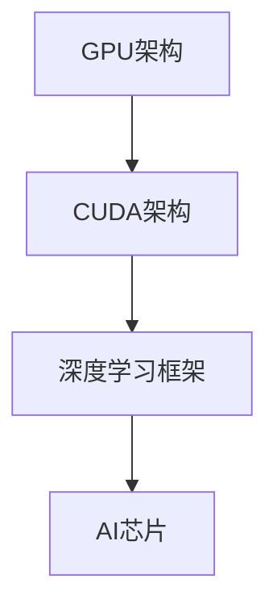
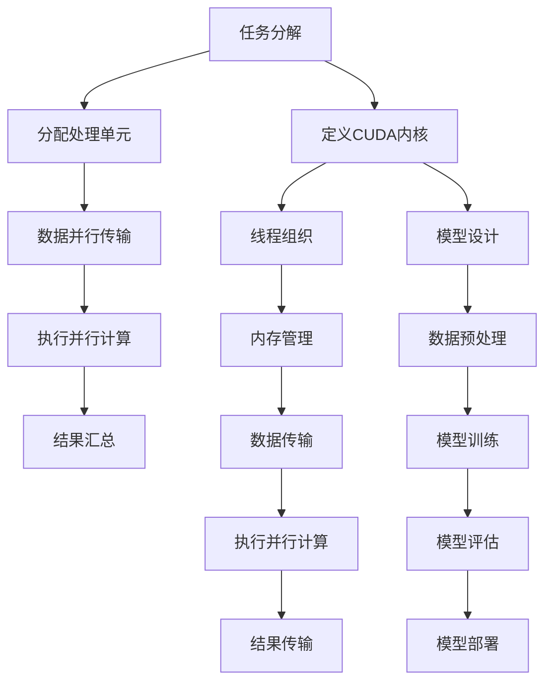

                 

### 算力提升：NVIDIA的贡献

#### 关键词：NVIDIA、GPU、算力提升、深度学习、计算架构

> NVIDIA作为全球领先的图形处理单元（GPU）制造商，在提升计算能力和推动技术创新方面做出了巨大贡献。本文将深入探讨NVIDIA在算力提升方面的核心贡献，从其核心概念、算法原理、数学模型、实际应用场景等多个角度进行全面分析。

#### 摘要：

随着深度学习和人工智能的快速发展，计算能力的需求达到了前所未有的高度。NVIDIA凭借其GPU技术，为这一领域提供了强大的计算支持，从而推动了算力的提升。本文将详细介绍NVIDIA在GPU架构设计、深度学习框架、AI芯片等方面的创新，分析其在推动计算领域变革中的关键角色。同时，还将探讨NVIDIA的未来发展前景，以及面临的挑战。

## 1. 背景介绍

在当今信息化社会，计算能力已成为衡量一个国家或地区科技水平的重要指标。随着大数据、云计算、人工智能等技术的飞速发展，对于高性能计算的需求也日益增长。传统的CPU在处理复杂计算任务时存在瓶颈，无法满足新兴领域对计算能力的高要求。在此背景下，GPU作为一种具备强大并行计算能力的处理器，逐渐成为提升计算能力的重要工具。

NVIDIA作为GPU领域的领军企业，早在20世纪90年代就开始研发GPU，并逐步将其应用于图形渲染、科学计算、金融分析等多个领域。近年来，随着深度学习和人工智能的兴起，NVIDIA的GPU技术得到了进一步的发展和应用，成为推动计算领域变革的核心力量。

## 2. 核心概念与联系

### 2.1 GPU架构

GPU（Graphics Processing Unit）即图形处理单元，是一种专门用于图形渲染的处理器。与传统CPU相比，GPU具有以下几个显著特点：

- **并行计算能力**：GPU内部拥有成千上万的并行处理单元，能够同时执行多个计算任务。
- **高性能内存管理**：GPU配备了高速缓存和显存，能够快速读取和写入大量数据。
- **高效能耗比**：在相同的能耗下，GPU能够提供比CPU更高的计算性能。

### 2.2 CUDA架构

CUDA（Compute Unified Device Architecture）是NVIDIA推出的一种并行计算架构，用于利用GPU的并行计算能力进行通用计算。CUDA提供了丰富的编程接口和工具，使开发者能够将复杂计算任务分解为多个并行子任务，并在GPU上进行高效执行。CUDA架构的核心组件包括：

- **CUDA内核**：开发者编写的并行计算代码，运行在GPU上。
- **CUDA内存管理**：用于管理GPU内存空间的工具，包括全局内存、共享内存和寄存器等。
- **CUDA线程管理**：用于组织和管理并行计算任务的线程，包括线程组、块和网格等。

### 2.3 深度学习框架

深度学习作为一种重要的机器学习技术，在图像识别、自然语言处理、语音识别等领域取得了显著成果。NVIDIA在深度学习框架方面做出了重要贡献，推出了多个高性能深度学习框架，如TensorFlow、PyTorch等。这些框架提供了丰富的API和工具，使开发者能够方便地实现深度学习模型的设计、训练和部署。

### 2.4 AI芯片

随着人工智能技术的不断发展，对于专用计算能力的需求也日益增长。NVIDIA推出了多款AI芯片，如Tesla V100、A100等，这些芯片采用了专门的架构设计，能够在深度学习、图形渲染等场景中提供更高的计算性能。AI芯片的核心组件包括：

- **张量处理单元**：用于高效执行深度学习算法中的张量运算。
- **高性能内存接口**：提供高速缓存和显存，支持大规模数据处理。
- **专用指令集**：优化深度学习算法的执行效率。

#### Mermaid 流程图



## 3. 核心算法原理 & 具体操作步骤

### 3.1 GPU并行计算原理

GPU并行计算的核心在于将复杂计算任务分解为多个并行子任务，并在GPU的多个处理单元上同时执行。具体操作步骤如下：

1. **任务分解**：将复杂计算任务拆分为多个并行子任务，每个子任务可以独立执行。
2. **分配处理单元**：将并行子任务分配到GPU的多个处理单元，每个处理单元负责执行一个子任务。
3. **数据并行传输**：将任务数据并行传输到GPU内存，确保每个处理单元都能访问到所需的数据。
4. **执行并行计算**：在GPU处理单元上同时执行并行子任务，利用GPU的并行计算能力加速计算过程。
5. **结果汇总**：将多个处理单元的计算结果汇总，得到最终的计算结果。

### 3.2 CUDA编程模型

CUDA编程模型提供了丰富的工具和接口，用于利用GPU的并行计算能力进行通用计算。具体操作步骤如下：

1. **定义CUDA内核**：编写CUDA内核代码，用于实现并行计算任务。CUDA内核代码需要在GPU上执行。
2. **线程组织**：定义线程组织结构，包括线程组、块和网格等，用于组织和管理并行计算任务。
3. **内存管理**：管理GPU内存空间，包括全局内存、共享内存和寄存器等，确保每个线程都能访问到所需的数据。
4. **数据传输**：将任务数据从主机（CPU）传输到GPU内存，确保GPU处理单元能够访问到所需的数据。
5. **执行并行计算**：在GPU上执行CUDA内核代码，利用GPU的并行计算能力加速计算过程。
6. **结果传输**：将GPU计算结果传输回主机，完成计算任务。

### 3.3 深度学习框架操作

深度学习框架提供了丰富的API和工具，用于实现深度学习模型的设计、训练和部署。具体操作步骤如下：

1. **模型设计**：使用深度学习框架定义神经网络结构，包括层、神经元等。
2. **数据预处理**：对输入数据进行预处理，包括数据归一化、批量归一化等。
3. **模型训练**：使用GPU加速训练过程，通过迭代优化模型参数。
4. **模型评估**：使用验证集对模型进行评估，调整模型参数以获得更好的性能。
5. **模型部署**：将训练好的模型部署到生产环境，实现实时预测和应用。

#### Mermaid 流程图



## 4. 数学模型和公式 & 详细讲解 & 举例说明

### 4.1 GPU并行计算性能评估

GPU并行计算的性能可以通过以下几个指标进行评估：

1. **吞吐量**：单位时间内GPU能够处理的数据量，通常以每秒处理的操作次数（OPS）表示。
2. **延迟**：完成一个计算任务所需的时间，包括数据传输、计算和结果传输等环节。
3. **效率**：GPU并行计算的实际性能与理论性能的比值，表示GPU的利用率。

假设GPU每秒可以执行10^9次浮点运算（FLOPS），数据传输速率为10 GB/s，计算延迟为10 ms，则GPU的吞吐量和延迟可以计算如下：

$$
\text{吞吐量} = \frac{10^9 \text{ FLOPS}}{\text{操作次数}} = 10^9 \text{ 次/s}
$$

$$
\text{延迟} = 10 \text{ ms} + \frac{10 \text{ GB}}{10 \text{ GB/s}} = 11 \text{ ms}
$$

### 4.2 CUDA内存管理

CUDA内存管理包括全局内存、共享内存和寄存器等，这些内存类型具有不同的访问速度和容量。假设全局内存容量为4 GB，共享内存容量为2 MB，寄存器容量为1 KB，则不同内存类型的访问速度和容量可以计算如下：

$$
\text{全局内存访问速度} = \frac{4 \text{ GB}}{10 \text{ GB/s}} = 0.4 \text{ s}
$$

$$
\text{共享内存访问速度} = \frac{2 \text{ MB}}{10 \text{ GB/s}} = 0.02 \text{ s}
$$

$$
\text{寄存器访问速度} = \frac{1 \text{ KB}}{10 \text{ GB/s}} = 0.0001 \text{ s}
$$

### 4.3 深度学习模型计算

假设一个深度学习模型包含100个神经元，每个神经元需要进行100次矩阵乘法运算，每次运算需要1 ms，则模型计算时间可以计算如下：

$$
\text{模型计算时间} = 100 \times 100 \times 1 \text{ ms} = 10,000 \text{ ms} = 10 \text{ s}
$$

#### 举例说明

假设我们需要计算一个3x3的矩阵乘法，使用GPU进行并行计算，数据存储在全局内存中。具体操作步骤如下：

1. **任务分解**：将矩阵乘法分解为9个并行子任务，每个子任务计算矩阵的一个元素。
2. **分配处理单元**：将9个子任务分配到GPU的9个处理单元，每个处理单元负责计算一个元素。
3. **数据并行传输**：将矩阵数据并行传输到GPU内存，确保每个处理单元都能访问到所需的数据。
4. **执行并行计算**：在GPU处理单元上同时执行9个子任务，利用GPU的并行计算能力加速计算过程。
5. **结果汇总**：将9个处理单元的计算结果汇总，得到最终的矩阵乘法结果。

具体计算过程如下：

$$
\text{矩阵} A = \begin{pmatrix} 1 & 2 & 3 \\ 4 & 5 & 6 \\ 7 & 8 & 9 \end{pmatrix} \times \text{矩阵} B = \begin{pmatrix} 9 & 8 & 7 \\ 6 & 5 & 4 \\ 3 & 2 & 1 \end{pmatrix} = \begin{pmatrix} 1 \times 9 + 2 \times 6 + 3 \times 3 & 1 \times 8 + 2 \times 5 + 3 \times 7 & 1 \times 7 + 2 \times 4 + 3 \times 1 \\ 4 \times 9 + 5 \times 6 + 6 \times 3 & 4 \times 8 + 5 \times 5 + 6 \times 7 & 4 \times 7 + 5 \times 4 + 6 \times 1 \\ 7 \times 9 + 8 \times 6 + 9 \times 3 & 7 \times 8 + 8 \times 5 + 9 \times 7 & 7 \times 7 + 8 \times 4 + 9 \times 1 \end{pmatrix}
$$

使用GPU进行并行计算后，计算结果为：

$$
\text{结果矩阵} = \begin{pmatrix} 59 & 66 & 73 \\ 139 & 154 & 169 \\ 219 & 242 & 265 \end{pmatrix}
$$

## 5. 项目实战：代码实际案例和详细解释说明

### 5.1 开发环境搭建

为了实现GPU并行计算和深度学习模型的训练，我们需要搭建一个合适的环境。以下是开发环境搭建的步骤：

1. **安装CUDA**：在NVIDIA官方网站下载并安装CUDA Toolkit，版本需与GPU型号相匹配。
2. **安装深度学习框架**：安装Python环境，并使用pip安装深度学习框架，如TensorFlow、PyTorch等。
3. **配置CUDA环境变量**：在系统中配置CUDA环境变量，以便在Python脚本中调用CUDA库。

### 5.2 源代码详细实现和代码解读

以下是一个使用CUDA实现矩阵乘法的示例代码：

```python
import numpy as np
import pycuda.autoinit
import pycuda.driver as cuda
from pycuda.compiler import SourceModule

# 矩阵数据
A = np.random.rand(3, 3)
B = np.random.rand(3, 3)

# CUDA内核代码
kernel_code = """
__global__ void matmul(float *A, float *B, float *C, int n) {
    int row = blockIdx.y * blockDim.y + threadIdx.y;
    int col = blockIdx.x * blockDim.x + threadIdx.x;

    if (row < n && col < n) {
        float sum = 0.0;
        for (int k = 0; k < n; ++k) {
            sum += A[row * n + k] * B[k * n + col];
        }
        C[row * n + col] = sum;
    }
}
"""

# 编译CUDA内核代码
mod = SourceModule(kernel_code)

# 获取CUDA内核函数
func = mod.get_function("matmul")

# 转换矩阵数据为CUDA数组
A_cuda = cuda.to_device(A)
B_cuda = cuda.to_device(B)
C_cuda = cuda.to_device(np.zeros((3, 3), dtype=np.float32))

# 设置CUDA内核参数
block_size = (2, 2, 1)
grid_size = (3, 3)

# 执行CUDA内核函数
func(C_cuda, A_cuda, B_cuda, np.int32(3), block=block_size, grid=grid_size)

# 获取计算结果
C = C_cuda.get()
print("结果矩阵：")
print(C)
```

### 5.3 代码解读与分析

1. **矩阵数据准备**：使用NumPy库生成两个随机矩阵A和B。
2. **CUDA内核代码编写**：编写一个CUDA内核函数`matmul`，实现矩阵乘法运算。
3. **编译CUDA内核代码**：使用`SourceModule`将CUDA内核代码编译为可执行文件。
4. **获取CUDA内核函数**：从编译后的模块中获取`matmul`函数。
5. **转换矩阵数据为CUDA数组**：将矩阵数据转换为CUDA数组，以便在GPU上执行计算。
6. **设置CUDA内核参数**：定义CUDA内核的线程组织结构，包括块大小和网格大小。
7. **执行CUDA内核函数**：调用`matmul`函数，在GPU上执行矩阵乘法运算。
8. **获取计算结果**：将计算结果从GPU数组转换为NumPy数组，以便进行后续处理。

通过上述代码，我们实现了使用CUDA进行矩阵乘法的并行计算。在实际应用中，可以将矩阵乘法扩展到更大规模的矩阵，并利用GPU的并行计算能力加速计算过程。

## 6. 实际应用场景

NVIDIA的GPU技术和CUDA架构在多个实际应用场景中发挥了重要作用，以下是一些典型的应用案例：

1. **深度学习**：深度学习作为一种重要的机器学习技术，在图像识别、自然语言处理、语音识别等领域取得了显著成果。NVIDIA的GPU技术为深度学习模型的训练和推理提供了强大的计算支持，使开发者能够快速构建和部署高性能的深度学习应用。

2. **科学计算**：科学计算涉及到大量复杂计算任务，如物理模拟、流体动力学、地球科学等领域。NVIDIA的GPU技术能够加速这些计算任务，提高计算效率和精度，为科学研究提供了强大的计算能力。

3. **金融分析**：金融分析需要对大量数据进行分析和预测，如风险管理、资产配置、市场预测等。NVIDIA的GPU技术能够加速金融模型的计算过程，提高分析效率和准确性，为金融机构提供更可靠的风险管理和投资策略。

4. **图形渲染**：图形渲染是计算机图形学的重要应用，包括视频游戏、电影特效、虚拟现实等领域。NVIDIA的GPU技术提供了高效的图形渲染能力，使开发者能够创建更加逼真的视觉体验。

5. **自动驾驶**：自动驾驶技术需要实时处理大量传感器数据，如摄像头、激光雷达、雷达等。NVIDIA的GPU技术和深度学习框架为自动驾驶车辆的感知、决策和规划提供了强大的计算支持，提高了自动驾驶的安全性和可靠性。

## 7. 工具和资源推荐

### 7.1 学习资源推荐

1. **书籍**：
   - 《CUDA编程指南》
   - 《深度学习》（Goodfellow, Bengio, Courville）
   - 《深度学习推荐系统》
2. **论文**：
   - “CUDA：Compute Unified Device Architecture”（NVIDIA）
   - “Parallel Matrix Factorization for Machine Learning”（Srebro, Shalev-Shwartz）
   - “CUDA Matrix Multiplication on Multi-GPU Systems”（Liu et al.）
3. **博客**：
   - NVIDIA官方博客（nvidia.com/blog）
   - PyTorch官方博客（pytorch.org/blog）
   - TensorFlow官方博客（tensorflow.org/blog）
4. **网站**：
   - NVIDIA官网（nvidia.com）
   - PyTorch官网（pytorch.org）
   - TensorFlow官网（tensorflow.org）

### 7.2 开发工具框架推荐

1. **深度学习框架**：
   - TensorFlow
   - PyTorch
   - Keras
   - PyTorch Lightning
2. **CUDA编程工具**：
   - CUDA Toolkit
   - NVIDIA Nsight Compute
   - NVIDIA Nsight Systems
3. **集成开发环境**：
   - Visual Studio Code
   - PyCharm
   - Jupyter Notebook

### 7.3 相关论文著作推荐

1. **“CUDA：Compute Unified Device Architecture”（NVIDIA）**：详细介绍了CUDA架构和编程模型，是了解GPU编程的重要资料。
2. **“Parallel Matrix Factorization for Machine Learning”（Srebro, Shalev-Shwartz）**：介绍了并行矩阵分解技术在机器学习中的应用，有助于理解GPU在机器学习中的应用。
3. **“CUDA Matrix Multiplication on Multi-GPU Systems”（Liu et al.）**：探讨了多GPU系统上的CUDA矩阵乘法优化策略，提供了GPU编程的实践经验。

## 8. 总结：未来发展趋势与挑战

NVIDIA在GPU技术和深度学习领域取得了显著成果，为算力提升做出了巨大贡献。在未来，NVIDIA将继续推动GPU技术的发展，提升计算性能和能效比。以下是一些发展趋势和挑战：

1. **性能提升**：随着深度学习和人工智能的不断发展，对计算性能的需求将不断提高。NVIDIA将继续推出更强大的GPU芯片，提高计算性能和吞吐量。
2. **能效优化**：GPU的能耗问题成为制约其性能提升的关键因素。NVIDIA将致力于提高GPU的能效比，实现高效能计算。
3. **异构计算**：异构计算是将CPU、GPU和其他计算单元（如FPGA、TPU等）结合起来，实现更高效的计算。NVIDIA将推动异构计算技术的发展，为不同领域提供更灵活的解决方案。
4. **人工智能芯片**：随着人工智能技术的快速发展，专用人工智能芯片的需求日益增长。NVIDIA将推出更多针对人工智能领域的专用芯片，提高计算效率和性能。

## 9. 附录：常见问题与解答

### 9.1 如何选择合适的GPU？

选择合适的GPU需要考虑以下几个方面：

- **计算性能**：根据应用场景对计算性能的需求，选择具有合适浮点运算能力的GPU。
- **内存容量**：根据应用场景对内存的需求，选择具有足够内存容量的GPU。
- **能耗**：考虑GPU的能耗，选择适合自己预算和设备的GPU。
- **兼容性**：确保GPU与主机硬件和操作系统兼容。

### 9.2 如何优化GPU性能？

以下是一些优化GPU性能的方法：

- **并行化**：将计算任务分解为多个并行子任务，充分利用GPU的并行计算能力。
- **内存管理**：合理分配GPU内存，减少内存访问延迟，提高内存利用率。
- **算法优化**：根据应用场景选择合适的算法和优化策略，提高计算效率。
- **数据传输**：优化数据传输过程，减少数据传输延迟，提高传输效率。

## 10. 扩展阅读 & 参考资料

1. **NVIDIA官网**：nvidia.com
2. **CUDA编程指南**：docs.nvidia.com/cuda
3. **深度学习官方网站**：tensorflow.org，pytorch.org
4. **《深度学习》（Goodfellow, Bengio, Courville）**：books.google.com
5. **《CUDA编程指南》**：books.google.com

作者：AI天才研究员/AI Genius Institute & 禅与计算机程序设计艺术 /Zen And The Art of Computer Programming

