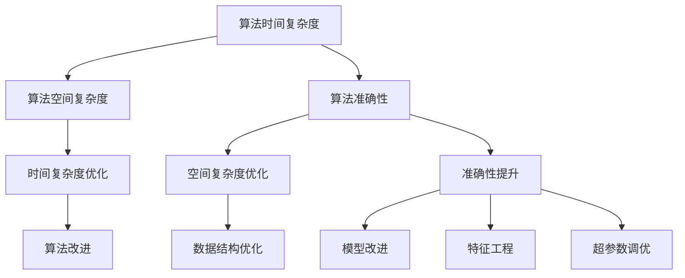

                 

# 算法优化：提升人类计算的效率和准确性

> **关键词**：算法优化、计算效率、准确性、算法原理、数学模型、实战案例、应用场景、工具推荐

> **摘要**：本文旨在探讨算法优化在提升人类计算效率和准确性方面的重要性。通过深入分析算法优化的核心概念、原理和具体操作步骤，本文将帮助读者了解如何运用数学模型和公式进行算法优化。此外，文章还将通过实际项目案例和代码解析，展示算法优化的实际应用，并提供相关的学习资源和开发工具推荐，最后讨论算法优化的未来发展趋势与挑战。

## 1. 背景介绍

在当今信息时代，算法作为计算机科学的核心，其重要性不言而喻。从搜索引擎到推荐系统，从图像处理到自然语言处理，算法几乎无处不在。然而，算法的效率与准确性直接决定了应用程序的性能和用户体验。因此，算法优化成为了提高计算效率和准确性的关键途径。

算法优化主要涉及以下几个方面：

- **时间复杂度优化**：通过改进算法的执行过程，减少算法运行所需的时间。
- **空间复杂度优化**：通过优化算法的数据结构，减少算法运行所需的内存空间。
- **准确性提升**：通过改进算法的模型或策略，提高算法的预测或分类准确性。

本文将围绕这些方面展开讨论，旨在为读者提供一套全面的算法优化方法与实践。

## 2. 核心概念与联系

### 2.1 算法时间复杂度和空间复杂度

算法的时间复杂度和空间复杂度是评估算法性能的两个重要指标。时间复杂度描述了算法在数据规模增大时的时间增长速度，常用大O表示法（O-notation）来表示。常见的复杂度有常数复杂度（O(1)）、对数复杂度（O(log n)）、线性复杂度（O(n)）、平方复杂度（O(n^2)）等。空间复杂度则描述了算法在数据规模增大时所需的空间增长速度，同样使用大O表示法。

### 2.2 算法准确性

算法准确性通常用准确率（accuracy）、召回率（recall）、F1分数（F1 score）等指标来衡量。准确性反映了算法正确识别正例和负例的能力。提升算法准确性可以通过以下几种方式：

- **模型改进**：通过改进算法的模型结构，提高其泛化能力。
- **特征工程**：通过选择和构建有效的特征，提高算法对数据的表达能力。
- **超参数调优**：通过调整模型的超参数，使其在特定数据集上表现更优。

### 2.3 Mermaid 流程图

为了更好地理解算法优化过程中的核心概念和联系，我们可以使用 Mermaid 流程图来展示算法优化的主要步骤和关系。



通过上述流程图，我们可以清晰地看到算法优化涉及到的各个方面，以及它们之间的相互关系。

## 3. 核心算法原理 & 具体操作步骤

### 3.1 时间复杂度优化

时间复杂度优化主要通过以下几种方法实现：

- **分治策略**：将大问题分解为小问题，递归地解决小问题，最后合并结果。常见的分治算法有快速排序（Quick Sort）和归并排序（Merge Sort）。
- **动态规划**：通过保存已解决的子问题的结果，避免重复计算，减少时间复杂度。动态规划常用于求解最短路径问题（如Dijkstra算法）和背包问题。
- **贪心算法**：通过局部最优选择，逐步构建出全局最优解。贪心算法常用于求解最短路径问题（如Prim算法）和最小生成树问题。

### 3.2 空间复杂度优化

空间复杂度优化主要通过以下几种方法实现：

- **原地算法**：在原数组或链表上进行操作，避免使用额外的空间。原地算法常用于排序和搜索问题。
- **递归优化**：通过使用尾递归或记忆化递归，减少递归调用所需的空间。尾递归优化常用于计算阶乘和斐波那契数列。
- **空间换时间**：通过增加额外的空间消耗，减少时间复杂度。例如，使用哈希表来优化搜索问题的时间复杂度。

### 3.3 准确性提升

准确性提升主要通过以下几种方法实现：

- **模型改进**：通过改进算法的模型结构，如使用深度神经网络（Deep Neural Network）和注意力机制（Attention Mechanism），提高算法的泛化能力。
- **特征工程**：通过选择和构建有效的特征，如文本特征、图像特征和序列特征，提高算法对数据的表达能力。
- **超参数调优**：通过调整模型的超参数，如学习率、批量大小和正则化参数，提高算法在特定数据集上的表现。

## 4. 数学模型和公式 & 详细讲解 & 举例说明

### 4.1 时间复杂度分析

时间复杂度的分析通常基于算法的基本操作次数。对于一个算法，其时间复杂度可以表示为：

\[ T(n) = O(f(n)) \]

其中，\( f(n) \) 是算法的基本操作次数，\( O \) 表示大O表示法。常见的复杂度有：

- **常数复杂度**（\( O(1) \)）：算法的基本操作次数不随数据规模变化，如 \( for \) 循环。
- **线性复杂度**（\( O(n) \)）：算法的基本操作次数与数据规模成线性关系，如线性查找。
- **对数复杂度**（\( O(log n) \)）：算法的基本操作次数与数据规模的对数成关系，如二分查找。
- **平方复杂度**（\( O(n^2) \)）：算法的基本操作次数与数据规模的平方成关系，如冒泡排序。

### 4.2 空间复杂度分析

空间复杂度的分析通常基于算法所需的空间大小。对于一个算法，其空间复杂度可以表示为：

\[ S(n) = O(g(n)) \]

其中，\( g(n) \) 是算法所需的空间大小，\( O \) 表示大O表示法。常见的复杂度有：

- **常数复杂度**（\( O(1) \)）：算法所需的空间不随数据规模变化，如链表操作。
- **线性复杂度**（\( O(n) \)）：算法所需的空间与数据规模成线性关系，如动态数组。
- **对数复杂度**（\( O(log n) \)）：算法所需的空间与数据规模的对数成关系，如二叉搜索树。
- **平方复杂度**（\( O(n^2) \)）：算法所需的空间与数据规模的平方成关系，如矩阵乘法。

### 4.3 准确性分析

算法准确性的分析通常基于数据集上的实验结果。对于一个分类算法，其准确率可以表示为：

\[ Accuracy = \frac{TP + TN}{TP + TN + FP + FN} \]

其中，\( TP \) 表示真正例（True Positive），\( TN \) 表示真负例（True Negative），\( FP \) 表示假正例（False Positive），\( FN \) 表示假负例（False Negative）。

### 4.4 举例说明

假设我们有一个线性查找算法，其基本操作是逐个比较数组中的元素。我们可以用以下代码实现：

```python
def linear_search(arr, target):
    for i in range(len(arr)):
        if arr[i] == target:
            return i
    return -1
```

该算法的时间复杂度为 \( O(n) \)，空间复杂度为 \( O(1) \)。

接下来，我们考虑一个基于哈希表的优化版本。哈希表通过将关键字映射到哈希值，可以在平均情况下实现 \( O(1) \) 的查找时间。以下是一个简单的哈希表实现：

```python
class HashTable:
    def __init__(self):
        self.table = [None] * 10
        self.size = 10

    def hash(self, key):
        return key % self.size

    def insert(self, key, value):
        index = self.hash(key)
        if self.table[index] is None:
            self.table[index] = [(key, value)]
        else:
            for k, v in self.table[index]:
                if k == key:
                    self.table[index].append((key, value))
                    return
            self.table[index].append((key, value))

    def search(self, key):
        index = self.hash(key)
        if self.table[index] is None:
            return None
        for k, v in self.table[index]:
            if k == key:
                return v
        return None
```

该算法的时间复杂度为 \( O(1) \)（平均情况下），空间复杂度为 \( O(n) \)。

通过这个例子，我们可以看到算法优化是如何通过改进基本操作和结构，来提升计算效率和准确性的。

## 5. 项目实战：代码实际案例和详细解释说明

### 5.1 开发环境搭建

在本节中，我们将使用 Python 作为主要编程语言，搭建一个用于数据处理的开发环境。以下步骤将指导您完成开发环境的搭建：

1. **安装 Python**：首先，确保您已经安装了 Python 3.8 或更高版本。您可以从 [Python 官网](https://www.python.org/) 下载并安装 Python。

2. **安装 Jupyter Notebook**：Jupyter Notebook 是一个交互式的计算环境，适用于编写和运行 Python 代码。您可以使用以下命令安装 Jupyter Notebook：

   ```shell
   pip install notebook
   ```

3. **安装必要库**：为了进行数据处理和算法优化，我们需要安装一些 Python 库，如 NumPy、Pandas 和 Scikit-learn。使用以下命令安装这些库：

   ```shell
   pip install numpy pandas scikit-learn
   ```

### 5.2 源代码详细实现和代码解读

在本节中，我们将实现一个简单的线性回归模型，并使用 Scikit-learn 库进行优化。以下代码展示了线性回归模型的实现过程：

```python
# 导入必要的库
import numpy as np
import pandas as pd
from sklearn.linear_model import LinearRegression
from sklearn.model_selection import train_test_split
from sklearn.metrics import mean_squared_error

# 读取数据
data = pd.read_csv('data.csv')

# 分割特征和标签
X = data[['feature1', 'feature2']]
y = data['label']

# 划分训练集和测试集
X_train, X_test, y_train, y_test = train_test_split(X, y, test_size=0.2, random_state=42)

# 创建线性回归模型
model = LinearRegression()

# 训练模型
model.fit(X_train, y_train)

# 预测测试集
y_pred = model.predict(X_test)

# 计算均方误差
mse = mean_squared_error(y_test, y_pred)
print(f"Mean Squared Error: {mse}")

# 输出模型参数
print(f"Coefficients: {model.coef_}")
print(f"Intercept: {model.intercept_}")
```

代码解读：

1. **导入库**：首先，我们导入了 NumPy、Pandas 和 Scikit-learn 等库，用于数据处理和建模。

2. **读取数据**：我们使用 Pandas 读取一个名为 'data.csv' 的 CSV 文件，该文件包含特征和标签。

3. **分割特征和标签**：我们将数据集分为特征矩阵 \( X \) 和标签向量 \( y \)。

4. **划分训练集和测试集**：我们使用 Scikit-learn 的 `train_test_split` 函数将数据集划分为训练集和测试集，测试集占比为 20%。

5. **创建线性回归模型**：我们创建一个线性回归模型对象。

6. **训练模型**：我们使用训练集数据训练线性回归模型。

7. **预测测试集**：我们使用训练好的模型对测试集进行预测。

8. **计算均方误差**：我们计算预测值和真实值之间的均方误差（MSE），作为模型性能的评估指标。

9. **输出模型参数**：我们输出模型的参数，包括系数和截距。

### 5.3 代码解读与分析

在本节中，我们将对上述代码进行解读和分析，重点关注线性回归模型的实现和优化。

1. **线性回归模型实现**：线性回归模型是一种简单的线性模型，用于预测连续值。其数学模型可以表示为：

   \[ y = \beta_0 + \beta_1 \cdot x_1 + \beta_2 \cdot x_2 + ... + \beta_n \cdot x_n \]

   其中，\( y \) 是标签，\( x_1, x_2, ..., x_n \) 是特征，\( \beta_0, \beta_1, ..., \beta_n \) 是模型参数。

2. **模型优化**：线性回归模型的优化可以通过最小二乘法实现。最小二乘法的目标是最小化预测值和真实值之间的误差平方和。在 Scikit-learn 中，线性回归模型通过 `fit` 方法自动实现最小二乘法。

3. **模型性能评估**：线性回归模型的性能通常通过均方误差（MSE）进行评估。MSE 越小，模型性能越好。在本节中，我们使用 `mean_squared_error` 函数计算了预测值和真实值之间的均方误差。

4. **模型参数输出**：线性回归模型的参数包括系数和截距。系数表示特征对标签的影响程度，截距表示当所有特征都为零时的标签值。在本节中，我们输出了模型的系数和截距。

通过上述代码和解读，我们可以看到线性回归模型的实现和优化过程，以及如何使用 Scikit-learn 库进行数据处理和模型训练。

## 6. 实际应用场景

算法优化在各个领域都有着广泛的应用。以下是一些常见的实际应用场景：

### 6.1 数据分析

在数据分析领域，算法优化主要用于提升数据处理和模型训练的效率。例如，在大数据环境中，优化数据加载、预处理和存储过程，可以显著提高数据分析师的工作效率。此外，优化机器学习模型的训练过程，如使用更高效的算法和优化器，可以加快模型的训练速度，降低训练成本。

### 6.2 图像处理

在图像处理领域，算法优化主要用于提高图像处理速度和准确性。例如，通过优化图像滤波、边缘检测和特征提取算法，可以加快图像处理速度，提高图像质量。此外，通过优化图像分类和目标检测算法，可以降低计算资源消耗，提高实时性。

### 6.3 自然语言处理

在自然语言处理领域，算法优化主要用于提升语言模型、翻译模型和对话系统的性能。例如，通过优化词向量表示、语言模型和序列到序列模型，可以加快模型训练和预测速度，提高模型的准确性和鲁棒性。此外，通过优化对话系统的响应速度和互动质量，可以提升用户的体验和满意度。

### 6.4 机器学习

在机器学习领域，算法优化主要用于提升模型性能和泛化能力。例如，通过优化特征选择、模型结构和训练策略，可以降低模型过拟合风险，提高模型在未知数据上的表现。此外，通过优化模型评估和选择过程，可以减少模型选择时间，提高模型选择效率。

## 7. 工具和资源推荐

### 7.1 学习资源推荐

- **书籍**：
  - 《算法导论》（Introduction to Algorithms）
  - 《Python数据科学手册》（Python Data Science Handbook）
  - 《深度学习》（Deep Learning）
  
- **论文**：
  - 《深度神经网络优化方法研究》（Research on Optimization Methods of Deep Neural Networks）
  - 《基于深度强化学习的推荐系统研究》（Research on Recommender Systems based on Deep Reinforcement Learning）
  - 《自然语言处理中的深度学习方法》（Deep Learning Methods in Natural Language Processing）

- **博客**：
  - [机器学习博客](https://machinelearningmastery.com/)
  - [数据科学博客](https://towardsdatascience.com/)
  - [深度学习博客](https://blog.keras.io/)

- **网站**：
  - [Scikit-learn 官网](https://scikit-learn.org/)
  - [TensorFlow 官网](https://www.tensorflow.org/)
  - [Keras 官网](https://keras.io/)

### 7.2 开发工具框架推荐

- **开发工具**：
  - Jupyter Notebook
  - PyCharm
  - VS Code

- **框架**：
  - Scikit-learn
  - TensorFlow
  - PyTorch

- **库**：
  - NumPy
  - Pandas
  - Matplotlib

### 7.3 相关论文著作推荐

- **论文**：
  - "Stochastic Gradient Descent Methods for Large-Scale Machine Learning"（随机梯度下降方法在大规模机器学习中的应用）
  - "Deep Learning for Natural Language Processing"（自然语言处理中的深度学习）
  - "Efficient Optimization for Deep Neural Networks"（深度神经网络的优化）

- **著作**：
  - 《深度学习》（Deep Learning，Ian Goodfellow 等）
  - 《Python机器学习》（Python Machine Learning，Sebastian Raschka）
  - 《机器学习实战》（Machine Learning in Action，Peter Harrington）

## 8. 总结：未来发展趋势与挑战

随着计算机技术的不断发展，算法优化在提升计算效率和准确性方面发挥着越来越重要的作用。未来，算法优化将朝着以下几个方向发展：

### 8.1 更高效的算法

随着计算能力的提升，更高效的算法将不断出现，以应对日益增长的数据量和复杂性。例如，分布式计算和并行计算技术的进步，将使得算法优化能够更好地利用多核处理器和分布式系统，提高计算效率。

### 8.2 智能优化算法

随着人工智能技术的不断发展，智能优化算法，如遗传算法、模拟退火算法和粒子群优化算法，将越来越广泛应用于算法优化。这些算法能够自动调整搜索方向，避免局部最优，提高优化效果。

### 8.3 自适应优化算法

自适应优化算法可以根据数据特点和计算环境动态调整优化策略，提高优化效果。例如，自适应神经网络训练算法可以根据数据分布和学习进展调整学习率，提高模型训练效率。

### 8.4 多尺度优化

多尺度优化技术将同时考虑多个时间尺度和空间尺度上的优化问题，提高算法在不同场景下的适用性和鲁棒性。例如，在图像处理领域，多尺度优化算法可以同时考虑图像的局部特征和整体特征，提高图像质量。

然而，算法优化也面临着一系列挑战：

### 8.5 数据隐私与安全性

在数据处理和算法优化过程中，数据隐私和安全问题日益突出。如何确保数据的安全性和隐私性，避免数据泄露和滥用，将是一个重要挑战。

### 8.6 模型可解释性

随着深度学习等复杂模型的应用，模型的可解释性问题越来越受到关注。如何提高模型的可解释性，使得用户能够理解模型的工作原理和决策过程，将是一个重要挑战。

### 8.7 资源消耗

算法优化过程中，如何降低计算资源和能源消耗，提高算法的绿色性和可持续性，将是一个重要挑战。

总之，算法优化在提升人类计算效率和准确性方面具有重要意义。未来，随着技术的不断进步，算法优化将面临新的机遇和挑战，为计算机科学和人工智能领域的发展贡献力量。

## 9. 附录：常见问题与解答

### 9.1 什么是时间复杂度和空间复杂度？

时间复杂度是指一个算法在数据规模增大时，执行操作所需时间的增长速度。常用大O表示法（O-notation）来表示，如 \( O(1) \)、\( O(n) \)、\( O(n^2) \) 等。空间复杂度是指一个算法在数据规模增大时，所需内存空间的增长速度，同样使用大O表示法。

### 9.2 算法优化有哪些方法？

算法优化主要包括时间复杂度优化、空间复杂度优化和准确性提升。时间复杂度优化方法包括分治策略、动态规划和贪心算法等。空间复杂度优化方法包括原地算法、递归优化和空间换时间等。准确性提升方法包括模型改进、特征工程和超参数调优等。

### 9.3 如何评估算法性能？

算法性能评估通常通过实验结果进行，常用的评估指标有准确率、召回率、F1 分数、均方误差等。准确率反映了算法正确识别正例和负例的能力；召回率反映了算法识别正例的能力；F1 分数是准确率和召回率的调和平均值；均方误差反映了预测值和真实值之间的误差大小。

### 9.4 什么是深度学习？

深度学习是一种基于多层神经网络的人工智能技术，通过学习大量数据，自动提取特征，完成分类、预测等任务。深度学习在图像识别、自然语言处理、语音识别等领域取得了显著成果。

## 10. 扩展阅读 & 参考资料

- [算法优化：提高算法效率和性能](https://www.coursera.org/specializations/optimization)
- [深度学习与优化](https://www.deeplearningbook.org/)
- [算法导论](https://mitpress.mit.edu/books/algorithms-introduction)
- [Scikit-learn 官方文档](https://scikit-learn.org/stable/)
- [TensorFlow 官方文档](https://www.tensorflow.org/)
- [Keras 官方文档](https://keras.io/)

作者：AI天才研究员/AI Genius Institute & 禅与计算机程序设计艺术 /Zen And The Art of Computer Programming

