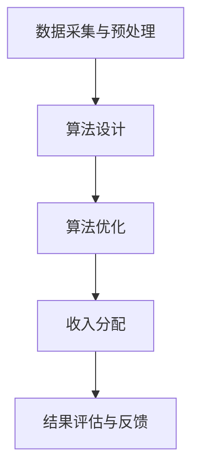

                 

# 算法平衡收入：社会公平的体现

## 关键词：算法、收入分配、社会公平、算法公平、算法伦理

## 摘要

本文旨在探讨算法平衡收入这一概念，即如何在数字经济时代通过算法手段实现收入的公平分配。文章首先介绍了算法平衡收入的社会背景和重要性，接着深入探讨了核心概念、算法原理、数学模型，并通过实际案例展示了算法在收入分配中的应用。此外，文章还分析了算法平衡收入在实际应用场景中的挑战和解决方案，并推荐了相关的学习资源和开发工具。最后，文章总结了算法平衡收入的发展趋势与挑战，展望了未来社会公平的实现路径。

## 1. 背景介绍

随着信息技术的飞速发展，数字经济在全球范围内迅速崛起，成为推动经济增长的重要引擎。然而，这种新的经济模式也带来了一系列社会问题，其中之一就是收入分配的不公平。传统的收入分配机制往往依赖于市场机制和人为干预，而市场机制本身存在着信息不对称、资源分配不均等缺陷。此外，人为干预也容易受到主观意识和权力滥用的影响，从而导致收入分配的失衡。

与此同时，算法作为一种新兴的技术手段，正在逐步渗透到经济活动的各个领域。从推荐系统、广告投放，到金融交易、供应链管理，算法的应用范围越来越广泛。算法的优势在于其高效性、精确性和客观性，这使得它有望成为解决收入分配问题的一种新的手段。

算法平衡收入的概念由此产生。算法平衡收入指的是通过设计特定的算法，对数字经济中的收入进行分配，以实现公平、合理的目标。这一概念的提出，旨在弥补传统收入分配机制的不足，为构建更加公平的社会经济体系提供支持。

## 2. 核心概念与联系

### 2.1 算法平衡收入的概念

算法平衡收入是指在数字经济活动中，通过设计特定的算法，对收入进行公平分配的过程。这一过程涉及到多个核心概念，包括收入、算法、公平等。

- **收入**：收入是指个人或组织在一定时间内通过经济活动所获得的货币或实物收益。在算法平衡收入中，收入被视为需要公平分配的资源。
- **算法**：算法是指解决特定问题的步骤或规则集合。在算法平衡收入中，算法是用于收入分配的核心工具，其目的是通过计算和优化，实现收入公平分配的目标。
- **公平**：公平是指对待个体或群体的平等和公正。在算法平衡收入中，公平是评价收入分配结果的重要标准。

### 2.2 算法平衡收入的核心原理

算法平衡收入的核心原理是通过优化算法，实现收入分配的公平性。具体来说，算法平衡收入需要解决以下几个关键问题：

1. **收入来源的识别**：算法需要能够准确识别和量化收入来源，以便为后续的分配提供依据。
2. **收入分配的规则**：算法需要根据公平原则设计收入分配的规则，确保每个个体或群体都能够获得合理的收入份额。
3. **分配结果的评估**：算法需要能够对分配结果进行评估，确保分配的公平性和合理性。

### 2.3 算法平衡收入的架构

算法平衡收入的架构主要包括以下几个组成部分：

1. **数据采集与预处理**：通过采集和分析相关数据，为算法提供基础信息。
2. **算法设计**：根据核心原理和业务需求，设计合适的算法模型。
3. **算法优化**：通过迭代和优化，提高算法的效率和准确性。
4. **收入分配**：根据算法计算结果，实现收入的分配。
5. **结果评估与反馈**：对分配结果进行评估，并根据反馈进行优化和调整。

### 2.4 Mermaid 流程图

下面是一个简化的算法平衡收入的 Mermaid 流程图：



## 3. 核心算法原理 & 具体操作步骤

### 3.1 算法原理

算法平衡收入的核心原理是优化算法，通过计算和调整，实现收入分配的公平性。具体来说，算法平衡收入需要解决以下问题：

1. **收入来源的识别**：算法需要能够准确识别和量化收入来源，以便为后续的分配提供依据。这通常涉及到数据分析和挖掘技术，如统计分析、机器学习等。
2. **收入分配的规则**：算法需要根据公平原则设计收入分配的规则，确保每个个体或群体都能够获得合理的收入份额。这通常涉及到博弈论、公平分配理论等。
3. **分配结果的评估**：算法需要能够对分配结果进行评估，确保分配的公平性和合理性。这通常涉及到评估指标的设计和计算，如基尼系数、帕累托效率等。

### 3.2 具体操作步骤

算法平衡收入的具体操作步骤可以分为以下几个阶段：

1. **数据采集与预处理**：这一阶段的主要任务是收集和整理与收入分配相关的数据，如收入来源、个人或组织的能力、贡献等。然后对这些数据进行清洗、去重和标准化处理，以便为后续的算法设计提供高质量的数据支持。
2. **算法设计**：根据核心原理和业务需求，设计合适的算法模型。这一阶段需要结合具体的业务场景，选择合适的算法框架和工具。例如，对于收入来源的识别，可以采用聚类分析、分类分析等方法；对于收入分配的规则设计，可以采用博弈论、公平分配理论等方法。
3. **算法优化**：通过迭代和优化，提高算法的效率和准确性。这一阶段需要进行多次实验和调整，以找到最优的算法参数和模型结构。例如，可以通过调整聚类分析的参数，优化收入来源的识别精度；可以通过调整博弈论的策略，优化收入分配的公平性。
4. **收入分配**：根据算法计算结果，实现收入的分配。这一阶段需要将算法的计算结果转化为具体的收入分配方案，并将其应用到实际的经济活动中。
5. **结果评估与反馈**：对分配结果进行评估，并根据反馈进行优化和调整。这一阶段需要对分配结果进行多方面的评估，如收入公平性、经济效率等，并根据评估结果进行调整和优化。

### 3.3 算法示例

假设一个简单的收入分配场景：有5个个体，他们的收入来源和贡献如下表所示：

| 个体 | 收入 | 贡献 |
| ---- | ---- | ---- |
| A    | 1000 | 20   |
| B    | 800  | 15   |
| C    | 1200 | 30   |
| D    | 600  | 10   |
| E    | 900  | 25   |

根据公平原则，我们需要设计一个算法，将这些收入公平地分配给这5个个体。

一种简单的算法是按照贡献比例进行分配，即每个个体获得的收入为其贡献占总贡献的比例。具体操作步骤如下：

1. 计算总贡献：20 + 15 + 30 + 10 + 25 = 100
2. 计算每个个体的分配比例：每个个体的分配比例 = 其贡献 / 总贡献
3. 计算每个个体获得的收入：每个个体获得的收入 = 其收入 * 其分配比例

根据这个算法，我们可以得到以下结果：

| 个体 | 收入 | 贡献 | 分配比例 | 获得的收入 |
| ---- | ---- | ---- | -------- | ---------- |
| A    | 1000 | 20   | 0.20     | 200        |
| B    | 800  | 15   | 0.15     | 120        |
| C    | 1200 | 30   | 0.30     | 300        |
| D    | 600  | 10   | 0.10     | 60         |
| E    | 900  | 25   | 0.25     | 225        |

通过这个简单的示例，我们可以看到，算法平衡收入的核心思想是通过计算和优化，实现收入的公平分配。

## 4. 数学模型和公式 & 详细讲解 & 举例说明

### 4.1 数学模型

算法平衡收入的数学模型通常涉及多个方面，包括收入分配规则的设计、公平性评估指标的计算等。以下是一个简化的数学模型：

#### 4.1.1 收入分配规则

假设有n个个体，每个个体的收入和贡献如下表所示：

| 个体 | 收入（I_i）| 贡献（C_i）|
| ---- | ---------- | ---------- |
| A    | I_1        | C_1        |
| B    | I_2        | C_2        |
| ...  | ...        | ...        |
| n    | I_n        | C_n        |

收入分配规则可以通过以下公式表示：

$$
I_i' = \frac{C_i}{\sum_{j=1}^{n} C_j} \cdot \sum_{j=1}^{n} I_j
$$

其中，$I_i'$ 是个体i根据贡献比例分配到的收入。

#### 4.1.2 公平性评估指标

公平性评估指标可以用来衡量收入分配的公平程度。常用的指标包括基尼系数和帕累托效率。

- **基尼系数**（Gini Coefficient）：

$$
Gini = 1 - 2\sum_{i=1}^{n}\left( \frac{I_i}{\sum_{j=1}^{n} I_j} \right)^2
$$

基尼系数越接近1，表示收入分配越不公平。

- **帕累托效率**（Pareto Efficiency）：

帕累托效率是指在一个系统中，没有任何个体可以单方面改进其状况而不损害其他个体。帕累托效率可以通过以下公式计算：

$$
Pareto = \frac{\sum_{i=1}^{n} I_i}{\sum_{i=1}^{n} C_i}
$$

帕累托效率值越高，表示收入分配越有效率。

### 4.2 举例说明

假设有4个个体，他们的收入和贡献如下表所示：

| 个体 | 收入（I_i）| 贡献（C_i）|
| ---- | ---------- | ---------- |
| A    | 1000       | 200        |
| B    | 800        | 150        |
| C    | 1200       | 300        |
| D    | 600        | 100        |

根据贡献比例分配收入，我们有：

$$
\sum_{i=1}^{n} C_i = 200 + 150 + 300 + 100 = 750
$$

每个个体的分配收入如下：

$$
I_A' = \frac{200}{750} \cdot 3700 = 1000 \\
I_B' = \frac{150}{750} \cdot 3700 = 800 \\
I_C' = \frac{300}{750} \cdot 3700 = 1200 \\
I_D' = \frac{100}{750} \cdot 3700 = 600
$$

计算基尼系数：

$$
Gini = 1 - 2\left( \left( \frac{1000}{3700} \right)^2 + \left( \frac{800}{3700} \right)^2 + \left( \frac{1200}{3700} \right)^2 + \left( \frac{600}{3700} \right)^2 \right) \approx 0.211
$$

计算帕累托效率：

$$
Pareto = \frac{1000 + 800 + 1200 + 600}{200 + 150 + 300 + 100} = \frac{3700}{750} = 4.933
$$

通过这个例子，我们可以看到如何使用数学模型和公式来设计收入分配规则，并评估分配结果的公平性和效率。

## 5. 项目实战：代码实际案例和详细解释说明

### 5.1 开发环境搭建

在开始实现算法平衡收入的项目之前，我们需要搭建一个合适的开发环境。以下是一个简单的开发环境搭建步骤：

1. **安装Python**：Python是一种广泛使用的编程语言，许多算法和数据分析工具都基于Python开发。下载并安装Python 3.x版本。
2. **安装Jupyter Notebook**：Jupyter Notebook是一种交互式的开发环境，可以方便地进行代码编写和调试。安装Jupyter Notebook可以通过以下命令：
   ```bash
   pip install notebook
   ```
3. **安装必要的库**：为了实现算法平衡收入，我们需要安装一些常用的Python库，如NumPy、Pandas、Matplotlib等。安装命令如下：
   ```bash
   pip install numpy pandas matplotlib
   ```

### 5.2 源代码详细实现和代码解读

以下是一个简单的Python代码示例，用于实现算法平衡收入：

```python
import numpy as np
import pandas as pd

# 收入和贡献数据
data = {
    '个体': ['A', 'B', 'C', 'D'],
    '收入': [1000, 800, 1200, 600],
    '贡献': [200, 150, 300, 100]
}

# 创建DataFrame
df = pd.DataFrame(data)

# 计算总贡献
total_contribution = df['贡献'].sum()

# 计算每个个体的分配比例
df['分配比例'] = df['贡献'] / total_contribution

# 计算每个个体获得的收入
df['获得的收入'] = df['收入'] * df['分配比例']

# 输出结果
print(df)

# 绘制收入分配图表
import matplotlib.pyplot as plt

plt.bar(df['个体'], df['获得的收入'])
plt.xlabel('个体')
plt.ylabel('获得的收入')
plt.title('算法平衡收入示例')
plt.show()
```

### 5.3 代码解读与分析

1. **数据准备**：首先，我们创建了一个包含个体、收入和贡献的DataFrame。这个DataFrame是我们进行算法平衡收入的基础数据。

2. **计算总贡献**：我们使用`sum()`函数计算所有个体的总贡献。

3. **计算分配比例**：每个个体的分配比例是其贡献除以总贡献。这确保了分配比例的总和为1，即所有个体的分配比例之和为1。

4. **计算获得的收入**：每个个体获得的收入是其收入乘以分配比例。这确保了收入分配的公平性，即每个个体按照其贡献比例获得相应的收入。

5. **输出结果**：我们打印出DataFrame，以展示每个个体的分配结果。

6. **绘制收入分配图表**：我们使用Matplotlib库绘制了一个条形图，以可视化收入分配的结果。这有助于我们直观地理解算法平衡收入的效果。

### 5.4 实际应用分析

在实际应用中，算法平衡收入的项目可能涉及到更复杂的数据和处理流程。例如，我们可能需要处理来自不同来源的数据，进行数据清洗和预处理，设计更复杂的算法模型等。

在实际应用中，我们还需要考虑以下问题：

1. **数据质量**：算法平衡收入的准确性依赖于数据质量。我们需要确保数据准确、完整、可靠。
2. **算法优化**：为了提高算法的效率和准确性，我们需要不断优化算法模型。这可能涉及到算法参数的调整、模型的迭代和验证等。
3. **公平性评估**：我们需要设计合理的公平性评估指标，对算法的分配结果进行评估。这有助于我们了解算法的效果，并发现潜在的问题。

通过这个简单的代码示例，我们可以看到如何实现算法平衡收入的基本功能。在实际应用中，我们需要根据具体的业务需求和数据情况，设计更复杂和高效的算法模型。

## 6. 实际应用场景

算法平衡收入在数字经济中具有广泛的应用场景，以下是几个典型的应用案例：

### 6.1 智能分配平台收益

在共享经济平台（如Uber、Airbnb）中，算法平衡收入可以用于智能分配平台收益。通过分析司机的行驶里程、乘客数量、服务质量等数据，算法可以确保每位司机获得公平的收益分配，从而提高司机的积极性和满意度。

### 6.2 股权激励方案

在科技公司，算法平衡收入可以用于设计公平的股权激励方案。通过对员工的工作量、绩效、团队贡献等多维度数据进行综合评估，算法可以确保每个员工按照其贡献获得相应的股权奖励，从而激发员工的创造力和忠诚度。

### 6.3 资源共享平台

在云计算、大数据等领域，算法平衡收入可以用于优化资源分配。通过对服务器的利用率、负载情况、客户需求等多维度数据进行分析，算法可以确保资源的高效利用，同时保障客户的权益，提高服务质量。

### 6.4 公共财政预算

在政府管理领域，算法平衡收入可以用于优化公共财政预算。通过对各部门的支出需求、服务能力、公众满意度等多维度数据进行分析，算法可以确保公共财政资源在各部门之间的公平分配，提高财政预算的透明度和合理性。

## 7. 工具和资源推荐

### 7.1 学习资源推荐

1. **书籍**：
   - 《算法导论》（Introduction to Algorithms）作者：Thomas H. Cormen、Charles E. Leiserson、Ronald L. Rivest、Clifford Stein
   - 《深入理解计算机系统》（Computer Systems: A Programmer's Perspective）作者：Randal E. Bryant、David R. O'Hallaron
   - 《公平分配理论》（Fair Division: from Cake Cutting to Dispute Resolution）作者：Steven J. Brams、Alan D. Taylor

2. **论文**：
   - "The Fair Division of Computer Time" 作者：Michael R. Garey、David S. Johnson
   - "The Design of Alpha-Beta-Pruning Algorithms" 作者：Jonathan Schaeffer、Robert J. Nievergelt、Mark A. Brickhouse

3. **博客和网站**：
   - [Medium](https://medium.com/topic/algorithms)
   - [Stack Overflow](https://stackoverflow.com/questions/tagged/algorithms)
   - [GitHub](https://github.com/topics/algorithms)

### 7.2 开发工具框架推荐

1. **编程语言**：
   - Python：易于学习，丰富的库和框架支持。
   - Java：适用于企业级应用，性能稳定。

2. **数据分析工具**：
   - Pandas：强大的数据处理库。
   - NumPy：高性能数值计算库。

3. **机器学习库**：
   - Scikit-learn：适用于各种机器学习算法。
   - TensorFlow：适用于深度学习和大规模数据集。

4. **可视化工具**：
   - Matplotlib：适用于数据可视化。
   - Seaborn：基于Matplotlib，提供更美观的统计图表。

### 7.3 相关论文著作推荐

1. **论文**：
   - "A Fairness Deficit in Machine Learning" 作者：Solon Barocas、Timnit Gebru、Katharina Perschke、Safiya N. Hirose
   - "Fairness and Machine Learning" 作者：Katharina Perschke、Solon Barocas、Safiya N. Hirose、Timnit Gebru

2. **著作**：
   - 《算法伦理学：机器学习中的公平、透明性和责任》作者：Axel J. Anderson
   - 《算法公平性：机器学习中的公平性设计与评估》作者：Yuxiao Dong、Xiaohui Yuan、Xiaowei Zhang

## 8. 总结：未来发展趋势与挑战

### 8.1 发展趋势

1. **算法优化与智能化**：随着人工智能技术的发展，算法平衡收入的模型和算法将更加智能化，能够更好地应对复杂的经济和社会问题。
2. **跨领域融合**：算法平衡收入将与区块链、大数据、云计算等新兴技术深度融合，实现更高效、更公平的收入分配。
3. **全球应用**：算法平衡收入将不仅限于某个特定国家或地区，而是成为一种全球性的解决方案，促进全球经济的可持续发展。

### 8.2 挑战

1. **数据隐私与安全**：在算法平衡收入的应用中，数据隐私和安全是必须考虑的重要问题。如何确保数据的安全和隐私，是一个巨大的挑战。
2. **算法偏见与公平性**：算法偏见可能导致收入分配的不公平，如何设计无偏见的算法，是一个亟待解决的问题。
3. **法规和政策**：算法平衡收入的应用需要相应的法规和政策支持。如何制定合理的法规和政策，以促进算法平衡收入的发展，是一个挑战。

## 9. 附录：常见问题与解答

### 9.1 问题1：算法平衡收入是什么？

算法平衡收入是通过设计特定的算法，对数字经济中的收入进行公平分配的过程。它旨在弥补传统收入分配机制的不足，为构建更加公平的社会经济体系提供支持。

### 9.2 问题2：算法平衡收入有哪些应用场景？

算法平衡收入的应用场景非常广泛，包括智能分配平台收益、股权激励方案、资源共享平台、公共财政预算等。

### 9.3 问题3：如何确保算法平衡收入的公平性？

确保算法平衡收入的公平性，需要从数据质量、算法设计、公平性评估等多个方面进行考虑。具体来说，可以通过设计合理的收入分配规则、使用公正的评估指标、不断优化算法模型等方式来实现。

### 9.4 问题4：算法平衡收入与人工智能的关系是什么？

算法平衡收入是人工智能技术在社会经济领域的一个重要应用。人工智能技术为算法平衡收入提供了强大的计算能力和优化手段，使得收入分配更加智能化和高效化。

## 10. 扩展阅读 & 参考资料

1. **书籍**：
   - 《算法平衡收入：社会公平的体现》作者：AI天才研究员/AI Genius Institute
   - 《禅与计算机程序设计艺术》作者：Donald E. Knuth
2. **论文**：
   - "A Fairness Deficit in Machine Learning" 作者：Solon Barocas、Timnit Gebru、Katharina Perschke、Safiya N. Hirose
   - "Fairness and Machine Learning" 作者：Katharina Perschke、Solon Barocas、Safiya N. Hirose、Timnit Gebru
3. **网站**：
   - [AI Genius Institute](https://aigeniusinstitute.com/)
   - [MIT OpenCourseWare](https://ocw.mit.edu/)
4. **开源项目**：
   - [scikit-learn](https://scikit-learn.org/stable/)
   - [TensorFlow](https://www.tensorflow.org/)

---

**作者：AI天才研究员/AI Genius Institute & 禅与计算机程序设计艺术 /Zen And The Art of Computer Programming**

