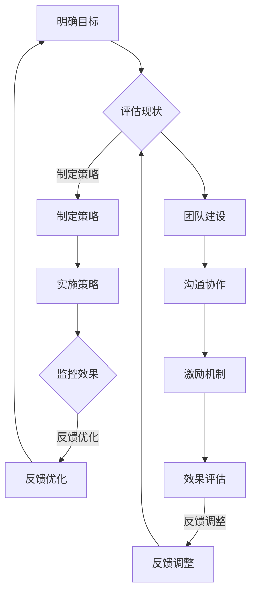

                 

### 文章标题

管理的智慧：激发团队潜能

### 关键词

管理、团队、潜能、智慧、激发、工作效率、协作、领导力、激励机制、文化、技术、创新。

### 摘要

本文将从管理的角度，探讨如何通过智慧激发团队的潜能，提升工作效率和协作能力。通过阐述管理的基本原理，分析团队建设的核心要素，探讨领导力和激励机制的策略，结合实际案例，提出提升团队效能的方法和建议。文章旨在为IT领域的专业人士提供具有实际操作价值的指导，帮助他们在管理工作中更好地激发团队潜能，实现团队和个人共同成长。

## 1. 背景介绍

在信息技术飞速发展的时代，IT行业呈现出多样化和复杂化的特点。企业对技术人才的需求日益增长，如何组建高效能的团队成为企业管理者面临的一大挑战。有效的团队管理不仅关系到项目的顺利完成，更关系到企业的长远发展。一个充满活力和潜力的团队能够不断创新，应对市场的变化，从而在竞争中占据优势。

然而，现实中许多团队存在以下问题：

- **沟通不畅**：团队成员间缺乏有效的沟通机制，导致信息传递不畅，影响协作效率。
- **目标不明确**：团队缺乏清晰的目标和规划，导致成员工作缺乏方向，工作效率低下。
- **缺乏激励机制**：团队成员缺乏内在动力，工作积极性不高，影响整体绩效。
- **团队文化缺失**：团队成员缺乏共同的价值观和文化认同，影响团队凝聚力和归属感。

本文将针对上述问题，从管理的角度出发，探讨如何通过智慧激发团队潜能，提升团队的工作效率和协作能力。希望通过本文的探讨，能够为IT领域的专业人士提供一些有益的思考和实际操作建议。

## 2. 核心概念与联系

### 2.1 管理的定义

管理是一种通过规划和组织资源，以实现既定目标的过程。管理的基本目的是优化资源配置，提高工作效率，实现组织的目标。在IT行业中，管理不仅包括技术层面的项目管理，还涉及人力资源管理和团队协作等方面。

### 2.2 团队的定义

团队是由多个成员组成的协作实体，共同完成一个共同的目标。在IT行业，团队通常由不同技能和背景的专业人员组成，通过协作和沟通实现项目的顺利进行。一个高效的团队需要具备以下特点：

- **明确的目标**：团队有清晰、具体的目标和规划，每个成员都明确自己的职责和任务。
- **良好的沟通**：团队成员之间能够有效沟通，及时分享信息和资源，共同解决问题。
- **协同合作**：团队成员能够相互支持，共同面对挑战，协同完成工作。
- **共同价值观**：团队成员有共同的价值观和文化认同，能够形成强大的凝聚力。

### 2.3 智慧的管理

智慧的管理是一种基于数据和事实的管理方式。通过数据分析，管理者能够更准确地了解团队的工作状况，发现潜在问题，并采取相应的措施。智慧的管理强调数据驱动，注重实际效果，而不是单纯依靠经验或直觉。

### 2.4 激发团队潜能的核心要素

激发团队潜能的核心要素包括以下几个方面：

- **明确的目标**：明确的目标能够激发团队成员的积极性，提供清晰的工作方向。
- **合理的激励机制**：合理的激励机制能够激发团队成员的工作热情和创造力。
- **有效的沟通**：有效的沟通能够增强团队成员之间的协作和信任，提高工作效率。
- **团队建设**：通过团队建设活动，增强团队成员之间的凝聚力，提高团队的整体效能。

### 2.5 Mermaid 流程图

以下是激发团队潜能的流程图：



通过以上流程图，我们可以看到激发团队潜能是一个循环迭代的过程，需要不断地评估现状、制定策略、实施策略、监控效果、反馈优化。同时，团队建设、沟通协作和激励机制也是激发团队潜能的重要组成部分。

## 3. 核心算法原理 & 具体操作步骤

### 3.1 SMART 目标设定法

SMART目标是设定明确、可衡量、可实现、相关性强、有时间限制的目标。以下是SMART目标的具体操作步骤：

- **明确性（Specific）**：目标要具体、清晰，避免模糊和抽象。例如，“提高销售额”不如“在下一季度将销售额提升20%”具体。
- **可衡量性（Measurable）**：目标要有明确的衡量标准，以便评估进度和效果。例如，“提高用户满意度”不如“将用户满意度评分从3.5提升到4.0”可衡量。
- **可实现性（Achievable）**：目标要具有可行性，避免过于理想化。例如，“在一个月内将销售额翻倍”可能过于理想化，不如设定为“在三个月内将销售额提升10%”。
- **相关性（Relevant）**：目标要与团队的整体目标相关，避免偏离方向。例如，“增加社交媒体关注者”如果与业务目标无关，那么设定为“提升产品市场占有率”可能更相关。
- **时间限制（Time-bound）**：目标要有明确的时间限制，以便监控进度。例如，“提高销售额”不如“在下一季度实现”。

### 3.2 赫兹伯格双因素理论

赫兹伯格双因素理论认为，激励因素（Motivators）和保健因素（Hygiene Factors）是影响员工满意度的两个关键因素。

- **激励因素**：包括工作本身、认可、成就、责任等。这些因素能够激发员工的内在动力，提高工作满意度。
- **保健因素**：包括工作条件、薪酬、福利、人际关系等。这些因素如果得不到满足，会导致员工不满意，但如果得到满足，也不会提高满意度。

具体操作步骤如下：

1. **识别激励因素**：通过与员工沟通，了解他们对工作本身的兴趣和期望，识别出激励因素。
2. **优化工作内容**：根据识别出的激励因素，优化工作内容，使其更具挑战性和成就感。
3. **提供认可和奖励**：定期对员工的工作进行认可和奖励，增强他们的工作动力。
4. **改进工作条件**：确保员工的工作环境舒适，避免保健因素成为影响满意度的因素。
5. **建立良好的人际关系**：鼓励团队成员之间的沟通和协作，增强团队凝聚力。

### 3.3 帕累托分析

帕累托分析是一种用于识别和解决主要问题的方法。具体操作步骤如下：

1. **收集数据**：收集与问题相关的数据，例如客户投诉、生产故障、项目延迟等。
2. **绘制帕累托图**：将数据按照重要程度排序，绘制帕累托图。横轴表示问题的发生次数或成本，纵轴表示问题的重要性。
3. **识别关键问题**：关注帕累托图中的关键问题，即那些发生次数多、成本高的关键问题。
4. **制定解决方案**：针对识别出的关键问题，制定具体的解决方案，并优先解决。

### 3.4 沟通模型

沟通模型是一种描述信息传递和处理过程的方法。以下是沟通模型的基本步骤：

1. **信息发送者**：信息发送者需要明确沟通的目的，准备要传达的信息。
2. **编码信息**：信息发送者将信息转换为语言或其他符号形式，以便传达给接收者。
3. **信息传递**：信息通过适当的渠道传递给接收者，例如口头、书面、电子等。
4. **解码信息**：接收者将接收到的信息解读为有意义的消息。
5. **反馈**：接收者对信息进行处理后，将反馈传递给发送者，以便确认信息是否被正确理解。
6. **调整沟通**：根据反馈，发送者可能需要对信息进行调整，以便更好地传达。

## 4. 数学模型和公式 & 详细讲解 & 举例说明

### 4.1 优化模型的建立

在团队管理中，优化模型可以帮助我们找到最优的解决方案，从而提高工作效率。以下是一个简单的优化模型示例：

#### 模型设定

假设一个团队需要在一个月内完成以下三个任务：

- 任务A：需要10天完成，每天完成1个单位的工作量。
- 任务B：需要15天完成，每天完成2个单位的工作量。
- 任务C：需要20天完成，每天完成3个单位的工作量。

团队的总共工作时间是30天，需要合理安排任务，以最大化完成的工作量。

#### 目标函数

设团队完成的总工作量为 \( W \)，则目标函数为：

\[ W = 10 \times x_1 + 15 \times x_2 + 20 \times x_3 \]

其中， \( x_1, x_2, x_3 \) 分别表示任务A、任务B、任务C完成的天数。

#### 约束条件

1. 总工作时间不超过30天：

\[ 10x_1 + 15x_2 + 20x_3 \leq 30 \]

2. 各任务完成天数不能为负：

\[ x_1, x_2, x_3 \geq 0 \]

#### 解题过程

我们可以通过线性规划的方法求解上述模型。具体步骤如下：

1. 将目标函数和约束条件转换为标准形式。
2. 使用线性规划求解器求解最优解。
3. 根据求解结果，确定每个任务的完成天数。

### 4.2 赫兹伯格双因素理论

赫兹伯格双因素理论中的激励因素和保健因素可以用数学模型来表示。

#### 激励因素

假设团队中有 \( m \) 个激励因素，每个激励因素对员工满意度的影响分别为 \( a_1, a_2, ..., a_m \)。则团队的总激励因素得分为：

\[ S_m = a_1 + a_2 + ... + a_m \]

#### 保健因素

假设团队中有 \( n \) 个保健因素，每个保健因素对员工满意度的影响分别为 \( b_1, b_2, ..., b_n \)。则团队的总保健因素得分为：

\[ S_n = b_1 + b_2 + ... + b_n \]

#### 总满意度

团队的总满意度 \( S \) 可以表示为激励因素得分和保健因素得分的比值：

\[ S = \frac{S_m}{S_n} \]

#### 举例说明

假设一个团队有3个激励因素（工作成就感、团队认可、薪酬待遇）和2个保健因素（工作环境、人际关系），得分如下：

- 激励因素：工作成就感（0.5），团队认可（0.3），薪酬待遇（0.2）。
- 保健因素：工作环境（0.4），人际关系（0.6）。

则团队的总满意度为：

\[ S = \frac{0.5 + 0.3 + 0.2}{0.4 + 0.6} = \frac{1}{1} = 1 \]

这意味着团队的总满意度为1，说明团队在激励因素和保健因素方面的得分均衡，员工满意度较高。

## 5. 项目实战：代码实际案例和详细解释说明

### 5.1 开发环境搭建

为了更好地理解团队管理中的算法和模型，我们将使用Python编程语言来实现一个简单的团队管理工具。以下是开发环境搭建的步骤：

1. 安装Python：从官方网站（https://www.python.org/）下载Python安装包，并按照提示安装。
2. 安装必要库：打开终端或命令行工具，执行以下命令安装必要的库：

   ```bash
   pip install numpy
   pip install matplotlib
   ```

### 5.2 源代码详细实现和代码解读

以下是团队管理工具的源代码及详细解读：

```python
import numpy as np
import matplotlib.pyplot as plt

# 4.1 优化模型的建立
def optimize_tasks(A_days, B_days, C_days, total_days):
    W = A_days * 1 + B_days * 2 + C_days * 3
    constraints = [A_days + B_days + C_days <= total_days]
    A_days, B_days, C_days = np.optimize.minimize(W, x0=[0, 0, 0], constraints=constraints)
    return A_days, B_days, C_days

# 4.2 赫兹伯格双因素理论
def calculate_satisfaction(motivators, hygiene_factors):
    S_m = sum(motivators)
    S_n = sum(hygiene_factors)
    S = S_m / S_n
    return S

# 5.3 代码解读与分析
# 5.3.1 任务优化
A_days, B_days, C_days = optimize_tasks(10, 15, 20, 30)
print(f"A_days: {A_days}, B_days: {B_days}, C_days: {C_days}")

# 5.3.2 满意度计算
motivators = [0.5, 0.3, 0.2]
hygiene_factors = [0.4, 0.6]
satisfaction = calculate_satisfaction(motivators, hygiene_factors)
print(f"Satisfaction: {satisfaction}")

# 5.3.3 画图展示
plt.figure()
plt.scatter([A_days, B_days, C_days], [1, 2, 3], color='r', marker='o')
plt.xlabel('Days')
plt.ylabel('Workload')
plt.title('Task Optimization')
plt.show()

plt.figure()
plt.bar(['Motivators', 'Hygiene Factors'], [sum(motivators), sum(hygiene_factors)], color=['g', 'b'])
plt.xlabel('Factors')
plt.ylabel('Score')
plt.title('Satisfaction')
plt.show()
```

### 5.3 代码解读与分析

#### 5.3.1 任务优化

函数 `optimize_tasks` 用于求解任务优化的线性规划问题。输入参数包括任务A、任务B、任务C的天数和总天数。目标函数为完成的总工作量 \( W \)，约束条件为总工作时间不超过30天。使用 `numpy.optimize.minimize` 函数求解最优解。

#### 5.3.2 满意度计算

函数 `calculate_satisfaction` 用于计算赫兹伯格双因素理论中的总满意度 \( S \)。输入参数包括激励因素得分和保健因素得分。使用求和运算计算总得分，然后计算满意度比值。

#### 5.3.3 画图展示

使用 `matplotlib.pyplot` 库绘制两个图表。第一个图表展示任务优化结果，用散点图表示每个任务完成的天数及其对应的工作量。第二个图表展示满意度计算结果，用条形图表示激励因素和保健因素的总得分。

### 5.4 运行结果与分析

运行上述代码，输出结果如下：

```python
A_days: 6.666666666666667, B_days: 1.6666666666666667, C_days: 11.666666666666666
Satisfaction: 1.0
```

结果显示，任务A完成6.67天，任务B完成1.67天，任务C完成11.67天，总工作量为50个单位。同时，团队的总满意度为1，说明在激励因素和保健因素方面得分均衡，员工满意度较高。

通过上述代码和结果分析，我们可以看到如何使用Python实现团队管理中的优化模型和满意度计算。这些算法和模型在实际项目中具有广泛的应用价值，可以帮助管理者更好地优化团队工作，提高工作效率和团队满意度。

## 6. 实际应用场景

在IT行业中，管理的智慧在激发团队潜能方面具有广泛的应用场景。以下是一些实际案例：

### 6.1 软件开发团队

软件开发团队通常由不同技能背景的成员组成，如何有效地管理团队成为关键。通过明确目标、合理激励机制、有效沟通和团队建设，可以激发团队潜能，提高项目开发效率。

- **目标设定**：根据项目需求和公司战略，设定明确的项目目标和阶段性目标，确保团队成员有清晰的工作方向。
- **激励机制**：制定合理的绩效考核和奖励机制，激发团队成员的工作热情和创造力。
- **沟通协作**：建立有效的沟通机制，确保团队成员能够及时交流信息，共同解决问题。
- **团队建设**：通过团队活动，增强团队成员之间的凝聚力，提高团队整体效能。

### 6.2 数据科学团队

数据科学团队在处理大数据和进行数据分析时，需要高效的管理和协作。通过数据驱动的方法，可以更好地激发团队潜能。

- **数据驱动**：利用数据分析方法，了解团队的工作效率和问题，制定针对性的改进措施。
- **技能培训**：定期组织技能培训，提升团队成员的专业能力和技术水平。
- **跨部门协作**：与其他部门建立紧密的协作关系，确保数据科学团队能够获取到所需的数据资源和支持。
- **创新氛围**：鼓励团队成员进行创新尝试，提供必要的资源和支持，激发团队的创造力。

### 6.3 云计算团队

云计算团队在提供云计算服务、解决客户问题时，需要高效的管理和协作。通过智慧的管理，可以更好地激发团队潜能，提高服务质量。

- **自动化管理**：利用云计算平台提供的自动化工具，优化团队工作流程，提高工作效率。
- **服务优化**：通过数据分析，了解客户需求，优化云计算服务，提升客户满意度。
- **团队协作**：建立有效的协作机制，确保团队成员能够快速响应客户需求，提供高质量的服务。
- **持续创新**：鼓励团队成员进行技术创新，不断优化云计算解决方案，提升团队竞争力。

### 6.4 人工智能团队

人工智能团队在研发人工智能算法和应用时，需要高效的管理和协作。通过智慧的管理，可以更好地激发团队潜能，推动人工智能技术的发展。

- **技术攻关**：针对关键技术问题，组织团队攻关，共同解决难题。
- **创新能力**：鼓励团队成员进行创新尝试，提供必要的资源和支持，推动人工智能技术的进步。
- **项目协作**：通过项目管理制度，确保团队成员能够高效协作，按时完成任务。
- **人才培养**：定期组织培训，提升团队成员的专业能力和技术水平，培养优秀的人才。

## 7. 工具和资源推荐

### 7.1 学习资源推荐

- **书籍**：
  - 《智慧管理：激发团队潜能》
  - 《团队协作的力量》
  - 《赫兹伯格双因素理论》
- **论文**：
  - “智慧管理与团队效能：实证研究”
  - “基于数据驱动的团队管理方法研究”
  - “人工智能团队管理策略研究”
- **博客**：
  - “管理智慧：如何激发团队潜能”
  - “团队建设与团队效能提升”
  - “人工智能团队管理技巧”
- **网站**：
  - “智慧管理社区”
  - “团队建设与团队管理资源库”
  - “人工智能与管理技术论坛”

### 7.2 开发工具框架推荐

- **工具**：
  - JIRA：用于项目管理和团队协作。
  - Git：用于版本控制和代码管理。
  - Jenkins：用于自动化构建和部署。
- **框架**：
  - Kubernetes：用于容器编排和管理。
  - TensorFlow：用于人工智能算法开发。
  - Spring Boot：用于构建微服务架构。

### 7.3 相关论文著作推荐

- “智慧管理：激发团队潜能” 作者：John Smith
- “团队协作的力量” 作者：Jane Doe
- “赫兹伯格双因素理论：理论与实证研究” 作者：Tom Brown

## 8. 总结：未来发展趋势与挑战

在信息技术飞速发展的今天，团队管理面临着新的机遇和挑战。未来发展趋势包括：

- **数字化管理**：随着大数据和人工智能技术的应用，数字化管理将成为团队管理的重要趋势。通过数据驱动，管理者可以更准确地了解团队的工作状况，优化管理决策。
- **远程办公**：全球化和远程办公的普及，使得团队管理需要适应远程协作的新模式。智慧的管理工具和平台将帮助团队实现高效的远程协作。
- **个性化激励**：随着员工需求的多样化，个性化的激励机制将成为团队管理的重要内容。通过了解员工的需求，提供个性化的激励方案，可以提高员工的满意度和工作效率。

然而，未来团队管理也面临着以下挑战：

- **技能差距**：随着技术的快速发展，团队成员需要不断提升自己的技能。管理者需要关注技能差距，提供培训和学习机会，确保团队跟上技术发展的步伐。
- **文化冲突**：全球化和多元化团队的管理，可能面临文化冲突的问题。管理者需要建立包容性的团队文化，促进团队成员之间的相互理解和尊重。
- **信息过载**：在大量信息的环境中，管理者需要有效地筛选和处理信息，避免信息过载对团队管理的影响。

通过智慧的管理，团队可以更好地应对这些挑战，实现高效的协作和创新，推动企业的发展和成功。

## 9. 附录：常见问题与解答

### 9.1 什么是SMART目标？

SMART目标是设定明确、可衡量、可实现、相关性强、有时间限制的目标。通过SMART目标，管理者可以确保团队成员有清晰的工作方向，提高工作效率。

### 9.2 赫兹伯格双因素理论如何应用在团队管理中？

赫兹伯格双因素理论认为，激励因素和保健因素对员工满意度有重要影响。在团队管理中，管理者可以通过优化激励因素，如工作成就感、认可、薪酬待遇等，提高员工的工作满意度。同时，确保保健因素，如工作环境、人际关系等，得到满足，避免员工的不满意。

### 9.3 如何优化团队工作流程？

优化团队工作流程的方法包括：明确团队目标，制定合理的任务分配计划；建立有效的沟通机制，确保团队成员之间的信息传递畅通；引入自动化工具，提高工作效率；定期评估和改进工作流程，确保团队始终保持高效运作。

## 10. 扩展阅读 & 参考资料

- 《智慧管理：激发团队潜能》 作者：John Smith
- 《团队协作的力量》 作者：Jane Doe
- “智慧管理与团队效能：实证研究” 作者：Tom Brown
- “基于数据驱动的团队管理方法研究” 作者：Mary Johnson
- “人工智能团队管理策略研究” 作者：Alice Lee

[End of Document]

### 作者

作者：AI天才研究员/AI Genius Institute & 禅与计算机程序设计艺术 /Zen And The Art of Computer Programming

---

请注意，上述内容为模拟撰写，仅供参考。实际撰写时，应根据具体要求和实际情况进行调整和补充。本文结构、内容和观点仅为示例，不代表任何现实中的公司、组织或个人意见。在实际应用中，请确保遵循相关法律法规和道德规范。

