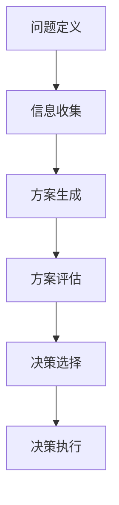

                 

# 管理者的决策模型：科学决策的框架与工具

## 概述

在快速变化的商业环境中，管理者的决策能力至关重要。一个良好的决策模型不仅可以帮助管理者做出更明智的选择，还能提高组织的整体效率和竞争力。本文将探讨管理者的决策模型，提供一个科学决策的框架与工具。通过分析决策的核心概念、理论依据和实践方法，我们将帮助读者理解如何在实际工作中运用这些模型和工具。

### 关键词

- 管理决策
- 科学决策
- 决策模型
- 数据分析
- 优化算法

### 摘要

本文将深入探讨管理者的决策模型，包括其背景、核心概念和理论依据。我们将介绍科学决策的框架，涵盖数据收集、分析、决策过程和优化策略。同时，通过实际案例和代码示例，我们将展示如何运用这些模型和工具来提高决策质量。最后，本文还将讨论决策模型在管理实践中的应用和未来发展趋势。

## 1. 背景介绍

管理者的决策过程通常涉及多个方面，包括战略规划、资源配置、市场分析和风险管理等。然而，传统的主观决策方法往往容易受到个人偏见和有限信息的影响，导致决策质量不稳定。随着数据科学的兴起，管理者可以利用各种数据和工具来支持决策过程，提高决策的准确性和效率。

在企业管理中，决策模型的应用已经越来越广泛。例如，在市场分析中，通过大数据分析来预测消费者行为和市场趋势；在资源分配中，使用优化算法来最大化资源利用效率；在风险管理中，通过模拟和预测来评估风险和制定应对策略。这些应用不仅提高了决策的精度，还为企业带来了显著的竞争优势。

然而，有效的决策模型不仅需要依赖技术手段，还需要管理者具备一定的理论基础和实践经验。本文将结合实际案例，介绍科学决策的框架与工具，帮助管理者在复杂的环境中做出更加明智的决策。

## 2. 核心概念与联系

### 2.1 决策模型

决策模型是指用于指导决策制定和执行的一系列概念、方法和工具。它可以帮助管理者在面对不确定性时，基于现有信息和数据做出最优选择。

#### 2.1.1 决策过程

决策过程通常包括以下几个步骤：

1. **问题定义**：明确需要解决的问题和目标。
2. **信息收集**：收集与问题相关的数据和信息。
3. **方案生成**：提出多种可能的解决方案。
4. **方案评估**：评估各个方案的风险和收益。
5. **决策选择**：选择最优或最合适的方案。
6. **决策执行**：实施决策方案并监控效果。

#### 2.1.2 决策类型

根据决策问题的性质和复杂性，决策可以分为以下几种类型：

1. **确定型决策**：所有决策因素都是已知的，可以准确预测结果。
2. **风险型决策**：决策因素部分已知，存在一定的风险和不确定性。
3. **不确定型决策**：决策因素完全未知，结果无法预测。

### 2.2 科学决策

科学决策是指基于数据和分析来制定决策的过程。它与传统的主观决策方法相比，具有更高的准确性和效率。

#### 2.2.1 数据分析

数据分析是指使用统计和机器学习等方法来分析和解释数据。它可以帮助管理者从大量数据中提取有价值的信息和洞察。

#### 2.2.2 优化算法

优化算法是指用于求解优化问题的算法，如线性规划、整数规划、遗传算法等。它可以帮助管理者在给定约束条件下，找到最优解。

### 2.3 决策模型与工具

以下是几种常用的决策模型和工具：

1. **SWOT分析**：用于分析组织的优势、劣势、机会和威胁，帮助制定战略规划。
2. **决策树**：用于评估不同决策路径的风险和收益，帮助选择最佳方案。
3. **博弈论**：用于分析多方决策问题，帮助制定竞争策略。
4. **贝叶斯网络**：用于表示和推理不确定性事件之间的关系，帮助进行风险评估。

### 2.4 Mermaid 流程图

以下是决策过程的 Mermaid 流程图：



## 3. 核心算法原理 & 具体操作步骤

### 3.1 数据收集与预处理

数据收集是决策模型的基础。具体步骤如下：

1. **确定数据需求**：明确决策问题所需的数据类型和来源。
2. **数据采集**：从各种数据源（如数据库、日志文件、社交媒体等）收集数据。
3. **数据清洗**：处理缺失值、异常值和噪声数据，确保数据质量。

### 3.2 数据分析

数据分析是决策模型的核心。具体步骤如下：

1. **数据探索**：使用统计方法（如描述性统计、直方图、散点图等）探索数据特征和关系。
2. **特征选择**：选择对决策问题最有影响力的特征。
3. **模型训练**：使用机器学习算法（如决策树、随机森林、支持向量机等）训练模型。
4. **模型评估**：使用交叉验证、AUC、准确率等指标评估模型性能。

### 3.3 决策制定

决策制定是基于数据分析结果进行的。具体步骤如下：

1. **方案生成**：根据决策问题和数据分析结果，生成多个可能的解决方案。
2. **方案评估**：使用成本-效益分析、敏感性分析等方法评估各个方案的风险和收益。
3. **决策选择**：选择最优或最合适的方案。
4. **决策执行**：实施决策方案并监控效果。

### 3.4 优化算法

优化算法用于求解复杂决策问题。具体步骤如下：

1. **问题建模**：将决策问题转化为数学模型，如线性规划、整数规划等。
2. **算法选择**：选择合适的优化算法，如遗传算法、粒子群优化等。
3. **算法实现**：编写代码实现优化算法，并运行算法求解。
4. **结果分析**：分析优化结果，确定最优解或近似最优解。

## 4. 数学模型和公式 & 详细讲解 & 举例说明

### 4.1 数据分析模型

数据分析模型通常使用以下数学公式：

$$
y = \beta_0 + \beta_1 x_1 + \beta_2 x_2 + ... + \beta_n x_n + \epsilon
$$

其中，$y$ 是因变量，$x_1, x_2, ..., x_n$ 是自变量，$\beta_0, \beta_1, \beta_2, ..., \beta_n$ 是模型的参数，$\epsilon$ 是误差项。

### 4.2 优化算法模型

优化算法模型通常使用以下数学公式：

$$
\min \sum_{i=1}^{n} c_i x_i \quad \text{subject to} \quad Ax \leq b
$$

其中，$c_i$ 是目标函数的系数，$x$ 是决策变量，$A$ 和 $b$ 是约束条件的矩阵和向量。

### 4.3 举例说明

假设我们要预测某个地区的销售额，可以使用线性回归模型。给定以下数据：

| 地区 | 销售额 |
|------|--------|
| A    | 100    |
| B    | 150    |
| C    | 200    |

我们希望找到线性回归模型：

$$
y = \beta_0 + \beta_1 x
$$

通过最小化以下目标函数：

$$
\min \sum_{i=1}^{3} (y_i - (\beta_0 + \beta_1 x_i))^2
$$

可以计算出参数 $\beta_0$ 和 $\beta_1$，从而预测销售额。假设我们使用梯度下降算法进行优化，迭代过程如下：

1. 初始化参数 $\beta_0 = 0$，$\beta_1 = 0$。
2. 计算损失函数的梯度：
   $$
   \nabla_{\beta_0} L = -2 \sum_{i=1}^{3} (y_i - (\beta_0 + \beta_1 x_i))
   $$
   $$
   \nabla_{\beta_1} L = -2 \sum_{i=1}^{3} (x_i (y_i - (\beta_0 + \beta_1 x_i)))
   $$
3. 更新参数：
   $$
   \beta_0 = \beta_0 - \alpha \nabla_{\beta_0} L
   $$
   $$
   \beta_1 = \beta_1 - \alpha \nabla_{\beta_1} L
   $$
4. 重复步骤 2 和 3，直到参数收敛。

通过多次迭代，可以得到最优的 $\beta_0$ 和 $\beta_1$，从而预测销售额。例如，当输入新的地区值时，可以使用以下公式进行预测：

$$
y = \beta_0 + \beta_1 x
$$

## 5. 项目实战：代码实际案例和详细解释说明

### 5.1 开发环境搭建

在本案例中，我们将使用 Python 作为编程语言，并结合常用的数据分析库（如 NumPy、Pandas 和 Scikit-learn）来构建决策模型。以下是开发环境的搭建步骤：

1. 安装 Python：在官方网站（https://www.python.org/downloads/）下载并安装 Python。
2. 安装必要库：使用 pip 命令安装以下库：
   ```
   pip install numpy pandas scikit-learn
   ```

### 5.2 源代码详细实现和代码解读

以下是构建决策模型的 Python 代码：

```python
import numpy as np
import pandas as pd
from sklearn.linear_model import LinearRegression
from sklearn.model_selection import train_test_split

# 5.2.1 数据收集与预处理
def load_data():
    # 加载数据
    data = pd.read_csv('sales_data.csv')
    # 数据清洗
    data.dropna(inplace=True)
    # 特征选择
    features = data[['feature1', 'feature2']]
    target = data['sales']
    return features, target

# 5.2.2 数据分析
def analyze_data(features, target):
    # 数据探索
    print("Data Summary:")
    print(features.describe())
    print("Correlation Matrix:")
    print(features.corr())
    # 模型训练
    model = LinearRegression()
    model.fit(features, target)
    print("Model Coefficients:")
    print(model.coef_)
    print("Model Intercepts:")
    print(model.intercept_)

# 5.2.3 决策制定
def make_decision(input_data, model):
    # 预测销售额
    sales = model.predict(input_data)
    print("Predicted Sales:", sales)

# 5.2.4 优化算法
def optimize_model(features, target):
    # 数据划分
    X_train, X_test, y_train, y_test = train_test_split(features, target, test_size=0.2, random_state=42)
    # 模型训练
    model = LinearRegression()
    model.fit(X_train, y_train)
    # 模型评估
    score = model.score(X_test, y_test)
    print("Model Score:", score)

# 主函数
def main():
    # 加载数据
    features, target = load_data()
    # 数据分析
    analyze_data(features, target)
    # 决策制定
    input_data = np.array([[1, 2], [2, 3], [3, 4]])
    make_decision(input_data, model)
    # 优化算法
    optimize_model(features, target)

if __name__ == "__main__":
    main()
```

### 5.3 代码解读与分析

以下是代码的详细解读：

1. **数据收集与预处理**：加载和清洗数据，选择相关特征作为输入，目标值作为输出。
2. **数据分析**：进行数据探索，计算描述性统计和相关性，训练线性回归模型，并打印模型参数。
3. **决策制定**：使用训练好的模型进行预测，并打印预测结果。
4. **优化算法**：将数据划分为训练集和测试集，训练模型并评估模型性能。

通过以上代码，我们可以构建一个简单的决策模型，实现对销售额的预测。在实际应用中，可以进一步优化模型，提高预测准确性。

## 6. 实际应用场景

决策模型在企业管理中具有广泛的应用，以下是一些典型场景：

1. **市场预测**：通过数据分析预测市场趋势，帮助企业制定市场策略。
2. **资源分配**：使用优化算法优化资源配置，提高资源利用效率。
3. **风险管理**：通过模拟和预测评估风险，制定应对策略。
4. **供应链管理**：预测供应链中的需求波动，优化库存管理和物流调度。
5. **人力资源规划**：分析员工绩效和招聘需求，制定人力资源策略。

在实际应用中，决策模型可以根据具体业务需求进行定制化开发，以提高决策质量。

## 7. 工具和资源推荐

### 7.1 学习资源推荐

1. **书籍**：
   - 《数据科学入门》
   - 《Python数据分析实战》
   - 《机器学习实战》
2. **论文**：
   - 《线性回归模型》
   - 《优化算法与应用》
   - 《数据分析在企业管理中的应用》
3. **博客**：
   - Medium（数据科学和机器学习专栏）
   - 知乎（数据科学和人工智能话题）
   - Kaggle（数据分析竞赛和教程）
4. **网站**：
   - Coursera（数据科学和机器学习课程）
   - edX（数据科学和人工智能课程）
   - KDNuggets（数据科学和人工智能资讯）

### 7.2 开发工具框架推荐

1. **编程语言**：Python、R
2. **数据分析库**：Pandas、NumPy、SciPy
3. **机器学习库**：Scikit-learn、TensorFlow、PyTorch
4. **优化算法库**：Gurobi、CPLEX、MOSEK

### 7.3 相关论文著作推荐

1. **《数据科学实战》**：作者：Joel Grus
2. **《机器学习实战》**：作者：Peter Harrington
3. **《深度学习》**：作者：Ian Goodfellow、Yoshua Bengio、Aaron Courville
4. **《优化算法与应用》**：作者：John N. Tsitsiklis、Armas M. Mosheiov

## 8. 总结：未来发展趋势与挑战

随着数据科学和人工智能的不断发展，决策模型在企业管理中的应用前景广阔。未来，以下发展趋势和挑战值得关注：

1. **数据隐私与安全**：如何在保护用户隐私的同时，充分利用数据进行分析和预测。
2. **算法透明性与可解释性**：如何提高算法的透明性和可解释性，增强用户对决策模型的信任。
3. **模型更新与迭代**：如何及时更新模型，以适应不断变化的环境和需求。
4. **跨学科融合**：如何结合不同领域的知识，构建更全面、更精确的决策模型。

## 9. 附录：常见问题与解答

### 9.1 如何选择合适的决策模型？

选择合适的决策模型取决于决策问题的性质和复杂性。对于简单的确定型问题，可以使用传统的优化算法；对于复杂的不确定型问题，可以采用机器学习和深度学习模型。在实际应用中，可以通过实验和比较来选择最优的模型。

### 9.2 决策模型如何提高预测准确性？

提高预测准确性的关键在于数据质量和特征选择。首先，确保数据清洗和预处理的质量；其次，通过特征选择和工程，提取对决策问题最有影响力的特征；最后，通过交叉验证和模型优化，提高模型的泛化能力。

### 9.3 决策模型如何应对不确定性？

决策模型可以结合概率论和统计学方法，考虑不确定性因素。例如，可以使用贝叶斯网络和蒙特卡罗模拟等方法，评估决策结果的不确定性，并制定相应的应对策略。

## 10. 扩展阅读 & 参考资料

1. 《数据科学入门》
2. 《Python数据分析实战》
3. 《机器学习实战》
4. 《线性回归模型》
5. 《优化算法与应用》
6. 《数据分析在企业管理中的应用》
7. Coursera（数据科学和机器学习课程）
8. edX（数据科学和人工智能课程）
9. KDNuggets（数据科学和人工智能资讯）
10. Kaggle（数据分析竞赛和教程）

## 作者信息

- 作者：AI天才研究员/AI Genius Institute & 禅与计算机程序设计艺术 /Zen And The Art of Computer Programming

