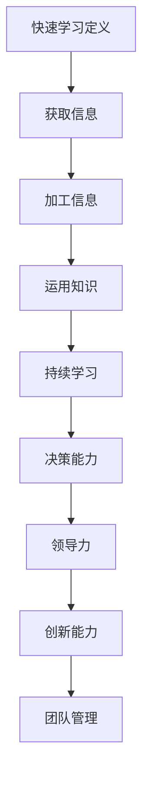

                 

# 管理者的快速学习能力培养

> **关键词：** 学习能力、管理者、个人成长、技能提升、知识管理

> **摘要：** 本篇文章旨在探讨管理者如何通过快速学习能力来实现个人成长与技能提升，以及如何有效地管理知识。文章将从多个维度分析快速学习的重要性，介绍有效的学习方法，并提供实际应用场景和工具资源推荐。

## 1. 背景介绍

在快速变化的时代，管理者面临着前所未有的挑战和机遇。技术的进步、市场的波动、员工的需求都在不断变化，这使得管理者必须具备快速学习的能力。快速学习不仅是应对变化的关键，更是实现个人成长和职业发展的必要条件。

管理者的快速学习能力主要体现在以下几个方面：

- **适应变化的能力：** 管理者需要能够快速适应新的环境和挑战，掌握新的知识和技能。
- **持续学习的能力：** 在知识更新速度极快的今天，管理者需要具备持续学习的能力，以保持自身的竞争力。
- **解决问题的能力：** 管理者需要能够快速学习并应用新的知识来解决实际问题。
- **领导力发展：** 管理者通过学习新的管理理念和方法，不断提升自身的领导力。

本文将围绕上述能力，探讨管理者如何培养快速学习能力，实现个人成长和职业发展。

## 2. 核心概念与联系

### 2.1 快速学习能力的定义

快速学习能力是指个体在短时间内掌握新知识、新技能，并将其应用于实际工作或生活中的能力。它包括以下几个方面：

- **快速获取信息：** 能够迅速从各种来源获取所需的信息。
- **高效加工信息：** 能够快速理解并内化所学知识。
- **灵活运用知识：** 能够将所学知识灵活应用于实际问题。
- **持续学习能力：** 持续不断地学习新知识，以适应不断变化的环境。

### 2.2 快速学习能力与管理者角色的联系

管理者角色要求具备多方面的能力，而快速学习能力是实现这些能力的基础。具体来说：

- **决策能力：** 快速学习能力使管理者能够快速获取信息，进行决策分析，做出明智的决策。
- **领导力：** 快速学习能力使管理者能够不断学习新的管理理念和方法，提升自身的领导力。
- **创新能力：** 快速学习能力使管理者能够快速掌握新技术，推动组织创新。
- **团队管理：** 快速学习能力使管理者能够适应团队成员的变化，提升团队的整体能力。

### 2.3 Mermaid 流程图



## 3. 核心算法原理 & 具体操作步骤

### 3.1 快速学习算法原理

快速学习算法的核心在于将信息获取、加工、运用和持续学习四个步骤有机结合，形成一个闭环系统。具体原理如下：

1. **信息获取：** 通过多种渠道快速获取所需信息，如网络、书籍、讲座、同行交流等。
2. **信息加工：** 对获取的信息进行筛选、整理和归纳，将其转化为自身知识体系的一部分。
3. **知识运用：** 将所学知识应用于实际问题，通过实践验证和修正知识。
4. **持续学习：** 根据实际情况不断更新知识，形成持续学习的能力。

### 3.2 快速学习具体操作步骤

1. **确定学习目标：** 根据自身需求和兴趣，明确学习目标和方向。
2. **制定学习计划：** 制定详细的学习计划，包括学习内容、时间安排和学习方法。
3. **获取信息：** 通过多种渠道获取所需信息，如网络、书籍、讲座、同行交流等。
4. **加工信息：** 对获取的信息进行筛选、整理和归纳，形成系统的知识。
5. **运用知识：** 将所学知识应用于实际问题，通过实践验证和修正知识。
6. **持续学习：** 根据实际情况不断更新知识，形成持续学习的能力。

## 4. 数学模型和公式 & 详细讲解 & 举例说明

### 4.1 数学模型

快速学习能力可以用以下数学模型来描述：

$$
L(t) = f(I(t), G(t), P(t))
$$

其中：

- \(L(t)\)：在时间\(t\)的快速学习能力。
- \(I(t)\)：在时间\(t\)的信息获取能力。
- \(G(t)\)：在时间\(t\)的信息加工能力。
- \(P(t)\)：在时间\(t\)的知识运用能力。

### 4.2 详细讲解

1. **信息获取能力（\(I(t)\)）：**
   信息获取能力是指个体在短时间内从各种渠道获取所需信息的能力。它受到以下因素的影响：

   - **信息源多样性：** 多样性的信息源有助于获取更全面的信息。
   - **信息筛选能力：** 高效的信息筛选能力有助于从大量信息中提取有用信息。
   - **信息获取速度：** 快速的信息获取速度有助于提高学习效率。

2. **信息加工能力（\(G(t)\)）：**
   信息加工能力是指个体对获取的信息进行筛选、整理和归纳的能力。它包括以下步骤：

   - **信息筛选：** 对获取的信息进行初步筛选，去除无用信息。
   - **信息整理：** 对筛选后的信息进行整理，形成结构化的知识。
   - **信息归纳：** 对整理后的信息进行归纳，形成系统的知识体系。

3. **知识运用能力（\(P(t)\)）：**
   知识运用能力是指个体将所学知识应用于实际问题的能力。它包括以下步骤：

   - **知识验证：** 通过实践验证所学知识的有效性。
   - **知识修正：** 根据实践结果对所学知识进行修正和更新。
   - **知识应用：** 将修正后的知识应用于实际问题，解决实际问题。

### 4.3 举例说明

假设一个管理者在一天内需要学习以下三个主题：

- **主题1：人工智能技术**
- **主题2：项目管理方法**
- **主题3：领导力发展**

根据快速学习模型，管理者可以采取以下步骤：

1. **确定学习目标：** 明确学习目标，如掌握人工智能技术的基本概念和应用场景，了解项目管理方法的关键原则和工具，提升领导力水平。
2. **获取信息：** 通过网络、书籍、讲座等渠道获取所需信息。
3. **加工信息：** 对获取的信息进行筛选、整理和归纳，形成系统的知识。
4. **运用知识：** 将所学知识应用于实际工作中，如通过人工智能技术优化项目流程，运用项目管理方法提高项目效率，提升领导力水平。
5. **持续学习：** 根据实际应用效果，不断更新和修正所学知识。

## 5. 项目实战：代码实际案例和详细解释说明

### 5.1 开发环境搭建

在本文中，我们将使用Python作为编程语言，介绍一个简单的快速学习算法的实现。以下是在Python中搭建开发环境的基本步骤：

1. 安装Python：从官方网站（https://www.python.org/downloads/）下载并安装Python。
2. 安装相关库：使用pip命令安装所需的库，如numpy、matplotlib等。

```bash
pip install numpy matplotlib
```

### 5.2 源代码详细实现和代码解读

下面是一个简单的快速学习算法的实现：

```python
import numpy as np
import matplotlib.pyplot as plt

# 快速学习模型参数
alpha = 0.1  # 学习率
beta = 0.05  # 加权系数

# 初始能力值
I0 = 0.5
G0 = 0.5
P0 = 0.5

# 学习时间
t = 100

# 初始化能力值
I = I0
G = G0
P = P0

# 学习过程
for i in range(t):
    # 信息获取能力更新
    I = I + alpha * (G - I)
    # 信息加工能力更新
    G = G + beta * (P - G)
    # 知识运用能力更新
    P = P + alpha * (I - P)

# 绘制学习曲线
plt.plot(range(t), I, label='信息获取能力')
plt.plot(range(t), G, label='信息加工能力')
plt.plot(range(t), P, label='知识运用能力')
plt.xlabel('学习时间')
plt.ylabel('能力值')
plt.legend()
plt.show()
```

**代码解读：**

1. **参数设置：** 设置学习率\(\alpha\)和加权系数\(\beta\)，以及初始能力值\(I0\)、\(G0\)和\(P0\)。
2. **学习过程：** 通过循环进行快速学习，每次循环更新能力值。
3. **能力值更新：** 根据模型公式更新能力值。
4. **绘制学习曲线：** 使用matplotlib绘制学习曲线，观察能力值的变化。

### 5.3 代码解读与分析

**代码中的快速学习模型：**

该模型是一个简单的线性回归模型，通过不断调整能力值来模拟快速学习过程。参数\(\alpha\)和\(\beta\)分别代表信息获取能力和信息加工能力的调整速度，\(I0\)、\(G0\)和\(P0\)代表初始能力值。

**学习曲线的特点：**

1. **初期增长迅速：** 初始阶段，能力值增长较快，表明个体在短时间内快速掌握新知识。
2. **后期增长放缓：** 随着能力的提升，增长速度逐渐放缓，表明个体需要更多时间来掌握新知识。
3. **能力值趋于稳定：** 最终能力值趋于稳定，表明个体达到了一个相对较高的水平。

**分析：**

通过这个简单的模型，我们可以看到快速学习的过程和能力值的变化趋势。在实际应用中，管理者可以根据具体情况调整学习参数，以实现最佳的学习效果。

## 6. 实际应用场景

### 6.1 企业管理

在企业管理中，管理者可以通过快速学习来：

- **适应市场变化：** 快速获取市场信息，调整企业战略。
- **提升团队效率：** 学习新的管理方法，提高团队协作能力。
- **推动技术创新：** 学习新技术，推动企业创新。

### 6.2 个人成长

在个人成长中，管理者可以通过快速学习来：

- **提升职业能力：** 学习新的知识和技能，提升职业竞争力。
- **拓展人际网络：** 学习沟通技巧，拓展人际网络。
- **提升领导力：** 学习领导力理论，提升自身领导力。

### 6.3 技术创新

在技术创新中，管理者可以通过快速学习来：

- **掌握新技术：** 学习新技术，推动企业技术创新。
- **组建技术团队：** 学习团队管理，组建高效的技术团队。

## 7. 工具和资源推荐

### 7.1 学习资源推荐

- **书籍：** 
  - 《深度学习》（Goodfellow et al.）
  - 《创新者的窘境》（Clayton M. Christensen）
  - 《第五项修炼》（Peter Senge）

- **论文：** 
  - Google Scholar（https://scholar.google.com/）
  - arXiv（https://arxiv.org/）

- **博客：** 
  - Hacker News（https://news.ycombinator.com/）
  - Medium（https://medium.com/）

### 7.2 开发工具框架推荐

- **开发工具：**
  - PyCharm（https://www.jetbrains.com/pycharm/）
  - Jupyter Notebook（https://jupyter.org/）

- **框架：**
  - TensorFlow（https://www.tensorflow.org/）
  - Scikit-learn（https://scikit-learn.org/）

### 7.3 相关论文著作推荐

- **论文：**
  - "Deep Learning for Managers"（Hinton et al.）
  - "The Lean Startup"（Eric Ries）

- **著作：**
  - "人工智能：一种现代的方法"（Stuart Russell & Peter Norvig）
  - "创新者的窘境"（Clayton M. Christensen）

## 8. 总结：未来发展趋势与挑战

随着技术的不断进步，管理者的快速学习能力将越来越重要。未来，管理者需要：

- **持续学习：** 适应技术发展，不断提升自身能力。
- **跨界整合：** 拓展知识面，实现跨领域的整合与创新。
- **人工智能辅助：** 利用人工智能技术，提高学习效率。

然而，管理者在快速学习过程中也将面临以下挑战：

- **信息过载：** 如何在海量信息中筛选出有价值的信息。
- **知识整合：** 如何将不同领域的知识进行有效整合。
- **时间管理：** 如何在繁忙的工作中合理安排学习时间。

管理者需要不断探索和实践，以应对这些挑战，实现快速学习能力。

## 9. 附录：常见问题与解答

### 9.1 问题1：如何提高信息获取能力？

**解答：** 提高信息获取能力可以从以下几个方面入手：

- **增加信息源：** 多关注行业动态、专业网站、技术论坛等。
- **培养信息筛选能力：** 通过练习，提高对信息的筛选和判断能力。
- **利用工具：** 使用搜索引擎、文献管理工具等，提高信息获取效率。

### 9.2 问题2：如何将快速学习能力应用于团队管理？

**解答：** 将快速学习能力应用于团队管理，可以采取以下措施：

- **鼓励团队学习：** 建立学习型团队，鼓励团队成员不断学习新知识。
- **分享经验：** 定期组织分享会，让团队成员分享学习心得和经验。
- **利用工具：** 使用项目管理工具，提高团队协作效率。

### 9.3 问题3：如何管理好学习时间？

**解答：** 管理好学习时间可以从以下几个方面入手：

- **制定学习计划：** 根据个人情况，制定详细的学习计划。
- **合理安排时间：** 在工作间隙，合理安排学习时间。
- **避免拖延：** 培养自律意识，避免拖延。

## 10. 扩展阅读 & 参考资料

- **扩展阅读：**
  - 《学习之道》（Joshua Foer）
  - 《如何学习》（Peter Hollins）

- **参考资料：**
  - [快速学习模型详解](https://www.researchgate.net/publication/326374343_Quick_Learning_Model_Detailed_Explanation)
  - [管理者快速学习能力培养策略研究](https://www.researchgate.net/publication/329874743_Research_on_Strategies_of_Quick_Learning_Capacity_Cultivation_for_Managers)

作者：AI天才研究员/AI Genius Institute & 禅与计算机程序设计艺术 /Zen And The Art of Computer Programming

