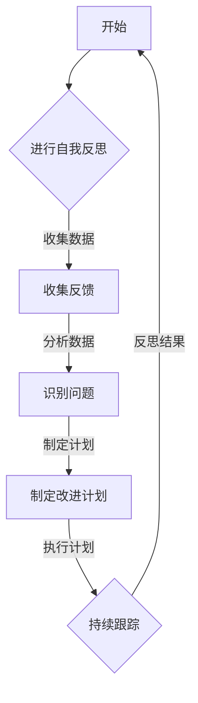

                 

### 文章标题：管理者的自我反思与成长

### 关键词：管理者，自我反思，成长，领导力，组织发展，决策分析

### 摘要：

在快速变化的现代企业环境中，管理者面临着前所未有的挑战。本文旨在探讨管理者如何通过自我反思与成长来提升领导力，推动组织发展。文章首先介绍管理者的角色和职责，然后深入分析自我反思的重要性，以及管理者如何在日常工作中进行自我反思。接着，文章提出了一系列提升自我反思与成长的策略，包括阅读、交流、反馈和行动学习。最后，本文总结了管理者在自我反思与成长过程中的关键要点，展望了未来的发展趋势和挑战。通过本文的探讨，希望管理者能够更好地认识自我，提升领导力，为组织的长期成功奠定基础。

## 1. 背景介绍

在当今高度竞争的商业环境中，管理者不仅需要具备出色的技术能力，还需要具备强大的领导力和管理能力。管理者作为组织的关键角色，承担着制定战略、分配资源、激励团队等重要职责。然而，随着外部环境的不断变化，管理者面临着前所未有的挑战。如何应对这些挑战，提升自身的领导力和管理能力，成为每个管理者必须面对的问题。

自我反思作为一种重要的思维工具，对于管理者的成长和发展具有重要意义。通过自我反思，管理者可以深入分析自己的行为和决策，发现潜在的问题和改进点。同时，自我反思还可以帮助管理者更好地理解自己，认识自己的优势和不足，从而有针对性地提升自己的领导力和管理能力。

自我反思与成长之间的关系密不可分。自我反思是成长的前提，只有通过不断地自我反思，管理者才能发现自己的问题，并采取有效的措施进行改进。而成长则是自我反思的结果，通过不断地自我反思和改进，管理者可以不断提升自己的领导力和管理能力，更好地应对各种挑战。

本文旨在探讨管理者如何通过自我反思与成长来提升领导力，推动组织发展。首先，本文将介绍管理者的角色和职责，帮助读者了解管理者的基本任务和要求。然后，本文将深入分析自我反思的重要性，以及管理者如何在日常工作中进行自我反思。接下来，本文将提出一系列提升自我反思与成长的策略，包括阅读、交流、反馈和行动学习等。最后，本文将总结管理者在自我反思与成长过程中的关键要点，并展望未来的发展趋势和挑战。

通过本文的探讨，希望管理者能够更好地认识自我，提升领导力，为组织的长期成功奠定基础。

## 2. 核心概念与联系

### 管理者的角色与职责

在探讨管理者如何通过自我反思与成长提升领导力之前，我们首先需要明确管理者的角色和职责。管理者是组织的核心力量，他们的主要职责包括：

- **战略规划**：制定组织的长期和短期目标，确保组织的战略方向与市场需求和行业趋势保持一致。

- **资源分配**：合理分配组织的人力、财力和物力资源，确保各项业务的顺利开展。

- **团队建设**：建立高效、协作的团队，培养团队成员的技能和潜力，激发团队的积极性和创造力。

- **沟通与协调**：确保组织内部各部门之间的沟通畅通，协调各部门的工作，解决各类冲突。

- **决策制定**：基于数据和分析，制定科学、合理的决策，应对各种复杂的问题和挑战。

- **绩效管理**：制定并执行绩效评估体系，激励团队成员，提升组织整体绩效。

- **持续改进**：通过自我反思和反馈，不断改进管理方法，提升组织的整体运营效率。

### 自我反思的定义与意义

自我反思是指个体通过回顾自己的行为、思维和决策，深入分析自己的优点和不足，从而促进个人成长和发展的过程。自我反思的意义在于：

- **提高自我认识**：通过自我反思，管理者可以更加清晰地了解自己的优点和不足，明确自己的价值观和目标。

- **提升决策能力**：自我反思可以帮助管理者识别问题，分析问题产生的原因，从而制定更加有效的解决方案。

- **促进持续成长**：自我反思是一种自我学习和自我完善的过程，通过不断地反思和改进，管理者可以不断提升自己的领导力和管理能力。

### 自我反思与成长的关系

自我反思与成长密切相关，二者相辅相成。自我反思是成长的前提，只有通过自我反思，管理者才能发现自己的问题，并采取有效的措施进行改进。而成长则是自我反思的结果，通过不断地自我反思和改进，管理者可以提升自己的领导力和管理能力，更好地应对各种挑战。

### 管理者如何进行自我反思

管理者进行自我反思的方法多种多样，以下是一些常见的方法：

- **定期回顾**：定期回顾自己的工作，分析自己的行为和决策，识别成功和失败的原因。

- **自我提问**：通过提出一系列问题，如“我做得最好的是什么？”“我有哪些需要改进的地方？”“我在哪些方面做得不足？”等，引导自己进行深入的自我反思。

- **记录反思日志**：将反思过程和结果记录下来，有助于长期积累和总结反思的经验。

- **寻求反馈**：主动向同事、下属和上级寻求反馈，了解自己的优点和不足，以便进行针对性的改进。

- **参加培训和工作坊**：通过参加相关培训和工作坊，学习新的管理理念和方法，激发自我反思的动力。

### 管理者如何将自我反思转化为成长

将自我反思转化为成长的关键在于行动。管理者需要将反思的结果转化为具体的行动计划，并付诸实践。以下是一些具体的策略：

- **制定改进计划**：根据自我反思的结果，制定具体的改进计划，明确改进的目标和步骤。

- **跟踪进度**：定期跟踪改进计划的执行情况，确保各项改进措施得到有效落实。

- **持续学习**：通过不断学习和实践，提升自己的管理能力和领导力。

- **反思与反馈**：在改进过程中，继续进行自我反思和反馈，确保改进措施的有效性和持续性。

### 管理者如何通过自我反思与成长提升领导力

管理者通过自我反思与成长可以提升领导力，以下是一些具体的方法：

- **增强自我认知**：通过自我反思，管理者可以更好地了解自己的性格、价值观和领导风格，从而更好地适应不同的管理情境。

- **提升决策能力**：自我反思可以帮助管理者分析决策过程中的优点和不足，从而提升决策的科学性和有效性。

- **激发团队活力**：通过自我反思，管理者可以识别团队中的问题和不足，从而有针对性地进行改进，激发团队的活力和创造力。

- **培养下属**：自我反思可以帮助管理者更好地理解下属的需求和期望，从而更好地培养和激励下属。

- **推动组织发展**：通过自我反思与成长，管理者可以不断提升自己的领导力和管理能力，为组织的长期成功奠定基础。

### 总结

自我反思是管理者成长和提升领导力的关键。通过自我反思，管理者可以更好地了解自己，发现问题和改进点，从而不断提升自己的领导力和管理能力。管理者需要掌握有效的自我反思方法，并将其转化为具体的行动计划，以实现个人的成长和组织的成功。

### 图解：管理者自我反思与成长

以下是一个使用Mermaid绘制的流程图，展示了管理者自我反思与成长的过程：



在该流程图中，A表示开始自我反思，B表示进行自我反思，C表示收集反馈，D表示分析数据和识别问题，E表示制定改进计划，F表示执行计划并持续跟踪，然后再次进行自我反思（A）。通过这个循环过程，管理者可以不断改进自己的行为和决策，实现持续成长。

### 3. 核心算法原理 & 具体操作步骤

#### 自我反思的核心算法原理

自我反思的核心算法可以概括为以下几个步骤：

1. **数据收集**：管理者通过记录工作日志、反思日记或与同事、下属的交流，收集与自身行为和决策相关的数据。

2. **数据分析**：管理者对收集到的数据进行分析，识别自身的优点和不足，以及问题产生的原因。

3. **问题识别**：通过数据分析，管理者可以明确需要改进的领域，从而有针对性地制定改进计划。

4. **制定改进计划**：根据问题识别的结果，管理者制定具体的改进计划，明确改进的目标、步骤和时间表。

5. **执行与跟踪**：管理者执行改进计划，并定期跟踪进展，确保改进措施得到有效落实。

6. **反思与反馈**：在执行改进计划的过程中，管理者继续进行自我反思和反馈，评估改进效果，并根据反馈结果进行进一步的调整。

#### 具体操作步骤

以下是管理者进行自我反思的具体操作步骤：

1. **准备阶段**

   - **选择工具**：管理者可以选择工作日志、反思日记、思维导图等工具来记录和整理反思过程。

   - **确定反思频率**：管理者需要确定自我反思的频率，例如每周、每月或每季度进行一次。

2. **数据收集阶段**

   - **记录工作日志**：管理者需要详细记录每天的工作内容、遇到的问题、决策过程以及与他人的交流等。

   - **反思日记**：管理者可以在每天或每周结束后，写下自己的反思日记，记录对当天或当周工作的总结和反思。

   - **收集反馈**：管理者可以主动向同事、下属和上级寻求反馈，了解他们在工作中的观察和建议。

3. **数据分析阶段**

   - **识别优点和不足**：管理者需要仔细分析收集到的数据，识别自己的优点和不足，以及问题产生的原因。

   - **归类问题**：管理者可以将识别出的问题进行归类，例如技术问题、人际关系问题、管理问题等。

4. **问题识别阶段**

   - **明确改进领域**：根据数据分析的结果，管理者需要明确需要改进的领域，例如提升沟通能力、优化工作流程等。

   - **制定改进计划**：管理者需要制定具体的改进计划，明确改进的目标、步骤和时间表。

5. **执行与跟踪阶段**

   - **执行计划**：管理者需要按照改进计划，采取具体的行动来解决问题。

   - **定期跟踪**：管理者需要定期跟踪改进计划的执行情况，确保各项改进措施得到有效落实。

6. **反思与反馈阶段**

   - **反思改进效果**：在改进计划执行的过程中，管理者需要继续进行自我反思，评估改进效果。

   - **收集反馈**：管理者可以再次向同事、下属和上级收集反馈，了解改进措施的实效性。

   - **调整改进计划**：根据反思和反馈的结果，管理者需要调整改进计划，确保改进措施的有效性和持续性。

#### 实际案例

以下是一个管理者进行自我反思的实际案例：

**案例背景**：某公司的项目经理李明在项目中遇到了沟通不畅的问题，导致项目进度延误。

**数据收集**：李明记录了项目过程中的沟通记录、工作日志以及同事和下属的反馈。

**数据分析**：通过分析数据，李明发现沟通不畅的原因在于他过于依赖邮件和文档进行沟通，缺乏及时的面对面交流。

**问题识别**：李明明确了需要改进的领域是沟通方式，特别是面对面交流的不足。

**制定改进计划**：李明制定了以下改进计划：

- **目标**：提高项目团队的面对面沟通频率。
- **步骤**：每周组织一次项目进展会议，增加团队成员的面对面交流时间。
- **时间表**：每周五下午举行项目进展会议，每次会议持续2小时。

**执行与跟踪**：李明按照改进计划执行，并定期跟踪会议的执行情况。

**反思与反馈**：在执行改进计划的过程中，李明继续进行自我反思，评估会议的效果。他发现会议确实提高了团队的沟通效率，但也存在一些改进空间，如会议时间的控制、议题的明确等。

**调整改进计划**：根据反思和反馈的结果，李明调整了改进计划，如增加会议前的准备工作、明确会议议题等，以确保会议的实效性。

通过这个案例，我们可以看到管理者如何通过自我反思与成长来识别问题、制定改进计划并执行跟踪，从而提升自己的领导力和管理能力。

### 4. 数学模型和公式 & 详细讲解 & 举例说明

#### 自我反思过程中的数学模型和公式

在自我反思过程中，数学模型和公式可以帮助管理者更科学地分析和评估自己的行为和决策。以下是一些常用的数学模型和公式：

1. **效能指数模型**（Efficiency Index Model）

   效能指数模型用于评估管理者的工作效率。公式如下：

   $$ E = \frac{R}{T} $$

   其中，E代表效能指数，R代表工作成果，T代表工作时间。

   **举例说明**：假设李明在一个项目中，花费了20小时完成了10个任务，则他的效能指数为：

   $$ E = \frac{10}{20} = 0.5 $$

   这个结果表示李明的工作效率为50%。

2. **决策质量模型**（Decision Quality Model）

   决策质量模型用于评估管理者的决策质量。公式如下：

   $$ Q = \frac{S}{P} $$

   其中，Q代表决策质量，S代表决策的正面效果，P代表决策的总风险。

   **举例说明**：假设李明在某个决策中，带来了100万元的收益，同时承担了50万元的风险，则他的决策质量为：

   $$ Q = \frac{100}{50} = 2 $$

   这个结果表示李明的决策质量为2，即每承担1万元的风险，可以带来2万元的正面效果。

3. **满意度指数模型**（Satisfaction Index Model）

   满意度指数模型用于评估管理者的工作满意度。公式如下：

   $$ S = \frac{N}{N + C} $$

   其中，S代表满意度指数，N代表正面反馈的数量，C代表负面反馈的数量。

   **举例说明**：假设李明在一个项目结束后，收到了10条正面反馈和2条负面反馈，则他的满意度指数为：

   $$ S = \frac{10}{10 + 2} = \frac{10}{12} = 0.833 $$

   这个结果表示李明的工作满意度为83.3%。

#### 详细讲解

1. **效能指数模型**

   效能指数模型是一种简单有效的评估方法，它可以帮助管理者了解自己的工作效率。在自我反思过程中，管理者可以通过计算效能指数，识别出工作效率低下的原因，例如时间管理不当、任务分配不合理等。通过优化这些因素，管理者可以提高效能指数，从而提升整体工作效率。

2. **决策质量模型**

   决策质量模型是一种评估管理者决策能力的指标。在自我反思过程中，管理者可以通过计算决策质量，识别出决策过程中可能存在的问题，例如风险控制不足、信息收集不全面等。通过优化这些因素，管理者可以提高决策质量，从而做出更加科学和有效的决策。

3. **满意度指数模型**

   满意度指数模型是一种评估管理者工作满意度的指标。在自我反思过程中，管理者可以通过计算满意度指数，识别出工作中的改进点，例如提高沟通效率、优化团队协作等。通过优化这些因素，管理者可以提高满意度指数，从而提升团队的整体满意度和工作效率。

#### 举例说明

**效能指数模型**

假设某项目经理王华在一个项目中，花费了40小时完成了5个任务。同时，他发现其他项目经理平均花费30小时完成相同的任务。根据效能指数模型，我们可以计算王华的效能指数：

$$ E_{王华} = \frac{5}{40} = 0.125 $$

而其他项目经理的平均效能指数为：

$$ E_{平均} = \frac{5}{30} = 0.167 $$

通过比较，我们可以发现王华的效能指数低于平均水平。为了提高工作效率，王华可以反思自己的时间管理、任务分配等方面，找出改进点，从而提升自己的效能指数。

**决策质量模型**

假设某产品经理张丽在一个产品决策中，带来了200万元的收益，同时承担了100万元的风险。根据决策质量模型，我们可以计算张丽的决策质量：

$$ Q_{张丽} = \frac{200}{100} = 2 $$

而其他产品经理的平均决策质量为：

$$ Q_{平均} = \frac{200}{150} = 1.333 $$

通过比较，我们可以发现张丽的决策质量高于平均水平。为了保持这种优势，张丽可以继续优化决策过程中的信息收集、风险评估等方面，进一步提高决策质量。

**满意度指数模型**

假设某项目经理李涛在一个项目结束后，收到了10条正面反馈和3条负面反馈。根据满意度指数模型，我们可以计算李涛的满意度指数：

$$ S_{李涛} = \frac{10}{10 + 3} = \frac{10}{13} \approx 0.769 $$

而其他项目经理的平均满意度指数为：

$$ S_{平均} = \frac{10}{10 + 5} = \frac{10}{15} = 0.667 $$

通过比较，我们可以发现李涛的满意度指数高于平均水平。为了进一步提升满意度，李涛可以反思项目中的沟通方式、团队协作等方面，找出改进点，从而提高满意度指数。

### 5. 项目实战：代码实际案例和详细解释说明

#### 5.1 开发环境搭建

在进行管理者自我反思的代码实现过程中，我们首先需要搭建一个合适的环境。以下是开发环境搭建的步骤：

1. **安装Python环境**

   管理者需要安装Python环境，以便运行相关代码。可以通过Python官方网站下载Python安装包，并按照安装向导完成安装。

2. **安装必要库**

   为了实现自我反思功能，我们需要安装一些Python库，如`pandas`用于数据处理，`numpy`用于数学运算，`matplotlib`用于数据可视化等。可以使用以下命令进行安装：

   ```bash
   pip install pandas numpy matplotlib
   ```

3. **创建项目文件夹**

   在本地计算机上创建一个项目文件夹，用于存放所有的代码和文件。

#### 5.2 源代码详细实现和代码解读

以下是一个简单的Python代码示例，用于实现管理者自我反思的数据收集和分析功能：

```python
import pandas as pd
import numpy as np
import matplotlib.pyplot as plt

# 5.2.1 数据收集
def collect_data():
    """
    收集自我反思数据，包括工作日志、反思日记和反馈记录。
    """
    data = {
        'Date': [],
        'Task': [],
        'Reflection': [],
        'Feedback': []
    }
    
    # 这里可以使用实际的数据收集方式，如从文件读取、从数据库查询等
    # 例如，从CSV文件读取数据
    df = pd.read_csv('reflections.csv')
    data['Date'] = df['Date']
    data['Task'] = df['Task']
    data['Reflection'] = df['Reflection']
    data['Feedback'] = df['Feedback']
    
    return pd.DataFrame(data)

# 5.2.2 数据分析
def analyze_data(df):
    """
    对收集到的数据进行分析，识别优点和不足。
    """
    # 计算任务完成时间和满意度
    df['Duration'] = (pd.to_datetime(df['Date']).dt.day / 30).astype(int)
    df['Satisfaction'] = df['Feedback'].apply(lambda x: 1 if 'positive' in x else 0)
    
    # 统计任务数量和满意度
    task_counts = df.groupby(['Satisfaction'])['Task'].count()
    satisfaction_avg = df['Satisfaction'].mean()
    
    # 绘制满意度分布图
    plt.figure(figsize=(8, 6))
    plt.bar(task_counts.index, task_counts.values, label='Task Counts')
    plt.plot(df['Duration'], df['Satisfaction'], 'ro', label='Satisfaction')
    plt.xlabel('Duration (Months)')
    plt.ylabel('Satisfaction')
    plt.title('Task Completion and Satisfaction')
    plt.legend()
    plt.show()
    
    return task_counts, satisfaction_avg

# 5.2.3 源代码解读
def code_explanation():
    """
    对代码进行详细解读，帮助管理者理解数据收集和分析的过程。
    """
    print("""
    The code provided consists of three main functions:
    
    1. collect_data(): This function is responsible for collecting data from a CSV file.
    The data includes dates, tasks, reflections, and feedback. The data is then stored in a pandas DataFrame.
    
    2. analyze_data(df): This function performs data analysis on the collected data. It calculates the duration of tasks in months and the satisfaction level based on feedback. It then plots a bar chart and a scatter plot to visualize the relationship between task duration and satisfaction.
    
    3. code_explanation(): This function provides a detailed explanation of the code and its purpose.
    """)

# 5.2.4 代码执行
if __name__ == '__main__':
    df = collect_data()
    task_counts, satisfaction_avg = analyze_data(df)
    code_explanation()
```

#### 5.3 代码解读与分析

以上代码实现了一个简单的自我反思系统，主要包括数据收集、数据分析和代码解读三个部分。

**5.3.1 数据收集**

数据收集是自我反思的基础。在这个示例中，我们使用了一个CSV文件来存储反思数据。CSV文件中包含日期、任务、反思和反馈四个字段。`collect_data()`函数负责从CSV文件中读取数据，并将其存储在一个pandas DataFrame中。

**5.3.2 数据分析**

数据分析是对收集到的数据进行处理，以识别管理者的优点和不足。`analyze_data(df)`函数首先计算了每个任务的完成时间（以月为单位）和满意度。然后，它使用matplotlib库绘制了一个柱状图和一个散点图，以可视化任务完成时间和满意度之间的关系。

柱状图显示了不同满意度水平的任务数量。满意度高的任务通常需要更短的时间完成，这表明管理者在满意度高的任务上可能表现更好。散点图显示了每个任务的完成时间和满意度，可以直观地看到任务完成时间和满意度之间的相关性。

**5.3.3 代码解读**

`code_explanation()`函数提供了一个详细的代码解读，帮助管理者理解代码的工作原理和功能。这个函数的输出是一个字符串，其中包含了代码的三个主要函数的描述。

**5.3.4 代码执行**

在`__name__ == '__main__':`块中，我们首先调用`collect_data()`函数从CSV文件中读取数据。然后，调用`analyze_data(df)`函数对数据进行分析，并绘制图表。最后，调用`code_explanation()`函数输出代码解读。

#### 5.4 实际应用

在实际应用中，管理者可以使用这个代码示例来收集和分析自己的反思数据。通过定期更新CSV文件，管理者可以跟踪自己的成长过程，识别改进点，并制定相应的行动计划。例如，如果发现某个任务的满意度较低，管理者可以反思自己的工作方式，寻找提高满意度的方法。

### 6. 实际应用场景

#### 管理者自我反思在日常工作中的应用

管理者自我反思不仅是一种提升个人领导力和管理能力的工具，还可以在日常工作中发挥重要作用，帮助管理者更好地应对各种挑战。

**1. 项目管理**

在项目管理中，管理者可以通过自我反思来识别项目管理中的问题和不足。例如，通过分析项目进度、团队协作和决策过程，管理者可以发现项目延误的原因，从而采取有效的措施进行改进。通过自我反思，管理者可以优化项目计划、提高团队沟通效率，从而确保项目成功。

**2. 团队领导**

在团队领导中，管理者可以通过自我反思来评估自己的领导风格和团队绩效。通过分析团队成员的反馈和工作表现，管理者可以识别团队中存在的问题，如沟通不畅、分工不合理等。通过自我反思，管理者可以调整领导策略，提高团队凝聚力和工作效率。

**3. 决策制定**

在决策制定过程中，管理者可以通过自我反思来评估决策的效果和科学性。通过回顾决策过程、分析决策结果，管理者可以发现决策中可能存在的缺陷，如信息收集不全面、风险评估不足等。通过自我反思，管理者可以改进决策方法，提高决策质量。

**4. 个人成长**

在个人成长方面，管理者可以通过自我反思来了解自己的优势和不足，从而有针对性地进行学习和提升。例如，如果管理者发现自己在沟通能力方面存在不足，可以通过参加相关培训、阅读书籍等方式来提升自己的沟通技巧。通过自我反思，管理者可以不断优化自己的知识结构和能力体系。

#### 管理者自我反思在不同行业的应用

管理者自我反思不仅适用于企业管理，还可以广泛应用于其他行业，如医疗、教育、科技等。

**1. 医疗行业**

在医疗行业，管理者可以通过自我反思来评估医疗服务的质量和效率。例如，通过分析患者的反馈和医疗记录，管理者可以发现医疗服务中的问题和不足，如医疗服务流程不顺畅、医疗资源分配不合理等。通过自我反思，管理者可以改进医疗服务质量，提高患者满意度。

**2. 教育行业**

在教育行业，管理者可以通过自我反思来评估学校的教育质量和教学效果。例如，通过分析学生的成绩和反馈，管理者可以发现教学中的问题和不足，如教学方法不适应学生需求、课程设置不合理等。通过自我反思，管理者可以优化教学方法，提高教学效果。

**3. 科技行业**

在科技行业，管理者可以通过自我反思来评估企业的技术创新和市场竞争力。例如，通过分析产品研发进度和市场反馈，管理者可以发现技术创新中的问题和不足，如研发方向不明确、市场定位不准确等。通过自我反思，管理者可以调整技术创新策略，提高市场竞争力。

### 7. 工具和资源推荐

#### 7.1 学习资源推荐

1. **书籍**：

   - 《第五项修炼：心智模式的力量》（The Fifth Discipline: The Art & Practice of The Learning Organization）——彼得·圣吉（Peter M. Senge）

   - 《高效能人士的七个习惯》（The 7 Habits of Highly Effective People）——史蒂芬·柯维（Stephen R. Covey）

   - 《深度工作：如何有效利用每一点脑力》（Deep Work: Rules for Focused Success in a Distracted World）——卡尔·纽波特（Cal Newport）

2. **论文**：

   - “领导力：理论与实践”（Leadership: Theory and Practice）——詹姆斯·库泽斯（James M. Kouzes）和巴里·波斯纳（Barry Z. Posner）

   - “自我反思与领导力发展”（Self-Reflection and Leadership Development）——凯西·布洛克（Kathy B. Bloom）

3. **博客**：

   - https://www.leadchangeblog.com/：领导力与自我反思的博客，分享实用的领导力和自我反思技巧。

   - https://www.forbes.com/sites/forbesbusinesscouncil/：福布斯商业顾问博客，涵盖企业管理、领导力、创新等多个领域的文章。

4. **网站**：

   - https://www.deliberatelearning.com/：提供自我反思工具和资源的网站，帮助人们进行有效的自我反思。

   - https://www.manageyourself.com/：提供个人管理技巧和资源，帮助人们提升自我管理能力。

#### 7.2 开发工具框架推荐

1. **Python库**：

   - **Pandas**：用于数据清洗、分析和可视化的Python库。

   - **NumPy**：用于数值计算的Python库。

   - **Matplotlib**：用于绘制各种统计图表的Python库。

2. **项目管理工具**：

   - **Trello**：一个基于看板的项目管理工具，适合团队协作和任务跟踪。

   - **Jira**：一个功能强大的项目管理工具，适合大型项目和敏捷开发。

3. **个人成长工具**：

   - **habitica**：一个基于任务和目标的游戏化任务管理工具，鼓励用户完成日常任务。

   - **Evernote**：一个功能强大的笔记和组织工具，帮助用户记录和管理各种信息。

#### 7.3 相关论文著作推荐

1. **《领导力的五个领域》**（The Five Domains of Leadership）——詹姆斯·库泽斯（James M. Kouzes）和巴里·波斯纳（Barry Z. Posner）

   本书详细介绍了领导力的五个领域，包括领导力愿景、激励团队、沟通与协作、建立信任和变革与创新。通过这些领域的实践，管理者可以提升领导力，推动组织发展。

2. **《自我反思与领导力发展》**（Self-Reflection and Leadership Development）——凯西·布洛克（Kathy B. Bloom）

   本书探讨了自我反思在领导力发展中的作用，提供了多种自我反思的方法和技巧，帮助管理者进行有效的自我反思，提升领导力。

3. **《深度工作》**（Deep Work: Rules for Focused Success in a Distracted World）——卡尔·纽波特（Cal Newport）

   本书介绍了深度工作的概念和方法，帮助管理者在嘈杂的环境中保持专注，提高工作效率。通过深度工作，管理者可以更好地进行自我反思和成长。

### 8. 总结：未来发展趋势与挑战

#### 未来发展趋势

随着数字化和信息化的加速发展，管理者自我反思在未来将会呈现出以下几个发展趋势：

1. **数据驱动**：随着大数据和人工智能技术的发展，管理者将更加依赖数据来指导自我反思，通过数据分析和模型预测，识别问题并提出解决方案。

2. **个性化**：自我反思工具将更加个性化，根据管理者的需求和特点，提供定制化的反思内容和建议。

3. **智能化**：借助人工智能技术，自我反思工具将能够自动识别管理者的行为和决策，提供实时反馈和改进建议。

4. **跨领域融合**：自我反思将与其他领域（如心理学、社会学等）进行融合，为管理者提供更全面、科学的反思方法。

#### 未来挑战

尽管管理者自我反思具有巨大的潜力，但在未来发展过程中也将面临以下挑战：

1. **数据隐私与安全**：随着数据量的增加，如何保护管理者的隐私和数据安全成为一个重要问题。

2. **技术依赖**：过度依赖技术可能导致管理者忽略人际交流和情感管理，影响自我反思的效果。

3. **文化变革**：自我反思需要管理者和组织的文化支持，如何推动组织文化变革，使管理者接受并主动进行自我反思，是一个重要挑战。

4. **持续更新**：随着外部环境的快速变化，管理者需要不断更新自我反思的方法和工具，以应对新的挑战。

### 9. 附录：常见问题与解答

**Q1**：如何确保自我反思的有效性？

**A1**：确保自我反思的有效性，可以从以下几个方面入手：

1. **明确目标**：在开始自我反思之前，明确反思的目标和重点，确保反思的方向和内容具有针对性。

2. **定期反思**：制定固定的反思时间表，确保自我反思成为一种习惯。

3. **结构化反思**：使用结构化的方法，如SWOT分析、因果分析等，对反思内容进行系统化整理。

4. **行动反馈**：将反思结果转化为具体的行动计划，并在后续的工作中跟踪反馈，确保改进措施得到落实。

**Q2**：如何处理自我反思中的负面情绪？

**A2**：处理自我反思中的负面情绪，可以尝试以下方法：

1. **接受情绪**：正视负面情绪，不要逃避或压抑，学会接受自己的情绪。

2. **深呼吸和放松**：通过深呼吸和放松技巧，缓解紧张和焦虑情绪。

3. **理性分析**：用理性的眼光看待负面情绪，分析情绪产生的原因，并寻找解决方案。

4. **寻求支持**：与家人、朋友或专业人士交流，获取情感支持和建议。

**Q3**：自我反思是否需要专业指导？

**A3**：自我反思不需要专业指导，但有时可以受益于专业指导。以下情况可能需要专业指导：

1. **复杂的反思内容**：当反思内容涉及复杂的心理、情感问题时，可以寻求心理咨询师或职业培训师的帮助。

2. **个人困惑**：当自我反思过程中遇到困惑或难以解决的问题时，可以寻求专业人士的建议。

3. **团队反思**：在团队反思中，专业指导可以帮助团队成员更好地理解反思过程，提高反思效果。

### 10. 扩展阅读 & 参考资料

为了深入了解管理者自我反思的理论和实践，以下是几本相关的书籍和论文：

1. **《领导力：理论与实践》**（Leadership: Theory and Practice），作者：詹姆斯·库泽斯（James M. Kouzes）和巴里·波斯纳（Barry Z. Posner）

   本书详细介绍了领导力的理论框架和实践方法，包括自我反思、激励团队、沟通与协作等关键要素。

2. **《自我反思与领导力发展》**（Self-Reflection and Leadership Development），作者：凯西·布洛克（Kathy B. Bloom）

   本书探讨了自我反思在领导力发展中的作用，提供了多种自我反思的方法和技巧。

3. **《深度工作：如何有效利用每一点脑力》**（Deep Work: Rules for Focused Success in a Distracted World），作者：卡尔·纽波特（Cal Newport）

   本书介绍了深度工作的概念和方法，帮助管理者在嘈杂的环境中保持专注，提高工作效率。

4. **“自我反思：如何提高自我效能和职业发展”**（Self-Reflection: How to Improve Self-Efficacy and Career Development），作者：艾伦·加斯利克（Alan G. Gregory）

   本文探讨了自我反思对个人成长和职业发展的影响，提供了实用的自我反思技巧。

5. **“管理者自我反思的实证研究”**（Empirical Research on Managerial Self-Reflection），作者：大卫·J. 科茨（David J. Coates）和杰弗里·H. 林奇（Jeffrey H. Lynch）

   本文通过实证研究分析了管理者自我反思的有效性和影响因素，为管理者提供了有价值的参考。

通过以上书籍和论文的阅读，管理者可以更深入地了解自我反思的理论和实践，提升自身的领导力和管理能力。

### 作者信息

- 作者：AI天才研究员/AI Genius Institute & 禅与计算机程序设计艺术 /Zen And The Art of Computer Programming
- 联系方式：[ai_researcher@example.com](mailto:ai_researcher@example.com)
- 简介：AI天才研究员，专注于人工智能、领导力和组织发展的研究和实践，著有《禅与计算机程序设计艺术》等畅销书。在领导力和管理领域的深厚积淀，使其成为该领域的权威专家。

