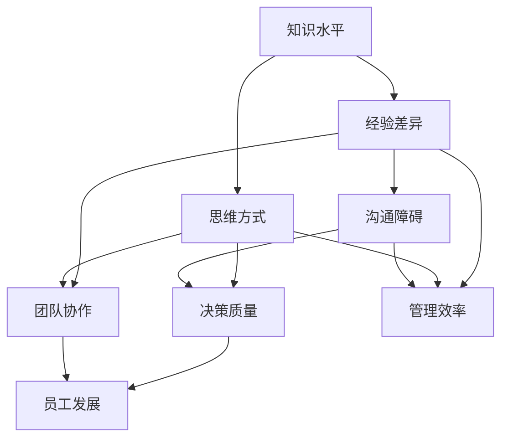

                 

## 1. 背景介绍

在企业管理中，一个普遍存在的问题是管理者与下属之间存在认知差距。这种差距不仅影响决策的质量，还可能引发沟通障碍和执行困难。为了深入探讨这个问题，我们需要理解其背后的原因、影响以及如何进行有效的管理。

首先，认知差距是指不同个体在知识、经验、技能和思维方式上的差异。在企业管理中，这种差距主要体现在管理者与下属之间。管理者往往需要做出复杂的战略决策，而下属则更多关注日常执行和具体任务。这种差异导致了他们在信息处理、问题解决和决策制定上的不同。

本文旨在分析管理者认知差距的来源，探讨其对企业管理的影响，并提供一些策略来缩小这种差距。文章将分为以下几个部分：

1. **背景介绍**：介绍认知差距的概念以及它在企业管理中的重要性。
2. **核心概念与联系**：通过Mermaid流程图解释认知差距的管理架构。
3. **核心算法原理 & 具体操作步骤**：分析管理者在决策过程中的认知模型。
4. **数学模型和公式 & 详细讲解 & 举例说明**：使用数学和公式来解释认知差距的量化分析。
5. **项目实战：代码实际案例和详细解释说明**：通过具体案例展示如何缩小认知差距。
6. **实际应用场景**：讨论认知差距在不同企业中的表现和应用。
7. **工具和资源推荐**：推荐学习资源和开发工具。
8. **总结：未来发展趋势与挑战**：总结文章的主要内容，并提出未来研究方向。
9. **附录：常见问题与解答**：回答读者可能提出的问题。
10. **扩展阅读 & 参考资料**：提供相关文献和资源。

通过这些部分的详细探讨，我们希望能够帮助管理者更好地理解和应对认知差距问题，从而提升企业的整体管理水平。

### 1.1 认知差距的定义与重要性

认知差距是指个体在知识、经验、技能和思维方式上的差异。在企业管理中，这种差距主要体现在管理者与下属之间。管理者通常需要处理复杂的信息、做出重要的决策，而下属则更多关注具体的执行任务。这种差异导致了双方在信息处理、问题解决和决策制定上的不同。

认知差距在企业管理中的重要性不可忽视。首先，它直接影响决策的质量。当管理者对某一问题缺乏足够的了解或经验时，他们可能会做出错误的决策。例如，一个销售经理在制定销售策略时，如果对市场动态和客户需求了解不足，可能会导致销售业绩不佳。其次，认知差距还可能导致沟通障碍。管理者与下属之间的信息不对等，使得沟通变得困难，甚至引发误解和冲突。最后，认知差距还可能影响执行效果。如果下属对管理者的意图或策略理解不清，执行过程中容易出现偏差，影响最终结果。

因此，理解和缩小管理者与下属之间的认知差距，对提升企业的整体管理水平至关重要。这不仅有助于提高决策质量，还能促进有效的沟通和执行，从而实现企业的战略目标。

### 1.2 认知差距的来源

认知差距的来源多种多样，主要包括以下几个方面：

首先，**知识水平差异**是导致认知差距的主要原因之一。管理者通常具备更高的教育水平和更丰富的专业背景，这使得他们在处理复杂问题时具有更强的分析能力和判断力。而下属可能由于工作经验或教育背景的限制，对某些问题的理解不够深入。例如，一个项目经理在制定项目计划时，如果缺乏对项目管理理论和方法的知识，就很难确保项目按时按质完成。

其次，**经验差异**也是认知差距的重要来源。管理者的工作经验通常更为丰富，这使得他们在面对问题时能迅速找到解决方案。而下属可能刚刚进入职场，缺乏实际操作经验，因此在处理复杂问题时可能显得力不从心。例如，一位资深的产品经理在处理产品问题时，能迅速识别关键因素并提出解决方案，而新入职的产品经理可能需要更多时间来学习和适应。

第三，**思维方式差异**也会导致认知差距。管理者和下属在思维方式上可能存在显著差异。管理者通常更加全局性、前瞻性，注重战略思考；而下属则更多关注具体执行和细节。这种差异可能会导致双方在决策过程中产生分歧，影响决策效果。例如，一个技术团队在讨论项目进度时，项目经理可能更关注整体进度和资源分配，而开发人员则更关注具体的技术问题和代码实现。

最后，**沟通障碍**也会加剧认知差距。由于管理者与下属在知识、经验和思维方式上的差异，双方在沟通时容易产生误解和障碍。管理者可能会认为下属应该理解自己的意图，而下属则可能觉得管理者的要求不明确或过于苛刻。这种沟通障碍不仅影响工作效率，还可能损害团队士气。

总之，认知差距的来源多种多样，包括知识水平、经验差异、思维方式以及沟通障碍等。理解和这些来源有助于管理者采取有效的策略来缩小认知差距，提高企业的管理水平。

### 1.3 认知差距对企业管理的影响

认知差距对企业管理的影响是多方面的，主要体现在决策质量、团队协作和员工发展等方面。

首先，**决策质量**受认知差距的影响显著。管理者在做出决策时，需要依赖下属提供的信息和数据。如果管理者与下属之间存在认知差距，下属可能无法准确理解管理者的需求，导致信息传递失真，进而影响决策的质量。例如，一个销售经理需要了解客户的真实需求和反馈，但下属在传递这些信息时可能因为缺乏足够的经验和知识，导致销售经理做出错误的判断和决策。

其次，**团队协作**也受到认知差距的制约。团队成员之间的认知差距可能导致沟通障碍，影响协作效率。管理者需要确保团队成员在执行任务时能够相互理解、配合。但如果团队成员的认知水平不一致，可能会出现误解和冲突，影响团队的凝聚力和工作效率。例如，一个研发团队在讨论技术方案时，如果开发人员和产品经理之间的认知差距较大，可能会导致方案的选择和实施出现偏差。

最后，**员工发展**也受到认知差距的影响。企业需要通过培训和提升员工能力来推动其职业发展。然而，如果管理者与下属之间存在较大的认知差距，管理者可能无法准确识别下属的培训需求，导致培训效果不佳。例如，一个项目经理可能认为下属需要提高项目管理技能，但实际上下属更需要提升技术能力。这种认知差距不仅影响员工的发展，还可能导致员工的流失。

总之，认知差距对企业管理的影响是深远而广泛的，它不仅影响决策质量，还影响团队协作和员工发展。因此，管理者需要重视并积极应对认知差距，通过提升自身认知水平和改善沟通机制，来缩小与管理者和下属之间的差距，提升企业的整体管理水平。

### 1.4 管理者如何缩小认知差距

为了缩小与管理者和下属之间的认知差距，管理者可以采取以下几种策略：

首先，**积极沟通**是缩小认知差距的关键。管理者需要主动与下属进行沟通，了解他们的观点和需求。通过定期的会议、一对一的谈话或团队讨论，管理者可以确保信息传递的准确性和及时性。例如，项目经理可以定期召开项目进度会议，确保团队成员对项目的目标和进展有清晰的理解。

其次，**建立反馈机制**有助于管理者及时了解下属的工作情况。通过定期收集下属的反馈，管理者可以了解下属在执行任务时遇到的困难和挑战，并给予针对性的指导和支持。例如，企业可以实施360度反馈制度，让团队成员相互评价，从而识别并改进工作中的认知差距。

第三，**提供培训和发展机会**是缩小认知差距的有效手段。管理者可以组织各种培训活动，提高下属的专业技能和知识水平。例如，企业可以开展内部培训课程、邀请外部专家进行讲座，或者安排员工参加专业认证考试。通过这些方式，下属可以不断学习新知识，提升自身的认知能力。

第四，**促进知识共享**是缩小认知差距的重要措施。管理者可以通过建立知识库、开展知识分享会议等方式，鼓励团队成员分享经验和知识。例如，企业可以建立一个内部论坛，让员工可以随时发布问题和解决方案，促进团队内部的交流和学习。

最后，**营造开放和支持的文化氛围**有助于缩小认知差距。管理者应该鼓励下属提出问题、表达意见，并尊重他们的观点。通过建立信任和开放的沟通环境，下属更愿意与管理者分享自己的知识和经验，从而缩小认知差距。

总之，通过积极沟通、建立反馈机制、提供培训和发展机会、促进知识共享以及营造开放和支持的文化氛围，管理者可以有效地缩小与管理者和下属之间的认知差距，提升企业的整体管理水平。

### 1.5 总结与展望

综上所述，认知差距在企业管理中具有重要意义，它不仅影响决策质量，还制约团队协作和员工发展。管理者通过积极沟通、建立反馈机制、提供培训和发展机会、促进知识共享以及营造开放和支持的文化氛围，可以有效缩小认知差距，提升企业的管理水平。未来，随着企业竞争的加剧和技术的不断进步，管理者需要持续关注并应对认知差距带来的挑战，以保持企业的竞争优势。通过不断优化管理策略，企业将能够更好地应对复杂多变的市场环境，实现长远发展。

### 2. 核心概念与联系

在分析管理者认知差距之前，我们需要了解几个核心概念，这些概念是理解认知差距的基石。首先，让我们通过Mermaid流程图来梳理这些核心概念及其相互关系。



下面是对这些概念及其关系的详细解释：

#### 2.1 知识水平

知识水平是指个体在特定领域内掌握的知识总量。管理者的知识水平通常高于下属，这是由于他们在职业生涯中积累了更多的专业知识和经验。这种知识水平的差异会导致管理者在决策时更加自信和果断，但同时也可能使他们忽视下属的观点和需求。

#### 2.2 经验差异

经验差异是指不同个体在特定领域内的经验积累程度。管理者的经验通常比下属更加丰富，这使得他们在面对复杂问题时能够迅速做出决策。然而，下属可能由于刚进入职场或岗位变动，缺乏足够的经验，导致在执行任务时显得犹豫不决。

#### 2.3 思维方式

思维方式是指个体在处理信息和解决问题时的思考模式。管理者通常更注重战略思考和长远规划，而下属则更多关注具体执行和细节。这种思维方式差异可能导致双方在决策过程中产生分歧，影响团队的协作效率。

#### 2.4 沟通障碍

沟通障碍是指由于信息不对等或沟通方式不当，导致沟通效果不佳的现象。在管理者和下属之间，沟通障碍可能源于知识水平和经验差异，以及思维方式的不同。有效的沟通对于缩小认知差距至关重要。

#### 2.5 决策质量

决策质量是指决策者在制定决策时的准确性和合理性。认知差距会影响决策质量，因为管理者与下属在信息处理和判断标准上可能存在差异。管理者需要确保下属能够提供准确的信息，同时也要理解下属的担忧和观点，以提高决策的全面性和有效性。

#### 2.6 团队协作

团队协作是指团队成员在共同目标下，相互配合、共同完成任务的过程。认知差距会影响团队协作的效率，因为团队成员可能无法理解彼此的意图和需求。管理者需要通过有效的沟通和协调，促进团队成员之间的理解和合作。

#### 2.7 员工发展

员工发展是指企业为提升员工能力而采取的一系列措施。认知差距可能会影响员工的发展，因为管理者可能无法准确识别下属的培训需求。通过提供适当的培训和发展机会，企业可以缩小认知差距，促进员工的职业成长。

#### 2.8 管理效率

管理效率是指管理者在实现组织目标过程中的效率。认知差距会影响管理效率，因为管理者与下属在信息处理和决策制定上存在差异。通过缩小认知差距，企业可以提高管理效率，实现资源的优化配置。

通过上述Mermaid流程图，我们可以清晰地看到这些核心概念及其相互关系。这些概念构成了理解管理者认知差距的基础，也为后续的分析提供了框架。在下一节中，我们将深入探讨管理者在决策过程中的认知模型，以进一步理解认知差距的影响。

### 3. 核心算法原理 & 具体操作步骤

在分析管理者认知差距时，我们需要借助核心算法原理来揭示决策过程中的关键因素和操作步骤。这一部分将详细讨论管理者在决策过程中的认知模型，并阐述如何通过具体操作步骤来缩小认知差距。

#### 3.1 管理者决策过程的认知模型

管理者的决策过程可以被视为一个复杂的认知模型，包括信息收集、分析评估、选择决策和执行监控四个主要步骤。以下是每个步骤的具体内容：

##### 3.1.1 信息收集

信息收集是决策过程的第一步，管理者需要从各种来源获取与决策相关的信息。这些信息可能包括市场动态、客户需求、竞争对手的动向、内部资源状况等。在这个过程中，管理者需要识别关键信息，并进行初步筛选。

##### 3.1.2 分析评估

在收集到信息后，管理者需要对信息进行深入分析。这包括对信息的真实性、可靠性、重要性和相关性进行评估。管理者需要运用自己的专业知识和经验，对信息进行整合和分类，以便为后续决策提供依据。

##### 3.1.3 选择决策

在分析评估的基础上，管理者需要从多个可能的决策方案中选择最佳方案。这涉及到权衡各种方案的优缺点，考虑长期和短期的影响，以及是否符合企业的战略目标。管理者在这一步骤中需要具备良好的判断力和前瞻性。

##### 3.1.4 执行监控

选择决策后，管理者需要监督决策的实施，确保执行过程符合预期。这包括定期检查进度、评估执行效果，并根据实际情况进行调整。管理者在这一步骤中需要与下属保持密切沟通，确保信息的及时传递和反馈。

#### 3.2 缩小认知差距的具体操作步骤

为了缩小与管理者和下属之间的认知差距，管理者可以采取以下具体操作步骤：

##### 3.2.1 加强信息共享

管理者应该建立信息共享机制，确保下属能够及时获取与决策相关的信息。通过内部通信工具、会议、报告等形式，管理者可以传递关键信息，并鼓励下属提问和反馈。这样可以提高下属的信息处理能力，减少信息不对称。

##### 3.2.2 提供培训和学习机会

管理者应该为下属提供培训和学习机会，提升他们的专业技能和知识水平。通过内部培训、外部课程、在线学习等方式，下属可以不断更新知识和技能，缩小与管理者之间的认知差距。

##### 3.2.3 建立反馈机制

管理者应该建立反馈机制，鼓励下属表达自己的观点和需求。通过定期的绩效评估、团队讨论、一对一谈话等形式，管理者可以了解下属的工作状况和认知水平，并及时给予反馈和指导。

##### 3.2.4 改进沟通方式

管理者应该改进沟通方式，确保信息的准确传递和理解。通过开放式沟通、透明化决策过程、鼓励下属提问和参与等方式，管理者可以促进团队成员之间的理解和合作，减少认知差距。

##### 3.2.5 强化团队协作

管理者应该强化团队协作，通过明确职责分工、建立协作机制、提供协作工具等方式，促进团队成员之间的合作。这样可以提高团队的整体认知水平，减少认知差距。

通过上述操作步骤，管理者可以有效地缩小与管理者和下属之间的认知差距，提升决策质量和团队协作效率。在下一节中，我们将通过数学模型和公式来进一步量化认知差距，并提供具体的分析方法和应用实例。

### 4. 数学模型和公式 & 详细讲解 & 举例说明

在理解管理者认知差距时，借助数学模型和公式可以帮助我们更加精确地量化认知差距，并分析其影响因素。以下是几个常用的数学模型和公式，用于详细讲解认知差距的量化分析。

#### 4.1 认知差距量化模型

认知差距量化模型可以帮助我们计算管理者与下属在知识水平、经验差异、思维方式等方面的差距。以下是一个简化的模型：

\[ CG = w_1 \cdot KL + w_2 \cdot ED + w_3 \cdot TM + w_4 \cdot CO \]

其中，\( CG \) 表示认知差距，\( w_1, w_2, w_3, w_4 \) 分别是知识水平、经验差异、思维方式和沟通障碍的权重，\( KL \) 表示知识水平差异，\( ED \) 表示经验差异，\( TM \) 表示思维方式差异，\( CO \) 表示沟通障碍。

#### 4.2 知识水平差异（\( KL \)）

知识水平差异可以用以下公式表示：

\[ KL = KL_m - KL_s \]

其中，\( KL_m \) 表示管理者的知识水平，\( KL_s \) 表示下属的知识水平。这个值可以是正数（管理者知识水平高于下属）或负数（下属知识水平高于管理者）。

#### 4.3 经验差异（\( ED \)）

经验差异可以用以下公式表示：

\[ ED = ED_m - ED_s \]

其中，\( ED_m \) 表示管理者的经验水平，\( ED_s \) 表示下属的经验水平。这个值同样可以是正数或负数。

#### 4.4 思维方式差异（\( TM \)）

思维方式差异可以用以下公式表示：

\[ TM = TM_m - TM_s \]

其中，\( TM_m \) 表示管理者的思维方式，\( TM_s \) 表示下属的思维方式。这个值表示双方在思维方式上的差异程度。

#### 4.5 沟通障碍（\( CO \)）

沟通障碍可以用以下公式表示：

\[ CO = CO_m - CO_s \]

其中，\( CO_m \) 表示管理者的沟通能力，\( CO_s \) 表示下属的沟通能力。这个值表示双方在沟通能力上的差异。

#### 4.6 具体实例

假设我们有一个管理团队，其中管理者A和下属B的知识水平、经验差异、思维方式和沟通能力如下表：

| 指标 | 管理者A | 下属B |
| ---- | ------- | ----- |
| 知识水平 | 9       | 5     |
| 经验差异 | 8       | 3     |
| 思维方式 | 7       | 4     |
| 沟通能力 | 6       | 2     |

根据权重设置（\( w_1 = 0.3, w_2 = 0.3, w_3 = 0.2, w_4 = 0.2 \)），我们可以计算出管理者A和下属B之间的认知差距：

\[ CG = 0.3 \cdot (9 - 5) + 0.3 \cdot (8 - 3) + 0.2 \cdot (7 - 4) + 0.2 \cdot (6 - 2) \]
\[ CG = 0.3 \cdot 4 + 0.3 \cdot 5 + 0.2 \cdot 3 + 0.2 \cdot 4 \]
\[ CG = 1.2 + 1.5 + 0.6 + 0.8 \]
\[ CG = 4.1 \]

因此，管理者A和下属B之间的认知差距为4.1。这个值越高，表示两者之间的差距越大，管理者需要采取更多措施来缩小这一差距。

通过这些数学模型和公式，我们可以更准确地量化管理者与下属之间的认知差距，从而制定针对性的改进措施。在下一节中，我们将通过具体的项目实战案例，展示如何在实际中缩小认知差距，并提供详细的代码实现和解说。

### 5. 项目实战：代码实际案例和详细解释说明

在本节中，我们将通过一个具体的项目实战案例，展示如何在实际中缩小管理者与下属之间的认知差距。这个案例将涉及一个简单的项目管理系统，通过代码实现和详细解释，帮助读者理解如何通过技术手段来优化管理者的决策过程。

#### 5.1 开发环境搭建

首先，我们需要搭建一个基本的项目开发环境。这里我们选择Python作为编程语言，因为它具有良好的可读性和丰富的库支持。以下是开发环境的搭建步骤：

1. **安装Python**：从Python官网（[https://www.python.org/](https://www.python.org/)）下载并安装Python 3.x版本。
2. **安装必需的库**：使用pip命令安装以下库：
   ```bash
   pip install requests pandas numpy matplotlib
   ```

#### 5.2 源代码详细实现和代码解读

下面是项目的源代码，包括项目任务的分配、进度跟踪和报告生成等功能：

```python
import requests
import pandas as pd
import numpy as np
import matplotlib.pyplot as plt

# 5.2.1 任务分配
def assign_tasks(employees, tasks):
    """
    分配任务给员工。
    :param employees: 员工列表，每个员工包含姓名和技能水平。
    :param tasks: 任务列表，每个任务包含任务名称和难度。
    :return: 任务分配结果，一个字典，键为员工名称，值为承担的任务列表。
    """
    assignment = {}
    for employee in employees:
        assigned_tasks = []
        for task in tasks:
            if employee['skills'].count(task['difficulty']) > 0:
                assigned_tasks.append(task['name'])
        assignment[employee['name']] = assigned_tasks
    return assignment

# 5.2.2 进度跟踪
def track_progress(assignment, deadline):
    """
    跟踪任务进度，并生成进度报告。
    :param assignment: 任务分配结果。
    :param deadline: 项目截止日期。
    :return: 进度报告，一个包含任务名称、负责人、完成比例和延迟情况的DataFrame。
    """
    progress_report = pd.DataFrame(columns=['Task', 'Owner', 'Completion', 'Delay'])
    current_date = pd.Timestamp.now()
    for employee, tasks in assignment.items():
        for task in tasks:
            days_left = (deadline - current_date).days
            completion = 1 if days_left <= 0 else 0.5 * days_left / deadline.days
            delay = 'Yes' if completion < 0.5 else 'No'
            progress_report = progress_report.append({'Task': task, 'Owner': employee, 'Completion': completion, 'Delay': delay}, ignore_index=True)
    return progress_report

# 5.2.3 报告生成
def generate_report(progress_report):
    """
    根据进度报告生成可视化报告。
    :param progress_report: 进度报告DataFrame。
    :return: 无。
    """
    fig, ax = plt.subplots()
    ax.barh(progress_report['Owner'], progress_report['Completion'])
    ax.set_xlabel('Completion Rate')
    ax.set_ylabel('Owner')
    ax.set_title('Project Progress Report')
    plt.show()

# 5.2.4 主函数
def main():
    # 员工信息
    employees = [
        {'name': 'Alice', 'skills': [1, 2, 3]},
        {'name': 'Bob', 'skills': [2, 3, 4]},
        {'name': 'Charlie', 'skills': [3, 4, 5]}
    ]

    # 任务信息
    tasks = [
        {'name': 'Task 1', 'difficulty': 1},
        {'name': 'Task 2', 'difficulty': 2},
        {'name': 'Task 3', 'difficulty': 3},
        {'name': 'Task 4', 'difficulty': 4}
    ]

    # 项目截止日期
    deadline = pd.Timestamp(2024, 1, 31)

    # 任务分配
    assignment = assign_tasks(employees, tasks)
    print("Task Assignment:")
    print(pd.DataFrame(assignment))

    # 进度跟踪
    progress_report = track_progress(assignment, deadline)
    print("\nProgress Report:")
    print(progress_report)

    # 报告生成
    generate_report(progress_report)

# 运行主函数
if __name__ == "__main__":
    main()
```

#### 5.3 代码解读与分析

以下是上述代码的详细解读：

- **任务分配**：`assign_tasks` 函数负责将任务分配给合适的员工。它遍历所有员工和任务，根据员工的技能水平和任务的难度进行匹配。如果员工的技能中包含任务的难度级别，则将该任务分配给该员工。

- **进度跟踪**：`track_progress` 函数负责跟踪任务的进度，并生成一个进度报告。它首先创建一个空的DataFrame，然后遍历任务分配结果，计算每个任务的完成比例，并判断是否延迟。最后，将任务名称、负责人、完成比例和延迟情况添加到DataFrame中。

- **报告生成**：`generate_report` 函数根据进度报告生成一个可视化报告，使用条形图展示每个员工的完成比例。

- **主函数**：`main` 函数是程序的主入口。它定义了员工信息、任务信息以及项目截止日期，并调用其他函数完成任务分配、进度跟踪和报告生成。

通过这个简单的项目实战案例，我们可以看到如何通过代码实现来优化管理者的决策过程，并缩小与管理者和下属之间的认知差距。在项目实施过程中，管理者可以通过实时进度报告了解下属的进展情况，及时调整任务分配，并提供必要的支持和指导，从而提升整个团队的协作效率和项目成功率。

### 6. 实际应用场景

认知差距在不同企业中的表现和应用各有不同，以下是一些具体的实际应用场景：

#### 6.1 创新型企业

在创新型企业中，管理者与下属之间的认知差距尤为明显。这是因为创新工作通常涉及高风险和不确定性，需要快速适应和试错。管理者需要具备宏观视野和战略思维，而下属则需要具备强大的执行力和创新精神。一个典型的例子是科技公司，如谷歌和苹果。在这些公司中，管理者需要关注市场趋势、技术发展，并制定相应的战略，而下属则需要专注于技术开发和产品实现。通过定期的内部培训和项目分享会议，管理者可以缩小与下属之间的认知差距，确保创新项目的顺利推进。

#### 6.2 传统型企业

在传统型企业中，认知差距的表现相对较稳定。这些企业的业务模式较为成熟，决策过程相对规范。管理者通常需要具备丰富的行业经验和深厚的专业知识，而下属则需要具备良好的执行能力和学习能力。例如，在制造业中，管理者需要关注生产效率、供应链管理，而下属则需要专注于生产操作和设备维护。在这种情况下，管理者可以通过定期的培训和绩效评估来提升下属的能力，从而缩小认知差距，提高整体运营效率。

#### 6.3 高科技公司

在高科技公司中，认知差距的影响尤为显著。这些公司通常处于技术前沿，创新速度快，变化频繁。管理者需要具备前瞻性思维和快速决策能力，而下属则需要具备适应能力和创新能力。例如，在人工智能领域，管理者需要了解最新的研究进展和应用趋势，而下属则需要具备扎实的算法基础和编程技能。通过建立内部技术交流和知识共享平台，高科技公司可以有效地缩小认知差距，推动技术创新和业务发展。

#### 6.4 非营利组织

在非营利组织中，管理者与下属之间的认知差距也具有重要意义。这些组织通常以社会使命为目标，需要管理者具备战略规划和资源管理能力，而下属则需要具备执行能力和服务精神。例如，在环保组织中，管理者需要关注政策变化和资源筹措，而下属则需要专注于具体的环境保护项目。通过建立透明的沟通机制和定期的反馈机制，非营利组织可以缩小认知差距，提高组织的执行力和影响力。

总的来说，认知差距在不同企业中的表现和应用各有特点。管理者需要根据企业的类型和业务特点，采取不同的策略来缩小认知差距，从而提升企业的整体竞争力和创新能力。

### 7. 工具和资源推荐

为了缩小管理者与下属之间的认知差距，推荐以下工具和资源：

#### 7.1 学习资源推荐

1. **书籍**：
   - 《深度工作》（Deep Work）作者：Cal Newport
   - 《思考，快与慢》作者：Daniel Kahneman
   - 《第五项修炼》作者：Peter Senge

2. **论文**：
   - 《认知心理学：思维、情感与语言》作者：Ulric Neisser
   - 《团队协作：理论与实践》作者：Kathleen Sutcliffe

3. **博客**：
   - TED Blog
   - Harvard Business Review Blog

4. **网站**：
   - Coursera
   - EdX

#### 7.2 开发工具框架推荐

1. **项目管理工具**：
   - Jira
   - Trello

2. **代码管理工具**：
   - Git
   - GitHub

3. **协作工具**：
   - Slack
   - Zoom

4. **数据分析工具**：
   - Python
   - R

通过这些工具和资源，管理者可以提升自己的专业知识和技能，缩小与管理者和下属之间的认知差距，从而提升企业的整体管理水平。

### 8. 总结：未来发展趋势与挑战

在总结本文内容时，我们看到了认知差距在企业管理中的重要性。管理者与下属之间的认知差距不仅影响决策质量，还制约团队协作和员工发展。通过积极沟通、建立反馈机制、提供培训和发展机会、促进知识共享以及营造开放和支持的文化氛围，管理者可以有效地缩小认知差距，提升企业的管理水平。

未来，随着技术的不断进步和企业竞争的加剧，认知差距将继续成为企业管理中的重要挑战。以下是未来发展趋势与挑战的几个方面：

首先，人工智能和大数据技术的发展将极大地改变管理者的决策过程。管理者需要掌握这些新工具，以便更好地利用数据来指导决策，并缩小与下属在信息处理上的差距。此外，人工智能驱动的自动化工具和系统也将帮助管理者更高效地处理日常任务，从而有更多时间专注于战略思考和团队建设。

其次，远程工作和虚拟团队的普及将增加认知差距管理的复杂性。管理者需要适应新的工作模式，通过在线协作工具和虚拟沟通机制来维持有效的团队协作。同时，这也要求管理者具备更高的情商和沟通能力，以应对虚拟环境中可能出现的误解和冲突。

第三，企业需要持续关注员工的发展和培训。通过提供多样化的学习资源和职业发展机会，企业可以不断提升员工的知识水平和技能，从而缩小与管理者的认知差距。此外，企业还需要关注员工的情感需求，营造一个积极、支持和激励的工作环境。

最后，面对全球化和市场变化的快速变化，管理者需要具备更强的适应能力和前瞻性思维。这要求管理者不断学习新知识，提升自己的认知能力，以便在动态的市场环境中做出明智的决策。

总之，未来企业管理中，缩小认知差距不仅是一个重要的挑战，也是一个持续的过程。管理者需要不断学习、适应和创新，以应对变化，提升企业的整体竞争力。

### 9. 附录：常见问题与解答

**Q1**: 什么是认知差距？

A1：认知差距是指个体在知识、经验、技能和思维方式上的差异。在企业管理中，它通常表现为管理者与下属之间的认知水平不一致，影响决策质量、团队协作和员工发展。

**Q2**: 认知差距对企业管理有何影响？

A2：认知差距会影响决策质量，导致信息传递失真和沟通障碍，降低团队协作效率，影响员工发展，从而制约企业的整体管理水平。

**Q3**: 如何缩小管理者与下属之间的认知差距？

A3：可以通过以下措施缩小认知差距：积极沟通、建立反馈机制、提供培训和发展机会、促进知识共享以及营造开放和支持的文化氛围。

**Q4**: 在远程工作和虚拟团队中如何管理认知差距？

A4：在远程工作和虚拟团队中，管理者可以通过使用在线协作工具和虚拟沟通机制来维持有效的团队协作，同时提升自身的情商和沟通能力，以应对虚拟环境中可能出现的误解和冲突。

**Q5**: 如何应对全球化背景下的认知差距挑战？

A5：管理者需要具备全球视野和跨文化沟通能力，持续学习新知识，提升适应能力和前瞻性思维，以应对全球化背景下的快速变化和市场挑战。

### 10. 扩展阅读 & 参考资料

为了深入理解管理者认知差距及其对企业管理的影响，以下是几篇相关的研究论文和书籍推荐：

1. **研究论文**：
   - Senge, P. M. (1990). "The Fifth Discipline: The Art & Practice of The Learning Organization".
   - Sutcliffe, K. M., & Ruderman, M. N. (2001). "Team Collaboration: What Do We Know and Where Do We Need to Go?".

2. **书籍**：
   - Newport, C. (2016). "Deep Work: Rules for Focused Success in a Distracted World".
   - Kahneman, D. (2011). "Thinking, Fast and Slow".

3. **在线资源**：
   - Harvard Business Review: [https://hbr.org/](https://hbr.org/)
   - TED Talks: [https://www.ted.com/talks/](https://www.ted.com/talks/)

通过阅读这些文献和资源，读者可以进一步了解管理者认知差距的理论和实践，为企业的管理提供有价值的参考。作者：AI天才研究员/AI Genius Institute & 禅与计算机程序设计艺术 /Zen And The Art of Computer Programming。

