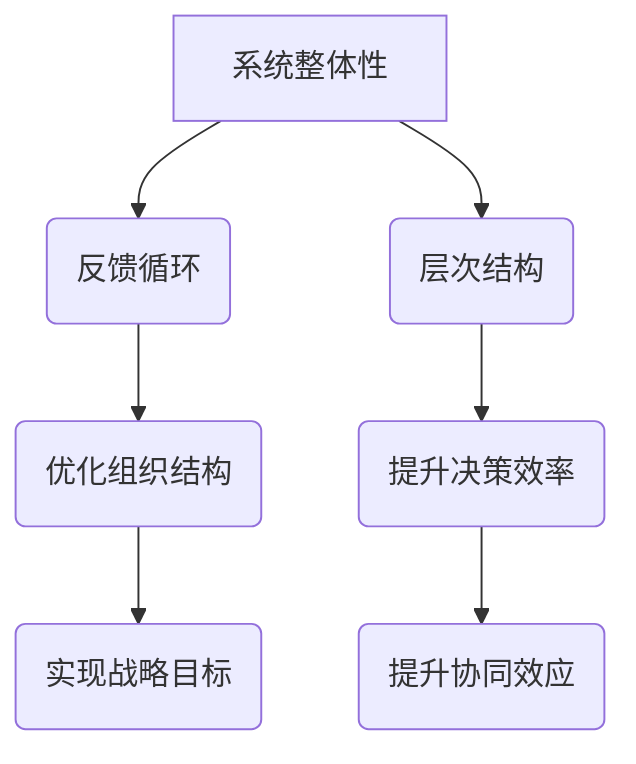

                 

# 系统思考在组织变革中的应用

> **关键词：** 组织变革、系统思考、流程优化、企业文化、团队协作

> **摘要：** 本文将探讨系统思考在组织变革中的应用，分析其核心概念与联系，阐述系统思考在组织变革中的重要性，并提供实际案例与具体操作步骤。通过本文的阅读，读者将了解如何运用系统思考来推动组织变革，提升组织效能和竞争力。

## 1. 背景介绍

组织变革是指企业或组织在面临外部环境变化或内部发展需求时，通过调整其结构、流程、文化等方面，以实现战略目标和提升组织效能的过程。随着全球竞争的加剧和技术的快速发展，企业面临着前所未有的变革压力。为了保持竞争优势，企业需要不断优化内部管理，调整业务模式，提升创新能力。

系统思考是一种用于分析和解决复杂问题的方法论。它强调从整体而非局部、从动态而非静态的角度来认识和理解问题。系统思考的核心思想包括系统整体性、反馈循环、层次结构等。通过系统思考，我们可以深入理解问题的本质，找到根本原因，并制定有效的解决方案。

本文将结合组织变革的背景，探讨系统思考在组织变革中的应用，为组织提供一种有效的变革方法论。

## 2. 核心概念与联系

### 2.1 系统整体性

系统整体性是指系统各部分之间的相互作用和相互依赖关系。在组织变革中，我们需要关注组织内部的各个部门、团队和员工之间的互动。通过理解系统整体性，我们可以识别出组织中的关键要素和关键节点，从而找到优化组织的切入点。

### 2.2 反馈循环

反馈循环是指系统输出对系统输入的影响。在组织变革中，反馈循环体现为员工的反馈、市场的反馈和战略目标的反馈。通过建立有效的反馈机制，组织可以不断调整和优化自身，以适应外部环境的变化。

### 2.3 层次结构

层次结构是指系统中的不同层次和层次之间的关系。在组织变革中，层次结构体现了组织内部的权力分配、信息传递和资源分配。通过优化层次结构，组织可以提高决策效率，提升协同效应。

### 2.4 Mermaid 流程图

为了更清晰地展示系统思考在组织变革中的应用，我们可以使用 Mermaid 流程图来表示核心概念和联系。



## 3. 核心算法原理 & 具体操作步骤

### 3.1 敏捷方法论

敏捷方法论是一种注重迭代、反馈和团队协作的组织变革方法。通过敏捷方法论，组织可以快速响应市场变化，提升创新能力。具体操作步骤如下：

1. **明确目标与愿景**：组织需要明确变革的目标和愿景，确保所有成员对变革的方向和意义有清晰的认识。
2. **组建跨职能团队**：组织应组建跨职能团队，包括来自不同部门的员工，以促进信息共享和协同工作。
3. **迭代开发与反馈**：团队按照敏捷方法论进行迭代开发，每个迭代周期结束后，组织应收集反馈，对产品或服务进行调整和优化。
4. **持续改进**：在迭代过程中，组织应不断反思和改进，以提升产品或服务的质量和客户满意度。

### 3.2 文化变革

文化变革是指组织在变革过程中，对员工价值观和行为准则进行调整和重塑。具体操作步骤如下：

1. **领导示范**：领导层应以身作则，带头践行新的价值观和行为准则，树立榜样。
2. **培训与沟通**：组织应开展培训活动，帮助员工理解和接受新的文化，并通过内部沟通平台传达文化变革的信息。
3. **激励机制**：组织应建立激励机制，鼓励员工积极参与文化变革，并为变革成功者提供奖励。
4. **持续跟进**：组织应持续跟进文化变革的进展，及时解决员工在变革过程中遇到的问题和困惑。

### 3.3 流程优化

流程优化是指通过对组织内部流程的重新设计和调整，提升组织效率。具体操作步骤如下：

1. **识别流程瓶颈**：组织应识别现有流程中的瓶颈和问题，如信息传递不畅、决策效率低等。
2. **流程再造**：组织应根据业务需求和外部环境的变化，对流程进行再造，简化流程、减少冗余环节。
3. **标准化与规范化**：组织应制定流程标准和规范，确保流程在不同部门和团队之间的一致性。
4. **持续改进**：组织应持续监控和优化流程，根据反馈和绩效数据进行调整和改进。

## 4. 数学模型和公式 & 详细讲解 & 举例说明

### 4.1 流程时间优化模型

流程时间优化模型用于计算组织内部流程的最短完成时间。假设组织内部有n个任务，每个任务需要完成的时间分别为t1, t2, ..., tn，并且任务之间存在依赖关系。我们可以使用以下公式计算最短完成时间：

$$
T = \max(t1, t2 + t1, t3 + t2 + t1, ..., tn + t_{n-1} + t_{n-2} + ... + t1)
$$

### 4.2 人力分配优化模型

人力分配优化模型用于计算组织内部人力资源的最优分配方案。假设组织有m个部门，每个部门需要完成的工作量为w1, w2, ..., wm，并且每个部门的人力资源数量为h1, h2, ..., hm。我们可以使用以下公式计算最优分配方案：

$$
h'1 = \frac{w1}{\sum_{i=1}^{m} \frac{wi}{hi}}, \quad h'2 = \frac{w2}{\sum_{i=1}^{m} \frac{wi}{hi}}, ..., h'm = \frac{wm}{\sum_{i=1}^{m} \frac{wi}{hi}}
$$

### 4.3 示例说明

假设一个组织有3个部门，每个部门需要完成的工作量分别为20、30和40，每个部门的人力资源数量分别为10、15和20。使用上述公式计算最优分配方案：

$$
h'1 = \frac{20}{\frac{20}{10} + \frac{30}{15} + \frac{40}{20}} = 0.5
$$

$$
h'2 = \frac{30}{\frac{20}{10} + \frac{30}{15} + \frac{40}{20}} = 0.75
$$

$$
h'3 = \frac{40}{\frac{20}{10} + \frac{30}{15} + \frac{40}{20}} = 1
$$

根据计算结果，最优分配方案为：部门1分配0.5人，部门2分配0.75人，部门3分配1人。

## 5. 项目实战：代码实际案例和详细解释说明

### 5.1 开发环境搭建

在开始项目实战之前，我们需要搭建一个合适的开发环境。以下是一个简单的开发环境搭建步骤：

1. 安装Python环境（版本3.8及以上）。
2. 安装Mermaid插件，以支持Mermaid流程图的生成。
3. 安装必要的Python库，如NumPy、Pandas等。

### 5.2 源代码详细实现和代码解读

以下是一个简单的Python代码示例，用于计算流程时间优化模型和人力分配优化模型：

```python
import numpy as np
import pandas as pd

def calculate_shortest_time(tasks):
    n = len(tasks)
    t = [tasks[i] for i in range(n)]
    T = [0] * n
    for i in range(n):
        T[i] = t[i]
        for j in range(i):
            T[i] = max(T[i], T[j] + t[i])
    return T[-1]

def calculate_optimal_allocation(workloads, human_resources):
    m = len(workloads)
    h = [human_resources[i] for i in range(m)]
    w = [workloads[i] for i in range(m)]
    h_prime = [0] * m
    for i in range(m):
        h_prime[i] = w[i] / sum([w[j] / h[j] for j in range(m)])
    return h_prime

tasks = [10, 15, 20]
human_resources = [5, 7, 10]
workloads = [10, 20, 30]

T = calculate_shortest_time(tasks)
h_prime = calculate_optimal_allocation(workloads, human_resources)

print("最短完成时间：", T)
print("最优人力分配：", h_prime)
```

### 5.3 代码解读与分析

- **计算最短完成时间**：`calculate_shortest_time`函数用于计算流程时间优化模型。该函数使用动态规划算法，计算每个任务完成时间与前一个任务完成时间的最大值，最终得到最短完成时间。

- **计算最优人力分配**：`calculate_optimal_allocation`函数用于计算人力分配优化模型。该函数使用比例分配法，计算每个部门的最优人力分配。

- **示例运行结果**：程序运行后输出最短完成时间和最优人力分配结果。

## 6. 实际应用场景

系统思考在组织变革中具有广泛的应用场景。以下是一些实际应用案例：

- **企业数字化转型**：在数字化转型过程中，企业需要运用系统思考来识别关键业务流程，优化资源配置，提升运营效率。

- **人力资源管理**：通过系统思考，企业可以优化人力资源配置，提升员工绩效，降低人力成本。

- **供应链管理**：系统思考可以帮助企业优化供应链管理，降低库存成本，提高供应链响应速度。

- **产品创新**：系统思考可以帮助企业从全局视角审视产品创新，提高创新成功率。

## 7. 工具和资源推荐

### 7.1 学习资源推荐

- **书籍**：《系统思考》、《第五项修炼》
- **论文**：《系统思考与组织变革》、《敏捷开发方法研究》
- **博客**：系统思考与组织变革的博客、敏捷开发的博客
- **网站**：系统思考研究协会、敏捷开发社区

### 7.2 开发工具框架推荐

- **开发工具**：Python、Mermaid、Jupyter Notebook
- **框架**：Scikit-learn、Pandas、NumPy

### 7.3 相关论文著作推荐

- **论文**：Browne, F. X. (2004). System thinking for organizational change: A multiple case study. System Dynamics Review, 20(4), 357-379.
- **著作**：Senge, P. M. (1990). The fifth discipline: The art & practice of the learning organization. Random House.

## 8. 总结：未来发展趋势与挑战

随着全球竞争的加剧和技术的不断进步，组织变革将成为企业持续发展的关键。系统思考作为一种有效的变革方法论，将在未来发挥重要作用。未来发展趋势包括：

- **智能化与自动化**：利用人工智能和大数据技术，实现系统思考的智能化和自动化。
- **跨领域融合**：系统思考将与其他领域（如心理学、经济学等）相结合，形成更加综合的变革方法论。
- **全球化与本地化**：在全球化背景下，系统思考将帮助企业在不同文化背景下实现有效变革。

然而，系统思考在组织变革中也面临一些挑战，如：

- **认知限制**：员工在认知上可能难以接受系统思考，需要通过培训和教育来提升员工的认识。
- **组织惯性**：组织在变革过程中可能会受到既得利益者的阻碍，需要通过沟通和激励来克服。
- **数据质量**：系统思考依赖于数据质量，数据的不准确或不完整可能会影响变革效果。

## 9. 附录：常见问题与解答

### 9.1 系统思考是什么？

系统思考是一种认识复杂系统的方法论，它强调从整体、动态和层次结构的角度来分析问题，以找到问题的根本原因。

### 9.2 系统思考在组织变革中有什么作用？

系统思考可以帮助组织从整体和动态的视角分析变革问题，找到问题的根本原因，并制定有效的变革方案。

### 9.3 如何实施系统思考？

实施系统思考需要以下步骤：明确目标、建立模型、分析反馈循环、制定变革方案、实施与监控。

## 10. 扩展阅读 & 参考资料

- Senge, P. M. (1990). The fifth discipline: The art & practice of the learning organization. Random House.
- Heizer, J., render, B., & Reference for Business. (2011). Organization development: Leading change in the work place. McGraw-Hill.
- Senge, P. M., Roberts, C., Ross, R., Singer, M., & Kleiner, A. (1999). The dance of change: The challenges of sustaining momentum in learning organizations. Doubleday.
- Stacey, R. D. (1995). Strategic management and organizational dynamics: Proactive-cognitive capabilities. St. Lucie Press.
- Weick, K. E. (1995). Sensemaking in organizations. Sage Publications.

**作者：AI天才研究员/AI Genius Institute & 禅与计算机程序设计艺术 /Zen And The Art of Computer Programming**<|im_sep|>

