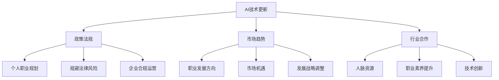

                 

## 《紧跟AI行业动态的重要性》

### 关键词: AI行业动态、技术更新、趋势分析、未来展望、专业成长

> 摘要：在人工智能迅猛发展的时代，紧跟AI行业动态显得尤为重要。本文将深入探讨AI行业动态的重要性，分析AI技术的演进趋势，以及如何通过持续关注行业动态来实现个人和企业的专业成长。让我们一起探讨这一领域的无限可能。

## 1. 背景介绍

随着科技的飞速发展，人工智能（AI）已经成为现代社会不可或缺的一部分。从语音识别、图像处理到自动驾驶、智能医疗，AI技术在各个领域的应用不断拓展，深刻地改变了我们的生活方式。然而，AI技术的进步并非一帆风顺，它是一个持续演变的过程，每一个阶段都充满了新的挑战和机遇。

在这个充满变数的AI行业中，紧跟行业动态成为了每一个技术从业者和企业都不得不面对的课题。行业动态不仅包括了技术的最新进展，还涵盖了政策法规、市场趋势以及行业合作等多方面信息。对于个人而言，了解行业动态有助于抓住职业发展的机会；对于企业而言，及时掌握行业动态则能够帮助企业抢占市场先机，保持竞争优势。

### 1.1 AI技术的演进历程

AI技术的发展经历了几个关键阶段。从最初的符号主义、基于规则的系统，到基于统计学习的机器学习，再到深度学习的崛起，AI技术不断突破边界，实现了从理论到应用的飞跃。以下是对AI技术演进历程的简要回顾：

- **符号主义时代（1940s-1970s）**：人工智能的早期探索主要集中在构建基于逻辑和规则的智能系统。

- **知识表示与专家系统（1970s-1980s）**：这一阶段的研究重点是知识表示和推理，专家系统成为应用热点。

- **机器学习兴起（1990s-2000s）**：统计学习方法的兴起，特别是支持向量机（SVM）和决策树的应用，使得机器学习成为AI研究的主流。

- **深度学习革命（2010s-至今）**：深度学习技术的突破，尤其是卷积神经网络（CNN）和循环神经网络（RNN）的发展，推动了AI技术的快速发展。

### 1.2 行业动态对个人和企业的影响

个人层面，了解AI行业动态有助于：

- **职业规划**：通过了解行业趋势，可以更好地制定职业发展路径，抓住新兴领域的就业机会。

- **技能提升**：紧跟技术更新，学习最新的AI技术和工具，提升自身竞争力。

- **创新思维**：行业动态中的新观点、新方法可以激发创新思维，推动个人技术成长。

企业层面，行业动态的影响则更为深远：

- **市场定位**：通过分析行业趋势，企业可以更准确地定位市场，制定发展战略。

- **技术创新**：及时掌握行业最新技术，推动企业技术创新，保持市场竞争力。

- **合作与竞争**：了解行业动态有助于企业识别潜在合作伙伴，同时应对竞争对手的挑战。

## 2. 核心概念与联系

### 2.1 AI行业动态的核心要素

AI行业动态的核心要素包括技术更新、政策法规、市场趋势和行业合作。以下是这些要素的具体内容：

#### 技术更新

技术更新是AI行业发展的重要驱动力。技术进步不仅体现在算法的改进，还包括硬件设施的提升，如GPU、TPU等专用计算设备的出现，极大地推动了AI技术的发展。

#### 政策法规

政策法规对AI行业的发展有着重要影响。不同国家和地区在隐私保护、数据安全、伦理道德等方面有不同的法律法规，这些法规的制定和执行直接影响到AI技术的应用和发展。

#### 市场趋势

市场趋势反映了AI技术的应用场景和需求变化。例如，自动驾驶、智能医疗、智能家居等领域的兴起，为AI技术提供了广阔的市场空间。

#### 行业合作

行业合作是推动AI技术发展的重要途径。通过跨行业、跨领域的合作，可以整合各方资源，实现优势互补，加速技术突破。

### 2.2 行业动态与个人成长的联系

#### 技术更新

个人成长离不开技术更新。通过了解最新的AI技术，可以掌握行业前沿动态，提升自身技能水平。

#### 政策法规

掌握相关政策法规，有助于个人在职业发展中规避法律风险，同时也能够更好地应对工作中的挑战。

#### 市场趋势

了解市场趋势，可以帮助个人更好地把握职业发展方向，选择具有潜力的领域进行深耕。

#### 行业合作

积极参与行业合作，不仅可以拓宽人脉资源，还能够通过合作项目提升个人能力和职业素养。

### 2.3 行业动态与企业发展的联系

#### 技术更新

企业通过紧跟技术更新，可以不断优化产品和服务，提升市场竞争力。

#### 政策法规

遵守政策法规，是企业发展的重要保障。企业需要密切关注法律法规的变化，确保合规运营。

#### 市场趋势

把握市场趋势，有助于企业调整发展战略，抓住市场机遇。

#### 行业合作

通过行业合作，企业可以整合资源，实现优势互补，推动技术创新。

### 2.4 Mermaid 流程图

以下是AI行业动态与个人成长、企业发展的Mermaid流程图：



## 3. 核心算法原理 & 具体操作步骤

### 3.1. 核心算法原理

在AI行业中，核心算法原理是理解和运用AI技术的基石。以下是一些关键算法及其原理：

#### 深度学习

深度学习是AI领域的重要分支，通过多层神经网络对数据进行建模和预测。其基本原理是利用大量数据通过反向传播算法优化网络参数。

#### 生成对抗网络（GAN）

生成对抗网络由生成器和判别器组成，通过两个网络的对抗训练生成逼真的数据。其原理是通过不断优化生成器的数据生成能力，使其逐渐逼近真实数据。

#### 自然语言处理（NLP）

自然语言处理涉及文本的理解和生成。关键算法包括词嵌入、循环神经网络（RNN）、变换器（Transformer）等，通过这些算法可以实现对文本的语义分析和生成。

### 3.2. 具体操作步骤

#### 步骤1：了解AI技术的基本概念

首先，需要了解AI技术的基本概念，如机器学习、深度学习、神经网络等，这为后续学习打下基础。

#### 步骤2：掌握核心算法

通过阅读文献、参加课程和实验实践，掌握核心算法的原理和应用，如深度学习框架（TensorFlow、PyTorch）的使用。

#### 步骤3：实践应用

将所学知识应用于实际问题中，通过项目实践来巩固和提升技能。例如，构建一个简单的图像分类模型，或实现一个自然语言处理的应用。

#### 步骤4：持续学习和迭代

AI技术更新迅速，需要不断学习和迭代，紧跟行业动态，掌握最新技术。

### 3.3. 实际案例

以下是一个简单的图像分类模型的实现步骤：

1. **数据收集**：收集大量的图像数据，用于训练和测试模型。
2. **数据预处理**：对图像进行缩放、裁剪、增强等预处理操作，使其适合模型训练。
3. **模型构建**：使用深度学习框架构建卷积神经网络（CNN）模型。
4. **模型训练**：使用训练集数据进行模型训练，调整网络参数。
5. **模型评估**：使用测试集数据评估模型性能，调整模型结构。
6. **模型部署**：将训练好的模型部署到生产环境中，进行实际应用。

## 4. 数学模型和公式 & 详细讲解 & 举例说明

### 4.1. 数学模型

在AI领域中，数学模型是理解和实现算法的基础。以下是一些核心数学模型及其详细讲解：

#### 深度学习中的反向传播算法

反向传播算法是深度学习中的核心优化方法，用于训练神经网络。其基本原理是利用梯度下降法来优化网络参数，具体步骤如下：

1. **前向传播**：将输入数据通过神经网络进行前向传播，计算输出结果。
2. **损失计算**：计算输出结果与真实标签之间的误差，得到损失函数值。
3. **反向传播**：计算每一层神经元的梯度，将梯度传递回前一层，更新网络参数。
4. **迭代优化**：重复前向传播和反向传播，逐步优化网络参数。

#### 生成对抗网络（GAN）

生成对抗网络由生成器和判别器组成，其数学模型如下：

- **生成器（Generator）**：通过随机噪声生成逼真的数据。
- **判别器（Discriminator）**：判断生成数据与真实数据之间的相似度。

GAN的优化目标是最小化判别器的损失函数，最大化生成器的损失函数。

### 4.2. 公式和详细讲解

以下是相关数学公式的详细讲解：

#### 反向传播算法中的梯度计算

梯度是衡量函数变化率的一个向量，对于函数 \(f(x)\)，其在点 \(x_0\) 的梯度可以表示为：

$$
\nabla f(x_0) = \left( \frac{\partial f}{\partial x_1}(x_0), \frac{\partial f}{\partial x_2}(x_0), ..., \frac{\partial f}{\partial x_n}(x_0) \right)
$$

其中，\(\frac{\partial f}{\partial x_i}(x_0)\) 表示函数 \(f\) 在点 \(x_0\) 处对第 \(i\) 个变量的偏导数。

#### 生成对抗网络（GAN）中的损失函数

生成器的损失函数 \(L_G\) 和判别器的损失函数 \(L_D\) 分别为：

$$
L_G = -\log(D(G(z)))
$$

$$
L_D = -[\log(D(x)) + \log(1 - D(G(z))]
$$

其中，\(D(x)\) 和 \(D(G(z))\) 分别表示判别器对真实数据和生成数据的判断结果。

### 4.3. 举例说明

以下是一个简单的神经网络梯度计算的例子：

假设有一个简单的全连接神经网络，输入层有2个神经元，隐藏层有3个神经元，输出层有1个神经元。使用反向传播算法进行梯度计算：

1. **前向传播**：输入一个样本 \([x_1, x_2]\)，通过神经网络计算输出 \([z_1, z_2, z_3, y]\)。
2. **损失计算**：计算输出与真实标签之间的误差，得到损失函数值。
3. **反向传播**：计算每一层神经元的梯度，更新网络参数。

具体计算过程如下：

- **前向传播**：

$$
z_1 = \sigma(w_{11}x_1 + w_{12}x_2 + b_1)
$$

$$
z_2 = \sigma(w_{21}x_1 + w_{22}x_2 + b_2)
$$

$$
z_3 = \sigma(w_{31}x_1 + w_{32}x_2 + b_3)
$$

$$
y = \sigma(w_{41}z_1 + w_{42}z_2 + w_{43}z_3 + b_4)
$$

- **损失计算**：

$$
L = \frac{1}{2} \sum_{i=1}^{n} (y_i - t_i)^2
$$

- **反向传播**：

$$
\frac{\partial L}{\partial w_{41}} = (y - t)z_1
$$

$$
\frac{\partial L}{\partial w_{42}} = (y - t)z_2
$$

$$
\frac{\partial L}{\partial w_{43}} = (y - t)z_3
$$

$$
\frac{\partial L}{\partial b_4} = (y - t)
$$

$$
\frac{\partial L}{\partial z_1} = \sigma'(z_1)w_{41}(y - t)
$$

$$
\frac{\partial L}{\partial z_2} = \sigma'(z_2)w_{42}(y - t)
$$

$$
\frac{\partial L}{\partial z_3} = \sigma'(z_3)w_{43}(y - t)
$$

$$
\frac{\partial L}{\partial w_{11}} = x_1\sigma'(z_1)w_{41}(y - t)
$$

$$
\frac{\partial L}{\partial w_{12}} = x_2\sigma'(z_1)w_{41}(y - t)
$$

$$
\frac{\partial L}{\partial w_{21}} = x_1\sigma'(z_2)w_{42}(y - t)
$$

$$
\frac{\partial L}{\partial w_{22}} = x_2\sigma'(z_2)w_{42}(y - t)
$$

$$
\frac{\partial L}{\partial b_1} = \sigma'(z_1)w_{41}(y - t)
$$

$$
\frac{\partial L}{\partial b_2} = \sigma'(z_2)w_{42}(y - t)
$$

通过上述计算，可以得到每一层神经元的梯度，从而更新网络参数。

## 5. 项目实战：代码实际案例和详细解释说明

### 5.1 开发环境搭建

在开始项目实战之前，我们需要搭建一个适合开发AI项目的环境。以下是搭建环境的步骤：

1. **安装Python**：下载并安装Python 3.x版本。
2. **安装Anaconda**：下载并安装Anaconda，它是一个集成了Python及其依赖项的虚拟环境管理工具。
3. **创建虚拟环境**：在Anaconda命令行中创建一个新的虚拟环境，例如：

   ```bash
   conda create -n ai_project python=3.8
   conda activate ai_project
   ```

4. **安装依赖项**：在虚拟环境中安装所需的库，例如TensorFlow、NumPy、Pandas等：

   ```bash
   pip install tensorflow numpy pandas
   ```

### 5.2 源代码详细实现和代码解读

以下是一个简单的图像分类项目的源代码实现，我们将使用TensorFlow的Keras接口来构建卷积神经网络（CNN）：

```python
import tensorflow as tf
from tensorflow.keras.models import Sequential
from tensorflow.keras.layers import Conv2D, MaxPooling2D, Flatten, Dense, Dropout
from tensorflow.keras.optimizers import Adam
from tensorflow.keras.preprocessing.image import ImageDataGenerator

# 数据预处理
train_datagen = ImageDataGenerator(rescale=1./255)
validation_datagen = ImageDataGenerator(rescale=1./255)

# 加载数据集
train_data = train_datagen.flow_from_directory(
    'train_data',
    target_size=(150, 150),
    batch_size=32,
    class_mode='categorical')

validation_data = validation_datagen.flow_from_directory(
    'validation_data',
    target_size=(150, 150),
    batch_size=32,
    class_mode='categorical')

# 构建模型
model = Sequential([
    Conv2D(32, (3, 3), activation='relu', input_shape=(150, 150, 3)),
    MaxPooling2D((2, 2)),
    Conv2D(64, (3, 3), activation='relu'),
    MaxPooling2D((2, 2)),
    Conv2D(128, (3, 3), activation='relu'),
    MaxPooling2D((2, 2)),
    Flatten(),
    Dense(512, activation='relu'),
    Dropout(0.5),
    Dense(train_data.num_classes, activation='softmax')
])

# 编译模型
model.compile(optimizer=Adam(learning_rate=0.001),
              loss='categorical_crossentropy',
              metrics=['accuracy'])

# 训练模型
model.fit(
    train_data,
    steps_per_epoch=train_data.samples//train_data.batch_size,
    epochs=25,
    validation_data=validation_data,
    validation_steps=validation_data.samples//validation_data.batch_size)

# 评估模型
test_data = ImageDataGenerator(rescale=1./255).flow_from_directory(
    'test_data',
    target_size=(150, 150),
    batch_size=32,
    class_mode='categorical')

test_loss, test_acc = model.evaluate(test_data, steps=test_data.samples//test_data.batch_size)
print(f"Test accuracy: {test_acc:.2f}")

# 保存模型
model.save('image_classifier_model.h5')
```

### 5.3 代码解读与分析

以下是代码的逐行解读：

1. **导入库**：导入TensorFlow及相关库。
2. **数据预处理**：使用ImageDataGenerator进行数据预处理，包括归一化和数据增强。
3. **加载数据集**：从指定目录加载数据集，并将数据格式转换为模型所需的形状。
4. **构建模型**：使用Sequential模型，添加卷积层、池化层、全连接层和dropout层。
5. **编译模型**：指定优化器、损失函数和评估指标。
6. **训练模型**：使用fit方法进行模型训练，包括训练集和验证集。
7. **评估模型**：使用evaluate方法评估模型在测试集上的表现。
8. **保存模型**：使用save方法保存训练好的模型。

通过上述步骤，我们实现了一个简单的图像分类项目。这个项目展示了如何使用TensorFlow的Keras接口构建和训练卷积神经网络，以及如何处理图像数据并进行模型评估。

### 5.4 实际应用

在实际应用中，这个图像分类模型可以用于各种场景，如医疗图像分析、安全监控、智能识别等。通过不断调整模型结构和参数，可以进一步提高模型的准确性和泛化能力。

## 6. 实际应用场景

### 6.1. 自动驾驶

自动驾驶是AI技术的重要应用领域，通过深度学习和计算机视觉技术，自动驾驶系统能够识别道路标志、行人、车辆等，实现自主驾驶。紧跟AI行业动态可以帮助车企及时了解最新自动驾驶技术的进展，优化产品设计和性能。

### 6.2. 智能医疗

智能医疗利用AI技术进行疾病诊断、药物研发和健康管理。通过分析大量医疗数据，AI系统可以提供更准确、更个性化的医疗服务。密切关注行业动态有助于医疗机构和制药公司抓住技术创新的机遇。

### 6.3. 智能家居

智能家居通过物联网（IoT）和AI技术实现家庭设备的智能控制，提高生活质量。随着AI技术的不断发展，智能家居系统将更加智能化、个性化，紧跟行业动态有助于企业开发更具竞争力的产品。

### 6.4. 金融科技

金融科技（FinTech）利用AI技术进行风险控制、欺诈检测和个性化金融服务。金融行业需要密切关注AI技术的最新进展，以确保金融服务的安全性和效率。

### 6.5. 电子商务

电子商务平台利用AI技术进行商品推荐、客户行为分析和个性化营销。紧跟AI行业动态可以帮助电商企业优化用户体验，提高销售额。

## 7. 工具和资源推荐

### 7.1. 学习资源推荐

1. **书籍**：

   - 《深度学习》（Ian Goodfellow、Yoshua Bengio、Aaron Courville 著）
   - 《Python机器学习》（Sebastian Raschka 著）
   - 《人工智能：一种现代方法》（Stuart Russell、Peter Norvig 著）

2. **论文**：

   - 《A Theoretically Grounded Application of Dropout in Recurrent Neural Networks》（Yarin Gal 和 Zoubin Ghahramani）
   - 《Generative Adversarial Nets》（Ian Goodfellow、Jeong Eun Yi、Shane Legg 和 David Michie）
   - 《Distributed Representations of Words and Phrases and Their Compositional Properties》（Tomas Mikolov、Kyunghyun Cho 和 Yoon Kim）

3. **博客**：

   - Medium上的AI专栏
   - AI博客（AI Blog）
   - 知乎上的AI话题

4. **网站**：

   - TensorFlow官方文档
   - PyTorch官方文档
   - Coursera上的AI相关课程

### 7.2. 开发工具框架推荐

1. **TensorFlow**：广泛使用的深度学习框架，适用于各种AI项目。
2. **PyTorch**：灵活的深度学习框架，适合研究和实验。
3. **Keras**：高层API，简化深度学习模型构建。
4. **Scikit-learn**：用于机器学习的Python库，提供了丰富的算法和数据预处理工具。

### 7.3. 相关论文著作推荐

1. **《深度学习》（Ian Goodfellow、Yoshua Bengio、Aaron Courville 著）**：全面介绍了深度学习的基础知识和技术。
2. **《AI: A Modern Approach》（Stuart Russell、Peter Norvig 著）**：人工智能领域的经典教材，覆盖了AI的基本理论和应用。
3. **《Recurrent Neural Networks: A Historical and Theoretical Overview》（Yaser Abu-Mostafa 著）**：关于循环神经网络的历史和理论的综述。

## 8. 总结：未来发展趋势与挑战

随着AI技术的不断发展，未来将出现以下趋势：

- **技术融合**：AI技术与其他领域（如物联网、生物科技等）的融合，推动新应用的出现。
- **智能化升级**：智能家居、智能医疗、智能交通等领域的智能化水平将不断提高。
- **数据隐私**：随着AI技术的应用，数据隐私和伦理问题将愈发重要。

同时，AI行业也将面临以下挑战：

- **算法透明性**：如何确保AI算法的透明性和可解释性。
- **数据安全**：如何保障数据安全，防止数据泄露和滥用。
- **人才短缺**：AI领域的快速扩张导致人才需求激增，人才短缺将成为一个长期挑战。

## 9. 附录：常见问题与解答

### 问题1：如何选择适合自己的AI学习资源？

**解答**：根据个人基础和兴趣选择资源。初学者可以从入门书籍和课程开始，逐步深入学习。有一定基础后，可以阅读经典论文和参加高级课程，提升技术能力。

### 问题2：如何快速掌握AI技术？

**解答**：通过实践项目来学习。选择一个具体的AI项目，从数据收集、模型训练到部署，全面了解AI技术的应用流程。

### 问题3：如何跟上AI行业的最新动态？

**解答**：关注AI领域的顶级会议（如NeurIPS、ICML等），阅读顶级期刊（如Nature、Science等）和行业博客，以及参加相关的线上和线下活动。

## 10. 扩展阅读 & 参考资料

1. **《深度学习》（Ian Goodfellow、Yoshua Bengio、Aaron Courville 著）**
2. **《AI: A Modern Approach》（Stuart Russell、Peter Norvig 著）**
3. **《Recurrent Neural Networks: A Historical and Theoretical Overview》（Yaser Abu-Mostafa 著）**
4. **TensorFlow官方文档**
5. **PyTorch官方文档**
6. **Coursera上的AI相关课程**
7. **Medium上的AI专栏**
8. **AI博客（AI Blog）**
9. **知乎上的AI话题**

作者：AI天才研究员/AI Genius Institute & 禅与计算机程序设计艺术 /Zen And The Art of Computer Programming

