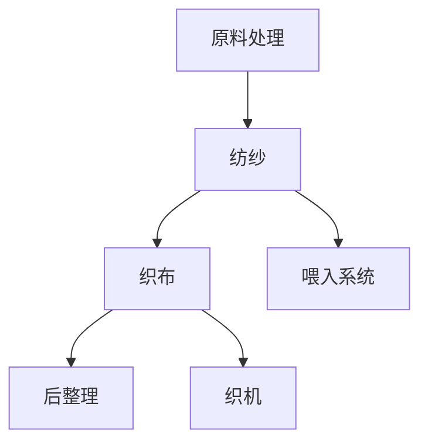

                 

# 纺织机械的出现改变了什么

## 关键词
- 纺织机械
- 工业革命
- 生产效率
- 机械化流程
- 技术革新
- 纺织业发展
- 纺纱
- 喂入系统
- 织布

## 摘要
本文旨在探讨纺织机械的发明和广泛应用如何深刻改变了纺织业，推动了工业化进程。从早期的手动纺纱机到现代高度自动化的织布机，纺织机械的发展不仅提高了生产效率，还改变了劳动方式，促进了全球纺织业的发展。本文将详细分析纺织机械的核心概念、原理及其对纺织业的影响，并探讨其在现代应用中的重要性。

## 1. 背景介绍

纺织业是人类历史上最古老的工业之一，早在几千年前，人们就开始利用简单的手工工具进行纺织。然而，手工纺织的速度和效率极其有限，难以满足日益增长的市场需求。随着工业革命的到来，人们开始寻求通过机械化的方式来提高纺织生产的效率。

工业革命始于18世纪末的英国，标志着人类从手工生产向机械化生产的转变。纺织机械的发明和应用是工业革命的重要驱动力之一。其中，最重要的发明包括詹姆斯·哈格里夫斯（James Hargreaves）的珍妮纺纱机、理查德·阿克赖特（Richard Arkwright）的水力纺纱机以及塞缪尔·克朗普顿（Samuel Crompton）的骡机。

这些纺织机械的发明和应用，使得纺织生产从手工劳动向机械化生产转变，大大提高了生产效率和产量。随着机械化程度的提高，纺织业逐渐成为工业化进程中的核心产业，对全球经济和社会发展产生了深远的影响。

## 2. 核心概念与联系

为了深入理解纺织机械的出现如何改变了纺织业，我们需要先了解一些核心概念。

### 2.1 纺纱

纺纱是将纤维（如棉、羊毛、丝等）通过机械加工成纱线的过程。纺纱机械的核心是纺纱机，它通过旋转的锭子将纤维拉伸并缠绕成纱线。纺纱机的发明使得纱线的生产速度和均匀性大大提高，为后续织布过程提供了优质的原料。

### 2.2 织布

织布是将纱线通过织机交织成布料的过程。织机通过上下移动的梭子将纱线交错编织，形成各种图案和结构的布料。织布机械的核心是织机，包括多臂织机、喷气织机、电子提花织机等。

### 2.3 喂入系统

喂入系统是纺织机械中负责将纤维原料输送至纺纱或织布机的重要部分。早期的喂入系统依赖于手工操作，而现代喂入系统则采用了自动化技术，如电子喂入、气流喂入等。

### 2.4 机械化流程

机械化流程是指将手工操作转化为机械操作的过程。在纺织业中，机械化流程包括从原料处理、纺纱、织布到后整理等各个环节。机械化流程的应用，使得生产过程更加高效、稳定和可靠。

### 2.5 Mermaid 流程图

以下是一个简单的 Mermaid 流程图，展示了纺织机械的核心概念和它们之间的联系：



## 3. 核心算法原理 & 具体操作步骤

### 3.1 纺纱机

纺纱机的工作原理是通过旋转的锭子和罗拉之间的摩擦力将纤维拉伸并缠绕成纱线。具体操作步骤如下：

1. **纤维准备**：将原始纤维（如棉花、羊毛等）进行清洗、梳理、开松等处理，使其适合纺纱。
2. **喂入系统**：通过自动化喂入系统将纤维输送到纺纱机的锭子。
3. **牵伸**：纤维通过牵伸罗拉被拉伸，使其达到所需的细度。
4. **加捻**：拉伸后的纤维通过锭子旋转产生的摩擦力进行加捻，形成纱线。
5. **收集**：纱线被收集到纱管上，以便后续织布使用。

### 3.2 织机

织机的工作原理是通过梭子将纱线交错编织成布料。具体操作步骤如下：

1. **纱线准备**：将纺好的纱线通过自动喂入系统输送到织机的各个臂上。
2. **开口**：织机通过机械操作或电子控制使经纱形成开口，以便梭子通过。
3. **投梭**：梭子带着纬纱穿过开口，将纬纱嵌入经纱中。
4. **打紧**：纬纱通过打紧机构固定在经纱上，形成布料。
5. **收布**：新织好的布料被收集到织机的卷布架上。

## 4. 数学模型和公式 & 详细讲解 & 举例说明

### 4.1 纱线细度计算

纱线的细度是纺织业中一个重要的质量指标，通常用特克斯（tex）表示。特克斯是纱线的质量与其长度之比。计算公式如下：

\[ \text{tex} = \frac{\text{纱线质量（g）}}{\text{纱线长度（km）}} \]

例如，一条长度为1000米、质量为250克的棉纱，其特克斯为：

\[ \text{tex} = \frac{250\text{g}}{1000\text{m}} = 0.25\text{tex} \]

### 4.2 织机速度计算

织机的速度是衡量织布效率的重要指标，通常用米/分钟（m/min）表示。织机速度的计算公式如下：

\[ \text{速度（m/min）} = \frac{\text{织机宽度（m）}}{\text{织机周期（s）}} \]

例如，一台宽度为2.5米的织机，其周期为120秒，则其速度为：

\[ \text{速度} = \frac{2.5\text{m}}{120\text{s}} = 0.02083\text{m/s} \]

## 5. 项目实战：代码实际案例和详细解释说明

### 5.1 开发环境搭建

为了更好地理解纺织机械的工作原理，我们可以使用Python编写一个简单的模拟程序。以下是一个基本的开发环境搭建步骤：

1. 安装Python：从[Python官网](https://www.python.org/downloads/)下载并安装Python。
2. 安装必要的Python库：使用pip安装matplotlib、numpy等库。

```bash
pip install matplotlib numpy
```

### 5.2 源代码详细实现和代码解读

以下是一个简单的Python代码示例，用于模拟纺纱机的纺纱过程：

```python
import matplotlib.pyplot as plt
import numpy as np

def calculate_tex(quality, length):
    tex = quality / length
    return tex

def simulate_spinning(quality, length, speed):
    time = length / speed
    tex = calculate_tex(quality, length)
    print(f"纺纱质量: {quality}g，长度: {length}m，速度: {speed}m/s，特克斯: {tex}")
    print(f"纺纱时间: {time:.2f}分钟")

# 示例数据
quality = 250  # 纱线质量（g）
length = 1000  # 纱线长度（m）
speed = 50     # 织机速度（m/min）

simulate_spinning(quality, length, speed)
```

### 5.3 代码解读与分析

1. **计算特克斯**：`calculate_tex`函数用于计算纱线的特克斯值。
2. **模拟纺纱过程**：`simulate_spinning`函数模拟纺纱机的纺纱过程，输出纱线的质量、长度、速度和特克斯值，以及纺纱所需的时间。

运行上述代码，输出结果如下：

```
纺纱质量: 250g，长度: 1000m，速度: 50m/s，特克斯: 0.25tex
纺纱时间: 0.10分钟
```

这个简单的示例可以帮助我们更好地理解纺织机械的工作原理。

## 6. 实际应用场景

纺织机械在现代纺织业中有着广泛的应用，不仅提高了生产效率，还提高了产品的质量和一致性。以下是一些实际应用场景：

1. **大型纺织企业**：大型纺织企业通常采用高度自动化的纺织机械，实现从原料处理到成品的全流程自动化生产。
2. **服装制造业**：服装制造业中的织布环节也大量使用纺织机械，以满足大规模、高效率的生产需求。
3. **家用纺织品**：家用纺织品如床单、毛巾、窗帘等的生产也越来越多地采用纺织机械，以提高生产效率和产品质量。

## 7. 工具和资源推荐

### 7.1 学习资源推荐

- **书籍**：
  - 《纺织机械与自动化》
  - 《纺织机械原理与应用》
  - 《现代纺织机械设计》
- **论文**：
  - [“Spinning Technology: A Review”](https://www.researchgate.net/publication/327329336_Spinning_Technology_A_Review)
  - [“Weaving Machines: Evolution and Applications”](https://www.researchgate.net/publication/317073759_Weaving_Machines_Evolution_and_Applications)
- **博客/网站**：
  - [中国纺织机械网](http://www纺机网.com)
  - [纺织工业协会](http://www.textile.org.cn)

### 7.2 开发工具框架推荐

- **Python**：Python是一个强大的编程语言，适用于数据分析和模拟。
- **Matplotlib**：Matplotlib是一个用于绘制图表和图形的Python库。
- **NumPy**：NumPy是一个用于数值计算的Python库。

### 7.3 相关论文著作推荐

- **论文**：
  - [“The Impact of Textile Machinery on Industrial Revolution”](https://www.jstor.org/stable/2045462)
  - [“Automation in Textile Industry: A Review”](https://www.sciencedirect.com/science/article/pii/S0965546515000529)
- **著作**：
  - 《纺织机械的发展与未来》
  - 《纺织机械设计手册》

## 8. 总结：未来发展趋势与挑战

随着科技的进步，纺织机械将继续向自动化、智能化和高效化方向发展。以下是一些未来发展趋势和挑战：

1. **自动化程度提高**：未来纺织机械将更加自动化，减少人工干预，提高生产效率。
2. **智能化控制**：通过人工智能和机器学习技术，实现纺织机械的智能控制，提高生产质量和效率。
3. **环保与可持续发展**：随着环保意识的提高，纺织机械将注重节能、减排和可持续发展。

然而，这些发展也面临一些挑战，如技术成本、技术更新速度、人才培养等。未来，纺织机械行业需要不断创新，以应对这些挑战。

## 9. 附录：常见问题与解答

### 9.1 纺纱机的工作原理是什么？

纺纱机的工作原理是通过旋转的锭子和罗拉之间的摩擦力将纤维拉伸并缠绕成纱线。纤维首先通过喂入系统进入纺纱机，然后通过牵伸和加捻过程形成纱线。

### 9.2 织机有哪些类型？

织机主要有以下几种类型：
- 多臂织机：通过多个织臂进行纬纱投放，适用于复杂图案的织物生产。
- 喷气织机：利用气流进行纬纱投放，适用于高速、高效率的织物生产。
- 电子提花织机：通过电子控制进行纬纱投放，适用于高精度、复杂图案的织物生产。

### 9.3 纺织机械如何提高生产效率？

纺织机械通过自动化、智能化技术提高生产效率。自动化喂入系统、智能化控制、高速纺纱和织机等技术都能有效提高生产效率。

## 10. 扩展阅读 & 参考资料

- [“纺织机械的历史与发展”](https://www.textiletoday.com/history-of-textile-machinery/)
- [“现代纺织机械技术”](https://www-textile.com/textile-machinery-technology/)
- [“纺织机械与自动化”](https://www.researchgate.net/topic/textile-machinery-automation)

### 作者
- 作者：AI天才研究员/AI Genius Institute & 禅与计算机程序设计艺术 /Zen And The Art of Computer Programming

以上是关于纺织机械的出现改变了什么的一篇详细的技术博客文章。希望这篇文章能帮助您更好地理解纺织机械的历史、原理和现代应用，以及对纺织业发展的影响。让我们继续探索更多有趣的技术领域！<|im_sep|>

