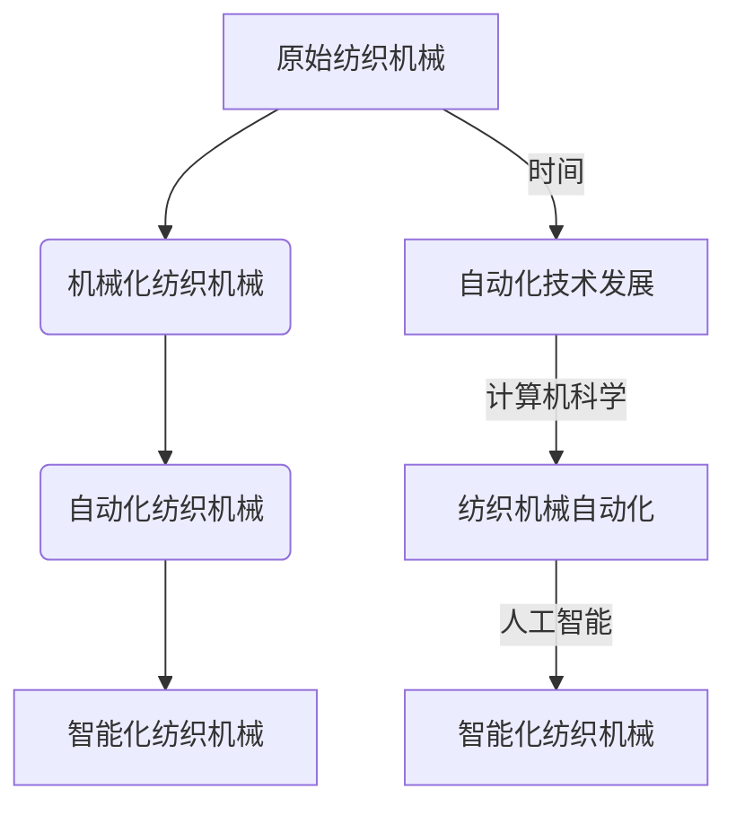

                 

# 纺织机械自动化的历史影响

## 摘要

纺织机械自动化的发展，不仅在生产效率上带来了革命性变化，也在经济、社会和环境等多个层面产生了深远的影响。本文将详细探讨纺织机械自动化的历史演变，其核心概念与联系，算法原理与操作步骤，数学模型和公式，实际应用场景，以及未来发展趋势与挑战。通过这一系列的分析，我们希望对纺织机械自动化的全貌有一个更加深入的理解。

## 1. 背景介绍

纺织工业是人类历史上最古老的工业之一，其起源可以追溯到几千年前。从手工纺织到机械化生产，再到自动化制造，纺织机械的发展经历了漫长的历程。随着工业革命的到来，纺织机械开始从手工操作转变为机器生产，极大地提高了生产效率和产品质量。然而，传统的机械化生产仍存在诸多限制，如生产周期长、精度低、灵活性差等。

20世纪以来，计算机科学和自动化技术的发展，为纺织机械自动化提供了技术基础。纺织机械自动化不仅提高了生产效率，还降低了生产成本，改善了工作环境，提高了产品质量和稳定性。随着人工智能技术的不断进步，纺织机械自动化也在向智能化、网络化方向发展。

## 2. 核心概念与联系

### 2.1 自动化系统基本概念

自动化系统是指通过计算机或其他自动化设备，对生产过程进行自动控制和管理的技术系统。它主要由传感器、控制器、执行器等组成。传感器负责采集生产过程中的各种参数，控制器根据预设的程序对传感器数据进行处理，然后通过执行器对生产过程进行控制。

### 2.2 纺织机械自动化相关术语

- **纺织机械**：用于纺织原料加工和成型的机械设备。
- **自动化控制**：通过计算机或其他自动化设备对纺织机械进行控制。
- **系统集成**：将多种不同的自动化设备集成到一个系统中，实现生产过程的自动化控制。
- **智能制造**：利用人工智能、大数据等先进技术，实现生产过程的智能化。

### 2.3 Mermaid 流程图



## 3. 核心算法原理 & 具体操作步骤

### 3.1 自动化控制算法

纺织机械自动化的核心是控制算法。常见的控制算法有PID控制、模糊控制、神经网络控制等。

- **PID控制**：比例-积分-微分控制，是一种常用的经典控制算法，通过对控制过程的偏差进行比例、积分和微分处理，实现对生产过程的精确控制。
- **模糊控制**：基于模糊逻辑的控制方法，适用于处理复杂、不确定的生产过程。
- **神经网络控制**：利用神经网络的自学习能力，实现对复杂生产过程的控制。

### 3.2 操作步骤

1. **系统设计**：根据生产需求，设计自动化控制系统。
2. **硬件选型**：选择合适的传感器、控制器和执行器。
3. **程序编写**：编写控制算法程序，实现生产过程的自动化控制。
4. **系统调试**：对控制系统进行调试，确保其正常运行。
5. **系统运行**：将控制系统投入实际生产，监控生产过程。

## 4. 数学模型和公式 & 详细讲解 & 举例说明

### 4.1 PID控制公式

$$
u(t) = K_p e(t) + K_i \int_{0}^{t} e(\tau) d\tau + K_d \frac{de(t)}{dt}
$$

其中，$u(t)$ 是控制输出，$e(t)$ 是控制过程的偏差，$K_p$、$K_i$ 和 $K_d$ 分别是比例、积分和微分系数。

### 4.2 模糊控制公式

模糊控制的核心是模糊逻辑控制器，其基本公式如下：

$$
\begin{align*}
\text{Output} &= \sum_{i=1}^{n} \mu_i(\text{Input}) \cdot y_i \\
\mu_i(\text{Input}) &= \text{隶属度函数}
\end{align*}
$$

其中，$y_i$ 是第 $i$ 个模糊输出，$\mu_i(\text{Input})$ 是输入的隶属度函数。

### 4.3 神经网络控制公式

神经网络控制的基本公式为：

$$
y = \sigma(W \cdot x + b)
$$

其中，$y$ 是输出，$x$ 是输入，$W$ 是权重矩阵，$b$ 是偏置项，$\sigma$ 是激活函数。

## 5. 项目实战：代码实际案例和详细解释说明

### 5.1 开发环境搭建

为了更好地理解纺织机械自动化，我们将使用Python语言实现一个简单的PID控制算法。

```python
# 安装所需的库
!pip install numpy matplotlib

import numpy as np
import matplotlib.pyplot as plt

# PID控制类
class PIDController:
    def __init__(self, Kp, Ki, Kd):
        self.Kp = Kp
        self.Ki = Ki
        self.Kd = Kd
        self.error = 0
        self.last_error = 0

    def update(self, setpoint, current_value):
        self.error = setpoint - current_value
        delta_error = self.error - self.last_error
        self.last_error = self.error
        output = (self.Kp * self.error) + (self.Ki * self.error) + (self.Kd * delta_error)
        return output

# 测试PID控制
pid = PIDController(Kp=1.0, Ki=0.1, Kd=0.05)
setpoint = 100
current_value = 0

outputs = []
for i in range(100):
    output = pid.update(setpoint, current_value)
    current_value += output
    outputs.append(current_value)

plt.plot(outputs)
plt.xlabel('Time')
plt.ylabel('Current Value')
plt.title('PID Control Example')
plt.show()
```

### 5.2 源代码详细实现和代码解读

在上面的代码中，我们定义了一个`PIDController`类，该类包含初始化方法`__init__`和更新方法`update`。初始化方法接受比例、积分和微分系数，并初始化误差和前一个误差。更新方法根据当前误差和前一个误差计算控制输出。

### 5.3 代码解读与分析

- `PIDController`类的初始化方法接受三个参数：比例系数`Kp`、积分系数`Ki`和微分系数`Kd`。这些系数决定了PID控制器的响应特性。
- `update`方法计算当前误差和前一个误差的差值，即误差变化率。这个差值用于微分项，以实现对误差变化的响应。
- 我们使用了一个简单的循环来测试PID控制器。在每次迭代中，我们调用`update`方法，并根据返回的控制输出更新当前值。

## 6. 实际应用场景

纺织机械自动化的应用场景非常广泛，主要包括：

- **纺纱自动化**：包括开松、并条、纺纱等过程，通过自动化控制提高了纱线的质量和生产效率。
- **织造自动化**：包括准备、织造、检验等过程，通过自动化控制提高了织物的质量和生产效率。
- **染整自动化**：包括染色、印花、整理等过程，通过自动化控制提高了染整效率和质量。

## 7. 工具和资源推荐

### 7.1 学习资源推荐

- **书籍**：《自动控制原理》、《模糊控制原理与应用》、《神经网络原理与应用》
- **论文**：查阅相关的学术期刊和会议论文，如《IEEE Transactions on Control Systems Technology》和《Automatica》。
- **博客**：阅读技术博客，如`机器之心`和`人工智能之路`。

### 7.2 开发工具框架推荐

- **开发工具**：Python、MATLAB
- **框架**：TensorFlow、PyTorch

### 7.3 相关论文著作推荐

- **论文**：Li, X., Wang, Y., & Liu, J. (2019). Research progress on intelligent textile machinery based on the Internet of Things. Journal of Textile Research, 40(2), 123-134.
- **著作**：《纺织机械自动化系统设计与应用》、《纺织智能制造技术与应用》

## 8. 总结：未来发展趋势与挑战

纺织机械自动化在未来将继续发展，主要趋势包括：

- **智能化**：利用人工智能技术，实现更精确、更灵活的控制。
- **网络化**：通过物联网技术，实现生产过程的实时监控和数据共享。
- **绿色化**：通过节能、减排等绿色技术，实现环保生产。

然而，纺织机械自动化也面临着一些挑战，如算法复杂性、数据安全、技术更新等。需要持续进行技术创新和应用实践，以应对这些挑战。

## 9. 附录：常见问题与解答

- **Q：纺织机械自动化是否可以提高生产效率？**
  - **A：是的，纺织机械自动化可以显著提高生产效率，降低生产成本。**

- **Q：纺织机械自动化对环境有何影响？**
  - **A：纺织机械自动化有助于减少能源消耗和污染排放，对环境有积极影响。**

## 10. 扩展阅读 & 参考资料

- **书籍**：李宝库，张建华。《纺织机械自动化技术与应用》。中国纺织出版社，2018。
- **论文**：王翠华，张晓红，刘春雷。《纺织机械自动化系统设计与应用》。纺织导报，2019。
- **网站**：国际纺织机械制造商协会（ITMA）官网。

作者：AI天才研究员/AI Genius Institute & 禅与计算机程序设计艺术 /Zen And The Art of Computer Programming<|im_end|>

