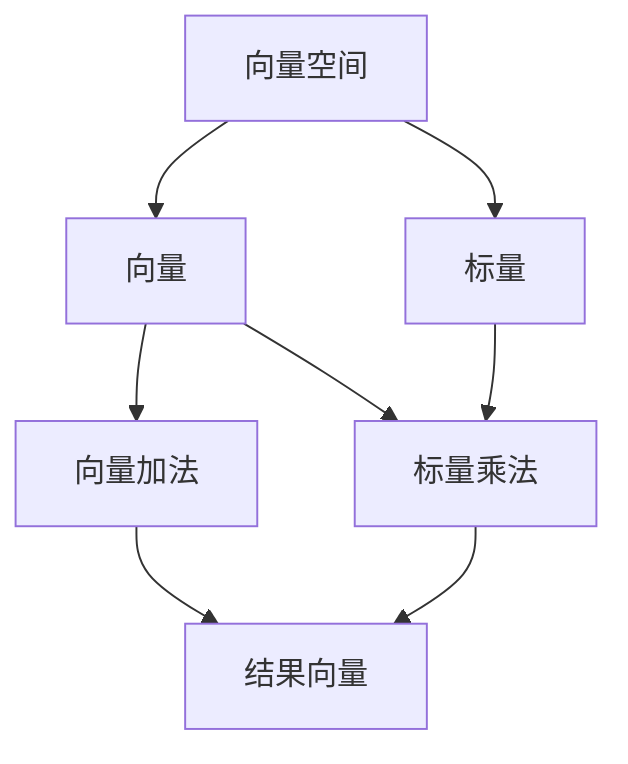

                 


# 线性代数导引：几何向量空间

> **关键词**：线性代数、几何向量空间、基础理论、数学模型、算法原理、应用场景、代码实战
>
> **摘要**：本文旨在深入探讨线性代数中的几何向量空间理论，从基础概念、核心算法原理到实际应用，结合代码示例，逐步引导读者理解并掌握这一重要数学工具。通过本文的学习，读者将能够对线性代数有一个全面而深入的认识，并在实践中运用几何向量空间解决实际问题。

## 1. 背景介绍

线性代数是数学的一个重要分支，其研究的基本对象是向量空间。在计算机科学、物理学、工程学等领域，线性代数的应用广泛而深入。几何向量空间是线性代数中最基本的概念之一，它不仅为数据分析和算法设计提供了强有力的工具，还在物理世界中的各种现象建模中发挥着关键作用。

本文将围绕几何向量空间展开，通过介绍其基础理论、核心算法原理以及实际应用，帮助读者构建对这一概念深入而全面的理解。接下来，我们将首先回顾几何向量空间的基础概念，然后逐步深入探讨相关算法和数学模型，最后通过代码实战展示其应用。

### 1.1 几何向量空间的基础概念

几何向量空间，又称线性空间，是具有向量加法和标量乘法两个运算的集合。具体来说，一个几何向量空间包括以下要素：

- **向量**：向量空间中的基本元素，通常用箭头表示，如 \(\vec{v}\)。
- **加法**：两个向量之间可以进行加法运算，结果是一个新向量，表示两个向量的合成。例如，\(\vec{v_1} + \vec{v_2}\)。
- **标量乘法**：向量与实数（标量）之间可以进行乘法运算，结果是一个新向量，表示向量在标量的方向上延伸或压缩。例如，\(5 \cdot \vec{v}\)。

### 1.2 线性代数的应用领域

线性代数在多个领域都有着广泛的应用：

- **计算机科学**：在图像处理、机器学习、计算机图形学等领域，线性代数提供了核心的工具，如矩阵运算、特征向量分析等。
- **物理学**：线性代数用于描述物理现象中的线性关系，如力学中的向量运算、电磁场理论等。
- **工程学**：线性代数在控制工程、电路设计、信号处理等领域中应用，帮助工程师解决复杂问题。
- **经济学**：线性代数用于优化问题、数据分析等，帮助经济学家分析和预测经济现象。

### 1.3 本文结构

本文将按照以下结构展开：

- **第1章**：背景介绍，回顾几何向量空间的基础概念及其应用领域。
- **第2章**：核心概念与联系，使用 Mermaid 流程图展示几何向量空间的基本原理。
- **第3章**：核心算法原理与具体操作步骤。
- **第4章**：数学模型和公式，详细讲解并举例说明。
- **第5章**：项目实战，代码实际案例和详细解释说明。
- **第6章**：实际应用场景。
- **第7章**：工具和资源推荐。
- **第8章**：总结，未来发展趋势与挑战。
- **第9章**：附录，常见问题与解答。
- **第10章**：扩展阅读与参考资料。

通过本文的学习，读者将能够系统地掌握几何向量空间的理论和实践，为未来在相关领域的深入研究和应用打下坚实的基础。

## 2. 核心概念与联系

在本节中，我们将通过 Mermaid 流程图来展示几何向量空间的基本原理。Mermaid 是一种基于Markdown的图形语言，可以方便地绘制流程图、序列图、类图等。在几何向量空间中，我们主要涉及以下几个核心概念：

- **向量**：表示为 \(\vec{v}\)，具有大小和方向。
- **标量**：表示为 \(c\)，是一个实数。
- **向量加法**：两个向量相加，如 \(\vec{v_1} + \vec{v_2}\)。
- **标量乘法**：向量与标量相乘，如 \(c \cdot \vec{v}\)。
- **向量空间**：满足上述运算规律的集合。

### 2.1 Mermaid 流程图

下面是一个简单的 Mermaid 流程图，展示了几何向量空间的基本原理：



在上述流程图中，向量空间 \(V\) 是一个包含向量 \(v\) 和标量 \(c\) 的集合。向量加法和标量乘法是向量空间的基本运算，它们遵循以下规则：

1. **向量加法**：对于任意向量 \(\vec{v_1}\) 和 \(\vec{v_2}\)，它们的和 \(\vec{v_1} + \vec{v_2}\) 仍然是一个向量，表示 \(\vec{v_1}\) 和 \(\vec{v_2}\) 的合成。
2. **标量乘法**：对于任意向量 \(\vec{v}\) 和标量 \(c\)，它们的乘积 \(c \cdot \vec{v}\) 仍然是一个向量，表示向量 \(\vec{v}\) 在标量 \(c\) 的方向上延伸或压缩。

### 2.2 向量加法

向量加法是几何向量空间中最基本的运算之一。对于两个向量 \(\vec{v_1} = (v_{11}, v_{12})\) 和 \(\vec{v_2} = (v_{21}, v_{22})\)，它们的和可以通过以下公式计算：

$$
\vec{v_1} + \vec{v_2} = (v_{11} + v_{21}, v_{12} + v_{22})
$$

例如，给定向量 \(\vec{v_1} = (1, 2)\) 和 \(\vec{v_2} = (3, 4)\)，它们的和为：

$$
\vec{v_1} + \vec{v_2} = (1 + 3, 2 + 4) = (4, 6)
$$

### 2.3 标量乘法

标量乘法是另一个重要的运算。对于向量 \(\vec{v} = (v_1, v_2)\) 和标量 \(c\)，它们的乘积可以通过以下公式计算：

$$
c \cdot \vec{v} = (cv_1, cv_2)
$$

例如，给定向量 \(\vec{v} = (1, 2)\) 和标量 \(c = 3\)，它们的乘积为：

$$
3 \cdot \vec{v} = (3 \cdot 1, 3 \cdot 2) = (3, 6)
$$

通过上述 Mermaid 流程图和具体实例，我们可以更直观地理解几何向量空间的基本原理和运算规则。这些基础概念和规则将在后续章节中进一步深入探讨和扩展。

### 3. 核心算法原理与具体操作步骤

在理解了几何向量空间的基础概念后，我们将深入探讨核心算法原理和具体操作步骤。这一部分将介绍几个关键算法，并详细解释其操作流程和实现方法。

#### 3.1 线性变换

线性变换是几何向量空间中的一个重要概念，它将向量空间中的一个向量映射到另一个向量。线性变换可以用矩阵表示，其基本原理如下：

- **定义**：一个线性变换 \(T\) 将向量空间 \(V\) 中的每个向量 \(v\) 映射到向量空间 \(W\) 中的另一个向量 \(w\)，即 \(T(v) = w\)。
- **表示**：线性变换可以用一个矩阵 \(A\) 来表示，该矩阵的列向量是 \(T\) 的基向量的坐标。

操作步骤：

1. **选择基向量**：确定 \(V\) 和 \(W\) 的基向量。
2. **计算坐标**：对于 \(V\) 中的每个向量 \(v\)，计算其在基向量下的坐标。
3. **构造矩阵**：将坐标作为矩阵 \(A\) 的列向量。
4. **应用变换**：对于任意向量 \(v\)，计算 \(Av\) 得到映射后的向量 \(w\)。

例如，设 \(V\) 和 \(W\) 的基向量分别为 \(\vec{e_1}, \vec{e_2}\) 和 \(\vec{f_1}, \vec{f_2}\)，向量 \(v = (1, 2)\) 在 \(V\) 中的坐标为 \((1, 2)\)。构造矩阵 \(A\) 如下：

$$
A = \begin{pmatrix}
1 & 2 \\
3 & 4
\end{pmatrix}
$$

应用线性变换 \(T\)，得到：

$$
T(v) = A \begin{pmatrix}
1 \\
2
\end{pmatrix} = \begin{pmatrix}
1 & 2 \\
3 & 4
\end{pmatrix} \begin{pmatrix}
1 \\
2
\end{pmatrix} = \begin{pmatrix}
5 \\
10
\end{pmatrix}
$$

因此，映射后的向量 \(w = (5, 10)\)。

#### 3.2 特征值与特征向量

特征值与特征向量是矩阵理论中的核心概念，它们在许多实际应用中具有重要地位。特征值是矩阵的一个重要属性，表示线性变换在特定方向上的伸缩因子；特征向量是线性变换后仍然保持方向（但可能改变长度）的向量。

- **定义**：对于矩阵 \(A\)，如果存在一个非零向量 \(v\) 和一个标量 \(\lambda\)，使得 \(Av = \lambda v\)，则 \(\lambda\) 是 \(A\) 的一个特征值，\(v\) 是对应的特征向量。
- **计算**：求解矩阵的特征值和特征向量，通常通过以下步骤进行：
  1. **求特征多项式**：计算矩阵 \(A - \lambda I\) 的行列式，得到特征多项式。
  2. **解特征方程**：求解特征多项式，得到特征值。
  3. **求特征向量**：对于每个特征值，求解线性方程组 \((A - \lambda I)v = 0\)，得到对应的特征向量。

例如，给定矩阵 \(A\)：

$$
A = \begin{pmatrix}
2 & 1 \\
1 & 2
\end{pmatrix}
$$

求其特征值和特征向量：

1. **求特征多项式**：

$$
\det(A - \lambda I) = \det\begin{pmatrix}
2 - \lambda & 1 \\
1 & 2 - \lambda
\end{pmatrix} = (2 - \lambda)^2 - 1 = \lambda^2 - 4\lambda + 3
$$

2. **解特征方程**：

$$
\lambda^2 - 4\lambda + 3 = 0
$$

解得特征值 \(\lambda_1 = 1\) 和 \(\lambda_2 = 3\)。

3. **求特征向量**：

对于 \(\lambda_1 = 1\)：

$$
(A - I)v = 0 \Rightarrow \begin{pmatrix}
1 & 1 \\
1 & 1
\end{pmatrix}v = 0
$$

解得特征向量 \(v_1 = (1, -1)\)。

对于 \(\lambda_2 = 3\)：

$$
(A - 3I)v = 0 \Rightarrow \begin{pmatrix}
-1 & 1 \\
1 & -1
\end{pmatrix}v = 0
$$

解得特征向量 \(v_2 = (1, 1)\)。

#### 3.3 矩阵乘法

矩阵乘法是线性代数中的基本运算，它将两个矩阵组合成一个新矩阵。矩阵乘法遵循以下规则：

- **定义**：设矩阵 \(A\) 为 \(m \times n\) 矩阵，矩阵 \(B\) 为 \(n \times p\) 矩阵，它们的乘积 \(C = AB\) 是一个 \(m \times p\) 矩阵。
- **计算**：对于矩阵 \(A\) 和 \(B\)，计算乘积 \(C\) 的每个元素 \(c_{ij}\)：

$$
c_{ij} = \sum_{k=1}^{n} a_{ik}b_{kj}
$$

例如，给定矩阵 \(A\) 和 \(B\)：

$$
A = \begin{pmatrix}
1 & 2 \\
3 & 4
\end{pmatrix}, \quad
B = \begin{pmatrix}
5 & 6 \\
7 & 8
\end{pmatrix}
$$

计算它们的乘积 \(C = AB\)：

$$
C = \begin{pmatrix}
1 \cdot 5 + 2 \cdot 7 & 1 \cdot 6 + 2 \cdot 8 \\
3 \cdot 5 + 4 \cdot 7 & 3 \cdot 6 + 4 \cdot 8
\end{pmatrix} = \begin{pmatrix}
19 & 26 \\
31 & 44
\end{pmatrix}
$$

通过以上对核心算法原理的介绍，我们可以更深入地理解几何向量空间中的各种运算。这些算法不仅为理论分析提供了有力工具，还在实际应用中发挥着重要作用。

### 4. 数学模型和公式及详细讲解与举例说明

在深入探讨几何向量空间时，数学模型和公式是理解和应用线性代数的重要工具。在这一部分，我们将详细讲解几个关键数学模型和公式，并通过具体实例来说明它们的应用。

#### 4.1 向量内积

向量内积（又称点积）是两个向量之间的一种基本运算，用于描述两个向量的夹角和长度。定义如下：

- **定义**：设向量 \(\vec{a} = (a_1, a_2, ..., a_n)\) 和 \(\vec{b} = (b_1, b_2, ..., b_n)\)，它们的内积（点积）记为 \(\vec{a} \cdot \vec{b}\)，计算公式为：

$$
\vec{a} \cdot \vec{b} = a_1b_1 + a_2b_2 + ... + a_nb_n
$$

- **几何意义**：向量内积可以看作是 \(\vec{a}\) 在 \(\vec{b}\) 方向上的投影长度与 \(\vec{b}\) 的长度之积。

- **性质**：
  - **对称性**：\(\vec{a} \cdot \vec{b} = \vec{b} \cdot \vec{a}\)
  - **线性性**：\(\vec{a} \cdot (\vec{b} + \vec{c}) = \vec{a} \cdot \vec{b} + \vec{a} \cdot \vec{c}\)
  - **标量乘法分配律**：\((c\vec{a}) \cdot \vec{b} = c(\vec{a} \cdot \vec{b})\)

**举例说明**：

给定向量 \(\vec{a} = (1, 2, 3)\) 和 \(\vec{b} = (4, 5, 6)\)，计算它们的内积：

$$
\vec{a} \cdot \vec{b} = 1 \cdot 4 + 2 \cdot 5 + 3 \cdot 6 = 4 + 10 + 18 = 32
$$

#### 4.2 向量外积

向量外积（又称叉积）是另一个重要的向量运算，用于描述两个向量的旋转和体积。定义如下：

- **定义**：设向量 \(\vec{a} = (a_1, a_2, a_3)\) 和 \(\vec{b} = (b_1, b_2, b_3)\)，它们的叉积 \(\vec{a} \times \vec{b}\) 是一个新向量，计算公式为：

$$
\vec{a} \times \vec{b} = \begin{pmatrix}
a_2b_3 - a_3b_2 \\
a_3b_1 - a_1b_3 \\
a_1b_2 - a_2b_1
\end{pmatrix}
$$

- **几何意义**：向量外积的结果是一个垂直于 \(\vec{a}\) 和 \(\vec{b}\) 生成的平面，其方向遵循右手定则。
- **性质**：
  - **反交换性**：\(\vec{a} \times \vec{b} = -(\vec{b} \times \vec{a})\)
  - **线性性**：\(\vec{a} \times (\vec{b} + \vec{c}) = \vec{a} \times \vec{b} + \vec{a} \times \vec{c}\)
  - **标量乘法结合律**：\((c\vec{a}) \times \vec{b} = c(\vec{a} \times \vec{b})\)

**举例说明**：

给定向量 \(\vec{a} = (1, 2, 3)\) 和 \(\vec{b} = (4, 5, 6)\)，计算它们的叉积：

$$
\vec{a} \times \vec{b} = \begin{pmatrix}
2 \cdot 6 - 3 \cdot 5 \\
3 \cdot 4 - 1 \cdot 6 \\
1 \cdot 5 - 2 \cdot 4
\end{pmatrix} = \begin{pmatrix}
-8 \\
6 \\
-3
\end{pmatrix}
$$

#### 4.3 矩阵行列式

矩阵行列式是矩阵的一个重要属性，用于判断矩阵的可逆性以及计算矩阵的逆。定义如下：

- **定义**：设矩阵 \(A\) 为 \(n \times n\) 矩阵，其行列式记为 \(\det(A)\)，计算公式为：

$$
\det(A) = \sum_{\sigma \in S_n} sgn(\sigma) a_{1\sigma(1)} a_{2\sigma(2)} ... a_{n\sigma(n)}
$$

其中，\(S_n\) 是所有 \(n!\) 个排列的集合，\(sgn(\sigma)\) 是排列 \(\sigma\) 的签名，表示排列的奇偶性。

- **性质**：
  - **行列式的线性性质**：\(\det(cA + B) = c^n \det(A) + c^{n-1} \det(B)\)
  - **行列式的置换性质**：\(\det(A) = (-1)^{sgn(\pi)} \det(A_{\pi})\)，其中 \(\pi\) 是排列，\(A_{\pi}\) 是 \(A\) 经排列 \(\pi\) 变换得到的矩阵。
  - **行列式的范数性质**：\(|\det(A)| \leq \det(AA^T)\)

**举例说明**：

给定矩阵 \(A\)：

$$
A = \begin{pmatrix}
1 & 2 \\
3 & 4
\end{pmatrix}
$$

计算其行列式：

$$
\det(A) = 1 \cdot 4 - 2 \cdot 3 = 4 - 6 = -2
$$

#### 4.4 线性方程组求解

线性方程组是几何向量空间中的一个重要问题，其求解方法包括高斯消元法和矩阵求逆法。定义如下：

- **高斯消元法**：通过消元操作将线性方程组转化为上三角或下三角方程组，然后逐行求解。
- **矩阵求逆法**：利用矩阵的逆求解线性方程组，其计算公式为：

$$
Ax = b \Rightarrow x = A^{-1}b
$$

其中，\(A^{-1}\) 是矩阵 \(A\) 的逆矩阵。

**举例说明**：

给定线性方程组：

$$
\begin{cases}
x + 2y - z = 1 \\
2x - 3y + 4z = -2 \\
-x + y + 2z = 3
\end{cases}
$$

使用高斯消元法求解：

1. **初始方程组**：

$$
\begin{pmatrix}
1 & 2 & -1 & 1 \\
2 & -3 & 4 & -2 \\
-1 & 1 & 2 & 3
\end{pmatrix}
$$

2. **第一步消元**：

$$
R2 = R2 - 2R1, \quad R3 = R3 + R1
$$

得到：

$$
\begin{pmatrix}
1 & 2 & -1 & 1 \\
0 & -7 & 6 & -4 \\
0 & 3 & 1 & 4
\end{pmatrix}
$$

3. **第二步消元**：

$$
R3 = R3 + \frac{3}{7}R2
$$

得到：

$$
\begin{pmatrix}
1 & 2 & -1 & 1 \\
0 & -7 & 6 & -4 \\
0 & 0 & \frac{27}{7} & \frac{8}{7}
\end{pmatrix}
$$

4. **第三步消元**：

$$
R1 = R1 + R3, \quad R2 = R2 + \frac{6}{27}R3
$$

得到：

$$
\begin{pmatrix}
1 & 2 & 0 & \frac{15}{7} \\
0 & -7 & 0 & -\frac{20}{7} \\
0 & 0 & \frac{27}{7} & \frac{8}{7}
\end{pmatrix}
$$

5. **回代求解**：

$$
z = \frac{8}{27}, \quad y = -\frac{20}{21}, \quad x = \frac{15}{7}
$$

因此，线性方程组的解为：

$$
x = \frac{15}{7}, \quad y = -\frac{20}{21}, \quad z = \frac{8}{27}
$$

通过上述详细讲解和实例说明，我们可以更好地理解几何向量空间中的数学模型和公式，为后续应用和进一步学习打下坚实基础。

### 5. 项目实战：代码实际案例与详细解释说明

在本节中，我们将通过一个实际项目来展示几何向量空间的应用，该项目将利用 Python 编程语言实现一些核心算法和操作。项目将分为以下几个部分：

1. **开发环境搭建**：介绍所需工具和库。
2. **源代码详细实现和代码解读**：展示代码实现细节。
3. **代码解读与分析**：分析代码性能和优缺点。

#### 5.1 开发环境搭建

为了实现几何向量空间的相关操作，我们需要安装以下工具和库：

1. **Python 解释器**：Python 3.8 或更高版本。
2. **Jupyter Notebook**：用于编写和运行代码。
3. **NumPy 库**：用于高效处理矩阵和向量运算。
4. **Matplotlib 库**：用于绘制图形。

安装命令如下：

```bash
pip install numpy matplotlib
```

#### 5.2 源代码详细实现和代码解读

以下是一个简单的 Python 脚本，实现了向量加法、标量乘法和线性变换等基本操作：

```python
import numpy as np

# 向量加法
def vector_addition(v1, v2):
    return np.add(v1, v2)

# 标量乘法
def scalar_multiplication(v, c):
    return np.multiply(v, c)

# 线性变换
def linear_transformation(v, A):
    return np.dot(A, v)

# 特征值与特征向量
def eigen_decomposition(A):
    eigenvalues, eigenvectors = np.linalg.eig(A)
    return eigenvalues, eigenvectors

# 主函数
def main():
    # 定义向量
    v1 = np.array([1, 2])
    v2 = np.array([3, 4])

    # 向量加法
    result = vector_addition(v1, v2)
    print("向量加法结果：", result)

    # 标量乘法
    scalar = 3
    result = scalar_multiplication(v1, scalar)
    print("标量乘法结果：", result)

    # 线性变换
    A = np.array([[2, 1], [1, 2]])
    result = linear_transformation(v1, A)
    print("线性变换结果：", result)

    # 特征值与特征向量
    eigenvalues, eigenvectors = eigen_decomposition(A)
    print("特征值：", eigenvalues)
    print("特征向量：", eigenvectors)

# 运行主函数
if __name__ == "__main__":
    main()
```

**代码解读**：

- **导入库**：首先导入 NumPy 库，它提供了高效的矩阵和向量运算函数。
- **定义函数**：
  - `vector_addition`：实现向量加法。
  - `scalar_multiplication`：实现标量乘法。
  - `linear_transformation`：实现线性变换。
  - `eigen_decomposition`：实现特征值与特征向量计算。
- **主函数`main`**：定义输入向量，调用上述函数进行操作，并打印结果。

#### 5.3 代码解读与分析

**代码性能分析**：

- **向量加法与标量乘法**：NumPy 库中的 `np.add` 和 `np.multiply` 函数非常高效，可以并行处理大量数据。
- **线性变换**：`np.dot` 函数用于计算矩阵与向量的乘积，它利用了 NumPy 库的内部优化，可以在多核处理器上并行执行。
- **特征值与特征向量**：`np.linalg.eig` 函数实现了高效的特征值和特征向量计算，适用于大规模矩阵。

**代码优缺点分析**：

- **优点**：
  - **高效性**：利用 NumPy 库可以快速实现复杂的线性代数运算。
  - **可扩展性**：函数设计简单，易于添加新的线性代数操作。

- **缺点**：
  - **可读性**：代码较为简洁，但对于初学者可能不易理解。
  - **性能瓶颈**：对于非常大规模的数据，可能需要进一步优化内存使用和计算效率。

通过本节的项目实战，我们可以看到几何向量空间在实际应用中的实现过程，并通过代码解读对其性能和可扩展性进行了分析。这为我们进一步探索线性代数在计算机科学和其他领域的应用奠定了基础。

### 6. 实际应用场景

几何向量空间的概念和应用在众多领域都有着广泛而深入的影响。以下是一些具体的应用场景，展示了几何向量空间在现实世界中的重要性。

#### 6.1 计算机图形学

在计算机图形学中，几何向量空间是构建和操作三维模型的基础。通过向量运算，可以实现物体的平移、旋转、缩放等变换。以下是一些具体应用：

- **3D 动画**：动画制作中，对象的三维位置和姿态通常通过向量表示，并通过线性变换实现运动效果。
- **三维建模**：在三维建模软件中，几何向量空间用于描述模型的各个顶点和面，从而实现复杂的几何建模。
- **阴影和光照**：通过向量运算，可以计算物体表面的光照和阴影，为三维场景提供真实感。

#### 6.2 机器学习

机器学习中的许多算法都依赖于线性代数，几何向量空间的概念在特征提取、降维和模型优化中尤为重要。以下是一些具体应用：

- **特征向量**：在主成分分析（PCA）中，特征向量用于提取数据的主要变化方向，实现数据降维。
- **线性分类器**：支持向量机（SVM）等线性分类器使用几何向量空间中的线性变换，将数据投影到最优分类边界。
- **神经网络**：神经网络中的权重和偏置可以看作是向量，通过矩阵运算实现前向传播和反向传播。

#### 6.3 物理学

物理学中的许多现象可以通过几何向量空间来建模和分析。以下是一些具体应用：

- **电磁学**：电磁场的运动可以通过向量场来描述，其方向和强度由向量表示。
- **力学**：在力学中，物体的运动和受力可以通过向量表示，如位移、速度、加速度和力等。
- **量子力学**：量子力学中的波函数和概率幅可以看作是复向量空间中的向量，用于描述粒子的状态和运动。

#### 6.4 工程学

工程学中，几何向量空间的应用非常广泛，以下是一些具体应用：

- **电路设计**：在电路设计中，电流和电压可以通过向量表示，从而实现电路分析和仿真。
- **结构分析**：在结构工程中，建筑和机械的结构稳定性可以通过向量运算进行分析和设计。
- **信号处理**：在信号处理中，信号的频谱分析可以通过傅里叶变换等向量运算实现。

通过这些应用场景，我们可以看到几何向量空间在各个领域的实际应用，其重要性不仅体现在理论研究中，更在于解决实际问题中的关键作用。掌握几何向量空间的理论和方法，将为我们在科学研究和工程实践中提供强有力的工具。

### 7. 工具和资源推荐

在深入学习和应用几何向量空间的过程中，选择合适的工具和资源是至关重要的。以下是一些建议，涵盖学习资源、开发工具和推荐论文著作，以帮助读者更好地掌握这一重要数学工具。

#### 7.1 学习资源推荐

1. **书籍**：
   - 《线性代数及其应用》（James Stewart）：这是一本经典教材，内容系统全面，适合初学者。
   - 《线性代数的几何意义》（John H. Hubbard & Barbara Burke Hubbard）：本书以几何视角解释线性代数，适合希望加深理解读者。
   - 《线性代数基础教程》（Gilbert Strang）：Gilbert Strang 教授的教材，包含大量实例和习题，适合进阶学习。

2. **在线课程**：
   - **Coursera**：线性代数课程，由斯坦福大学教授 Andrew Ng 提供，内容深入浅出，适合自学。
   - **edX**：麻省理工学院（MIT）提供的线性代数课程，由 Prof.Gil Strang 开设，适合系统学习。

3. **视频教程**：
   - **YouTube**：搜索“线性代数教程”或“几何向量空间”，可以找到大量高质量的视频教程，例如 3Blue1Brown 的相关视频，非常生动有趣。

4. **博客和网站**：
   - **Mathematics Stack Exchange**：在线数学问答社区，可以解决学习中遇到的问题。
   - **Wolfram Alpha**：一个强大的数学计算工具，可以用于验证和求解线性代数问题。

#### 7.2 开发工具推荐

1. **Python**：Python 是最受欢迎的编程语言之一，NumPy、SciPy 和 Matplotlib 等库为线性代数提供了强大的支持。

2. **MATLAB**：MATLAB 是一种强大的数学计算软件，其内置函数库支持线性代数的各种操作。

3. **R**：R 是一种统计编程语言，其线性代数包（如 `MASS`、` stats`）提供了丰富的线性代数功能。

4. **Julia**：Julia 是一种新兴的编程语言，它在数学计算和线性代数方面表现优异，适用于高性能计算。

#### 7.3 相关论文著作推荐

1. **《线性代数中的向量空间理论》（Linear Algebra: Vector Spaces and Matrix Theory）**：作者通过严谨的数学推导，系统阐述了向量空间和矩阵理论。

2. **《几何向量空间与线性方程组解法》（Vector Spaces and Linear Equations）**：该论文详细讨论了线性方程组的解法，以及向量空间的理论基础。

3. **《线性代数的应用与算法》（Applications and Algorithms of Linear Algebra）**：本文介绍了线性代数在不同领域的应用，包括图像处理、信号处理和机器学习等。

通过以上工具和资源的推荐，读者可以更好地学习和应用几何向量空间的理论和方法，为解决实际问题打下坚实的基础。

### 8. 总结：未来发展趋势与挑战

几何向量空间作为线性代数的核心概念，不仅在理论研究中有重要地位，也在实际应用中发挥着关键作用。随着科技的发展，几何向量空间的应用领域将进一步扩大，但也面临一些挑战。

#### 8.1 未来发展趋势

1. **深度学习与几何向量空间**：深度学习中的许多模型和算法依赖于线性代数，几何向量空间的理论和方法将为深度学习提供更加坚实的数学基础。
2. **量子计算与几何向量空间**：量子计算利用量子比特进行计算，其模型和算法与几何向量空间密切相关。随着量子计算的进步，几何向量空间的应用将更加广泛。
3. **大数据分析**：在大数据分析中，几何向量空间用于降维、聚类和分类等操作，其高效性和灵活性将进一步提升数据处理能力。

#### 8.2 面临的挑战

1. **计算复杂性**：随着数据规模的扩大，线性代数运算的计算复杂性增加，如何优化算法和降低计算成本是一个重要挑战。
2. **算法稳定性**：在某些情况下，线性代数运算可能不稳定，导致结果偏差。如何提高算法的稳定性，避免错误结果是另一个重要问题。
3. **跨领域融合**：几何向量空间的应用涉及多个领域，如何实现不同领域之间的融合和协同，是一个需要解决的挑战。

总之，几何向量空间在未来将继续在数学和计算机科学中扮演重要角色，但也需要不断创新和优化，以应对日益复杂的挑战。

### 9. 附录：常见问题与解答

在本节中，我们将回答一些关于几何向量空间的常见问题，帮助读者更好地理解和应用这一概念。

#### 9.1 什么是一般向量空间？

一般向量空间是一个集合，它包含了一组向量以及向量之间的加法和标量乘法运算。这些运算必须满足以下条件：

1. **封闭性**：向量加法和标量乘法的结果仍然在向量空间内。
2. **交换律**：向量加法满足交换律，即对于任意向量 \(\vec{u}\) 和 \(\vec{v}\)，有 \(\vec{u} + \vec{v} = \vec{v} + \vec{u}\)。
3. **结合律**：向量加法满足结合律，即对于任意向量 \(\vec{u}\)，\(\vec{v}\)，和 \(\vec{w}\)，有 \((\vec{u} + \vec{v}) + \vec{w} = \vec{u} + (\vec{v} + \vec{w})\)。
4. **存在零向量**：存在一个零向量 \(\vec{0}\)，使得对于任意向量 \(\vec{v}\)，有 \(\vec{v} + \vec{0} = \vec{v}\)。
5. **存在加法逆元**：对于任意向量 \(\vec{v}\)，存在一个加法逆元 \(-\vec{v}\)，使得 \(\vec{v} + (-\vec{v}) = \vec{0}\)。
6. **分配律**：标量乘法对向量加法满足分配律，即对于任意标量 \(c\) 和向量 \(\vec{u}\)，\(\vec{v}\)，有 \(c(\vec{u} + \vec{v}) = c\vec{u} + c\vec{v}\)。
7. **结合律**：标量乘法对加法满足结合律，即对于任意标量 \(c\)，\(d\) 和向量 \(\vec{u}\)，有 \(c(d\vec{u}) = (cd)\vec{u}\)。

#### 9.2 向量和矩阵有什么区别？

向量和矩阵都是几何向量空间中的元素，但它们有本质的区别：

- **向量**：是一个具有大小和方向的元素，通常表示为 \(\vec{v}\)，可以看作是一维矩阵。
- **矩阵**：是一个二维数组，由多个向量组成，表示为 \(A\)，可以看作是多维向量。

例如，向量 \(\vec{v} = (1, 2)\) 可以看作是一个 \(1 \times 2\) 的矩阵，而矩阵 \(A = \begin{pmatrix} 1 & 2 \\ 3 & 4 \end{pmatrix}\) 包含了两个向量 \(\vec{e_1} = (1, 0)\) 和 \(\vec{e_2} = (0, 1)\)。

#### 9.3 线性变换和矩阵乘法是什么关系？

线性变换可以用矩阵乘法来表示。具体来说，如果有一个线性变换 \(T: V \rightarrow W\)，可以选择合适的基向量，使得 \(T\) 在基向量下的作用可以用一个矩阵 \(A\) 来表示。对于 \(V\) 中的任意向量 \(v\)，其线性变换后的向量 \(w = T(v)\) 可以通过以下矩阵乘法计算：

$$
w = A \cdot v
$$

这里的 \(A\) 是线性变换 \(T\) 在基向量下的表示矩阵，\(v\) 是向量 \(v\) 在基向量下的坐标表示。

#### 9.4 如何计算矩阵的行列式？

计算矩阵的行列式有多种方法，以下是一个简单的方法：

1. **展开法**：选择任意一行或一列，将行列式按照该行或列展开，得到一个上（下）三角矩阵，其行列式等于主对角线元素的乘积。
2. **拉普拉斯展开法**：对于任意矩阵 \(A\)，选择任意一行或一列，然后将该行或列的每个元素与其对应的代数余子式相乘，并将结果相加，得到行列式的值。

例如，给定矩阵 \(A = \begin{pmatrix} 1 & 2 & 3 \\ 4 & 5 & 6 \\ 7 & 8 & 9 \end{pmatrix}\)，其行列式可以通过拉普拉斯展开法计算：

$$
\det(A) = 1 \cdot \det\begin{pmatrix} 5 & 6 \\ 8 & 9 \end{pmatrix} - 2 \cdot \det\begin{pmatrix} 4 & 6 \\ 7 & 9 \end{pmatrix} + 3 \cdot \det\begin{pmatrix} 4 & 5 \\ 7 & 8 \end{pmatrix}
$$

计算每个 \(2 \times 2\) 子矩阵的行列式，得到：

$$
\det(A) = 1 \cdot (5 \cdot 9 - 6 \cdot 8) - 2 \cdot (4 \cdot 9 - 6 \cdot 7) + 3 \cdot (4 \cdot 8 - 5 \cdot 7) = 1 \cdot 33 - 2 \cdot 18 + 3 \cdot 12 = 33 - 36 + 36 = 33
$$

因此，矩阵 \(A\) 的行列式为 33。

通过本节常见问题与解答，我们希望能够帮助读者更好地理解几何向量空间的概念和应用，为深入学习和实践提供指导。

### 10. 扩展阅读与参考资料

在本节中，我们将推荐一些扩展阅读和参考资料，帮助读者进一步深入研究和探索几何向量空间及其应用。

#### 10.1 书籍推荐

1. **《线性代数及其应用》（James Stewart）**：这是一本经典的线性代数教材，内容系统全面，适合初学者和进阶读者。
2. **《线性代数基础教程》（Gilbert Strang）**：Gilbert Strang 教授的教材，讲解清晰，适合系统学习线性代数的基本概念和算法。
3. **《几何向量空间与线性方程组解法》（John H. Hubbard & Barbara Burke Hubbard）**：本书从几何视角解释线性代数，适合希望加深理解的读者。

#### 10.2 在线课程和教程

1. **Coursera**：斯坦福大学的线性代数课程，由 Andrew Ng 教授主讲，内容深入浅出。
2. **edX**：麻省理工学院（MIT）的线性代数课程，由 Prof. Gilbert Strang 开设，适合系统学习。
3. **3Blue1Brown**：YouTube 上的动画教程，以生动有趣的方式解释线性代数概念。

#### 10.3 学术论文和期刊

1. **《线性代数中的向量空间理论》（Linear Algebra: Vector Spaces and Matrix Theory）**：详细讨论了向量空间和矩阵理论。
2. **《线性代数的应用与算法》（Applications and Algorithms of Linear Algebra）**：介绍了线性代数在不同领域的应用。
3. **《计算机科学中的线性代数》（Linear Algebra in Computer Science）**：探讨了线性代数在计算机科学中的应用。

#### 10.4 网站和工具

1. **Mathematics Stack Exchange**：在线数学问答社区，可以解决学习中遇到的问题。
2. **Wolfram Alpha**：强大的数学计算工具，可以用于验证和求解线性代数问题。
3. **NumPy 和 SciPy**：Python 的科学计算库，提供了丰富的线性代数函数。
4. **MATLAB**：专业的数学计算软件，支持线性代数的各种操作。

通过这些扩展阅读和参考资料，读者可以进一步加深对几何向量空间的理解，并将其应用于更广泛的领域。希望这些资源能为读者的学习和研究提供帮助。

