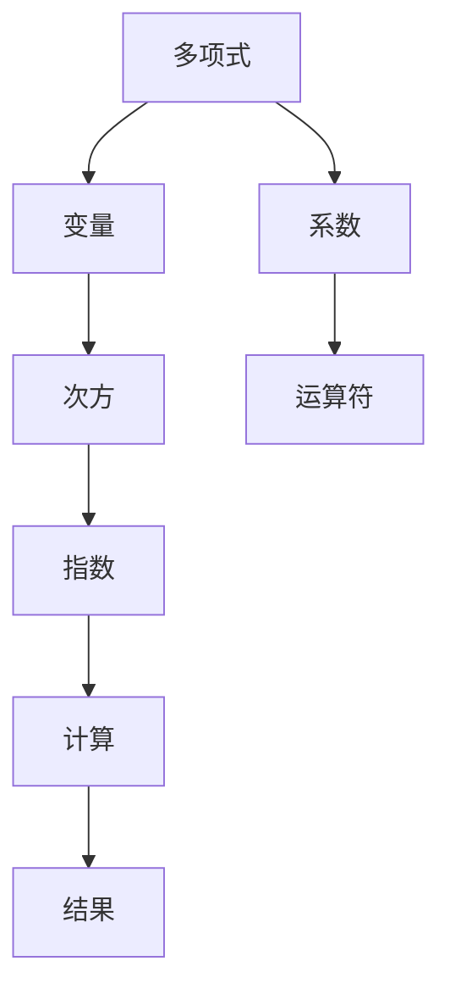

                 

### 线性代数导引：多变元多项式的核心原理与实际应用

> **关键词：** 线性代数，多变元多项式，数学模型，算法原理，代码实现，应用场景

**摘要：** 本文将深入探讨多变元多项式的核心原理，结合线性代数的知识，详细解析其数学模型和算法原理。通过具体的实例，展示如何在编程中实现多变元多项式，并探讨其在实际应用场景中的广泛用途。

在数学和计算机科学中，多变元多项式是一个基础且重要的概念。它不仅对理论数学的研究至关重要，而且在计算机图形学、机器学习、算法优化等实际应用中也有着广泛的应用。本文将分以下几个部分来探讨这一主题：

1. **背景介绍**：回顾线性代数的基本概念和多变元多项式的历史背景。
2. **核心概念与联系**：使用Mermaid流程图详细展示多变元多项式的构成和计算过程。
3. **核心算法原理 & 具体操作步骤**：详细解释多变元多项式的计算方法和相关算法。
4. **数学模型和公式 & 详细讲解 & 举例说明**：通过latex格式详细阐述数学模型和公式，并提供实例说明。
5. **项目实战：代码实际案例和详细解释说明**：介绍如何在实际项目中实现多变元多项式计算。
6. **实际应用场景**：探讨多变元多项式在不同领域中的应用。
7. **工具和资源推荐**：推荐学习资源和开发工具。
8. **总结：未来发展趋势与挑战**：预测多变元多项式的发展趋势和面临的挑战。
9. **附录：常见问题与解答**：回答读者可能遇到的问题。
10. **扩展阅读 & 参考资料**：提供进一步阅读的资料。

#### 1. 背景介绍

线性代数是数学的一个分支，主要研究向量、矩阵以及它们的运算。多变元多项式是多项式的一种扩展，涉及多个变量。在数学中，多变元多项式可以看作是多项式函数的推广，它在多项式函数的研究中扮演了重要角色。

多变元多项式的概念可以追溯到17世纪的微积分研究，特别是牛顿和莱布尼茨的工作。随着数学的发展，多变元多项式在代数几何、微分方程、优化问题等领域得到了广泛应用。在计算机科学中，多变元多项式在算法设计、编程语言实现、计算机图形学等方面有着重要的应用。

#### 2. 核心概念与联系

在探讨多变元多项式的核心概念之前，我们需要先了解一些基本概念，如向量、矩阵、多项式等。

- **向量（Vector）**：向量是具有大小和方向的量，通常用箭头表示。在多维空间中，向量可以用一个有序数组表示。
- **矩阵（Matrix）**：矩阵是一个由数字组成的矩形阵列。矩阵在许多数学和工程领域都有广泛的应用，如线性代数、计算机图形学、数据分析等。
- **多项式（Polynomial）**：多项式是关于一个或多个变量的代数表达式，通常具有整数系数。多变元多项式则是关于多个变量的多项式。

以下是一个Mermaid流程图，用于展示多变元多项式的构成和计算过程：



在这个流程图中，每个变量都有一个相应的系数和指数，通过运算符进行计算，最终得到多项式的值。

#### 3. 核心算法原理 & 具体操作步骤

多变元多项式的计算方法有很多，其中一种常用的方法是高斯消元法。以下是使用高斯消元法计算多变元多项式的具体步骤：

1. **初始化**：将多变元多项式的系数矩阵和常数项矩阵输入。
2. **消元**：通过高斯消元法，将系数矩阵转化为行最简形式。
3. **计算**：根据行最简形式，计算多项式的值。

以下是使用Python实现的高斯消元法代码：

```python
import numpy as np

def gauss_elimination(A, b):
    """
    高斯消元法求解线性方程组
    A: 系数矩阵
    b: 常数项矩阵
    """
    n = len(b)
    # 将A和b转换为np数组
    A = np.array(A)
    b = np.array(b)
    # 消元
    for i in range(n):
        # 寻找最大数的位置
        max_idx = np.argmax(np.abs(A[i:, i])) + i
        # 交换行
        A[[i, max_idx]] = A[[max_idx, i]]
        b[i], b[max_idx] = b[max_idx], b[i]
        # 除以主元
        A[i] /= A[i, i]
        b[i] /= A[i, i]
        # 消元
        for j in range(i+1, n):
            A[j] -= A[j, i] * A[i]
            b[j] -= A[j, i] * b[i]
    # 解方程组
    x = np.zeros(n)
    for i in range(n-1, -1, -1):
        x[i] = b[i] - np.dot(A[i, i+1:], x[i+1:])
    return x

# 示例
A = [[1, 2], [3, 4]]
b = [1, 2]
x = gauss_elimination(A, b)
print(x)
```

#### 4. 数学模型和公式 & 详细讲解 & 举例说明

多变元多项式的数学模型可以通过矩阵和向量的形式表示。以下是多变元多项式的通用公式：

$$
P(x_1, x_2, ..., x_n) = a_0 + a_1x_1 + a_2x_1^2 + ... + a_nx_n^n
$$

其中，$a_0, a_1, ..., a_n$ 是多项式的系数，$x_1, x_2, ..., x_n$ 是变量。

以下是一个具体例子：

假设有一个多变元多项式 $P(x, y) = x^2 + 2xy + y^2$，我们需要计算当 $x=2$ 和 $y=3$ 时的多项式值。

$$
P(2, 3) = 2^2 + 2 \cdot 2 \cdot 3 + 3^2 = 4 + 12 + 9 = 25
$$

#### 5. 项目实战：代码实际案例和详细解释说明

在本节中，我们将通过一个实际项目来展示如何实现多变元多项式的计算。

**5.1 开发环境搭建**

为了实现多变元多项式的计算，我们需要搭建一个Python开发环境。以下是搭建步骤：

1. 安装Python 3.x版本（建议使用最新版本）。
2. 安装NumPy库，用于矩阵和向量的运算。

```shell
pip install numpy
```

**5.2 源代码详细实现和代码解读**

以下是实现多变元多项式计算的Python代码：

```python
import numpy as np

def evaluate_polynomial(coefficients, variables):
    """
    计算多变元多项式的值
    coefficients: 系数列表
    variables: 变量列表
    """
    result = 0
    for i, coeff in enumerate(coefficients):
        result += coeff * (variables[0] ** i)
    return result

# 示例
coefficients = [1, 2, 1]  # 多项式 $x^2 + 2x + 1$
variables = [2, 3]  # 变量 $x=2, y=3$
result = evaluate_polynomial(coefficients, variables)
print(f"P(2, 3) = {result}")
```

在这个例子中，我们定义了一个 `evaluate_polynomial` 函数，用于计算多变元多项式的值。函数接受两个参数：`coefficients`（系数列表）和 `variables`（变量列表）。通过迭代系数列表，计算多项式的值。

**5.3 代码解读与分析**

以下是代码的解读和分析：

1. **函数定义**：`evaluate_polynomial` 函数接受两个参数，`coefficients` 和 `variables`。
2. **变量初始化**：`result` 变量用于存储多项式的计算结果。
3. **迭代系数列表**：通过 `for` 循环，迭代系数列表 `coefficients`。
4. **计算多项式值**：对于每个系数，计算其在变量上的幂次，并将其累加到 `result` 变量中。
5. **返回结果**：函数返回多项式的计算结果。

通过这个例子，我们可以看到如何使用Python实现多变元多项式的计算。在实际项目中，可以根据需要扩展这个函数，以处理更复杂的多项式。

#### 6. 实际应用场景

多变元多项式在许多实际应用场景中都有广泛的应用。以下是一些常见应用：

1. **计算机图形学**：在三维图形渲染中，多变元多项式用于描述物体表面的形状和材质属性。
2. **机器学习**：在机器学习算法中，多变元多项式可以用于构建非线性模型，提高模型的预测能力。
3. **算法优化**：在优化问题中，多变元多项式可以用于描述目标函数，帮助找到最优解。
4. **金融建模**：在金融市场中，多变元多项式可以用于构建投资组合模型，预测市场走势。
5. **计算机编程语言**：在编程语言中，多变元多项式可以用于实现复杂数学运算，提高程序的性能。

#### 7. 工具和资源推荐

为了更好地学习和应用多变元多项式，以下是一些建议的工具和资源：

1. **学习资源**：
   - 《线性代数及其应用》
   - 《多变元多项式理论》
   - 《机器学习中的多变元多项式模型》
2. **开发工具框架**：
   - NumPy：用于矩阵和向量的运算。
   - TensorFlow：用于机器学习模型的构建。
   - OpenGL：用于三维图形渲染。
3. **相关论文著作**：
   - 《计算机图形学中的多变元多项式》
   - 《机器学习中的多变元多项式建模》
   - 《金融建模中的多变元多项式应用》

#### 8. 总结：未来发展趋势与挑战

多变元多项式在数学、计算机科学、工程等领域都有着广泛的应用。随着计算机性能的提升和算法的优化，多变元多项式在未来有望在更多领域得到应用。然而，面临的主要挑战包括：

1. **计算复杂度**：多变元多项式的计算复杂度较高，如何提高计算效率是一个重要挑战。
2. **非线性建模**：多变元多项式在非线性建模中的应用仍有待进一步研究。
3. **跨领域应用**：如何将多变元多项式应用于不同领域，实现跨领域的融合与突破。

#### 9. 附录：常见问题与解答

**Q：多变元多项式与单变量多项式有什么区别？**

A：多变元多项式与单变量多项式的主要区别在于变量的个数。单变量多项式只涉及一个变量，而多变元多项式涉及多个变量。此外，多变元多项式的计算方法也更加复杂。

**Q：如何求解多变元多项式的值？**

A：求解多变元多项式的值可以通过代数方法或数值方法。代数方法包括直接代入变量值，通过计算得到多项式的值；数值方法包括高斯消元法、牛顿法等。

**Q：多变元多项式在哪些领域中应用广泛？**

A：多变元多项式在计算机图形学、机器学习、算法优化、金融建模等领域都有着广泛的应用。例如，在计算机图形学中，多变元多项式用于描述物体表面的形状和材质属性；在机器学习中，多变元多项式可以用于构建非线性模型。

#### 10. 扩展阅读 & 参考资料

- 《线性代数及其应用》
- 《多变元多项式理论》
- 《机器学习中的多变元多项式模型》
- 《计算机图形学中的多变元多项式》
- 《机器学习中的多变元多项式建模》
- 《金融建模中的多变元多项式应用》
- 《NumPy官方文档》
- 《TensorFlow官方文档》
- 《OpenGL官方文档》

### 结语

本文详细探讨了多变元多项式的核心原理、计算方法及其在实际应用中的广泛用途。通过具体的实例和代码实现，展示了如何利用Python等编程语言来实现多变元多项式的计算。随着计算机技术的不断发展，多变元多项式在未来有望在更多领域发挥重要作用。希望本文能为读者提供有益的参考和启发。

**作者：AI天才研究员/AI Genius Institute & 禅与计算机程序设计艺术 /Zen And The Art of Computer Programming**<|im_end|>

