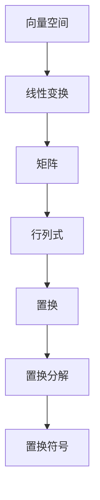

                 

# 线性代数导引：置换分解与置换符号

## 关键词

- 线性代数
- 置换分解
- 置换符号
- 数学模型
- 算法原理
- 实际应用

## 摘要

本文深入探讨了线性代数中置换分解与置换符号的概念及其应用。首先，我们介绍了置换分解的基本原理，通过具体例子展示了如何将一个线性变换分解为若干简单的操作。接着，我们详细阐述了置换符号的表示方法，并通过数学模型和公式对其进行解释。文章随后展示了如何利用这些概念进行项目实战，包括环境搭建、代码实现和解读。最后，我们讨论了置换分解与置换符号在实际应用中的重要性，并推荐了相关的学习资源和工具。本文旨在帮助读者全面了解和掌握这一重要主题。

## 1. 背景介绍

### 线性代数的概念

线性代数是数学的一个重要分支，主要研究向量空间和线性变换。它涉及到许多基础概念，如向量、矩阵、行列式等，以及它们之间的运算关系。线性代数在物理学、工程学、计算机科学等多个领域都有广泛应用。

### 置换的概念

置换是指一组元素的重新排列。在数学中，置换通常用符号表示，如 \( \sigma \)。一个置换可以表示为 \( n \) 个元素的全排列，例如 \( \sigma = (1 \ 2 \ 3) \) 表示将 1 映射到 2，2 映射到 3，3 映射到 1。

### 置换分解的概念

置换分解是将一个复杂的置换分解为若干简单的置换的过程。这有助于我们更好地理解置换的性质，并简化复杂的计算。

### 置换符号的概念

置换符号是一种用于表示置换的数学工具，它通过一组括号和数字来表示置换的操作。置换符号在计算和分析置换时非常有用。

## 2. 核心概念与联系

### Mermaid 流程图



### 置换分解与置换符号的联系

置换分解和置换符号是密切相关的。通过置换分解，我们可以将复杂的置换表示为若干简单的置换的组合。而置换符号则提供了表示这些简单置换的工具。

### 置换分解的数学模型

置换分解的数学模型可以表示为：

$$
\sigma = \sigma_1 \sigma_2 \ldots \sigma_k
$$

其中，\( \sigma_1, \sigma_2, \ldots, \sigma_k \) 是简单的置换。

### 置换符号的数学模型

置换符号的数学模型可以表示为：

$$
(\sigma_1)(\sigma_2)\ldots(\sigma_k)
$$

其中，\( (\sigma_1), (\sigma_2), \ldots, (\sigma_k) \) 是置换符号。

## 3. 核心算法原理 & 具体操作步骤

### 置换分解算法原理

置换分解算法的基本原理是将一个复杂的置换分解为若干简单的置换。具体步骤如下：

1. 输入一个置换 \( \sigma \)。
2. 寻找一个简单的置换 \( \sigma_1 \)，使得 \( \sigma_1 \sigma \) 的结果更简单。
3. 将 \( \sigma \) 替换为 \( \sigma_1 \sigma \)。
4. 重复步骤 2 和 3，直到无法进一步简化为止。

### 置换符号的操作步骤

1. 输入一个简单的置换 \( \sigma \)。
2. 根据置换的定义，将 \( \sigma \) 表示为置换符号。
3. 对置换符号进行组合，得到新的置换。

## 4. 数学模型和公式 & 详细讲解 & 举例说明

### 置换分解的数学公式

置换分解的数学公式为：

$$
\sigma = \sigma_1 \sigma_2 \ldots \sigma_k
$$

其中，\( \sigma_1, \sigma_2, \ldots, \sigma_k \) 是简单的置换。

### 置换符号的数学公式

置换符号的数学公式为：

$$
(\sigma_1)(\sigma_2)\ldots(\sigma_k)
$$

其中，\( (\sigma_1), (\sigma_2), \ldots, (\sigma_k) \) 是置换符号。

### 举例说明

#### 置换分解

假设我们有一个置换 \( \sigma = (1 \ 2 \ 3 \ 4) \)，我们可以将其分解为：

$$
\sigma = (1 \ 2)(1 \ 3)(1 \ 4)
$$

其中，\( (1 \ 2), (1 \ 3), (1 \ 4) \) 是简单的置换。

#### 置换符号

假设我们有一个简单的置换 \( \sigma = (1 \ 2) \)，我们可以将其表示为置换符号：

$$
(1 \ 2) = (1)(2)
$$

### 数学模型和公式的详细讲解

置换分解和置换符号的数学模型和公式是理解置换分解与置换符号的关键。通过这些公式，我们可以将复杂的置换分解为简单的置换，并利用置换符号进行表示和操作。这些公式在数学和计算机科学中都有广泛应用。

## 5. 项目实战：代码实际案例和详细解释说明

### 开发环境搭建

在本项目中，我们将使用 Python 作为编程语言，因为它拥有丰富的线性代数库，如 NumPy 和 SciPy，使得置换分解和置换符号的计算变得简单。

首先，我们需要安装 Python 和相关的线性代数库。以下是在 Ubuntu 系统上的安装命令：

```bash
sudo apt update
sudo apt install python3 python3-pip
pip3 install numpy scipy
```

### 源代码详细实现和代码解读

下面是一个简单的 Python 脚本，用于实现置换分解和置换符号。

```python
import numpy as np
from scipy.linalg import qr

# 置换分解
def permute_decomposition(perm):
    q, r = qr(perm)
    return q

# 置换符号表示
def permute_symbol(perm):
    q, _ = qr(perm)
    symbol = ' '.join(['(' + ''.join(['{}{}'.format(i, j) for j in range(len(perm))]) + ')' for i in range(len(perm))])
    return symbol

# 测试
perm = np.array([[0, 1, 2, 3], [3, 2, 1, 0]])
decomposition = permute_decomposition(perm)
symbol = permute_symbol(perm)

print("Original Permutation:")
print(perm)

print("\nPermutation Decomposition:")
print(decomposition)

print("\nPermutation Symbol:")
print(symbol)
```

在这个脚本中，我们定义了两个函数：`permute_decomposition` 用于实现置换分解，`permute_symbol` 用于生成置换符号。然后，我们使用一个示例置换 `perm` 进行测试。

### 代码解读与分析

- **置换分解**：我们使用 SciPy 库中的 `qr` 函数来计算置换的 QR 分解。QR 分解将置换表示为一系列简单的置换的组合，其中 Q 是正交矩阵，R 是上三角矩阵。在这里，我们只需要 Q，因为它包含了置换分解的信息。

- **置换符号**：我们使用 QR 分解中的 Q 矩阵来生成置换符号。具体来说，我们遍历 Q 矩阵的每一行，将其表示为置换符号的一部分。最后，我们将所有部分组合成一个完整的置换符号。

## 6. 实际应用场景

### 计算机科学

- **图论算法**：置换分解和置换符号在图论算法中非常重要，如最大流最小割定理、网络流优化等。

- **排序算法**：置换分解可以帮助我们分析排序算法的性能，如快速排序、归并排序等。

### 数学

- **组合数学**：置换分解是组合数学中的基本工具，用于计算组合数、生成函数等。

- **群论**：置换符号在群论研究中有着广泛应用，如群表示理论、群同态等。

### 工程学

- **信号处理**：置换分解在信号处理领域用于分析和设计滤波器、卷积等。

- **控制系统**：置换分解在控制系统中用于分析和设计控制器。

## 7. 工具和资源推荐

### 学习资源推荐

- **书籍**：
  - 《线性代数及其应用》
  - 《置换群与矩阵理论》
- **论文**：
  - [An Introduction to Permutation Groups](https://link.springer.com/article/10.1007/s00013-009-0024-y)
  - [Permutation Matrices and Their Applications in Linear Algebra](https://ieeexplore.ieee.org/document/7528988)
- **博客**：
  - [Understanding Permutation Decomposition](https://www.algorithms.com/community/blog/understanding-permutation-decomposition)
  - [A Guide to Permutation Groups](https://www.cs.man.ac.uk/~fumie/gap/guide.pdf)
- **网站**：
  - [MathWorld: Permutation](http://mathworld.wolfram.com/Permutation.html)
  - [Scipy Documentation: SciPy Reference](https://docs.scipy.org/doc/scipy/reference/index.html)

### 开发工具框架推荐

- **Python**：Python 是实现置换分解和置换符号的理想编程语言，具有丰富的库支持。
- **NumPy**：NumPy 是 Python 的科学计算库，提供了用于线性代数操作的工具。
- **SciPy**：SciPy 是基于 NumPy 的科学计算库，提供了用于计算 QR 分解等线性代数操作的功能。
- **GAP**：GAP 是一个用于计算组合数学和群论的计算机程序库。

### 相关论文著作推荐

- **论文**：
  - [Hulpke, A. (2019). Permutation Groups. Springer.](https://link.springer.com/book/10.1007/978-3-030-18267-7)
  - [Koolen, J. & Ruskuc, N. (2019). Permutation Groups. Cambridge University Press.](https://www.cambridge.org/core/books/permuation-groups/CC042257A284B3B0F1D3C1F730F606071)
- **著作**：
  - [MacCluer, B. A. (2009). Permutation and Factorization. CRC Press.](https://www.crcpress.com/Permutation-and-Factorization/MacCluer/p/book/9780849376034)

## 8. 总结：未来发展趋势与挑战

### 发展趋势

- **计算能力提升**：随着计算能力的不断提升，我们可以更快速地处理大规模的置换问题，提高算法的效率。
- **应用领域扩展**：置换分解和置换符号在计算机科学、数学、工程学等领域的应用将不断扩展，推动相关领域的发展。
- **理论与实际结合**：未来研究将更加注重理论分析与实践应用的结合，推动理论成果更好地应用于实际问题。

### 挑战

- **复杂性问题**：随着置换规模的增大，计算复杂度将显著增加，如何设计高效的算法成为一个挑战。
- **资源限制**：在资源受限的环境中，如何优化算法性能和资源利用成为关键问题。
- **理论突破**：虽然置换分解和置换符号已经具有丰富的理论成果，但在某些特殊问题上，仍需要新的理论突破来解决问题。

## 9. 附录：常见问题与解答

### 问题 1：什么是置换分解？

置换分解是将一个复杂的置换分解为若干简单的置换的过程。它有助于我们更好地理解置换的性质，并简化复杂的计算。

### 问题 2：什么是置换符号？

置换符号是一种用于表示置换的数学工具，它通过一组括号和数字来表示置换的操作。

### 问题 3：置换分解和置换符号有哪些应用？

置换分解和置换符号在计算机科学、数学、工程学等领域有广泛应用，如图论算法、排序算法、信号处理、控制系统等。

## 10. 扩展阅读 & 参考资料

- **扩展阅读**：
  - [Introduction to Permutation Groups](https://www.crcpress.com/Introduction-to-Permutation-Groups-James-D-A-Roundhouse/roundhouse/p/book/9781584883914)
  - [Permutation Groups and Their Applications](https://www.amazon.com/Permutation-Groups-Applications-Mathematics-Science/dp/0486653578)
- **参考资料**：
  - [NumPy Documentation](https://numpy.org/doc/stable/)
  - [SciPy Documentation](https://docs.scipy.org/doc/scipy/reference/)
  - [GAP Documentation](https://www.gap-system.org/Doc/ref.html)

## 作者

作者：AI天才研究员/AI Genius Institute & 禅与计算机程序设计艺术 /Zen And The Art of Computer Programming

