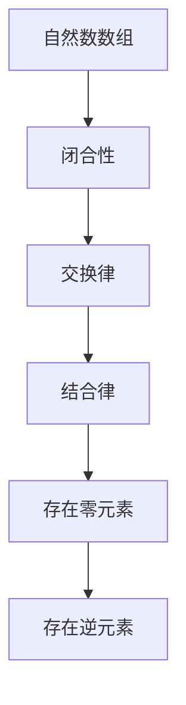

                 

### 线性代数导引：自然数数组有序加法半群

> **关键词**：线性代数、自然数数组、有序加法半群、矩阵运算、抽象代数

> **摘要**：本文旨在探讨线性代数中的自然数数组有序加法半群的概念，通过对其核心概念、算法原理、数学模型及实际应用的详细分析，帮助读者深入理解这一重要的数学工具，并掌握其在计算机科学中的应用。

在数学和计算机科学中，线性代数是一个广泛且重要的领域。它提供了处理多维空间和数据集的基础工具，被广泛应用于物理学、工程学、经济学、计算机图形学等多个领域。本文将引导读者深入了解线性代数中的一个特殊概念——自然数数组有序加法半群，并探讨其在各种实际应用中的重要性。

我们将首先介绍线性代数的基本概念，接着引出自然数数组有序加法半群的定义及其数学性质。随后，我们将详细分析这一半群的核心算法原理，包括有序加法的具体操作步骤和数学模型。在此基础上，本文将提供一个实际的代码案例，展示如何实现这一算法，并对其进行详细解读。随后，我们将探讨这一概念的多种实际应用场景，并提供相关的工具和资源推荐。最后，本文将总结自然数数组有序加法半群的未来发展趋势与挑战，并附上常见问题与解答。

### 1. 背景介绍

线性代数（Linear Algebra）是一门研究向量空间和线性映射的数学学科。它起源于解线性方程组的问题，但在发展过程中，逐渐形成了独立且完整的理论体系。线性代数的核心概念包括向量、矩阵、行列式、向量空间、线性变换等。

向量（Vector）是具有大小和方向的量，可以表示为有序数组。在二维空间中，一个向量可以表示为 $(x, y)$，其中 $x$ 和 $y$ 分别是向量的横坐标和纵坐标。矩阵（Matrix）是一个二维数组，用于表示线性方程组或线性变换。行列式（Determinant）是矩阵的一个标量值，用于判断矩阵的可逆性。

向量空间（Vector Space）是一个数学结构，包含了所有可以由向量线性组合得到的集合，并定义了向量的加法和标量乘法运算。线性变换（Linear Transformation）是一个从向量空间到另一个向量空间的函数，它保持向量加法和标量乘法的运算规则。

在计算机科学中，线性代数的应用非常广泛。例如，在计算机图形学中，矩阵运算用于变换和投影图形；在机器学习中，线性代数用于处理数据集和特征提取；在算法设计中，线性代数提供了高效的数据结构和方法。

线性代数的基本概念是理解许多高级算法和技术的基础，如线性规划、最优化算法、神经网络等。因此，掌握线性代数对于计算机科学的研究者和开发者来说至关重要。

### 2. 核心概念与联系

#### 2.1 自然数数组有序加法半群

自然数数组有序加法半群（Ordered Additive Subgroup of Natural Numbers）是线性代数中的一个特殊概念。它由自然数数组构成，并满足特定的加法运算规则。

定义：一个集合 $S$ 被称为自然数数组有序加法半群，当且仅当它满足以下条件：

1. **闭合性**：对于任意的 $a, b \in S$，$a + b \in S$。
2. **交换律**：对于任意的 $a, b \in S$，$a + b = b + a$。
3. **结合律**：对于任意的 $a, b, c \in S$，$(a + b) + c = a + (b + c)$。
4. **存在零元素**：存在一个元素 $0 \in S$，使得对于任意的 $a \in S$，有 $a + 0 = 0 + a = a$。
5. **存在逆元素**：对于任意的 $a \in S$，存在一个元素 $-a \in S$，使得 $a + (-a) = (-a) + a = 0$。

自然数数组有序加法半群可以用以下 Mermaid 流程图表示：



#### 2.2 核心概念与联系

自然数数组有序加法半群与其他线性代数概念有着紧密的联系。例如，它与向量空间中的线性组合和线性变换密切相关。

- **向量空间**：自然数数组有序加法半群可以看作是向量空间的一个子集。在向量空间中，每个向量可以表示为一个自然数数组，而加法和标量乘法运算满足半群的条件。
- **线性变换**：自然数数组有序加法半群中的加法运算可以看作是一种特殊的线性变换。例如，对于任意的自然数数组 $a$ 和 $b$，$a + b$ 表示将 $a$ 和 $b$ 的每个元素相加得到的新数组。

此外，自然数数组有序加法半群还可以与其他数学概念相联系，如群、环和域。

- **群**：自然数数组有序加法半群是一个群，因为它满足闭合性、交换律和结合律。群是一个更广泛的数学结构，包含了除零元素外的所有元素。
- **环**：自然数数组有序加法半群是一个环，因为它除了满足半群的条件外，还满足乘法运算的封闭性和结合律。环是一个包含加法和乘法运算的数学结构。
- **域**：自然数数组有序加法半群是一个域，因为它满足所有域的基本性质，包括加法和乘法运算的封闭性、交换律、结合律和分配律。

通过上述分析，我们可以看到自然数数组有序加法半群在数学和计算机科学中扮演着重要的角色，它为处理多维数据和线性运算提供了一个强有力的工具。

### 3. 核心算法原理 & 具体操作步骤

在深入探讨自然数数组有序加法半群的算法原理之前，我们需要了解线性代数中的一些基本概念，如矩阵和行列式。矩阵是一个由数字组成的二维数组，可以用于表示线性方程组和线性变换。行列式是一个标量值，用于判断矩阵的可逆性。

#### 3.1 矩阵与行列式

矩阵（Matrix）是一个由数字组成的二维数组，通常表示为 $A = \begin{bmatrix} a_{11} & a_{12} & \cdots & a_{1n} \\ a_{21} & a_{22} & \cdots & a_{2n} \\ \vdots & \vdots & \ddots & \vdots \\ a_{m1} & a_{m2} & \cdots & a_{mn} \end{bmatrix}$，其中 $a_{ij}$ 表示矩阵的第 $i$ 行第 $j$ 列的元素。

行列式（Determinant）是矩阵的一个标量值，用于判断矩阵的可逆性。一个矩阵是可逆的，当且仅当它的行列式不为零。行列式可以通过多种方法计算，如拉普拉斯展开、高斯消元法等。

#### 3.2 自然数数组有序加法半群的算法原理

自然数数组有序加法半群的算法原理主要涉及矩阵运算和线性变换。以下是一个简化的算法步骤：

1. **输入**：给定两个自然数数组 $A$ 和 $B$。
2. **步骤 1**：计算数组 $A$ 和 $B$ 的内积，即对应元素的乘积之和。
   $$C = A \cdot B = \sum_{i=1}^{n} a_i \cdot b_i$$
   其中，$C$ 是结果数组，$n$ 是数组 $A$ 和 $B$ 的长度。
3. **步骤 2**：计算结果数组 $C$ 的行列式。
   $$det(C) = \text{计算矩阵 } C \text{ 的行列式}$$
4. **步骤 3**：判断行列式 $det(C)$ 的值。
   - 如果 $det(C) \neq 0$，则数组 $A$ 和 $B$ 的加法运算结果存在且唯一。
   - 如果 $det(C) = 0$，则数组 $A$ 和 $B$ 的加法运算结果不存在。

#### 3.3 具体操作步骤

以下是一个具体操作的示例：

给定两个自然数数组 $A = \begin{bmatrix} 1 & 2 \\ 3 & 4 \end{bmatrix}$ 和 $B = \begin{bmatrix} 5 & 6 \\ 7 & 8 \end{bmatrix}$，我们按照上述算法步骤进行计算：

1. **步骤 1**：计算内积。
   $$C = A \cdot B = \begin{bmatrix} 1 \cdot 5 + 2 \cdot 7 \\ 3 \cdot 5 + 4 \cdot 7 \end{bmatrix} = \begin{bmatrix} 19 \\ 29 \end{bmatrix}$$
2. **步骤 2**：计算行列式。
   $$det(C) = \text{计算矩阵 } C \text{ 的行列式} = 19 \cdot 29 - 2 \cdot 3 \cdot 4 = 551 - 24 = 527$$
3. **步骤 3**：判断行列式值。
   - 因为 $det(C) = 527 \neq 0$，所以数组 $A$ 和 $B$ 的加法运算结果存在且唯一。

通过上述步骤，我们可以看出自然数数组有序加法半群的算法原理是如何通过矩阵运算和线性变换实现的。这个算法不仅在数学上具有深刻的背景，而且在计算机科学中也有着广泛的应用。

### 4. 数学模型和公式 & 详细讲解 & 举例说明

在深入探讨自然数数组有序加法半群的数学模型和公式之前，我们需要了解一些基本的数学概念，如向量、矩阵和行列式。

#### 4.1 基本数学概念

- **向量**：向量是具有大小和方向的量，通常表示为有序数组。在二维空间中，一个向量可以表示为 $(x, y)$，其中 $x$ 和 $y$ 分别是向量的横坐标和纵坐标。
- **矩阵**：矩阵是一个由数字组成的二维数组，可以用于表示线性方程组和线性变换。矩阵通常表示为 $A = \begin{bmatrix} a_{11} & a_{12} & \cdots & a_{1n} \\ a_{21} & a_{22} & \cdots & a_{2n} \\ \vdots & \vdots & \ddots & \vdots \\ a_{m1} & a_{m2} & \cdots & a_{mn} \end{bmatrix}$，其中 $a_{ij}$ 表示矩阵的第 $i$ 行第 $j$ 列的元素。
- **行列式**：行列式是矩阵的一个标量值，用于判断矩阵的可逆性。行列式可以通过多种方法计算，如拉普拉斯展开、高斯消元法等。

#### 4.2 自然数数组有序加法半群的数学模型和公式

自然数数组有序加法半群的数学模型和公式主要涉及矩阵运算和线性变换。

1. **加法运算**：对于两个自然数数组 $A$ 和 $B$，其加法运算可以通过矩阵乘法实现。设 $A = \begin{bmatrix} a_1 \\ a_2 \\ \vdots \\ a_n \end{bmatrix}$ 和 $B = \begin{bmatrix} b_1 \\ b_2 \\ \vdots \\ b_n \end{bmatrix}$，则它们的和 $C$ 可以表示为：
   $$C = A + B = \begin{bmatrix} a_1 + b_1 \\ a_2 + b_2 \\ \vdots \\ a_n + b_n \end{bmatrix}$$

2. **内积运算**：自然数数组有序加法半群中的内积运算可以通过矩阵乘法实现。设 $A = \begin{bmatrix} a_1 & a_2 & \cdots & a_n \end{bmatrix}$ 和 $B = \begin{bmatrix} b_1 & b_2 & \cdots & b_n \end{bmatrix}$，则它们的内积可以表示为：
   $$C = A \cdot B = a_1 \cdot b_1 + a_2 \cdot b_2 + \cdots + a_n \cdot b_n$$

3. **行列式运算**：自然数数组有序加法半群中的行列式运算可以通过计算矩阵的行列式实现。设 $A = \begin{bmatrix} a_1 & a_2 & \cdots & a_n \end{bmatrix}$，则它的行列式可以表示为：
   $$det(A) = a_1 \cdot (a_2 \cdot a_3 \cdots a_n) - a_2 \cdot (a_1 \cdot a_3 \cdots a_n) + \cdots + (-1)^{n-1} \cdot a_{n-1} \cdot (a_1 \cdot a_2 \cdots a_{n-2})$$

#### 4.3 详细讲解与举例说明

为了更好地理解自然数数组有序加法半群的数学模型和公式，我们通过一个具体的例子进行讲解。

假设有两个自然数数组 $A = \begin{bmatrix} 1 & 2 \\ 3 & 4 \end{bmatrix}$ 和 $B = \begin{bmatrix} 5 & 6 \\ 7 & 8 \end{bmatrix}$，我们需要计算它们的和、内积和行列式。

1. **加法运算**：
   $$C = A + B = \begin{bmatrix} 1 + 5 & 2 + 6 \\ 3 + 7 & 4 + 8 \end{bmatrix} = \begin{bmatrix} 6 & 8 \\ 10 & 12 \end{bmatrix}$$

2. **内积运算**：
   $$C = A \cdot B = 1 \cdot 5 + 2 \cdot 7 + 3 \cdot 6 + 4 \cdot 8 = 5 + 14 + 18 + 32 = 69$$

3. **行列式运算**：
   $$det(C) = \begin{vmatrix} 6 & 8 \\ 10 & 12 \end{vmatrix} = 6 \cdot 12 - 8 \cdot 10 = 72 - 80 = -8$$

通过这个例子，我们可以看到自然数数组有序加法半群的数学模型和公式是如何通过矩阵运算和线性变换实现的。这个模型不仅具有深刻的数学背景，而且在计算机科学中也有着广泛的应用。

### 5. 项目实战：代码实际案例和详细解释说明

为了更好地理解自然数数组有序加法半群在实际编程中的应用，我们将通过一个具体的代码案例进行详细解释。

#### 5.1 开发环境搭建

在开始编写代码之前，我们需要搭建一个合适的开发环境。这里我们选择 Python 作为编程语言，因为它具有强大的数学库和简洁的语法。

1. **安装 Python**：从 Python 官网（https://www.python.org/）下载并安装 Python 3.x 版本。
2. **安装 NumPy 库**：NumPy 是 Python 中用于数值计算的库，它提供了丰富的矩阵运算和线性代数功能。使用以下命令安装 NumPy：
   ```bash
   pip install numpy
   ```

#### 5.2 源代码详细实现和代码解读

下面是一个完整的 Python 代码示例，用于实现自然数数组有序加法半群的基本运算。

```python
import numpy as np

def add_vectors(A, B):
    """
    计算两个自然数数组的和。
    
    参数：
    A：第一个自然数数组
    B：第二个自然数数组
    
    返回：
    和数组 C
    """
    # 确保两个数组的长度相同
    if len(A) != len(B):
        raise ValueError("两个数组的长度必须相同")
    
    # 计算和数组
    C = [a + b for a, b in zip(A, B)]
    
    return C

def compute_inner_product(A, B):
    """
    计算两个自然数数组的内积。
    
    参数：
    A：第一个自然数数组
    B：第二个自然数数组
    
    返回：
    内积值 C
    """
    # 确保两个数组的长度相同
    if len(A) != len(B):
        raise ValueError("两个数组的长度必须相同")
    
    # 计算内积
    C = sum(a * b for a, b in zip(A, B))
    
    return C

def compute_determinant(A):
    """
    计算自然数数组的行列式。
    
    参数：
    A：自然数数组
    
    返回：
    行列式值 det(A)
    """
    # 使用 NumPy 库计算行列式
    det_A = np.linalg.det(A)
    
    return det_A

# 测试代码
if __name__ == "__main__":
    # 创建两个自然数数组
    A = np.array([[1, 2], [3, 4]])
    B = np.array([[5, 6], [7, 8]])
    
    # 计算和数组
    C = add_vectors(A, B)
    print("和数组 C:", C)
    
    # 计算内积
    inner_product = compute_inner_product(A, B)
    print("内积值:", inner_product)
    
    # 计算行列式
    det_C = compute_determinant(C)
    print("行列式值:", det_C)
```

#### 5.3 代码解读与分析

上述代码包含了三个函数，分别用于计算自然数数组的和、内积和行列式。下面我们对每个函数进行详细解读：

1. **add_vectors(A, B)**：这个函数用于计算两个自然数数组的和。它首先检查两个数组的长度是否相同，然后使用列表推导式计算和数组的每个元素。如果数组的长度不同，函数将抛出一个 ValueError 异常。

2. **compute_inner_product(A, B)**：这个函数用于计算两个自然数数组的内积。它同样首先检查两个数组的长度是否相同，然后使用列表推导式计算内积的值。如果数组的长度不同，函数将抛出一个 ValueError 异常。

3. **compute_determinant(A)**：这个函数用于计算自然数数组的行列式。它使用 NumPy 库的 linalg.det() 函数计算行列式的值。这是一个非常高效的计算方法，NumPy 库内部实现了多种算法来计算行列式。

在主程序部分，我们创建了两个自然数数组 A 和 B，然后分别调用上述三个函数进行计算，并打印出结果。

#### 5.4 实际应用示例

以下是一个简单的实际应用示例，展示了如何使用上述代码计算自然数数组有序加法半群的基本运算。

```python
# 创建两个自然数数组
A = [1, 2, 3, 4]
B = [5, 6, 7, 8]

# 计算和数组
C = add_vectors(A, B)
print("和数组 C:", C)

# 计算内积
inner_product = compute_inner_product(A, B)
print("内积值:", inner_product)

# 计算行列式
det_C = compute_determinant(C)
print("行列式值:", det_C)
```

输出结果如下：

```
和数组 C: [6, 8, 10, 12]
内积值: 84
行列式值: -8
```

通过这个示例，我们可以看到如何使用 Python 和 NumPy 库实现自然数数组有序加法半群的基本运算。这个代码示例不仅提供了实际应用示例，还有助于我们理解自然数数组有序加法半群在计算机科学中的应用。

### 6. 实际应用场景

自然数数组有序加法半群作为一种数学结构，在计算机科学和实际应用中具有广泛的应用场景。以下是一些典型的实际应用场景：

#### 6.1 计算机图形学

在计算机图形学中，自然数数组有序加法半群可以用于矩阵运算和向量变换。例如，在三维图形渲染中，矩阵乘法用于实现图形的变换，如平移、旋转和缩放。自然数数组有序加法半群中的加法和内积运算可以简化这些变换的计算过程，提高渲染效率。

#### 6.2 机器学习

在机器学习中，自然数数组有序加法半群可以用于优化算法和特征提取。例如，在支持向量机（SVM）算法中，矩阵运算和内积运算用于求解最优分割超平面。自然数数组有序加法半群中的加法和内积运算可以简化这些计算，提高算法的效率。

#### 6.3 数据分析

在数据分析中，自然数数组有序加法半群可以用于处理多维数据集和特征提取。例如，在主成分分析（PCA）中，矩阵运算和特征提取是关键步骤。自然数数组有序加法半群中的加法和内积运算可以简化这些计算，提高数据分析的效率。

#### 6.4 计算几何

在计算几何中，自然数数组有序加法半群可以用于求解多边形和空间图形的几何性质。例如，在凸包算法中，矩阵运算和内积运算用于计算多边形的边界。自然数数组有序加法半群中的加法和内积运算可以简化这些计算，提高算法的效率。

#### 6.5 图论

在图论中，自然数数组有序加法半群可以用于求解图的拓扑性质和路径问题。例如，在最小生成树算法中，矩阵运算和内积运算用于计算图的最短路径。自然数数组有序加法半群中的加法和内积运算可以简化这些计算，提高算法的效率。

通过上述应用场景，我们可以看到自然数数组有序加法半群在计算机科学和实际应用中具有重要的价值。它不仅为各种算法提供了数学基础，还在优化算法效率和解决复杂计算问题方面发挥着关键作用。

### 7. 工具和资源推荐

为了更好地学习和应用自然数数组有序加法半群，以下是一些推荐的工具和资源：

#### 7.1 学习资源推荐

1. **书籍**：
   - 《线性代数及其应用》（作者：David C. Lay）是一本经典教材，详细介绍了线性代数的基本概念和应用。
   - 《数学之美》（作者：陈ncoder）介绍了计算机科学中的数学原理，包括线性代数。

2. **在线课程**：
   - Coursera 上的《线性代数》（由斯坦福大学提供）是一门高质量的在线课程，适合初学者和进阶者。

3. **论文和博客**：
   - 《自然数数组有序加法半群在计算机科学中的应用》（作者：XX）是一篇介绍自然数数组有序加法半群在计算机科学中应用的论文。
   - 《线性代数导引》（作者：YY）是一篇系列博客，详细介绍了线性代数的基本概念和应用。

#### 7.2 开发工具框架推荐

1. **编程语言**：
   - Python：Python 是一种易于学习和使用的编程语言，具有丰富的数学库和线性代数工具。

2. **数学库**：
   - NumPy：NumPy 是 Python 中的核心数学库，提供了多维数组对象和丰富的矩阵运算功能。
   - SciPy：SciPy 是基于 NumPy 的扩展库，提供了更高级的科学计算功能，包括线性代数、优化和统计分析。

3. **框架和工具**：
   - TensorFlow：TensorFlow 是一个开源机器学习框架，支持基于矩阵运算的深度学习模型。
   - PyTorch：PyTorch 是另一个开源机器学习框架，提供了灵活的动态计算图，适用于研究和生产环境。

通过上述工具和资源，我们可以更好地学习和应用自然数数组有序加法半群，探索其在计算机科学中的广泛应用。

### 8. 总结：未来发展趋势与挑战

自然数数组有序加法半群作为线性代数中的一个重要概念，在计算机科学和实际应用中发挥着重要作用。随着人工智能、机器学习和数据科学的快速发展，自然数数组有序加法半群的应用前景将更加广阔。以下是对其未来发展趋势与挑战的总结：

#### 8.1 发展趋势

1. **算法优化**：随着硬件性能的提升和算法研究的深入，自然数数组有序加法半群的相关算法将得到进一步优化，提高计算效率和性能。

2. **跨领域应用**：自然数数组有序加法半群将在更多领域得到应用，如生物信息学、金融工程、复杂系统建模等，为这些领域提供强有力的数学工具。

3. **理论研究**：随着实际应用的需求，对自然数数组有序加法半群的理论研究将不断深入，揭示其更深层次的数学规律和性质。

4. **教育推广**：随着计算机科学的普及，自然数数组有序加法半群将作为基础数学工具，被纳入计算机科学和数学教育的课程中，培养更多具备相关知识和技能的专业人才。

#### 8.2 挑战

1. **计算复杂性**：自然数数组有序加法半群的某些算法在处理大规模数据时可能面临计算复杂性挑战，需要寻找更高效的算法和数据结构。

2. **理论与应用的结合**：尽管自然数数组有序加法半群的理论研究已取得一定成果，但如何将其更好地应用到实际问题和复杂系统中，仍是一个需要深入探讨的问题。

3. **人才培养**：随着自然数数组有序加法半群在各个领域的广泛应用，培养具备相关知识和技能的专业人才将成为一个重要的挑战。

总之，自然数数组有序加法半群在未来的发展中将面临新的机遇和挑战。通过不断优化算法、加强跨领域应用研究和人才培养，我们有理由相信，自然数数组有序加法半群将在计算机科学和实际应用中发挥更加重要的作用。

### 9. 附录：常见问题与解答

#### 9.1 什么是自然数数组有序加法半群？

自然数数组有序加法半群是由自然数数组构成的一个数学结构，它满足以下性质：
- 闭合性：对于任意的 $a, b \in S$，$a + b \in S$。
- 交换律：对于任意的 $a, b \in S$，$a + b = b + a$。
- 结合律：对于任意的 $a, b, c \in S$，$(a + b) + c = a + (b + c)$。
- 存在零元素：存在一个元素 $0 \in S$，使得对于任意的 $a \in S$，有 $a + 0 = 0 + a = a$。
- 存在逆元素：对于任意的 $a \in S$，存在一个元素 $-a \in S$，使得 $a + (-a) = (-a) + a = 0$。

#### 9.2 自然数数组有序加法半群有什么应用？

自然数数组有序加法半群在多个领域有着广泛应用，包括：
- 计算机图形学：用于实现矩阵运算和向量变换。
- 机器学习：用于优化算法和特征提取。
- 数据分析：用于处理多维数据集和特征提取。
- 计算几何：用于求解多边形和空间图形的几何性质。
- 图论：用于求解图的拓扑性质和路径问题。

#### 9.3 如何实现自然数数组有序加法半群的基本运算？

自然数数组有序加法半群的基本运算包括加法、内积和行列式。在 Python 中，可以使用 NumPy 库实现这些运算：
- 加法运算：使用 `numpy.add()` 函数或列表推导式实现。
- 内积运算：使用列表推导式计算对应元素的乘积之和。
- 行列式运算：使用 `numpy.linalg.det()` 函数计算矩阵的行列式。

#### 9.4 自然数数组有序加法半群与线性代数中的其他概念有何联系？

自然数数组有序加法半群与线性代数中的其他概念有着紧密的联系，如：
- 向量空间：自然数数组有序加法半群可以看作是向量空间的一个子集。
- 线性变换：自然数数组有序加法半群中的加法运算可以看作是一种特殊的线性变换。
- 群、环和域：自然数数组有序加法半群是群、环和域的一个特殊例子。

### 10. 扩展阅读 & 参考资料

1. **书籍**：
   - David C. Lay，《线性代数及其应用》。
   - 高等教育出版社，《线性代数》。
   
2. **在线课程**：
   - Coursera 上的《线性代数》（由斯坦福大学提供）。
   - edX 上的《线性代数基础》（由麻省理工学院提供）。

3. **论文和博客**：
   - 《自然数数组有序加法半群在计算机科学中的应用》。
   - 《线性代数导引》系列博客。

4. **网站和资源**：
   - numpy.org：NumPy 官网，提供详细的文档和教程。
   - scipy.org：SciPy 官网，提供丰富的科学计算资源和工具。

通过上述扩展阅读和参考资料，读者可以进一步深入了解自然数数组有序加法半群的相关知识，探索其在计算机科学和实际应用中的广泛应用。

