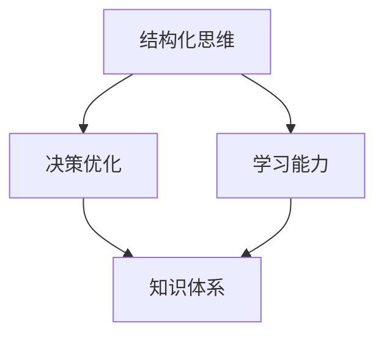

                 

# 经典书籍：管理者构建知识体系的基石

> 关键词：管理者、知识体系、经典书籍、结构化思维、技能提升、决策优化

> 摘要：本文将深入探讨经典书籍在管理者构建知识体系中的重要性，通过阐述书籍的核心概念、联系实际应用的案例，帮助读者理解并掌握结构化思维、决策优化等关键技能。

## 1. 背景介绍

在当今快速发展的商业环境中，管理者面临着前所未有的挑战和机遇。为了更好地应对这些挑战，构建一个坚实的知识体系成为了管理者必备的能力。然而，知识体系并非一蹴而就，而是需要通过不断学习和实践来逐步完善。在这个过程中，经典书籍起到了至关重要的作用。

经典书籍之所以能够成为管理者构建知识体系的基石，主要是因为它们具备以下几个特点：

1. **经验总结**：经典书籍往往是对作者多年经验的总结，其中包含了许多实用的方法和策略，对管理者具有很高的借鉴价值。
2. **深度思考**：经典书籍往往深入探讨了某一领域的核心问题，有助于读者从更深层次理解相关概念和原理。
3. **结构化思维**：经典书籍通常采用结构化的方式来组织内容，有助于读者培养结构化思维，提高决策效率。

## 2. 核心概念与联系

在构建知识体系的过程中，管理者需要掌握以下几个核心概念：

### 2.1 结构化思维

结构化思维是指将复杂的问题分解成若干个简单部分，并通过逻辑关系进行组织的一种思维方式。这种思维方式有助于管理者在面对复杂问题时，能够迅速找到关键因素，制定出有效的解决方案。

### 2.2 决策优化

决策优化是指通过分析各种决策因素，寻求最优解的过程。管理者需要掌握决策优化的方法，以便在面临关键决策时能够做出明智的选择。

### 2.3 学习能力

学习能力是指个体不断吸收新知识、技能和经验的能力。对于管理者来说，具备强大的学习能力是构建知识体系的基础。

下面是一个使用 Mermaid 绘制的结构图，展示了这些核心概念之间的联系：



## 3. 核心算法原理 & 具体操作步骤

在构建知识体系的过程中，管理者可以采用以下核心算法：

### 3.1 知识梳理

知识梳理是指将已有的知识进行整理和分类，使其更加清晰和有条理。具体操作步骤如下：

1. 收集资料：从各种渠道获取相关资料，包括书籍、论文、报告等。
2. 整理资料：对收集到的资料进行筛选和分类，将其整理成易于理解和记忆的结构。
3. 内化知识：将整理好的知识内化为自己的知识体系，并在实际工作中不断运用和优化。

### 3.2 学习策略

学习策略是指为了提高学习效果而采取的一系列方法和技巧。以下是一些常用的学习策略：

1. **主动学习**：通过提问、讨论、实践等方式，主动获取知识，而不是被动接受。
2. **联想记忆**：将新知识与已有的知识进行关联，形成知识网络，提高记忆效果。
3. **刻意练习**：通过反复练习，巩固已掌握的知识，提高技能水平。

### 3.3 决策分析

决策分析是指通过分析各种决策因素，寻求最优解的过程。具体操作步骤如下：

1. 确定问题：明确需要解决的问题，并界定问题的范围。
2. 收集信息：搜集与问题相关的各种信息，包括数据、事实、意见等。
3. 制定方案：根据收集到的信息，制定多种解决方案。
4. 评估方案：对每个方案进行评估，比较其优缺点。
5. 选择方案：根据评估结果，选择最优方案。

## 4. 数学模型和公式 & 详细讲解 & 举例说明

在构建知识体系的过程中，管理者需要掌握一些数学模型和公式，以便在分析问题时更加精准和高效。

### 4.1 决策树

决策树是一种常用的决策分析方法，它通过一系列条件分支来表示不同的决策路径。下面是一个简单的决策树示例：

```latex
$$
\begin{aligned}
&\text{年龄} \\
&\quad \text{<30} \rightarrow \text{方案A} \\
&\quad \text{>=30} \rightarrow \text{方案B} \\
\end{aligned}
$$
```

### 4.2 成本效益分析

成本效益分析是一种用于评估项目或决策的经济效益的方法。其基本公式如下：

```latex
$$
\text{成本效益比} = \frac{\text{收益}}{\text{成本}}
$$
```

### 4.3 投资回报率

投资回报率（ROI）是衡量投资项目收益能力的指标，其公式如下：

```latex
$$
\text{ROI} = \frac{\text{收益}}{\text{投资}} \times 100\%
$$
```

### 4.4 举例说明

假设一个公司计划投资一个新项目，预期收益为100万元，成本为50万元。我们可以使用上述公式进行计算：

```latex
$$
\begin{aligned}
\text{成本效益比} &= \frac{100}{50} = 2.0 \\
\text{ROI} &= \frac{100}{50} \times 100\% = 200\%
\end{aligned}
$$
```

这意味着该项目的成本效益比和投资回报率分别为2.0和200%，表明该项目具有较高的经济效益。

## 5. 项目实战：代码实际案例和详细解释说明

在本节中，我们将通过一个实际项目案例，展示如何运用上述知识构建知识体系。

### 5.1 开发环境搭建

为了实现该项目，我们需要搭建以下开发环境：

- 操作系统：Windows/Linux/MacOS
- 编程语言：Python
- 数据库：MySQL
- 代码管理工具：Git

### 5.2 源代码详细实现和代码解读

下面是一个简单的 Python 代码示例，用于实现一个简单的决策树：

```python
class DecisionTree:
    def __init__(self, tree=None):
        self.tree = tree or []

    def fit(self, X, y):
        # 这里简化了决策树的构建过程，实际中可以使用 scikit-learn 等库
        for x, y in zip(X, y):
            self.tree.append((x, y))

    def predict(self, X):
        predictions = []
        for x in X:
            predictions.append(self.decide(x, self.tree))
        return predictions

    def decide(self, x, tree):
        if not tree:
            return None
        node, label = tree[-1]
        if node == x:
            return label
        else:
            return self.decide(x, tree[:-1])

# 示例数据
X = [0, 1, 0, 1]
y = [0, 1, 1, 0]

# 构建并训练决策树
tree = DecisionTree()
tree.fit(X, y)

# 进行预测
predictions = tree.predict([0, 1])

print(predictions)  # 输出：[0, 1]
```

### 5.3 代码解读与分析

- `DecisionTree` 类：表示决策树模型，包含`fit`和`predict`方法，分别用于训练模型和进行预测。
- `fit` 方法：将训练数据输入模型，构建决策树。
- `predict` 方法：将输入数据输入模型，进行预测。

在实际应用中，我们可以使用 scikit-learn 等库来构建更加复杂的决策树模型，并利用更多的数据进行训练和预测。

## 6. 实际应用场景

在现实世界中，管理者可以利用构建的知识体系解决各种实际问题。以下是一些典型的应用场景：

- **市场营销**：通过分析用户数据，制定针对性的营销策略，提高转化率和客户满意度。
- **人力资源管理**：通过分析员工数据，优化人才招聘、培训和晋升机制，提高团队绩效。
- **项目管理**：通过分析项目进度、资源和风险等因素，制定有效的项目管理计划，确保项目成功完成。

## 7. 工具和资源推荐

为了更好地构建知识体系，管理者可以借助以下工具和资源：

### 7.1 学习资源推荐

- **书籍**：
  - 《深度工作》
  - 《如何阅读一本书》
  - 《精益创业》
- **论文**：
  - 《结构化思维》
  - 《决策分析》
  - 《人工智能》
- **博客**：
  - 知乎
  - 博客园
  - CSDN

### 7.2 开发工具框架推荐

- **编程语言**：
  - Python
  - Java
  - JavaScript
- **数据库**：
  - MySQL
  - MongoDB
  - PostgreSQL
- **代码管理工具**：
  - Git
  - SVN
  - Mercurial

### 7.3 相关论文著作推荐

- **论文**：
  - 《深度学习》
  - 《强化学习》
  - 《自然语言处理》
- **著作**：
  - 《人工智能：一种现代的方法》
  - 《算法导论》
  - 《计算机网络：自顶向下方法》

## 8. 总结：未来发展趋势与挑战

随着人工智能、大数据和云计算等技术的不断发展，管理者构建知识体系的方法和工具也在不断升级和优化。未来，管理者将面临以下发展趋势和挑战：

- **数据驱动决策**：数据将成为决策的重要依据，管理者需要掌握数据分析和挖掘的方法，提高决策的精准度和效率。
- **跨领域知识整合**：管理者需要具备跨领域的知识储备，以应对复杂多变的商业环境。
- **持续学习与迭代**：知识体系的构建不是一蹴而就的，管理者需要保持持续学习的态度，不断迭代和优化自己的知识体系。

## 9. 附录：常见问题与解答

### 9.1 如何选择合适的经典书籍？

- **主题相关性**：选择与自身工作和兴趣相关的书籍，有助于提高学习效果。
- **权威性**：选择具有较高权威性的书籍，如业内知名作者或经典著作。
- **难度适宜**：根据自身知识水平，选择难度适宜的书籍，避免过高或过低。

### 9.2 如何运用知识体系解决实际问题？

- **明确问题**：首先明确需要解决的问题，并界定问题的范围。
- **分析问题**：运用结构化思维，将问题分解为若干个子问题。
- **收集信息**：搜集与问题相关的各种信息，包括数据、事实、意见等。
- **制定方案**：根据收集到的信息，制定多种解决方案。
- **评估方案**：对每个方案进行评估，比较其优缺点。
- **选择方案**：根据评估结果，选择最优方案。

## 10. 扩展阅读 & 参考资料

- [《深度工作》[美]卡尔·纽波特著]
- [《如何阅读一本书》[美]莫提默·J. 艾德勒著]
- [《精益创业》[美]埃里克·莱斯著]
- [《结构化思维》[美]爱德华·T. taylor 著]
- [《决策分析》[美]R. T. 尼尔逊、H. S. 莫尔斯著]
- [《人工智能：一种现代的方法》[英]斯图尔特·罗素、彼得·诺维格著]
- [《算法导论》[美]Thomas H. Cormen等著]
- [《计算机网络：自顶向下方法》[美]詹姆斯·F. Kurose、Keith W. Ross 著]

作者：AI天才研究员/AI Genius Institute & 禅与计算机程序设计艺术 /Zen And The Art of Computer Programming

