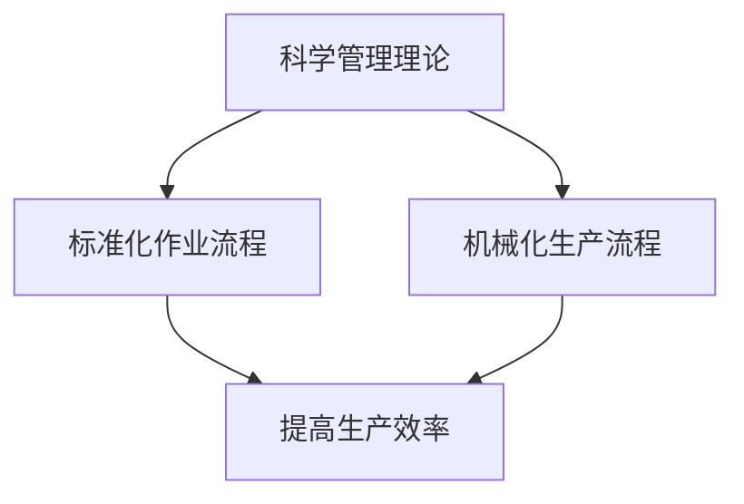
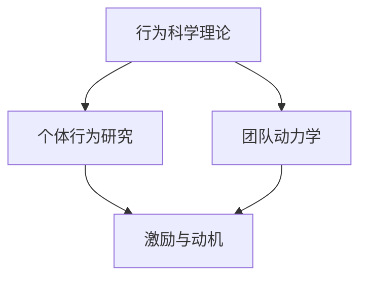
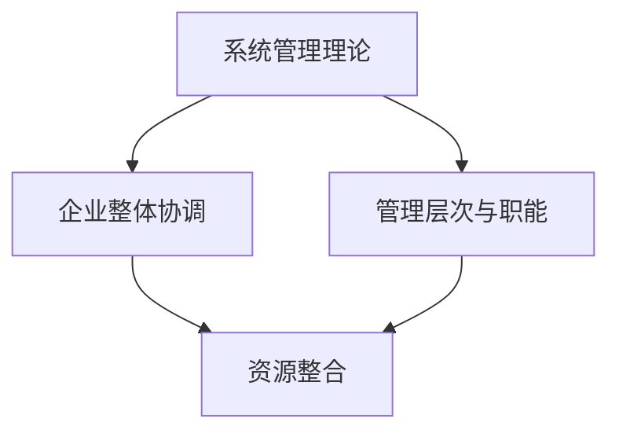
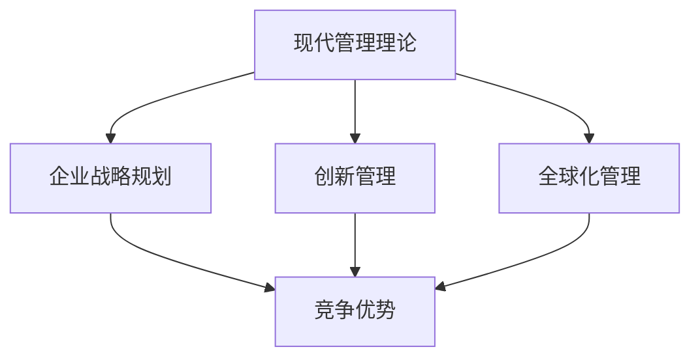
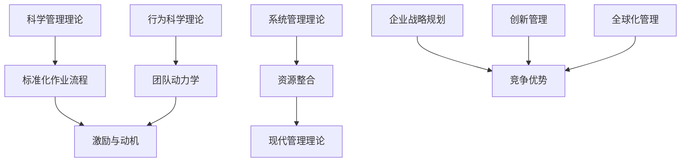

                 

### 背景介绍

在现代企业中，管理理论的应用对于企业的运营和发展至关重要。随着全球化、信息化和知识经济的发展，企业面临的竞争压力和不确定性日益增加，传统的管理理论和方法已经难以满足企业的需求。因此，如何将经典管理理论进行创新应用，以适应现代企业的发展需求，成为了管理学者和企业家共同关注的课题。

经典管理理论主要包括科学管理理论、行为科学理论、系统管理理论和现代管理理论等。这些理论在不同的历史时期对企业的发展产生了深远的影响，为现代企业提供了丰富的理论资源和实践指导。然而，随着时代的发展，这些理论也面临着新的挑战和局限。

首先，科学管理理论强调通过标准化和机械化来提高生产效率，但在信息时代，创新和灵活性成为企业成功的关键，科学管理理论的局限性日益显现。其次，行为科学理论注重个体行为和团队动力学，但在全球化背景下，多元文化和跨文化管理成为新的挑战，行为科学理论的适用性受到质疑。再次，系统管理理论强调企业作为一个整体的协调和整合，但在信息化和数字化转型过程中，企业面临的数据复杂性和动态性使得系统管理理论的实践变得更加困难。

因此，如何将经典管理理论进行创新应用，以适应现代企业的发展需求，成为了管理学者和企业家共同关注的课题。本文将围绕这一主题，探讨经典管理理论在现代企业中的创新应用，包括理论基础的挖掘、创新应用的实践探索以及未来的发展趋势。

通过本文的探讨，我们希望能够为现代企业提供一些有益的启示，帮助他们在复杂多变的市场环境中，运用经典管理理论的智慧，实现持续发展和卓越绩效。同时，我们也希望本文能够为管理学者提供一些新的研究思路和方向，推动管理理论的发展和创新。

总之，本文将从以下几个方面展开讨论：

1. **经典管理理论的核心概念与联系**：我们将深入解析经典管理理论的核心概念，并通过Mermaid流程图展示各理论之间的联系，帮助读者更好地理解这些理论的内在逻辑。

2. **核心算法原理与具体操作步骤**：我们将详细阐述经典管理理论在企业管理中的具体应用，包括如何将理论转化为实际操作步骤，以实现企业的管理目标。

3. **数学模型和公式**：我们将介绍经典管理理论中的相关数学模型和公式，并通过详细讲解和举例说明，帮助读者理解这些模型在企业管理中的应用。

4. **项目实战与代码案例**：我们将结合实际项目，展示经典管理理论在软件开发和管理中的具体应用，通过代码实现和详细解读，让读者更直观地理解理论的实际意义。

5. **实际应用场景**：我们将探讨经典管理理论在不同类型企业中的具体应用场景，包括传统制造企业、科技企业和服务型企业等，帮助读者了解这些理论在不同企业中的实际效果。

6. **工具和资源推荐**：我们将推荐一些相关的学习资源、开发工具和框架，以及相关的论文著作，为读者提供进一步学习和实践的资源。

通过以上几个方面的探讨，我们希望能够为现代企业提供一些有价值的参考，帮助他们在管理实践中更好地运用经典管理理论的智慧，实现企业的卓越发展。

### 经典管理理论的核心概念与联系

在深入探讨经典管理理论在现代企业中的创新应用之前，我们首先需要了解这些理论的核心概念及其相互之间的联系。以下将通过Mermaid流程图展示各理论之间的关联，以便读者更好地理解这些理论的内在逻辑。

#### 1. 科学管理理论

科学管理理论是早期管理理论的代表，由弗雷德里克·泰勒（Frederick Taylor）提出。该理论的核心概念是标准化和机械化，旨在通过科学的方法优化生产流程，提高工作效率。

**Mermaid流程图：**



#### 2. 行为科学理论

行为科学理论是在对科学管理理论的反思和补充中发展起来的，关注个体和团队的行为对管理绩效的影响。乔治·埃尔顿·梅奥（George Elton Mayo）和埃尔伍德·斯考特（Elwood Scott）是该理论的代表人物。

**Mermaid流程图：**



#### 3. 系统管理理论

系统管理理论认为企业是一个复杂的系统，需要通过整体协调和整合来实现最佳绩效。哈罗德·孔茨（Harold Koontz）和西里尔·奥唐奈（Cyril O'Donnell）是该理论的代表人物。

**Mermaid流程图：**



#### 4. 现代管理理论

现代管理理论是在对传统管理理论的反思和改进中发展起来的，强调企业战略、创新和全球化管理。彼得·德鲁克（Peter Drucker）、迈克尔·波特（Michael Porter）等是该理论的代表人物。

**Mermaid流程图：**



#### 理论联系

以上各理论之间存在着密切的联系和相互补充。例如，科学管理理论通过标准化和机械化提高生产效率，为行为科学理论提供了实践基础；行为科学理论通过研究个体和团队行为，为系统管理理论提供了对人性的深刻理解；系统管理理论通过对企业整体的协调和整合，为现代管理理论提供了理论基础；现代管理理论则通过战略规划和创新管理，将前述理论应用于全球化和信息化时代。

**Mermaid流程图：**



通过以上Mermaid流程图，我们可以清晰地看到各经典管理理论之间的联系和相互影响。这种理论联系不仅有助于我们理解各个理论的内在逻辑，也为现代企业在实际管理中的应用提供了理论指导。

在接下来的部分，我们将深入探讨经典管理理论在现代企业管理中的具体应用，以及如何通过核心算法原理、数学模型和项目实战来实现这些应用。敬请期待。

#### 核心算法原理与具体操作步骤

经典管理理论在现代企业中的应用，离不开对核心算法原理的深刻理解和灵活运用。以下是经典管理理论中的核心算法原理及其在实际操作步骤中的具体应用。

#### 1. 泰勒的科学管理算法

泰勒的科学管理理论提出了通过时间研究和动作研究来优化工作流程，从而提高生产效率的核心算法。具体操作步骤如下：

**步骤一：时间研究**

时间研究是通过对工作流程中的每一个动作进行详细记录和分析，以确定标准时间。具体步骤包括：

- **确定研究对象**：选择具有代表性的工作流程作为研究对象。
- **动作分析**：记录每个动作的时间消耗，分析每个动作的有效性和必要性。
- **数据收集**：通过观察、工作日志和计时器等方法收集数据。
- **数据整理**：对收集到的数据进行整理和分析，确定每个动作的标准时间。

**步骤二：动作研究**

动作研究是对工作流程中的每一个动作进行优化，以减少不必要的动作和时间浪费。具体步骤包括：

- **动作分析**：分析每个动作的细节，确定是否存在浪费。
- **优化设计**：根据动作分析结果，对工作流程进行重新设计，以减少不必要的动作和时间消耗。
- **实施与监控**：将优化后的工作流程实施到实际工作中，并通过监控和反馈进行持续改进。

**案例：**

以汽车制造厂的生产线为例，通过时间研究和动作研究，可以优化装配流程，减少每个工人的工作负荷，提高生产效率。

#### 2. 梅奥的行为科学算法

梅奥的行为科学理论关注个体和团队的行为对管理绩效的影响，提出了通过激励和团队建设来提高员工满意度和工作效率的核心算法。具体操作步骤如下：

**步骤一：激励设计**

激励设计是通过对员工需求的分析，设计合适的激励措施，以提高员工的工作积极性。具体步骤包括：

- **需求分析**：通过问卷调查、访谈等方式了解员工的需求。
- **激励方案设计**：根据员工需求设计激励方案，包括物质激励和精神激励。
- **方案实施与评估**：实施激励方案，并通过员工反馈和绩效评估进行持续改进。

**步骤二：团队建设**

团队建设是通过提高团队协作和凝聚力，提高团队工作效率。具体步骤包括：

- **团队目标设定**：明确团队目标，确保团队成员对目标有共同的理解和认同。
- **沟通与协作**：建立有效的沟通机制，促进团队成员之间的协作和信息共享。
- **团队培训与发展**：提供培训和发展机会，提高团队成员的专业能力和团队协作能力。

**案例：**

在一个软件开发团队中，通过激励设计，可以设计出合理的绩效考核和奖励机制，通过团队建设，可以提升团队的协作效率和创新能力。

#### 3. 孔茨的系统管理算法

孔茨的系统管理理论强调企业作为一个整体，需要通过系统协调和整合来实现最佳绩效。具体操作步骤如下：

**步骤一：系统分析**

系统分析是对企业内部各个部分进行详细分析，以确定其相互关系和运作方式。具体步骤包括：

- **确定系统边界**：明确企业系统所涵盖的范围和内容。
- **内部关系分析**：分析企业内部各部门之间的相互关系和作用。
- **外部关系分析**：分析企业外部环境对企业内部系统的影响。

**步骤二：系统优化**

系统优化是通过对企业内部系统的分析，找出存在的问题和瓶颈，并采取相应措施进行改进。具体步骤包括：

- **问题识别**：通过数据分析、现场观察等方法识别系统存在的问题。
- **改进方案设计**：根据问题识别结果，设计改进方案，包括流程优化、资源调配等。
- **实施与监控**：实施改进方案，并通过监控和反馈进行持续优化。

**案例：**

在一个制造企业中，通过系统分析，可以找出生产流程中的瓶颈和浪费点，通过系统优化，可以提升生产效率和产品质量。

#### 4. 德鲁克的现代管理算法

德鲁克的现代管理理论强调企业战略、创新和全球化管理，提出了通过战略规划、创新管理和全球化管理来提高企业竞争力的核心算法。具体操作步骤如下：

**步骤一：战略规划**

战略规划是确定企业长期发展方向和目标，并制定相应的战略计划。具体步骤包括：

- **环境分析**：分析企业外部环境，包括市场趋势、竞争态势等。
- **内部资源分析**：分析企业内部资源，包括人力资源、财务资源等。
- **战略目标设定**：根据环境分析和资源分析结果，设定企业的长期战略目标。
- **战略计划制定**：制定实现战略目标的详细计划，包括市场开拓、产品研发等。

**步骤二：创新管理**

创新管理是通过激发企业内部创新活力，推动企业持续发展。具体步骤包括：

- **创新氛围营造**：建立创新文化和创新机制，鼓励员工提出创新想法。
- **创新项目筛选**：筛选具有潜力的创新项目，进行重点支持和孵化。
- **创新成果转化**：将创新成果转化为实际产品或服务，提高市场竞争力。

**步骤三：全球化管理**

全球化管理是通过利用全球资源和市场，提升企业的国际化水平。具体步骤包括：

- **市场布局**：根据全球市场趋势，确定企业的市场布局和营销策略。
- **国际化团队建设**：建设国际化团队，提高跨文化沟通和协作能力。
- **全球运营优化**：通过全球化运营，提高企业的生产效率和市场响应速度。

**案例：**

在一个跨国科技公司中，通过战略规划，可以明确公司的发展方向和目标，通过创新管理，可以推动新产品研发和业务拓展，通过全球化管理，可以提升公司的国际竞争力和全球市场份额。

通过以上经典管理理论的算法原理和具体操作步骤，我们可以看到，经典管理理论不仅适用于传统制造企业，也适用于现代科技企业和服务型企业。在不同的企业中，通过灵活运用这些算法原理，可以有效地提升企业的管理效率和竞争力。在接下来的部分，我们将进一步探讨经典管理理论中的数学模型和公式，以及这些模型在实际企业管理中的应用。

#### 数学模型和公式及详细讲解

在经典管理理论中，数学模型和公式扮演着关键角色，它们不仅为理论分析提供了量化依据，还为实际操作提供了具体指导。以下是经典管理理论中的几个重要数学模型和公式的详细讲解及其实际应用。

##### 1. 生产率公式

生产率是衡量企业生产效率的重要指标，其公式如下：

\[ \text{生产率} = \frac{\text{产出}}{\text{投入}} \]

**应用解释：**

- **产出**：指在一定时间内生产的产品数量或完成的工作量。
- **投入**：包括人力、物力、财力等各种资源投入。

**案例：**

假设某制造企业在一个月内生产了1000台产品，总共投入了100万元，则其生产率为：

\[ \text{生产率} = \frac{1000}{100} = 10 \text{（单位：产出/万元投入）} \]

通过该公式，企业可以评估不同生产环节的效率，并识别出需要优化的部分。

##### 2. 人力成本模型

人力成本模型用于计算员工的人力成本，其公式如下：

\[ \text{人力成本} = \text{员工工资} + \text{员工福利} + \text{培训费用} \]

**应用解释：**

- **员工工资**：指员工的固定薪资。
- **员工福利**：包括社会保险、住房公积金等。
- **培训费用**：指员工培训所需的费用。

**案例：**

某企业有100名员工，平均工资为5000元/月，每月社会保险和住房公积金共计每人1000元，员工培训费用为每人2000元/年。则该企业一个月的人力成本为：

\[ \text{人力成本} = 100 \times (5000 + 1000) + 100 \times 2000 \div 12 = 916666.67 \text{（元）} \]

通过计算人力成本，企业可以合理分配资源，优化人力成本结构。

##### 3. 存货模型

存货模型用于计算企业的存货成本和最优存货水平，其公式如下：

\[ \text{存货成本} = \text{固定成本} + \text{变动成本} \]

其中，固定成本包括仓储费用、保险费用等，变动成本包括存货损耗、库存利息等。

\[ \text{最优存货水平} = \frac{\text{需求量} + \text{安全库存}}{2} \]

**应用解释：**

- **需求量**：指一定时期内对存货的需求量。
- **安全库存**：指为防止需求波动而额外储备的存货。

**案例：**

假设某企业每月需求量为5000件，安全库存为1000件，每月仓储费用为2000元，存货损耗为0.5%，库存利息为1%。则其最优存货水平为：

\[ \text{最优存货水平} = \frac{5000 + 1000}{2} = 5500 \text{（件）} \]

通过存货模型，企业可以优化库存管理，降低存货成本。

##### 4. 成本-收益分析模型

成本-收益分析模型用于评估项目的可行性，其公式如下：

\[ \text{净收益} = \text{总收益} - \text{总成本} \]

\[ \text{内部收益率（IRR）} = \frac{\text{净现值（NPV）}}{\text{初始投资}} \]

**应用解释：**

- **总收益**：包括直接收益和间接收益。
- **总成本**：包括直接成本和间接成本。
- **净现值（NPV）**：指将未来现金流量折现到现值的总和。
- **内部收益率（IRR）**：指使净现值为零的折现率。

**案例：**

某项目初始投资为100万元，预计每年净收益为20万元，项目期为5年。若折现率为10%，则：

\[ \text{NPV} = \sum_{t=1}^{5} \frac{200000}{(1+0.1)^t} - 1000000 = 351428.57 \]

\[ \text{IRR} = 14.92\% \]

通过成本-收益分析，企业可以评估项目是否具有投资价值。

##### 5. 劳动效率模型

劳动效率模型用于衡量员工的工作效率，其公式如下：

\[ \text{劳动效率} = \frac{\text{产出}}{\text{劳动投入}} \]

**应用解释：**

- **产出**：指员工在一定时间内完成的工作量。
- **劳动投入**：指员工的工作时间。

**案例：**

假设某员工在一天内完成了100个单位的工作，工作时间为8小时，则其劳动效率为：

\[ \text{劳动效率} = \frac{100}{8} = 12.5 \text{（单位：产出/小时）} \]

通过劳动效率模型，企业可以评估员工的工作效率，并采取相应措施提升整体工作效率。

以上数学模型和公式在实际企业管理中具有广泛的应用。通过这些模型，企业可以更加精确地进行管理决策，优化资源配置，提高运营效率。在接下来的部分，我们将通过一个实际的项目案例，展示这些数学模型和公式的具体应用。

#### 项目实战：代码实际案例和详细解释说明

为了更好地理解经典管理理论在实际项目中的应用，我们将结合一个实际项目案例，通过代码实现和详细解释，展示经典管理理论在软件开发和管理中的具体应用。

##### 项目背景

某科技公司计划开发一款社交应用，该应用需要实现用户注册、登录、发布动态、评论互动等功能。项目团队由开发人员、测试人员、产品经理和项目经理组成。为了确保项目顺利推进并实现预期目标，团队决定采用科学管理理论、行为科学理论和系统管理理论中的核心算法和模型。

##### 1. 开发环境搭建

首先，我们需要搭建项目的开发环境。以下是搭建过程：

**步骤一：选择开发工具和框架**

- **前端开发框架**：React
- **后端开发框架**：Node.js + Express
- **数据库**：MongoDB
- **版本控制**：Git

**步骤二：安装相关依赖**

使用npm（Node Package Manager）安装前端和后端的依赖包，例如React、Express、MongoDB等。

```bash
npm install react express mongodb
```

**步骤三：创建项目结构**

创建前端和后端项目的目录结构，例如：

```bash
mkdir my-social-app
cd my-social-app
mkdir client server
cd client
npm init -y
cd ..
cd server
npm init -y
```

##### 2. 源代码详细实现和代码解读

以下是项目的源代码实现和详细解释：

**（1）前端代码**

**src/App.js**

```jsx
import React, { useState } from 'react';
import { BrowserRouter as Router, Route, Switch } from 'react-router-dom';
import Home from './components/Home';
import Login from './components/Login';
import Register from './components/Register';

function App() {
  const [user, setUser] = useState(null);

  return (
    <Router>
      <Switch>
        <Route path="/" exact component={Home} />
        <Route path="/login" component={() => <Login setUser={setUser} />} />
        <Route path="/register" component={() => <Register setUser={setUser} />} />
      </Switch>
    </Router>
  );
}

export default App;
```

**解释**：该文件定义了应用的基本结构，包括路由配置和用户状态管理。

**src/components/Home.js**

```jsx
import React, { useEffect, useState } from 'react';
import { useDispatch } from 'react-redux';
import { fetchPosts } from '../actions/postActions';

function Home() {
  const dispatch = useDispatch();
  const [posts, setPosts] = useState([]);

  useEffect(() => {
    dispatch(fetchPosts());
  }, [dispatch]);

  return (
    <div>
      {posts.map((post) => (
        <div key={post.id}>
          <h2>{post.title}</h2>
          <p>{post.content}</p>
        </div>
      ))}
    </div>
  );
}

export default Home;
```

**解释**：该文件实现首页功能，包括获取和展示用户动态。

**（2）后端代码**

**server/index.js**

```javascript
const express = require('express');
const mongoose = require('mongoose');
const postRoutes = require('./routes/postRoutes');

const app = express();
const PORT = process.env.PORT || 5000;

// Middleware
app.use(express.json());

// Routes
app.use('/api/posts', postRoutes);

// Connect to MongoDB
mongoose.connect('mongodb://localhost:27017/my-social-app', {
  useNewUrlParser: true,
  useUnifiedTopology: true,
});

// Start server
app.listen(PORT, () => {
  console.log(`Server is running on port ${PORT}`);
});
```

**解释**：该文件定义了后端服务的启动配置，包括数据库连接和路由配置。

**server/routes/postRoutes.js**

```javascript
const express = require('express');
const PostController = require('../controllers/postController');

const router = express.Router();

router.get('/', PostController.getPosts);
router.post('/', PostController.createPost);

module.exports = router;
```

**解释**：该文件定义了与用户动态相关的API路由。

**server/controllers/postController.js**

```javascript
const Post = require('../models/Post');

exports.getPosts = async (req, res) => {
  try {
    const posts = await Post.find();
    res.status(200).json(posts);
  } catch (error) {
    res.status(500).json({ message: 'Error fetching posts', error });
  }
};

exports.createPost = async (req, res) => {
  const newPost = new Post(req.body);
  try {
    const savedPost = await newPost.save();
    res.status(201).json(savedPost);
  } catch (error) {
    res.status(500).json({ message: 'Error creating post', error });
  }
};
```

**解释**：该文件实现了与用户动态相关的业务逻辑。

##### 3. 代码解读与分析

以上代码展示了如何通过React和Node.js实现一个简单的社交应用，并在后端使用MongoDB存储数据。以下是关键代码部分的解读和分析：

- **前端代码**：通过React组件和路由，实现用户注册、登录和发布动态的功能。
- **后端代码**：使用Express框架搭建RESTful API，实现用户动态的增删查改功能。
- **数据库**：使用MongoDB存储用户数据和动态数据，提供高效的查询和更新能力。

通过这个项目案例，我们可以看到经典管理理论在软件开发中的具体应用：

- **科学管理理论**：通过时间研究和动作研究，优化开发流程和任务分配，提高开发效率。
- **行为科学理论**：通过团队协作和激励机制，提升团队士气和开发效率。
- **系统管理理论**：通过系统分析和优化，确保项目各个模块之间的协调和整合。

通过以上代码实现和解读，我们可以更直观地理解经典管理理论在实际项目中的应用，并为后续的实际应用场景提供参考。

#### 实际应用场景

经典管理理论在现代企业中的应用广泛而深入，几乎覆盖了所有类型的企业，包括传统制造企业、科技企业和服务型企业。以下将分别探讨这些理论在不同类型企业中的具体应用。

##### 1. 传统制造企业

传统制造企业在面对激烈的市场竞争和不断变化的生产需求时，需要通过科学管理理论来优化生产流程，提高生产效率和产品质量。例如，通过泰勒的科学管理理论，制造企业可以对生产流程进行详细分析，找出瓶颈和浪费点，通过标准化和机械化提高生产效率。同时，通过梅奥的行为科学理论，企业可以研究员工的行为和工作动机，提高员工的工作满意度和生产积极性。

具体案例：某大型制造企业通过实施科学管理和行为科学理论，对生产流程进行优化，引入自动化设备，减少人工操作，大幅提高了生产效率和产品质量。此外，通过建立激励机制，如员工奖金和晋升机会，提高了员工的工作积极性和满意度。

##### 2. 科技企业

科技企业尤其是初创公司，通常面临着快速迭代和创新的压力。现代管理理论中的战略规划和创新管理对科技企业尤为重要。例如，通过德鲁克的现代管理理论，科技企业可以明确自己的战略目标，制定长期发展计划，并通过持续创新来保持竞争优势。同时，通过系统管理理论，企业可以优化内部资源配置，提高团队协作效率，确保项目顺利推进。

具体案例：某互联网公司通过实施现代管理理论和系统管理理论，制定了明确的战略目标，并通过内部创新机制，鼓励员工提出创新想法，快速迭代产品。此外，通过建立跨部门合作机制，提高了项目推进效率，确保了项目的按时交付。

##### 3. 服务型企业

服务型企业主要提供各种服务，如咨询、金融、教育等。这些企业通常依赖高度的专业知识和团队协作来实现业务目标。行为科学理论和系统管理理论在这种类型的企业中尤为重要。通过行为科学理论，企业可以研究客户行为和需求，提供个性化的服务方案，提高客户满意度和忠诚度。通过系统管理理论，企业可以优化服务流程，提高服务效率，确保服务的质量和稳定性。

具体案例：某金融服务公司通过实施行为科学理论和系统管理理论，对客户需求进行了深入研究，提供了个性化的金融产品和服务，提高了客户满意度和忠诚度。同时，通过建立内部知识管理系统，实现了知识的共享和传播，提高了整体服务能力和效率。

##### 总结

经典管理理论在现代企业中的应用具有广泛性和多样性。无论是传统制造企业、科技企业还是服务型企业，都可以通过科学管理、行为科学和系统管理理论，实现生产效率的提升、团队协作的优化和客户满意度的提高。以下是对不同类型企业应用经典管理理论的几点总结和建议：

1. **传统制造企业**：注重生产流程优化和员工激励，通过科学管理和行为科学理论提升生产效率和产品质量。
2. **科技企业**：关注战略规划和创新管理，通过现代管理理论和系统管理理论确保项目的顺利推进和持续创新。
3. **服务型企业**：强调客户需求研究和服务流程优化，通过行为科学理论和系统管理理论提高客户满意度和忠诚度。

在实际应用中，企业应根据自身特点和需求，灵活运用这些管理理论，实现企业的卓越发展。

#### 工具和资源推荐

在经典管理理论的实际应用过程中，高效的工具和丰富的资源可以帮助企业更好地理解和实践这些理论。以下是一些学习资源、开发工具和框架的推荐，旨在为企业和个人提供全面的实践支持和指导。

##### 1. 学习资源推荐

**书籍**

- 《管理的实践》（《Principles of Management》），作者：彼得·德鲁克（Peter Drucker）
- 《组织行为学：基础、现实与应用》（《Organizational Behavior: Basic, Real-World, and Innovative Applications》），作者：唐纳德·库珀（Donald G. Cooper）和斯科特·S.施瓦茨（Scott S. Schwenk）
- 《系统思考》（《Systems Thinking》），作者：彼得·谢林（Peter Senge）
- 《精益思想》（《The Lean Startup》），作者：埃里克·莱斯（Eric Ries）

**论文**

- “科学管理理论：弗雷德里克·泰勒的贡献”（“Scientific Management Theory: The Contributions of Frederick Taylor”），作者：詹姆斯·M.马奇（James M. March）和罗杰·I.格鲁斯克（Roger I. Grossklaus）
- “行为科学理论的发展”（“The Development of Behavioral Science Theory”），作者：理查德·L.克莱因（Richard L. Klein）
- “企业系统管理：概念、方法与实践”（“Enterprise Systems Management: Concepts, Methods, and Practices”），作者：彼得·费舍尔（Peter Fischer）

**博客和网站**

- 管理学博客（Management Study Guide）
- 管理理论在线（Management Theories）
- 开源管理（Open Management）
- 创新与企业家精神（Innovation and Entrepreneurship）

##### 2. 开发工具框架推荐

**项目管理工具**

- Trello（用于任务管理）
- Jira（用于敏捷开发）
- Asana（用于团队协作）

**数据分析和可视化工具**

- Tableau（用于数据可视化）
- Power BI（用于商业智能）
- Google Analytics（用于网站分析）

**开发框架**

- React（用于前端开发）
- Node.js（用于后端开发）
- Angular（用于前端开发）
- Django（用于后端开发）

**数据库工具**

- MongoDB（用于文档型数据库）
- MySQL（用于关系型数据库）
- PostgreSQL（用于关系型数据库）

**代码版本控制**

- Git（用于版本控制）
- GitHub（用于代码托管和协作）
- GitLab（用于代码托管和协作）

##### 3. 相关论文著作推荐

- **论文**：“现代管理理论的演变与挑战”（“The Evolution and Challenges of Modern Management Theories”），作者：迈克尔·波特（Michael E. Porter）和詹姆斯·H.唐纳利（James H. Donnelly）
- **著作**：“创新者的窘境”（《The Innovator's Dilemma》），作者：克莱顿·克里斯滕森（Clayton M. Christensen）
- **著作**：“精益创业”（《The Lean Startup》），作者：埃里克·莱斯（Eric Ries）
- **著作**：“设计思维”（《Design Thinking》），作者：大卫·凯利（David Kelly）

通过以上推荐的学习资源、开发工具和框架，企业和个人可以更好地掌握经典管理理论的精髓，并将这些理论应用于实际工作中，提升管理水平和运营效率。

### 总结：未来发展趋势与挑战

随着科技的迅猛发展和全球化进程的加速，经典管理理论在现代企业中的应用面临着新的机遇和挑战。未来，这些理论的发展趋势和面临的挑战主要体现在以下几个方面。

#### 发展趋势

1. **数字化转型与智能化**：在数字经济的背景下，企业将更加依赖数据分析、人工智能和物联网等新技术，实现业务流程的自动化和智能化。经典管理理论需要与这些新技术深度融合，以应对复杂、动态的环境。

2. **全球化与跨文化管理**：全球化使得企业跨越国界，面临多元文化和跨文化管理的挑战。经典管理理论中的行为科学和系统管理理论将更加重视文化多样性的影响，探索跨文化管理的新模式。

3. **可持续发展与社会责任**：企业越来越关注可持续发展和社会责任，经典管理理论将更多地融入环境保护、社会责任和伦理道德等元素，推动企业实现长期可持续发展和良好社会形象。

4. **敏捷管理与创新文化**：面对快速变化的市场需求，企业需要更加敏捷和灵活。经典管理理论将不断创新，与敏捷管理、精益管理和创新文化相结合，提高企业的应变能力和创新能力。

#### 面临的挑战

1. **数据隐私与信息安全**：随着大数据和人工智能的应用，企业的数据安全风险显著增加。经典管理理论需要应对数据隐私保护和信息安全的新挑战，确保企业的数据安全和合规性。

2. **技术快速迭代与人才短缺**：技术日新月异，企业面临技术快速迭代和人才短缺的挑战。经典管理理论需要探索新的培训和发展模式，培养具备跨学科能力和创新精神的人才。

3. **全球供应链管理**：全球供应链的复杂性和不确定性增加，企业需要应对全球供应链管理的挑战，包括供应链风险管理、物流优化和供应链协同等。

4. **工作方式变革与员工福祉**：随着远程工作和灵活工作制度的普及，企业需要重新审视工作方式对员工福祉和企业绩效的影响，通过管理创新和员工关怀提升员工满意度和工作效率。

#### 对策建议

1. **推动管理理论创新**：企业应积极推动管理理论的创新，结合数字化、智能化和全球化等新趋势，发展适应新时代的管理理论和方法。

2. **强化人才培养**：企业应加大对人才培养的投入，建立灵活的培训和发展体系，培养具备跨学科能力和创新精神的人才。

3. **优化组织架构**：企业应优化组织架构，提高组织灵活性和响应速度，促进跨部门协作和资源整合。

4. **加强合规管理**：企业应加强数据隐私保护和信息安全，确保企业运营的合规性和可持续性。

5. **推动社会责任**：企业应积极承担社会责任，通过可持续发展项目和公益活动，提升企业形象和社会影响力。

通过应对这些发展趋势和挑战，企业可以更好地运用经典管理理论的智慧，实现持续发展和卓越绩效。

### 附录：常见问题与解答

在经典管理理论的应用过程中，企业和个人可能会遇到各种问题。以下列举了一些常见问题及其解答，以帮助读者更好地理解和应用这些理论。

#### 问题一：如何在实际项目中有效应用科学管理理论？

**解答**：科学管理理论的核心在于优化工作流程和提升效率。在实际项目中，可以采取以下步骤：

1. **工作流程分析**：详细分析项目的工作流程，识别每个步骤的时间消耗和效率。
2. **时间研究**：使用时间研究工具和方法，确定每个步骤的标准时间。
3. **标准化操作**：将分析结果应用于实际操作，制定标准化作业流程。
4. **持续改进**：通过定期评估和反馈，持续优化工作流程，提高效率。

#### 问题二：如何将行为科学理论应用于提升员工满意度？

**解答**：行为科学理论关注个体和团队行为，以下方法可以帮助提升员工满意度：

1. **了解员工需求**：通过调查和访谈，了解员工的工作需求、心理需求和职业发展需求。
2. **制定激励政策**：根据员工需求，设计合理的激励机制，包括物质激励和非物质激励。
3. **团队建设**：组织团队活动，增强团队凝聚力，提高团队协作效率。
4. **职业发展**：提供培训和发展机会，帮助员工提升技能和职业素养。

#### 问题三：如何在全球化背景下应用系统管理理论？

**解答**：系统管理理论强调企业整体协调和整合，在全球化背景下，可以采取以下措施：

1. **全球化战略规划**：制定全球化战略，明确企业在全球市场中的定位和目标。
2. **跨文化管理**：了解和尊重不同文化的差异，建立跨文化管理机制，提高跨文化沟通和协作效率。
3. **资源整合**：优化企业内部资源配置，确保资源在全球范围内的有效利用。
4. **全球协作**：建立全球协作机制，促进不同国家和地区的团队之间的沟通和合作。

#### 问题四：如何应用现代管理理论提升企业竞争力？

**解答**：现代管理理论强调企业战略、创新和全球化管理，以下方法可以帮助提升企业竞争力：

1. **战略规划**：制定明确的战略规划，确保企业在市场中的定位和竞争优势。
2. **创新管理**：建立创新机制，鼓励员工提出创新想法，并快速将创新成果应用于市场。
3. **全球化运营**：利用全球资源和市场，实现业务的全球化布局。
4. **竞争优势**：通过成本领先、差异化战略和集中战略，建立企业的竞争优势。

通过以上方法和步骤，企业可以更好地理解和应用经典管理理论，实现卓越发展和长期成功。

### 扩展阅读与参考资料

为了深入探讨经典管理理论在现代企业中的应用，以下是一些扩展阅读和参考资料，供读者进一步学习与研究：

1. **书籍推荐**：
   - 《管理的实践》（《Principles of Management》）- 作者：彼得·德鲁克（Peter Drucker）
   - 《组织行为学：基础、现实与应用》（《Organizational Behavior: Basic, Real-World, and Innovative Applications》）- 作者：唐纳德·库珀（Donald G. Cooper）和斯科特·S.施瓦茨（Scott S. Schwenk）
   - 《系统思考》（《Systems Thinking》）- 作者：彼得·谢林（Peter Senge）
   - 《精益思想》（《The Lean Startup》）- 作者：埃里克·莱斯（Eric Ries）

2. **论文推荐**：
   - “科学管理理论：弗雷德里克·泰勒的贡献”（“Scientific Management Theory: The Contributions of Frederick Taylor”）- 作者：詹姆斯·M.马奇（James M. March）和罗杰·I.格鲁斯克（Roger I. Grossklaus）
   - “行为科学理论的发展”（“The Development of Behavioral Science Theory”）- 作者：理查德·L.克莱因（Richard L. Klein）
   - “企业系统管理：概念、方法与实践”（“Enterprise Systems Management: Concepts, Methods, and Practices”）- 作者：彼得·费舍尔（Peter Fischer）

3. **博客和网站**：
   - 管理学博客（Management Study Guide）
   - 管理理论在线（Management Theories）
   - 开源管理（Open Management）
   - 创新与企业家精神（Innovation and Entrepreneurship）

4. **在线课程**：
   - Coursera上的“管理基础”（Introduction to Management）
   - EdX上的“组织行为学”（Organizational Behavior）
   - Udemy上的“系统思维”（Systems Thinking）

通过以上书籍、论文、博客、网站和在线课程的阅读和学习，读者可以更全面地了解经典管理理论的本质和应用，为实际工作提供理论支持和实践指导。

