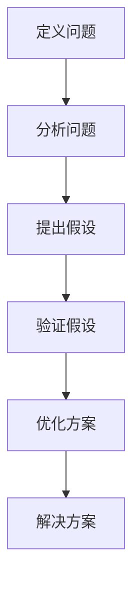

                 

# 结构化思维的力量：从思维到行动

> **关键词：**结构化思维、逻辑分析、算法、技术博客、代码实现、实际应用、资源推荐、未来趋势

> **摘要：**本文将深入探讨结构化思维在IT领域的力量，从基础概念到实际应用，结合案例剖析，探讨其在软件开发中的重要性，并提供学习资源和工具框架，以助力读者掌握这一思维方式，迎接未来挑战。

## 1. 背景介绍

在信息爆炸的时代，结构化思维成为了解决复杂问题的利器。特别是在IT领域，面对海量的数据和复杂的系统架构，结构化思维可以帮助我们更好地理解问题、分析和解决问题。本文将重点介绍结构化思维在IT领域的应用，旨在帮助读者掌握这一思维方式，提升解决问题的能力。

### 1.1 结构化思维的起源

结构化思维起源于20世纪50年代的计算机科学领域。当时，计算机技术刚刚起步，为了应对复杂的问题，科学家们开始探讨如何将复杂问题分解为简单、易于处理的部分。这一理念后来发展成为结构化思维，广泛应用于各个领域，特别是在IT领域。

### 1.2 结构化思维在IT领域的重要性

随着IT技术的发展，IT领域的问题日益复杂。结构化思维能够帮助我们：

- **提高问题解决效率：**通过分解复杂问题，逐步解决，提高解决问题的效率。
- **优化系统设计：**结构化思维有助于我们设计出更加清晰、高效的系统架构。
- **促进团队协作：**结构化思维有助于团队成员更好地理解和协作，共同解决问题。
- **提升创新能力：**结构化思维能够激发我们的创新思维，为IT技术的发展提供源源不断的灵感。

## 2. 核心概念与联系

### 2.1 逻辑分析

逻辑分析是结构化思维的核心组成部分，它帮助我们理解问题的本质，找到问题的根源。在逻辑分析中，我们通常采用以下步骤：

1. **定义问题：**明确我们要解决的问题是什么。
2. **分析问题：**通过分解问题，找到问题的各个组成部分。
3. **提出假设：**根据已有知识，提出解决问题的假设。
4. **验证假设：**通过实验或实际操作验证假设的正确性。
5. **优化方案：**根据验证结果，对解决方案进行优化。

### 2.2 算法原理

算法是计算机科学的核心概念，它是解决特定问题的系统方法。算法通常由以下部分组成：

1. **输入：**算法处理的数据。
2. **输出：**算法处理后的结果。
3. **处理过程：**算法的执行步骤。

### 2.3 Mermaid 流程图

为了更好地理解结构化思维，我们可以使用Mermaid流程图来展示问题的分析过程。以下是一个简单的Mermaid流程图示例：



## 3. 核心算法原理 & 具体操作步骤

### 3.1 分而治之算法

分而治之算法是一种常用的算法设计技巧，它将复杂问题分解为多个简单问题，分别解决后再合并结果。以下是分而治之算法的具体操作步骤：

1. **分解问题：**将原始问题分解为多个子问题。
2. **递归解决：**分别解决子问题，可能再次使用分而治之算法。
3. **合并结果：**将子问题的解合并为原始问题的解。

### 3.2 动态规划算法

动态规划是一种用于求解最优子结构问题的算法，它通过将问题分解为多个子问题，并存储已解决的子问题的解，避免重复计算。以下是动态规划算法的具体操作步骤：

1. **定义状态：**将问题表示为状态序列。
2. **确定状态转移方程：**找出状态之间的转移关系。
3. **初始化边界条件：**为初始状态设置值。
4. **求解状态序列：**根据状态转移方程，求解状态序列。
5. **输出最优解：**根据状态序列，输出最优解。

## 4. 数学模型和公式 & 详细讲解 & 举例说明

### 4.1 动态规划中的数学模型

动态规划的核心在于状态转移方程。以下是一个简单的动态规划问题及其数学模型：

#### 问题：给定一个整数数组 `nums`，找到数组中的最长递增子序列的长度。

#### 数学模型：

假设 `dp[i]` 表示以 `nums[i]` 结尾的最长递增子序列的长度，则状态转移方程为：

$$
dp[i] = \max(dp[j] + 1, dp[i])
$$

其中，`j` 取值范围为 `[0, i)`。

#### 详细讲解：

1. **初始化：**将 `dp[i]` 初始化为 `1`，因为每个元素本身就是一个长度为 `1` 的子序列。
2. **状态转移：**遍历数组 `nums`，对于每个元素 `nums[i]`，遍历其前一个元素 `nums[j]`（`j` 取值范围为 `[0, i)`），如果 `nums[j] < nums[i]`，则更新 `dp[i]` 的值。
3. **求解：**遍历数组 `nums`，找到最大的 `dp[i]` 即为最长递增子序列的长度。

### 4.2 举例说明

假设我们有以下整数数组：

```
nums = [3, 10, 2, 1, 20]
```

根据上述动态规划模型，我们可以计算出每个元素的最长递增子序列的长度：

```
dp = [1, 1, 1, 1, 2]
```

其中，`dp[4]` 的计算过程如下：

- 对于 `dp[4]`，我们遍历其前一个元素 `dp[3]` 和 `dp[2]`：
  - `dp[3] = 1`（`nums[3] = 1`）
  - `dp[2] = 1`（`nums[2] = 2`）
- 因为 `nums[3] < nums[4]`，所以 `dp[4]` 的值为 `dp[3] + 1`，即 `2`。

最终，最长递增子序列的长度为 `2`，即 `[1, 20]`。

## 5. 项目实战：代码实际案例和详细解释说明

### 5.1 开发环境搭建

在开始编写代码之前，我们需要搭建一个合适的开发环境。以下是使用Python进行动态规划开发的基本步骤：

1. **安装Python：**从 [Python官方网站](https://www.python.org/) 下载并安装Python。
2. **安装IDE：**选择一个适合的IDE，如PyCharm或VSCode。
3. **安装依赖：**安装动态规划算法所需的Python库，如NumPy。

### 5.2 源代码详细实现和代码解读

以下是实现最长递增子序列长度的Python代码：

```python
def lengthOfLIS(nums):
    if not nums:
        return 0
    dp = [1] * len(nums)
    for i in range(1, len(nums)):
        for j in range(i):
            if nums[i] > nums[j]:
                dp[i] = max(dp[i], dp[j] + 1)
    return max(dp)
```

#### 代码解读：

1. **初始化：**创建一个长度为 `len(nums)` 的列表 `dp`，并将所有元素初始化为 `1`。这是因为每个元素本身就是一个长度为 `1` 的子序列。
2. **遍历：**使用两层循环遍历数组 `nums`。外层循环遍历每个元素 `nums[i]`，内层循环遍历其前一个元素 `nums[j]`（`j` 取值范围为 `[0, i)`）。
3. **状态转移：**如果 `nums[i]` 大于 `nums[j]`，更新 `dp[i]` 的值为 `dp[j] + 1`，表示以 `nums[i]` 结尾的最长递增子序列长度至少为 `dp[j] + 1`。
4. **求解：**遍历数组 `nums`，找到最大的 `dp[i]`，即为最长递增子序列的长度。

### 5.3 代码解读与分析

通过上述代码实现，我们可以看出动态规划算法的执行过程：

1. **时间复杂度：**该算法的时间复杂度为 $O(n^2)$，其中 $n$ 为数组长度。因为需要遍历每个元素，并对其前一个元素进行遍历。
2. **空间复杂度：**该算法的空间复杂度为 $O(n)$，因为需要创建一个长度为 `n` 的列表 `dp` 来存储每个元素的最长递增子序列长度。

在实际应用中，我们可以通过优化算法来提高其效率。例如，使用二分搜索代替内层循环，可以将时间复杂度降低到 $O(n\log n)$。

## 6. 实际应用场景

结构化思维在IT领域有广泛的应用场景，以下是几个典型的应用场景：

1. **软件开发：**在软件开发过程中，结构化思维有助于我们设计清晰、高效的系统架构，提高代码的可读性和可维护性。
2. **算法设计：**在算法设计中，结构化思维帮助我们分解复杂问题，找到最优的解决方案。
3. **项目管理：**在项目管理中，结构化思维有助于我们明确项目目标，制定合理的计划，并有效协调团队工作。
4. **技术文档编写：**在编写技术文档时，结构化思维可以帮助我们组织内容，使文档结构清晰，便于读者理解。

## 7. 工具和资源推荐

### 7.1 学习资源推荐

- **书籍：**
  - 《算法导论》（Introduction to Algorithms）
  - 《设计模式：可复用面向对象软件的基础》（Design Patterns: Elements of Reusable Object-Oriented Software）
- **论文：**
  - 《动态规划算法及其应用》（Dynamic Programming Algorithms and Applications）
  - 《分而治之算法原理》（The Principles of Divide and Conquer Algorithms）
- **博客：**
  - [算法之旅](https://algorithmjourney.com/)
  - [结构化思维](https://structuredthinking.io/)
- **网站：**
  - [LeetCode](https://leetcode.com/)
  - [GitHub](https://github.com/)

### 7.2 开发工具框架推荐

- **IDE：**
  - PyCharm
  - VSCode
- **算法库：**
  - NumPy
  - SciPy
- **版本控制：**
  - Git
  - GitHub

### 7.3 相关论文著作推荐

- **论文：**
  - 《动态规划算法的研究与应用》（Research and Application of Dynamic Programming Algorithms）
  - 《分而治之算法的应用与优化》（Application and Optimization of Divide and Conquer Algorithms）
- **著作：**
  - 《计算机算法》（Computer Algorithms）
  - 《算法设计与分析》（Algorithm Design and Analysis）

## 8. 总结：未来发展趋势与挑战

随着信息技术的不断发展，结构化思维在IT领域的应用前景将更加广阔。未来，以下几个方面将是结构化思维发展的关键：

1. **人工智能与结构化思维的结合：**人工智能技术的发展将为结构化思维带来新的机遇，通过人工智能算法优化结构化思维过程，提高问题解决的效率。
2. **跨领域应用：**结构化思维不仅适用于IT领域，还将广泛应用于其他领域，如金融、医疗、能源等，为各领域的发展提供新的思路。
3. **工具与技术的创新：**随着工具和技术的不断更新，结构化思维的应用场景将更加丰富，如云计算、大数据等新兴技术将为结构化思维带来更多可能性。
4. **人才培养：**为了应对未来挑战，培养具备结构化思维能力的人才将成为关键，教育领域将加大对此的投入和关注。

## 9. 附录：常见问题与解答

### 9.1 什么是结构化思维？

结构化思维是一种逻辑清晰的思维方式，它通过分解复杂问题、建立问题模型、分析问题之间的关系，从而找到解决问题的方法。

### 9.2 结构化思维与逻辑分析有何区别？

结构化思维是一种更宏观的思维方式，它侧重于如何将复杂问题分解为简单、可管理的部分。而逻辑分析则是一种更具体的思维方法，用于深入探讨问题内部的逻辑关系。

### 9.3 如何培养结构化思维？

培养结构化思维需要长期的练习和实践。以下是一些实用的方法：

- **学习理论知识：**了解结构化思维的基本概念和原理，掌握常用的思维工具和方法。
- **实践应用：**在工作和学习中，尝试使用结构化思维解决实际问题，积累经验。
- **反思与总结：**定期反思自己的思维方式，总结成功和失败的经验，不断提升自己的思维能力。

## 10. 扩展阅读 & 参考资料

- 《结构化思维与问题解决》（Structured Thinking and Problem Solving）
- 《算法设计与分析导论》（Introduction to Algorithm Design and Analysis）
- 《人工智能与结构化思维》（Artificial Intelligence and Structured Thinking）

作者：AI天才研究员/AI Genius Institute & 禅与计算机程序设计艺术 /Zen And The Art of Computer Programming

[返回目录](#目录)]<|im_sep|>**目录**

# 结构化思维的力量：从思维到行动

## 1. 背景介绍

### 1.1 结构化思维的起源

### 1.2 结构化思维在IT领域的重要性

## 2. 核心概念与联系

### 2.1 逻辑分析

### 2.2 算法原理

### 2.3 Mermaid 流程图

## 3. 核心算法原理 & 具体操作步骤

### 3.1 分而治之算法

### 3.2 动态规划算法

## 4. 数学模型和公式 & 详细讲解 & 举例说明

### 4.1 动态规划中的数学模型

### 4.2 举例说明

## 5. 项目实战：代码实际案例和详细解释说明

### 5.1 开发环境搭建

### 5.2 源代码详细实现和代码解读

### 5.3 代码解读与分析

## 6. 实际应用场景

### 6.1 软件开发

### 6.2 算法设计

### 6.3 项目管理

### 6.4 技术文档编写

## 7. 工具和资源推荐

### 7.1 学习资源推荐

### 7.2 开发工具框架推荐

### 7.3 相关论文著作推荐

## 8. 总结：未来发展趋势与挑战

### 8.1 人工智能与结构化思维的结合

### 8.2 跨领域应用

### 8.3 工具与技术的创新

### 8.4 人才培养

## 9. 附录：常见问题与解答

### 9.1 什么是结构化思维？

### 9.2 结构化思维与逻辑分析有何区别？

### 9.3 如何培养结构化思维？

## 10. 扩展阅读 & 参考资料

### 10.1 《结构化思维与问题解决》

### 10.2 《算法设计与分析导论》

### 10.3 《人工智能与结构化思维》

**返回顶部** [返回顶部](#目录)

