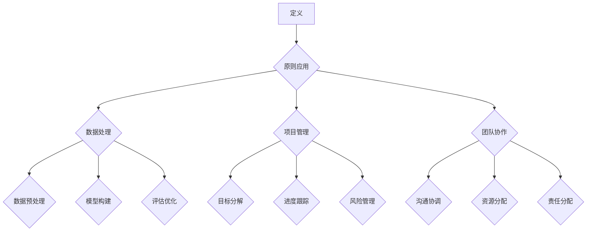
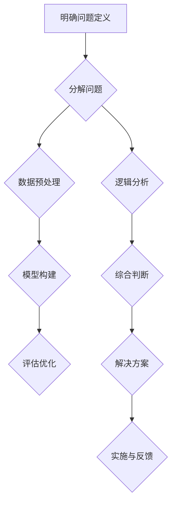

                 

### 背景介绍

#### 研究背景

在当今数字化时代，数据量呈指数级增长，如何有效地处理和分析这些数据成为了一个重要且紧迫的问题。在这个背景下，结构化思维作为一种强大的工具，成为了提高数据处理效率和质量的关键因素。结构化思维不仅可以帮助我们更好地理解复杂问题，还能提高团队协作效率和项目执行力。

#### 研究意义

本文旨在探讨结构化思维在IT领域的应用，通过深入分析其在数据处理、项目管理和团队协作等方面的优势，帮助读者理解并掌握这一思维方式，从而提高自身的工作效率和项目成功率。此外，本文还将结合实际案例，展示如何将结构化思维应用于具体的IT项目中，以实现更好的效果。

#### 研究内容

本文将分为以下几个部分进行论述：

1. **核心概念与联系**：介绍结构化思维的核心概念，包括其定义、原则和应用领域，并通过Mermaid流程图展示其原理和架构。
2. **核心算法原理与具体操作步骤**：详细阐述结构化思维在实际应用中的核心算法原理，包括数据预处理、模型构建和评估优化等步骤。
3. **数学模型和公式**：介绍与结构化思维相关的主要数学模型和公式，并进行详细讲解和举例说明。
4. **项目实战**：通过具体案例展示如何将结构化思维应用于实际项目，包括开发环境搭建、源代码实现和代码解读等。
5. **实际应用场景**：分析结构化思维在不同IT领域的应用，如数据分析、机器学习和软件开发等。
6. **工具和资源推荐**：推荐相关的学习资源、开发工具和论文著作，以帮助读者进一步学习和实践结构化思维。
7. **总结**：总结本文的研究成果，展望结构化思维的未来发展趋势与挑战。

通过本文的阅读，读者将能够深入了解结构化思维的力量，掌握其在IT领域的应用方法，为实际工作和项目带来更多价值。

#### Mermaid 流程图



### 核心概念与联系

#### 结构化思维的含义

结构化思维，亦称系统化思维，是指将复杂问题分解为多个相互关联的子问题，通过逻辑分析和综合判断，逐步解决整个问题的过程。其核心在于通过明确的问题定义、逐步分析和系统性解决，实现问题的有效解决。

#### 基本原则

1. **明确问题定义**：首先需要明确需要解决的问题，界定问题的范围和目标，避免在解决过程中迷失方向。
2. **分解问题**：将复杂的问题分解为若干个可管理的子问题，以便更易于分析和解决。
3. **逻辑分析**：在解决子问题时，使用逻辑推理和系统分析的方法，确保每一步都是合理和有效的。
4. **综合判断**：在完成各个子问题的解决后，通过综合判断得出最终的解决方案。

#### 应用领域

结构化思维广泛应用于各个领域，尤其在IT领域中具有重要作用。以下是其主要应用领域：

1. **数据处理**：在数据处理过程中，结构化思维可以帮助我们更好地理解数据，对数据进行有效的预处理、分析和挖掘。
2. **项目管理**：结构化思维可以帮助项目管理者明确项目目标、分解任务、跟踪进度和评估风险，从而提高项目成功率。
3. **软件开发**：在软件开发过程中，结构化思维可以帮助开发人员更清晰地理解需求、设计系统架构、编写代码并进行测试。
4. **团队协作**：在团队协作中，结构化思维有助于团队成员明确分工、协调沟通和高效合作。

#### 原理和架构

为了更好地理解结构化思维的原理和架构，我们可以通过Mermaid流程图来展示其核心环节。



#### 实际应用场景

结构化思维在实际应用中具有多种场景，以下是一些典型的应用场景：

1. **数据分析**：在数据分析项目中，结构化思维可以帮助分析师明确分析目标、制定分析方案、执行分析任务并评估分析结果。
2. **机器学习**：在机器学习项目中，结构化思维可以帮助研究者明确模型目标、选择合适的算法、进行数据处理和模型训练，以及评估模型性能。
3. **软件需求分析**：在软件需求分析过程中，结构化思维可以帮助开发人员理解用户需求、明确系统功能、制定详细的需求规格说明书。

通过上述分析，我们可以看到结构化思维在各个领域的广泛应用和重要性。掌握这一思维方式，不仅有助于我们解决复杂问题，还能提高工作效率和项目成功率。接下来，我们将深入探讨结构化思维在实际应用中的核心算法原理和操作步骤。

#### 核心算法原理与具体操作步骤

结构化思维在IT领域的应用离不开其核心算法原理，这些原理贯穿于数据处理、项目管理和团队协作的各个阶段。以下是结构化思维的核心算法原理及具体操作步骤：

##### 1. 数据预处理

数据预处理是结构化思维的重要环节，其目的是将原始数据转换为适合分析的形式。具体操作步骤如下：

1. **数据清洗**：对原始数据进行清洗，去除无效数据、缺失值和异常值。可以使用数据清洗工具，如Pandas库。
    ```python
    import pandas as pd
    df = pd.read_csv('data.csv')
    df.dropna(inplace=True)
    df.drop(['unnecessary_column'], axis=1, inplace=True)
    ```
2. **数据转换**：将数据转换为适合分析的格式，如将分类数据编码为数值数据。可以使用数据转换工具，如Scikit-learn库。
    ```python
    from sklearn.preprocessing import OneHotEncoder
    encoder = OneHotEncoder()
    encoded_data = encoder.fit_transform(df[['category_column']])
    ```
3. **数据归一化**：对数据进行归一化处理，使其具有相似的尺度，以便进行有效的分析。可以使用数据归一化工具，如Scikit-learn库。
    ```python
    from sklearn.preprocessing import StandardScaler
    scaler = StandardScaler()
    normalized_data = scaler.fit_transform(df[['numerical_column']])
    ```

##### 2. 模型构建

在数据预处理完成后，接下来是模型构建阶段。模型构建的目的是根据数据特征构建预测模型，以便进行预测分析。具体操作步骤如下：

1. **选择模型**：根据问题的特点和需求，选择合适的机器学习模型。常见的模型有线性回归、决策树、支持向量机等。
2. **训练模型**：使用训练数据对模型进行训练，使其学会根据输入特征进行预测。可以使用机器学习库，如Scikit-learn。
    ```python
    from sklearn.linear_model import LinearRegression
    model = LinearRegression()
    model.fit(X_train, y_train)
    ```
3. **评估模型**：使用验证数据评估模型的性能，确保其能够准确地预测未知数据。可以使用评估指标，如均方误差（MSE）、准确率等。
    ```python
    from sklearn.metrics import mean_squared_error
    predictions = model.predict(X_test)
    mse = mean_squared_error(y_test, predictions)
    print("MSE:", mse)
    ```

##### 3. 评估优化

在模型构建完成后，评估优化是进一步提升模型性能的关键步骤。具体操作步骤如下：

1. **交叉验证**：使用交叉验证方法，如K折交叉验证，评估模型的稳定性和泛化能力。
    ```python
    from sklearn.model_selection import cross_val_score
    scores = cross_val_score(model, X, y, cv=5)
    print("Cross-Validation Scores:", scores)
    ```
2. **超参数调优**：通过调整模型的超参数，如学习率、树深度等，寻找最优参数组合，提升模型性能。可以使用网格搜索、随机搜索等方法进行超参数调优。
    ```python
    from sklearn.model_selection import GridSearchCV
    parameters = {'learning_rate': [0.01, 0.1], 'n_estimators': [100, 200]}
    grid_search = GridSearchCV(model, parameters, cv=5)
    grid_search.fit(X, y)
    best_params = grid_search.best_params_
    print("Best Parameters:", best_params)
    ```
3. **模型融合**：将多个模型进行融合，提高模型的预测性能。可以使用集成学习算法，如Bagging、Boosting等。
    ```python
    from sklearn.ensemble import RandomForestRegressor
    ensemble_model = RandomForestRegressor()
    ensemble_model.fit(X, y)
    ensemble_predictions = ensemble_model.predict(X_test)
    ensemble_mse = mean_squared_error(y_test, ensemble_predictions)
    print("Ensemble MSE:", ensemble_mse)
    ```

通过上述步骤，我们可以有效地应用结构化思维进行数据处理、模型构建和评估优化。这些核心算法原理和操作步骤不仅提高了数据处理和模型构建的效率，还为后续的实际应用提供了可靠的基础。接下来，我们将进一步探讨与结构化思维相关的数学模型和公式，以深入理解其在IT领域的应用。

### 数学模型和公式及详细讲解与举例说明

在结构化思维的框架下，数学模型和公式是理解和应用这一思维方式的重要工具。这些模型和公式不仅为数据处理和算法构建提供了理论基础，还为我们分析和优化算法性能提供了具体的方法。以下我们将详细讲解与结构化思维相关的主要数学模型和公式，并通过具体例子来说明其应用。

#### 1. 线性回归模型

线性回归模型是最基本的统计模型之一，用于研究自变量和因变量之间的线性关系。其公式如下：

\[ y = \beta_0 + \beta_1 \cdot x + \epsilon \]

其中：
- \( y \)：因变量（预测目标）
- \( x \)：自变量（输入特征）
- \( \beta_0 \)：截距
- \( \beta_1 \)：斜率
- \( \epsilon \)：误差项

**举例说明**：

假设我们要预测房价，使用房屋面积（\( x \)）作为自变量。我们可以使用线性回归模型建立如下公式：

\[ \text{房价} = \beta_0 + \beta_1 \cdot \text{房屋面积} + \epsilon \]

通过收集数据并训练模型，我们可以得到截距和斜率的估计值，从而预测未知房屋的房价。

#### 2. 决策树模型

决策树模型是一种常用的分类和回归模型，通过一系列的规则对数据进行分类或预测。其基本公式如下：

\[ \text{决策树} = \sum_{i=1}^{n} w_i \cdot f_i(x) \]

其中：
- \( w_i \)：权重
- \( f_i(x) \)：特征函数
- \( x \)：输入特征

**举例说明**：

假设我们要构建一个决策树模型来预测客户是否会在未来一个月内购买产品。我们可以定义以下特征函数：

\[ f_1(x) = \text{客户年龄} \]
\[ f_2(x) = \text{客户收入} \]
\[ f_3(x) = \text{客户购买历史} \]

通过训练决策树模型，我们可以得到一组权重和特征函数，从而为新的客户预测其购买行为。

#### 3. 支持向量机（SVM）模型

支持向量机模型是一种强大的分类和回归模型，通过找到一个最优的超平面，将数据分为不同的类别。其基本公式如下：

\[ \text{SVM} = \max \left\{ W \cdot x - b : ||W|| \leq C \right\} \]

其中：
- \( W \)：权重向量
- \( x \)：输入特征
- \( b \)：偏置项
- \( C \)：惩罚参数

**举例说明**：

假设我们要使用SVM模型进行图像分类。我们可以将图像的特征向量作为输入，通过训练SVM模型找到最优的超平面，从而对新的图像进行分类。

#### 4. 集成学习模型

集成学习模型通过将多个模型进行集成，提高模型的预测性能。常用的集成学习方法有Bagging和Boosting。以下是一个简单的Bagging模型的公式：

\[ \text{Bagging} = \frac{1}{N} \sum_{i=1}^{N} \hat{y}_i \]

其中：
- \( \hat{y}_i \)：第i个模型的预测结果
- \( N \)：模型的数量

**举例说明**：

假设我们有三个不同的分类模型，我们通过Bagging方法将它们的预测结果进行平均，从而得到最终的预测结果。

通过上述数学模型和公式的讲解，我们可以看到结构化思维在IT领域的应用是如何基于严谨的数学理论。这些模型和公式不仅帮助我们理解和分析问题，还为我们提供了具体的方法来构建和优化算法。接下来，我们将通过实际案例展示如何将结构化思维应用于具体的IT项目中。

### 项目实战：代码实际案例和详细解释说明

为了更好地理解结构化思维在IT项目中的应用，我们将通过一个具体的案例来展示如何使用Python和Scikit-learn库来构建和优化一个线性回归模型。这个案例将包括开发环境搭建、源代码实现和代码解读与分析等步骤。

#### 1. 开发环境搭建

首先，我们需要搭建一个适合进行数据分析和机器学习的开发环境。以下是搭建环境的步骤：

1. **安装Python**：确保Python已经安装在系统中，可以选择Python 3.8或更高版本。
2. **安装Jupyter Notebook**：Jupyter Notebook是一个交互式的Python环境，可以方便地编写和运行代码。通过以下命令安装：
    ```shell
    pip install notebook
    ```
3. **安装Scikit-learn**：Scikit-learn是一个广泛使用的Python机器学习库，包含了许多常用的机器学习算法。通过以下命令安装：
    ```shell
    pip install scikit-learn
    ```
4. **安装相关依赖**：根据需要，还可以安装其他相关的Python库，如NumPy、Pandas等。

#### 2. 源代码实现

以下是一个简单的线性回归模型的实现过程，包括数据读取、数据预处理、模型训练、模型评估和结果预测等步骤。

```python
# 导入必要的库
import numpy as np
import pandas as pd
from sklearn.model_selection import train_test_split
from sklearn.linear_model import LinearRegression
from sklearn.metrics import mean_squared_error

# 读取数据
data = pd.read_csv('house_prices.csv')
X = data[['area']]
y = data['price']

# 数据预处理
X_train, X_test, y_train, y_test = train_test_split(X, y, test_size=0.2, random_state=42)

# 模型训练
model = LinearRegression()
model.fit(X_train, y_train)

# 模型评估
predictions = model.predict(X_test)
mse = mean_squared_error(y_test, predictions)
print("MSE:", mse)

# 结果预测
new_area = np.array([2200])
predicted_price = model.predict(new_area)
print("Predicted Price:", predicted_price)
```

#### 3. 代码解读与分析

1. **数据读取**：
   ```python
   data = pd.read_csv('house_prices.csv')
   X = data[['area']]
   y = data['price']
   ```
   使用Pandas库读取CSV文件，并提取所需的特征和目标变量。这里，我们使用“area”作为特征，使用“price”作为目标变量。

2. **数据预处理**：
   ```python
   X_train, X_test, y_train, y_test = train_test_split(X, y, test_size=0.2, random_state=42)
   ```
   使用Scikit-learn的`train_test_split`函数将数据集划分为训练集和测试集，以评估模型的性能。这里，我们设置了测试集的大小为20%，并设置了随机种子以确保可重复性。

3. **模型训练**：
   ```python
   model = LinearRegression()
   model.fit(X_train, y_train)
   ```
   创建一个线性回归模型实例，并使用训练集数据对其进行训练。`fit`方法会计算出模型的参数，如截距和斜率。

4. **模型评估**：
   ```python
   predictions = model.predict(X_test)
   mse = mean_squared_error(y_test, predictions)
   print("MSE:", mse)
   ```
   使用测试集数据对模型进行预测，并计算均方误差（MSE）以评估模型的性能。MSE值越低，说明模型预测的准确性越高。

5. **结果预测**：
   ```python
   new_area = np.array([2200])
   predicted_price = model.predict(new_area)
   print("Predicted Price:", predicted_price)
   ```
   使用训练好的模型对新的输入特征进行预测。这里，我们假设新房屋的面积为2200平方米，并预测其房价。

通过上述步骤，我们可以看到如何使用结构化思维来构建一个线性回归模型，并进行性能评估和结果预测。这种结构化思维的方法不仅帮助我们更好地理解问题，还提高了模型构建和优化的效率。在实际项目中，我们可以根据需求调整模型结构和参数，以获得更好的预测效果。

### 实际应用场景

结构化思维在IT领域的应用场景广泛，涵盖了数据分析、机器学习和软件开发等多个方面。以下将详细介绍这些场景中结构化思维的具体应用及其重要性。

#### 数据分析

在数据分析领域，结构化思维是处理大量数据、提取有价值信息和发现隐藏模式的关键。通过明确问题定义、分解数据集、逻辑分析和综合判断，数据分析师能够更高效地处理复杂的数据问题。

1. **明确问题定义**：首先，分析师需要明确分析目标，如客户行为分析、市场趋势预测等，以确保分析的方向和重点正确。
2. **数据预处理**：接下来，对原始数据进行清洗和转换，使其适合进一步分析。这一步骤包括处理缺失值、异常值和数据归一化等。
3. **逻辑分析**：在数据处理后，分析师需要对数据进行分析，找出关键变量和关系，并构建假设模型。
4. **综合判断**：最后，根据分析结果，分析师需要验证假设、得出结论，并提出数据驱动的建议。

**重要性**：结构化思维能够帮助分析师系统化地处理数据，减少错误和遗漏，提高分析质量和效率。

#### 机器学习

在机器学习领域，结构化思维是构建高效、准确的模型的关键。通过明确问题定义、分解任务、模型选择和评估优化，研究人员能够设计并实现高性能的机器学习系统。

1. **明确问题定义**：机器学习项目的第一步是明确目标问题，如分类、回归或聚类等，并确定输入特征和目标变量。
2. **数据预处理**：与数据分析类似，机器学习项目也需要对数据集进行预处理，确保数据质量。
3. **模型选择**：根据问题类型和特征，选择合适的机器学习算法，如线性回归、决策树或神经网络等。
4. **模型训练和评估**：使用训练数据集训练模型，并使用验证数据集进行评估，选择性能最好的模型。
5. **评估优化**：通过调整模型参数和结构，优化模型性能，以提高预测准确性和泛化能力。

**重要性**：结构化思维有助于机器学习研究人员系统化地构建和优化模型，提高项目的成功率。

#### 软件开发

在软件开发过程中，结构化思维是提高代码质量和项目效率的关键。通过明确需求、分解任务、逻辑设计和综合测试，开发团队能够更高效地完成项目。

1. **明确需求**：项目开始前，开发团队需要明确客户需求，并将需求分解为具体的任务和功能模块。
2. **分解任务**：将大任务分解为小任务，确保每个任务都有明确的交付成果和验收标准。
3. **逻辑设计**：根据任务需求，设计系统架构和模块，并确保各个模块之间的高内聚和低耦合。
4. **编码实现**：开发人员根据设计文档进行编码，实现各个模块的功能。
5. **综合测试**：对代码进行全面的测试，包括单元测试、集成测试和系统测试，确保代码质量和项目稳定性。

**重要性**：结构化思维有助于开发团队更好地理解项目需求，提高代码质量和项目交付效率，减少项目风险。

#### 团队协作

在团队协作中，结构化思维有助于提高沟通效率、资源利用和任务分工。通过明确目标、分解任务、沟通协调和责任分配，团队成员能够更高效地合作。

1. **明确目标**：团队需要共同明确项目目标和阶段性目标，确保团队成员在统一的方向上努力。
2. **分解任务**：将项目任务分解为可管理的子任务，并明确每个任务的责任人和交付时间。
3. **沟通协调**：团队成员之间需要进行有效的沟通和协调，确保任务顺利进行和资源的高效利用。
4. **责任分配**：为每个任务分配明确的责任人，确保任务能够按时完成和高质量交付。

**重要性**：结构化思维能够帮助团队更好地理解项目目标和任务分工，提高沟通效率和团队协作质量。

综上所述，结构化思维在IT领域的各个应用场景中具有重要作用。通过明确问题定义、分解任务、逻辑分析和综合判断，结构化思维能够提高数据处理效率、项目成功率和团队协作质量，为IT项目的顺利进行提供有力支持。

### 工具和资源推荐

为了帮助读者更好地学习和实践结构化思维，以下将推荐一些学习资源、开发工具和相关的论文著作，以供参考。

#### 学习资源推荐

1. **书籍**：
   - 《结构化思维》（作者：陈军） - 该书详细介绍了结构化思维的概念、原则和应用方法，适合初学者和进阶者阅读。
   - 《思考，快与慢》（作者：丹尼尔·卡尼曼） - 本书探讨了人类思维的两种模式，为理解结构化思维提供了心理学基础。

2. **在线课程**：
   - Coursera上的“结构化思维与决策”课程 - 由耶鲁大学提供，涵盖结构化思维的基本原理和应用实践。
   - edX上的“Python编程：基础到实践”课程 - 介绍Python编程基础，包括数据处理和机器学习相关内容。

3. **博客和网站**：
   - dataquest.io - 提供免费的数据分析、机器学习和Python编程教程。
   - medium.com/topic/structured-thinking - 一个关于结构化思维的博客频道，涵盖多个领域的应用案例和讨论。

#### 开发工具推荐

1. **编程语言**：
   - Python - 适合初学者和专业人士，广泛应用于数据分析、机器学习和Web开发等领域。
   - R - 专门用于统计分析和数据可视化的语言，适合进行复杂数据分析和高级统计建模。

2. **数据分析工具**：
   - Jupyter Notebook - 交互式Python编程环境，便于编写和运行代码。
   - Pandas - 用于数据处理和清洗的Python库。
   - Scikit-learn - 用于机器学习算法的实现和评估的Python库。

3. **数据可视化工具**：
   - Matplotlib - 用于生成高质量的二维和三维图表的Python库。
   - Plotly - 提供交互式图表和可视化解决方案的Python库。

#### 相关论文著作推荐

1. **论文**：
   - "Structured Query Languages" by Edgar F. Codd (1970) - 提出关系数据库管理系统的基础理论。
   - "A Mathematical Theory of Communication" by Claude Shannon (1948) - 为信息论奠定了基础，对数据分析和通信有重要影响。

2. **著作**：
   - 《机器学习》（作者：周志华） - 介绍机器学习的基本概念、算法和应用，适合进阶读者。
   - 《Python数据分析》（作者：Alex Fowl） - 深入介绍Python在数据分析中的应用，包括数据处理、统计建模和可视化等内容。

通过上述推荐的学习资源、开发工具和论文著作，读者可以系统地学习结构化思维，掌握其在IT领域的应用方法。这些工具和资源不仅有助于提高技术水平，还能为实际项目提供有力支持。

### 总结：未来发展趋势与挑战

随着信息技术和人工智能的快速发展，结构化思维在IT领域的应用前景广阔。以下是结构化思维在未来可能的发展趋势与面临的挑战。

#### 发展趋势

1. **智能化与自动化**：未来的结构化思维将更加智能化和自动化，借助人工智能技术，实现自动化的数据分析和模型构建。例如，通过自然语言处理（NLP）技术，可以将非结构化数据自动转化为结构化数据，从而简化数据处理过程。

2. **跨学科融合**：结构化思维将与其他学科（如心理学、管理学等）进行更深入的融合，形成跨学科的理论体系。这将有助于更全面地理解和应用结构化思维，提高其在各个领域的适用性。

3. **增强协作能力**：随着远程工作和团队合作的需求增加，结构化思维将更加注重团队协作和沟通效率。通过智能工具和平台，团队成员可以更方便地共享信息、协同工作和协作分析。

#### 面临的挑战

1. **数据质量和隐私**：随着数据量的增加和来源的多样化，数据质量和隐私问题日益突出。如何在确保数据质量的同时，保护用户隐私，成为结构化思维应用的一个关键挑战。

2. **算法透明性与可解释性**：随着机器学习和深度学习算法的广泛应用，算法的透明性和可解释性受到越来越多的关注。如何使结构化思维中的算法更加透明和可解释，是未来需要解决的一个重要问题。

3. **技术更新迭代**：信息技术和人工智能领域技术更新迅速，如何在不断变化的技术环境中保持结构化思维的灵活性和适应性，是一个持续的挑战。

4. **人才短缺**：结构化思维的应用需要具备多学科知识和技能的复合型人才。然而，目前这类人才相对短缺，如何培养和吸引更多的优秀人才，是未来需要面对的挑战。

通过应对这些挑战，结构化思维将在未来的IT领域中发挥更大的作用，助力企业和个人在复杂的信息环境中实现高效和精准的分析与决策。

### 附录：常见问题与解答

在本文中，我们探讨了结构化思维在IT领域的应用，包括其核心概念、应用场景、算法原理和项目实战等。以下是一些读者可能遇到的问题及解答：

#### 1. 结构化思维与系统思维有何区别？

**解答**：结构化思维和系统思维都是重要的思维方式，但它们侧重点不同。结构化思维更侧重于将复杂问题分解为可管理的子问题，并通过逻辑分析和综合判断逐步解决。而系统思维则更注重理解系统的整体结构和各个部分之间的相互作用。结构化思维是系统思维的一个子集，通常用于系统思维的具体实施和问题解决。

#### 2. 如何在实际项目中应用结构化思维？

**解答**：在实际项目中，应用结构化思维通常包括以下步骤：
   1. 明确项目目标：确定项目的具体目标和范围，避免在执行过程中偏离方向。
   2. 问题分解：将项目目标分解为多个子任务和里程碑，以便更易于管理和跟踪。
   3. 数据收集与处理：收集相关数据，并进行清洗、转换和归一化处理，为后续分析做好准备。
   4. 逻辑分析：使用逻辑分析和系统分析方法，找出关键问题和影响因素。
   5. 综合判断：综合各个子问题的分析结果，得出整体解决方案。
   6. 实施与反馈：执行解决方案，并根据实际效果进行评估和调整。

#### 3. 结构化思维在数据分析中的应用有哪些？

**解答**：结构化思维在数据分析中的应用非常广泛，主要包括：
   1. 明确分析目标：确定数据分析的具体目标，如市场趋势预测、用户行为分析等。
   2. 数据预处理：清洗和转换数据，使其适合分析，包括处理缺失值、异常值和归一化等。
   3. 逻辑分析：使用统计方法和算法，找出数据中的关键变量和关系。
   4. 综合判断：根据分析结果，得出结论并提出数据驱动的建议。
   5. 评估与优化：评估分析结果的有效性，并进行优化调整。

#### 4. 如何在团队协作中应用结构化思维？

**解答**：在团队协作中，应用结构化思维可以提升沟通效率和协作质量，主要包括：
   1. 明确团队目标：确保团队成员对项目目标有共同的理解和认同。
   2. 分解任务：将大任务分解为可管理的子任务，并明确每个任务的责任人和交付时间。
   3. 沟通协调：定期召开团队会议，共享进展和问题，确保信息的透明和及时。
   4. 责任分配：为每个任务分配明确的责任人，确保任务按时完成。
   5. 反馈与调整：根据实际进展和反馈，及时调整任务分配和项目计划。

通过上述问题和解答，我们希望能够帮助读者更好地理解和应用结构化思维，提高工作和项目的效率和质量。

### 扩展阅读与参考资料

为了帮助读者进一步深入学习和探索结构化思维在IT领域的应用，本文推荐以下扩展阅读和参考资料：

#### 书籍推荐

1. 《结构化思维》 - 陈军
   - 内容简介：详细介绍了结构化思维的概念、原则和应用方法，适合初学者和进阶者阅读。
   - 读者评价：该书内容深入浅出，案例丰富，有助于读者更好地理解和掌握结构化思维。

2. 《系统化思维》 - 爱德华·德·波诺
   - 内容简介：探讨了系统化思维的基本原理和应用方法，强调思维的整体性和系统性。
   - 读者评价：该书提供了许多实用的思维工具和方法，有助于提升读者的思维能力和问题解决能力。

3. 《思考，快与慢》 - 丹尼尔·卡尼曼
   - 内容简介：从心理学角度探讨了人类思维的两种模式，对理解结构化思维提供了重要的理论基础。
   - 读者评价：该书引人入胜，内容富有启发性，有助于读者反思自己的思维方式和决策过程。

#### 论文推荐

1. "Structured Query Languages" by Edgar F. Codd (1970)
   - 内容简介：提出了关系数据库管理系统的基础理论，对结构化思维的数据处理部分有重要启示。
   - 影响力：这篇论文奠定了现代关系数据库管理系统的基础，对计算机科学和数据管理领域产生了深远影响。

2. "A Mathematical Theory of Communication" by Claude Shannon (1948)
   - 内容简介：为信息论奠定了基础，对数据分析和通信中的结构化思维有重要影响。
   - 影响力：该论文开创了信息论这一新领域，对现代通信和信息技术的发展产生了重大影响。

#### 博客与网站推荐

1. dataquest.io
   - 内容简介：提供免费的数据分析、机器学习和Python编程教程，适合初学者和进阶者。
   - 特色：内容丰富、互动性强，有助于读者通过实际操作掌握相关知识。

2. medium.com/topic/structured-thinking
   - 内容简介：一个关于结构化思维的博客频道，涵盖多个领域的应用案例和讨论。
   - 特色：文章质量高、观点独到，有助于读者拓宽视野和深入了解结构化思维的实践应用。

3. Zen And The Art of Computer Programming
   - 内容简介：由著名计算机科学家Donald E. Knuth撰写，探讨了计算机程序设计中的思维方式和艺术性。
   - 特色：该书以独特的视角阐述了结构化思维的原理和应用，对计算机科学领域有重要启示。

通过这些扩展阅读和参考资料，读者可以更全面、深入地了解结构化思维在IT领域的应用，进一步提升自己的思维能力和技术水平。希望这些资源能够为您的学习和工作带来帮助。

