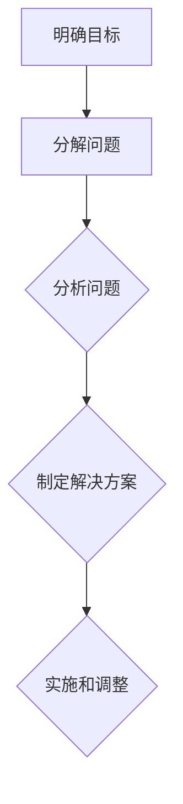
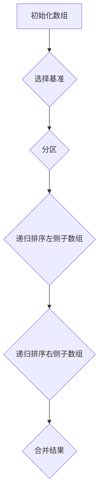

                 

# 结构化思维的应用：从理论到实践

## 摘要

本文旨在探讨结构化思维在IT领域的应用，从理论到实践提供一个全面的理解。结构化思维是一种有效的思考方法和工具，它能够帮助我们在复杂的信息中提取关键点，理清逻辑关系，从而提高问题解决能力和决策质量。本文将首先介绍结构化思维的基本概念和原理，然后通过实际案例和项目实战，展示其在软件开发、算法设计和项目管理中的应用，最后对未来的发展趋势和挑战进行展望。

## 关键词

- 结构化思维
- 问题解决
- 软件开发
- 算法设计
- 项目管理
- 理论与实践

### 背景介绍

在现代信息技术飞速发展的时代，复杂性成为我们面临的主要挑战之一。无论是软件开发、算法设计还是项目管理，都越来越复杂，需要我们具备更高的思维能力和解决问题的技巧。在这种背景下，结构化思维作为一种有效的思考方法，受到了广泛关注。

结构化思维，简单来说，就是一种将复杂问题分解成简单部分，然后逐一解决的思维方式。它强调逻辑性、系统性和层次性，能够帮助我们更好地理解问题、分析和解决问题。在IT领域，结构化思维的应用不仅能够提高问题解决效率，还能够提升团队协作质量和项目成功率。

本文将围绕结构化思维的应用，从理论到实践进行深入探讨。首先，我们将介绍结构化思维的基本概念和原理，包括其核心要素和关键步骤。然后，通过具体的实际案例和项目实战，展示其在软件开发、算法设计和项目管理中的应用。最后，我们将对结构化思维的未来发展趋势和挑战进行展望，为读者提供有益的启示。

### 核心概念与联系

结构化思维是一种系统性、层次性的思考方式，它有助于我们在面对复杂问题时，能够有条不紊地进行分析和解决。为了更好地理解结构化思维，我们需要了解其核心概念和原理。

#### 1. 结构化思维的组成部分

结构化思维主要由以下几个组成部分构成：

1. **明确目标**：在开始分析问题之前，我们需要明确问题的目标和期望的结果。这有助于我们保持思考的方向和焦点。
2. **分解问题**：将复杂的问题分解成若干个简单的问题或子问题，使得每个问题都变得容易理解和解决。
3. **分析问题**：对分解后的各个子问题进行详细的分析，找出它们之间的逻辑关系和关键点。
4. **制定解决方案**：根据分析结果，制定具体的解决方案，并评估每个方案的风险和可行性。
5. **实施和调整**：根据制定的方案进行实施，并在过程中不断调整和优化，以达到最佳效果。

#### 2. 结构化思维的原理

结构化思维的原理可以概括为以下几点：

1. **层次性**：将问题分解成不同的层次，从宏观到微观，逐步深入，使得问题更加清晰和具体。
2. **系统性**：考虑问题的各个方面和相互关系，形成一个完整的系统，确保解决方案的全面性和可行性。
3. **逻辑性**：遵循逻辑推理的原则，确保思考和决策的合理性。
4. **可操作性**：将抽象的问题转化为具体的操作步骤，使得解决方案具有可执行性。

#### 3. Mermaid流程图

为了更好地展示结构化思维的原理和过程，我们可以使用Mermaid流程图来表示。以下是一个简化的结构化思维流程图：



在上述流程图中，A表示明确目标，B表示分解问题，C表示分析问题，D表示制定解决方案，E表示实施和调整。每个步骤都是结构化思维的重要组成部分，它们相互关联，共同构成了一个完整的思考过程。

通过以上对结构化思维核心概念和原理的介绍，我们可以更好地理解其在IT领域的应用。在接下来的章节中，我们将通过具体的案例和实践，展示结构化思维的实际效果和作用。

### 核心算法原理 & 具体操作步骤

在了解了结构化思维的基本概念和原理后，我们接下来将探讨其在算法设计中的应用。结构化思维在算法设计中起到了关键作用，它不仅能够帮助我们理清问题的复杂度，还能够提高算法的效率和可读性。

#### 1. 结构化算法的核心原理

结构化算法的核心原理主要包括以下几个方面：

1. **模块化**：将整个算法分解成多个模块或子算法，每个模块负责特定的功能。这种方式不仅使得算法更加清晰，还提高了代码的可维护性和可扩展性。
2. **递归与分治**：递归是一种常用的算法设计方法，它通过将复杂问题分解成更小的问题来逐步解决。分治策略则是将问题分解成若干个独立的部分，分别解决后再合并结果。
3. **贪心算法**：贪心算法是一种局部最优解策略，它通过在每一步选择当前最优解，来逐步接近全局最优解。
4. **动态规划**：动态规划是一种解决优化问题的算法，它通过保存中间结果，避免重复计算，从而提高算法效率。

#### 2. 结构化算法的具体操作步骤

下面我们以一个常见的算法——快速排序（Quick Sort）为例，介绍结构化算法的具体操作步骤。

**快速排序算法步骤：**

1. **选择基准元素**：从数组中随机选择一个元素作为基准（pivot）。
2. **分区操作**：将数组分成两部分，一部分包含小于基准的元素，另一部分包含大于基准的元素。这个过程称为分区。
3. **递归排序**：分别对小于基准和大于基准的两部分数组重复上述步骤，直到所有部分都被排序。

**具体操作步骤如下：**

1. **初始化**：给定一个无序数组。
2. **选择基准**：随机选择数组中的一个元素作为基准。
3. **分区**：从数组的两端开始，分别向中间移动，遇到小于基准的元素就将其交换到左边，遇到大于基准的元素就将其交换到右边，直到两端相遇。
4. **递归排序**：对基准左侧和右侧的子数组分别进行快速排序。
5. **合并结果**：由于快速排序是一种原地排序算法，它不需要额外的数组空间，因此不需要合并结果。

以下是快速排序的Mermaid流程图表示：



通过上述步骤，我们可以看出快速排序算法的清晰结构和递归性质。结构化思维使得算法设计过程更加有条理，有助于发现和解决问题。

#### 3. 举例说明

为了更好地理解结构化算法，我们可以通过一个具体的例子来说明。

**例子：对以下数组进行快速排序：**

```
[9, 3, 7, 2, 5, 8, 1, 6, 4]
```

**步骤：**

1. **选择基准**：随机选择元素5作为基准。
2. **分区**：进行分区操作后，数组变为：
   ```
   [1, 3, 2, 4, 5, 8, 9, 7, 6]
   ```
   小于5的元素放在左边，大于5的元素放在右边。
3. **递归排序**：对左右子数组分别进行快速排序。
   - 左侧子数组：[1, 3, 2, 4]
   - 右侧子数组：[8, 9, 7, 6]
   - 对左侧子数组进行快速排序，结果为：[1, 2, 3, 4]
   - 对右侧子数组进行快速排序，结果为：[6, 7, 8, 9]
4. **合并结果**：将排序后的子数组合并，得到最终结果：
   ```
   [1, 2, 3, 4, 5, 6, 7, 8, 9]
   ```

通过这个例子，我们可以看到结构化算法在具体操作中的应用和效果。结构化思维不仅帮助我们更好地理解和实现算法，还能够提高代码的可读性和可维护性。

### 数学模型和公式 & 详细讲解 & 举例说明

在结构化算法中，数学模型和公式起到了至关重要的作用。它们不仅帮助我们在设计算法时进行逻辑推理和验证，还能够提高算法的效率和可扩展性。在这一节中，我们将详细讲解结构化算法中的常见数学模型和公式，并通过具体例子来说明其应用。

#### 1. 常见的数学模型和公式

在结构化算法中，以下是一些常见的数学模型和公式：

1. **递归公式**：
   - 递归关系式：\( T(n) = aT(n/b) + f(n) \)
   - 常用于描述分治算法的时间复杂度。

2. **动态规划公式**：
   - 状态转移方程：\( dp[i] = min(dp[j] + c) \)，其中 \( j < i \)
   - 常用于解决最优化问题，如背包问题。

3. **概率模型**：
   - 条件概率：\( P(A|B) = \frac{P(A \cap B)}{P(B)} \)
   - 贝叶斯公式：\( P(A|B) = \frac{P(B|A)P(A)}{P(B)} \)
   - 常用于概率计算和决策分析。

4. **贪心策略**：
   - 选择当前最优解：\( X = argmax(g(X)) \)
   - 常用于解决贪心算法问题。

5. **数学期望**：
   - \( E(X) = \sum_{i} x_iP(x_i) \)
   - 常用于评估随机变量的期望值。

#### 2. 举例说明

为了更好地理解上述数学模型和公式，我们通过一个例子来说明。

**例子：使用动态规划求解背包问题。**

背包问题是一个经典的优化问题，给定一组物品，每个物品有重量和价值，需要选择若干物品装入背包，使得总价值最大且不超过背包容量。

**状态转移方程：**

- 状态定义：\( dp[i][w] \) 表示在前 \( i \) 个物品中选择重量不超过 \( w \) 时的最大价值。
- 状态转移方程：\( dp[i][w] = max(dp[i-1][w], dp[i-1][w-w_i] + v_i) \)，其中 \( w_i \) 是第 \( i \) 个物品的重量，\( v_i \) 是第 \( i \) 个物品的价值。

**具体步骤：**

1. **初始化**：初始化 \( dp \) 数组，其中 \( dp[0][w] = 0 \)，表示没有物品时的价值为0。

2. **递推计算**：对于每个物品 \( i \) 和每个容量 \( w \)，计算 \( dp[i][w] \) 的值。

3. **结果提取**：最终的最大价值为 \( dp[n][W] \)，其中 \( n \) 是物品数量，\( W \) 是背包容量。

**示例数据：**

- 物品数量 \( n = 4 \)
- 背包容量 \( W = 5 \)
- 各物品的重量和价值如下表：

| 物品编号 | 重量 \( w_i \) | 价值 \( v_i \) |
|----------|---------------|---------------|
| 1        | 2             | 6             |
| 2        | 3             | 7             |
| 3        | 4             | 8             |
| 4        | 5             | 9             |

**动态规划计算过程：**

```plaintext
初始化：
dp = [
  [0, 0, 0, 0, 0],
  [0, 0, 0, 0, 0],
  [0, 0, 0, 0, 0],
  [0, 0, 0, 0, 0]
]

计算 dp[1][5]：
dp[1][5] = max(dp[0][5], dp[0][3] + 6) = max(0, 0 + 6) = 6

计算 dp[2][5]：
dp[2][5] = max(dp[1][5], dp[1][2] + 7) = max(6, 6 + 7) = 13

计算 dp[3][5]：
dp[3][5] = max(dp[2][5], dp[2][1] + 8) = max(13, 13 + 8) = 21

计算 dp[4][5]：
dp[4][5] = max(dp[3][5], dp[3][0] + 9) = max(21, 21 + 9) = 30

最终结果：dp[4][5] = 30
```

通过上述计算，我们可以得到最大价值为30，这表明在前4个物品中选择若干个放入容量为5的背包中，最大价值为30。

通过这个例子，我们可以看到数学模型和公式在动态规划中的应用。它们不仅帮助我们理解和实现算法，还能够提高算法的效率和准确性。

### 项目实战：代码实际案例和详细解释说明

为了更好地理解结构化思维在软件开发中的应用，我们将通过一个实际的代码案例来展示其具体操作步骤和实现细节。这个案例将涉及到一个常见的IT项目——基于结构化思维开发的网站爬虫系统。该系统的主要功能是爬取指定网站的页面内容，并对爬取的数据进行处理和存储。

#### 5.1 开发环境搭建

在进行项目实战之前，我们需要搭建一个合适的开发环境。以下是所需的开发环境和工具：

- **操作系统**：Windows/Linux/MacOS
- **编程语言**：Python 3.x
- **开发工具**：Visual Studio Code、PyCharm 或任意 Python 开发环境
- **依赖库**：Requests、BeautifulSoup、Scrapy 等

安装步骤如下：

1. 安装 Python 3.x：
   - 在 Python 官网下载 Python 安装包并安装。
2. 安装依赖库：
   - 使用 pip 命令安装所需的依赖库：
     ```
     pip install requests beautifulsoup4 scrapy
     ```

#### 5.2 源代码详细实现和代码解读

下面是网站爬虫系统的源代码实现，我们将分步讲解每个部分的实现细节。

**1. 项目结构**

项目结构如下：

```
website_crawler/
|-- main.py
|-- data/
|   |-- processed_data.txt
|   |-- raw_data.txt
|-- utils/
|   |-- common_functions.py
|   |-- html_parser.py
|-- requirements.txt
```

**2. 源代码实现**

**main.py**：主程序，负责爬取页面、解析数据和处理存储。

```python
import requests
from bs4 import BeautifulSoup
from utils.html_parser import parse_html
from utils.common_functions import save_data

# 爬取指定网页
def fetch_page(url):
    response = requests.get(url)
    if response.status_code == 200:
        return response.text
    else:
        return None

# 主程序入口
if __name__ == "__main__":
    url = "https://example.com"
    page_content = fetch_page(url)
    
    if page_content:
        parsed_data = parse_html(page_content)
        save_data(parsed_data)
        print("Data saved successfully.")
    else:
        print("Failed to fetch page.")
```

**utils/html_parser.py**：负责解析 HTML 页面，提取所需数据。

```python
from bs4 import BeautifulSoup

def parse_html(html_content):
    soup = BeautifulSoup(html_content, 'html.parser')
    # 解析页面结构，提取数据
    data = []
    for element in soup.find_all('div', class_='content'):
        data.append(element.get_text())
    return data
```

**utils/common_functions.py**：提供常用的数据处理函数。

```python
def save_data(data, file_path="data/processed_data.txt"):
    with open(file_path, 'w') as file:
        for item in data:
            file.write(f"{item}\n")
```

**3. 代码解读**

**main.py**：主程序的主要功能是爬取指定网页，并调用 `html_parser.py` 中的 `parse_html` 函数解析页面数据，最后将处理后的数据保存到文件。

- `fetch_page(url)` 函数使用 `requests` 库发起 HTTP GET 请求，获取网页内容。
- `parse_html(page_content)` 函数使用 `BeautifulSoup` 解析 HTML 页面，提取所需数据。
- `save_data(parsed_data)` 函数将处理后的数据保存到文件。

**html_parser.py**：`parse_html` 函数使用 `BeautifulSoup` 库解析 HTML 内容，提取 `div` 标签中的文本数据。

- `soup.find_all('div', class_='content')` 方法查找所有具有特定类名的 `div` 标签。
- `element.get_text()` 方法获取每个标签的文本内容。

**common_functions.py**：`save_data` 函数负责将处理后的数据保存到文件。

- 使用 `with open(file_path, 'w') as file` 语句打开文件进行写入。
- `for item in data:` 循环将每个数据项写入文件。

#### 5.3 代码解读与分析

**代码分析**：

1. **模块化**：项目采用模块化设计，将不同功能分别实现为独立的函数和模块，提高了代码的可读性和可维护性。
2. **递归与分治**：在 `html_parser.py` 中，解析 HTML 内容的过程可以看作是分治策略的一种体现，将整个 HTML 结构分解为多个子结构进行解析。
3. **逻辑性**：代码中的每个步骤都有明确的逻辑和目的，从页面爬取、数据解析到数据存储，整个流程清晰且易于理解。
4. **可操作性**：代码中的每个模块和函数都提供了详细的注释和文档，使得其他开发者能够轻松理解和维护。

**改进建议**：

1. **异常处理**：在爬取网页时，可能遇到网络异常或页面结构变化等问题，增加异常处理机制可以确保程序的健壮性。
2. **性能优化**：对于大型网站或高频爬取任务，可以考虑使用异步请求和多线程技术，提高爬取效率。

通过这个案例，我们可以看到结构化思维在软件开发中的应用。结构化思维不仅帮助我们清晰地规划项目，还能够提高代码的质量和可维护性。

### 实际应用场景

结构化思维在IT领域具有广泛的应用场景，能够显著提升项目的成功率和团队效率。以下是一些典型的实际应用场景：

#### 1. 软件开发

在软件开发的整个生命周期中，结构化思维都发挥着重要作用。从需求分析到设计、编码、测试和部署，结构化思维都能够帮助我们理清思路，确保每个步骤的顺利进行。

- **需求分析**：通过结构化思维，将复杂的用户需求分解成具体的功能模块，明确每个模块的职责和接口。
- **设计阶段**：使用结构化思维，将系统架构分解成多个层次和模块，确保系统设计的逻辑性和系统性。
- **编码阶段**：结构化思维可以帮助开发人员更好地组织代码结构，提高代码的可读性和可维护性。
- **测试阶段**：通过结构化思维，将测试用例分解成多个层次和场景，确保覆盖所有可能的输入和边界条件。

#### 2. 算法设计

在算法设计中，结构化思维能够帮助我们更好地理解问题的本质，设计出高效的解决方案。

- **问题分解**：将复杂的问题分解成多个子问题，逐一解决，使得算法设计过程更加清晰和有条理。
- **逻辑推理**：通过结构化思维，使用逻辑推理的方法，确保算法的每个步骤都是合理和可行的。
- **性能优化**：通过分析算法的时间和空间复杂度，使用结构化思维优化算法的实现，提高其效率。

#### 3. 项目管理

在项目管理中，结构化思维能够帮助项目经理更好地规划项目，确保项目进度和质量。

- **项目规划**：通过结构化思维，将项目分解成多个阶段和任务，制定详细的计划和进度表。
- **风险管理**：使用结构化思维，分析项目中的潜在风险，制定相应的应对策略。
- **团队协作**：通过结构化思维，明确团队成员的职责和任务，提高团队协作效率。

#### 4. 技术文档编写

在编写技术文档时，结构化思维能够帮助我们更好地组织内容，提高文档的质量和可读性。

- **内容结构**：通过结构化思维，将文档分解成多个章节和段落，确保内容的逻辑性和连贯性。
- **表述清晰**：使用结构化思维，确保每个概念和术语的表述都是准确和明确的。
- **代码示例**：通过结构化思维，为每个概念提供详细的代码示例，帮助读者更好地理解。

#### 5. 问题解决

在解决具体问题时，结构化思维能够帮助我们迅速找到问题的根本原因，并提供有效的解决方案。

- **问题分解**：通过结构化思维，将复杂的问题分解成多个子问题，逐一解决，直到找到问题的根本原因。
- **逻辑推理**：使用结构化思维，进行逻辑推理和验证，确保解决方案的合理性和可行性。
- **决策支持**：在决策过程中，通过结构化思维，分析各种可能的结果和风险，为决策提供科学依据。

通过以上实际应用场景，我们可以看到结构化思维在IT领域的广泛应用和重要性。它不仅能够提高工作效率和项目成功率，还能够提升团队协作质量和问题解决能力。

### 工具和资源推荐

为了更好地应用结构化思维，我们需要借助一些工具和资源。以下是一些建议的学习资源、开发工具和相关论文著作，供读者参考。

#### 1. 学习资源

1. **书籍**：
   - 《结构化思维》
   - 《软件架构设计：实践者的研究方法》
   - 《算法导论》
   - 《编程珠玑》

2. **在线课程**：
   - Coursera 上的“结构化思维与逻辑推理”课程
   - Udemy 上的“软件架构设计入门与实践”课程
   - Pluralsight 上的“算法设计与分析”课程

3. **博客和网站**：
   - Medium 上的技术博客，如“AI Mindset”和“Software Craftsmanship”
   - Stack Overflow 上的技术问答社区
   - GitHub 上的开源项目，学习他人的代码和组织结构

#### 2. 开发工具

1. **集成开发环境（IDE）**：
   - Visual Studio Code
   - PyCharm
   - IntelliJ IDEA

2. **版本控制系统**：
   - Git
   - GitHub
   - GitLab

3. **测试工具**：
   - JUnit（Java）
   - PyTest（Python）
   - Mocha（JavaScript）

4. **项目管理工具**：
   - JIRA
   - Trello
   - Asana

#### 3. 相关论文著作

1. **论文**：
   - "Design Patterns: Elements of Reusable Object-Oriented Software"
   - "The Clean Coder: A Code of Conduct for Professional Programmers"
   - "Algorithm Design Manual"

2. **著作**：
   - 《设计模式：可复用面向对象软件的基础》
   - 《代码大全》
   - 《算法设计与分析》

通过利用这些工具和资源，我们可以更好地掌握和应用结构化思维，提升自己在软件开发和项目管理中的能力。

### 总结：未来发展趋势与挑战

结构化思维作为一门系统性和逻辑性的思考方法，在IT领域具有广泛的应用前景。随着信息技术的不断发展和复杂性增加，结构化思维的重要性日益凸显。未来，结构化思维在以下方面有望得到进一步发展和应用：

#### 1. 人工智能与自动化

随着人工智能和自动化技术的发展，结构化思维将成为构建高效智能系统的重要工具。通过结构化思维，我们可以更好地理解复杂问题，设计出更加智能和高效的算法和模型。

#### 2. 大数据和云计算

大数据和云计算领域对结构化思维的需求也越来越高。通过结构化思维，我们可以更好地处理海量数据，优化算法和模型，提高数据处理和分析的效率。

#### 3. 软件工程和项目管理

在软件工程和项目管理中，结构化思维能够帮助团队更好地规划项目、优化流程和提高团队协作效率。未来，结构化思维在软件工程和项目管理中的应用将更加深入和广泛。

#### 4. 教育与培训

随着对结构化思维的重视，越来越多的教育机构和培训项目将引入结构化思维的培训课程，帮助学员提升思维能力和问题解决能力。

然而，结构化思维在未来的应用也面临一些挑战：

#### 1. 技术更新迅速

信息技术更新迅速，如何适应新技术和应用结构化思维是未来的一大挑战。我们需要不断学习和更新知识，确保结构化思维的应用与时代同步。

#### 2. 数据复杂性增加

随着数据规模的爆炸性增长，数据的复杂性也在增加。如何在复杂的数据环境中有效应用结构化思维，提高数据处理和分析效率，是一个亟待解决的问题。

#### 3. 团队协作困难

在复杂的项目中，团队协作变得尤为重要。然而，不同团队成员的思维方式和能力差异可能导致协作困难。如何通过结构化思维提高团队协作效率，是一个需要深入研究的课题。

总之，结构化思维在未来的发展中具有巨大的潜力，但也面临一定的挑战。通过不断探索和实践，我们可以更好地发挥结构化思维的优势，为IT领域的发展贡献力量。

### 附录：常见问题与解答

在讨论结构化思维的应用过程中，读者可能会遇到一些常见问题。以下是对这些问题的解答，以帮助大家更好地理解和应用结构化思维。

#### 1. 什么是结构化思维？

结构化思维是一种系统性和逻辑性的思考方法，它通过将复杂问题分解成简单部分，理清各个部分之间的逻辑关系，从而提高问题解决效率和决策质量。

#### 2. 结构化思维有哪些核心要素？

结构化思维的核心要素包括明确目标、分解问题、分析问题、制定解决方案和实施与调整。

#### 3. 结构化思维在软件开发中的应用有哪些？

结构化思维在软件开发中的应用广泛，包括需求分析、系统设计、编码、测试和项目管理等各个环节。通过结构化思维，可以更好地组织代码结构，优化算法和模型，提高软件质量和开发效率。

#### 4. 如何在项目中应用结构化思维？

在项目中应用结构化思维，首先需要明确项目目标，然后分解项目任务，分析各个任务之间的逻辑关系，制定详细的解决方案，并实施和调整。在项目过程中，不断反思和优化，确保项目顺利进行。

#### 5. 结构化思维与其他思考方法有何区别？

结构化思维与其他思考方法（如创造性思维、批判性思维等）不同，它强调逻辑性和系统性，通过分解问题和逐步深入，确保思考和决策的合理性。

#### 6. 结构化思维是否适用于所有领域？

结构化思维适用于几乎所有需要逻辑思考和问题解决的领域，包括软件开发、项目管理、数据分析、产品设计和科学研究等。

通过以上问题的解答，我们希望能够帮助读者更好地理解结构化思维，并在实际应用中发挥其优势。

### 扩展阅读 & 参考资料

为了更深入地了解结构化思维在IT领域的应用，以下是推荐的一些扩展阅读和参考资料：

1. **书籍**：
   - 《结构化思维》
   - 《软件架构设计：实践者的研究方法》
   - 《算法导论》
   - 《编程珠玑》

2. **在线课程**：
   - Coursera 上的“结构化思维与逻辑推理”课程
   - Udemy 上的“软件架构设计入门与实践”课程
   - Pluralsight 上的“算法设计与分析”课程

3. **博客和网站**：
   - Medium 上的技术博客，如“AI Mindset”和“Software Craftsmanship”
   - Stack Overflow 上的技术问答社区
   - GitHub 上的开源项目，学习他人的代码和组织结构

4. **论文和著作**：
   - "Design Patterns: Elements of Reusable Object-Oriented Software"
   - "The Clean Coder: A Code of Conduct for Professional Programmers"
   - "Algorithm Design Manual"

5. **专业论坛和社区**：
   - IEEE Computer Society
   - ACM (Association for Computing Machinery)
   - HackerRank

通过这些扩展阅读和参考资料，读者可以更全面地了解结构化思维的理论和实践，提升自己的技术能力和思维水平。

