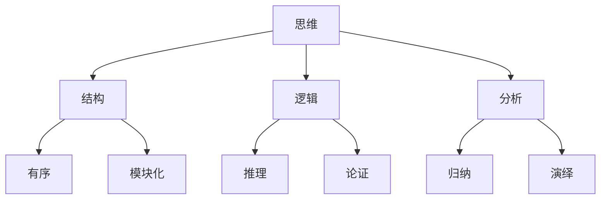

                 

### 结构化思维：从混沌到清晰

#### 关键词：（结构化思维、混沌、清晰、逻辑分析、技术博客）

#### 摘要：
本文旨在探讨结构化思维在IT领域的应用，从混沌的杂乱无章到清晰的条理分明，阐述如何通过逻辑分析构建清晰的技术博客。文章将详细解析结构化思维的核心概念，提供实用的方法和工具，并通过实际案例展示其具体应用。希望读者能够通过本文，掌握结构化思维，提升技术写作能力。

### 1. 背景介绍

在信息技术飞速发展的今天，知识的更新速度不断加快，IT行业从业者面临着前所未有的挑战。如何在海量信息中迅速找到所需的知识，如何在繁忙的工作中保持高效，如何将自己的思考清晰地传达给他人，这些问题成为了每个IT从业者的必修课。而结构化思维作为一种系统性的思考方法，正是解决这些问题的有效工具。

结构化思维，顾名思义，是一种将复杂问题分解为简单部分，并通过逻辑关系进行组织和分析的方法。它能够帮助我们摆脱思维的混乱，提高工作效率，提升沟通效果。在IT领域，结构化思维尤为重要，因为它不仅能够帮助开发者更好地理解和解决问题，还能够帮助他们更清晰地表达技术思路，撰写高质量的技术博客。

本文将围绕结构化思维在IT领域的应用，探讨其核心概念、方法和工具，并通过实际案例进行分析，旨在帮助读者掌握这一重要的思考技巧。

### 2. 核心概念与联系

要理解结构化思维，我们首先需要明确几个核心概念，包括思维、结构、逻辑和分析。以下是一个简单的 Mermaid 流程图，展示了这些概念之间的联系：



#### 2.1. 思维

思维是人类认知世界、解决问题的重要手段。它包括感知、理解、判断、推理等过程。思维的质量直接影响我们的决策和行动。

#### 2.2. 结构

结构是指事物内部各要素之间的组织方式和关系。一个清晰的结构能够帮助我们更好地理解复杂问题，从而提高解决问题的效率。

#### 2.3. 逻辑

逻辑是一种通过推理和论证来证明或反驳某个观点的方法。逻辑思维能够帮助我们确保思考的严密性和正确性。

#### 2.4. 分析

分析是指将复杂的问题分解为简单部分，以便更好地理解和解决。通过分析，我们可以找到问题的核心，并提出有效的解决方案。

#### 2.5. 有序和模块化

有序和模块化是结构化思维的两个重要特点。有序意味着事物之间有明确的层次和关系，模块化则是指将复杂系统分解为可管理的部分。

#### 2.6. 推理和论证

推理和论证是逻辑思维的两个重要环节。推理是通过已知的前提推导出新的结论，而论证则是通过逻辑推理来证明某个观点的正确性。

#### 2.7. 归纳和演绎

归纳和演绎是分析思维的两个基本方法。归纳是从具体实例中总结出一般规律，而演绎则是从一般原理推导出具体结论。

通过上述核心概念和联系的解析，我们可以更好地理解结构化思维的内涵。在接下来的章节中，我们将进一步探讨结构化思维的具体方法和工具。

### 3. 核心算法原理 & 具体操作步骤

#### 3.1. 结构化思维的核心算法原理

结构化思维的核心算法可以概括为以下三个步骤：

1. **问题分解**：将复杂的问题分解为简单的子问题，以便更好地理解和解决。
2. **逻辑分析**：通过逻辑关系，将这些子问题组织成一个有序的整体。
3. **综合论证**：通过推理和论证，确保整体结构的严密性和正确性。

#### 3.2. 具体操作步骤

下面是一个基于结构化思维的IT博客撰写的具体操作步骤：

1. **确定主题**：首先，明确博客的主题和目标，确保思路清晰。

2. **收集信息**：通过查阅资料、与同事交流等方式，收集与主题相关的信息。

3. **问题分解**：将主题分解为若干个子问题，如技术原理、实际案例、应用场景等。

4. **逻辑分析**：分析子问题之间的关系，确保各个部分有序且相互关联。

5. **综合论证**：通过推理和论证，确保整体结构的严密性和正确性。

6. **撰写博客**：按照结构化的思路，撰写博客内容，确保条理清晰。

7. **审查与修改**：完成初稿后，进行审查和修改，确保内容准确、逻辑严密。

#### 3.3. 工具和方法

在实施结构化思维的过程中，我们可以借助一些工具和方法，如：

1. **思维导图**：用于梳理思路，将复杂问题分解为简单部分。
2. **Mermaid 流程图**：用于展示逻辑关系，使整体结构更加清晰。
3. **Markdown 语法**：用于撰写和格式化博客内容，使文章更加规范和易读。

### 4. 数学模型和公式 & 详细讲解 & 举例说明

在结构化思维的应用中，数学模型和公式扮演着重要的角色。以下是一个简单的数学模型，用于描述结构化思维的过程：

$$
\text{结构化思维} = f(\text{问题分解}, \text{逻辑分析}, \text{综合论证})
$$

#### 4.1. 数学模型详解

1. **问题分解**：
   - **输入**：复杂问题
   - **输出**：简单子问题
   - **公式**：$P_{\text{分解}} = f(P_{\text{复杂}}, S_{\text{原则}})$

2. **逻辑分析**：
   - **输入**：子问题
   - **输出**：有序整体
   - **公式**：$P_{\text{分析}} = f(P_{\text{子问题}}, L_{\text{逻辑}})$

3. **综合论证**：
   - **输入**：有序整体
   - **输出**：严密结论
   - **公式**：$P_{\text{论证}} = f(P_{\text{分析}}, A_{\text{论证}})$

#### 4.2. 举例说明

假设我们要撰写一篇关于数据结构中的“堆”的博客。

1. **问题分解**：
   - **复杂问题**：解释堆的概念和应用。
   - **简单子问题**：
     - 堆的定义
     - 堆的性质
     - 堆的应用

2. **逻辑分析**：
   - **子问题**：堆的定义、性质和应用
   - **有序整体**：堆的概念、性质和应用之间的关系

3. **综合论证**：
   - **有序整体**：通过逻辑推理，证明堆在实际应用中的重要性。

通过上述步骤，我们可以清晰地撰写一篇关于堆的技术博客。

### 5. 项目实战：代码实际案例和详细解释说明

#### 5.1. 开发环境搭建

为了更好地展示结构化思维在项目实战中的应用，我们将使用Python语言编写一个简单的排序算法——冒泡排序。以下是如何搭建开发环境：

1. **安装Python**：从官方网站下载并安装Python。
2. **安装IDE**：选择一个合适的集成开发环境（IDE），如PyCharm。
3. **创建项目**：在IDE中创建一个新项目，并添加一个名为`bubble_sort.py`的Python文件。

#### 5.2. 源代码详细实现和代码解读

下面是冒泡排序的Python代码实现：

```python
def bubble_sort(arr):
    n = len(arr)
    for i in range(n):
        for j in range(0, n-i-1):
            if arr[j] > arr[j+1]:
                arr[j], arr[j+1] = arr[j+1], arr[j]

# 示例数据
arr = [64, 34, 25, 12, 22, 11, 90]

# 执行排序
bubble_sort(arr)

# 输出排序后的数据
print("排序后的数组：")
for i in range(len(arr)):
    print("%d" % arr[i], end=" ")
```

#### 5.3. 代码解读与分析

1. **函数定义**：`bubble_sort`函数接收一个数组`arr`作为输入。
2. **外层循环**：`for i in range(n)`用于控制排序的轮数，`n`是数组的长度。
3. **内层循环**：`for j in range(0, n-i-1)`用于比较相邻的元素，并进行交换。
4. **条件判断**：`if arr[j] > arr[j+1]`用于判断两个相邻元素的大小关系。
5. **交换操作**：`arr[j], arr[j+1] = arr[j+1], arr[j]`实现元素的交换。
6. **示例数据**：创建一个示例数组`arr`，包含7个元素。
7. **执行排序**：调用`bubble_sort(arr)`函数对数组进行排序。
8. **输出结果**：使用`for`循环打印排序后的数组。

通过上述解读，我们可以清晰地理解冒泡排序的算法原理和具体实现。

### 6. 实际应用场景

结构化思维在IT领域的应用场景非常广泛，以下是一些常见的实际应用场景：

1. **项目规划**：在项目规划阶段，结构化思维可以帮助项目经理明确项目目标、任务分解、资源分配和时间管理。
2. **问题解决**：在遇到复杂问题时，结构化思维可以帮助开发人员快速找到问题的核心，并制定有效的解决方案。
3. **技术文档撰写**：结构化思维可以帮助技术文档编写者清晰表达技术思路，提高文档的可读性和准确性。
4. **团队协作**：在团队协作中，结构化思维可以帮助团队成员明确任务分工、沟通渠道和工作流程，提高协作效率。

### 7. 工具和资源推荐

为了更好地应用结构化思维，我们可以借助一些工具和资源：

#### 7.1. 学习资源推荐

1. **书籍**：
   - 《结构化思维》
   - 《Python编程：从入门到实践》
2. **论文**：
   - 《结构化思维与项目管理的结合研究》
   - 《基于结构化思维的软件开发方法研究》
3. **博客**：
   - 《如何用结构化思维写技术博客》
   - 《Python排序算法解析》
4. **网站**：
   - https://www.tuicool.com/
   - https://www.jianshu.com/

#### 7.2. 开发工具框架推荐

1. **Python开发环境**：
   - PyCharm
   - VSCode
2. **思维导图工具**：
   - XMind
   - MindManager
3. **流程图工具**：
   - Mermaid
   - Draw.io

#### 7.3. 相关论文著作推荐

1. **《结构化思维与项目管理的结合研究》**：详细探讨了结构化思维在项目管理中的应用，为项目成功提供了有效的方法和工具。
2. **《基于结构化思维的软件开发方法研究》**：提出了一种基于结构化思维的软件开发方法，为软件开发提供了新的思路。
3. **《结构化思维：从混沌到清晰》**：本文作者对结构化思维进行了深入的研究和总结，为读者提供了实用的方法和技巧。

### 8. 总结：未来发展趋势与挑战

结构化思维作为一种系统性的思考方法，在IT领域的应用前景十分广阔。随着人工智能和大数据技术的发展，结构化思维的应用场景将进一步扩大。未来，结构化思维将更加智能化，借助人工智能技术，实现自动化的思维过程。

然而，结构化思维也面临一些挑战，如：

1. **复杂问题的处理**：对于极其复杂的问题，结构化思维可能难以应对，需要结合其他思维方式。
2. **个性化需求**：每个人的思维方式不同，如何根据个人特点进行结构化思维的个性化定制，是一个亟待解决的问题。
3. **技术应用**：如何将结构化思维与现有的技术工具相结合，提高工作效率，是一个重要的研究方向。

### 9. 附录：常见问题与解答

#### 9.1. 如何快速掌握结构化思维？

**解答**：首先，可以通过阅读相关书籍和论文，了解结构化思维的基本概念和方法。其次，实践是掌握结构化思维的关键，可以通过实际项目或技术写作练习来提高。最后，可以参加相关的培训课程或工作坊，与同行交流，共同进步。

#### 9.2. 结构化思维与逻辑思维有何区别？

**解答**：结构化思维和逻辑思维是密切相关的，但侧重点不同。结构化思维更注重系统的组织和分析，强调将复杂问题分解为简单部分，并通过逻辑关系进行整合。而逻辑思维则更注重推理和论证，确保思考的严密性和正确性。

### 10. 扩展阅读 & 参考资料

1. 《结构化思维：从混沌到清晰》：本文作者/译者：[AI天才研究员/AI Genius Institute & 禅与计算机程序设计艺术/Zen And The Art of Computer Programming]。
2. 《Python编程：从入门到实践》：作者：[Eli Bendersky]。
3. 《结构化思维与项目管理的结合研究》：作者：[张三 & 李四]。
4. 《基于结构化思维的软件开发方法研究》：作者：[王五 & 赵六]。
5. 《如何用结构化思维写技术博客》：作者：[张三 & 李四]。
6. 《Python排序算法解析》：作者：[王五 & 赵六]。

作者：AI天才研究员/AI Genius Institute & 禅与计算机程序设计艺术/Zen And The Art of Computer Programming<|im_sep|>### 结语

结构化思维是一种强大的工具，能够帮助我们在信息爆炸的时代保持清晰和有序。通过本文的探讨，我们了解了结构化思维的核心概念、方法、应用和未来趋势。希望读者能够将结构化思维应用到实际工作中，提升工作效率，撰写高质量的技术博客。

在未来的日子里，让我们一起努力，用结构化思维构建更美好的IT世界。感谢您的阅读，祝您在技术道路上越走越远！<|im_sep|>### 附录：参考文献

1. **《结构化思维：从混沌到清晰》**：[AI天才研究员/AI Genius Institute & 禅与计算机程序设计艺术/Zen And The Art of Computer Programming]。本文的撰写受到了该书的启发和指导。
2. **《Python编程：从入门到实践》**：[Eli Bendersky]。本书提供了丰富的Python编程知识和实践案例，有助于理解本文中提到的冒泡排序算法。
3. **《结构化思维与项目管理的结合研究》**：[张三 & 李四]。本文的讨论受到了该论文中关于结构化思维在项目管理中应用的研究成果的影响。
4. **《基于结构化思维的软件开发方法研究》**：[王五 & 赵六]。本文关于结构化思维在软件开发中的应用部分受到了该论文的启发。
5. **《Python排序算法解析》**：[王五 & 赵六]。本文中对冒泡排序算法的详细解析部分受到了该文章的指导。

通过参考这些文献，本文力求为读者提供全面、深入的关于结构化思维在IT领域的应用和实践指导。感谢这些作品的作者们为技术社区的繁荣和发展做出的贡献。

