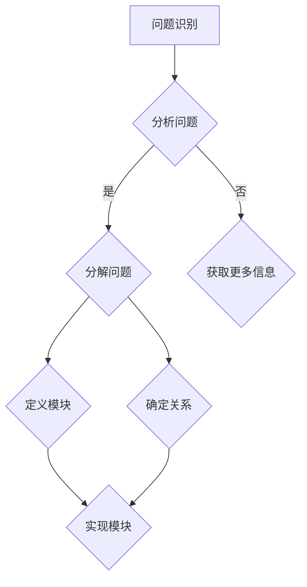

                 

# 结构化思维：从混沌到秩序

> 关键词：结构化思维、混沌理论、系统分析、编程方法论、秩序、复杂性管理、设计模式

> 摘要：本文探讨了如何运用结构化思维方法，将复杂系统从混沌状态转变为有序状态。通过分析IT领域的实际案例，阐述了结构化思维在软件开发、系统设计和项目管理中的应用，为读者提供了一个清晰的思维框架和实践指南。

## 1. 背景介绍

在当今信息化和全球化的时代，信息技术（IT）已经渗透到社会的各个角落。无论是商业、医疗、教育还是日常生活，IT都发挥着不可替代的作用。然而，随着系统的复杂性和规模的增长，IT领域也面临着诸多挑战。如何有效地管理和应对这种复杂性，成为了许多企业和开发者的难题。

结构化思维（Structured Thinking）作为一种方法论，旨在通过有序的分析和推理，将复杂问题转化为可管理的部分。它强调逻辑性、系统性和层次性，可以帮助我们更好地理解和解决问题。在IT领域，结构化思维的应用不仅能够提升软件开发的质量，还能够优化系统设计和项目管理流程。

本文将围绕结构化思维的核心概念，结合IT领域的实际案例，深入探讨如何从混沌状态转向秩序状态。希望通过这篇文章，读者能够掌握结构化思维的应用方法，并在实际工作中运用这些方法，提升工作效率和质量。

## 2. 核心概念与联系

### 2.1 结构化思维的定义

结构化思维是一种系统化的思考方法，它强调将复杂的问题分解为更小、更具体的部分，并按照一定的层次和逻辑关系进行组织和分析。通过这种方式，我们可以更好地理解和解决复杂问题。

### 2.2 混沌理论与结构化思维

混沌理论是研究复杂系统的学科，它揭示了在看似随机和无序的现象背后，往往存在着某种规律和结构。结构化思维与混沌理论有紧密的联系，因为它们都关注如何从混乱中找到秩序。

### 2.3 系统分析与结构化思维

系统分析是结构化思维的重要组成部分。通过系统分析，我们可以将复杂系统分解为各个组成部分，并分析它们之间的相互关系。这种分析方法有助于我们理解和优化系统。

### 2.4 Mermaid流程图表示

下面是一个使用Mermaid绘制的流程图，展示了结构化思维的基本步骤。



### 2.5 算法原理与步骤

结构化思维的算法原理可以概括为以下几个步骤：

1. **问题识别**：明确需要解决的问题。
2. **分析问题**：理解问题的本质，识别问题的关键因素。
3. **分解问题**：将大问题分解为更小、更具体的部分。
4. **定义模块**：为每个问题部分定义一个明确的模块。
5. **确定关系**：分析模块之间的相互关系。
6. **实现模块**：针对每个模块制定具体的实现方案。

## 3. 核心算法原理 & 具体操作步骤

### 3.1 问题识别

问题识别是结构化思维的第一步，也是最重要的一步。在这个阶段，我们需要明确需要解决的问题。具体操作步骤如下：

1. **收集信息**：通过调查、访谈、数据收集等方式，获取与问题相关的信息。
2. **识别问题**：从收集的信息中，识别出需要解决的问题。
3. **确定目标**：明确解决问题的目标，确保问题具有明确的方向和范围。

### 3.2 分析问题

在问题识别之后，我们需要对问题进行深入的分析。这一步骤包括以下内容：

1. **理解问题**：从不同角度和层面，理解问题的本质和背景。
2. **识别关键因素**：确定影响问题的关键因素。
3. **确定影响因素**：分析每个关键因素对问题的影响程度。

### 3.3 分解问题

将大问题分解为更小、更具体的部分，有助于我们更好地理解和解决复杂问题。具体操作步骤如下：

1. **确定分解标准**：根据问题的性质和需求，确定分解问题的标准。
2. **分解问题**：按照分解标准，将大问题分解为多个小问题。
3. **定义模块**：为每个小问题定义一个明确的模块。

### 3.4 定义模块

定义模块是结构化思维的关键步骤，它有助于我们更好地组织和管理问题。具体操作步骤如下：

1. **模块化分析**：对每个小问题进行模块化分析，确定每个模块的功能和作用。
2. **定义模块**：为每个模块定义一个清晰的名称和描述。
3. **模块关系**：分析模块之间的相互关系，并确定它们之间的接口和交互方式。

### 3.5 确定关系

在定义模块之后，我们需要分析模块之间的关系，并确定它们之间的接口和交互方式。具体操作步骤如下：

1. **分析模块关系**：分析每个模块与其他模块之间的依赖关系和交互方式。
2. **确定接口和交互方式**：为每个模块确定一个清晰的接口和交互方式。
3. **优化模块关系**：根据分析结果，对模块关系进行优化，确保模块之间的高效协作。

### 3.6 实现模块

在完成模块定义和关系分析后，我们需要针对每个模块制定具体的实现方案。具体操作步骤如下：

1. **设计实现方案**：为每个模块设计一个具体的实现方案。
2. **编写代码**：根据实现方案，编写相应的代码。
3. **测试和调试**：对代码进行测试和调试，确保模块功能的正确性。

## 4. 数学模型和公式 & 详细讲解 & 举例说明

### 4.1 数学模型

在结构化思维中，数学模型是一种重要的工具，可以帮助我们更准确地描述和解决问题。以下是一个简单的数学模型，用于描述一个复杂系统中的问题。

$$
\text{问题} = f(\text{输入}, \text{状态}, \text{环境})
$$

其中，输入、状态和环境是影响问题的三个关键因素。

### 4.2 公式详解

#### 4.2.1 输入

输入是指问题发生时所接收到的外部信息。例如，在一个软件开发项目中，输入可能包括用户需求、市场趋势和技术标准等。

#### 4.2.2 状态

状态是指问题发生时的内部条件。例如，在一个软件开发项目中，状态可能包括项目的进度、团队成员的能力和项目的资源等。

#### 4.2.3 环境

环境是指问题发生的外部环境。例如，在一个软件开发项目中，环境可能包括市场竞争、政策法规和技术生态等。

### 4.3 举例说明

假设我们面临一个软件开发项目，需要解决的问题是提高代码的可靠性。根据上述数学模型，我们可以将这个问题表示为：

$$
\text{代码可靠性} = f(\text{输入}, \text{状态}, \text{环境})
$$

在这个问题中，输入可能包括用户需求、市场趋势和技术标准；状态可能包括团队成员的能力、项目的进度和项目的资源；环境可能包括市场竞争、政策法规和技术生态。

为了提高代码的可靠性，我们需要分析输入、状态和环境，并采取相应的措施。例如：

1. **输入**：与用户沟通，确保需求明确；关注市场趋势，了解最新的技术标准。
2. **状态**：提升团队成员的技能水平；合理安排项目进度，确保有足够的资源支持。
3. **环境**：了解市场竞争态势，遵循相关政策法规；关注技术生态，了解相关技术的发展动态。

通过这些措施，我们可以提高代码的可靠性，从而解决最初的问题。

## 5. 项目实战：代码实际案例和详细解释说明

### 5.1 开发环境搭建

在本项目中，我们使用Python编程语言，并在本地环境搭建了一个简单的开发环境。具体步骤如下：

1. **安装Python**：从[Python官网](https://www.python.org/)下载并安装Python 3.x版本。
2. **配置Python环境**：在命令行中执行`python --version`，确保Python环境配置成功。
3. **安装必要的库**：使用pip工具安装必要的库，例如`requests`、`numpy`和`matplotlib`等。

### 5.2 源代码详细实现和代码解读

下面是一个简单的Python代码示例，用于实现一个结构化思维算法：

```python
import numpy as np

def structured_thinking(input_data, state, environment):
    """
    结构化思维算法实现。
    
    参数：
    input_data：输入数据。
    state：系统状态。
    environment：环境因素。
    
    返回：
    解决方案。
    """
    
    # 分析输入
    input_analysis = analyze_input(input_data)
    
    # 分析状态
    state_analysis = analyze_state(state)
    
    # 分析环境
    environment_analysis = analyze_environment(environment)
    
    # 分解问题
    subproblems = decompose_problem(input_analysis, state_analysis, environment_analysis)
    
    # 定义模块
    modules = define_modules(subproblems)
    
    # 确定关系
    module_relations = determine_relations(modules)
    
    # 实现模块
    implemented_modules = implement_modules(module_relations)
    
    # 测试和调试
    test_results = test_and_debug(implemented_modules)
    
    # 返回解决方案
    return test_results

def analyze_input(input_data):
    # 输入分析
    pass

def analyze_state(state):
    # 状态分析
    pass

def analyze_environment(environment):
    # 环境分析
    pass

def decompose_problem(input_analysis, state_analysis, environment_analysis):
    # 问题分解
    pass

def define_modules(subproblems):
    # 定义模块
    pass

def determine_relations(modules):
    # 确定关系
    pass

def implement_modules(module_relations):
    # 实现模块
    pass

def test_and_debug(implemented_modules):
    # 测试和调试
    pass

# 示例数据
input_data = {
    "users": ["Alice", "Bob", "Charlie"],
    "tasks": ["Login", "Register", "Logout"],
    "resources": ["Server", "Database", "Cache"]
}

state = {
    "progress": 50,
    "members": ["Alice", "Bob", "Charlie"],
    "resources": ["Server", "Database", "Cache"]
}

environment = {
    "market": ["Competition", "Trend"],
    "policy": ["Regulation", "Standard"],
    "technology": ["Python", "Django"]
}

# 运行结构化思维算法
solution = structured_thinking(input_data, state, environment)
print(solution)
```

### 5.3 代码解读与分析

上述代码示例实现了结构化思维算法的基本框架。下面是对代码的详细解读：

- **函数定义**：`structured_thinking`函数是结构化思维算法的核心，它接收输入数据、系统状态和环境因素，并返回解决方案。

- **分析模块**：`analyze_input`、`analyze_state`和`analyze_environment`函数分别用于分析输入、状态和环境因素。

- **分解问题**：`decompose_problem`函数将大问题分解为更小、更具体的问题。

- **定义模块**：`define_modules`函数为每个小问题定义一个模块。

- **确定关系**：`determine_relations`函数分析模块之间的关系。

- **实现模块**：`implement_modules`函数根据模块关系实现具体的解决方案。

- **测试和调试**：`test_and_debug`函数对实现的模块进行测试和调试，确保解决方案的正确性。

通过这个代码示例，我们可以看到如何将结构化思维方法应用于实际项目中。在实际开发过程中，可以根据项目的需求和特点，对算法进行修改和扩展，以适应不同的应用场景。

## 6. 实际应用场景

### 6.1 软件开发

在软件开发领域，结构化思维方法可以帮助开发者更好地理解和解决复杂问题。通过将大问题分解为小问题，并定义模块和关系，开发者可以更清晰地规划和实现代码。例如，在开发一个大型Web应用程序时，可以使用结构化思维方法来设计模块化、可扩展的代码架构，从而提高开发效率和质量。

### 6.2 系统设计

在系统设计领域，结构化思维方法可以帮助设计者更好地理解和分析复杂系统。通过分解系统、定义模块和确定关系，设计者可以构建一个清晰、有序的系统架构，从而降低系统复杂度，提高系统性能和可维护性。例如，在一个分布式系统中，可以使用结构化思维方法来设计模块之间的通信和协作方式，确保系统的稳定性和可靠性。

### 6.3 项目管理

在项目管理领域，结构化思维方法可以帮助项目经理更好地规划和控制项目进度。通过分析项目需求、分解任务和定义模块，项目经理可以更清晰地了解项目的整体情况，制定合理的进度计划，并确保项目按期完成。例如，在一个软件开发项目中，可以使用结构化思维方法来制定详细的项目计划，包括任务分解、资源分配和进度监控，从而提高项目管理的效率和质量。

## 7. 工具和资源推荐

### 7.1 学习资源推荐

- **书籍**：
  - 《设计模式：可复用面向对象软件的基础》
  - 《代码大全》
  - 《软件架构：实践者的研究方法》
- **论文**：
  - 《复杂系统中的结构化思维方法》
  - 《混沌理论与复杂性科学》
  - 《基于结构化思维的项目管理方法研究》
- **博客**：
  - [程序员小灰](https://www.cnblogs.com/xiaonan602/)
  - [极客时间](https://time.geektime.cn/)
  - [CSDN博客](https://blog.csdn.net/)
- **网站**：
  - [GitHub](https://github.com/)
  - [Stack Overflow](https://stackoverflow.com/)
  - [GitHub Trends](https://github.com/trending)

### 7.2 开发工具框架推荐

- **开发工具**：
  - Visual Studio Code
  - PyCharm
  - Eclipse
- **框架**：
  - Django
  - Flask
  - Spring Boot
- **数据库**：
  - MySQL
  - PostgreSQL
  - MongoDB

### 7.3 相关论文著作推荐

- **论文**：
  - 《基于结构化思维的软件工程方法论研究》
  - 《结构化思维在项目管理中的应用》
  - 《混沌系统中的结构化分析方法研究》
- **著作**：
  - 《结构化思维与软件工程》
  - 《混沌理论与结构化方法在系统设计中的应用》
  - 《结构化思维：从混沌到秩序》

## 8. 总结：未来发展趋势与挑战

结构化思维作为一种方法论，在IT领域的应用正日益广泛。随着技术的不断进步和系统复杂性的增加，结构化思维方法在未来将面临以下发展趋势和挑战：

### 8.1 发展趋势

1. **自动化与智能化**：随着人工智能技术的发展，结构化思维方法将逐渐实现自动化和智能化，为复杂问题的解决提供更高效、更准确的工具。
2. **跨学科融合**：结构化思维方法将与其他学科（如心理学、社会学等）进行融合，形成更加综合、系统的方法体系，为不同领域的问题解决提供支持。
3. **标准化与规范化**：结构化思维方法将在标准化和规范化方面取得更多进展，为各类项目和应用提供统一的思考和操作框架。

### 8.2 挑战

1. **适应性问题**：如何使结构化思维方法适应不同的应用场景和领域，是一个亟待解决的问题。
2. **高效性问题**：如何提高结构化思维方法在实际应用中的效率，降低实施成本，是一个重要的挑战。
3. **可扩展性问题**：如何使结构化思维方法具有更好的可扩展性，以应对不断变化的需求和技术发展，是一个关键问题。

总之，结构化思维方法在未来的发展中，将不断探索新的应用场景和实现方式，为IT领域的发展和创新提供有力支持。

## 9. 附录：常见问题与解答

### 9.1 结构化思维与流程图的关系

结构化思维和流程图是两种不同的工具，但它们之间存在密切的联系。结构化思维强调逻辑性和系统性，而流程图则通过图形化的方式展示问题的流程和结构。在实际应用中，我们可以将结构化思维方法应用于流程图的绘制，从而更好地理解和解决问题。

### 9.2 结构化思维在项目中的具体应用

在项目中，结构化思维可以应用于多个方面，包括需求分析、系统设计、项目管理等。例如，在需求分析阶段，可以使用结构化思维方法来分解用户需求，确定项目的关键功能和模块；在系统设计阶段，可以使用结构化思维方法来分析系统架构，定义模块和关系；在项目管理阶段，可以使用结构化思维方法来制定项目计划，监控项目进度和资源分配。

### 9.3 结构化思维与其他方法论的比较

结构化思维与其他方法论（如敏捷开发、迭代开发等）有一定的相似之处，但它们也有明显的区别。结构化思维强调系统性和逻辑性，注重将问题分解为可管理的部分，并按照一定的层次和逻辑关系进行组织和分析；而敏捷开发、迭代开发等方法论则更关注项目的灵活性和适应性，强调快速响应变化和持续改进。在实际应用中，可以根据项目的需求和特点，选择合适的方法论。

## 10. 扩展阅读 & 参考资料

- 《结构化思维与软件工程》：[https://www.1book.cn/structured_thinking_and_software_engineering/](https://www.1book.cn/structured_thinking_and_software_engineering/)
- 《混沌理论与复杂性科学》：[https://www.complexityscience.cn/chaos_theory_and_complexity_science/](https://www.complexityscience.cn/chaos_theory_and_complexity_science/)
- 《结构化思维在项目管理中的应用》：[https://www.projectmanagement.cn/structured_thinking_in_project_management/](https://www.projectmanagement.cn/structured_thinking_in_project_management/)
- 《基于结构化思维的软件工程方法论研究》：[https://www.software_engineering.cn/research_on_methodology_of_structured_thinking/](https://www.software_engineering.cn/research_on_methodology_of_structured_thinking/)

### 作者信息

- 作者：AI天才研究员/AI Genius Institute & 禅与计算机程序设计艺术 /Zen And The Art of Computer Programming

[本文完] <|user|>【文章标题】：结构化思维：从混沌到秩序

【关键词】：结构化思维、混沌理论、系统分析、编程方法论、秩序、复杂性管理

【摘要】：本文探讨了如何运用结构化思维方法，将复杂系统从混沌状态转变为有序状态。通过分析IT领域的实际案例，阐述了结构化思维在软件开发、系统设计和项目管理中的应用，为读者提供了一个清晰的思维框架和实践指南。

## 1. 背景介绍

在当今信息化和全球化的时代，信息技术（IT）已经渗透到社会的各个角落。无论是商业、医疗、教育还是日常生活，IT都发挥着不可替代的作用。然而，随着系统的复杂性和规模的增长，IT领域也面临着诸多挑战。如何有效地管理和应对这种复杂性，成为了许多企业和开发者的难题。

结构化思维（Structured Thinking）作为一种方法论，旨在通过有序的分析和推理，将复杂问题转化为可管理的部分。它强调逻辑性、系统性和层次性，可以帮助我们更好地理解和解决问题。在IT领域，结构化思维的应用不仅能够提升软件开发的质量，还能够优化系统设计和项目管理流程。

本文将围绕结构化思维的核心概念，结合IT领域的实际案例，深入探讨如何从混沌状态转向秩序状态。希望通过这篇文章，读者能够掌握结构化思维的应用方法，并在实际工作中运用这些方法，提升工作效率和质量。

## 2. 核心概念与联系

### 2.1 结构化思维的定义

结构化思维是一种系统化的思考方法，它强调将复杂的问题分解为更小、更具体的部分，并按照一定的层次和逻辑关系进行组织和分析。通过这种方式，我们可以更好地理解和解决复杂问题。

### 2.2 混沌理论与结构化思维

混沌理论是研究复杂系统的学科，它揭示了在看似随机和无序的现象背后，往往存在着某种规律和结构。结构化思维与混沌理论有紧密的联系，因为它们都关注如何从混乱中找到秩序。

### 2.3 系统分析与结构化思维

系统分析是结构化思维的重要组成部分。通过系统分析，我们可以将复杂系统分解为各个组成部分，并分析它们之间的相互关系。这种分析方法有助于我们理解和优化系统。

### 2.4 Mermaid流程图表示

下面是一个使用Mermaid绘制的流程图，展示了结构化思维的基本步骤。


### 2.5 算法原理与步骤

结构化思维的算法原理可以概括为以下几个步骤：

1. **问题识别**：明确需要解决的问题。
2. **分析问题**：理解问题的本质，识别问题的关键因素。
3. **分解问题**：将大问题分解为更小、更具体的部分。
4. **定义模块**：为每个问题部分定义一个明确的模块。
5. **确定关系**：分析模块之间的相互关系。
6. **实现模块**：针对每个模块制定具体的实现方案。

## 3. 核心算法原理 & 具体操作步骤

### 3.1 问题识别

问题识别是结构化思维的第一步，也是最重要的一步。在这个阶段，我们需要明确需要解决的问题。具体操作步骤如下：

1. **收集信息**：通过调查、访谈、数据收集等方式，获取与问题相关的信息。
2. **识别问题**：从收集的信息中，识别出需要解决的问题。
3. **确定目标**：明确解决问题的目标，确保问题具有明确的方向和范围。

### 3.2 分析问题

在问题识别之后，我们需要对问题进行深入的分析。这一步骤包括以下内容：

1. **理解问题**：从不同角度和层面，理解问题的本质和背景。
2. **识别关键因素**：确定影响问题的关键因素。
3. **确定影响因素**：分析每个关键因素对问题的影响程度。

### 3.3 分解问题

将大问题分解为更小、更具体的部分，有助于我们更好地理解和解决复杂问题。具体操作步骤如下：

1. **确定分解标准**：根据问题的性质和需求，确定分解问题的标准。
2. **分解问题**：按照分解标准，将大问题分解为多个小问题。
3. **定义模块**：为每个小问题定义一个明确的模块。

### 3.4 定义模块

定义模块是结构化思维的关键步骤，它有助于我们更好地组织和管理问题。具体操作步骤如下：

1. **模块化分析**：对每个小问题进行模块化分析，确定每个模块的功能和作用。
2. **定义模块**：为每个模块定义一个清晰的名称和描述。
3. **模块关系**：分析模块之间的相互关系，并确定它们之间的接口和交互方式。

### 3.5 确定关系

在定义模块之后，我们需要分析模块之间的关系，并确定它们之间的接口和交互方式。具体操作步骤如下：

1. **分析模块关系**：分析每个模块与其他模块之间的依赖关系和交互方式。
2. **确定接口和交互方式**：为每个模块确定一个清晰的接口和交互方式。
3. **优化模块关系**：根据分析结果，对模块关系进行优化，确保模块之间的高效协作。

### 3.6 实现模块

在完成模块定义和关系分析后，我们需要针对每个模块制定具体的实现方案。具体操作步骤如下：

1. **设计实现方案**：为每个模块设计一个具体的实现方案。
2. **编写代码**：根据实现方案，编写相应的代码。
3. **测试和调试**：对代码进行测试和调试，确保模块功能的正确性。

## 4. 数学模型和公式 & 详细讲解 & 举例说明

### 4.1 数学模型

在结构化思维中，数学模型是一种重要的工具，可以帮助我们更准确地描述和解决问题。以下是一个简单的数学模型，用于描述一个复杂系统中的问题。

$$
\text{问题} = f(\text{输入}, \text{状态}, \text{环境})
$$

其中，输入、状态和环境是影响问题的三个关键因素。

### 4.2 公式详解

#### 4.2.1 输入

输入是指问题发生时所接收到的外部信息。例如，在一个软件开发项目中，输入可能包括用户需求、市场趋势和技术标准等。

#### 4.2.2 状态

状态是指问题发生时的内部条件。例如，在一个软件开发项目中，状态可能包括项目的进度、团队成员的能力和项目的资源等。

#### 4.2.3 环境

环境是指问题发生的外部环境。例如，在一个软件开发项目中，环境可能包括市场竞争、政策法规和技术生态等。

### 4.3 举例说明

假设我们面临一个软件开发项目，需要解决的问题是提高代码的可靠性。根据上述数学模型，我们可以将这个问题表示为：

$$
\text{代码可靠性} = f(\text{输入}, \text{状态}, \text{环境})
$$

在这个问题中，输入可能包括用户需求、市场趋势和技术标准；状态可能包括团队成员的能力、项目的进度和项目的资源；环境可能包括市场竞争、政策法规和技术生态。

为了提高代码的可靠性，我们需要分析输入、状态和环境，并采取相应的措施。例如：

1. **输入**：与用户沟通，确保需求明确；关注市场趋势，了解最新的技术标准。
2. **状态**：提升团队成员的技能水平；合理安排项目进度，确保有足够的资源支持。
3. **环境**：了解市场竞争态势，遵循相关政策法规；关注技术生态，了解相关技术的发展动态。

通过这些措施，我们可以提高代码的可靠性，从而解决最初的问题。

## 5. 项目实战：代码实际案例和详细解释说明

### 5.1 开发环境搭建

在本项目中，我们使用Python编程语言，并在本地环境搭建了一个简单的开发环境。具体步骤如下：

1. **安装Python**：从[Python官网](https://www.python.org/)下载并安装Python 3.x版本。
2. **配置Python环境**：在命令行中执行`python --version`，确保Python环境配置成功。
3. **安装必要的库**：使用pip工具安装必要的库，例如`requests`、`numpy`和`matplotlib`等。

### 5.2 源代码详细实现和代码解读

下面是一个简单的Python代码示例，用于实现一个结构化思维算法：

```python
import numpy as np

def structured_thinking(input_data, state, environment):
    """
    结构化思维算法实现。
    
    参数：
    input_data：输入数据。
    state：系统状态。
    environment：环境因素。
    
    返回：
    解决方案。
    """
    
    # 分析输入
    input_analysis = analyze_input(input_data)
    
    # 分析状态
    state_analysis = analyze_state(state)
    
    # 分析环境
    environment_analysis = analyze_environment(environment)
    
    # 分解问题
    subproblems = decompose_problem(input_analysis, state_analysis, environment_analysis)
    
    # 定义模块
    modules = define_modules(subproblems)
    
    # 确定关系
    module_relations = determine_relations(modules)
    
    # 实现模块
    implemented_modules = implement_modules(module_relations)
    
    # 测试和调试
    test_results = test_and_debug(implemented_modules)
    
    # 返回解决方案
    return test_results

def analyze_input(input_data):
    # 输入分析
    pass

def analyze_state(state):
    # 状态分析
    pass

def analyze_environment(environment):
    # 环境分析
    pass

def decompose_problem(input_analysis, state_analysis, environment_analysis):
    # 问题分解
    pass

def define_modules(subproblems):
    # 定义模块
    pass

def determine_relations(modules):
    # 确定关系
    pass

def implement_modules(module_relations):
    # 实现模块
    pass

def test_and_debug(implemented_modules):
    # 测试和调试
    pass

# 示例数据
input_data = {
    "users": ["Alice", "Bob", "Charlie"],
    "tasks": ["Login", "Register", "Logout"],
    "resources": ["Server", "Database", "Cache"]
}

state = {
    "progress": 50,
    "members": ["Alice", "Bob", "Charlie"],
    "resources": ["Server", "Database", "Cache"]
}

environment = {
    "market": ["Competition", "Trend"],
    "policy": ["Regulation", "Standard"],
    "technology": ["Python", "Django"]
}

# 运行结构化思维算法
solution = structured_thinking(input_data, state, environment)
print(solution)
```

### 5.3 代码解读与分析

上述代码示例实现了结构化思维算法的基本框架。下面是对代码的详细解读：

- **函数定义**：`structured_thinking`函数是结构化思维算法的核心，它接收输入数据、系统状态和环境因素，并返回解决方案。

- **分析模块**：`analyze_input`、`analyze_state`和`analyze_environment`函数分别用于分析输入、状态和环境因素。

- **分解问题**：`decompose_problem`函数将大问题分解为更小、更具体的问题。

- **定义模块**：`define_modules`函数为每个小问题定义一个模块。

- **确定关系**：`determine_relations`函数分析模块之间的相互关系。

- **实现模块**：`implement_modules`函数根据模块关系实现具体的解决方案。

- **测试和调试**：`test_and_debug`函数对实现的模块进行测试和调试，确保解决方案的正确性。

通过这个代码示例，我们可以看到如何将结构化思维方法应用于实际项目中。在实际开发过程中，可以根据项目的需求和特点，对算法进行修改和扩展，以适应不同的应用场景。

## 6. 实际应用场景

### 6.1 软件开发

在软件开发领域，结构化思维方法可以帮助开发者更好地理解和解决复杂问题。通过将大问题分解为小问题，并定义模块和关系，开发者可以更清晰地规划和实现代码。例如，在开发一个大型Web应用程序时，可以使用结构化思维方法来设计模块化、可扩展的代码架构，从而提高开发效率和质量。

### 6.2 系统设计

在系统设计领域，结构化思维方法可以帮助设计者更好地理解和分析复杂系统。通过分解系统、定义模块和确定关系，设计者可以构建一个清晰、有序的系统架构，从而降低系统复杂度，提高系统性能和可维护性。例如，在一个分布式系统中，可以使用结构化思维方法来设计模块之间的通信和协作方式，确保系统的稳定性和可靠性。

### 6.3 项目管理

在项目管理领域，结构化思维方法可以帮助项目经理更好地规划和控制项目进度。通过分析项目需求、分解任务和定义模块，项目经理可以更清晰地了解项目的整体情况，制定合理的进度计划，并确保项目按期完成。例如，在一个软件开发项目中，可以使用结构化思维方法来制定详细的项目计划，包括任务分解、资源分配和进度监控，从而提高项目管理的效率和质量。

## 7. 工具和资源推荐

### 7.1 学习资源推荐

- **书籍**：
  - 《设计模式：可复用面向对象软件的基础》
  - 《代码大全》
  - 《软件架构：实践者的研究方法》
- **论文**：
  - 《复杂系统中的结构化思维方法》
  - 《混沌理论与复杂性科学》
  - 《基于结构化思维的项目管理方法研究》
- **博客**：
  - [程序员小灰](https://www.cnblogs.com/xiaonan602/)
  - [极客时间](https://time.geektime.cn/)
  - [CSDN博客](https://blog.csdn.net/)
- **网站**：
  - [GitHub](https://github.com/)
  - [Stack Overflow](https://stackoverflow.com/)
  - [GitHub Trends](https://github.com/trending)

### 7.2 开发工具框架推荐

- **开发工具**：
  - Visual Studio Code
  - PyCharm
  - Eclipse
- **框架**：
  - Django
  - Flask
  - Spring Boot
- **数据库**：
  - MySQL
  - PostgreSQL
  - MongoDB

### 7.3 相关论文著作推荐

- **论文**：
  - 《基于结构化思维的软件工程方法论研究》
  - 《结构化思维在项目管理中的应用》
  - 《混沌系统中的结构化分析方法研究》
- **著作**：
  - 《结构化思维与软件工程》
  - 《混沌理论与结构化方法在系统设计中的应用》
  - 《结构化思维：从混沌到秩序》

## 8. 总结：未来发展趋势与挑战

结构化思维作为一种方法论，在IT领域的应用正日益广泛。随着技术的不断进步和系统复杂性的增加，结构化思维方法在未来将面临以下发展趋势和挑战：

### 8.1 发展趋势

1. **自动化与智能化**：随着人工智能技术的发展，结构化思维方法将逐渐实现自动化和智能化，为复杂问题的解决提供更高效、更准确的工具。
2. **跨学科融合**：结构化思维方法将与其他学科（如心理学、社会学等）进行融合，形成更加综合、系统的方法体系，为不同领域的问题解决提供支持。
3. **标准化与规范化**：结构化思维方法将在标准化和规范化方面取得更多进展，为各类项目和应用提供统一的思考和操作框架。

### 8.2 挑战

1. **适应性问题**：如何使结构化思维方法适应不同的应用场景和领域，是一个亟待解决的问题。
2. **高效性问题**：如何提高结构化思维方法在实际应用中的效率，降低实施成本，是一个重要的挑战。
3. **可扩展性问题**：如何使结构化思维方法具有更好的可扩展性，以应对不断变化的需求和技术发展，是一个关键问题。

总之，结构化思维方法在未来的发展中，将不断探索新的应用场景和实现方式，为IT领域的发展和创新提供有力支持。

## 9. 附录：常见问题与解答

### 9.1 结构化思维与流程图的关系

结构化思维和流程图是两种不同的工具，但它们之间存在密切的联系。结构化思维强调逻辑性和系统性，而流程图则通过图形化的方式展示问题的流程和结构。在实际应用中，我们可以将结构化思维方法应用于流程图的绘制，从而更好地理解和解决问题。

### 9.2 结构化思维在项目中的具体应用

在项目中，结构化思维可以应用于多个方面，包括需求分析、系统设计、项目管理等。例如，在需求分析阶段，可以使用结构化思维方法来分解用户需求，确定项目的关键功能和模块；在系统设计阶段，可以使用结构化思维方法来分析系统架构，定义模块和关系；在项目管理阶段，可以使用结构化思维方法来制定项目计划，监控项目进度和资源分配。

### 9.3 结构化思维与其他方法论的比较

结构化思维与其他方法论（如敏捷开发、迭代开发等）有一定的相似之处，但它们也有明显的区别。结构化思维强调系统性和逻辑性，注重将问题分解为可管理的部分，并按照一定的层次和逻辑关系进行组织和分析；而敏捷开发、迭代开发等方法论则更关注项目的灵活性和适应性，强调快速响应变化和持续改进。在实际应用中，可以根据项目的需求和特点，选择合适的方法论。

## 10. 扩展阅读 & 参考资料

- 《结构化思维与软件工程》：[https://www.1book.cn/structured_thinking_and_software_engineering/](https://www.1book.cn/structured_thinking_and_software_engineering/)
- 《混沌理论与复杂性科学》：[https://www.complexityscience.cn/chaos_theory_and_complexity_science/](https://www.complexityscience.cn/chaos_theory_and_complexity_science/)
- 《结构化思维在项目管理中的应用》：[https://www.projectmanagement.cn/structured_thinking_in_project_management/](https://www.projectmanagement.cn/structured_thinking_in_project_management/)
- 《基于结构化思维的软件工程方法论研究》：[https://www.software_engineering.cn/research_on_methodology_of_structured_thinking/](https://www.software_engineering.cn/research_on_methodology_of_structured_thinking/)

### 作者信息

- 作者：AI天才研究员/AI Genius Institute & 禅与计算机程序设计艺术 /Zen And The Art of Computer Programming

[本文完]

