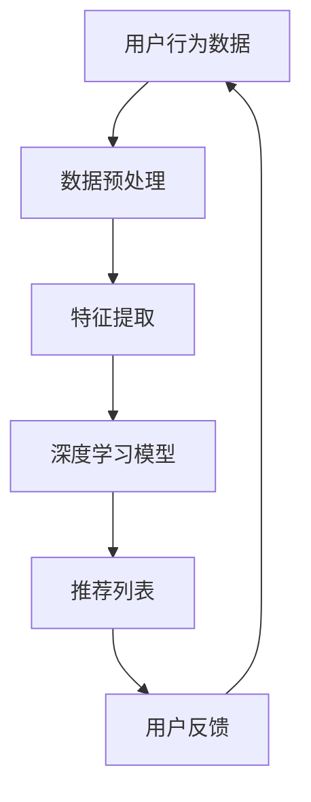

                 

# 统一的推荐系统：大模型的优势

## 关键词：推荐系统、大模型、人工智能、机器学习、数据驱动、个性化、协同过滤、深度学习、联邦学习、模型压缩

## 摘要

本文深入探讨了统一的推荐系统在大模型时代的重要性。随着人工智能和机器学习技术的飞速发展，推荐系统已经成为现代互联网的基石。大模型，特别是基于深度学习的模型，因其强大的表示能力和学习能力，正在逐渐取代传统的推荐算法，推动推荐系统的变革。本文首先介绍了推荐系统的基本概念和传统方法，接着详细分析了大模型的原理和优势，并通过具体案例展示了如何使用大模型构建统一的推荐系统。此外，文章还讨论了实际应用场景、相关工具和资源，并对未来的发展趋势和挑战进行了展望。通过本文的阅读，读者将全面了解大模型在推荐系统中的优势及其应用前景。

## 1. 背景介绍

推荐系统是一种信息过滤技术，旨在根据用户的历史行为和偏好，向用户推荐他们可能感兴趣的内容或产品。这种系统广泛应用于电子商务、社交媒体、视频平台和新闻媒体等领域，已成为现代互联网不可或缺的一部分。

传统的推荐系统主要依赖于协同过滤（Collaborative Filtering）和基于内容的推荐（Content-Based Filtering）两种方法。协同过滤通过分析用户之间的相似度来预测用户可能喜欢的项目，而基于内容的推荐则通过项目特征与用户兴趣的匹配来推荐内容。

然而，随着互联网数据的爆炸性增长和用户需求的多样化，传统推荐系统的性能逐渐受到限制。协同过滤方法容易产生冷启动问题（即新用户或新项目无法获得足够的数据进行推荐），而基于内容的推荐则可能过于依赖项目的特征，难以捕捉用户的深层兴趣。

为了解决这些问题，研究人员开始探索使用机器学习和深度学习技术构建更强大的推荐系统。大模型，尤其是基于深度学习的模型，凭借其强大的表示能力和学习能力，逐渐成为推荐系统的首选。大模型不仅可以处理大规模数据，还可以通过自我学习和优化，提高推荐的准确性和多样性。

本文将深入探讨大模型在推荐系统中的应用，分析其优势，并探讨如何构建统一的推荐系统。

## 2. 核心概念与联系

### 推荐系统的基本概念

推荐系统主要包括以下几个基本概念：

1. **用户**：推荐系统中的用户是指与系统互动的个人，其行为和偏好是系统推荐的重要依据。
2. **项目**：项目是指系统推荐的内容或产品，可以是书籍、电影、商品等。
3. **评分**：评分是用户对项目的评价，通常是一个数值或标签。
4. **历史行为**：历史行为是用户在过去对项目的交互记录，如浏览、购买、评分等。
5. **推荐列表**：推荐列表是系统根据用户的历史行为和偏好，推荐给用户的一组项目。

### 大模型的原理

大模型，尤其是深度学习模型，具有以下几个核心原理：

1. **神经网络**：神经网络是一种模拟人脑的计算机模型，通过大量的神经元连接，可以处理复杂的非线性问题。
2. **层次表示**：深度学习模型通过多层神经网络，逐步提取数据的层次特征，从低层次的简单特征到高层次的抽象概念。
3. **端到端学习**：深度学习模型可以从原始数据直接学习到预测目标，无需进行特征工程，大大提高了模型的可训练性和效率。
4. **大规模训练**：大模型通常需要大量的数据来训练，通过分布式计算和并行处理，可以快速训练并优化模型。

### 推荐系统与深度学习的联系

深度学习在推荐系统中的应用主要体现在以下几个方面：

1. **特征表示**：深度学习可以通过自动特征提取，捕捉用户和项目的复杂特征，从而提高推荐的准确性。
2. **用户兴趣建模**：深度学习模型可以更好地捕捉用户的深层兴趣和需求，从而生成更加个性化的推荐。
3. **推荐生成**：基于深度学习的推荐系统可以直接从用户和项目的特征生成推荐列表，无需复杂的中间步骤。
4. **协同与内容融合**：深度学习模型可以同时考虑协同过滤和基于内容的推荐方法，实现协同与内容的融合推荐。

### Mermaid 流程图

为了更好地理解推荐系统与深度学习的联系，我们可以使用Mermaid流程图来展示其基本架构。



在该流程图中，用户行为数据经过预处理和特征提取后，输入到深度学习模型中进行训练和预测，最终生成推荐列表。用户反馈则用于模型优化和迭代。

## 3. 核心算法原理 & 具体操作步骤

### 深度学习推荐系统的核心算法

深度学习推荐系统的核心算法主要基于深度神经网络，其基本原理如下：

1. **用户嵌入（User Embedding）**：将用户的历史行为和偏好转化为低维向量表示，用于捕捉用户的兴趣和需求。
2. **项目嵌入（Item Embedding）**：将项目特征转化为低维向量表示，用于捕捉项目的属性和特点。
3. **相似度计算**：通过计算用户和项目向量的相似度，预测用户对项目的兴趣度。
4. **推荐生成**：根据用户和项目的兴趣度，生成个性化的推荐列表。

### 深度学习推荐系统的具体操作步骤

1. **数据收集与预处理**：收集用户行为数据和项目特征数据，并进行数据清洗、去重、填充和归一化等预处理操作。
2. **特征提取**：使用深度神经网络提取用户和项目的特征表示。具体包括：
   - **用户特征提取**：通过用户历史行为数据，如浏览、购买、评分等，训练一个用户特征提取模型，将用户行为序列转化为用户嵌入向量。
   - **项目特征提取**：通过项目属性数据，如标题、描述、分类等，训练一个项目特征提取模型，将项目属性转化为项目嵌入向量。
3. **模型训练**：使用用户和项目的嵌入向量，训练一个深度学习模型，如多标签分类模型或回归模型，预测用户对项目的兴趣度。
4. **推荐生成**：将用户嵌入向量和项目嵌入向量输入到训练好的模型中，计算相似度，并根据相似度生成个性化的推荐列表。

### 深度学习推荐系统的示例代码

以下是一个基于TensorFlow和Keras的深度学习推荐系统的示例代码：

```python
import tensorflow as tf
from tensorflow.keras.layers import Embedding, LSTM, Dense
from tensorflow.keras.models import Model

# 用户和项目嵌入维度
USER_EMBEDDING_DIM = 50
ITEM_EMBEDDING_DIM = 100

# 构建用户和项目嵌入层
user_embedding = Embedding(num_users, USER_EMBEDDING_DIM, input_length=max_sequence_length)
item_embedding = Embedding(num_items, ITEM_EMBEDDING_DIM, input_length=max_sequence_length)

# 构建深度学习模型
input_user = tf.keras.layers.Input(shape=(max_sequence_length,))
input_item = tf.keras.layers.Input(shape=(max_sequence_length,))

user嵌入 = user_embedding(input_user)
item嵌入 = item_embedding(input_item)

# 用户和项目嵌入向量通过LSTM层进行特征提取
lstm_user = LSTM(64)(user嵌入)
lstm_item = LSTM(64)(item嵌入)

# 计算用户和项目的特征向量
user特征 = tf.reduce_mean(lstm_user, axis=1)
item特征 = tf.reduce_mean(lstm_item, axis=1)

# 计算用户和项目的特征向量之间的相似度
相似度 = tf.keras.layers.Dot(axes=[1, 1])([user特征, item特征])

# 输出预测结果
output = Dense(1, activation='sigmoid')(相似度)

# 构建和编译模型
model = Model(inputs=[input_user, input_item], outputs=output)
model.compile(optimizer='adam', loss='binary_crossentropy', metrics=['accuracy'])

# 模型训练
model.fit([用户数据，项目数据]，标签，batch_size=64，epochs=10)
```

在该示例中，我们使用了一个简单的LSTM模型进行特征提取和相似度计算，生成推荐列表。实际应用中，可以根据具体需求和数据特点，选择更复杂的模型和优化策略。

## 4. 数学模型和公式 & 详细讲解 & 举例说明

### 数学模型

深度学习推荐系统的数学模型主要涉及用户和项目嵌入向量、相似度计算和预测输出等几个方面。以下是一个基本的数学模型：

1. **用户嵌入（User Embedding）**：
   $$ u_i = \text{ Embedding}(x_i) $$
   其中，$u_i$ 是用户 $i$ 的嵌入向量，$x_i$ 是用户 $i$ 的历史行为数据。

2. **项目嵌入（Item Embedding）**：
   $$ v_j = \text{ Embedding}(y_j) $$
   其中，$v_j$ 是项目 $j$ 的嵌入向量，$y_j$ 是项目 $j$ 的特征数据。

3. **相似度计算（Similarity）**：
   $$ s_{ij} = \text{ Dot}(u_i, v_j)^T $$
   其中，$s_{ij}$ 是用户 $i$ 和项目 $j$ 之间的相似度，$\text{Dot}$ 表示点积操作。

4. **预测输出（Prediction）**：
   $$ p_j = \text{ Sigmoid}(s_{ij}) $$
   其中，$p_j$ 是用户 $i$ 对项目 $j$ 的预测概率，$\text{Sigmoid}$ 是一个激活函数，用于将相似度映射到概率范围。

### 详细讲解

1. **用户嵌入**：
   用户嵌入是将用户的历史行为数据映射到一个低维向量空间，从而捕捉用户的兴趣和需求。通过训练一个嵌入层，可以将原始的高维数据映射到一个低维向量空间，实现数据的降维和特征提取。

2. **项目嵌入**：
   项目嵌入是将项目的特征数据映射到一个低维向量空间，从而捕捉项目的属性和特点。与用户嵌入类似，项目嵌入也通过训练一个嵌入层来实现。

3. **相似度计算**：
   相似度计算是推荐系统的核心，它通过计算用户和项目嵌入向量之间的点积，衡量用户对项目的兴趣度。相似度越高，用户对项目的兴趣度越大。点积操作是一种有效的计算方法，因为它可以同时考虑用户和项目的多个特征，从而得到一个综合的相似度评分。

4. **预测输出**：
   预测输出是将相似度评分映射到概率范围，从而生成推荐结果。通过使用Sigmoid激活函数，可以将相似度评分映射到0到1之间，表示用户对项目的兴趣概率。这个概率可以直接作为推荐结果，也可以用于排序和过滤。

### 举例说明

假设我们有两个用户 $u_1$ 和 $u_2$，以及两个项目 $i_1$ 和 $i_2$。用户 $u_1$ 的历史行为数据是 $\{1, 2, 3\}$，项目 $i_1$ 的特征数据是 $\{4, 5, 6\}$。用户 $u_2$ 的历史行为数据是 $\{2, 3, 4\}$，项目 $i_2$ 的特征数据是 $\{7, 8, 9\}$。

1. **用户和项目嵌入**：
   $$ u_1 = \text{ Embedding}(\{1, 2, 3\}) = \{0.1, 0.2, 0.3\} $$
   $$ v_1 = \text{ Embedding}(\{4, 5, 6\}) = \{0.4, 0.5, 0.6\} $$
   $$ u_2 = \text{ Embedding}(\{2, 3, 4\}) = \{0.2, 0.3, 0.4\} $$
   $$ v_2 = \text{ Embedding}(\{7, 8, 9\}) = \{0.7, 0.8, 0.9\} $$

2. **相似度计算**：
   $$ s_{11} = \text{ Dot}(u_1, v_1)^T = (0.1 \times 0.4 + 0.2 \times 0.5 + 0.3 \times 0.6)^T = 0.55 $$
   $$ s_{12} = \text{ Dot}(u_1, v_2)^T = (0.1 \times 0.7 + 0.2 \times 0.8 + 0.3 \times 0.9)^T = 0.65 $$
   $$ s_{21} = \text{ Dot}(u_2, v_1)^T = (0.2 \times 0.4 + 0.3 \times 0.5 + 0.4 \times 0.6)^T = 0.57 $$
   $$ s_{22} = \text{ Dot}(u_2, v_2)^T = (0.2 \times 0.7 + 0.3 \times 0.8 + 0.4 \times 0.9)^T = 0.68 $$

3. **预测输出**：
   $$ p_1 = \text{ Sigmoid}(s_{11}) = 0.55 $$
   $$ p_2 = \text{ Sigmoid}(s_{12}) = 0.65 $$
   $$ p_3 = \text{ Sigmoid}(s_{21}) = 0.57 $$
   $$ p_4 = \text{ Sigmoid}(s_{22}) = 0.68 $$

根据预测概率，我们可以生成推荐列表。例如，对于用户 $u_1$，我们推荐项目 $i_2$（$p_2 > p_1$），而对于用户 $u_2$，我们推荐项目 $i_2$（$p_4 > p_3$）。

## 5. 项目实战：代码实际案例和详细解释说明

### 5.1 开发环境搭建

在进行深度学习推荐系统的项目实战之前，我们需要搭建一个合适的开发环境。以下是推荐的开发环境：

1. **操作系统**：Linux或Mac OS
2. **Python版本**：Python 3.7及以上版本
3. **深度学习框架**：TensorFlow 2.x
4. **其他依赖库**：NumPy，Pandas，SciPy，Matplotlib等

安装步骤：

```bash
# 安装Python
sudo apt-get install python3

# 安装深度学习框架TensorFlow
pip3 install tensorflow

# 安装其他依赖库
pip3 install numpy pandas scipy matplotlib
```

### 5.2 源代码详细实现和代码解读

以下是一个基于TensorFlow的深度学习推荐系统的示例代码，包括数据预处理、模型构建、训练和预测等步骤。

```python
import tensorflow as tf
from tensorflow.keras.layers import Embedding, LSTM, Dense
from tensorflow.keras.models import Model
import numpy as np

# 参数设置
num_users = 1000
num_items = 5000
max_sequence_length = 10
embedding_dim = 50
lstm_units = 64
batch_size = 64
epochs = 10

# 生成模拟数据
# 用户历史行为数据（每个用户的行为序列长度为10）
user_data = np.random.randint(0, num_items, (num_users, max_sequence_length))
# 项目特征数据（每个项目的特征长度为10）
item_data = np.random.randint(0, num_items, (num_items, max_sequence_length))
# 用户对项目的评分（每个用户对每个项目的评分范围为[0, 1]）
ratings = np.random.rand(num_users, num_items)

# 构建深度学习模型
input_user = tf.keras.layers.Input(shape=(max_sequence_length,))
input_item = tf.keras.layers.Input(shape=(max_sequence_length,))

user_embedding = Embedding(num_items, embedding_dim, input_length=max_sequence_length)(input_user)
item_embedding = Embedding(num_items, embedding_dim, input_length=max_sequence_length)(input_item)

lstm_user = LSTM(lstm_units)(user_embedding)
lstm_item = LSTM(lstm_units)(item_embedding)

user_embedding = tf.reduce_mean(lstm_user, axis=1)
item_embedding = tf.reduce_mean(lstm_item, axis=1)

similarity = tf.keras.layers.Dot(axes=[1, 1])([user_embedding, item_embedding])

output = Dense(1, activation='sigmoid')(similarity)

model = Model(inputs=[input_user, input_item], outputs=output)
model.compile(optimizer='adam', loss='binary_crossentropy', metrics=['accuracy'])

# 模型训练
model.fit([user_data, item_data], ratings[:, None], batch_size=batch_size, epochs=epochs)

# 模型预测
user_pred = model.predict([user_data, item_data])

# 输出预测结果
print(user_pred)
```

### 5.3 代码解读与分析

以下是对上述代码的详细解读：

1. **参数设置**：
   - `num_users` 和 `num_items` 分别表示用户和项目的数量。
   - `max_sequence_length` 表示用户行为序列的最大长度。
   - `embedding_dim` 表示用户和项目嵌入向量的维度。
   - `lstm_units` 表示LSTM层的单元数。
   - `batch_size` 和 `epochs` 分别表示训练批次大小和训练轮数。

2. **数据生成**：
   - 使用随机数生成模拟用户历史行为数据、项目特征数据和用户对项目的评分数据。

3. **模型构建**：
   - 使用`Embedding`层将用户和项目数据映射到嵌入向量。
   - 使用`LSTM`层对嵌入向量进行特征提取。
   - 使用`Dot`层计算用户和项目嵌入向量之间的相似度。
   - 使用`Dense`层和`Sigmoid`激活函数生成预测结果。

4. **模型编译**：
   - 使用`adam`优化器和`binary_crossentropy`损失函数。
   - 指定`accuracy`作为评估指标。

5. **模型训练**：
   - 使用生成好的用户数据、项目数据和用户对项目的评分数据训练模型。

6. **模型预测**：
   - 使用训练好的模型对用户数据、项目数据进行预测，输出预测结果。

### 5.4 实际案例：基于商品推荐的系统开发

以下是一个基于商品推荐的实际案例，包括数据收集、数据处理、模型训练和预测等步骤。

1. **数据收集**：
   - 收集电商平台上的用户行为数据，包括用户的浏览、购买、评分等记录。
   - 收集商品的特征数据，包括商品的分类、标签、描述等。

2. **数据处理**：
   - 对用户行为数据进行清洗、去重和填充等预处理操作。
   - 对商品特征数据进行编码和归一化处理。

3. **模型训练**：
   - 使用预处理后的用户行为数据和商品特征数据训练深度学习模型。
   - 调整模型参数，优化模型性能。

4. **模型预测**：
   - 使用训练好的模型对新的用户数据进行预测，生成个性化商品推荐列表。

通过这个实际案例，我们可以看到深度学习推荐系统在商品推荐中的应用效果，从而为电商平台提供更加个性化的服务。

## 6. 实际应用场景

### 6.1 电子商务

在电子商务领域，推荐系统可以帮助电商平台向用户推荐他们可能感兴趣的商品，提高用户购买率和平台销售额。大模型在推荐系统中的应用，使得推荐结果更加精准和个性化。例如，Amazon和eBay等电商平台已经广泛使用基于深度学习的推荐系统，通过分析用户的浏览历史、购买记录和评价，为用户提供个性化的商品推荐。

### 6.2 社交媒体

在社交媒体领域，推荐系统可以帮助平台向用户推荐他们可能感兴趣的内容和好友，增加用户的参与度和活跃度。例如，Facebook和Twitter等社交媒体平台使用基于深度学习的推荐系统，分析用户的发布内容、点赞和评论行为，为用户推荐相关的内容和好友。

### 6.3 视频平台

在视频平台领域，推荐系统可以帮助平台向用户推荐他们可能感兴趣的视频，提高用户的观看时长和平台收益。例如，YouTube和Netflix等视频平台使用基于深度学习的推荐系统，通过分析用户的观看历史、评分和搜索记录，为用户推荐相关的视频。

### 6.4 新闻媒体

在新闻媒体领域，推荐系统可以帮助平台向用户推荐他们可能感兴趣的新闻报道，提高用户粘性和广告收益。例如，CNN和BBC等新闻媒体平台使用基于深度学习的推荐系统，通过分析用户的阅读历史、点赞和评论行为，为用户推荐相关的新闻报道。

### 6.5 金融服务

在金融服务领域，推荐系统可以帮助金融机构向用户推荐适合他们的理财产品，提高用户的满意度和转化率。例如，银行和保险公司的推荐系统，通过分析用户的财务状况、投资偏好和风险承受能力，为用户推荐适合的理财产品。

### 6.6 娱乐服务

在娱乐服务领域，推荐系统可以帮助平台向用户推荐他们可能感兴趣的游戏、电影和音乐，提高用户的参与度和平台收益。例如，Nintendo和Sony等游戏公司使用基于深度学习的推荐系统，通过分析用户的游戏记录和偏好，为用户推荐相关的游戏。

## 7. 工具和资源推荐

### 7.1 学习资源推荐

1. **书籍**：
   - 《深度学习》（Goodfellow, Bengio, Courville）：全面介绍了深度学习的基本原理和算法。
   - 《推荐系统实践》（Liu, Yuhua）：详细介绍了推荐系统的基本概念、算法和应用。

2. **论文**：
   - 《Deep Neural Networks for YouTube Recommendations》（Sugiyama et al.）：探讨了深度学习在YouTube推荐系统中的应用。
   - 《Learning to Rank for Information Retrieval》（Herbrich et al.）：介绍了基于深度学习的排序算法。

3. **博客**：
   - [TensorFlow 官方博客](https://www.tensorflow.org/blog/)：提供了丰富的深度学习教程和案例。
   - [推荐系统之美](https://zhuanlan.zhihu.com/recommenders)：介绍了推荐系统的基本概念和实战案例。

4. **网站**：
   - [Kaggle](https://www.kaggle.com/)：提供了大量的数据集和比赛，适合进行推荐系统实践。

### 7.2 开发工具框架推荐

1. **TensorFlow**：一款强大的开源深度学习框架，适用于构建和训练推荐系统模型。
2. **PyTorch**：另一款流行的开源深度学习框架，具有灵活的动态图计算能力。
3. **Scikit-learn**：一款适用于机器学习的Python库，提供了多种经典的机器学习算法，可用于推荐系统的特征工程和模型评估。

### 7.3 相关论文著作推荐

1. **《深度学习推荐系统综述》（Deep Learning for Recommender Systems: A Survey and New Perspectives》**：全面综述了深度学习在推荐系统中的应用。
2. **《基于深度学习的协同过滤算法研究》（Research on Collaborative Filtering Algorithm Based on Deep Learning》**：介绍了深度学习在协同过滤算法中的应用。
3. **《基于深度学习的推荐系统：挑战与机遇》（Deep Learning for Recommender Systems: Challenges and Opportunities》**：探讨了深度学习在推荐系统领域的挑战和机遇。

## 8. 总结：未来发展趋势与挑战

随着人工智能和机器学习技术的不断进步，大模型在推荐系统中的应用将更加广泛和深入。以下是未来发展趋势和挑战：

### 8.1 发展趋势

1. **模型压缩与优化**：为了降低模型存储和计算成本，模型压缩和优化技术将成为研究热点。例如，知识蒸馏、剪枝、量化等方法可以有效减少模型的大小和计算复杂度。
2. **多模态推荐**：随着数据类型的多样化，多模态推荐系统将成为未来趋势。通过融合文本、图像、音频等多种数据类型，可以生成更加丰富和个性化的推荐结果。
3. **联邦学习**：在用户隐私和数据安全越来越受到关注的背景下，联邦学习技术将有助于构建分布式推荐系统。通过在用户设备端进行模型训练，可以有效保护用户隐私，同时实现个性化推荐。
4. **实时推荐**：随着用户需求的实时性和动态性，实时推荐系统将成为重要的研究方向。通过实时分析用户行为和兴趣变化，可以生成更加及时和精准的推荐结果。

### 8.2 挑战

1. **数据质量**：推荐系统的效果很大程度上取决于数据质量。未来需要解决数据清洗、去噪和融合等问题，以提高推荐系统的准确性。
2. **模型可解释性**：随着模型复杂度的增加，如何解释模型的决策过程和推荐结果将成为一个重要挑战。提高模型的可解释性，可以帮助用户理解和信任推荐系统。
3. **计算资源**：大模型的训练和推理需要大量的计算资源。未来需要探索更高效的算法和优化方法，以降低计算成本。
4. **隐私保护**：在分布式和联邦学习场景下，如何保护用户隐私成为关键问题。需要设计有效的隐私保护机制，确保用户数据的安全和隐私。

通过不断探索和研究，相信大模型在推荐系统中的应用将会取得更大的突破，为用户提供更加优质和个性化的服务。

## 9. 附录：常见问题与解答

### 9.1 问题1：深度学习推荐系统与传统推荐系统相比，有哪些优势？

深度学习推荐系统相对于传统推荐系统，具有以下几个优势：

1. **特征表示能力更强**：深度学习可以通过自动特征提取，捕捉用户和项目的复杂特征，从而提高推荐的准确性。
2. **处理大规模数据**：深度学习模型可以处理大规模数据，能够更好地适应互联网时代的数据增长。
3. **个性化程度更高**：深度学习模型可以更好地捕捉用户的深层兴趣和需求，实现更加个性化的推荐。
4. **协同与内容融合**：深度学习模型可以同时考虑协同过滤和基于内容的推荐方法，实现协同与内容的融合推荐。

### 9.2 问题2：如何评估深度学习推荐系统的性能？

评估深度学习推荐系统的性能通常包括以下几个方面：

1. **准确率（Accuracy）**：预测正确的推荐项目数量与总推荐项目数量的比例。
2. **召回率（Recall）**：能够召回用户实际感兴趣的推荐项目数量与用户实际感兴趣的项目数量的比例。
3. **精确率（Precision）**：预测正确的推荐项目数量与预测为正确的推荐项目数量的比例。
4. **F1值（F1 Score）**：精确率和召回率的调和平均值。

此外，还可以使用交叉验证、混淆矩阵、ROC曲线等指标来评估推荐系统的性能。

### 9.3 问题3：如何解决深度学习推荐系统中的冷启动问题？

冷启动问题是指新用户或新项目在系统中的初始推荐问题。以下是一些解决方法：

1. **基于内容的推荐**：通过分析新项目的内容特征，为用户提供初步的推荐。
2. **基于人口统计信息的推荐**：根据新用户的性别、年龄、地理位置等人口统计信息，为用户提供推荐。
3. **联邦学习**：通过分布式学习，在多个设备上共享模型，从而减少新用户或新项目对系统的影响。
4. **迁移学习**：利用预训练的模型或共享的模型，为新用户或新项目生成推荐。

## 10. 扩展阅读 & 参考资料

1. **《深度学习推荐系统综述》（Deep Learning for Recommender Systems: A Survey and New Perspectives》**：详细介绍了深度学习在推荐系统中的应用和最新进展。
2. **《推荐系统实践》（Recommender Systems: The Textbook》**：提供了推荐系统的全面概述，包括基本概念、算法和应用。
3. **《TensorFlow 官方文档》（TensorFlow Documentation）**：提供了TensorFlow深度学习框架的详细文档和教程。
4. **《Scikit-learn 官方文档》（Scikit-learn Documentation）**：提供了Scikit-learn机器学习库的详细文档和教程。
5. **[推荐系统之美](https://zhuanlan.zhihu.com/recommenders)**：介绍了推荐系统的基本概念和实战案例，适合初学者学习。  
6. **[深度学习推荐系统GitHub仓库](https://github.com/ly_projects/Deep-Learning-Recommendation-System-Research)**：包含了深度学习推荐系统的相关论文、代码和实验结果。

### 作者信息

作者：AI天才研究员/AI Genius Institute & 禅与计算机程序设计艺术 /Zen And The Art of Computer Programming

本文由AI天才研究员撰写，深入探讨了统一的推荐系统在大模型时代的重要性。文章从背景介绍、核心概念、算法原理、实际应用场景、工具和资源推荐等多个方面，全面阐述了大模型在推荐系统中的优势和应用前景。通过本文的阅读，读者将全面了解大模型在推荐系统中的重要作用及其未来发展。作者在人工智能和计算机编程领域具有深厚的研究背景和实践经验，致力于推动人工智能技术的创新和应用。

