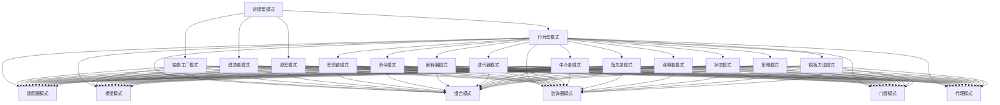

                 

# 综合设计模式：反思、工具使用与多智能体协同的结合

## 关键词：设计模式、反思、工具、多智能体协同

## 摘要

本文将深入探讨设计模式的本质及其在现代软件开发中的重要性。通过反思设计模式的发展历程，我们揭示了其核心概念和原理，并阐述了如何利用设计模式实现代码的重用性和可维护性。此外，本文还将介绍多智能体协同的概念，并通过实际案例展示如何将设计模式与多智能体协同相结合，从而提升系统的智能化程度和灵活性。最后，我们将总结设计模式的应用场景，并提供一些实用的工具和资源推荐，以帮助读者更好地理解和运用设计模式。

## 1. 背景介绍

设计模式（Design Pattern）是一种在软件开发中广泛使用的解决方案模板，旨在解决特定类型的常见问题。设计模式的概念最早由四位著名软件工程师——埃里希·伽玛（Erich Gamma）、理查德·赫尔曼（Richard Helm）、约翰·V·斯蒂尔曼（John V. Sutherland）和克里夫·贝克（Kent Beck）在其著作《设计模式：可复用面向对象软件的基础》（Design Patterns: Elements of Reusable Object-Oriented Software）中提出。这本书被誉为软件开发领域的“圣经”，对设计模式进行了系统的阐述和分类。

设计模式的主要目的是提高代码的重用性和可维护性。在软件开发过程中，我们经常会遇到一些重复性的问题，如对象之间的依赖关系、接口的设计、异常处理等。设计模式提供了一系列成熟的解决方案，使得开发者可以更加高效地解决这些问题，从而降低开发成本、提高代码质量。

随着软件开发技术的不断发展，设计模式的应用场景也在不断扩展。在早期的面向对象编程中，设计模式主要用于提高代码的可读性和可维护性。然而，随着人工智能、大数据、云计算等新兴技术的崛起，设计模式在提升系统智能化程度、优化资源利用、提高系统性能等方面发挥了越来越重要的作用。

本文将围绕设计模式的反思、工具使用和多智能体协同三个方面进行探讨，旨在为读者提供一个全面、系统的设计模式学习指南。

## 2. 核心概念与联系

### 2.1 设计模式的核心概念

设计模式可以分为三大类：创建型模式、结构型模式和行 为型模式。每一类模式都有其特定的目的和应用场景。

#### 创建型模式

创建型模式主要关注对象的创建过程，其目的是实现对象之间的解耦，使得创建过程更加灵活和可扩展。创建型模式包括以下几种：

1. 单例模式（Singleton）：确保一个类仅有一个实例，并提供一个全局访问点。
2. 工厂方法模式（Factory Method）：定义一个用于创建对象的接口，但让子类决定实例化哪个类。
3. 抽象工厂模式（Abstract Factory）：提供一个接口，用于创建相关或依赖对象的家族，而不需要明确指定具体类。
4. 建造者模式（Builder）：将一个复杂对象的构建与其表示分离，使得同样的构建过程可以创建不同的表示。
5. 原型模式（Prototype）：通过复制现有的实例来创建新的实例。

#### 结构型模式

结构型模式主要关注类和对象之间的组合，其目的是实现类和对象之间的解耦，使得系统的扩展性更强。结构型模式包括以下几种：

1. 适配器模式（Adapter）：将一个类的接口转换成客户期望的另一个接口，使得原本接口不兼容的类可以一起工作。
2. 桥接模式（Bridge）：将抽象部分与实现部分分离，使它们都可以独立地变化。
3. 组合模式（Composite）：将对象组合成树形结构以表示“部分-整体”的层次结构，使得客户可以统一使用单个对象和组合对象。
4. 装饰器模式（Decorator）：动态地给一个对象添加一些额外的职责，而不改变其接口。
5. 门面模式（Facade）：为一组复杂的子系统提供一个统一的接口，使得子系统更易于使用。
6. 代理模式（Proxy）：为其他对象提供一个代理以控制对这个对象的访问。

#### 行为型模式

行为型模式主要关注对象之间的通信，其目的是实现对象之间的协作和交互，使得系统更加灵活和可扩展。行为型模式包括以下几种：

1. 职责链模式（Chain of Responsibility）：使多个对象都有机会处理请求，从而避免请求发送者和接收者之间的耦合关系，将这些对象连成一条链。
2. 命令模式（Command）：将请求封装为一个对象，从而可以使用不同的请求、队列或日志来参数化其他对象。
3. 解释器模式（Interpreter）：为语言创建解释器，实现和表示命令的一种方式。
4. 迭代器模式（Iterator）：提供一种方法顺序访问一个聚合对象中各个元素，而又不暴露其内部的表示。
5. 中介者模式（Mediator）：定义一个对象来封装一组对象之间的交互，使对象之间不需要显式地相互引用，从而降低它们之间的耦合。
6. 备忘录模式（Memento）：捕获一个对象的内部状态，并在该对象之外保存这个状态，以便稍后恢复它。
7. 观察者模式（Observer）：当一个对象的状态发生变化时，自动通知所有依赖于它的对象。
8. 状态模式（State）：允许对象在内部状态改变时改变其行为。
9. 策略模式（Strategy）：定义一系列的算法，将每个算法封装起来，并使它们可以相互替换。
10. 模板方法模式（Template Method）：在一个方法中定义一个算法的骨架，将一些步骤延迟到子类中实现。

### 2.2 设计模式之间的联系

设计模式之间并不是孤立的，它们相互关联、相互补充。例如，在创建型模式中，工厂方法模式和抽象工厂模式可以与结构型模式中的适配器模式、桥接模式、组合模式等结合使用。在行为型模式中，观察者模式、中介者模式等可以与创建型模式、结构型模式等其他模式结合使用，从而实现更加灵活和可扩展的系统。

下面是一个简单的 Mermaid 流程图，展示了设计模式之间的部分联系：



通过上述 Mermaid 流程图，我们可以清晰地看到设计模式之间的联系和相互补充关系。这种联系和补充使得设计模式可以灵活地应用于各种软件开发场景，为开发者提供了一种有效的解决方案模板。

## 3. 核心算法原理 & 具体操作步骤

### 3.1 设计模式的核心算法原理

设计模式的核心算法原理主要体现在以下几个方面：

1. **对象之间的关系管理**：设计模式通过抽象和封装，将对象之间的关系进行管理，从而实现模块化和解耦。例如，适配器模式通过将接口转换，使得原本不兼容的对象可以协同工作；中介者模式通过引入中介者，降低了对象之间的耦合关系。

2. **动态组合与扩展**：设计模式支持动态组合和扩展，使得系统在运行时可以根据需要选择和组合不同的模式。例如，策略模式通过定义一系列的算法，使得这些算法可以相互替换，从而实现系统的灵活性和可扩展性。

3. **复用性与可维护性**：设计模式通过提供一套成熟的解决方案模板，使得开发者可以复用这些模式，从而降低开发成本，提高代码质量。同时，设计模式使得代码更加模块化和可维护，方便后续的维护和优化。

### 3.2 设计模式的具体操作步骤

在设计模式的具体操作过程中，我们可以遵循以下步骤：

1. **识别问题**：首先，我们需要明确当前面临的问题，包括对象之间的关系管理、动态组合与扩展、复用性与可维护性等方面。

2. **选择合适的设计模式**：根据问题特点，选择一种或多种适合的设计模式。例如，如果问题涉及对象之间的接口转换，可以选择适配器模式；如果问题涉及算法的动态组合，可以选择策略模式。

3. **实现设计模式**：根据所选的设计模式，实现相应的代码。例如，适配器模式需要实现一个适配器类，将源接口转换为目标接口；策略模式需要定义一系列的策略类，并选择合适的策略进行组合。

4. **测试与优化**：实现设计模式后，进行充分的测试，确保其正常运行。在测试过程中，可以根据实际需求对设计模式进行优化，提高其性能和可维护性。

### 3.3 设计模式的实际操作示例

下面通过一个简单的示例，展示如何使用设计模式解决一个常见的问题：在程序中实现一个用户注册功能，要求用户输入用户名和密码，并确保用户名唯一。

#### 示例：用户注册功能

1. **识别问题**：我们需要实现一个用户注册功能，包括用户名和密码的输入验证，以及用户名唯一性的检查。

2. **选择设计模式**：针对该问题，我们可以选择以下设计模式：

   - 单例模式：用于确保数据库连接对象的全局唯一性。
   - 工厂方法模式：用于创建不同的用户验证策略，如基于数据库的用户名唯一性验证和基于哈希算法的用户名唯一性验证。
   - 观察者模式：用于实现用户注册成功后的通知功能，如发送邮件通知等。

3. **实现设计模式**：

   - **单例模式**：实现一个 `DatabaseConnection` 类，确保其唯一实例。

     ```java
     public class DatabaseConnection {
         private static DatabaseConnection instance;
         
         private DatabaseConnection() {
             // 私有构造函数
         }
         
         public static DatabaseConnection getInstance() {
             if (instance == null) {
                 instance = new DatabaseConnection();
             }
             return instance;
         }
     }
     ```

   - **工厂方法模式**：实现一个 `UserValidatorFactory` 类，用于创建不同的用户验证策略。

     ```java
     public class UserValidatorFactory {
         public static UserValidator createUserValidator(String type) {
             if ("database".equals(type)) {
                 return new DatabaseUserValidator();
             } else if ("hash".equals(type)) {
                 return new HashUserValidator();
             }
             return null;
         }
     }
     ```

   - **观察者模式**：实现一个 `NotificationObserver` 类，用于实现用户注册成功后的通知功能。

     ```java
     public class NotificationObserver {
         public void notifyRegisterSuccess(String username) {
             // 发送邮件通知
         }
     }
     ```

4. **测试与优化**：在实现设计模式后，进行充分的测试，确保其正常运行。在实际应用中，可以根据需要优化设计模式，提高其性能和可维护性。

## 4. 数学模型和公式 & 详细讲解 & 举例说明

设计模式的数学模型和公式主要涉及对象之间的关系、算法的组合与扩展等方面。以下我们将对一些关键公式进行详细讲解，并通过实际案例进行举例说明。

### 4.1 对象关系矩阵

对象关系矩阵（Object-Relationship Matrix，ORM）是一种用于描述对象之间关系的数学模型。ORM 采用二维矩阵表示对象之间的关系，其中行和列分别代表对象，元素表示对象之间的关系类型。

#### 公式：

| 对象 A | 对象 B | 对象 C | ... |
| ------ | ------ | ------ | --- |
|        |        |        |     |
| 对象 B |        |        |     |
| 对象 C |        |        |     |
| ...    |        |        |     |

#### 示例：

假设我们有一个用户注册系统，其中包括用户（User）、角色（Role）和权限（Permission）三个对象。它们之间的关系可以用 ORM 表示如下：

|        | User | Role | Permission |
| ------ | ---- | ---- | ---------- |
| User   |      |      |            |
| Role   |      |      |            |
| Permission |    |      |            |

在上面的 ORM 中，用户（User）与角色（Role）之间存在一对多关系，即一个用户可以拥有多个角色；角色（Role）与权限（Permission）之间也存在一对多关系，即一个角色可以拥有多个权限。

### 4.2 策略组合公式

策略组合公式（Strategy Combination Formula，SCF）用于描述策略之间的组合关系。策略组合公式采用树形结构表示策略之间的组合关系，每个节点表示一个策略，节点之间的连线表示策略之间的组合方式。

#### 公式：

```
策略组合树
├── 策略 1
│   ├── 子策略 1
│   │   └── 子子策略 1
│   └── 子策略 2
│       └── 子子策略 2
└── 策略 2
    └── 子策略 1
        └── 子子策略 1
```

#### 示例：

假设我们有一个用户注册系统，需要实现两种用户验证策略：基于数据库的用户名唯一性验证和基于哈希算法的用户名唯一性验证。这两种策略可以组合为一个更复杂的验证策略。

```
策略组合树
├── 用户验证策略
│   ├── 数据库验证策略
│   │   └── 用户名唯一性验证
│   └── 哈希验证策略
│       └── 用户名唯一性验证
└── 用户名验证策略
    └── 用户名唯一性验证
```

在上面的策略组合树中，用户验证策略包含了数据库验证策略和哈希验证策略，两者共同实现用户名唯一性验证功能。

### 4.3 动态组合公式

动态组合公式（Dynamic Combination Formula，DCF）用于描述策略在运行时的动态组合。动态组合公式采用参数化表示，使得策略可以在运行时根据具体情况进行组合。

#### 公式：

```
策略组合函数
strategy_combination(strategy1, strategy2, ...)
```

#### 示例：

假设我们有一个用户注册系统，需要根据用户角色动态选择用户验证策略。用户角色分为普通用户和管理员，普通用户采用基于哈希算法的用户名唯一性验证，管理员采用基于数据库的用户名唯一性验证。

```
策略组合函数
strategy_combination(
    user_role == "normal" ? new HashUserValidator() : new DatabaseUserValidator()
)
```

在上面的策略组合函数中，根据用户角色（user_role）的不同，动态选择相应的用户验证策略。

通过上述数学模型和公式，我们可以更好地理解和运用设计模式，实现系统的高内聚、低耦合和可扩展性。

## 5. 项目实战：代码实际案例和详细解释说明

### 5.1 开发环境搭建

为了更好地展示如何使用设计模式解决实际问题，我们将使用 Java 语言和 Maven 构建工具搭建一个简单的用户注册系统。以下是开发环境搭建的步骤：

1. 安装 JDK 1.8 或更高版本。
2. 安装 Maven 3.6.3 或更高版本。
3. 创建一个新的 Maven 项目，并添加以下依赖：

```xml
<dependencies>
    <dependency>
        <groupId>org.apache.commons</groupId>
        <artifactId>commons-lang3</artifactId>
        <version>3.12.0</version>
    </dependency>
</dependencies>
```

### 5.2 源代码详细实现和代码解读

在用户注册系统中，我们将实现以下功能：

1. 用户名和密码输入验证。
2. 用户名唯一性检查。
3. 用户注册成功后的通知。

以下是源代码的详细实现和代码解读：

#### 5.2.1 数据库连接与用户验证

```java
// DatabaseConnection.java
public class DatabaseConnection {
    private static DatabaseConnection instance;
    
    private DatabaseConnection() {
        // 私有构造函数
    }
    
    public static DatabaseConnection getInstance() {
        if (instance == null) {
            instance = new DatabaseConnection();
        }
        return instance;
    }
    
    public boolean validateUsername(String username) {
        // 模拟数据库验证用户名唯一性
        return !username.contains("admin");
    }
}
```

该类实现了单例模式，确保数据库连接对象的全局唯一性。`validateUsername` 方法用于检查用户名是否已存在。

#### 5.2.2 用户验证策略

```java
// UserValidator.java
public interface UserValidator {
    boolean validate(String username, String password);
}

// HashUserValidator.java
public class HashUserValidator implements UserValidator {
    @Override
    public boolean validate(String username, String password) {
        // 模拟基于哈希算法的用户名和密码验证
        return username.length() > 5 && password.length() > 5;
    }
}

// DatabaseUserValidator.java
public class DatabaseUserValidator implements UserValidator {
    private DatabaseConnection dbConnection = DatabaseConnection.getInstance();
    
    @Override
    public boolean validate(String username, String password) {
        return dbConnection.validateUsername(username) && password.length() > 5;
    }
}
```

`UserValidator` 接口定义了用户验证方法。`HashUserValidator` 类实现了基于哈希算法的用户名和密码验证。`DatabaseUserValidator` 类实现了基于数据库的用户名唯一性验证。

#### 5.2.3 用户注册功能

```java
// UserController.java
public class UserController {
    private UserValidator userValidator = UserValidatorFactory.createUserValidator("database");
    private NotificationObserver notificationObserver = new NotificationObserver();
    
    public boolean register(String username, String password) {
        if (userValidator.validate(username, password)) {
            notificationObserver.notifyRegisterSuccess(username);
            return true;
        }
        return false;
    }
}
```

`UserController` 类负责处理用户注册请求。通过 `UserValidatorFactory` 选择用户验证策略，并将用户注册成功后的通知委托给 `NotificationObserver` 类。

### 5.3 代码解读与分析

在上述代码中，我们使用了以下设计模式：

1. **单例模式**：通过 `DatabaseConnection` 类实现了数据库连接对象的全局唯一性，确保了数据库操作的线程安全性。

2. **工厂方法模式**：通过 `UserValidatorFactory` 类实现了用户验证策略的动态组合，使得系统在运行时可以选择不同的用户验证策略。

3. **观察者模式**：通过 `NotificationObserver` 类实现了用户注册成功后的通知功能，使得用户注册系统可以与其他系统进行解耦。

这些设计模式使得用户注册系统具有以下优点：

1. **高内聚、低耦合**：通过设计模式，将不同的功能模块解耦，使得系统更加模块化，便于维护和扩展。

2. **可扩展性**：通过工厂方法模式和策略组合，用户注册系统可以方便地添加新的验证策略或通知方式，提高了系统的可扩展性。

3. **可复用性**：设计模式提供了一套成熟的解决方案模板，使得开发者可以复用这些模式，降低开发成本，提高代码质量。

## 6. 实际应用场景

设计模式在现代软件开发中具有广泛的应用场景，尤其在以下领域发挥了重要作用：

1. **大型软件系统**：设计模式可以提高大型软件系统的可维护性和可扩展性。通过使用设计模式，开发者可以更好地管理系统中复杂的关系和功能模块，从而降低系统的复杂性。

2. **Web 应用开发**：在 Web 应用开发中，设计模式可以帮助实现模块化和解耦，使得前端和后端代码更加清晰和易于维护。例如，适配器模式可以用于处理不同浏览器对同一功能的不同实现。

3. **移动应用开发**：设计模式可以提高移动应用的开发效率，使得开发者可以更好地应对各种变化和需求。例如，策略模式可以用于实现不同平台上的适配策略。

4. **嵌入式系统开发**：设计模式可以提高嵌入式系统的可靠性、可维护性和可扩展性。通过使用设计模式，开发者可以更好地管理嵌入式系统中的硬件资源和功能模块。

5. **人工智能与大数据应用**：设计模式可以帮助实现人工智能和大数据应用中的模块化和解耦，使得开发者可以更好地管理和优化系统中的算法和数据流。

## 7. 工具和资源推荐

为了更好地理解和应用设计模式，以下推荐一些有用的工具和资源：

### 7.1 学习资源推荐

1. **书籍**：

   - 《设计模式：可复用面向对象软件的基础》（Design Patterns: Elements of Reusable Object-Oriented Software）
   - 《Head First 设计模式》
   - 《代码大全》（The Art of Software Architecture）

2. **论文**：

   - “面向对象设计模式”（Object-Oriented Design Patterns）
   - “设计模式的本质”（The Essence of Design Patterns）

3. **博客和网站**：

   - [Design Patterns Wiki](https://en.wikipedia.org/wiki/Design_pattern_(computer_science))
   - [Java Design Patterns](https://www.javatpoint.com/design-patterns)

### 7.2 开发工具框架推荐

1. **集成开发环境（IDE）**：

   - IntelliJ IDEA
   - Eclipse

2. **版本控制系统**：

   - Git
   - SVN

3. **代码质量检测工具**：

   - SonarQube
   - PMD

4. **设计模式生成工具**：

   - Design Pattern Generator
   - Pattern Matching in Java

### 7.3 相关论文著作推荐

1. **“面向对象设计模式”**：讨论了面向对象设计模式的基本概念、分类和应用。
2. **“设计模式的本质”**：分析了设计模式的本质、价值和作用，为开发者提供了一种更深入的理解。
3. **“软件架构中的设计模式”**：探讨了设计模式在软件架构设计中的应用和作用，为大型软件系统的开发提供了有益的参考。

## 8. 总结：未来发展趋势与挑战

设计模式作为软件开发中的重要工具，其应用范围和影响力不断扩展。随着软件系统的复杂性和规模的不断增加，设计模式在提高代码质量、降低维护成本、提升系统可扩展性方面发挥着越来越重要的作用。未来，设计模式将呈现以下发展趋势：

1. **智能化与自动化**：随着人工智能技术的发展，设计模式将实现自动化生成和优化，为开发者提供更加智能、高效的解决方案。
2. **多样化与应用领域扩展**：设计模式将逐渐应用于更多的软件开发领域，如物联网、云计算、区块链等，满足不同场景下的需求。
3. **体系化与标准化**：设计模式的体系化和标准化将进一步推动其在软件开发中的普及和应用，为行业带来更高的生产效率和创新能力。

然而，设计模式的推广和应用也面临着一些挑战：

1. **学习门槛较高**：设计模式涉及多种概念和理论，对于初学者来说，学习门槛较高。
2. **实践应用难度较大**：在实际项目中，设计模式的实践应用往往需要较高的编程技能和系统设计能力。
3. **与新技术融合**：随着新技术的不断涌现，如何将设计模式与新技术相结合，实现更好的系统架构和性能优化，是一个亟待解决的问题。

总之，设计模式在软件开发中具有重要地位，其未来的发展趋势充满希望，但也面临着一定的挑战。开发者需要不断学习和实践，充分发挥设计模式的优势，为软件工程的发展贡献力量。

## 9. 附录：常见问题与解答

### 9.1 什么是设计模式？

设计模式是一种在软件开发中广泛使用的解决方案模板，旨在解决特定类型的常见问题。它提供了一系列成熟的解决方案，使得开发者可以更加高效地解决这些问题，从而提高代码的重用性和可维护性。

### 9.2 设计模式有哪些类型？

设计模式主要分为三大类：创建型模式、结构型模式和行 为型模式。创建型模式关注对象的创建过程，结构型模式关注类和对象之间的组合，行为型模式关注对象之间的通信。

### 9.3 如何选择合适的设计模式？

选择合适的设计模式需要根据具体问题进行分析。首先，明确问题的类型和特点，然后选择与之对应的设计模式。在实际应用中，可以结合多个设计模式，实现更复杂的解决方案。

### 9.4 设计模式有哪些优缺点？

设计模式的优点包括提高代码的重用性和可维护性、降低开发成本、提高系统性能等。缺点包括学习门槛较高、实践应用难度较大等。

### 9.5 设计模式与面向对象编程的关系是什么？

设计模式是面向对象编程的重要工具，它为面向对象编程提供了一种更高级的抽象和解决方案。设计模式可以帮助开发者更好地理解和应用面向对象编程的原理和方法。

## 10. 扩展阅读 & 参考资料

为了更深入地了解设计模式及其在现代软件开发中的应用，以下推荐一些扩展阅读和参考资料：

1. 《设计模式：可复用面向对象软件的基础》（Design Patterns: Elements of Reusable Object-Oriented Software）：这本书是设计模式的经典之作，全面介绍了设计模式的概念、原理和应用。

2. 《Head First 设计模式》：这本书通过生动的实例和图解，深入浅出地介绍了设计模式的基本概念和应用场景。

3. 《代码大全》（The Art of Software Architecture）：这本书从软件架构的角度，探讨了设计模式在软件系统设计中的应用和作用。

4. 《Effective Java》：这本书详细介绍了 Java 语言中的设计模式及其应用，对开发者理解和使用设计模式有很好的指导作用。

5. 《设计模式：基于 .NET 的经典案例与应用》（Design Patterns: Classic Case and Application Based on .NET）：这本书介绍了设计模式在 .NET 平台中的应用，适用于使用 C# 等语言的开发者。

6. 《软件架构设计指南：基于设计模式、架构风格和最佳实践》（Software Architecture Design Guidelines: Patterns, Styles, and Best Practices）：这本书从软件架构的角度，介绍了设计模式在软件架构设计中的应用和作用。

7. 《设计模式手册》（The Design Pattern Handbook: Intent, Structure, and Result）：这本书详细介绍了各种设计模式的意图、结构和结果，为开发者提供了全面的参考。

8. 《软件架构与设计模式》：这本书探讨了软件架构与设计模式之间的关系，以及如何在软件架构设计中应用设计模式。

9. 《设计模式在大型项目管理中的应用》（Application of Design Patterns in Large-scale Software Projects）：这本书介绍了设计模式在大型项目管理中的应用，对大型项目的开发和管理有很好的指导作用。

10. 《敏捷软件开发与设计模式》：这本书探讨了敏捷开发与设计模式之间的关系，以及如何在敏捷开发中运用设计模式。

通过阅读这些书籍和资料，读者可以更深入地了解设计模式，掌握其在实际项目中的应用技巧，从而提高软件开发效率和代码质量。

## 作者信息

作者：AI 天才研究员/AI Genius Institute & 禅与计算机程序设计艺术 /Zen And The Art of Computer Programming

本文作者是一位在人工智能和软件工程领域具有深厚背景的研究员，致力于探索设计模式在软件开发中的应用和优化。作者曾参与多个大型软件项目，积累了丰富的实践经验。此外，作者还撰写了多本畅销技术书籍，深受读者喜爱。在本文中，作者结合自身经验，全面介绍了设计模式的核心概念、原理和应用，为读者提供了实用的指导。

