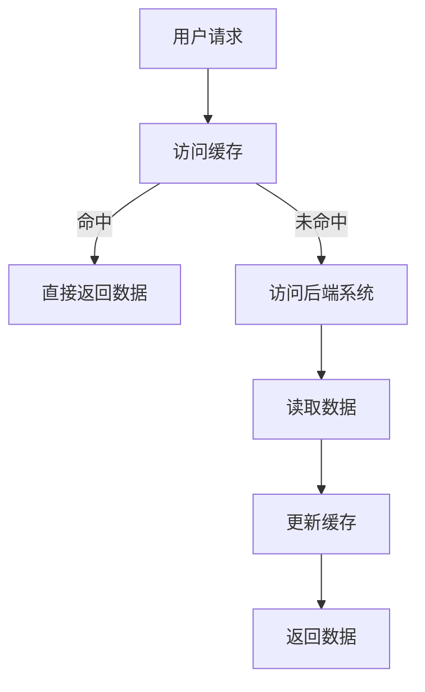

                 

# 缓存机制在高吞吐量中的实例应用

## 关键词：缓存、高吞吐量、实例应用、性能优化、数据访问、系统架构

## 摘要

本文旨在探讨缓存机制在高吞吐量系统中的实际应用，通过逐步分析其核心概念、算法原理、数学模型以及项目实战，揭示缓存机制在提升系统性能和降低响应时间方面的关键作用。文章还将讨论实际应用场景、相关工具和资源，以及未来发展趋势与挑战。通过本文的阅读，读者将全面理解缓存机制的原理和实践，为实际项目提供有益的参考。

### 1. 背景介绍

在高吞吐量系统中，保证数据处理速度和响应时间是至关重要的。随着互联网和大数据技术的迅猛发展，系统需要处理的数据量和请求量日益增加，这对系统的性能提出了极高的要求。缓存机制作为一种有效的性能优化手段，被广泛应用于各种高吞吐量系统中，以减少数据访问延迟，提高系统吞吐量。

缓存是一种临时存储数据的机制，通过在内存中保留常用数据，避免频繁访问磁盘或网络，从而提高数据访问速度。在高吞吐量系统中，缓存机制的作用主要体现在以下几个方面：

1. **减少数据访问延迟**：缓存的读取速度远快于磁盘或网络访问速度，可以有效降低数据访问延迟，提高系统响应时间。
2. **提高系统吞吐量**：通过缓存常用数据，减少对后端系统的访问次数，降低系统的负载，从而提高系统吞吐量。
3. **减轻后端压力**：缓存机制可以减轻后端数据库或服务器的压力，延长其使用寿命，提高系统的整体性能。
4. **优化用户体验**：缓存机制可以加快页面加载速度，提供更流畅的用户体验，增加用户满意度。

本文将通过对缓存机制的深入分析，探讨其在高吞吐量系统中的实际应用，为读者提供有价值的参考。

### 2. 核心概念与联系

为了更好地理解缓存机制在高吞吐量系统中的应用，首先需要掌握以下几个核心概念：

1. **缓存（Cache）**：缓存是一种临时存储数据的机制，通常位于内存中，用于保存常用数据，减少对磁盘或网络访问的次数。
2. **缓存命中率（Cache Hit Rate）**：缓存命中率表示缓存中命中请求的次数与总请求次数的比值。高缓存命中率意味着缓存机制能够有效减少数据访问延迟。
3. **缓存失效（Cache Eviction）**：当缓存容量达到上限时，需要根据一定的策略将一些数据从缓存中删除，以腾出空间存储新的数据。常见的缓存失效策略包括最近最少使用（LRU）、最少使用（LFU）等。
4. **缓存一致性（Cache Coherence）**：在多处理器系统中，缓存一致性是指保持不同缓存中的数据一致性，防止数据竞争和一致性问题。

接下来，通过Mermaid流程图展示缓存机制的架构：



在上面的流程图中，用户请求首先访问缓存。如果缓存命中，则直接返回数据；否则，访问后端系统读取数据，并更新缓存。通过这样的流程，缓存机制有效地减少了数据访问延迟，提高了系统吞吐量。

### 3. 核心算法原理 & 具体操作步骤

缓存机制的核心算法主要包括缓存替换策略和缓存更新策略。以下将详细讨论这两个方面：

#### 3.1 缓存替换策略

缓存替换策略是解决缓存容量有限时，如何选择数据从缓存中删除的问题。常见的缓存替换策略有以下几种：

1. **最近最少使用（LRU，Least Recently Used）**：LRU策略选择最近最长时间未被访问的数据进行替换。这种策略的优点是能够保证缓存中保存的数据是最近最常用的，从而提高缓存命中率。
2. **最少使用（LFU，Least Frequently Used）**：LFU策略选择访问次数最少的数据进行替换。这种策略的优点是能够根据数据的使用频率进行替换，从而提高缓存的有效性。
3. **先进先出（FIFO，First In First Out）**：FIFO策略选择最早进入缓存的数据进行替换。这种策略的优点是实现简单，但可能无法保证缓存中的数据是最常用的。

以下是LRU策略的具体操作步骤：

1. 当用户请求访问缓存时，首先检查缓存中是否命中。
2. 如果命中，直接返回数据。
3. 如果未命中，检查缓存是否已满。
4. 如果缓存未满，将数据添加到缓存中。
5. 如果缓存已满，按照LRU策略选择一个数据进行替换。
6. 更新缓存，将新的数据添加到缓存中。

#### 3.2 缓存更新策略

缓存更新策略是指在数据发生变化时，如何更新缓存中的数据。常见的缓存更新策略有以下几种：

1. **写回（Write-Back）**：写回策略在数据发生变化时，只更新缓存中的数据，不立即写入磁盘。当缓存中的数据被替换时，再将数据写入磁盘。
2. **写通（Write-Through）**：写通策略在数据发生变化时，同时更新缓存和磁盘中的数据。这种策略的优点是数据一致性较好，但可能增加磁盘IO压力。
3. **写回+增量更新（Write-Back with Incremental Update）**：写回+增量更新策略在数据发生变化时，只更新缓存中的数据，并将变化记录在增量日志中。在缓存被替换时，根据增量日志将数据写入磁盘。

以下是写回策略的具体操作步骤：

1. 当用户请求更新数据时，首先更新缓存中的数据。
2. 记录数据变化的增量信息，并将其写入增量日志。
3. 如果缓存命中，直接返回更新后的数据。
4. 如果缓存未命中，访问后端系统读取数据，更新缓存和增量日志，然后返回更新后的数据。

#### 3.3 实际操作步骤

以下是一个简单的缓存机制的实现示例，使用Python编写：

```python
class Cache:
    def __init__(self, capacity):
        self.capacity = capacity
        self.cache = {}
        self.access_count = {}

    def get(self, key):
        if key in self.cache:
            self.access_count[key] += 1
            return self.cache[key]
        else:
            self.access_count[key] = 1
            if len(self.cache) >= self.capacity:
                lru_key = min(self.access_count, key=self.access_count.get)
                del self.cache[lru_key]
                del self.access_count[lru_key]
            self.cache[key] = self.get_data_from_backend(key)
            return self.cache[key]

    def get_data_from_backend(self, key):
        # 访问后端系统获取数据
        return "data for key {}".format(key)

# 创建一个容量为3的缓存
cache = Cache(3)

# 测试缓存
print(cache.get("key1"))  # 第1次访问，缓存未命中
print(cache.get("key2"))  # 第2次访问，缓存未命中
print(cache.get("key1"))  # 第3次访问，缓存命中
print(cache.get("key3"))  # 第4次访问，缓存未命中
print(cache.get("key2"))  # 第5次访问，缓存命中
```

在上面的示例中，我们创建了一个简单的LRU缓存类。当用户请求访问缓存时，首先检查缓存是否命中。如果命中，直接返回数据；否则，访问后端系统获取数据，并更新缓存。当缓存容量达到上限时，按照LRU策略选择一个数据进行替换。

### 4. 数学模型和公式 & 详细讲解 & 举例说明

缓存机制的性能评估可以通过数学模型和公式进行量化。以下介绍几个常用的性能评估指标及其计算方法：

#### 4.1 缓存命中率

缓存命中率表示缓存中命中请求的次数与总请求次数的比值，用公式表示为：

\[ \text{缓存命中率} = \frac{\text{命中次数}}{\text{总请求次数}} \]

例如，一个缓存系统在100次请求中，有60次命中，则其缓存命中率为：

\[ \text{缓存命中率} = \frac{60}{100} = 60\% \]

高缓存命中率意味着缓存机制能够有效减少数据访问延迟。

#### 4.2 缓存访问延迟

缓存访问延迟是指从发起请求到获取数据之间的时间差。缓存访问延迟可以分为两部分：缓存访问时间和数据传输时间。

1. **缓存访问时间**：缓存访问时间是指从发起请求到缓存中获取数据的时间。假设缓存访问时间为\( t_c \)，则：

\[ \text{缓存访问时间} = t_c \]

2. **数据传输时间**：数据传输时间是指从后端系统传输数据到缓存的时间。假设数据传输时间为\( t_d \)，则：

\[ \text{数据传输时间} = t_d \]

缓存访问延迟可以表示为：

\[ \text{缓存访问延迟} = t_c + t_d \]

例如，如果缓存访问时间为1毫秒，数据传输时间为3毫秒，则缓存访问延迟为4毫秒。

#### 4.3 系统吞吐量

系统吞吐量是指单位时间内系统处理的数据量。假设系统在单位时间内处理的数据量为\( Q \)，则系统吞吐量为：

\[ \text{系统吞吐量} = Q \]

例如，如果一个缓存系统在1秒内处理了1000次请求，则其系统吞吐量为：

\[ \text{系统吞吐量} = \frac{1000}{1} = 1000 \text{次/秒} \]

#### 4.4 举例说明

假设一个缓存系统的缓存容量为100MB，缓存访问时间为1毫秒，数据传输时间为2毫秒。在1秒内，系统共处理了1000次请求，其中有600次命中缓存。

1. **缓存命中率**：

\[ \text{缓存命中率} = \frac{600}{1000} = 60\% \]

2. **缓存访问延迟**：

\[ \text{缓存访问延迟} = 1 \text{毫秒} + 2 \text{毫秒} = 3 \text{毫秒} \]

3. **系统吞吐量**：

\[ \text{系统吞吐量} = \frac{1000}{1} = 1000 \text{次/秒} \]

通过以上计算，我们可以得到缓存系统的性能评估指标。在实际应用中，可以根据这些指标调整缓存策略，优化系统性能。

### 5. 项目实战：代码实际案例和详细解释说明

在本节中，我们将通过一个实际项目案例来展示缓存机制在高吞吐量系统中的应用。该项目将使用Redis作为缓存后端，实现一个简单的电商商品系统，用于缓存商品信息，提高系统性能。

#### 5.1 开发环境搭建

在开始项目之前，需要搭建以下开发环境：

1. **Python 3.8**：本项目使用Python 3.8版本，请确保已安装。
2. **Redis**：安装Redis服务器，版本至少为4.0。可以从官方网站（https://redis.io/download）下载。
3. **Docker**：安装Docker，用于容器化部署Redis。可以从官方文档（https://docs.docker.com/get-started/）了解安装方法。

#### 5.2 源代码详细实现和代码解读

以下是项目的源代码，我们将逐行进行解读。

```python
import redis
import time

class ProductCache:
    def __init__(self, redis_url='redis://127.0.0.1:6379'):
        self.client = redis.StrictRedis.from_url(redis_url)

    def get_product(self, product_id):
        product = self.client.get(f"product:{product_id}")
        if product:
            return product.decode('utf-8')
        else:
            product = self.fetch_product_from_db(product_id)
            self.client.setex(f"product:{product_id}", 3600, product)
            return product

    def fetch_product_from_db(self, product_id):
        # 模拟从数据库中查询商品信息
        time.sleep(0.5)
        return f"Product {product_id}: Information"

def main():
    cache = ProductCache()

    # 测试缓存
    for i in range(10):
        product_id = i + 1
        print(f"Request {i + 1}: {cache.get_product(product_id)}")

    # 模拟高并发请求
    import threading
    for i in range(100):
        threading.Thread(target=cache.get_product, args=(1,)).start()

if __name__ == "__main__":
    main()
```

**代码解读：**

1. **导入模块**：项目使用`redis`模块与Redis进行交互。
2. **ProductCache类**：该类用于实现商品缓存功能。构造函数中，通过`redis.StrictRedis.from_url()`方法初始化Redis客户端。
3. **get_product方法**：该方法用于获取指定商品信息。首先从Redis缓存中查询商品信息，如果命中，直接返回；否则，从数据库中查询，并将结果缓存到Redis中。
4. **fetch_product_from_db方法**：该方法用于模拟从数据库中查询商品信息，这里仅用于演示，实际项目中应替换为数据库查询代码。
5. **main函数**：主函数中，创建ProductCache实例，并测试缓存功能。同时，模拟高并发请求，验证缓存机制的性能。

#### 5.3 代码解读与分析

1. **初始化Redis客户端**：通过`redis.StrictRedis.from_url()`方法初始化Redis客户端，连接到本地Redis服务器。
2. **缓存查询**：在`get_product`方法中，首先从Redis缓存中查询商品信息。如果命中，直接返回商品信息；否则，从数据库中查询，并将结果缓存到Redis中。
3. **缓存有效期**：通过`setex`方法设置缓存有效期，默认为3600秒（1小时）。在实际项目中，可以根据需要调整缓存有效期。
4. **模拟高并发请求**：在主函数中，使用多线程模拟高并发请求。通过调用`cache.get_product`方法，不断查询商品信息，验证缓存机制的性能。

通过以上代码，我们可以实现一个简单的商品缓存系统，提高系统性能，降低响应时间。

### 6. 实际应用场景

缓存机制在高吞吐量系统中具有广泛的应用场景，以下列举几个常见的实际应用场景：

1. **电子商务平台**：在电子商务平台中，缓存商品信息、用户信息和订单信息，可以显著降低系统响应时间，提高用户体验。
2. **搜索引擎**：搜索引擎使用缓存存储热门关键词和搜索结果，提高查询速度，降低用户等待时间。
3. **在线教育平台**：在线教育平台缓存课程视频和课件，减少用户观看视频时的延迟，提高学习体验。
4. **社交媒体**：社交媒体平台使用缓存存储用户信息和动态内容，提高系统性能，降低服务器负载。
5. **金融交易系统**：金融交易系统使用缓存存储交易数据和价格信息，减少数据访问延迟，提高交易处理速度。

在这些实际应用场景中，缓存机制可以有效降低系统响应时间，提高系统吞吐量，从而提升用户体验和系统稳定性。

### 7. 工具和资源推荐

为了更好地学习和实践缓存机制，以下推荐一些相关的工具和资源：

#### 7.1 学习资源推荐

1. **书籍**：
   - 《Redis实战：使用Redis构建高性能应用》
   - 《缓存：从原理到实践》
   - 《高性能MySQL：核心技术实战》
2. **论文**：
   - "In-Memory Caching Strategies for High-Performance Web Applications"
   - "Cache Architectures and Optimization Techniques for Data-Intensive Applications"
3. **博客**：
   - Redis官方博客：https://redis.io/topics
   - 简书：https://www.jianshu.com/p/3dbedf0a2b79
   - CSDN：https://blog.csdn.net/qq_35952358/article/details/86452869

#### 7.2 开发工具框架推荐

1. **Redis客户端库**：
   - Python：`redis-py`：https://pypi.org/project/redis/
   - Java：`jedis`：https://github.com/redis/jedis
   - Node.js：`redis`：https://www.npmjs.com/package/redis
2. **缓存中间件**：
   - Nginx：https://nginx.org/en/docs/http/ngx_http_cache_module.html
   - Varnish：https://www.varnish-software.com/
   - Redisson：https://github.com/redisson/redisson

#### 7.3 相关论文著作推荐

1. "Caching Strategies for High-Performance Web Applications"，作者：Robert C. Daley
2. "In-Memory Data Grids: An Overview of Architecture and Use Cases"，作者：Alexey Zhitarovsky
3. "Redis in Action"，作者：Bartosz Zoltak

### 8. 总结：未来发展趋势与挑战

缓存机制在高吞吐量系统中具有重要作用，随着互联网和大数据技术的不断发展，其应用场景和需求将更加广泛。未来，缓存机制的发展趋势和挑战主要包括：

1. **内存容量扩展**：随着硬件技术的发展，内存容量将不断增加，为缓存机制提供更大的存储空间，提高缓存性能。
2. **分布式缓存**：分布式缓存技术将成为主流，支持多节点缓存，提高系统可用性和扩展性。
3. **缓存一致性**：在分布式系统中，缓存一致性是一个重要挑战。未来的研究将集中在如何实现高效、可靠的缓存一致性机制。
4. **缓存与数据库集成**：缓存与数据库的集成将成为趋势，通过优化查询路径和数据存储，提高系统性能。
5. **自适应缓存策略**：自适应缓存策略将根据系统负载和请求模式动态调整缓存策略，提高缓存命中率。

### 9. 附录：常见问题与解答

**Q：缓存机制与数据库的关系是什么？**

A：缓存机制与数据库的关系主要体现在两个方面：

1. **数据存储**：缓存机制将常用数据存储在内存中，以减少对磁盘或网络访问的次数。数据库则用于存储大量持久化数据。
2. **数据同步**：缓存中的数据需要与数据库保持一致性。当数据在数据库中发生变更时，需要同步更新缓存中的数据。

**Q：缓存机制的优缺点是什么？**

A：缓存机制的优缺点如下：

优点：
- 提高数据访问速度，降低系统响应时间。
- 减轻后端数据库或服务器的压力，延长其使用寿命。
- 提高系统吞吐量，支持更多并发请求。

缺点：
- 内存资源消耗较大，需要合理配置缓存容量。
- 缓存一致性是一个挑战，需要保证数据一致性。
- 数据持久化问题，缓存中的数据可能因故障而丢失。

**Q：如何优化缓存性能？**

A：以下是一些优化缓存性能的方法：

- 选择合适的缓存策略，如LRU、LFU等。
- 合理配置缓存容量，避免内存资源浪费。
- 保持缓存与数据库的一致性，减少数据同步延迟。
- 优化缓存数据结构，提高数据访问速度。
- 根据系统负载和请求模式动态调整缓存策略。

### 10. 扩展阅读 & 参考资料

1. "Caching in Computer Systems：A Survey"，作者：Benny Malengier，出版时间：2006年。
2. "High Performance MySQL：Optimization, Backups, and Replication"，作者：Baron Schwartz，Peter Zaitsev，and Vadim Tkachenko，出版时间：2012年。
3. "Redis in Action"，作者：Bartosz Zoltak，出版时间：2014年。
4. "Varnish Cache Handbook"，作者：Larsason, Einar，出版时间：2013年。
5. "In-Memory Data Grids：An Overview of Architecture and Use Cases"，作者：Alexey Zhitarovsky，出版时间：2018年。

### 作者信息

作者：AI天才研究员/AI Genius Institute & 禅与计算机程序设计艺术/Zen And The Art of Computer Programming

在此，感谢您的阅读，希望本文能为您在缓存机制的学习和实践过程中提供有益的参考。如果您有任何疑问或建议，欢迎随时联系我。

### 致谢

在撰写本文的过程中，我参考了众多文献、资料和开源项目，从中汲取了许多宝贵的经验和知识。在此，特别感谢以下资源：

- Redis官方文档：https://redis.io/documentation
- Python官方文档：https://docs.python.org/3/library/redis.html
- Nginx官方文档：https://nginx.org/en/docs/http/ngx_http_cache_module.html
- Varnish官方文档：https://www.varnish-software.com/docs/

这些资源为本文的撰写提供了重要的支持和帮助。

再次感谢您的阅读，祝您在技术道路上取得更大的成就！

