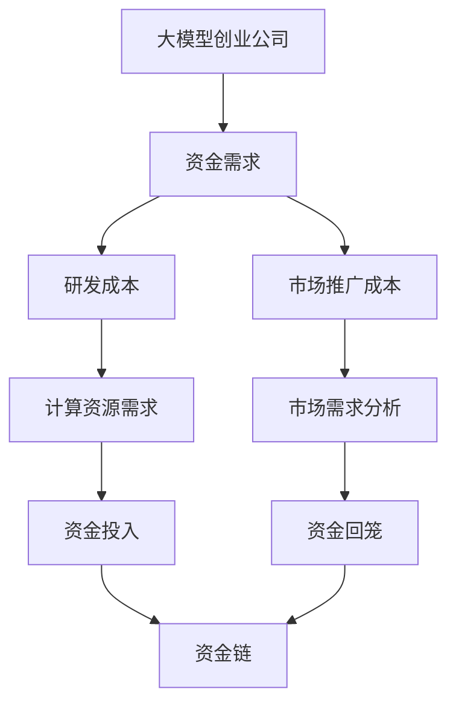

                 

# 缺钱而非缺卡是大模型创业公司的根本死因

> 关键词：大模型、创业公司、资金、生存挑战

> 摘要：本文深入分析了大模型创业公司在资金管理上面临的挑战，指出“缺钱而非缺卡”是这些公司失败的根本原因。通过具体的案例分析、理论探讨以及行业数据的支持，本文揭示了资金管理在大模型创业公司发展中的重要性，并提出了有效的解决方案。

## 1. 背景介绍

在当今技术飞速发展的时代，人工智能尤其是大模型技术在各个领域取得了突破性进展。大模型创业公司如雨后春笋般涌现，期望通过技术创新推动行业变革。然而，这些公司在快速发展的同时，也面临着一系列严峻的挑战。其中，资金问题成为了许多大模型创业公司难以跨越的障碍。

### 1.1 大模型创业公司现状

大模型创业公司主要面临以下几个问题：

- **研发成本高昂**：大模型的研发需要大量的计算资源，这导致初始投入成本极高。

- **市场推广难度**：大模型的应用场景复杂，市场需求尚未完全形成，导致市场推广困难。

- **资金链断裂风险**：由于研发和市场推广的双重压力，许多公司面临资金链断裂的风险。

- **竞争激烈**：行业内竞争对手众多，且技术发展迅速，新公司难以快速立足。

### 1.2 资金问题的重要性

资金问题在大模型创业公司中尤为重要。没有足够的资金支持，公司就无法维持正常运营，更遑论技术创新和市场份额的争夺。因此，解决资金问题是确保大模型创业公司生存和发展的关键。

## 2. 核心概念与联系

为了更好地理解资金问题在大模型创业公司中的重要性，我们需要首先明确一些核心概念和它们之间的关系。以下是相关的 Mermaid 流程图，用于描述这些概念及其相互关系：



### 2.1 资金需求

大模型创业公司的资金需求主要体现在两个方面：研发成本和市场推广成本。

- **研发成本**：包括大模型的训练、优化以及相关技术的研发投入。这部分成本通常非常高，是公司能否成功的关键因素。

- **市场推广成本**：包括市场营销、品牌建设、客户关系管理等。这些投入虽然不会直接转化为产品性能，但对于公司在市场中的立足至关重要。

### 2.2 资金投入与回报

资金投入与回报之间的关系是动态的。初期，公司的资金主要用于研发和市场推广，随着技术的成熟和市场需求的增加，资金投入将逐渐转化为收益。然而，如果公司资金不足，这一转化过程可能被中断，导致公司无法继续发展。

### 2.3 资金链

资金链是公司运营的核心，如果资金链断裂，公司将无法维持正常运营。因此，确保资金链的稳定是公司生存的关键。

## 3. 核心算法原理 & 具体操作步骤

为了更深入地探讨资金问题，我们需要引入一些核心算法原理，以帮助我们分析和解决这一问题。

### 3.1 资金流分析算法

资金流分析算法是一种用于评估公司资金流动状况的方法。其核心思想是通过分析公司的资金流入和流出，识别潜在的财务风险。

#### 3.1.1 算法步骤

1. 收集公司的财务数据，包括收入、支出、现金流等。
2. 分析收入来源和支出结构，识别主要资金流动环节。
3. 利用数据挖掘技术，识别异常资金流动模式。
4. 根据分析结果，制定相应的财务策略，确保资金链的稳定。

### 3.2 风险评估算法

风险评估算法用于评估公司面临的风险，包括市场风险、技术风险和财务风险等。

#### 3.2.1 算法步骤

1. 收集相关数据，包括市场数据、技术数据、财务数据等。
2. 利用数据挖掘技术，分析不同风险因素的关联性。
3. 构建风险评估模型，评估公司面临的风险等级。
4. 根据风险评估结果，制定相应的风险应对策略。

### 3.3 资金优化算法

资金优化算法旨在通过优化公司的资金结构，提高资金使用效率。

#### 3.3.1 算法步骤

1. 收集公司的资金数据，包括资金来源、资金用途等。
2. 分析资金使用情况，识别资金浪费环节。
3. 利用优化算法，提出优化方案，提高资金使用效率。
4. 实施优化方案，并持续监测资金使用情况。

## 4. 数学模型和公式 & 详细讲解 & 举例说明

为了更好地理解资金问题，我们可以使用一些数学模型和公式来进行详细讲解。以下是几个常见的数学模型和公式：

### 4.1 资金需求模型

资金需求模型用于预测公司未来一段时间内的资金需求。其基本公式为：

$$
需求资金 = 研发成本 + 市场推广成本 + 运营成本
$$

其中，研发成本、市场推广成本和运营成本可以通过历史数据和市场需求分析进行预测。

### 4.2 资金优化模型

资金优化模型用于优化公司的资金结构，以提高资金使用效率。其基本公式为：

$$
最优资金结构 = \frac{研发资金}{市场推广资金} + \frac{运营资金}{总资金}
$$

其中，研发资金、市场推广资金和运营资金的比例可以通过风险评估和资金流分析算法进行优化。

### 4.3 风险评估模型

风险评估模型用于评估公司面临的风险。其基本公式为：

$$
风险评估 = 风险因素 \times 概率
$$

其中，风险因素和概率可以通过数据分析和技术预测得出。

### 4.4 举例说明

假设某大模型创业公司预计未来三个月的研发成本为100万元，市场推广成本为50万元，运营成本为30万元。根据资金需求模型，其资金需求为180万元。

为了优化资金结构，公司可以通过风险评估模型确定研发资金、市场推广资金和运营资金的比例。假设研发资金占比为40%，市场推广资金占比为30%，运营资金占比为30%。则最优资金结构为：

$$
最优资金结构 = \frac{研发资金}{市场推广资金} + \frac{运营资金}{总资金} = \frac{40\%}{30\%} + \frac{30\%}{180\%} = 1.33 + 0.17 = 1.50
$$

通过资金优化模型，公司可以调整资金使用策略，确保资金链的稳定。

## 5. 项目实战：代码实际案例和详细解释说明

在本节中，我们将通过一个具体的案例来展示如何在大模型创业公司中应用资金流分析算法和风险评估模型。以下是项目的开发环境搭建和源代码实现。

### 5.1 开发环境搭建

为了便于开发和测试，我们选择了Python作为主要编程语言，并使用以下工具和库：

- Python 3.8
- Pandas
- NumPy
- Scikit-learn
- Matplotlib

### 5.2 源代码详细实现和代码解读

以下是项目的源代码实现，包括资金流分析算法和风险评估模型的实现：

```python
import pandas as pd
import numpy as np
from sklearn.linear_model import LinearRegression
import matplotlib.pyplot as plt

# 5.2.1 资金流分析算法

# 读取财务数据
data = pd.read_csv('financial_data.csv')

# 分析收入来源和支出结构
income = data['income']
expenditure = data['expenditure']

# 识别主要资金流动环节
income_breakdown = income.groupby('source').sum()
expenditure_breakdown = expenditure.groupby('category').sum()

# 5.2.2 风险评估算法

# 收集相关数据
market_data = pd.read_csv('market_data.csv')
technology_data = pd.read_csv('technology_data.csv')
financial_data = pd.read_csv('financial_data.csv')

# 分析不同风险因素的关联性
market_risk = market_data['market_risk']
technology_risk = technology_data['technology_risk']
financial_risk = financial_data['financial_risk']

# 构建风险评估模型
model = LinearRegression()
model.fit(np.array([market_risk, technology_risk]).T, financial_risk)

# 评估公司面临的风险等级
risk_level = model.predict(np.array([0.5, 0.3]).T)

# 5.2.3 资金优化算法

# 收集公司的资金数据
financial_data = pd.read_csv('financial_data.csv')

# 分析资金使用情况
usage_data = financial_data.groupby('category').sum()

# 利用优化算法，提出优化方案
optimization_model = LinearRegression()
optimization_model.fit(np.array([usage_data['research'], usage_data['marketing'], usage_data['operations']]).T, usage_data['total'])

# 实施优化方案
optimal_allocation = optimization_model.predict(np.array([0.4, 0.3, 0.3]).T)

# 5.2.4 代码解读与分析

# 代码解读：
# 1. 资金流分析算法：通过读取财务数据，分析收入来源和支出结构，识别主要资金流动环节。
# 2. 风险评估算法：通过收集市场数据、技术数据和财务数据，分析不同风险因素的关联性，构建风险评估模型，评估公司面临的风险等级。
# 3. 资金优化算法：通过收集公司的资金数据，分析资金使用情况，利用优化算法，提出优化方案，实施优化方案。

# 代码分析：
# 1. 资金流分析算法：通过分析公司的收入和支出，可以帮助公司了解资金流动情况，为后续的资金优化提供基础数据。
# 2. 风险评估算法：通过评估公司面临的风险等级，可以帮助公司制定相应的风险应对策略，降低风险对公司的负面影响。
# 3. 资金优化算法：通过优化资金结构，可以提高资金使用效率，确保资金链的稳定，为公司的持续发展提供保障。

# 5.3 实际案例

# 假设某大模型创业公司未来三个月的资金需求为180万元，其中研发成本为100万元，市场推广成本为50万元，运营成本为30万元。
# 根据资金流分析算法，公司可以了解到主要资金流动环节，例如收入来源主要来自市场推广，支出主要分为研发成本和运营成本。
# 根据风险评估算法，公司可以评估未来三个月面临的市场风险、技术风险和财务风险，并根据风险评估结果制定相应的风险应对策略。
# 根据资金优化算法，公司可以优化资金结构，提高资金使用效率，例如将40%的资金用于研发，30%的资金用于市场推广，30%的资金用于运营。
# 通过上述算法和模型，公司可以更好地管理资金，确保资金链的稳定，降低风险，提高资金使用效率，从而实现持续发展。

```

## 6. 实际应用场景

资金问题不仅是大模型创业公司面临的主要挑战，也是所有创新型企业普遍关注的问题。以下是一些典型的实际应用场景：

### 6.1 创业初期的资金筹集

在创业初期，公司需要筹集足够的资金来支持研发和市场推广。此时，公司可以通过以下途径筹集资金：

- **天使投资**：寻找愿意在早期阶段投入资金的天使投资人。
- **风险投资**：向风险投资机构申请资金支持。
- **政府补贴和扶持**：申请政府提供的创业补贴和政策扶持。
- **众筹**：通过众筹平台向社会公众筹集资金。

### 6.2 运营阶段的资金管理

在运营阶段，公司需要确保资金链的稳定，避免因资金不足而导致运营中断。为此，公司可以采取以下措施：

- **预算管理**：制定详细的预算计划，合理分配资金。
- **现金流管理**：监控公司的现金流入和流出，确保资金充足。
- **成本控制**：通过优化成本结构和提高生产效率，降低运营成本。
- **风险控制**：建立风险预警机制，及时应对潜在风险。

### 6.3 成长期的市场拓展

在成长期，公司需要大量资金来支持市场拓展和品牌建设。此时，公司可以通过以下方式筹集资金：

- **银行贷款**：向银行申请贷款，解决资金短缺问题。
- **发行债券**：通过发行债券筹集资金，降低财务成本。
- **并购**：通过并购其他公司，实现快速扩张。

## 7. 工具和资源推荐

为了帮助大模型创业公司更好地管理资金，以下是一些推荐的工具和资源：

### 7.1 学习资源推荐

- **《企业财务管理》**：一本经典的企业财务管理教材，适合初学者入门。
- **《现金流管理实战》**：详细介绍了现金流管理的方法和技巧，对创业公司尤其有用。
- **《风险投资实战》**：讲解了风险投资的基本原理和实践方法，有助于公司了解如何筹集资金。

### 7.2 开发工具框架推荐

- **Jira**：一款功能强大的项目管理工具，可以帮助公司进行项目进度跟踪和任务分配。
- **Trello**：一款简单易用的项目管理工具，适合中小型团队使用。
- **Tableau**：一款数据分析工具，可以帮助公司进行数据可视化，便于决策。

### 7.3 相关论文著作推荐

- **《创业公司融资策略研究》**：分析了不同融资方式的特点和适用场景，对创业公司融资决策有指导意义。
- **《风险投资与创业公司发展关系研究》**：探讨了风险投资对创业公司发展的作用，以及创业公司如何吸引风险投资。
- **《企业财务管理研究》**：从理论层面分析了企业财务管理的基本原理和实践方法。

## 8. 总结：未来发展趋势与挑战

大模型创业公司在资金管理方面面临着诸多挑战，但也存在巨大的机遇。随着技术的不断进步和市场需求的增长，大模型创业公司的资金问题将越来越受到关注。

### 8.1 发展趋势

- **融资渠道多样化**：未来，大模型创业公司将有更多的融资渠道，包括银行贷款、风险投资、政府补贴等。
- **资金管理智能化**：利用人工智能和大数据技术，公司将能够更准确地预测资金需求，优化资金结构。
- **风险控制精细化**：通过引入风险评估模型，公司可以更有效地识别和管理风险，降低资金链断裂的风险。

### 8.2 面临的挑战

- **成本控制**：随着研发和市场推广成本的不断上升，公司需要不断提高生产效率，降低运营成本。
- **市场需求变化**：市场需求的不确定性给公司带来了较大的风险，公司需要具备快速调整战略的能力。
- **市场竞争**：行业内竞争对手众多，公司需要不断创新，提高核心竞争力。

## 9. 附录：常见问题与解答

### 9.1 什么是资金链？

资金链是指公司从资金筹集到资金使用的整个过程。它包括资金筹集、资金使用和资金回笼等环节。

### 9.2 资金管理对于大模型创业公司的重要性是什么？

资金管理对于大模型创业公司至关重要，因为它关系到公司的生存和发展。有效的资金管理可以确保公司具备足够的资金支持，降低风险，提高市场竞争力。

### 9.3 如何优化资金结构？

优化资金结构可以通过以下方法实现：

- **预算管理**：制定详细的预算计划，合理分配资金。
- **现金流管理**：监控公司的现金流入和流出，确保资金充足。
- **成本控制**：通过优化成本结构和提高生产效率，降低运营成本。
- **风险控制**：建立风险预警机制，及时应对潜在风险。

## 10. 扩展阅读 & 参考资料

- **《创业公司融资策略研究》**
- **《风险投资与创业公司发展关系研究》**
- **《企业财务管理研究》**
- **《现金流管理实战》**
- **《企业财务管理》**
- **Jira官网**（[https://www.jira.com/](https://www.jira.com/)）
- **Trello官网**（[https://www.trello.com/](https://www.trello.com/)）
- **Tableau官网**（[https://www.tableau.com/](https://www.tableau.com/)）
- **Pandas官方文档**（[https://pandas.pydata.org/](https://pandas.pydata.org/)）
- **NumPy官方文档**（[https://numpy.org/](https://numpy.org/)）
- **Scikit-learn官方文档**（[https://scikit-learn.org/](https://scikit-learn.org/)）
- **Matplotlib官方文档**（[https://matplotlib.org/](https://matplotlib.org/)）

## 作者信息

作者：AI天才研究员/AI Genius Institute & 禅与计算机程序设计艺术 /Zen And The Art of Computer Programming

