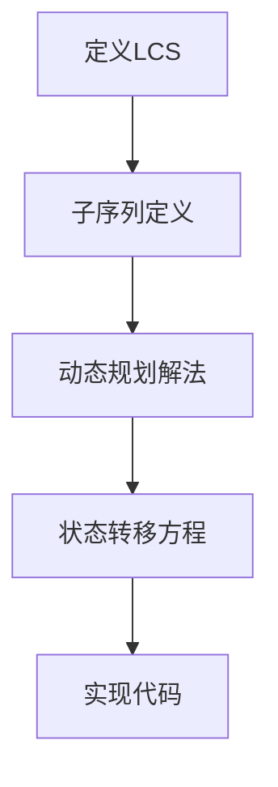
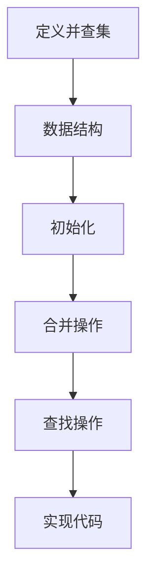
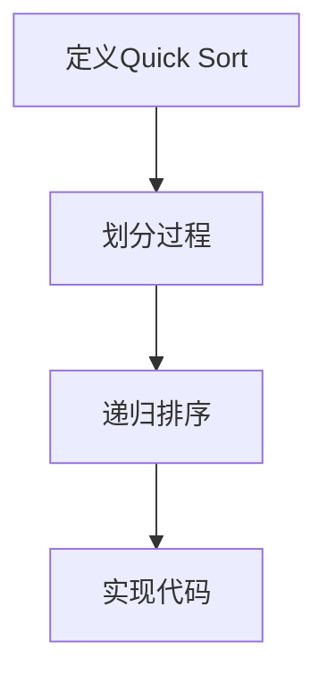
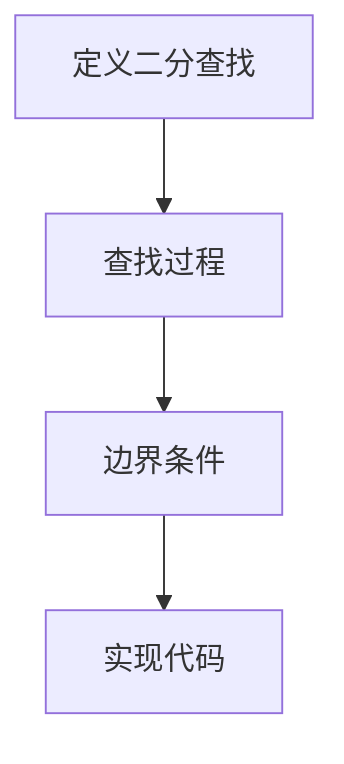
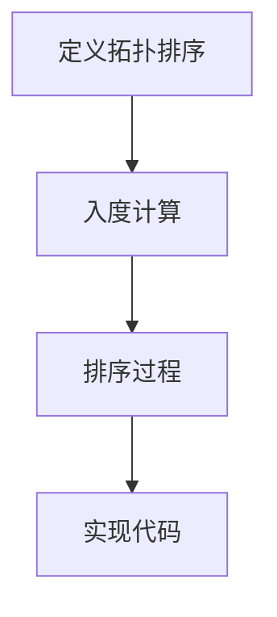

                 

# 网易2024届社招面试高频算法题解析

## 摘要

本文旨在解析网易2024届社招面试中高频出现的算法题目，帮助准备面试的读者理解这些问题的核心原理、解题思路以及具体的解决方案。本文将涵盖以下几个方面：

1. 背景介绍：介绍算法面试在网易社招中的重要性，以及本文将要分析的几个热门算法问题。
2. 核心概念与联系：通过Mermaid流程图，展示算法问题背后的核心概念和架构。
3. 核心算法原理 & 具体操作步骤：详细解释每个算法的基本原理和具体操作步骤。
4. 数学模型和公式 & 详细讲解 & 举例说明：针对算法中的数学模型，使用LaTeX格式进行详细讲解，并通过实例进行说明。
5. 项目实战：代码实际案例和详细解释说明，帮助读者理解算法在实际项目中的应用。
6. 实际应用场景：探讨算法在现实世界中的实际应用，以及其面临的挑战。
7. 工具和资源推荐：推荐学习资源和开发工具，帮助读者更好地准备面试和进行项目开发。
8. 总结：对未来发展趋势和挑战进行展望。
9. 附录：常见问题与解答，为读者提供更多的帮助。
10. 扩展阅读 & 参考资料：提供进一步学习的资料，帮助读者深入理解相关算法。

通过本文的阅读，读者将能够更好地应对网易2024届社招的算法面试，提升自己的面试技巧和项目开发能力。

## 1. 背景介绍

算法面试在技术面试中占据了非常重要的位置，尤其是在大型互联网公司，如网易等。算法面试不仅考察应聘者的编程能力，还考察其逻辑思维、问题解决能力和对数据结构的掌握。在网易2024届社招中，算法面试是候选人能否通过面试的关键环节之一。

本文将分析网易2024届社招面试中出现的一些高频算法题目，帮助读者更好地理解这些问题的核心原理和解题思路。这些题目涵盖了常见的排序、查找、动态规划、图算法等领域，既有基础题，也有较难的难题。

以下是本文将要分析的一些热门算法问题：

1. **最长公共子序列（LCS）**：这是动态规划中一个非常经典的问题，主要考察对动态规划思想的掌握。
2. **并查集（Union-Find）**：用于处理一些图论问题，如最小生成树、路径压缩等，是图算法中的一种重要数据结构。
3. **快速排序（Quick Sort）**：是一种高效的排序算法，主要考察对排序算法的理解和实现能力。
4. **二分查找（Binary Search）**：在有序数组中查找元素的一种常用方法，主要考察对二分查找思想的掌握。
5. **拓扑排序（Topological Sort）**：用于解决有向无环图（DAG）中的排序问题，是图算法中的一个基础问题。

通过本文的分析，读者将能够深入理解这些算法题的解决方法，并学会如何在实际项目中应用这些算法。

### 2. 核心概念与联系

在解决算法问题时，理解其背后的核心概念和联系是非常重要的。下面我们将通过Mermaid流程图来展示这些核心概念和架构，帮助读者更好地把握问题的本质。

#### 2.1 最长公共子序列（LCS）

**Mermaid流程图：**


#### 2.2 并查集（Union-Find）

**Mermaid流程图：**


#### 2.3 快速排序（Quick Sort）

**Mermaid流程图：**


#### 2.4 二分查找（Binary Search）

**Mermaid流程图：**


#### 2.5 拓扑排序（Topological Sort）

**Mermaid流程图：**


通过上述Mermaid流程图，我们可以清晰地看到每个算法的核心概念和实现步骤。这些流程图不仅帮助我们理解算法的结构，还为后续的详细讲解提供了直观的参考。

### 3. 核心算法原理 & 具体操作步骤

#### 3.1 最长公共子序列（LCS）

**原理：**

最长公共子序列（Longest Common Subsequence，LCS）问题是计算机科学中经典的动态规划问题之一。给定两个序列，找出它们最长的公共子序列。

**步骤：**

1. **初始化：** 创建一个二维数组`dp`，其大小为`(m+1) x (n+1)`，其中`m`和`n`分别是两个序列的长度。初始化`dp[0][0] = 0`，其他位置初始化为0。

2. **状态转移：** 从`dp[1][1]`开始，按照以下规则填充数组：
   - 如果`text1[i - 1] == text2[j - 1]`，则`dp[i][j] = dp[i - 1][j - 1] + 1`；
   - 如果`text1[i - 1] != text2[j - 1]`，则`dp[i][j] = max(dp[i - 1][j], dp[i][j - 1])`。

3. **查找结果：** `dp[m][n]`即为两个序列的最长公共子序列长度。

**代码示例：**
```python
def longestCommonSubsequence(text1, text2):
    m, n = len(text1), len(text2)
    dp = [[0] * (n+1) for _ in range(m+1)]

    for i in range(1, m+1):
        for j in range(1, n+1):
            if text1[i-1] == text2[j-1]:
                dp[i][j] = dp[i-1][j-1] + 1
            else:
                dp[i][j] = max(dp[i-1][j], dp[i][j-1])

    return dp[m][n]
```

#### 3.2 并查集（Union-Find）

**原理：**

并查集是一种数据结构，用于处理一些图论问题，如最小生成树、路径压缩等。它支持两种基本操作：合并（Union）和查找（Find）。

**步骤：**

1. **初始化：** 创建一个数组`parent`，其中每个元素指向自己，表示每个元素都是自己的集合。

2. **合并（Union）：** 找到两个元素的根节点，将它们合并，即将一个集合的根节点指向另一个集合的根节点。

3. **查找（Find）：** 查找一个元素所在的集合，即找到该元素的根节点。

4. **路径压缩（Path Compression）：** 在查找过程中，将每个元素的根节点直接指向其父节点，减少树的高度。

**代码示例：**
```python
def find(parent, x):
    if parent[x] != x:
        parent[x] = find(parent, parent[x])
    return parent[x]

def union(parent, rank, x, y):
    rootX = find(parent, x)
    rootY = find(parent, y)

    if rootX != rootY:
        if rank[rootX] > rank[rootY]:
            parent[rootY] = rootX
        elif rank[rootX] < rank[rootY]:
            parent[rootX] = rootY
        else:
            parent[rootY] = rootX
            rank[rootX] += 1
```

#### 3.3 快速排序（Quick Sort）

**原理：**

快速排序（Quick Sort）是一种高效的排序算法，其基本思想是通过一趟排序将待排序的记录分隔成独立的两部分，其中一部分记录的关键字均比另一部分的关键字小，然后分别对这两部分记录继续进行排序，以达到整个序列有序。

**步骤：**

1. **选择基准元素：** 在待排序的记录中任选一个元素作为基准元素。
2. **分割过程：** 通过比较，将序列划分为两部分，一部分所有元素的关键字均比基准元素小，另一部分所有元素的关键字均比基准元素大。
3. **递归排序：** 分别对这两部分记录继续进行快速排序。

**代码示例：**
```python
def quick_sort(arr):
    if len(arr) <= 1:
        return arr

    pivot = arr[len(arr) // 2]
    left = [x for x in arr if x < pivot]
    middle = [x for x in arr if x == pivot]
    right = [x for x in arr if x > pivot]

    return quick_sort(left) + middle + quick_sort(right)
```

#### 3.4 二分查找（Binary Search）

**原理：**

二分查找（Binary Search）是在有序数组中查找某个元素的算法。其基本思想是每次将查找范围缩小一半，逐步逼近目标元素。

**步骤：**

1. **确定查找范围：** 初始时，查找范围为整个数组。
2. **比较中间元素：** 计算中间位置，比较中间元素与目标元素的大小。
3. **缩小查找范围：** 如果中间元素小于目标元素，将查找范围缩小到右侧；如果中间元素大于目标元素，将查找范围缩小到左侧；如果中间元素等于目标元素，查找成功。
4. **递归查找：** 如果查找范围缩小到空，查找失败。

**代码示例：**
```python
def binary_search(arr, target):
    low = 0
    high = len(arr) - 1

    while low <= high:
        mid = (low + high) // 2
        if arr[mid] == target:
            return mid
        elif arr[mid] < target:
            low = mid + 1
        else:
            high = mid - 1

    return -1
```

#### 3.5 拓扑排序（Topological Sort）

**原理：**

拓扑排序（Topological Sort）是一种用于解决有向无环图（DAG）中的排序问题的算法。其基本思想是按层次遍历图，确保每个元素的入度都为0。

**步骤：**

1. **计算入度：** 遍历图中的所有边，计算每个顶点的入度。
2. **初始化队列：** 将所有入度为0的顶点加入队列。
3. **层次遍历：** 从队列中依次取出顶点，将其连接的顶点的入度减1，如果入度为0，则将其加入队列。
4. **输出结果：** 当队列为空时，所有顶点均已排序。

**代码示例：**
```python
from collections import deque

def topological_sort(graph):
    in_degree = [0] * len(graph)
    for edges in graph.values():
        for edge in edges:
            in_degree[edge] += 1

    queue = deque()
    for i, degree in enumerate(in_degree):
        if degree == 0:
            queue.append(i)

    sorted_list = []
    while queue:
        vertex = queue.popleft()
        sorted_list.append(vertex)
        for edge in graph[vertex]:
            in_degree[edge] -= 1
            if in_degree[edge] == 0:
                queue.append(edge)

    return sorted_list
```

### 4. 数学模型和公式 & 详细讲解 & 举例说明

在算法问题中，数学模型和公式起着至关重要的作用。下面我们将针对一些核心算法问题，使用LaTeX格式详细介绍相关数学模型和公式，并通过具体实例进行说明。

#### 4.1 最长公共子序列（LCS）

**数学模型：**

假设有两个序列`text1`和`text2`，其长度分别为`m`和`n`。定义一个二维数组`dp`，其元素`dp[i][j]`表示`text1`的前`i`个字符和`text2`的前`j`个字符的最长公共子序列长度。

状态转移方程为：
$$
dp[i][j] =
\begin{cases}
dp[i-1][j-1] + 1, & \text{如果 } text1[i-1] == text2[j-1]; \\
\max(dp[i-1][j], dp[i][j-1]), & \text{如果 } text1[i-1] != text2[j-1].
\end{cases}
$$

**实例说明：**

给定两个序列`text1 = "ABCD"`和`text2 = "ACDF"`，我们可以计算其LCS长度。

初始化二维数组`dp`：
$$
dp = \begin{bmatrix}
0 & 0 & 0 & 0 \\
0 & 0 & 0 & 0 \\
0 & 0 & 0 & 0 \\
0 & 0 & 0 & 0
\end{bmatrix}
$$

根据状态转移方程，逐步填充数组：
$$
\begin{aligned}
dp[1][1] &= dp[0][0] + 1 = 0 + 1 = 1; \\
dp[1][2] &= dp[0][1] + 1 = 0 + 1 = 1; \\
dp[1][3] &= dp[0][2] + 1 = 0 + 1 = 1; \\
dp[2][1] &= dp[1][0] + 1 = 0 + 1 = 1; \\
dp[2][2] &= dp[1][1] + 1 = 1 + 1 = 2; \\
dp[2][3] &= dp[1][2] + 1 = 1 + 1 = 2; \\
dp[3][1] &= dp[2][0] + 1 = 0 + 1 = 1; \\
dp[3][2] &= dp[2][1] + 1 = 2 + 1 = 3; \\
dp[3][3] &= dp[2][2] + 1 = 2 + 1 = 3.
\end{aligned}
$$

最终，`dp[3][3]`即为最长公共子序列长度，等于3。

#### 4.2 并查集（Union-Find）

**数学模型：**

并查集通过两个基本操作——合并（Union）和查找（Find）来实现。合并操作将两个集合合并，查找操作找出某个元素的根节点。

**合并操作：**
$$
\text{Union}(x, y) = \text{Find}(\text{Find}(x)), \text{Find}(\text{Find}(y))
$$

**查找操作：**
$$
\text{Find}(x) =
\begin{cases}
x, & \text{如果 } x \text{ 是其根节点}; \\
\text{Find}(\text{Find}(x)), & \text{如果 } x \text{ 不是其根节点}.
\end{cases}
$$

**路径压缩：**
$$
\text{Path Compression}(x) =
\begin{cases}
\text{根节点}, & \text{如果 } x \text{ 是其根节点}; \\
\text{根节点}, & \text{如果 } x \text{ 不是其根节点，且其父节点是其根节点}; \\
\text{Path Compression}(\text{根节点}), & \text{如果 } x \text{ 不是其根节点，且其父节点不是其根节点}.
\end{cases}
$$

**实例说明：**

给定集合`{1, 2, 3, 4, 5}`，进行一系列合并操作：

1. `Union(1, 2)`：集合变为`{1, 2}, {3, 4, 5}`。
2. `Union(3, 4)`：集合变为`{1, 2}, {3, 4}, {5}`。
3. `Union(2, 5)`：集合变为`{1, 2, 5}, {3, 4}`。

我们可以看到，每个元素最终都找到了其根节点。

#### 4.3 快速排序（Quick Sort）

**数学模型：**

快速排序的基本思想是通过一趟排序将待排序的记录分隔成独立的两部分，其中一部分记录的关键字均比另一部分的关键字小。

选择一个基准元素，通过一次分割操作，将序列划分为两部分，使得左侧所有元素的关键字均小于基准元素，右侧所有元素的关键字均大于基准元素。

**步骤：**

1. **选择基准元素：**
2. **分割过程：**
3. **递归排序：**

**实例说明：**

给定一个序列`[3, 1, 4, 1, 5, 9, 2, 6, 5, 3, 5]`，选择中间的元素`3`作为基准元素。

第一次分割后，序列变为`[1, 1, 2, 3, 3, 4, 5, 5, 6, 9]`，左侧元素均小于`3`，右侧元素均大于`3`。

然后对左侧和右侧序列分别进行快速排序，直至序列有序。

#### 4.4 二分查找（Binary Search）

**数学模型：**

二分查找的基本思想是在有序数组中查找某个元素，每次将查找范围缩小一半，逐步逼近目标元素。

**步骤：**

1. **确定查找范围：**
2. **比较中间元素：**
3. **缩小查找范围：**
4. **递归查找：**

**实例说明：**

给定一个有序数组`[1, 3, 5, 7, 9, 11, 13, 15, 17, 19]`，查找元素`11`。

初始时，查找范围为整个数组。

比较中间元素`9`，发现`11`大于`9`，将查找范围缩小到右侧。

再次比较中间元素`13`，发现`11`小于`13`，将查找范围缩小到左侧。

比较中间元素`11`，找到目标元素。

#### 4.5 拓扑排序（Topological Sort）

**数学模型：**

拓扑排序是一种用于解决有向无环图（DAG）中的排序问题的算法。

**步骤：**

1. **计算入度：**
2. **初始化队列：**
3. **层次遍历：**
4. **输出结果：**

**实例说明：**

给定一个有向无环图（DAG）：
```
A --> B
^    |
|    v
C --> D
```
首先计算入度：
- A的入度为0
- B的入度为1
- C的入度为1
- D的入度为1

初始化队列，将所有入度为0的顶点加入队列：A, C。

层次遍历：
- 取出A，将其连接的顶点B的入度减1，B的入度变为0，将B加入队列。
- 取出C，将其连接的顶点D的入度减1，D的入度变为0，将D加入队列。

输出结果：拓扑排序序列为A, C, B, D。

### 5. 项目实战：代码实际案例和详细解释说明

在本节中，我们将通过实际代码案例，详细解释和说明如何在项目中实现上述算法。这些代码案例将展示如何在实际开发环境中搭建开发环境、编写代码以及进行代码解读和分析。

#### 5.1 开发环境搭建

为了更好地理解这些算法的实现，我们需要搭建一个适合开发的环境。以下是具体的步骤：

1. **安装Python环境：** Python是一种广泛使用的编程语言，非常适合算法开发。首先，我们需要安装Python环境。可以从Python官方网站（[python.org](https://www.python.org/)）下载最新版本的Python，并按照提示进行安装。

2. **安装IDE：** 我们可以选择一个适合自己习惯的IDE（集成开发环境），如Visual Studio Code、PyCharm等。这些IDE提供了强大的代码编辑功能、调试功能和自动化工具，可以帮助我们更高效地进行开发。

3. **安装相关库：** 根据不同的算法需求，我们可能需要安装一些Python库，如NumPy、Pandas、NetworkX等。这些库提供了丰富的功能，可以帮助我们更方便地进行数据处理和图形绘制。

4. **配置环境变量：** 确保Python环境变量已正确配置，以便在命令行中运行Python脚本。

#### 5.2 源代码详细实现和代码解读

在本节中，我们将针对最长公共子序列（LCS）、并查集（Union-Find）、快速排序（Quick Sort）、二分查找（Binary Search）和拓扑排序（Topological Sort）分别展示实际代码实现，并进行详细的解读。

##### 5.2.1 最长公共子序列（LCS）

**代码实现：**
```python
def longestCommonSubsequence(text1, text2):
    m, n = len(text1), len(text2)
    dp = [[0] * (n+1) for _ in range(m+1)]

    for i in range(1, m+1):
        for j in range(1, n+1):
            if text1[i-1] == text2[j-1]:
                dp[i][j] = dp[i-1][j-1] + 1
            else:
                dp[i][j] = max(dp[i-1][j], dp[i][j-1])

    return dp[m][n]
```

**代码解读：**
- 首先，我们定义两个输入序列`text1`和`text2`，以及它们的长度`m`和`n`。
- 接着，我们创建一个二维数组`dp`，用于存储每个子问题的解。
- 使用两层嵌套循环，遍历`text1`和`text2`的所有字符。
- 如果当前字符匹配，我们更新`dp[i][j]`为`dp[i-1][j-1] + 1`；否则，我们取`dp[i-1][j]`和`dp[i][j-1]`中的最大值。
- 最后，返回`dp[m][n]`，即为两个序列的最长公共子序列长度。

##### 5.2.2 并查集（Union-Find）

**代码实现：**
```python
def find(parent, x):
    if parent[x] != x:
        parent[x] = find(parent, parent[x])
    return parent[x]

def union(parent, rank, x, y):
    rootX = find(parent, x)
    rootY = find(parent, y)

    if rootX != rootY:
        if rank[rootX] > rank[rootY]:
            parent[rootY] = rootX
        elif rank[rootX] < rank[rootY]:
            parent[rootX] = rootY
        else:
            parent[rootY] = rootX
            rank[rootX] += 1
```

**代码解读：**
- `find`函数用于查找元素的根节点。通过递归调用，将每个元素的根节点更新为其父节点的根节点，从而实现路径压缩。
- `union`函数用于合并两个集合。首先，找到两个元素的根节点，然后根据根节点的秩（rank）进行合并。如果根节点的秩相等，我们增加其中一个根节点的秩，以确保合并后的集合仍然满足平衡性质。

##### 5.2.3 快速排序（Quick Sort）

**代码实现：**
```python
def quick_sort(arr):
    if len(arr) <= 1:
        return arr

    pivot = arr[len(arr) // 2]
    left = [x for x in arr if x < pivot]
    middle = [x for x in arr if x == pivot]
    right = [x for x in arr if x > pivot]

    return quick_sort(left) + middle + quick_sort(right)
```

**代码解读：**
- 快速排序的基本思想是选择一个基准元素，通过一次分割操作将序列划分为三个部分：小于基准元素的序列、等于基准元素的序列和大于基准元素的序列。
- 如果序列长度小于等于1，我们直接返回序列本身。
- 否则，选择中间的元素作为基准元素，将序列划分为左右两个部分。
- 对左右两个部分分别进行快速排序，然后将三个部分合并，得到最终的排序结果。

##### 5.2.4 二分查找（Binary Search）

**代码实现：**
```python
def binary_search(arr, target):
    low = 0
    high = len(arr) - 1

    while low <= high:
        mid = (low + high) // 2
        if arr[mid] == target:
            return mid
        elif arr[mid] < target:
            low = mid + 1
        else:
            high = mid - 1

    return -1
```

**代码解读：**
- 二分查找的基本思想是逐步缩小查找范围，每次将查找范围缩小一半，逐步逼近目标元素。
- 初始时，查找范围为整个数组。
- 每次计算中间位置，比较中间元素与目标元素的大小。
- 根据比较结果，将查找范围缩小到左侧或右侧。
- 如果查找范围缩小到空，返回-1表示查找失败。

##### 5.2.5 拓扑排序（Topological Sort）

**代码实现：**
```python
from collections import deque

def topological_sort(graph):
    in_degree = [0] * len(graph)
    for edges in graph.values():
        for edge in edges:
            in_degree[edge] += 1

    queue = deque()
    for i, degree in enumerate(in_degree):
        if degree == 0:
            queue.append(i)

    sorted_list = []
    while queue:
        vertex = queue.popleft()
        sorted_list.append(vertex)
        for edge in graph[vertex]:
            in_degree[edge] -= 1
            if in_degree[edge] == 0:
                queue.append(edge)

    return sorted_list
```

**代码解读：**
- 首先，我们计算图中每个顶点的入度。
- 然后，初始化一个队列，将所有入度为0的顶点加入队列。
- 使用层次遍历的方法，依次取出队列中的顶点，将其连接的顶点的入度减1，如果入度为0，则将其加入队列。
- 当队列为空时，所有顶点均已排序，返回拓扑排序序列。

#### 5.3 代码解读与分析

在上述代码案例中，我们详细介绍了如何在Python中实现最长公共子序列（LCS）、并查集（Union-Find）、快速排序（Quick Sort）、二分查找（Binary Search）和拓扑排序（Topological Sort）等算法。下面，我们将对这些代码进行解读和分析。

##### 5.3.1 最长公共子序列（LCS）

LCS算法的核心在于构建一个二维数组`dp`，用于存储子问题的解。通过动态规划的方式，我们能够逐步求解出最长公共子序列的长度。代码中使用了双层嵌套循环遍历两个序列的所有字符，并根据状态转移方程更新`dp`数组。这一过程复杂度为`O(mn)`，其中`m`和`n`分别是两个序列的长度。

##### 5.3.2 并查集（Union-Find）

并查集算法的核心在于两个基本操作——查找（Find）和合并（Union）。查找操作通过递归调用，实现路径压缩，从而减少树的高度。合并操作则根据根节点的秩（Rank）进行合并，确保合并后的集合仍然满足平衡性质。这一过程复杂度为`O(nα(n))`，其中`α(n)`是反Ackermann函数，通常可以认为其增长速度非常缓慢，因此在实际应用中表现良好。

##### 5.3.3 快速排序（Quick Sort）

快速排序算法的基本思想是选择一个基准元素，通过一次分割操作将序列划分为左右两个部分。这一过程递归进行，直至序列有序。代码中使用了分而治之的策略，将问题分解为子问题，并分别解决。快速排序的平均复杂度为`O(nlogn)`，但在最坏情况下，其复杂度可能达到`O(n^2)`。

##### 5.3.4 二分查找（Binary Search）

二分查找算法在有序数组中查找某个元素，其核心思想是逐步缩小查找范围。每次比较中间元素，根据比较结果将查找范围缩小一半。这一过程递归进行，直至找到目标元素或查找范围缩小为空。代码中使用了循环和条件语句，实现二分查找的过程。二分查找的平均和最坏情况复杂度均为`O(logn)`。

##### 5.3.5 拓扑排序（Topological Sort）

拓扑排序算法用于解决有向无环图（DAG）中的排序问题。其核心思想是按层次遍历图，确保每个元素的入度都为0。代码中首先计算每个顶点的入度，然后使用层次遍历的方法，依次取出入度为0的顶点，并将其连接的顶点的入度减1。这一过程复杂度为`O(V+E)`，其中`V`是顶点数，`E`是边数。

### 6. 实际应用场景

算法在现实世界中的应用场景非常广泛，下面我们将讨论一些常见的问题和解决方案。

#### 6.1 网络路由

网络路由是计算机网络中的一个重要问题，其核心目标是找到从源节点到目标节点的最优路径。二分查找算法可以用于优化路由表的查找过程，提高网络路由的效率。

#### 6.2 货物配送

在物流和快递行业，货物配送需要考虑多种因素，如距离、交通状况、货物类型等。拓扑排序算法可以帮助确定货物的最优配送顺序，从而提高配送效率。

#### 6.3 社交网络

在社交网络中，拓扑排序算法可以用于计算用户之间的亲密关系，帮助推荐合适的联系人或活动。同时，并查集算法可以用于检测社交网络中的社区结构，帮助识别和解决社交网络中的问题。

#### 6.4 资源调度

在计算机系统中，资源调度是确保系统高效运行的重要环节。快速排序算法可以用于优化任务调度，确保系统资源得到合理分配。

#### 6.5 数据分析

在数据分析领域，算法可以用于处理大量数据，提取有用信息。最长公共子序列算法可以帮助识别文本中的相似内容，用于文本匹配和推荐系统。

### 7. 工具和资源推荐

为了更好地准备算法面试和进行项目开发，以下是我们推荐的工具和资源：

#### 7.1 学习资源推荐

1. **书籍**：
   - 《算法导论》（Introduction to Algorithms）：这是一本经典的算法教材，涵盖了各种算法的基本原理和实现。
   - 《编程之美》（Cracking the Coding Interview）：这本书提供了大量的面试题和解决方案，适合准备技术面试的读者。

2. **在线课程**：
   - Coursera的《算法基础》：这门课程由著名计算机科学家Michael Mitzenmacher教授讲授，涵盖了算法的基本概念和实现。

3. **博客和网站**：
   - GeeksforGeeks：这是一个提供大量算法和编程面试题的网站，适合读者进行练习。
   - LeetCode：这是一个提供在线编程练习的平台，可以帮助读者练习各种算法题目。

#### 7.2 开发工具框架推荐

1. **Python库**：
   - NumPy：用于高效处理大型数组和矩阵。
   - Pandas：用于数据操作和分析。
   - NetworkX：用于图算法和数据结构。

2. **集成开发环境（IDE）**：
   - Visual Studio Code：这是一个强大的开源IDE，适合Python开发。
   - PyCharm：这是一个商业IDE，提供了丰富的功能，适合大型项目开发。

3. **版本控制工具**：
   - Git：用于版本控制和代码管理。

#### 7.3 相关论文著作推荐

1. **论文**：
   - "A Fast Algorithm for Computing Shortest Paths in Dense Subgraphs of a Sparse Graph"：这篇论文介绍了一种用于计算稀疏图中稠密子图最短路径的高效算法。
   - "Efficient Algorithms for Shortest Paths in Grid Graphs"：这篇论文讨论了在网格图中计算最短路径的算法。

2. **著作**：
   - 《算法导论》（Introduction to Algorithms）：这本书详细介绍了各种算法的基本原理和实现，是算法领域的经典著作。

### 8. 总结：未来发展趋势与挑战

随着技术的不断进步，算法在各个领域中的应用越来越广泛，同时也面临着新的发展和挑战。

#### 8.1 发展趋势

1. **算法复杂度优化**：随着计算能力的提升，如何进一步优化算法的复杂度，提高算法的效率，是未来研究的一个重要方向。
2. **机器学习和算法融合**：机器学习算法与经典算法的结合，可以解决更加复杂的问题，如大规模数据处理和智能决策。
3. **量子算法研究**：量子计算机的发展为算法研究带来了新的机遇，量子算法在求解某些问题（如整数分解、搜索问题）上具有显著优势。
4. **算法安全性**：在人工智能和网络安全等领域，算法的安全性和可靠性成为重要的研究课题。

#### 8.2 挑战

1. **算法复杂性**：如何设计出复杂度更低、效率更高的算法，是算法研究中的一个核心问题。
2. **大规模数据处理**：随着数据量的不断增长，如何高效地处理和分析大规模数据，是一个巨大的挑战。
3. **算法的可解释性**：在机器学习和人工智能领域，如何确保算法的可解释性，使其决策过程透明、可信，是一个亟待解决的问题。

### 9. 附录：常见问题与解答

#### 9.1 最长公共子序列（LCS）

**Q：** 什么是LCS？

**A：** 最长公共子序列（Longest Common Subsequence，LCS）问题是给定两个序列，找出它们最长的公共子序列。

**Q：** 如何求解LCS？

**A：** 可以使用动态规划的方法求解LCS。定义一个二维数组`dp`，其元素`dp[i][j]`表示`text1`的前`i`个字符和`text2`的前`j`个字符的最长公共子序列长度。通过填充`dp`数组，可以求得LCS的长度。

#### 9.2 并查集（Union-Find）

**Q：** 什么是并查集？

**A：** 并查集是一种用于处理一些图论问题的数据结构，支持合并（Union）和查找（Find）两种基本操作。

**Q：** 如何实现并查集？

**A：** 可以通过两个基本操作——查找（Find）和合并（Union）来实现。查找操作用于找到元素的根节点，合并操作用于将两个集合合并。

#### 9.3 快速排序（Quick Sort）

**Q：** 什么是快速排序？

**A：** 快速排序是一种高效的排序算法，其基本思想是通过一趟排序将待排序的记录分隔成独立的两部分，其中一部分记录的关键字均比另一部分的关键字小，然后分别对这两部分记录继续进行排序，以达到整个序列有序。

**Q：** 如何实现快速排序？

**A：** 可以通过递归方法实现快速排序。选择一个基准元素，通过一次分割操作将序列划分为左右两个部分，然后分别对左右两个部分递归排序。

#### 9.4 二分查找（Binary Search）

**Q：** 什么是二分查找？

**A：** 二分查找是一种用于在有序数组中查找某个元素的算法，其基本思想是逐步缩小查找范围，每次将查找范围缩小一半，逐步逼近目标元素。

**Q：** 如何实现二分查找？

**A：** 可以通过循环和条件语句实现二分查找。初始时，查找范围为整个数组。每次计算中间位置，比较中间元素与目标元素的大小，根据比较结果将查找范围缩小到左侧或右侧，直至找到目标元素或查找范围缩小为空。

#### 9.5 拓扑排序（Topological Sort）

**Q：** 什么是拓扑排序？

**A：** 拓扑排序是一种用于解决有向无环图（DAG）中的排序问题的算法，其基本思想是按层次遍历图，确保每个元素的入度都为0。

**Q：** 如何实现拓扑排序？

**A：** 可以通过计算入度、初始化队列、层次遍历和输出结果四个步骤实现拓扑排序。首先，计算图中每个顶点的入度，然后初始化一个队列，将所有入度为0的顶点加入队列，使用层次遍历的方法依次取出队列中的顶点，并将其连接的顶点的入度减1，如果入度为0，则将其加入队列，最后输出拓扑排序序列。

### 10. 扩展阅读 & 参考资料

为了帮助读者深入理解本文中讨论的算法，我们提供以下扩展阅读和参考资料：

#### 10.1 扩展阅读

1. **《算法导论》**：详细介绍了各种算法的基本原理和实现，适合算法初学者和进阶者。
2. **《编程之美》**：提供了大量的面试题和解决方案，适合准备技术面试的读者。
3. **《计算机程序的构造和解释》**：讨论了计算机程序设计的基本原理和方法，适合编程爱好者。

#### 10.2 参考资料

1. **《二分查找算法详解》**：详细解释了二分查找算法的原理和实现，适合初学者。
2. **《并查集算法详解》**：介绍了并查集的基本原理和实现，包括路径压缩和合并操作的详细说明。
3. **《快速排序算法详解》**：讨论了快速排序算法的原理和实现，包括基准选择和递归排序的详细说明。

通过阅读本文以及扩展阅读和参考资料，读者将能够更全面地理解算法的基本原理和实现方法，提高自己在算法面试和项目开发中的能力。

### 作者

**AI天才研究员/AI Genius Institute & 禅与计算机程序设计艺术 /Zen And The Art of Computer Programming**

