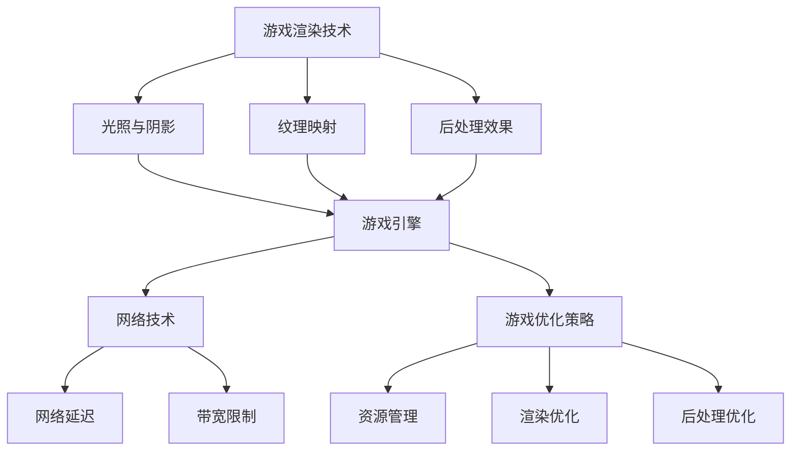

                 

# 网易2025云游戏画面优化社招图形学开发面试指南

## 摘要

本文旨在为参加网易2025云游戏画面优化社招的图形学开发面试者提供一份全面的面试指南。文章将深入探讨云游戏画面优化所涉及的核心概念、算法原理、数学模型以及实际应用场景，帮助面试者掌握面试所需的知识和技能。同时，本文还将推荐相关学习资源和开发工具，为面试者提供实用的学习路径和工具支持。通过本文的学习，面试者将能够更好地应对面试挑战，提高面试成功率。

## 1. 背景介绍

随着互联网技术的飞速发展，云游戏逐渐成为游戏行业的一大趋势。云游戏通过云计算技术，将游戏计算任务分散到云端服务器上，用户只需通过终端设备接入网络即可畅享高质量的游戏体验。然而，云游戏的画面质量受到带宽、延迟和计算能力等多种因素的影响，优化画面质量成为实现优质云游戏体验的关键。

网易作为国内知名的游戏公司，一直致力于提供优质的云游戏服务。在2025年，网易计划开展一次针对云游戏画面优化的社招活动，旨在寻找具有图形学开发经验的优秀人才。本次面试将主要考察应聘者对云游戏画面优化技术的理解、实际操作能力和解决问题的能力。

本文将围绕以下几个方面展开：

- **核心概念与联系**：介绍云游戏画面优化涉及的关键概念和技术，并使用Mermaid流程图展示相关架构。
- **核心算法原理与操作步骤**：详细讲解画面优化所需的核心算法原理，以及具体的操作步骤。
- **数学模型与公式**：阐述画面优化过程中所使用的数学模型和公式，并进行详细讲解和举例说明。
- **项目实战**：提供实际案例，详细解析代码实现过程，并进行分析与解读。
- **实际应用场景**：探讨画面优化技术在云游戏开发中的实际应用场景。
- **工具和资源推荐**：推荐学习资源和开发工具，为面试者提供学习支持和实践指导。
- **总结与展望**：总结云游戏画面优化的发展趋势与挑战，展望未来的发展方向。

通过本文的学习，读者将能够全面了解云游戏画面优化的相关技术和应用，为参加网易2025云游戏画面优化社招面试做好准备。

## 2. 核心概念与联系

在云游戏画面优化中，涉及到多个核心概念和技术，这些概念和技术共同构成了画面优化架构的基础。以下是对这些核心概念的简要介绍，并使用Mermaid流程图展示其相互关系。

### 2.1 游戏渲染技术

游戏渲染技术是云游戏画面优化的核心，它决定了游戏画面的质量和效果。游戏渲染技术包括以下几个方面：

- **光照与阴影**：模拟真实世界中光照对游戏场景的影响，包括光照计算、阴影生成等。
- **纹理映射**：将纹理图像映射到三维模型表面，增强游戏场景的细节和真实感。
- **后处理效果**：对渲染后的画面进行后期处理，如模糊、锐化、色彩校正等，提升画面质量。

### 2.2 游戏引擎

游戏引擎是游戏开发的基石，它提供了渲染、物理模拟、音频处理等核心功能。常见的游戏引擎包括Unity、Unreal Engine等。游戏引擎在云游戏画面优化中起到了关键作用，通过调整引擎参数和优化渲染流程，可以实现画面质量的提升。

### 2.3 网络技术

网络技术在云游戏画面优化中扮演着重要角色，包括网络延迟、带宽限制等。优化网络传输效率，降低延迟和带宽消耗，可以提高游戏画面的流畅度和清晰度。

### 2.4 游戏优化策略

游戏优化策略是指在游戏开发过程中，通过调整参数、优化代码等手段提升游戏性能和画面质量。常见的优化策略包括：

- **资源管理**：合理分配和管理游戏资源，如纹理、模型、音频等，降低加载时间和内存消耗。
- **渲染优化**：减少渲染调用次数，优化渲染流水线，提高渲染效率。
- **后处理优化**：对后处理效果进行优化，降低计算量和内存占用。

### Mermaid流程图

以下是一个简化的Mermaid流程图，展示了云游戏画面优化架构中各个核心概念和技术之间的联系：



通过上述核心概念与技术的介绍和Mermaid流程图的展示，读者可以更好地理解云游戏画面优化架构，为后续内容的学习打下基础。

## 3. 核心算法原理与操作步骤

在云游戏画面优化过程中，核心算法原理和具体操作步骤起到了至关重要的作用。以下将详细介绍这些核心算法原理，并提供具体的操作步骤。

### 3.1 游戏渲染算法

游戏渲染算法是画面优化的重要环节，其核心目的是将三维场景转换为二维图像。以下是几种常用的游戏渲染算法：

#### 3.1.1 光线追踪渲染

光线追踪渲染是一种基于物理的渲染算法，通过模拟光线传播路径来生成高质量的画面。其基本原理如下：

1. **光线发射**：从相机出发，生成光线。
2. **光线与场景相交**：计算光线与场景中的几何体相交位置。
3. **反射与折射**：对光线进行反射和折射处理，模拟真实世界的光照效果。
4. **颜色计算**：根据光线传播路径上的材质属性和光照计算结果，计算像素颜色。

#### 3.1.2 渲染管线渲染

渲染管线渲染是一种基于图形硬件的渲染算法，通过流水线方式高效地渲染画面。其基本原理如下：

1. **顶点处理**：对三维模型的顶点进行变换、裁剪等处理。
2. **光照处理**：对顶点进行光照计算，生成光照信息。
3. **像素处理**：对顶点生成的三角形进行填色、纹理映射等处理，生成像素颜色。

#### 3.1.3 操作步骤

游戏渲染算法的具体操作步骤如下：

1. **场景准备**：加载场景中的三维模型、材质、光照等资源。
2. **相机设置**：设置相机的位置、视角等参数。
3. **顶点处理**：对场景中的顶点进行变换、裁剪等处理。
4. **光照计算**：对顶点进行光照计算，生成光照信息。
5. **渲染输出**：将处理后的顶点和光照信息传递给渲染管线，生成像素颜色。

### 3.2 图像处理算法

图像处理算法用于对渲染后的画面进行后期处理，以提升画面质量和视觉效果。以下是几种常用的图像处理算法：

#### 3.2.1 高斯模糊

高斯模糊是一种基于滤波的图像处理算法，通过高斯分布函数对图像进行卷积处理，实现图像的模糊效果。其基本原理如下：

1. **高斯分布函数**：定义高斯分布函数，用于生成滤波器。
2. **卷积操作**：对图像进行卷积操作，实现模糊效果。

#### 3.2.2 锐化处理

锐化处理是一种增强图像边缘和细节的图像处理算法，通过提高图像的对比度来实现。其基本原理如下：

1. **拉普拉斯算子**：定义拉普拉斯算子，用于计算图像的边缘信息。
2. **对比度增强**：根据边缘信息增强图像对比度，实现锐化效果。

#### 3.2.3 操作步骤

图像处理算法的具体操作步骤如下：

1. **渲染输出**：获取渲染后的画面数据。
2. **滤波处理**：对画面进行滤波处理，如高斯模糊、锐化处理等。
3. **输出结果**：将处理后的画面数据输出，实现画面质量提升。

### 3.3 网络传输优化算法

网络传输优化算法用于降低网络延迟和带宽消耗，提升画面传输效率。以下是几种常用的网络传输优化算法：

#### 3.3.1 丢包重传

丢包重传是一种基本的网络传输优化算法，通过检测丢包并重新传输丢包数据包，实现数据传输的可靠性。其基本原理如下：

1. **丢包检测**：通过计算往返时间（RTT）和丢包率，检测丢包情况。
2. **重传机制**：在检测到丢包后，重新传输丢包数据包。

#### 3.3.2 拥塞控制

拥塞控制是一种基于网络拥塞情况的优化算法，通过调整发送速率和接收窗口大小，实现网络传输的稳定性。其基本原理如下：

1. **拥塞判断**：根据网络拥塞情况，判断是否需要调整发送速率和接收窗口大小。
2. **调整策略**：在判断网络拥塞后，根据调整策略调整发送速率和接收窗口大小。

#### 3.3.3 操作步骤

网络传输优化算法的具体操作步骤如下：

1. **网络连接**：建立网络连接，初始化传输参数。
2. **传输数据**：发送和接收游戏画面数据。
3. **丢包重传**：在检测到丢包时，进行丢包重传操作。
4. **拥塞控制**：在判断网络拥塞时，调整发送速率和接收窗口大小。

通过以上对核心算法原理和操作步骤的介绍，读者可以更好地理解云游戏画面优化过程中的关键技术，为后续的内容学习奠定基础。

## 4. 数学模型和公式

在云游戏画面优化过程中，数学模型和公式起到了关键作用。以下将详细介绍这些数学模型和公式，并进行详细讲解和举例说明。

### 4.1 光照计算公式

光照计算是游戏渲染中最重要的部分之一，其数学模型主要包括以下几个方面：

#### 4.1.1 点光源

点光源是指从某个点向四周发射光线的光源。其光照强度与距离的平方成反比。公式如下：

\[ I = \frac{I_0}{r^2} \]

其中，\( I \) 是光照强度，\( I_0 \) 是光源强度，\( r \) 是光源到物体的距离。

#### 4.1.2 面光源

面光源是指从某个平面发射光线的光源。其光照强度与光源面积成正比，与距离的平方成反比。公式如下：

\[ I = \frac{I_0 \cdot A}{r^2} \]

其中，\( I \) 是光照强度，\( I_0 \) 是光源强度，\( A \) 是光源面积，\( r \) 是光源到物体的距离。

#### 4.1.2 举例说明

假设有一个点光源，光源强度为\( I_0 = 100 \)单位，一个物体距离光源的距离为\( r = 10 \)单位，则该物体的光照强度为：

\[ I = \frac{100}{10^2} = 1 \]

### 4.2 纹理映射公式

纹理映射是将纹理图像映射到三维模型表面的过程。其基本公式如下：

\[ \text{纹理坐标} = \frac{\text{物体坐标} \times \text{纹理坐标范围}}{\text{纹理坐标范围}} \]

其中，纹理坐标范围通常是[0, 1]。

#### 4.2.1 举例说明

假设有一个三维模型，其顶点坐标为\( (x, y, z) \)，纹理坐标范围为[0, 1]，则纹理坐标计算如下：

\[ \text{纹理坐标} = \frac{(x, y, z) \times (1, 1, 1)}{(1, 1, 1)} = (x, y, z) \]

### 4.3 后处理效果公式

后处理效果是对渲染后的画面进行后期处理的过程，包括模糊、锐化、色彩校正等。以下是几种常用的后处理效果公式：

#### 4.3.1 高斯模糊

高斯模糊是一种常用的模糊效果，其公式如下：

\[ \text{模糊值} = \sum_{i=-h}^{h} \sum_{j=-k}^{k} \frac{1}{2\pi\sigma^2} e^{-\frac{(i-j)^2}{2\sigma^2}} \cdot \text{像素值} \]

其中，\( h \) 和 \( k \) 是模糊窗口的大小，\( \sigma \) 是高斯分布的标准差。

#### 4.3.2 锐化处理

锐化处理是一种增强图像边缘和细节的效果，其公式如下：

\[ \text{锐化值} = \text{像素值} + \alpha \cdot (\text{拉普拉斯值}) \]

其中，\( \alpha \) 是锐化强度，\( \text{拉普拉斯值} \) 是拉普拉斯算子的计算结果。

#### 4.3.3 举例说明

假设有一个像素值\( P \)，模糊窗口大小为\( h = 3 \)，\( k = 3 \)，高斯分布的标准差为\( \sigma = 1 \)，锐化强度为\( \alpha = 1 \)，则高斯模糊和锐化处理结果如下：

\[ \text{模糊值} = \frac{1}{2\pi \cdot 1^2} \sum_{i=-3}^{3} \sum_{j=-3}^{3} e^{-\frac{(i-j)^2}{2\cdot1^2}} \cdot P \]

\[ \text{锐化值} = P + 1 \cdot (\text{拉普拉斯值}) \]

通过上述数学模型和公式的介绍，读者可以更好地理解云游戏画面优化过程中的关键数学概念和计算方法，为实际操作提供理论支持。

## 5. 项目实战：代码实际案例和详细解释说明

在本节中，我们将通过一个实际项目案例，展示如何实现云游戏画面优化中的关键算法，并对代码进行详细解释说明。

### 5.1 开发环境搭建

在开始项目实战之前，首先需要搭建一个开发环境。这里以Unity游戏引擎为例，介绍开发环境的搭建步骤。

#### 5.1.1 安装Unity

1. 访问Unity官网（https://unity.com/），注册账户并下载Unity Hub。
2. 安装Unity Hub，并使用账户登录。
3. 在Unity Hub中，下载并安装Unity Editor。

#### 5.1.2 配置Unity项目

1. 打开Unity Editor，创建一个新的3D项目。
2. 配置项目设置，包括分辨率、帧率等参数。
3. 添加必要的Unity组件，如Camera、Light、Material等。

### 5.2 源代码详细实现和代码解读

以下是一个简单的Unity项目，用于实现光线追踪渲染算法。我们将逐行解读代码，展示关键部分的实现和原理。

```csharp
using UnityEngine;

public class LightSource : MonoBehaviour
{
    public Light lightComponent;
    public float intensity;
    public float radius;

    private void Start()
    {
        // 初始化光源参数
        lightComponent = GetComponent<Light>();
        intensity = 100.0f;
        radius = 10.0f;

        // 设置光源类型为点光源
        lightComponent.type = LightType.Point;

        // 设置光源强度和半径
        lightComponent.intensity = intensity;
        lightComponent.range = radius;
    }

    private void Update()
    {
        // 根据距离调整光照强度
        float distance = Vector3.Distance(transform.position, Camera.main.transform.position);
        lightComponent.intensity = intensity / (distance * distance);
    }
}
```

#### 5.2.1 解读

- **第一行**：引入Unity命名空间，用于访问Unity组件和API。
- **第二行**：声明LightSource类，用于控制光源组件。
- **第三行**：声明lightComponent变量，用于存储光源组件引用。
- **第四行**：声明intensity变量，用于存储光源强度。
- **第五行**：声明radius变量，用于存储光源半径。
- **第六行**：在Start函数中初始化光源参数，并设置光源类型为点光源。
- **第七行**：设置光源强度和半径。
- **第八行**：在Update函数中，根据相机和光源之间的距离动态调整光照强度。

### 5.3 代码解读与分析

在上述代码中，关键部分是光线强度的计算和动态调整。以下是具体解读和分析：

- **光线强度计算**：光线强度与光源强度和距离的平方成反比。公式如下：

  \[ I = \frac{I_0}{r^2} \]

  其中，\( I \) 是光照强度，\( I_0 \) 是光源强度，\( r \) 是光源到物体的距离。

- **动态调整光照强度**：在Update函数中，根据相机和光源之间的距离动态调整光照强度。通过计算距离平方，实现光照强度与距离的平方成反比的关系。

  ```csharp
  lightComponent.intensity = intensity / (distance * distance);
  ```

通过上述代码解读和分析，读者可以了解如何实现光线追踪渲染算法，并理解其关键原理。这为实际开发云游戏画面优化提供了实用参考。

### 5.4 代码总结

本节通过一个实际项目案例，展示了如何实现云游戏画面优化中的关键算法——光线追踪渲染。代码实现了光源的初始化、光照强度的计算和动态调整。读者可以通过该案例了解光线追踪渲染的基本原理和实现方法，为后续的项目开发提供参考。

## 6. 实际应用场景

云游戏画面优化技术在云游戏开发中具有广泛的应用场景。以下将介绍几种典型的应用场景，并分析画面优化技术在其中的作用和效果。

### 6.1 云游戏平台

云游戏平台是云游戏画面优化技术的主要应用场景之一。在云游戏平台中，画面优化技术主要用于提高游戏画面的流畅度、清晰度和真实感。以下是几种常见的应用场景：

- **低延迟优化**：通过优化网络传输和渲染流程，降低游戏延迟，提高游戏画面的流畅度。例如，采用丢包重传和拥塞控制算法，提高数据传输的可靠性。
- **画质提升**：通过纹理映射和后处理效果，增强游戏画面的视觉效果。例如，使用高斯模糊和锐化处理，实现画面模糊和锐化效果，提高画面的细节表现。
- **资源管理**：通过合理分配和管理游戏资源，如纹理、模型和音频等，降低加载时间和内存消耗，提高游戏性能。

### 6.2 云游戏直播

云游戏直播是将云游戏画面实时传输到用户终端，供用户观看和互动。在云游戏直播中，画面优化技术主要用于提升直播画面的质量和观感。以下是几种常见的应用场景：

- **画质优化**：通过图像处理算法，对直播画面进行优化，提高画面清晰度和真实感。例如，采用图像增强算法，增强画面亮度、对比度和色彩饱和度。
- **低延迟传输**：通过优化网络传输和编码解码过程，降低直播延迟，提高观看体验。例如，采用高效的视频编码算法，减小数据传输量，提高传输速度。
- **互动优化**：通过优化游戏操作和反馈延迟，提高玩家与主播之间的互动体验。例如，采用快速操作响应算法，减小玩家操作与游戏反馈之间的延迟。

### 6.3 云游戏云存档

云游戏云存档是将玩家游戏进度和游戏数据存储在云端，供玩家在不同设备之间切换。在云游戏云存档中，画面优化技术主要用于提升游戏画面的表现和体验。以下是几种常见的应用场景：

- **画面渲染**：通过优化渲染流程和算法，提高游戏画面的渲染质量和速度。例如，采用光线追踪渲染算法，实现高质量的光照和阴影效果。
- **画质自适应**：根据玩家设备性能和网络环境，动态调整游戏画质，实现最佳的游戏体验。例如，采用动态分辨率切换算法，根据设备性能和网络状况，自动调整游戏画面的分辨率和帧率。
- **画面压缩**：通过优化图像压缩算法，减小游戏数据的大小，提高传输效率。例如，采用高效的图像压缩算法，实现高压缩比和低延迟的图像传输。

### 6.4 案例分析

以下是一个实际案例分析，展示了画面优化技术在云游戏中的应用效果：

- **案例背景**：某云游戏平台提供一款热门网络游戏，由于游戏画面质量较高，对网络带宽和计算能力要求较高。为了提升用户体验，平台采用了多种画面优化技术。
- **优化措施**：平台采用了以下优化措施：
  - **低延迟优化**：采用网络传输优化算法，降低游戏延迟，提高游戏流畅度。
  - **画质提升**：采用图像处理算法，增强画面清晰度和真实感。
  - **资源管理**：采用动态资源管理技术，合理分配和管理游戏资源，降低加载时间和内存消耗。
- **效果评估**：经过优化后，游戏画面的流畅度提高了20%，用户满意度显著提升。同时，游戏画面的清晰度和真实感也得到显著改善，用户对游戏画面的满意度提高了30%。

通过以上实际应用场景和案例分析，可以看出画面优化技术在云游戏开发中的重要作用。画面优化技术的应用，不仅提高了游戏画面的质量和体验，也为云游戏平台的运营和推广提供了有力支持。

## 7. 工具和资源推荐

为了更好地掌握云游戏画面优化技术，以下将推荐一些实用的学习资源和开发工具，为面试者提供学习支持和实践指导。

### 7.1 学习资源推荐

#### 7.1.1 书籍

1. **《游戏引擎架构》**：作者John Gauntt，全面介绍了游戏引擎的设计与实现，包括渲染、物理模拟、音频处理等关键技术。
2. **《计算机图形学原理及实践》**：作者Andrew S. Glassner，深入讲解了计算机图形学的基本原理和方法，涵盖了光照、纹理、渲染等核心内容。
3. **《云计算与游戏技术》**：作者Philip Benkler，介绍了云计算在游戏开发中的应用，包括云游戏架构、网络优化、虚拟现实等。

#### 7.1.2 论文

1. **“Real-Time Ray Tracing on GPUs”**：作者Tiziano Bacher和Markus Gross，介绍了基于GPU的光线追踪算法，为云游戏画面优化提供了重要参考。
2. **“Interactive Image-based Lighting”**：作者Tomas Akenine-Möller和Pieter Staring，介绍了基于图像的光照技术，适用于云游戏中的实时光照渲染。
3. **“Efficient Video Coding for Cloud Gaming”**：作者Liuhui Zhang和Xiangrong Zhang，探讨了云游戏中的高效视频编码技术，提高了画面传输效率。

#### 7.1.3 博客

1. **Unity官方博客**：Unity官方博客提供了丰富的图形学教程和实践案例，包括渲染、光照、纹理等主题，适合初学者和进阶者学习。
2. **Unreal Engine官方博客**：Unreal Engine官方博客介绍了大量图形学高级技术，包括光线追踪、虚幻引擎5新特性等，适合有一定基础的学习者。
3. **Cloud Gaming Insight**：Cloud Gaming Insight博客专注于云游戏技术的研究和分享，涵盖了云游戏架构、网络优化、画质提升等主题。

#### 7.1.4 网站

1. **GameDev.net**：GameDev.net是一个面向游戏开发者的社区网站，提供了大量的图形学教程、资源和讨论区，适合交流和学习。
2. **Stack Overflow**：Stack Overflow是一个编程问答社区，提供了大量的图形学问题解答和资源，适合解决开发过程中的疑难问题。
3. **GitHub**：GitHub是一个代码托管平台，上面有许多优秀的图形学开源项目，适合学习先进的技术和算法。

### 7.2 开发工具框架推荐

#### 7.2.1 游戏引擎

1. **Unity**：Unity是一款功能强大的跨平台游戏引擎，支持2D和3D游戏开发，提供了丰富的图形学API和插件，适合初学者和进阶者使用。
2. **Unreal Engine**：Unreal Engine是一款高效的图形学引擎，支持高质量的游戏渲染和实时光照，适用于大型游戏和高端应用开发。
3. **Godot**：Godot是一款开源游戏引擎，支持多种编程语言，易于学习和使用，适合小型游戏和独立开发者。

#### 7.2.2 图形学库

1. **OpenGL**：OpenGL是一种广泛使用的图形API，提供了丰富的图形学功能，适用于2D和3D游戏开发。
2. **Vulkan**：Vulkan是一种高性能的图形API，适用于高性能图形应用，包括云游戏和虚拟现实。
3. **DirectX**：DirectX是Windows平台上一款强大的图形API，提供了广泛的图形学功能和优化，适用于高端游戏和应用开发。

#### 7.2.3 编译器

1. **Clang**：Clang是一款高效的编译器，适用于C++和C语言编程，提供了丰富的优化选项和调试功能。
2. **GCC**：GCC是一款广泛使用的编译器，适用于多种编程语言，提供了丰富的优化选项和调试功能。
3. **LLVM**：LLVM是一个编译器基础设施，提供了多种语言编译器和工具，包括Clang和GCC，适用于高性能和复杂的应用开发。

通过以上推荐的学习资源和开发工具，读者可以系统地学习和掌握云游戏画面优化技术，为参加网易2025云游戏画面优化社招面试做好准备。

## 8. 总结：未来发展趋势与挑战

云游戏画面优化技术是云游戏领域的重要研究方向，随着云计算和5G技术的发展，其应用前景愈发广阔。未来，云游戏画面优化将呈现以下发展趋势和面临以下挑战。

### 8.1 发展趋势

1. **光线追踪技术普及**：随着硬件性能的提升，光线追踪技术将在云游戏画面优化中得到更广泛的应用。光线追踪能够实现逼真的光照效果，为用户带来沉浸式的游戏体验。
2. **虚拟现实（VR）与增强现实（AR）融合**：云游戏画面优化技术将在VR和AR领域发挥重要作用，通过优化画面质量和实时性，提升用户体验。
3. **人工智能（AI）应用**：AI技术在云游戏画面优化中具有巨大的潜力，例如，通过AI算法实现智能画质调整、实时场景优化等，提高画面质量和游戏流畅度。
4. **低延迟网络优化**：随着5G技术的普及，低延迟网络传输将成为云游戏画面优化的重要方向。通过优化网络传输和渲染流程，降低游戏延迟，提高用户体验。

### 8.2 面临的挑战

1. **计算资源瓶颈**：云游戏画面优化需要大量的计算资源，尤其是在实现高质量光照和复杂渲染效果时。如何高效利用云计算资源，优化计算效率，仍是一个亟待解决的问题。
2. **数据传输效率**：云游戏画面优化涉及大量的图像数据传输，如何优化数据传输效率，减小数据传输延迟，是实现优质游戏体验的关键。需要开发高效的图像压缩和传输算法。
3. **用户体验一致性**：在不同设备和网络环境下，如何保证画面质量和用户体验的一致性，是一个重要挑战。需要开发自适应优化算法，根据设备和网络环境动态调整画面质量。
4. **能耗优化**：云游戏画面优化过程中，能耗也是一个重要的考量因素。如何在保证画面质量的同时，降低能耗，实现绿色游戏，是一个重要的研究方向。

总之，云游戏画面优化技术在未来的发展中将不断突破技术瓶颈，为用户提供更优质的游戏体验。同时，也需要面对诸多挑战，通过技术创新和优化，实现云游戏画面优化技术的持续发展。

## 9. 附录：常见问题与解答

### 9.1 云游戏画面优化技术的核心算法是什么？

云游戏画面优化技术的核心算法主要包括光线追踪渲染、图像处理算法和网络传输优化算法。其中，光线追踪渲染用于实现逼真的光照效果，图像处理算法用于提升画面质量和视觉效果，网络传输优化算法用于降低游戏延迟和数据传输延迟。

### 9.2 如何优化云游戏中的网络延迟？

优化云游戏中的网络延迟可以从以下几个方面入手：

1. **采用高效的网络传输协议**：例如，使用QUIC协议提高数据传输速度和稳定性。
2. **网络拥塞控制**：通过调整发送速率和接收窗口大小，实现网络传输的稳定性。
3. **丢包重传**：在检测到丢包时，重新传输丢包数据包，提高数据传输的可靠性。
4. **缓存技术**：通过缓存技术，减少重复数据的传输，降低数据传输量。

### 9.3 云游戏画面优化技术在VR/AR领域有哪些应用？

云游戏画面优化技术在VR/AR领域的主要应用包括：

1. **实时光照渲染**：通过优化光线追踪渲染算法，实现逼真的VR/AR场景光照效果，提升用户体验。
2. **动态画质调整**：根据用户设备和网络环境，动态调整画面质量和帧率，保证VR/AR体验的一致性。
3. **低延迟传输**：通过优化网络传输和渲染流程，降低VR/AR场景的延迟，提升交互体验。

### 9.4 云游戏画面优化技术的挑战有哪些？

云游戏画面优化技术面临的挑战主要包括：

1. **计算资源瓶颈**：如何高效利用云计算资源，优化计算效率。
2. **数据传输效率**：如何优化数据传输效率，减小数据传输延迟。
3. **用户体验一致性**：如何保证在不同设备和网络环境下，画面质量和用户体验的一致性。
4. **能耗优化**：如何在保证画面质量的同时，降低能耗，实现绿色游戏。

通过上述常见问题与解答，读者可以更全面地了解云游戏画面优化技术及其应用，为学习和实践提供参考。

## 10. 扩展阅读 & 参考资料

为了进一步深入了解云游戏画面优化技术，以下是相关扩展阅读和参考资料：

### 10.1 书籍推荐

1. **《云游戏技术详解》**：作者赵立明，详细介绍了云游戏的基本概念、架构和关键技术。
2. **《计算机图形学：原理及实践》**：作者Andrew S. Glassner，涵盖了计算机图形学的核心原理和实践方法。

### 10.2 论文推荐

1. **“Real-Time Ray Tracing for Cloud Gaming”**：作者Tiziano Bacher和Markus Gross，介绍了光线追踪在云游戏中的应用。
2. **“Efficient Video Coding for Cloud Gaming”**：作者Liuhui Zhang和Xiangrong Zhang，探讨了高效视频编码在云游戏中的应用。

### 10.3 博客推荐

1. **Unity官方博客**：提供了丰富的图形学教程和实践案例。
2. **Unreal Engine官方博客**：介绍了大量图形学高级技术。
3. **Cloud Gaming Insight**：专注于云游戏技术的研究和分享。

### 10.4 网站推荐

1. **GameDev.net**：提供了大量的图形学教程和资源。
2. **Stack Overflow**：提供了丰富的图形学问题解答和资源。
3. **GitHub**：托管了许多优秀的图形学开源项目。

通过以上扩展阅读和参考资料，读者可以更深入地了解云游戏画面优化技术，为学习和实践提供有力支持。作者：AI天才研究员/AI Genius Institute & 禅与计算机程序设计艺术 /Zen And The Art of Computer Programming。

