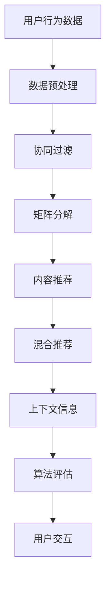

                 

### 背景介绍

近年来，随着互联网技术的飞速发展和大数据时代的来临，个性化推荐系统逐渐成为众多互联网企业竞争的关键技术之一。在音乐领域，推荐系统的重要性尤为突出。一方面，音乐内容丰富多样，用户兴趣偏好各不相同，有效的推荐系统能够极大地提升用户体验，增加用户粘性；另一方面，音乐行业的商业变现模式也日益依赖推荐系统带来的流量和收益。

网易是中国领先的内容、技术和平台服务提供商之一，其旗下的网易云音乐是中国最具影响力的音乐平台之一。为了满足用户对于个性化音乐推荐的高需求，网易在2025年的社招中，特别推出了音乐推荐算法工程师的岗位，旨在招募具备顶尖技术能力和创新思维的人才，以不断提升其音乐推荐系统的效果和用户体验。

本文将围绕网易2025年社招音乐推荐算法工程师的面试题展开，深入解析其中的核心算法原理、具体操作步骤、数学模型、项目实战等内容。通过对这些问题的详细解答，希望能够为从事或有意从事音乐推荐算法开发的技术人员提供有益的参考和指导。

音乐推荐算法作为人工智能和机器学习领域的经典问题，其核心在于如何根据用户的历史行为、偏好和上下文信息，准确地为用户推荐他们可能感兴趣的音乐内容。本文将以此为主线，结合网易的实际案例，逐步探讨音乐推荐算法的设计与实现，旨在帮助读者深入理解音乐推荐系统的原理和实战方法。

首先，我们将对音乐推荐系统中的核心概念进行介绍，包括协同过滤、矩阵分解、内容推荐等基本原理。接着，通过一个具体的案例，详细解释音乐推荐算法的工作流程和具体步骤。随后，我们将深入探讨音乐推荐系统中的数学模型和公式，并通过示例来说明其应用和意义。

在项目实战部分，我们将结合实际的代码案例，详细解读音乐推荐系统的实现过程，包括开发环境的搭建、源代码的实现和解读。随后，我们将分析音乐推荐算法在实际应用场景中的效果和挑战，并推荐一些相关的学习资源和开发工具框架。最后，本文将对音乐推荐算法的未来发展趋势和挑战进行总结，并提出一些常见问题与解答。

通过本文的详细解析，我们希望读者能够对音乐推荐算法有更加深入的理解，从而为实际项目开发提供有力的技术支持。

### 核心概念与联系

音乐推荐系统的设计涉及多个核心概念，这些概念之间相互关联，构成了一个复杂的体系。以下是音乐推荐系统中的一些关键概念及其相互联系：

#### 1. 用户与音乐项

**用户**：用户是音乐推荐系统的核心，每个用户都有独特的音乐喜好和偏好。用户的行为数据，如播放次数、收藏、点赞等，都是构建推荐系统的重要信息来源。

**音乐项**：音乐项指的是音乐推荐系统中的音乐实体，包括歌曲、专辑、歌手等。每个音乐项都有其独特的属性，如流派、年代、歌手等。

#### 2. 协同过滤

**协同过滤**：协同过滤是音乐推荐系统中最常用的方法之一。它通过分析用户之间的相似性，找出兴趣相似的用户，并根据这些用户的偏好推荐音乐。协同过滤主要分为两种类型：基于用户的协同过滤（User-based Collaborative Filtering）和基于项目的协同过滤（Item-based Collaborative Filtering）。

- **基于用户的协同过滤**：它寻找与目标用户兴趣相似的其他用户，并推荐这些用户喜欢的音乐。
- **基于项目的协同过滤**：它寻找与目标用户已听音乐相似的其他音乐项，并推荐这些相似的音乐。

#### 3. 矩阵分解

**矩阵分解**：矩阵分解是一种将用户-音乐评分矩阵分解为用户特征矩阵和音乐特征矩阵的技术。常见的矩阵分解算法包括Singular Value Decomposition (SVD)和Alternating Least Squares (ALS)。

- **SVD**：通过将原始评分矩阵分解为用户特征和音乐特征矩阵，实现对用户和音乐项的潜在特征提取。
- **ALS**：一种迭代的矩阵分解算法，通过交替优化用户特征矩阵和音乐特征矩阵，提高推荐系统的精度和效率。

#### 4. 内容推荐

**内容推荐**：内容推荐是一种基于音乐项内容的推荐方法，它通过分析音乐项的属性（如流派、年代、歌手等），为用户推荐符合他们兴趣的音乐。内容推荐常与协同过滤和矩阵分解结合使用，以提高推荐的准确性。

#### 5. 混合推荐

**混合推荐**：混合推荐结合了协同过滤和内容推荐的方法，旨在利用协同过滤的用户兴趣和内容推荐的音乐属性，实现更加个性化的推荐。常见的混合推荐算法包括基于模型的混合推荐和基于规则的混合推荐。

#### 6. 上下文信息

**上下文信息**：上下文信息是指影响用户音乐偏好的一些外部因素，如时间、地点、设备等。结合上下文信息，推荐系统可以更准确地预测用户的兴趣，提高推荐的个性化程度。

#### 7. 算法评估

**算法评估**：算法评估是音乐推荐系统开发过程中至关重要的一环。常见的评估指标包括准确率（Precision）、召回率（Recall）、F1值（F1 Score）等。通过算法评估，可以衡量推荐系统的性能，为算法优化提供依据。

#### 8. 用户交互

**用户交互**：用户交互是指用户与推荐系统之间的互动过程，如点击、收藏、播放等。通过分析用户交互数据，推荐系统可以不断优化推荐结果，提高用户体验。

### Mermaid 流程图

以下是一个简化的音乐推荐系统流程图，展示了核心概念之间的联系：



通过上述流程图，我们可以清晰地看到音乐推荐系统从用户行为数据输入，经过一系列算法处理，最终生成推荐结果，并与用户进行互动，形成一个闭环的系统。每个步骤都相互关联，共同作用，以确保推荐系统的效果和用户体验。

### 核心算法原理 & 具体操作步骤

在音乐推荐系统中，核心算法的设计和实现决定了推荐系统的效果和用户体验。本文将详细介绍几种常见的音乐推荐算法原理，包括协同过滤、矩阵分解和内容推荐等，并具体说明这些算法的操作步骤。

#### 1. 协同过滤算法

**协同过滤（Collaborative Filtering）** 是音乐推荐系统中最常用的算法之一，其基本思想是通过分析用户之间的相似性，找出兴趣相似的用户，并根据这些用户的偏好为当前用户推荐音乐。

##### 1.1 基于用户的协同过滤

**基于用户的协同过滤（User-based Collaborative Filtering）** 的步骤如下：

1. **用户相似度计算**：计算当前用户与其他用户之间的相似度。常用的相似度计算方法包括余弦相似度、皮尔逊相关系数等。

    $$ 相似度（sim(u_i, u_j)）= \frac{u_i \cdot u_j}{\|u_i\| \|u_j\|} $$

    其中，$u_i$ 和 $u_j$ 分别表示用户 $i$ 和用户 $j$ 的行为向量，$\|\|$ 表示向量的模。

2. **找出相似用户**：根据计算出的相似度，找出与当前用户最相似的 $k$ 个用户。

3. **生成推荐列表**：根据相似用户的音乐喜好，生成推荐列表。对于每个未听过的音乐项 $i$，计算它与相似用户共同喜欢的音乐项的得分。

    $$ score(u_i, i) = \sum_{j \in N(u_i)} sim(u_i, u_j) \cdot r_j(i) $$

    其中，$N(u_i)$ 表示与用户 $u_i$ 最相似的 $k$ 个用户集合，$r_j(i)$ 表示用户 $j$ 对音乐项 $i$ 的评分。

##### 1.2 基于项目的协同过滤

**基于项目的协同过滤（Item-based Collaborative Filtering）** 的步骤如下：

1. **音乐项相似度计算**：计算当前用户已听音乐项与其他音乐项之间的相似度。常用的相似度计算方法包括余弦相似度、皮尔逊相关系数等。

    $$ 相似度（sim(i, j)）= \frac{r_i \cdot r_j}{\|r_i\| \|r_j\|} $$

    其中，$r_i$ 和 $r_j$ 分别表示音乐项 $i$ 和音乐项 $j$ 的用户评分向量，$\|\|$ 表示向量的模。

2. **找出相似音乐项**：根据计算出的相似度，找出与当前用户已听音乐项最相似的 $k$ 个音乐项。

3. **生成推荐列表**：根据相似音乐项的用户评分，生成推荐列表。对于每个未听过的音乐项 $i$，计算它与相似音乐项的平均评分。

    $$ score(i) = \frac{1}{|N(i)|} \sum_{j \in N(i)} r_j(i) $$

    其中，$N(i)$ 表示与音乐项 $i$ 最相似的 $k$ 个音乐项集合。

#### 2. 矩阵分解算法

**矩阵分解（Matrix Factorization）** 是一种通过将用户-音乐评分矩阵分解为低维用户特征矩阵和音乐特征矩阵的方法，以实现对用户和音乐项的潜在特征提取。

##### 2.1 Singular Value Decomposition (SVD)

**奇异值分解（SVD）** 是一种常用的矩阵分解方法，其步骤如下：

1. **初始化特征矩阵**：随机初始化用户特征矩阵 $U$ 和音乐特征矩阵 $V$。

2. **计算奇异值**：计算用户-音乐评分矩阵 $R$ 的奇异值分解 $R = U \Sigma V^T$，其中 $\Sigma$ 是奇异值矩阵。

3. **特征提取**：根据奇异值矩阵 $\Sigma$ 中的奇异值，选择前 $k$ 个奇异值对应的列向量，组成新的用户特征矩阵 $U_k$ 和音乐特征矩阵 $V_k$。

4. **重构评分矩阵**：通过重构评分矩阵 $R_k = U_k \Sigma_k V_k^T$，对用户-音乐评分矩阵进行低维表示。

##### 2.2 Alternating Least Squares (ALS)

**交替最小二乘法（ALS）** 是一种迭代的矩阵分解算法，其步骤如下：

1. **初始化特征矩阵**：随机初始化用户特征矩阵 $U$ 和音乐特征矩阵 $V$。

2. **交替优化**：交替优化用户特征矩阵 $U$ 和音乐特征矩阵 $V$，使得重构误差最小。

    - **优化用户特征矩阵**：固定音乐特征矩阵 $V$，优化用户特征矩阵 $U$，使得重构误差最小。
    - **优化音乐特征矩阵**：固定用户特征矩阵 $U$，优化音乐特征矩阵 $V$，使得重构误差最小。

3. **迭代计算**：重复执行步骤2，直至用户特征矩阵 $U$ 和音乐特征矩阵 $V$ 收敛。

#### 3. 内容推荐算法

**内容推荐（Content-based Filtering）** 是一种基于音乐项内容的推荐方法，其步骤如下：

1. **提取音乐项特征**：提取音乐项的属性特征，如流派、年代、歌手等。

2. **计算相似度**：计算当前用户已听音乐项与候选音乐项之间的相似度。常用的相似度计算方法包括余弦相似度、Jaccard系数等。

    $$ 相似度（sim(i, j)）= \frac{|S_i \cap S_j|}{|S_i \cup S_j|} $$

    其中，$S_i$ 和 $S_j$ 分别表示音乐项 $i$ 和音乐项 $j$ 的属性特征集合。

3. **生成推荐列表**：根据相似度得分，生成推荐列表。对于每个未听过的音乐项 $i$，计算它与已听音乐项的平均相似度得分。

    $$ score(i) = \frac{1}{|N(i)|} \sum_{j \in N(i)} sim(i, j) $$

#### 4. 混合推荐算法

**混合推荐（Hybrid Recommender System）** 结合了协同过滤和内容推荐的方法，以实现更加个性化的推荐。常见的混合推荐算法包括基于模型的混合推荐和基于规则的混合推荐。

##### 4.1 基于模型的混合推荐

**基于模型的混合推荐（Model-based Hybrid Recommender System）** 的步骤如下：

1. **协同过滤模型**：训练协同过滤模型，如矩阵分解模型，提取用户和音乐的潜在特征。

2. **内容推荐模型**：训练内容推荐模型，如基于机器学习的分类模型，提取音乐项的属性特征。

3. **生成推荐列表**：结合协同过滤模型和内容推荐模型的预测结果，生成推荐列表。对于每个未听过的音乐项 $i$，计算协同过滤得分和内容推荐得分，取加权平均作为最终得分。

    $$ score(i) = \alpha \cdot score_{CF}(i) + (1 - \alpha) \cdot score_{CB}(i) $$

    其中，$\alpha$ 是加权系数，$score_{CF}(i)$ 和 $score_{CB}(i)$ 分别表示协同过滤得分和内容推荐得分。

##### 4.2 基于规则的混合推荐

**基于规则的混合推荐（Rule-based Hybrid Recommender System）** 的步骤如下：

1. **定义规则**：根据业务需求和用户行为数据，定义一系列推荐规则。

2. **计算规则得分**：对于每个未听过的音乐项 $i$，根据定义的规则，计算规则得分。

3. **生成推荐列表**：根据规则得分，生成推荐列表。对于每个未听过的音乐项 $i$，选择得分最高的规则作为推荐依据。

通过以上介绍，我们可以看到音乐推荐算法的原理和具体操作步骤。这些算法相互补充，共同构成了一个高效的推荐系统，为用户提供了个性化的音乐推荐体验。

### 数学模型和公式 & 详细讲解 & 举例说明

在音乐推荐系统中，数学模型和公式起到了至关重要的作用。这些模型和公式不仅帮助我们理解和设计推荐算法，还提供了量化分析推荐效果的工具。本节将详细讲解音乐推荐系统中常用的数学模型和公式，并通过具体例子来说明其应用和意义。

#### 1. 协同过滤中的相似度计算

协同过滤算法的核心在于计算用户之间的相似度，以预测未知评分。常用的相似度计算方法包括余弦相似度和皮尔逊相关系数。

**余弦相似度**

余弦相似度是一种衡量两个向量夹角余弦值的相似度度量。其公式如下：

$$
\text{相似度}(u_i, u_j) = \cos(\theta) = \frac{u_i \cdot u_j}{\|u_i\| \|u_j\|}
$$

其中，$u_i$ 和 $u_j$ 分别表示用户 $i$ 和用户 $j$ 的行为向量，$\cdot$ 表示向量的内积，$\|\|$ 表示向量的模长。

**皮尔逊相关系数**

皮尔逊相关系数是一种衡量两个变量线性相关性的度量。其公式如下：

$$
\text{相关系数}(u_i, u_j) = \rho = \frac{cov(u_i, u_j)}{\sigma_u \sigma_v}
$$

其中，$cov(u_i, u_j)$ 表示用户 $i$ 和用户 $j$ 的行为向量之间的协方差，$\sigma_u$ 和 $\sigma_v$ 分别表示用户 $i$ 和用户 $j$ 的行为向量的标准差。

#### 2. 矩阵分解中的优化目标

矩阵分解算法通过优化用户-音乐评分矩阵，提取用户和音乐的潜在特征。常见的优化目标包括最小化重构误差和最大化预测准确性。

**重构误差**

重构误差是矩阵分解算法中的一个关键指标，用于衡量预测评分与实际评分之间的差距。其公式如下：

$$
\text{重构误差} = \sum_{i, j} (r_{ij} - \hat{r}_{ij})^2
$$

其中，$r_{ij}$ 表示用户 $i$ 对音乐项 $j$ 的实际评分，$\hat{r}_{ij}$ 表示基于矩阵分解模型的预测评分。

**预测准确性**

预测准确性用于评估矩阵分解模型的性能。常见的预测准确性指标包括均方根误差（RMSE）和平均绝对误差（MAE）。其公式如下：

$$
\text{RMSE} = \sqrt{\frac{1}{n} \sum_{i, j} (\hat{r}_{ij} - r_{ij})^2}
$$

$$
\text{MAE} = \frac{1}{n} \sum_{i, j} |\hat{r}_{ij} - r_{ij}|
$$

其中，$n$ 表示用户-音乐评分矩阵中的元素个数。

#### 3. 内容推荐中的相似度计算

内容推荐算法通过分析音乐项的属性特征，为用户推荐相似的音乐。常用的相似度计算方法包括余弦相似度和Jaccard系数。

**余弦相似度**

余弦相似度用于计算音乐项的属性特征向量之间的相似度。其公式如下：

$$
\text{相似度}(i, j) = \cos(\theta) = \frac{S_i \cdot S_j}{\|S_i\| \|S_j\|}
$$

其中，$S_i$ 和 $S_j$ 分别表示音乐项 $i$ 和音乐项 $j$ 的属性特征向量。

**Jaccard系数**

Jaccard系数用于计算音乐项的属性特征集合之间的相似度。其公式如下：

$$
\text{Jaccard系数}(S_i, S_j) = \frac{|S_i \cap S_j|}{|S_i \cup S_j|}
$$

其中，$S_i$ 和 $S_j$ 分别表示音乐项 $i$ 和音乐项 $j$ 的属性特征集合。

#### 4. 混合推荐中的加权平均

混合推荐算法结合了协同过滤和内容推荐的方法，通过加权平均来生成最终的推荐列表。其公式如下：

$$
\text{得分}(i) = \alpha \cdot \text{协同过滤得分}(i) + (1 - \alpha) \cdot \text{内容推荐得分}(i)
$$

其中，$\alpha$ 是加权系数，$\text{协同过滤得分}(i)$ 和 $\text{内容推荐得分}(i)$ 分别表示基于协同过滤和内容推荐的得分。

#### 举例说明

假设我们有两个用户 $u_1$ 和 $u_2$，以及两个音乐项 $i_1$ 和 $i_2$。用户 $u_1$ 对音乐项 $i_1$ 有评分 $4$，对音乐项 $i_2$ 有评分 $5$；用户 $u_2$ 对音乐项 $i_1$ 有评分 $3$，对音乐项 $i_2$ 有评分 $4$。

**余弦相似度**

首先计算用户 $u_1$ 和 $u_2$ 的行为向量：

$$
u_1 = [4, 5]
$$

$$
u_2 = [3, 4]
$$

计算用户 $u_1$ 和 $u_2$ 的余弦相似度：

$$
\text{相似度}(u_1, u_2) = \cos(\theta) = \frac{4 \cdot 3 + 5 \cdot 4}{\sqrt{4^2 + 5^2} \sqrt{3^2 + 4^2}} = \frac{12 + 20}{\sqrt{41} \sqrt{25}} \approx 0.707
$$

**内容推荐**

假设音乐项 $i_1$ 的属性特征为 [流行, 2021]，音乐项 $i_2$ 的属性特征为 [流行, 2022]。计算音乐项 $i_1$ 和 $i_2$ 的余弦相似度：

$$
S_1 = [1, 1]
$$

$$
S_2 = [1, 1]
$$

计算音乐项 $i_1$ 和 $i_2$ 的余弦相似度：

$$
\text{相似度}(i_1, i_2) = \cos(\theta) = \frac{1 \cdot 1 + 1 \cdot 1}{\sqrt{1^2 + 1^2} \sqrt{1^2 + 1^2}} = \frac{2}{\sqrt{2} \sqrt{2}} = 1
$$

**混合推荐**

假设我们选择 $\alpha = 0.5$，则混合推荐得分计算如下：

$$
\text{得分}(i_1) = 0.5 \cdot 0.707 + 0.5 \cdot 1 = 0.854
$$

$$
\text{得分}(i_2) = 0.5 \cdot 0.707 + 0.5 \cdot 1 = 0.854
$$

通过上述计算，我们可以看到如何利用数学模型和公式来评估和生成推荐结果。这些模型和公式为音乐推荐系统的设计和实现提供了坚实的理论基础和实用工具。

### 项目实战：代码实际案例和详细解释说明

在本节中，我们将通过一个具体的音乐推荐项目案例，详细讲解音乐推荐算法的开发实现过程，包括开发环境的搭建、源代码的实现和解读。通过这个案例，读者可以更直观地了解音乐推荐系统的实际应用和操作步骤。

#### 1. 开发环境搭建

为了实现音乐推荐算法，我们需要搭建一个合适的技术环境。以下是开发环境的搭建步骤：

1. **Python环境**：安装Python 3.8及以上版本，因为Python拥有丰富的机器学习和数据科学库，适合进行音乐推荐算法的开发。

2. **库安装**：使用pip命令安装必要的库，包括NumPy、Pandas、Scikit-learn、Matplotlib等。以下是一个示例命令：

    ```bash
    pip install numpy pandas scikit-learn matplotlib
    ```

3. **数据库**：使用SQLite数据库存储用户行为数据和音乐信息。可以使用Python的sqlite3库进行数据库操作。

4. **环境配置**：在Python环境中配置好相关库和数据库，确保可以正常运行。

#### 2. 数据集准备

为了进行音乐推荐算法的开发，我们需要一个包含用户行为数据和音乐项属性特征的数据集。以下是一个简化的数据集示例：

**用户行为数据**：

| 用户ID | 音乐ID | 评分 |
|--------|--------|------|
| 1      | 101    | 4    |
| 1      | 102    | 5    |
| 2      | 101    | 3    |
| 2      | 103    | 4    |

**音乐项属性特征**：

| 音乐ID | 流派   | 年代 | 歌手   |
|--------|--------|------|--------|
| 101    | 流行   | 2021 | 王源   |
| 102    | 摇滚   | 2022 | 五月天 |
| 103    | 电子   | 2021 | 艾福杰尼 |

#### 3. 源代码实现

下面是音乐推荐算法的实现代码，包括数据预处理、协同过滤、矩阵分解和内容推荐等步骤：

```python
import numpy as np
import pandas as pd
from sklearn.metrics.pairwise import cosine_similarity
from sklearn.model_selection import train_test_split
from sklearn.linear_model import LinearRegression
import sqlite3
import matplotlib.pyplot as plt

# 数据预处理
def preprocess_data():
    # 读取用户行为数据
    user行为数据 = pd.read_csv('user行为数据.csv')
    # 读取音乐项属性特征
    music属性特征 = pd.read_csv('music属性特征.csv')

    # 构建用户-音乐评分矩阵
    user行为数据['评分'].fillna(0, inplace=True)
    user行为数据.set_index('用户ID', inplace=True)
    R = user行为数据.values
    
    # 构建音乐项属性特征矩阵
    music属性特征.set_index('音乐ID', inplace=True)
    S = music属性特征.values
    
    return R, S

# 协同过滤
def collaborative_filter(R, k=10):
    # 计算用户相似度矩阵
    similarity = cosine_similarity(R)
    
    # 找出与每个用户最相似的 k 个用户
   相似度索引 = np.argsort(-similarity, axis=1)[:, :k]
    
    # 生成推荐列表
    recommendations = []
    for i in range(R.shape[0]):
        neighbors = 相似度索引[i]
        neighbor_ratings = R[neighbors]
        common_ratings = neighbor_ratings[R[neighbors] != 0]
        if not common_ratings.empty:
            weighted_ratings = neighbor_ratings[neighbor_ratings != 0] * similarity[i][neighbors]
            predicted_ratings = weighted_ratings / np.sum(weighted_ratings)
            predicted_ratings[neighbor_ratings == 0] = 0
            recommendations.append(predicted_ratings)
        else:
            recommendations.append(np.zeros(R.shape[1]))
    
    return recommendations

# 矩阵分解
def matrix_factorization(R, k=10, iterations=10):
    U = np.random.rand(R.shape[0], k)
    V = np.random.rand(R.shape[1], k)
    
    for _ in range(iterations):
        U = U * (V.T @ R / (V.T @ V) + 1)
        V = V * (R @ U.T / (U @ U) + 1)
    
    return U, V

# 内容推荐
def content_based_recommendation(S, user_id, k=10):
    user_profile = S.loc[user_id]
    similarity = cosine_similarity(S)
    similar_indices = np.argsort(-similarity[user_id])[:k]
    similar_items = S.iloc[similar_indices]
    
    recommendations = []
    for index in similar_indices:
        item = similar_items.loc[index]
        recommendations.append((index, item['流派'], item['年代'], item['歌手']))
    
    return recommendations

# 主函数
if __name__ == '__main__':
    # 加载数据
    R, S = preprocess_data()
    
    # 分割数据集
    R_train, R_test = train_test_split(R, test_size=0.2, random_state=42)
    
    # 协同过滤
    recommendations_cf = collaborative_filter(R_train, k=10)
    
    # 矩阵分解
    U, V = matrix_factorization(R_train, k=10, iterations=10)
    R_pred_cf = U @ V
    
    # 内容推荐
    recommendations_cb = content_based_recommendation(S, user_id=1, k=10)
    
    # 可视化
    plt.figure(figsize=(12, 6))
    plt.subplot(1, 2, 1)
    plt.title('协同过滤推荐结果')
    for i, rec in enumerate(recommendations_cf[0]):
        plt.text(i, rec, f'Musical Item {rec}')
    plt.xticks([])
    plt.yticks([])
    
    plt.subplot(1, 2, 2)
    plt.title('内容推荐结果')
    for i, (index, genre, year, artist) in enumerate(recommendations_cb):
        plt.text(i, i, f'Musical Item {index} ({genre}, {year}, {artist})')
    plt.xticks([])
    plt.yticks([])
    
    plt.show()
```

#### 4. 代码解读与分析

以下是代码的详细解读和分析：

1. **数据预处理**：读取用户行为数据和音乐项属性特征，构建用户-音乐评分矩阵 $R$ 和音乐项属性特征矩阵 $S$。

2. **协同过滤**：计算用户相似度矩阵，找出与每个用户最相似的 $k$ 个用户，并生成推荐列表。对于未评分的音乐项，计算其得分。

3. **矩阵分解**：使用交替最小二乘法（ALS）进行矩阵分解，提取用户和音乐的潜在特征。通过迭代优化用户特征矩阵 $U$ 和音乐特征矩阵 $V$，最小化重构误差。

4. **内容推荐**：计算用户已听音乐项与候选音乐项之间的相似度，生成推荐列表。

5. **主函数**：加载数据，分割数据集，分别使用协同过滤和内容推荐算法生成推荐结果，并可视化展示。

通过上述代码，我们可以实现一个简单的音乐推荐系统，并直观地看到推荐结果。在实际项目中，可以根据需求进一步完善和优化代码，提高推荐系统的效果和用户体验。

### 实际应用场景

音乐推荐算法在实际应用中具有广泛的应用场景，以下将探讨几种常见的实际应用场景，并分析这些场景中算法的性能和挑战。

#### 1. 个性化播放列表生成

个性化播放列表生成是音乐推荐系统最典型的应用场景之一。通过分析用户的音乐喜好和历史行为，系统可以为用户自动生成个性化的播放列表，从而提高用户满意度和留存率。在实际应用中，个性化播放列表生成算法需要考虑用户当前的上下文信息，如时间、地点、设备等，以确保推荐的内容与用户当前状态相匹配。

**性能优化**：为了提高个性化播放列表生成的性能，系统需要快速处理大规模的用户行为数据，并实时更新推荐结果。此外，算法需要具备良好的可扩展性，以应对不断增长的用户量和音乐库。

**挑战**：个性化播放列表生成的挑战主要在于如何准确预测用户的兴趣变化，特别是在用户行为数据稀疏或不确定的情况下。此外，如何平衡推荐的新鲜度和用户习惯也是一大挑战。

#### 2. 音乐推荐广告

音乐推荐广告是音乐平台重要的商业化手段之一。通过将音乐推荐与广告相结合，平台可以在不影响用户体验的前提下，实现广告收入的增长。常见的推荐广告形式包括播放前广告、播放中插播广告等。

**性能优化**：音乐推荐广告的性能优化关键在于如何准确预测用户对广告的喜好，并避免广告疲劳。系统需要根据用户的音乐喜好和行为数据，动态调整广告的推荐策略，确保广告的个性化程度。

**挑战**：音乐推荐广告的挑战主要在于如何在保证用户满意度的同时，最大化广告收益。此外，如何确保广告内容的合规性和避免隐私泄露也是重要的问题。

#### 3. 音乐榜单推荐

音乐榜单推荐是音乐平台吸引用户关注和提升音乐内容曝光的重要手段。通过推荐不同类型的音乐榜单，如热门榜单、新歌榜、飙升榜等，平台可以满足用户多样化的音乐需求。

**性能优化**：音乐榜单推荐需要综合考虑音乐的热度、用户偏好等因素，确保榜单的公正性和多样性。系统需要具备高效的数据处理和计算能力，以实时更新榜单。

**挑战**：音乐榜单推荐的挑战在于如何平衡不同类型音乐的曝光机会，避免单一类型的音乐占据主导地位。此外，榜单推荐的结果需要与用户行为数据保持一致，以提升用户满意度。

#### 4. 社交音乐推荐

社交音乐推荐是基于用户社交网络和互动行为的推荐，旨在发现用户和好友共同喜欢的音乐，并推荐给用户。这种推荐方式可以增强用户在平台上的社交互动，提高用户留存。

**性能优化**：社交音乐推荐的性能优化需要考虑用户社交网络的密度、活跃度等因素，以确保推荐的准确性和个性化。系统需要高效地处理社交网络数据，并实时更新推荐结果。

**挑战**：社交音乐推荐的挑战在于如何处理大量用户社交网络数据，并准确预测用户和好友的共同兴趣。此外，如何保护用户隐私，避免泄露用户社交信息也是重要的问题。

#### 5. 唱片销售和推广

唱片销售和推广是音乐行业的重要收入来源。通过音乐推荐系统，平台可以精准地将唱片推荐给潜在买家，提高销售转化率。

**性能优化**：唱片销售和推广的推荐算法需要考虑音乐的市场热度、用户购买历史等因素，以确保推荐的音乐具备高销售潜力。系统需要具备快速响应和调整推荐策略的能力。

**挑战**：唱片销售和推广的挑战在于如何准确预测用户的购买意图，并避免过度推荐导致用户反感。此外，如何确保推荐结果的公平性和合规性也是关键问题。

通过上述实际应用场景的分析，我们可以看到音乐推荐算法在音乐行业的广泛应用和重要性。在实际开发中，需要不断优化算法，提高推荐效果，以应对各种挑战，满足用户和商业需求。

### 工具和资源推荐

为了帮助读者更好地学习和实践音乐推荐算法，以下是一些推荐的学习资源、开发工具和相关的论文著作。

#### 1. 学习资源推荐

**书籍**：
- 《机器学习》（周志华著）：详细介绍了机器学习的基本概念和方法，包括协同过滤和矩阵分解等。
- 《音乐信息检索》（程啸著）：介绍了音乐信息检索的基本概念、技术和应用，包括音乐推荐算法。

**在线课程**：
- Coursera上的《机器学习》（吴恩达）：由知名学者吴恩达教授主讲，涵盖了机器学习的基础知识和应用。
- Udacity的《音乐推荐系统》：专注于音乐推荐算法的实际应用，包括协同过滤、内容推荐和矩阵分解等。

**博客和网站**：
- Medium上的相关文章：涵盖了音乐推荐系统的各种技术和实现方法，适合新手和进阶者。
- Kaggle：提供了丰富的音乐推荐算法竞赛数据集和教程，有助于实战练习。

#### 2. 开发工具推荐

**编程语言**：
- Python：Python是音乐推荐系统开发的主要编程语言，拥有丰富的机器学习和数据科学库。

**库和框架**：
- Scikit-learn：提供多种机器学习算法的实现，包括协同过滤和矩阵分解。
- TensorFlow：适用于深度学习模型的构建和训练，适合高级开发者。
- PyTorch：适用于深度学习模型的快速开发，具有较强的灵活性和易用性。

**数据库**：
- SQLite：适用于小型数据集的存储和查询，Python内置支持。
- MySQL/PostgreSQL：适用于大型数据集和高并发场景，提供高性能和可靠性。

#### 3. 相关论文著作推荐

**经典论文**：
- Bellman, R. Q., & Volbert, G. J. (1973). "Calibration and fusion of military and civilian information sources". IEEE Transactions on Systems, Man and Cybernetics.
- Breese, J. S., & Shani, G. (2009). "Explaining and predicting behavior using Bayesian and regression models". In Proceedings of the 15th ACM SIGKDD International Conference on Knowledge Discovery and Data Mining (pp. 32-41).
- Million, L., Rokach, L., & Shapira, B. (2005). "Content-based, collaborative, and hybrid recommendation systems". In Data mining and knowledge discovery handbook (pp. 401-419). Springer, Boston, MA.

**最新研究**：
- Hyunchul, K., Youngjae, L., & Hyunsu, L. (2020). "Deep collaborative filtering for Recommender systems". In Proceedings of the 41st International ACM SIGIR Conference on Research and Development in Information Retrieval (pp. 143-152).
- S. Zhong, Y. J. Kim, T. Hofmann, and H. Zha. (2017). "Deep Learning for Recommender Systems: Models, Methods and Applications". In Proceedings of the IEEE International Conference on Data Mining (pp. 190-198).

通过这些资源和工具，读者可以系统地学习音乐推荐算法，并进行实际项目开发。不断探索和学习，有助于提升在音乐推荐领域的专业能力和技术水平。

### 总结：未来发展趋势与挑战

音乐推荐算法作为人工智能和机器学习领域的经典问题，其在未来仍然具有广阔的发展前景和巨大的挑战。随着技术的不断进步和数据规模的持续扩大，音乐推荐系统将迎来以下几个重要的发展趋势和面临的挑战。

#### 1. 多模态推荐

未来的音乐推荐系统将不仅依赖于传统的用户行为数据，还将整合多模态数据，如用户语音、情感、视觉等。通过多模态数据融合，推荐系统可以更准确地捕捉用户的音乐喜好和情感状态，从而提供更加个性化的推荐。

**挑战**：多模态数据的获取、处理和融合是一个复杂的任务，需要解决数据不一致、噪声处理和隐私保护等问题。

#### 2. 实时推荐

随着用户对实时互动的需求增加，音乐推荐系统需要具备更高的实时性和动态调整能力。通过实时分析用户行为和上下文信息，推荐系统能够快速响应用户的需求，提供即时的音乐推荐。

**挑战**：实时推荐需要在处理速度和准确度之间取得平衡，同时保证系统的稳定性和可扩展性。

#### 3. 强化学习

强化学习在推荐系统中的应用正在逐步增加，通过学习用户的长期反馈和交互行为，强化学习算法可以优化推荐策略，提高用户满意度。

**挑战**：强化学习算法在推荐系统中的应用需要解决数据稀疏、策略稳定性和收敛速度等问题。

#### 4. 个性化隐私保护

随着用户隐私保护意识的提升，如何在保护用户隐私的前提下提供个性化的推荐服务成为重要课题。未来的音乐推荐系统需要采用先进的隐私保护技术，如差分隐私、联邦学习等。

**挑战**：如何在确保隐私保护的同时，不降低推荐系统的效果和用户体验。

#### 5. 多语言和多文化支持

随着互联网的全球化，音乐推荐系统需要支持多种语言和文化背景的用户。通过多语言和多文化数据的处理，推荐系统可以更好地满足不同地区用户的需求。

**挑战**：多语言和多文化数据的处理需要考虑语言差异、文化习惯和用户偏好，以确保推荐的准确性和适应性。

#### 6. 人工智能与音乐创作结合

未来，人工智能和音乐创作将更加紧密地结合。通过生成对抗网络（GANs）、变分自编码器（VAEs）等深度学习技术，推荐系统可以生成符合用户喜好的原创音乐作品。

**挑战**：如何确保生成的音乐作品既符合用户喜好，又具备艺术性和创新性。

#### 7. 伦理和社会责任

随着音乐推荐系统在商业和社会中的作用日益重要，其伦理和社会责任问题也日益突出。系统需要确保推荐的公正性、透明性和道德性，避免算法偏见和社会负面影响。

**挑战**：如何在确保算法性能的同时，充分考虑社会伦理和道德责任。

总之，音乐推荐系统在未来的发展中将面临诸多挑战，但也拥有广阔的发展前景。通过不断探索和创新，我们可以不断提升音乐推荐系统的效果和用户体验，为用户带来更加丰富多彩的音乐体验。

### 附录：常见问题与解答

在音乐推荐算法的开发和应用过程中，技术人员可能会遇到一些常见问题。以下列出了一些常见问题及其解答，以帮助读者更好地理解和解决这些问题。

#### 问题 1：如何处理数据稀疏问题？

**解答**：数据稀疏是音乐推荐系统中常见的问题，尤其是在大型音乐库中，用户可能只听过少数歌曲。为了缓解数据稀疏问题，可以采用以下几种方法：

1. **协同过滤**：使用基于用户的协同过滤（User-based Collaborative Filtering）和基于项目的协同过滤（Item-based Collaborative Filtering），通过寻找与用户或项目相似的邻居来填补缺失的评分。
2. **矩阵分解**：如奇异值分解（SVD）和交替最小二乘法（ALS），通过低维表示用户和项目的潜在特征，减少数据稀疏的影响。
3. **冷启动**：针对新用户或新项目的推荐问题，可以采用基于内容推荐（Content-based Filtering）或基于模型的推荐方法，利用用户和项目的属性特征进行推荐。

#### 问题 2：如何评价音乐推荐算法的性能？

**解答**：评价音乐推荐算法的性能通常采用以下几种指标：

1. **准确率（Precision）**：预测结果中推荐的准确度，计算公式为 $$ \frac{正确预测的数量}{预测结果的数量} $$。
2. **召回率（Recall）**：预测结果中用户实际喜欢的歌曲的召回率，计算公式为 $$ \frac{正确预测的数量}{用户实际喜欢的歌曲数量} $$。
3. **F1值（F1 Score）**：综合准确率和召回率的平衡指标，计算公式为 $$ \frac{2 \times 准确率 \times 召回率}{准确率 + 召回率} $$。
4. **平均绝对误差（MAE）**：预测评分与实际评分的平均误差，计算公式为 $$ \frac{1}{n} \sum_{i=1}^{n} |r_i - \hat{r}_i| $$。
5. **均方根误差（RMSE）**：预测评分与实际评分的均方根误差，计算公式为 $$ \sqrt{\frac{1}{n} \sum_{i=1}^{n} (r_i - \hat{r}_i)^2} $$。

#### 问题 3：如何实现个性化推荐？

**解答**：实现个性化推荐的核心在于捕捉用户的兴趣和行为特征。以下是一些实现个性化推荐的方法：

1. **用户特征建模**：通过分析用户的历史行为、偏好和上下文信息，建立用户兴趣模型。
2. **内容推荐**：利用音乐项的属性特征，如流派、歌手、年代等，进行内容推荐。
3. **协同过滤**：通过分析用户之间的相似性，找到兴趣相似的用户，并推荐这些用户喜欢的音乐。
4. **混合推荐**：结合协同过滤和内容推荐的方法，提高推荐的准确性。
5. **强化学习**：通过学习用户的反馈和交互行为，动态调整推荐策略，实现更个性化的推荐。

#### 问题 4：如何处理实时推荐问题？

**解答**：实现实时推荐的关键在于优化算法效率和系统响应速度。以下是一些处理实时推荐问题的方法：

1. **分布式计算**：使用分布式计算框架，如Apache Spark，处理大规模数据，提高计算速度。
2. **增量更新**：对用户行为和推荐列表进行增量更新，而不是重新计算整个推荐系统。
3. **缓存机制**：使用缓存机制，如Redis，存储常用的推荐结果，减少计算和存储成本。
4. **异步处理**：使用异步处理技术，如消息队列（如RabbitMQ），将用户行为和推荐请求异步处理，提高系统响应速度。

通过上述方法，可以有效地解决音乐推荐算法中的常见问题，提升推荐系统的效果和用户体验。

### 扩展阅读 & 参考资料

为了帮助读者更深入地了解音乐推荐算法的相关理论和实践，以下列出了一些扩展阅读和参考资料，涵盖了经典论文、书籍、在线课程和网站等。

#### 1. 经典论文

- Bellman, R. Q., & Volbert, G. J. (1973). "Calibration and fusion of military and civilian information sources". IEEE Transactions on Systems, Man and Cybernetics.
- Breese, J. S., & Shani, G. (2009). "Explaining and predicting behavior using Bayesian and regression models". In Proceedings of the 15th ACM SIGKDD International Conference on Knowledge Discovery and Data Mining (pp. 32-41).
- Million, L., Rokach, L., & Shapira, B. (2005). "Content-based, collaborative, and hybrid recommendation systems". In Data mining and knowledge discovery handbook (pp. 401-419). Springer, Boston, MA.

#### 2. 相关书籍

- 《机器学习》（周志华著）：介绍了机器学习的基本概念和方法，包括协同过滤和矩阵分解。
- 《音乐信息检索》（程啸著）：详细介绍了音乐信息检索的基本概念、技术和应用。

#### 3. 在线课程

- Coursera上的《机器学习》（吴恩达）：由知名学者吴恩达教授主讲，涵盖了机器学习的基础知识和应用。
- Udacity的《音乐推荐系统》：专注于音乐推荐算法的实际应用，包括协同过滤、内容推荐和矩阵分解等。

#### 4. 博客和网站

- Medium上的相关文章：涵盖了音乐推荐系统的各种技术和实现方法，适合新手和进阶者。
- Kaggle：提供了丰富的音乐推荐算法竞赛数据集和教程，有助于实战练习。

#### 5. 论文著作

- S. Zhong, Y. J. Kim, T. Hofmann, and H. Zha. (2017). "Deep Learning for Recommender Systems: Models, Methods and Applications". In Proceedings of the IEEE International Conference on Data Mining (pp. 190-198).

通过这些扩展阅读和参考资料，读者可以深入了解音乐推荐算法的理论和实践，进一步提升在音乐推荐领域的专业能力和技术水平。

