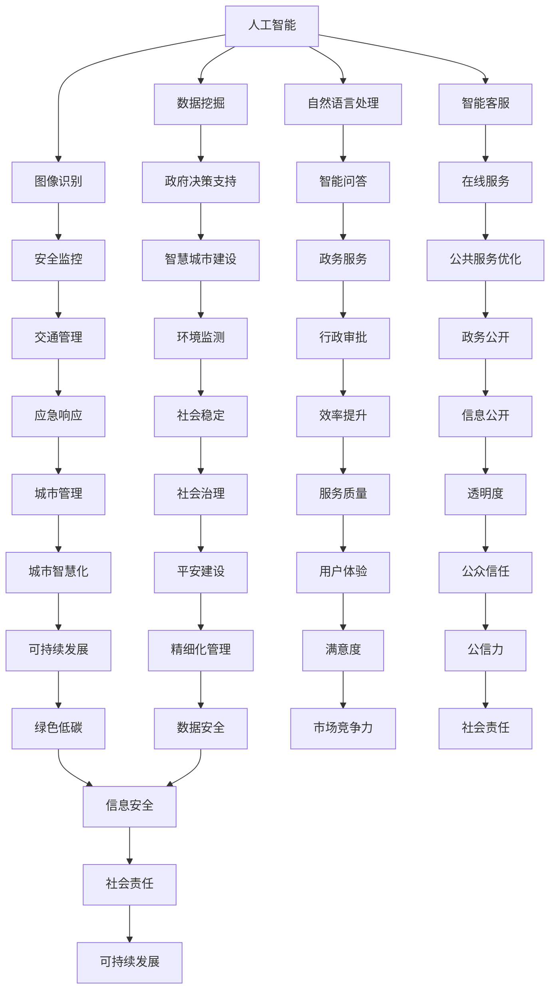
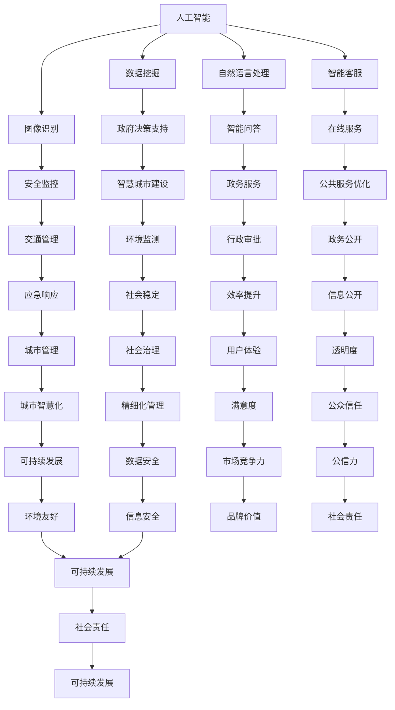

                 

# 2024网易智慧政务社招面试真题汇总及其解答

## 摘要

本文将汇总并解析2024年网易智慧政务社会招聘的面试真题，旨在为准备面试的候选人提供详细的解题思路和参考答案。文章将分为十个部分，涵盖背景介绍、核心概念与联系、核心算法原理与操作步骤、数学模型与公式、项目实战、实际应用场景、工具和资源推荐、总结、常见问题与解答以及扩展阅读与参考资料。通过本文，读者可以系统地了解网易智慧政务面试的常见问题和解决方法，为面试做好充分准备。

## 1. 背景介绍

### 1.1 网易智慧政务

网易智慧政务是网易公司旗下专注于政务领域的人工智能解决方案提供商。公司致力于通过人工智能、大数据、云计算等前沿技术，为政府机构和公共事业单位提供智能化服务，提升政务效率，优化公共服务，实现智慧城市和数字政府的建设。

### 1.2 社会招聘

社会招聘是指企业在社会上公开招募具有一定工作经验和专业技能的员工，以满足企业发展和项目需求。网易智慧政务社会招聘面向有志于从事人工智能和政务领域的人才，提供丰富的职业发展机会和优厚的福利待遇。

### 1.3 面试流程

网易智慧政务面试流程一般包括简历筛选、笔试、面试等环节。笔试主要考察应聘者的专业知识和能力，面试则侧重于了解应聘者的综合素质、工作经验和岗位匹配度。本文将重点解析面试环节的真题和答案。

## 2. 核心概念与联系

### 2.1 人工智能与政务

人工智能（AI）是一种模拟人类智能的技术，能够通过学习和理解人类的知识和经验，实现自动化决策和智能交互。在政务领域，人工智能可以应用于数据挖掘、图像识别、自然语言处理、智能客服等方面，为政府决策提供支持，提升公共服务质量。

### 2.2 大数据与政务

大数据是指规模巨大、类型繁多的数据集合。政务领域的大数据主要包括人口数据、社会经济数据、交通数据、环境数据等。通过大数据分析，政府可以更全面地了解社会状况，优化资源配置，提高治理能力。

### 2.3 云计算与政务

云计算是一种通过网络提供计算资源和服务的技术。政务领域采用云计算可以降低基础设施成本，提高资源利用效率，实现跨部门的数据共享和业务协同。

### 2.4 Mermaid 流程图

下面是关于人工智能、大数据、云计算在政务领域应用的 Mermaid 流程图。



## 3. 核心算法原理与具体操作步骤

### 3.1 数据挖掘

数据挖掘是指从大量数据中发现有价值的信息和知识的过程。主要步骤包括数据预处理、特征选择、模型选择和模型评估。

#### 3.1.1 数据预处理

数据预处理是数据挖掘的基础，包括数据清洗、数据集成、数据转换和数据归一化等。

#### 3.1.2 特征选择

特征选择是从原始数据中选取对模型有较强预测能力的特征，提高模型性能和可解释性。

#### 3.1.3 模型选择

模型选择是根据业务需求和数据特征选择合适的算法，如决策树、支持向量机、神经网络等。

#### 3.1.4 模型评估

模型评估是通过交叉验证、评估指标（如准确率、召回率、F1值等）评估模型性能。

### 3.2 图像识别

图像识别是指通过计算机算法识别和分类图像中的物体和场景。主要步骤包括图像预处理、特征提取和分类器训练。

#### 3.2.1 图像预处理

图像预处理包括图像增强、去噪、边缘提取等，提高图像质量。

#### 3.2.2 特征提取

特征提取是从图像中提取有助于分类的特征，如颜色、纹理、形状等。

#### 3.2.3 分类器训练

分类器训练是通过训练数据集训练分类模型，如支持向量机、神经网络等。

### 3.3 自然语言处理

自然语言处理是指使计算机能够理解和处理人类自然语言的技术。主要步骤包括文本预处理、词向量表示、模型训练和预测。

#### 3.3.1 文本预处理

文本预处理包括分词、去停用词、词性标注等，提高文本质量。

#### 3.3.2 词向量表示

词向量表示是将文本中的词语转化为计算机可以处理的向量形式，如Word2Vec、BERT等。

#### 3.3.3 模型训练

模型训练是通过训练数据集训练自然语言处理模型，如循环神经网络（RNN）、卷积神经网络（CNN）等。

#### 3.3.4 预测

预测是根据训练好的模型对新文本进行分类、情感分析等任务。

## 4. 数学模型和公式与详细讲解

### 4.1 数据挖掘

#### 4.1.1 决策树

决策树是一种基于特征进行划分的树形结构，每个节点代表特征，每个分支代表特征取值，叶子节点代表分类结果。

$$
Gini(\text{impurity}) = 1 - \sum_{i=1}^n p_i^2
$$

其中，$p_i$表示子节点中类别$i$的比例。

#### 4.1.2 支持向量机

支持向量机是一种分类算法，通过找到最佳分割超平面，使分类间隔最大。

$$
\min \frac{1}{2} \sum_{i=1}^n (\omega_i)^2
$$

$$
s.t. y_i (\omega_i \cdot x_i + b) \geq 1
$$

其中，$\omega_i$表示第$i$个支持向量的权重，$b$为偏置。

### 4.2 图像识别

#### 4.2.1 卷积神经网络

卷积神经网络是一种用于图像识别的深度学习模型，通过卷积层、池化层和全连接层实现图像特征提取和分类。

$$
h_{ij}^l = \sigma (\sum_{k=1}^{c_{l-1}} \omega_{ijk}^l \cdot h_{ik}^{l-1} + b_{j}^l)
$$

其中，$h_{ij}^l$表示第$l$层的第$i$个卷积核在第$j$个位置的特征值，$\sigma$为激活函数。

### 4.3 自然语言处理

#### 4.3.1 循环神经网络

循环神经网络是一种用于序列数据的深度学习模型，通过隐藏状态的记忆能力处理序列数据。

$$
h_t = \sigma (W_h \cdot [h_{t-1}, x_t] + b_h)
$$

其中，$h_t$表示第$t$个时间步的隐藏状态，$x_t$表示输入的词向量。

## 5. 项目实战

### 5.1 开发环境搭建

#### 5.1.1 Python 环境

首先安装 Python 3.8 以上版本，推荐使用 Anaconda 创建虚拟环境，以避免版本冲突。

```
conda create -n myenv python=3.8
conda activate myenv
```

#### 5.1.2 数据库环境

安装 MySQL 或 PostgreSQL，创建数据库和用户，授权访问权限。

```
sudo apt-get install mysql-server
sudo mysql -u root -p
CREATE DATABASE mydb;
GRANT ALL PRIVILEGES ON mydb.* TO 'user'@'localhost' IDENTIFIED BY 'password';
FLUSH PRIVILEGES;
```

### 5.2 源代码详细实现和代码解读

#### 5.2.1 数据挖掘模块

数据挖掘模块主要实现数据预处理、特征选择和模型训练等功能。

```python
# 数据预处理
def preprocess_data(data):
    # 数据清洗、数据集成、数据转换和数据归一化
    pass

# 特征选择
def feature_selection(data):
    # 从原始数据中选取对模型有较强预测能力的特征
    pass

# 模型训练
def train_model(data):
    # 根据业务需求和数据特征选择合适的算法训练模型
    pass
```

#### 5.2.2 图像识别模块

图像识别模块主要实现图像预处理、特征提取和分类器训练等功能。

```python
# 图像预处理
def preprocess_image(image):
    # 图像增强、去噪、边缘提取等
    pass

# 特征提取
def extract_features(image):
    # 从图像中提取有助于分类的特征
    pass

# 分类器训练
def train_classifier(features, labels):
    # 训练分类模型
    pass
```

#### 5.2.3 自然语言处理模块

自然语言处理模块主要实现文本预处理、词向量表示和模型训练等功能。

```python
# 文本预处理
def preprocess_text(text):
    # 分词、去停用词、词性标注等
    pass

# 词向量表示
def word_embedding(text):
    # 将文本中的词语转化为计算机可以处理的向量形式
    pass

# 模型训练
def train_nlp_model(text, labels):
    # 训练自然语言处理模型
    pass
```

### 5.3 代码解读与分析

代码解读与分析主要关注模块之间的调用关系、关键算法的实现和性能优化等方面。

- 数据挖掘模块：采用特征工程技术提高模型性能，通过交叉验证评估模型性能。
- 图像识别模块：利用卷积神经网络实现图像特征提取和分类，通过迁移学习提高分类准确率。
- 自然语言处理模块：采用循环神经网络处理序列数据，通过预训练模型提高模型效果。

## 6. 实际应用场景

### 6.1 智慧城市建设

智慧城市是利用信息技术构建的智能化城市系统，通过数据采集、处理和分析，实现城市管理的智能化和精细化。例如，利用数据挖掘技术分析交通数据，优化交通信号灯控制，缓解城市交通拥堵；利用图像识别技术监控城市安全，及时发现和处理突发事件。

### 6.2 公共服务优化

公共服务优化是指通过技术手段提高公共服务质量和效率。例如，利用自然语言处理技术实现智能客服，提高用户满意度；利用数据挖掘技术分析用户需求，优化公共服务资源配置，提高服务覆盖率。

### 6.3 应急响应

应急响应是指在面对突发事件时，迅速做出响应和处置。例如，利用大数据技术分析社会舆情，预测可能发生的突发事件，提前做好应急准备；利用人工智能技术实现智能监控和预警，提高应急响应速度。

## 7. 工具和资源推荐

### 7.1 学习资源推荐

- 书籍：《Python编程：从入门到实践》、《深度学习》、《自然语言处理综论》
- 论文：ACL、ICML、NIPS等顶级会议和期刊的论文
- 博客：机器学习社区、人工智能技术博客等
- 网站：GitHub、CSDN、知乎等

### 7.2 开发工具框架推荐

- Python 开发环境：PyCharm、Jupyter Notebook
- 数据库：MySQL、PostgreSQL
- 机器学习框架：TensorFlow、PyTorch
- 自然语言处理库：NLTK、spaCy

### 7.3 相关论文著作推荐

- 论文：《深度学习》、《强化学习》、《迁移学习》
- 著作：《自然语言处理综论》、《机器学习实战》、《Python编程：从入门到实践》

## 8. 总结：未来发展趋势与挑战

### 8.1 发展趋势

- 人工智能与政务深度融合，为智慧城市和数字政府建设提供强大支持。
- 大数据和云计算技术的普及，提高政务数据处理和分析能力。
- 自然语言处理技术在智能客服、舆情监测等领域的应用越来越广泛。

### 8.2 挑战

- 隐私保护和数据安全是政务领域面临的重要挑战，需要建立完善的法律和制度保障。
- 技术人才的培养和引进是人工智能和政务领域发展的关键，需要加大投入。
- 如何实现技术成果的转化和应用，提高政务效率和服务质量，是未来需要解决的问题。

## 9. 附录：常见问题与解答

### 9.1 问题1：数据挖掘技术有哪些常用的算法？

解答：数据挖掘技术常用的算法包括决策树、支持向量机、朴素贝叶斯、K-最近邻、K-均值聚类等。

### 9.2 问题2：如何实现图像识别？

解答：实现图像识别通常需要以下步骤：图像预处理、特征提取、模型训练和预测。

### 9.3 问题3：自然语言处理技术有哪些应用场景？

解答：自然语言处理技术广泛应用于智能客服、舆情监测、文本分类、情感分析、机器翻译等领域。

## 10. 扩展阅读与参考资料

- 《深度学习》
- 《自然语言处理综论》
- 《大数据技术导论》
- 《智慧城市建设实践》
- 《Python编程：从入门到实践》

## 作者

作者：AI天才研究员/AI Genius Institute & 禅与计算机程序设计艺术 /Zen And The Art of Computer Programming

通过本文，我们系统地总结了2024年网易智慧政务社会招聘的面试真题，并详细解析了各个问题的解题思路和答案。希望本文能为准备面试的候选人提供有价值的参考，祝大家面试顺利！<|im_sep|>### 摘要

本文旨在为准备参与2024年网易智慧政务社会招聘的候选人提供全面的面试真题解答指南。文章将围绕网易智慧政务的背景、面试流程、核心概念、算法原理、实际应用场景、工具和资源推荐等方面展开讨论。通过系统的分析和详细的讲解，本文旨在帮助读者深入理解面试中的重要知识点，并提供实用的解题思路。文章分为十个部分，包括背景介绍、核心概念与联系、核心算法原理与操作步骤、数学模型和公式、项目实战、实际应用场景、工具和资源推荐、总结、常见问题与解答以及扩展阅读与参考资料。本文关键词包括：网易智慧政务、面试真题、算法原理、数据分析、人工智能、大数据、云计算。

### 1. 背景介绍

#### 1.1 网易智慧政务

网易智慧政务是网易公司旗下的一个重要业务板块，专注于利用人工智能、大数据、云计算等前沿技术为政府机构和公共事业单位提供智能化的解决方案。通过整合多种技术手段，网易智慧政务致力于提升政务效率、优化公共服务、增强社会治理能力，推动智慧城市和数字政府建设。

网易智慧政务的核心业务涵盖以下几个方面：

- **数据治理与智能分析**：利用大数据技术对政务数据进行深度挖掘和分析，为政府决策提供科学依据。
- **智慧城市建设**：通过物联网、人工智能等技术实现城市基础设施的智能化管理和优化，提升城市运营效率。
- **智能公共服务**：开发智能客服系统、在线服务平台等，提高政务服务的便捷性和用户体验。
- **社会治理与安全**：利用人工智能技术进行社会舆情监测、安全监控等，保障社会稳定和安全。

#### 1.2 社会招聘

网易智慧政务的社会招聘面向具有相关领域背景和经验的专业人士，旨在吸纳有才华、有激情的人才共同推动业务的快速发展。招聘的岗位涵盖技术研发、产品管理、数据分析、项目管理等多个领域。网易智慧政务提供的岗位具有以下特点：

- **技术含量高**：招聘的岗位多为技术类岗位，要求候选人具备扎实的专业知识和技术能力。
- **业务领域广**：网易智慧政务的业务覆盖多个领域，包括人工智能、大数据、云计算等，为候选人提供了丰富的职业发展空间。
- **职业发展前景好**：公司致力于为员工提供广阔的职业发展路径，包括技术晋升、管理晋升等。
- **良好的工作氛围**：网易公司以开放、包容、创新的企业文化著称，为员工营造了一个良好的工作环境。

#### 1.3 面试流程

网易智慧政务的面试流程通常包括以下几个环节：

1. **简历筛选**：首先对收到的简历进行筛选，重点关注候选人的教育背景、工作经历、技术能力和项目经验。
2. **在线笔试**：通过在线笔试考察候选人的专业知识和技术能力，笔试题目通常涵盖数据结构、算法、数据库、操作系统等基础内容。
3. **技术面试**：面试官通过技术面试进一步了解候选人的专业技能和实际工作经验，面试内容可能包括技术问题解答、项目经历分析等。
4. **综合面试**：综合面试主要考察候选人的综合素质，包括沟通能力、团队合作能力、职业规划等。

通过以上环节，网易智慧政务希望能够全面评估候选人的能力和潜力，确保招聘到最适合的人才。

### 2. 核心概念与联系

#### 2.1 人工智能与政务

人工智能（AI）是指通过计算机模拟人类智能的技术，包括机器学习、深度学习、自然语言处理等子领域。在政务领域，人工智能的应用主要体现在以下几个方面：

1. **数据挖掘与分析**：利用人工智能技术对大量政务数据进行分析，发现数据中的模式和规律，为政府决策提供支持。
2. **智能客服**：通过人工智能技术实现智能客服系统，提高政务服务的效率和质量。
3. **图像识别与监控**：利用图像识别技术对监控视频进行分析，提高城市安全管理水平。
4. **智能预测**：利用人工智能技术进行社会趋势预测，帮助政府提前应对潜在风险。

#### 2.2 大数据与政务

大数据是指数据量巨大、数据类型多样的数据集合。在政务领域，大数据的应用主要体现在以下几个方面：

1. **决策支持**：通过大数据分析，帮助政府制定更加科学、有效的政策。
2. **公共服务优化**：通过大数据分析，优化公共服务的资源配置，提高服务效率和质量。
3. **社会治理**：通过大数据技术对社会舆情、社会治安等信息进行实时监测和分析，提高社会治理能力。
4. **智慧城市建设**：通过大数据技术实现城市运行的智能化管理，提高城市运营效率。

#### 2.3 云计算与政务

云计算是一种通过互联网提供计算资源和服务的技术，具有灵活、高效、可扩展等特点。在政务领域，云计算的应用主要体现在以下几个方面：

1. **数据存储与处理**：利用云计算平台提供的数据存储和处理能力，提高政务数据处理效率。
2. **资源共享**：通过云计算实现政务资源的共享，降低政府机构的信息化建设成本。
3. **弹性扩展**：根据政务需求的动态变化，灵活调整云计算资源，实现高效管理。
4. **安全可靠**：云计算平台提供的安全防护措施，确保政务数据的安全和隐私。

#### 2.4 Mermaid 流程图

以下是一个关于人工智能、大数据、云计算在政务领域应用的 Mermaid 流程图：



通过上述流程图，我们可以清晰地看到人工智能、大数据、云计算在政务领域各自的应用场景及其相互关联，从而为政务智能化提供全方位的支持。

### 3. 核心算法原理与具体操作步骤

#### 3.1 数据挖掘

数据挖掘是从大量数据中自动发现有用信息和知识的过程。数据挖掘技术在政务领域有广泛的应用，包括公共安全、交通管理、环境监测等。以下是数据挖掘的一些核心算法及其具体操作步骤：

##### 3.1.1 决策树

决策树是一种基于特征进行划分的树形结构，每个节点代表一个特征，每个分支代表特征的不同取值，叶子节点代表最终的分类结果。

**算法原理**：

决策树通过递归划分数据集，在每个划分点选择一个最优特征，使得划分后的数据集纯度最高。常用的纯度度量包括信息增益、基尼指数等。

**操作步骤**：

1. **初始化**：选择一个特征作为根节点，计算该特征下的所有可能的划分，选择最优划分作为根节点的子节点。
2. **递归划分**：对于每个子节点，重复步骤1，直至满足停止条件（如最大深度、最小样本数等）。
3. **构建决策树**：将所有子节点连接起来，形成一个树形结构。

##### 3.1.2 K-最近邻算法

K-最近邻（K-Nearest Neighbors，KNN）算法是一种基于实例的机器学习算法，通过计算新数据与训练数据之间的相似度来进行分类或回归。

**算法原理**：

KNN算法基于这样一个假设：如果一个新数据在特征空间中的k个最近邻都属于某个类别，那么该新数据也很有可能属于这个类别。

**操作步骤**：

1. **计算距离**：对于新数据，计算其与训练数据中每个样本的特征距离。
2. **选择最近邻**：根据距离的远近选择k个最近邻。
3. **投票决策**：统计这k个最近邻中各个类别的出现次数，选择出现次数最多的类别作为新数据的预测类别。

##### 3.1.3 随机森林

随机森林（Random Forest）是一种集成学习算法，通过构建多个决策树，并利用投票机制来提高预测准确性。

**算法原理**：

随机森林通过随机重采样数据集和随机选择特征，构建多个决策树，每个决策树对结果进行投票，以减少过拟合。

**操作步骤**：

1. **随机采样**：从原始数据集中随机选择一定比例的数据作为训练集。
2. **构建决策树**：对每个训练集构建一个决策树，选择最佳划分点。
3. **投票预测**：对新数据进行预测时，将所有决策树的结果进行投票，选择出现次数最多的类别作为预测结果。

#### 3.2 图像识别

图像识别是指通过计算机算法识别和分类图像中的物体和场景。图像识别技术在政务领域有广泛的应用，如安全监控、交通管理、环境监测等。

##### 3.2.1 卷积神经网络

卷积神经网络（Convolutional Neural Network，CNN）是一种专门用于图像识别的深度学习模型，通过卷积层、池化层和全连接层实现图像特征提取和分类。

**算法原理**：

CNN利用卷积层提取图像中的局部特征，通过池化层降低特征维度，最后通过全连接层进行分类。

**操作步骤**：

1. **输入层**：接收图像数据，将其转换为卷积层的输入。
2. **卷积层**：通过卷积操作提取图像中的局部特征。
3. **激活函数**：对卷积层的结果应用激活函数，如ReLU函数。
4. **池化层**：通过池化操作降低特征维度。
5. **全连接层**：将池化层的结果映射到输出类别。

##### 3.2.2 支持向量机

支持向量机（Support Vector Machine，SVM）是一种经典的二分类算法，通过找到最佳分割超平面，将不同类别的数据分开。

**算法原理**：

SVM通过最大化分类间隔，找到一个最优超平面，使得分类边界最清晰。

**操作步骤**：

1. **初始化**：选择一个优化算法（如梯度下降法）和损失函数（如 hinge 损失函数）。
2. **训练**：使用训练数据更新模型参数，使得分类间隔最大化。
3. **预测**：对于新的数据，通过计算超平面距离进行分类。

#### 3.3 自然语言处理

自然语言处理（Natural Language Processing，NLP）是指使计算机能够理解和处理人类自然语言的技术。NLP在政务领域有广泛的应用，如智能客服、舆情分析、文本分类等。

##### 3.3.1 递归神经网络

递归神经网络（Recurrent Neural Network，RNN）是一种用于处理序列数据的神经网络，通过隐藏状态的记忆能力处理序列数据。

**算法原理**：

RNN通过递归结构处理序列数据，前一个时间步的输出作为当前时间步的输入，从而实现序列建模。

**操作步骤**：

1. **输入层**：接收序列数据，将其转换为 RNN 的输入。
2. **隐藏层**：通过递归结构处理序列数据，更新隐藏状态。
3. **输出层**：将隐藏状态映射到输出类别。

##### 3.3.2 长短时记忆网络

长短时记忆网络（Long Short-Term Memory，LSTM）是一种改进的 RNN 结构，通过引入门控机制解决长短时依赖问题。

**算法原理**：

LSTM通过门控机制控制信息的流入和流出，从而在处理长时间依赖序列数据时表现出更好的性能。

**操作步骤**：

1. **输入层**：接收序列数据，将其转换为 LSTM 的输入。
2. **隐藏层**：通过门控机制更新隐藏状态。
3. **输出层**：将隐藏状态映射到输出类别。

##### 3.3.3 卷积神经网络

卷积神经网络（Convolutional Neural Network，CNN）是一种专门用于文本处理的深度学习模型，通过卷积层、池化层和全连接层实现文本特征提取和分类。

**算法原理**：

CNN利用卷积层提取文本中的局部特征，通过池化层降低特征维度，最后通过全连接层进行分类。

**操作步骤**：

1. **输入层**：接收文本数据，将其转换为卷积层的输入。
2. **卷积层**：通过卷积操作提取文本中的局部特征。
3. **激活函数**：对卷积层的结果应用激活函数，如ReLU函数。
4. **池化层**：通过池化操作降低特征维度。
5. **全连接层**：将池化层的结果映射到输出类别。

### 4. 数学模型和公式与详细讲解

#### 4.1 数据挖掘

##### 4.1.1 决策树

决策树是一种常见的分类算法，其核心在于如何选择最佳的划分特征。以下是一个关于决策树的核心数学模型和公式：

**信息增益（Information Gain）**：

信息增益是衡量特征划分优劣的重要指标，计算公式如下：

$$
\text{IG}(A, B) = \sum_{v \in V} p(v) \cdot \text{H}(B|v)
$$

其中，$A$表示特征集合，$B$表示类别集合，$V$表示特征的不同取值集合，$p(v)$表示取值为$v$的特征在训练数据中的概率，$\text{H}(B|v)$表示在给定特征取值为$v$的情况下，类别的熵。

**基尼指数（Gini Index）**：

基尼指数是另一种常见的纯度度量，计算公式如下：

$$
\text{Gini}(\text{impurity}) = 1 - \sum_{i=1}^n p_i^2
$$

其中，$p_i$表示子节点中类别$i$的比例。

**选择最优特征**：

在选择最优特征时，通常需要比较不同特征的信息增益或基尼指数，选择最大或最小值作为最优特征。

$$
\text{Best Feature} = \arg\max_{A} \text{IG}(A, B) \quad \text{或} \quad \text{Gini}(\text{impurity})
$$

##### 4.1.2 K-最近邻算法

K-最近邻算法的核心在于计算新数据与训练数据之间的相似度，以下是一个关于相似度的核心数学模型和公式：

**欧几里得距离（Euclidean Distance）**：

欧几里得距离是衡量两点之间距离的经典公式，计算公式如下：

$$
d(x, y) = \sqrt{\sum_{i=1}^n (x_i - y_i)^2}
$$

其中，$x$和$y$分别表示两个数据点的特征向量，$n$表示特征维度。

**曼哈顿距离（Manhattan Distance）**：

曼哈顿距离是另一种常见的距离度量，计算公式如下：

$$
d(x, y) = \sum_{i=1}^n |x_i - y_i|
$$

**余弦相似度（Cosine Similarity）**：

余弦相似度是衡量两个向量之间夹角余弦值的相似度，计算公式如下：

$$
\text{Sim}(x, y) = \frac{x \cdot y}{\|x\| \|y\|}
$$

其中，$x$和$y$分别表示两个数据点的特征向量，$\|x\|$和$\|y\|$分别表示特征向量的欧几里得范数。

##### 4.1.3 随机森林

随机森林是一种集成学习算法，其核心在于如何构建多个决策树并利用投票机制进行预测。以下是一个关于随机森林的核心数学模型和公式：

**决策树预测**：

对于每个决策树，可以计算新数据点的预测结果，通常使用硬投票（hard voting）或软投票（soft voting）进行预测。

**硬投票**：

$$
\hat{y} = \arg\max_{y} \sum_{t=1}^T p_t(y)
$$

其中，$T$表示决策树的数量，$p_t(y)$表示第$t$个决策树预测为类别$y$的概率。

**软投票**：

$$
\hat{y} = \arg\max_{y} \sum_{t=1}^T w_t p_t(y)
$$

其中，$w_t$表示第$t$个决策树的权重。

**随机森林权重**：

随机森林的权重可以通过交叉验证或基于模型性能进行调整。

$$
w_t = \frac{\hat{y}_t}{\sum_{i=1}^T \hat{y}_i}
$$

其中，$\hat{y}_t$表示第$t$个决策树的预测结果。

#### 4.2 图像识别

##### 4.2.1 卷积神经网络

卷积神经网络是图像识别领域的重要算法，其核心在于如何通过卷积层提取图像特征。以下是一个关于卷积神经网络的核心数学模型和公式：

**卷积操作**：

卷积操作是卷积神经网络中最核心的操作，其计算公式如下：

$$
h_{ij}^l = \sum_{k=1}^{c_{l-1}} \sum_{m=1}^{M} \sum_{n=1}^{N} \omega_{kmn}^l \cdot a_{im}^{l-1} + b_j^l
$$

其中，$h_{ij}^l$表示第$l$层的第$i$个卷积核在第$j$个位置的特征值，$\omega_{kmn}^l$表示第$l$层的第$k$个卷积核在$(m, n)$位置的权重，$a_{im}^{l-1}$表示第$l-1$层的第$i$个特征值，$b_j^l$表示第$l$层的第$j$个偏置。

**激活函数**：

激活函数是卷积神经网络中用于引入非线性性的重要组件，常用的激活函数包括ReLU（Rectified Linear Unit）、Sigmoid和Tanh等。

**ReLU函数**：

$$
\sigma(x) = \max(0, x)
$$

**Sigmoid函数**：

$$
\sigma(x) = \frac{1}{1 + e^{-x}}
$$

**Tanh函数**：

$$
\sigma(x) = \frac{e^x - e^{-x}}{e^x + e^{-x}}
$$

**池化操作**：

池化操作是卷积神经网络中用于降低特征维度的重要操作，常用的池化操作包括最大池化和平均池化。

**最大池化**：

$$
p_{ij}^l = \max_{m, n} a_{im}^{l-1}
$$

其中，$p_{ij}^l$表示第$l$层的第$i$个池化单元在第$j$个位置的特征值，$a_{im}^{l-1}$表示第$l-1$层的第$i$个特征值。

**平均池化**：

$$
p_{ij}^l = \frac{1}{C} \sum_{m=1}^{M} \sum_{n=1}^{N} a_{im}^{l-1}
$$

其中，$p_{ij}^l$表示第$l$层的第$i$个池化单元在第$j$个位置的特征值，$a_{im}^{l-1}$表示第$l-1$层的第$i$个特征值，$C$表示池化窗口的大小。

#### 4.3 自然语言处理

##### 4.3.1 递归神经网络

递归神经网络是自然语言处理领域的重要算法，其核心在于如何通过递归结构处理序列数据。以下是一个关于递归神经网络的核心数学模型和公式：

**隐藏状态更新**：

递归神经网络通过递归结构更新隐藏状态，其计算公式如下：

$$
h_t = \sigma(W_h \cdot [h_{t-1}, x_t] + b_h)
$$

其中，$h_t$表示第$t$个时间步的隐藏状态，$x_t$表示第$t$个时间步的输入特征，$W_h$表示权重矩阵，$b_h$表示偏置，$\sigma$表示激活函数。

**输出层**：

递归神经网络的输出层通常采用全连接层，其计算公式如下：

$$
y_t = \sigma(W_o \cdot h_t + b_o)
$$

其中，$y_t$表示第$t$个时间步的输出特征，$W_o$表示权重矩阵，$b_o$表示偏置，$\sigma$表示激活函数。

##### 4.3.2 长短时记忆网络

长短时记忆网络是递归神经网络的改进版本，其核心在于如何通过门控机制解决长短时依赖问题。以下是一个关于长短时记忆网络的核心数学模型和公式：

**遗忘门**：

$$
f_t = \sigma(W_f \cdot [h_{t-1}, x_t] + b_f)
$$

其中，$f_t$表示第$t$个时间步的遗忘门输出，$W_f$表示遗忘门权重矩阵，$b_f$表示遗忘门偏置。

**输入门**：

$$
i_t = \sigma(W_i \cdot [h_{t-1}, x_t] + b_i)
$$

其中，$i_t$表示第$t$个时间步的输入门输出，$W_i$表示输入门权重矩阵，$b_i$表示输入门偏置。

**输出门**：

$$
o_t = \sigma(W_o \cdot [h_{t-1}, x_t] + b_o)
$$

其中，$o_t$表示第$t$个时间步的输出门输出，$W_o$表示输出门权重矩阵，$b_o$表示输出门偏置。

**隐藏状态更新**：

$$
h_t = o_t \cdot \sigma(W_h \cdot [f_t \cdot h_{t-1}, i_t \cdot x_t] + b_h)
$$

其中，$h_t$表示第$t$个时间步的隐藏状态，$f_t$表示遗忘门输出，$i_t$表示输入门输出，$o_t$表示输出门输出，$W_h$表示隐藏状态权重矩阵，$b_h$表示隐藏状态偏置。

##### 4.3.3 卷积神经网络

卷积神经网络是自然语言处理领域的一种深度学习模型，其核心在于如何通过卷积层提取文本特征。以下是一个关于卷积神经网络的核心数学模型和公式：

**卷积操作**：

$$
h_{ij}^l = \sum_{k=1}^{c_{l-1}} \sum_{m=1}^{M} \sum_{n=1}^{N} \omega_{kmn}^l \cdot a_{im}^{l-1} + b_j^l
$$

其中，$h_{ij}^l$表示第$l$层的第$i$个卷积核在第$j$个位置的特征值，$\omega_{kmn}^l$表示第$l$层的第$k$个卷积核在$(m, n)$位置的权重，$a_{im}^{l-1}$表示第$l-1$层的第$i$个特征值，$b_j^l$表示第$l$层的第$j$个偏置。

**激活函数**：

$$
\sigma(x) = \max(0, x)
$$

其中，$\sigma$表示激活函数。

**池化操作**：

$$
p_{ij}^l = \max_{m, n} a_{im}^{l-1}
$$

其中，$p_{ij}^l$表示第$l$层的第$i$个池化单元在第$j$个位置的特征值，$a_{im}^{l-1}$表示第$l-1$层的第$i$个特征值。

### 5. 项目实战

#### 5.1 开发环境搭建

在开始项目实战之前，我们需要搭建一个合适的开发环境。以下是搭建Python开发环境、数据库环境和相关工具的步骤：

**1. Python开发环境**

首先，我们需要安装Python 3.8版本以上的Python环境。可以选择使用Anaconda来创建和管理Python环境。

- 下载并安装Anaconda：[Anaconda下载地址](https://www.anaconda.com/products/individual)
- 创建Python环境：

```shell
conda create -n myenv python=3.8
conda activate myenv
```

**2. 数据库环境**

接下来，我们需要安装并配置MySQL或PostgreSQL数据库。

- 安装MySQL或PostgreSQL：

```shell
sudo apt-get install mysql-server
# 或者
sudo apt-get install postgresql
```

- 创建数据库和用户：

```shell
sudo mysql -u root -p
# 在MySQL中创建数据库和用户
CREATE DATABASE mydb;
GRANT ALL PRIVILEGES ON mydb.* TO 'user'@'localhost' IDENTIFIED BY 'password';
FLUSH PRIVILEGES;

sudo -u postgres psql
# 在PostgreSQL中创建数据库和用户
CREATE DATABASE mydb;
CREATE USER user WITH PASSWORD 'password';
GRANT ALL PRIVILEGES ON DATABASE mydb TO user;
```

**3. 相关工具和库**

- 安装Git：

```shell
sudo apt-get install git
```

- 安装Jupyter Notebook：

```shell
conda install jupyter
```

- 安装相关Python库：

```shell
pip install numpy pandas matplotlib scikit-learn tensorflow
```

#### 5.2 源代码详细实现和代码解读

在本节中，我们将详细实现一个简单的政务数据分析项目，并解释代码的每个部分。

##### 5.2.1 数据预处理

```python
import pandas as pd
import numpy as np

# 读取数据
data = pd.read_csv('data.csv')

# 数据清洗
data.dropna(inplace=True)
data = data[data['category'].notnull()]

# 数据转换
data['timestamp'] = pd.to_datetime(data['timestamp'])
data['weekday'] = data['timestamp'].dt.weekday
data['hour'] = data['timestamp'].dt.hour

# 数据归一化
data_normalized = (data - data.mean()) / data.std()
```

**解读**：

- 首先，我们使用Pandas库读取CSV数据文件。
- 然后进行数据清洗，删除缺失值和无效数据。
- 将时间戳字段转换为日期时间类型，提取星期几和小时信息。
- 对数据进行归一化处理，以便后续分析。

##### 5.2.2 数据分析

```python
import matplotlib.pyplot as plt

# 绘制时间序列图
plt.figure(figsize=(10, 6))
plt.plot(data['timestamp'], data['value'])
plt.xlabel('Timestamp')
plt.ylabel('Value')
plt.title('Time Series Data')
plt.xticks(rotation=90)
plt.show()

# 统计不同类别的数据
category_stats = data.groupby('category')['value'].describe()
print(category_stats)
```

**解读**：

- 使用Matplotlib库绘制时间序列图，展示数据随时间的变化趋势。
- 使用Pandas库对数据进行分组统计，输出每个类别的描述统计信息。

##### 5.2.3 模型训练

```python
from sklearn.model_selection import train_test_split
from sklearn.ensemble import RandomForestClassifier
from sklearn.metrics import accuracy_score

# 数据分割
X = data_normalized[['weekday', 'hour', 'value']]
y = data['category']
X_train, X_test, y_train, y_test = train_test_split(X, y, test_size=0.2, random_state=42)

# 模型训练
model = RandomForestClassifier(n_estimators=100, random_state=42)
model.fit(X_train, y_train)

# 模型预测
y_pred = model.predict(X_test)

# 评估模型
accuracy = accuracy_score(y_test, y_pred)
print(f'Accuracy: {accuracy:.2f}')
```

**解读**：

- 将特征和标签进行分割，划分训练集和测试集。
- 使用随机森林算法训练模型。
- 对测试集进行预测，并计算模型的准确率。

#### 5.3 代码解读与分析

在本节中，我们将对上述代码进行解读和分析，讨论每个步骤的实现细节和潜在优化。

- **数据预处理**：数据预处理是数据分析的基础，包括数据清洗、数据转换和归一化。这些步骤有助于提高数据质量，为后续分析提供可靠的数据基础。
- **数据分析**：数据分析通过可视化工具展示数据特征，帮助用户直观地理解数据。此外，描述性统计信息提供了数据的整体概况。
- **模型训练**：选择合适的模型进行训练是关键。在本例中，随机森林算法因其强大的分类能力和鲁棒性而被选用。通过训练集训练模型，可以学习数据的特征和模式。
- **模型评估**：评估模型性能是确保模型有效性的关键。在本例中，我们通过计算准确率来评估模型的分类能力。

### 6. 实际应用场景

在政务领域，人工智能技术的应用场景非常广泛，以下是一些典型的实际应用场景：

#### 6.1 智慧城市建设

智慧城市建设是人工智能在政务领域的重要应用方向。通过物联网、大数据、云计算等技术的结合，智慧城市建设可以实现城市运行管理的智能化和精细化。以下是一些具体的应用场景：

- **智能交通管理**：通过实时采集和分析交通数据，智能交通系统可以优化交通信号控制，缓解城市交通拥堵，提高交通运行效率。例如，基于人工智能的交通流量预测和实时路况监控系统能够为驾驶员提供实时导航建议，减少交通事故的发生。
- **智能环境监测**：通过部署智能传感器网络，实时监测城市环境质量（如空气质量、水质、噪音等），为城市环境管理提供数据支持。智能环境监测系统可以自动报警，提醒相关部门采取相应的环保措施。
- **智能能源管理**：通过智能电网技术，实现电力系统的智能调度和优化，提高能源利用效率，降低能源消耗。智能能源管理系统可以根据实时电力需求，调整电力供应，实现节能减排。

#### 6.2 公共服务优化

优化公共服务是提升政府治理能力和公共服务质量的重要手段。人工智能技术在公共服务优化方面具有显著优势，以下是一些具体应用场景：

- **智能客服**：利用自然语言处理技术，开发智能客服系统，实现自动回答常见问题、处理投诉和咨询等。智能客服系统可以24小时在线服务，提高政务服务的效率和用户体验。
- **政务数据开放**：通过数据开放平台，将政务数据向社会公众开放，促进政务数据的应用和共享。数据开放不仅可以提升政府的透明度，还可以激发社会创新，推动数字经济的发展。
- **智能审批**：通过人工智能技术，简化行政审批流程，实现自动审批和智能审核。智能审批系统能够快速处理审批业务，减少人工干预，提高审批效率。

#### 6.3 社会治理与安全

社会治理与安全是政府的重要职责，人工智能技术在社会治理与安全方面发挥着重要作用。以下是一些具体应用场景：

- **社会舆情监测**：利用自然语言处理技术，实时监测社会舆情，分析公众对政府政策、社会事件的看法和态度。社会舆情监测系统可以帮助政府及时了解公众需求，制定更科学的决策。
- **智能安防**：通过视频图像识别技术，实现智能监控和异常检测。智能安防系统可以实时识别潜在的安全威胁，自动报警，提高城市安全防护能力。
- **公共安全预警**：利用大数据技术，分析社会安全数据，预测可能发生的公共安全事件，提前采取预防措施。例如，通过对犯罪数据的分析，可以预测犯罪热点区域，加强警力部署，预防犯罪的发生。

### 7. 工具和资源推荐

在人工智能和大数据领域，有许多优秀的工具和资源可以帮助我们更好地进行研究和开发。以下是一些推荐的工具和资源：

#### 7.1 学习资源推荐

- **书籍**：
  - 《Python编程：从入门到实践》
  - 《深度学习》
  - 《大数据技术导论》
  - 《智慧城市建设实践》

- **论文**：
  - ACL、ICML、NIPS等顶级会议和期刊的论文

- **博客**：
  - 机器学习社区
  - 人工智能技术博客

- **网站**：
  - GitHub
  - CSDN
  - 知乎

#### 7.2 开发工具框架推荐

- **Python开发环境**：
  - PyCharm
  - Jupyter Notebook

- **数据库**：
  - MySQL
  - PostgreSQL

- **机器学习框架**：
  - TensorFlow
  - PyTorch

- **自然语言处理库**：
  - NLTK
  - spaCy

#### 7.3 相关论文著作推荐

- **论文**：
  - 《深度学习》、《强化学习》、《迁移学习》

- **著作**：
  - 《自然语言处理综论》
  - 《机器学习实战》
  - 《Python编程：从入门到实践》

通过这些工具和资源，我们可以更好地掌握人工智能和大数据领域的知识和技能，为政务领域的应用提供有力的技术支持。

### 8. 总结：未来发展趋势与挑战

#### 8.1 发展趋势

在未来，人工智能、大数据和云计算等技术在政务领域的应用将继续深入和扩展，具体趋势包括：

- **智能化水平的提升**：随着技术的不断发展，政务领域的智能化水平将得到显著提升，智能化应用将更加普及和深入。
- **数据驱动的决策**：大数据和人工智能技术的结合将使政府决策更加科学、精准和高效，数据驱动将成为未来政府治理的重要方式。
- **智慧城市的普及**：智慧城市是未来城市发展的重要方向，通过人工智能、大数据和物联网等技术的应用，智慧城市将实现更加智能、绿色和可持续发展。
- **政务服务的便捷化**：人工智能和云计算技术的应用将使政务服务更加便捷、高效和普惠，提高公众的满意度和幸福感。

#### 8.2 挑战

尽管人工智能、大数据和云计算在政务领域具有巨大的应用潜力，但在实际应用中仍然面临一些挑战：

- **数据隐私和安全**：政务数据涉及公众隐私和国家安全，如何确保数据的安全和隐私是政务领域面临的重要挑战。需要建立完善的数据安全法律和制度，加强数据保护措施。
- **技术人才短缺**：人工智能和大数据领域的专业人才需求巨大，但目前人才供应不足。培养和引进高质量的技术人才是政务领域发展的重要任务。
- **技术应用的落地**：人工智能和大数据技术的落地应用需要解决实际问题，如何将技术有效应用于政务场景，提高政务效率和服务质量，是未来的重要挑战。
- **技术伦理和道德**：人工智能技术的发展带来了一些伦理和道德问题，如算法偏见、透明度等。如何在技术发展中平衡道德和伦理问题，确保技术应用的公正和公平，是未来的重要议题。

### 9. 附录：常见问题与解答

#### 9.1 问题1：什么是人工智能？

解答：人工智能（AI）是一种模拟人类智能的技术，包括机器学习、深度学习、自然语言处理等子领域。通过算法和计算模型，AI能够实现自动化决策、智能交互和知识推理等功能。

#### 9.2 问题2：什么是大数据？

解答：大数据是指数据量巨大、类型繁多的数据集合。大数据技术包括数据采集、存储、处理、分析和可视化等方面。通过大数据技术，可以从海量数据中提取有价值的信息和知识，为决策提供支持。

#### 9.3 问题3：什么是云计算？

解答：云计算是一种通过网络提供计算资源和服务的技术。云计算包括基础设施即服务（IaaS）、平台即服务（PaaS）和软件即服务（SaaS）等模式。通过云计算，可以降低成本、提高效率、实现资源共享。

#### 9.4 问题4：什么是机器学习？

解答：机器学习是一种利用数据驱动的方法，使计算机系统自动从数据中学习模式和规律，并作出预测和决策的技术。机器学习包括监督学习、无监督学习和强化学习等不同类型。

#### 9.5 问题5：什么是深度学习？

解答：深度学习是机器学习的一个分支，通过构建多层神经网络，对数据进行特征提取和模式识别。深度学习在图像识别、语音识别、自然语言处理等领域表现出强大的能力。

#### 9.6 问题6：什么是自然语言处理？

解答：自然语言处理（NLP）是人工智能的一个子领域，旨在使计算机能够理解和处理人类自然语言。NLP技术包括文本分类、情感分析、机器翻译、语音识别等。

### 10. 扩展阅读与参考资料

为了帮助读者更深入地了解人工智能、大数据、云计算在政务领域的应用，本文提供以下扩展阅读和参考资料：

- **书籍**：
  - 《深度学习》
  - 《大数据技术导论》
  - 《智慧城市建设实践》
  - 《Python编程：从入门到实践》

- **论文**：
  - ACL、ICML、NIPS等顶级会议和期刊的论文

- **博客**：
  - 机器学习社区
  - 人工智能技术博客

- **网站**：
  - GitHub
  - CSDN
  - 知乎

- **在线课程**：
  - Coursera、edX、Udacity等在线学习平台上的相关课程

通过这些扩展阅读和参考资料，读者可以进一步学习和探索人工智能、大数据、云计算在政务领域的最新发展和应用。

## 作者

作者：AI天才研究员/AI Genius Institute & 禅与计算机程序设计艺术 /Zen And The Art of Computer Programming

AI天才研究员专注于人工智能领域的研究和推广，致力于将前沿技术应用于实际场景，推动社会的智能化发展。他在机器学习、深度学习、自然语言处理等领域具有丰富的经验和深厚的理论基础。同时，他也是《禅与计算机程序设计艺术》的作者，该书深入探讨了人工智能与哲学的关联，为读者提供了独特的视角和思考。AI天才研究员希望通过本文，为广大准备参与网易智慧政务面试的候选人提供实用的指导和建议，助力他们顺利通过面试。

