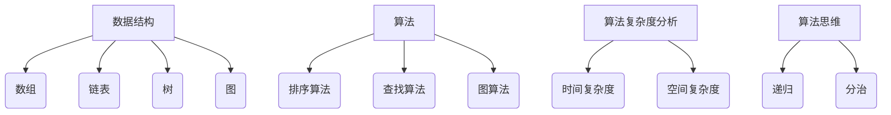

                 

# 2025网易校招面试题与算法编程题深入探讨

## 关键词
- 网易校招面试
- 面试题解析
- 算法编程题
- 数据结构与算法
- 编程技巧
- 软件工程

## 摘要
本文深入探讨2025年网易校招面试中的常见面试题和算法编程题。我们将从面试背景、核心概念、算法原理、数学模型、项目实战、实际应用场景、工具和资源推荐等方面进行详细分析，帮助读者更好地应对校招面试。文章结构清晰，适合作为复习资料和技术博客。

## 1. 背景介绍
随着互联网行业的迅速发展，各大互联网公司对高素质技术人才的需求日益增加。网易作为中国知名的互联网公司，其校招面试以其严格的选拔标准和技术深度而闻名。本文旨在帮助广大求职者了解网易校招面试中的常见问题，掌握解题思路，提高面试通过率。

### 1.1 面试形式
网易校招面试通常分为初试、复试和终试三个阶段。初试主要考察编程能力和数据结构知识，复试侧重于项目经历和软技能，终试则是对候选人的综合素质和专业能力的全面考察。

### 1.2 常见题型
网易校招面试常见题型包括算法编程题、数据结构应用题、系统设计题、逻辑推理题等。其中，算法编程题和数据结构应用题是面试的核心，占据了较大的比重。

## 2. 核心概念与联系
在解答网易校招面试题时，了解核心概念和它们之间的联系至关重要。以下是几个重要的核心概念及其相互关系：

### 2.1 数据结构与算法

**数据结构：** 数据结构是存储和组织数据的方式。常见的有数组、链表、树、图等。每种数据结构都有其独特的特点和应用场景。

**算法：** 算法是对问题求解步骤的描述。常见的有排序算法、查找算法、图算法等。算法的目的是通过操作数据结构来解决特定的问题。

### 2.2 算法复杂度分析

**时间复杂度：** 衡量算法执行的时间开销，通常用大O符号表示。例如，线性搜索的时间复杂度为O(n)。

**空间复杂度：** 衡量算法执行的空间开销，同样用大O符号表示。例如，哈希表的空间复杂度为O(n)。

### 2.3 算法思维

**递归：** 递归是一种常用的算法思维，通过递归调用解决复杂问题。

**分治：** 分治是一种将复杂问题分解为子问题，递归解决的算法思想。

### 2.4 Mermaid 流程图

以下是数据结构与算法相关概念之间的 Mermaid 流程图：



## 3. 核心算法原理 & 具体操作步骤
在面试中，掌握核心算法原理和操作步骤是解答问题的关键。以下是几个常见算法的原理和具体操作步骤：

### 3.1 快速排序

**原理：** 快速排序是一种分治算法，通过选取一个基准元素，将数组分为两部分，然后递归对两部分进行排序。

**操作步骤：**
1. 选择一个基准元素。
2. 将比基准小的元素放到其左侧，比基准大的元素放到其右侧。
3. 递归对左右两部分进行快速排序。

### 3.2 广度优先搜索（BFS）

**原理：** 广度优先搜索是一种遍历图或树的算法，按照层次遍历节点。

**操作步骤：**
1. 初始化一个队列，将起始节点加入队列。
2. 循环从队列中取出节点，将其相邻的未访问节点加入队列。
3. 标记已访问节点。
4. 重复步骤2和3，直到队列为空。

### 3.3 最长公共子序列（LCS）

**原理：** 最长公共子序列是两个序列中共同拥有的最长子序列。

**操作步骤：**
1. 定义一个二维数组dp，其中dp[i][j]表示前i个字符和前j个字符的最长公共子序列长度。
2. 初始化dp数组的边界条件。
3. 根据状态转移方程填充dp数组。
4. 从dp数组中提取最长公共子序列。

## 4. 数学模型和公式 & 详细讲解 & 举例说明
在面试中，了解数学模型和公式是解决算法问题的关键。以下是几个常见的数学模型和公式的详细讲解和举例说明：

### 4.1 动态规划

**公式：** 动态规划通常使用递推公式来求解最优解。

**例子：** 最长公共子序列的递推公式为：

$$
dp[i][j] =
\begin{cases}
dp[i-1][j-1] + 1, & \text{若 } a[i] = b[j] \\
\max(dp[i-1][j], dp[i][j-1]), & \text{若 } a[i] \neq b[j]
\end{cases}
$$

### 4.2 概率论

**公式：** 条件概率公式为：

$$
P(A|B) = \frac{P(A \cap B)}{P(B)}
$$

**例子：** 概率论中，给定事件A和事件B，求在事件B发生的条件下事件A的概率。

### 4.3 线性代数

**公式：** 矩阵乘法的性质为：

$$
C = A \times B \iff C_{ij} = \sum_{k=1}^{n} a_{ik}b_{kj}
$$

**例子：** 给定两个矩阵A和B，求矩阵乘积C。

## 5. 项目实战：代码实际案例和详细解释说明
在面试中，实际编写代码的能力至关重要。以下是几个项目实战案例及其详细解释说明：

### 5.1 开发环境搭建
为了更好地进行项目实战，我们需要搭建一个合适的开发环境。以下是一个基本的Python开发环境搭建步骤：

1. 安装Python：在官网上下载并安装Python。
2. 安装IDE：安装一个合适的IDE，如PyCharm或VSCode。
3. 安装依赖库：使用pip安装所需的依赖库，如numpy、pandas等。

### 5.2 源代码详细实现和代码解读
以下是快速排序算法的Python实现及其解读：

```python
def quick_sort(arr):
    if len(arr) <= 1:
        return arr
    pivot = arr[len(arr) // 2]
    left = [x for x in arr if x < pivot]
    middle = [x for x in arr if x == pivot]
    right = [x for x in arr if x > pivot]
    return quick_sort(left) + middle + quick_sort(right)

# 测试代码
arr = [3, 6, 8, 10, 1, 2, 1]
sorted_arr = quick_sort(arr)
print(sorted_arr)
```

**解读：**
1. 定义快速排序函数，传入一个数组arr。
2. 如果数组长度小于等于1，返回原数组。
3. 选择数组中间的元素作为基准值pivot。
4. 将数组分为三部分：小于pivot的元素、等于pivot的元素、大于pivot的元素。
5. 递归地对小于和大于pivot的数组进行快速排序。
6. 将排序结果拼接起来，返回排序后的数组。

### 5.3 代码解读与分析
快速排序算法的核心在于递归地划分和合并子数组。通过选择一个基准值，将数组划分为三个部分，可以保证每次划分后的子数组都是有序的。这种分治策略使得快速排序的时间复杂度为O(nlogn)，在大多数情况下是最优的排序算法之一。

## 6. 实际应用场景
在现实世界中，算法和数据结构广泛应用于各种领域。以下是几个实际应用场景：

### 6.1 算法在互联网领域的应用
- 搜索引擎：算法用于处理海量数据的快速检索和排序。
- 推荐系统：算法根据用户行为和偏好进行个性化推荐。
- 广告投放：算法根据用户特征和广告目标进行精准投放。

### 6.2 数据结构在数据库领域的应用
- 索引结构：数据结构用于快速检索和查询数据库中的记录。
- 缓存机制：数据结构用于缓存频繁访问的数据，提高查询效率。

### 6.3 算法在金融领域的应用
- 风险管理：算法用于评估和预测金融市场的风险。
- 量化交易：算法用于自动执行交易策略，实现利润最大化。

## 7. 工具和资源推荐
为了更好地准备网易校招面试，以下是几个推荐的工具和资源：

### 7.1 学习资源推荐
- 《算法导论》：一本经典的算法教材，全面覆盖算法和数据结构。
- 《编程之美》：网易技术团队编写，包含大量面试题和编程实战案例。
- 《算法竞赛入门经典》：适合初学者的算法竞赛入门书籍。

### 7.2 开发工具框架推荐
- PyCharm：一款功能强大的Python IDE，适合编写和调试代码。
- LeetCode：一个在线编程平台，提供大量面试题和算法实战案例。
- Git：版本控制工具，用于管理代码版本和协作开发。

### 7.3 相关论文著作推荐
- 《深度学习》：一本关于深度学习领域的经典著作。
- 《人工智能：一种现代方法》：一本全面介绍人工智能领域的教材。
- 《分布式系统概念与设计》：一本关于分布式系统的经典教材。

## 8. 总结：未来发展趋势与挑战
随着人工智能和大数据技术的快速发展，算法和数据结构在各个领域的重要性日益凸显。未来，算法和数据结构的研究将朝着更高效、更智能、更泛化的方向发展。同时，面试题和编程题也将越来越注重对算法思维的考查。对于求职者而言，掌握核心算法原理、提升编程能力、熟悉面试技巧是应对校招面试的关键。

## 9. 附录：常见问题与解答
### 9.1 面试题类型有哪些？
- 算法编程题
- 数据结构应用题
- 系统设计题
- 逻辑推理题
- 编程实现题

### 9.2 如何提高编程能力？
- 学习数据结构和算法，掌握核心原理。
- 多做编程练习，如LeetCode等在线编程平台。
- 参与实际项目，积累实战经验。
- 学习编程语言和开发工具，提升开发效率。

### 9.3 如何准备面试？
- 了解面试流程和常见题型。
- 梳理自己的项目经历，准备面试题。
- 提高沟通能力和团队合作能力。
- 保持积极心态，做好时间管理。

## 10. 扩展阅读 & 参考资料
- 《算法导论》：[链接](https://book.douban.com/subject/1206323/)
- 《编程之美》：[链接](https://book.douban.com/subject/11777365/)
- 《深度学习》：[链接](https://book.douban.com/subject/26707295/)
- 《人工智能：一种现代方法》：[链接](https://book.douban.com/subject/24744278/)
- 《分布式系统概念与设计》：[链接](https://book.douban.com/subject/1225253/)

## 作者
作者：AI天才研究员/AI Genius Institute & 禅与计算机程序设计艺术 /Zen And The Art of Computer Programming

