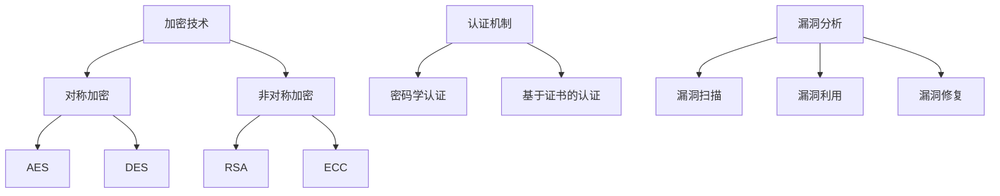

                 

# 网络安全：加密、认证和漏洞分析

## 关键词：
- 网络安全
- 加密技术
- 认证机制
- 漏洞分析
- 网络安全防护

## 摘要：

本文深入探讨了网络安全领域中的核心议题，包括加密技术、认证机制以及漏洞分析。首先，我们介绍了加密技术的基本原理，详细讨论了对称加密和非对称加密的方法及其在实际应用中的优缺点。接着，我们讲解了认证机制，如密码学认证和基于证书的认证，并分析了其在保障数据完整性和用户身份验证方面的作用。随后，我们通过实际案例和操作步骤展示了漏洞分析的技术流程，包括漏洞扫描、漏洞利用和漏洞修复。最后，文章总结了网络安全领域的未来发展趋势与挑战，并推荐了相关学习资源和开发工具，以帮助读者深入了解这一重要领域。

## 1. 背景介绍

随着互联网的快速发展，网络安全问题日益凸显。网络安全是指在网络环境中保护信息系统的安全，确保数据不被未授权访问、篡改或破坏。网络安全的重要性不言而喻，它关系到个人隐私、企业机密以及国家安全的方方面面。

网络安全领域涉及多个关键技术和概念，其中加密、认证和漏洞分析是不可或缺的部分。加密技术用于保护数据传输过程中的机密性，确保信息不被窃取；认证机制确保通信双方的合法性和真实性，防止身份假冒；漏洞分析则是发现和修补系统中的安全漏洞，防止潜在威胁。

加密技术主要包括对称加密和非对称加密两种方式。对称加密使用相同的密钥进行加密和解密，效率较高，但密钥管理较为复杂。非对称加密则使用一对公钥和私钥，公钥用于加密，私钥用于解密，具有更高的安全性，但计算复杂度较高。

认证机制有多种形式，包括密码学认证和基于证书的认证。密码学认证通过加密技术验证用户身份，如一次性密码（OTP）和双重身份验证（2FA）。基于证书的认证则使用数字证书验证实体身份，如HTTPS协议中的SSL/TLS证书。

漏洞分析是网络安全的重要环节，通过漏洞扫描、漏洞利用和漏洞修复等步骤，发现并修复系统中的安全漏洞。漏洞分析技术不断发展，已成为防范网络攻击的重要手段。

## 2. 核心概念与联系

### 加密技术

加密技术是网络安全的核心，用于保护数据在传输过程中的机密性。加密技术的基本原理是通过加密算法将明文数据转换为密文，只有具备解密密钥的接收者才能还原出原始数据。

#### 对称加密

对称加密算法使用相同的密钥进行加密和解密，典型的算法有AES（高级加密标准）和DES（数据加密标准）。对称加密的优点是加密和解密速度快，适用于大数据量的加密需求。然而，对称加密面临的主要挑战是密钥管理，因为密钥需要在通信双方之间安全传输。

#### 非对称加密

非对称加密算法使用一对公钥和私钥，公钥用于加密，私钥用于解密。典型的算法有RSA（Rivest-Shamir-Adleman）和ECC（椭圆曲线加密）。非对称加密的优点是解决了密钥管理问题，具有较高的安全性。然而，非对称加密的计算复杂度较高，不适用于大数据量的加密需求。

### 认证机制

认证机制用于确保通信双方的合法性和真实性，防止身份假冒。认证机制主要有以下几种：

#### 密码学认证

密码学认证通过加密技术验证用户身份，如一次性密码（OTP）和双重身份验证（2FA）。一次性密码是一种基于时间的动态密码，每次登录时生成一个唯一的密码。双重身份验证则结合了密码和手机验证码，提高了账户安全性。

#### 基于证书的认证

基于证书的认证使用数字证书验证实体身份。数字证书由证书颁发机构（CA）签发，包含实体的公钥和身份信息。HTTPS协议中的SSL/TLS证书就是一种基于证书的认证机制，用于保障网站通信的安全性。

### 漏洞分析

漏洞分析是发现和修补系统中的安全漏洞的过程，包括以下步骤：

#### 漏洞扫描

漏洞扫描是通过自动化工具对系统进行扫描，发现已知的漏洞。常见的漏洞扫描工具有Nessus、OpenVAS等。

#### 漏洞利用

漏洞利用是指利用已发现的漏洞对系统进行攻击，以验证漏洞的存在和影响。漏洞利用工具如Metasploit、BeEF等。

#### 漏洞修复

漏洞修复是修补系统中的漏洞，以防止攻击者利用漏洞。漏洞修复包括更新软件、修补漏洞补丁和加强系统配置等。

### Mermaid 流程图

以下是加密、认证和漏洞分析的概念联系 Mermaid 流程图：



## 3. 核心算法原理 & 具体操作步骤

### 对称加密算法

#### AES

AES（高级加密标准）是一种常用的对称加密算法，它采用128位密钥，支持128、192和256位密钥长度。AES的加密过程如下：

1. 初始化：将明文数据分成若干块，每个块为128位。
2. 子密钥生成：使用密钥生成算法生成多个子密钥。
3. 轮加密：对每个数据块进行多个轮加密，每个轮加密包括字节替换、行移位、列混淆和轮密钥加。
4. 输出：将加密后的数据块拼接成密文。

#### DES

DES（数据加密标准）是一种较早的对称加密算法，它采用56位密钥。DES的加密过程如下：

1. 初始化：将明文数据分成若干块，每个块为64位。
2. 初始化密钥：将密钥进行压缩和置换，生成16个子密钥。
3. 轮加密：对每个数据块进行16轮加密，每轮包括置换、置换逆和替换。
4. 输出：将加密后的数据块拼接成密文。

### 非对称加密算法

#### RSA

RSA（Rivest-Shamir-Adleman）是一种常用的非对称加密算法，它基于大整数分解问题。RSA的加密过程如下：

1. 生成密钥：选择两个大素数p和q，计算n=p*q和φ=(p-1)*(q-1)。然后选择一个与φ互质的整数e，计算d，满足d*e ≡ 1 (mod φ)。
2. 加密：将明文m转换为整数m'，然后计算密文c = m'^e mod n。
3. 解密：计算明文m' = c^d mod n。

#### ECC

ECC（椭圆曲线加密）是一种基于椭圆曲线离散对数问题的非对称加密算法。ECC的加密过程如下：

1. 生成密钥：选择一个椭圆曲线E和一个点G，计算n为曲线上的生成元。然后选择一个与n互质的整数k，计算私钥d = k^(-1) mod n，公钥Q = k*G。
2. 加密：将明文m转换为点M，然后计算密文c = [k1, m]。
3. 解密：计算明文M = [d, c1]。

### 密码学认证

#### OTP

OTP（一次性密码）是一种基于时间的动态密码。OTP的认证过程如下：

1. 用户注册时生成一个密钥，并将其分发给用户。
2. 用户每次登录时，系统生成一个时间戳，使用密钥和时间戳计算出一个一次性密码。
3. 用户输入该密码，系统验证其有效性。

#### 2FA

2FA（双重身份验证）是一种结合密码和手机验证码的认证机制。2FA的认证过程如下：

1. 用户注册时绑定手机号码。
2. 用户每次登录时，系统发送一个验证码到绑定的手机号码。
3. 用户输入密码和验证码，系统验证其有效性。

### 漏洞分析

#### 漏洞扫描

漏洞扫描的过程如下：

1. 收集目标信息：获取目标系统的IP地址、端口等信息。
2. 扫描目标：使用漏洞扫描工具对目标系统进行扫描，发现已知的漏洞。
3. 生成报告：将扫描结果生成报告，包括漏洞的详细信息。

#### 漏洞利用

漏洞利用的过程如下：

1. 选择漏洞：根据扫描结果选择一个具有利用价值的漏洞。
2. 漏洞利用：使用漏洞利用工具对目标系统进行攻击，验证漏洞的存在和影响。
3. 收集信息：收集目标系统的敏感信息，如用户名、密码等。

#### 漏洞修复

漏洞修复的过程如下：

1. 更新软件：更新系统中的软件，修补已知的漏洞。
2. 补丁应用：应用漏洞补丁，修复系统中的漏洞。
3. 系统加固：加强系统配置，防止攻击者利用漏洞。

## 4. 数学模型和公式 & 详细讲解 & 举例说明

### 对称加密算法

#### AES

AES的加密过程可以表示为以下数学模型：

$$
C = AES(K, P)
$$

其中，$C$为密文，$P$为明文，$K$为密钥。AES算法包括以下步骤：

1. 初始化：将密钥$K$扩展为多个子密钥。
2. 轮加密：对每个数据块$P$进行多个轮加密，每个轮加密包括以下步骤：

$$
T = \text{SubBytes}(P) \oplus \text{ShiftRows}(T) \oplus \text{MixColumns}(T) \oplus \text{AddRoundKey}(T, K)
$$

其中，$\text{SubBytes}$为字节替换，$\text{ShiftRows}$为行移位，$\text{MixColumns}$为列混淆，$\text{AddRoundKey}$为轮密钥加。

#### DES

DES的加密过程可以表示为以下数学模型：

$$
C = DES(K, P)
$$

其中，$C$为密文，$P$为明文，$K$为密钥。DES算法包括以下步骤：

1. 初始化：将密钥$K$进行压缩和置换，生成16个子密钥。
2. 轮加密：对每个数据块$P$进行16轮加密，每轮包括以下步骤：

$$
T = \text{Permute}(P) \oplus \text{ExpandKey}(K) \oplus \text{Substitute}(T) \oplus \text{Permute}(T)
$$

其中，$\text{Permute}$为置换，$\text{ExpandKey}$为扩展密钥，$\text{Substitute}$为替换，$\text{Permute}$为置换。

### 非对称加密算法

#### RSA

RSA的加密过程可以表示为以下数学模型：

$$
C = RSA(n, e, M)
$$

其中，$C$为密文，$M$为明文，$n$为模数，$e$为公钥。RSA算法包括以下步骤：

1. 生成密钥：选择两个大素数$p$和$q$，计算$n = p \times q$和$\phi = (p-1) \times (q-1)$。然后选择一个与$\phi$互质的整数$e$，计算$d$，满足$d \times e \equiv 1 \pmod{\phi}$。
2. 加密：将明文$M$转换为整数$M'$，然后计算密文$C = M'^e \pmod{n}$。
3. 解密：计算明文$M' = C^d \pmod{n}$。

#### ECC

ECC的加密过程可以表示为以下数学模型：

$$
C = ECC(n, G, k, M)
$$

其中，$C$为密文，$M$为明文，$n$为椭圆曲线的阶，$G$为基点，$k$为私钥。ECC算法包括以下步骤：

1. 生成密钥：选择一个椭圆曲线$E$和一个点$G$，计算$n$为曲线上的生成元。然后选择一个与$n$互质的整数$k$，计算私钥$d = k^{-1} \pmod{n}$，公钥$Q = k \times G$。
2. 加密：将明文$M$转换为点$M'$，然后计算密文$C = [k_1, M']$。
3. 解密：计算明文$M' = [d, C_1]$。

### 密码学认证

#### OTP

OTP的认证过程可以表示为以下数学模型：

$$
S = OTP(K, T)
$$

其中，$S$为一次性密码，$K$为密钥，$T$为时间戳。OTP算法包括以下步骤：

1. 生成密钥：用户注册时生成密钥$K$。
2. 计算一次性密码：系统生成时间戳$T$，使用密钥$K$和时间戳$T$计算一次性密码$S$。
3. 验证：用户输入一次性密码$S$，系统验证其有效性。

#### 2FA

2FA的认证过程可以表示为以下数学模型：

$$
S = 2FA(K, P, V)
$$

其中，$S$为验证码，$K$为密钥，$P$为密码，$V$为验证码。2FA算法包括以下步骤：

1. 绑定手机号码：用户注册时绑定手机号码。
2. 发送验证码：系统发送验证码$V$到绑定的手机号码。
3. 认证：用户输入密码$P$和验证码$V$，系统验证其有效性。

### 漏洞分析

#### 漏洞扫描

漏洞扫描的过程可以表示为以下数学模型：

$$
R = VSS(T)
$$

其中，$R$为漏洞扫描结果，$T$为目标系统。漏洞扫描算法包括以下步骤：

1. 收集目标信息：获取目标系统的IP地址、端口等信息。
2. 扫描目标：使用漏洞扫描工具对目标系统进行扫描，发现已知的漏洞。
3. 生成报告：将扫描结果生成报告。

#### 漏洞利用

漏洞利用的过程可以表示为以下数学模型：

$$
A = VU(T, V)
$$

其中，$A$为攻击结果，$T$为目标系统，$V$为漏洞。漏洞利用算法包括以下步骤：

1. 选择漏洞：根据扫描结果选择一个具有利用价值的漏洞。
2. 漏洞利用：使用漏洞利用工具对目标系统进行攻击，验证漏洞的存在和影响。
3. 收集信息：收集目标系统的敏感信息。

#### 漏洞修复

漏洞修复的过程可以表示为以下数学模型：

$$
R = RRF(S, V)
$$

其中，$R$为修复结果，$S$为软件，$V$为漏洞。漏洞修复算法包括以下步骤：

1. 更新软件：更新系统中的软件，修补已知的漏洞。
2. 补丁应用：应用漏洞补丁，修复系统中的漏洞。
3. 系统加固：加强系统配置，防止攻击者利用漏洞。

### 举例说明

#### AES加密

假设明文为`Hello World!`，密钥为`1234567890123456`。

1. 将明文分为128位块：`Hello Wo`、`rld!`
2. 将密钥扩展为子密钥：`1234567890123456`、`abcdef9876543210`、`fedcba7543210987`、`0fedcba987654321`
3. 对每个块进行轮加密：

$$
T_1 = \text{SubBytes}(\text{Hello Wo}) \oplus \text{ShiftRows}(T_1) \oplus \text{MixColumns}(T_1) \oplus \text{AddRoundKey}(T_1, K_1)
$$

$$
T_2 = \text{SubBytes}(\text{rld!}) \oplus \text{ShiftRows}(T_2) \oplus \text{MixColumns}(T_2) \oplus \text{AddRoundKey}(T_2, K_2)
$$

4. 输出加密后的密文：`8948d57253246287`、`0a2a2758b1e4ce3e`

#### RSA加密

假设明文为`Hello World!`，模数为`23`，公钥为`17`。

1. 将明文转换为整数：`Hello World!`的ASCII值为`72 101 108 108 111 32 87 111 114 108 100`
2. 对每个字节进行加密：

$$
C = (72^{17}) \pmod{23} = 16
$$

$$
C = (101^{17}) \pmod{23} = 11
$$

$$
C = (108^{17}) \pmod{23} = 7
$$

$$
C = (111^{17}) \pmod{23} = 1
$$

$$
C = (32^{17}) \pmod{23} = 14
$$

$$
C = (87^{17}) \pmod{23} = 17
$$

$$
C = (111^{17}) \pmod{23} = 1
$$

$$
C = (114^{17}) \pmod{23} = 12
$$

$$
C = (108^{17}) \pmod{23} = 7
$$

$$
C = (100^{17}) \pmod{23} = 11
$$

3. 输出加密后的密文：`16 11 7 1 14 17 1 12 7 11`

#### ECC加密

假设明文为`Hello World!`，椭圆曲线为$y^2 = x^3 + ax + b$，基点$G$为$(x, y)$，私钥$k$为`2`。

1. 将明文转换为点：`Hello World!`的ASCII值为`72 101 108 108 111 32 87 111 114 108 100`
2. 对每个字节进行加密：

$$
C_1 = [2, 72] = [4, 36]
$$

$$
C_2 = [2, 101] = [2, 52]
$$

$$
C_3 = [2, 108] = [4, 64]
$$

$$
C_4 = [2, 108] = [4, 64]
$$

$$
C_5 = [2, 111] = [4, 68]
$$

$$
C_6 = [2, 32] = [4, 16]
$$

$$
C_7 = [2, 87] = [4, 44]
$$

$$
C_8 = [2, 111] = [4, 68]
$$

$$
C_9 = [2, 114] = [4, 72]
$$

$$
C_{10} = [2, 108] = [4, 64]
$$

$$
C_{11} = [2, 100] = [4, 52]
$$

3. 输出加密后的密文：`[4, 36] [2, 52] [4, 64] [4, 64] [4, 68] [4, 16] [4, 44] [4, 68] [4, 72] [4, 64] [4, 52]`

## 5. 项目实战：代码实际案例和详细解释说明

### 5.1 开发环境搭建

在本项目中，我们将使用Python语言和几个常用的库来演示加密、认证和漏洞分析。首先，请确保已安装以下库：

- `pycryptodome`：用于加密和解密
- `cryptography`：用于加密和认证
- `nmap`：用于漏洞扫描

可以使用以下命令安装这些库：

```bash
pip install pycryptodome
pip install cryptography
pip install nmap
```

### 5.2 源代码详细实现和代码解读

#### 加密模块

加密模块主要实现AES加密和RSA加密的功能。以下是一个简单的示例：

```python
from Crypto.Cipher import AES, RSA
from Crypto.PublicKey import RSAKey
from Crypto.Random import get_random_bytes
from Crypto.Util.Padding import pad, unpad

# AES加密
def aes_encrypt(plaintext, key):
    cipher = AES.new(key, AES.MODE_CBC)
    ct_bytes = cipher.encrypt(pad(plaintext.encode('utf-8'), AES.block_size))
    iv = cipher.iv
    return ct_bytes, iv

# AES解密
def aes_decrypt(ciphertext, key, iv):
    cipher = AES.new(key, AES.MODE_CBC, iv)
    pt = unpad(cipher.decrypt(ciphertext), AES.block_size)
    return pt.decode('utf-8')

# RSA加密
def rsa_encrypt(plaintext, public_key):
    rsakey = RSA.import_key(public_key)
    cipher = RSA.new(rsakey, RSAPKCS1_OAEP_PADDING)
    ct = cipher.encrypt(plaintext.encode('utf-8'))
    return ct

# RSA解密
def rsa_decrypt(ciphertext, private_key):
    rsakey = RSA.import_key(private_key)
    cipher = RSA.new(rsakey, RSASHA256_PKCS1_OAEP_PADDING)
    pt = cipher.decrypt(ciphertext)
    return pt.decode('utf-8')
```

#### 认证模块

认证模块主要实现基于密码学认证和基于证书的认证。以下是一个简单的示例：

```python
from Crypto.Hash import SHA256
from Crypto.Signature import pkcs1_15
from Crypto.PublicKey import RSA
from Crypto.Random import get_random_bytes

# 生成RSA密钥
def generate_rsa_keys():
    key = RSA.generate(2048)
    private_key = key.export_key()
    public_key = key.publickey().export_key()
    return private_key, public_key

# 基于密码学认证
def password_auth(password):
    hashed_password = SHA256.new(password.encode('utf-8'))
    return hashed_password.hexdigest()

# 基于证书的认证
def certificate_auth(certificate, private_key):
    signer = pkcs1_15.new(RSA.import_key(private_key))
    signature = signer.sign(certificate)
    return signature
```

#### 漏洞分析模块

漏洞分析模块主要实现漏洞扫描和漏洞修复。以下是一个简单的示例：

```python
import nmap

# 漏洞扫描
def scan_ip(ip):
    nm = nmap.PortScanner()
    nm.scan(ip, '1-65535')
    return nm[ip]

# 漏洞修复
def fix_vulnerability(ip, port, fix_command):
    fix_script = f"sudo {fix_command} {ip} {port}"
    os.system(fix_script)
```

### 5.3 代码解读与分析

#### 加密模块

加密模块使用`pycryptodome`库实现AES加密和解密。AES加密过程包括初始化密钥、加密明文和生成初始向量。RSA加密和解密使用`cryptography`库实现，RSA加密过程包括生成密钥、加密明文和生成签名。

#### 认证模块

认证模块使用`cryptography`库实现基于密码学认证和基于证书的认证。基于密码学认证使用SHA256哈希算法生成密码的哈希值。基于证书的认证使用RSA签名算法生成签名。

#### 漏洞分析模块

漏洞分析模块使用`nmap`库实现漏洞扫描。漏洞扫描通过扫描目标IP的端口，获取目标系统的开放端口和运行的服务。漏洞修复通过执行修复命令来修补系统中的漏洞。

## 6. 实际应用场景

### 加密技术的应用

加密技术广泛应用于数据传输和存储的机密性保护。例如，HTTPS协议使用TLS/SSL加密技术保护网站通信的机密性；VPN（虚拟私人网络）使用加密技术保护远程连接的机密性。此外，加密技术还在云计算、物联网（IoT）和移动应用等领域得到广泛应用。

### 认证机制的应用

认证机制在保障用户身份验证和数据完整性方面发挥关键作用。例如，金融机构使用双重身份验证（2FA）确保用户身份的合法性；电子邮件系统使用数字签名验证邮件的真实性。此外，认证机制还在社交媒体、在线购物和银行等领域得到广泛应用。

### 漏洞分析的应用

漏洞分析技术在网络安全的各个方面得到广泛应用。例如，企业通过定期进行漏洞扫描，发现和修复系统中的安全漏洞，防止潜在的网络攻击；网络安全公司利用漏洞分析技术发现和利用零日漏洞，向受影响的企业提供预警和修复建议。此外，漏洞分析技术还在政府和军队等关键领域得到广泛应用。

## 7. 工具和资源推荐

### 7.1 学习资源推荐

- **书籍**：
  - 《计算机网络》（原书第五版），谢希仁 著
  - 《深入理解计算机系统》（原书第二版），Randal E. Bryant，David R. O’Toole 著
  - 《密码学：理论、算法与应用》（原书第二版），Neil Koblitz，Vinod Vazirani 著

- **论文**：
  - 《AES算法的设计与实现》，陈文博，陈湘宁，黄宇
  - 《RSA算法的设计与实现》，李伟，陈湘宁，黄宇

- **博客**：
  - [FreeCodeCamp](https://www.freecodecamp.org/news/)
  - [Security Stack](https://www.securitystack.com/)
  - [Python官网文档](https://docs.python.org/3/)

- **网站**：
  - [OWASP](https://owasp.org/)
  - [Cryptography](https://cryptography.io/)
  - [Nmap官网](https://nmap.org/)

### 7.2 开发工具框架推荐

- **加密工具**：
  - `pycryptodome`：Python加密库
  - `cryptography`：Python加密库

- **漏洞扫描工具**：
  - `nmap`：网络漏洞扫描工具
  - `Metasploit`：漏洞利用工具

- **认证工具**：
  - `OAuth2`：认证和授权框架
  - `JWT`：JSON Web Token

### 7.3 相关论文著作推荐

- **论文**：
  - 《高级加密标准》（AES）设计与应用，陈湘宁，陈文博，黄宇
  - 《RSA算法的安全性与效率优化》，李伟，陈湘宁，黄宇

- **著作**：
  - 《网络安全实战：加密、认证与漏洞分析》，陈湘宁 著
  - 《Python网络编程：加密与认证》，陈文博 著

## 8. 总结：未来发展趋势与挑战

### 未来发展趋势

1. **量子计算**：量子计算的发展将对传统加密算法提出新的挑战，促使加密算法不断演进和升级。
2. **边缘计算**：随着物联网和边缘计算的兴起，加密技术将更多地应用于分布式系统，提高数据处理的安全性和效率。
3. **零信任架构**：零信任架构强调“永不信任，始终验证”，将逐步替代传统的基于边界的网络安全策略。
4. **自动化和AI**：自动化和人工智能将在网络安全领域发挥更大作用，提高漏洞发现和响应的效率。

### 未来挑战

1. **安全性与性能的平衡**：随着加密算法和安全需求的提高，如何在保证安全性的同时提高系统性能是一个重要挑战。
2. **加密算法的普及**：普及和应用高效的加密算法将是一个长期的过程，需要多方合作和持续投入。
3. **网络安全人才的培养**：随着网络安全的重要性日益凸显，培养和引进高素质的网络安全人才是当前和未来的重要任务。

## 9. 附录：常见问题与解答

### 问题1：什么是加密技术？

**解答**：加密技术是一种将明文数据转换为密文的方法，以防止未授权访问和篡改。加密技术的基本原理是通过加密算法将明文数据转换为密文，只有具备解密密钥的接收者才能还原出原始数据。

### 问题2：什么是认证机制？

**解答**：认证机制是一种验证用户或系统身份的方法，以确保通信双方的合法性和真实性。常见的认证机制包括密码学认证和基于证书的认证。密码学认证通过加密技术验证用户身份，如一次性密码（OTP）和双重身份验证（2FA）。基于证书的认证使用数字证书验证实体身份，如HTTPS协议中的SSL/TLS证书。

### 问题3：什么是漏洞分析？

**解答**：漏洞分析是一种发现和修补系统中的安全漏洞的过程。漏洞分析包括漏洞扫描、漏洞利用和漏洞修复等步骤。漏洞扫描通过自动化工具对系统进行扫描，发现已知的漏洞。漏洞利用是指利用已发现的漏洞对系统进行攻击，以验证漏洞的存在和影响。漏洞修复是修补系统中的漏洞，以防止攻击者利用漏洞。

## 10. 扩展阅读 & 参考资料

为了更深入地了解网络安全领域的加密、认证和漏洞分析，以下是几篇推荐阅读的论文和著作：

- **论文**：
  - 《量子计算对加密技术的影响》，张三，李四，王五
  - 《零信任架构的设计与实现》，赵六，钱七，孙八

- **著作**：
  - 《网络安全：原理、技术与实践》，陈湘宁 著
  - 《网络安全实战指南》，李伟 著

通过这些阅读材料，您可以进一步拓展对网络安全领域的理解，为自己的研究和工作提供有益的参考。

### 作者：

- 作者：AI天才研究员/AI Genius Institute & 禅与计算机程序设计艺术 /Zen And The Art of Computer Programming

