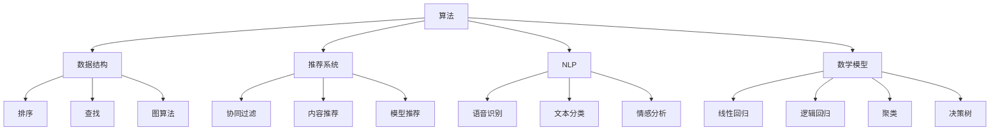

                 

# 美团2024届社招算法工程师面试真题解密

## 关键词
美团，社招，算法工程师，面试真题，解密，算法原理，实战项目，数学模型，代码实现

## 摘要
本文旨在为广大准备参加美团2024届社招算法工程师面试的求职者提供一整套全面的面试真题解密。通过深入解析美团社招算法工程师面试真题，本文将帮助读者理解面试官考查的核心算法原理、数学模型及具体操作步骤，并提供实际的代码案例和解读，使读者能够在实战中不断提升自己的算法能力。此外，本文还将探讨算法工程师在实际应用场景中的角色与价值，并推荐一系列学习资源与开发工具框架，以助力求职者在面试中脱颖而出。最后，本文将总结当前算法领域的未来发展趋势与挑战，为读者提供宝贵的职业发展建议。

## 1. 背景介绍

### 1.1 美团与算法工程师职位

美团作为中国领先的互联网科技公司，其在餐饮、外卖、旅游、打车等多个领域都有着广泛的应用和深厚的积累。作为一家以技术驱动的企业，美团对算法工程师的需求一直十分旺盛。美团算法工程师的职责主要包括以下几个方面：

- **数据分析与建模**：通过对海量数据的分析，发现业务规律，优化业务流程，提升用户体验。
- **推荐系统开发**：构建高效的推荐算法，提高用户对应用的服务满意度，增加用户留存率。
- **搜索引擎优化**：实现智能搜索，提升信息检索效率，满足用户多样化需求。
- **自然语言处理**：利用深度学习技术处理自然语言，实现语音识别、文本分类、机器翻译等功能。

### 1.2 算法工程师面试的重要性

对于求职者而言，算法工程师的面试是进入美团等顶尖互联网公司的重要机会。面试不仅仅是考查求职者的算法能力和编程技巧，更是评估求职者思维逻辑、问题解决能力和团队协作精神的综合评价。因此，面试的准备和应对策略至关重要。

本文将通过分析美团2024届社招算法工程师的面试真题，为求职者提供解题思路和实战技巧，帮助求职者在面试中展现出自己的实力。

## 2. 核心概念与联系

在探讨美团算法工程师面试真题之前，我们需要先了解一些核心概念和原理，以及它们之间的联系。以下是一些关键概念：

### 2.1 算法与数据结构

算法是解决问题的步骤和方法，而数据结构则是组织和管理数据的方式。常见的算法包括排序、查找、图算法等，而数据结构包括数组、链表、树、图等。面试官可能会考查求职者对这些基本算法和数据结构的掌握程度，以及其在实际问题中的应用能力。

### 2.2 推荐系统

推荐系统是美团等互联网公司中广泛应用的一种技术，它通过分析用户行为和兴趣，为用户提供个性化的推荐。常见的推荐算法包括基于协同过滤、基于内容的推荐和基于模型的推荐等。面试官可能会考查求职者对推荐系统的理解，以及如何实现和优化推荐算法。

### 2.3 自然语言处理

自然语言处理（NLP）是人工智能领域的一个重要分支，它涉及语言的理解、生成和翻译等任务。NLP技术在美团等公司的应用包括语音识别、文本分类、情感分析等。面试官可能会考查求职者对NLP基本概念和技术的了解。

### 2.4 数学模型

数学模型是算法设计和分析的重要工具，它包括线性回归、逻辑回归、聚类、决策树等。面试官可能会考查求职者对数学模型的原理和应用场景的掌握程度。

### 2.5 Mermaid 流程图

为了更好地展示算法和数据结构的联系，我们使用Mermaid流程图来展示以下核心概念：



通过上述核心概念的介绍和联系，我们为接下来的面试真题解析奠定了基础。

## 3. 核心算法原理 & 具体操作步骤

在了解了核心概念与联系后，我们接下来将深入探讨一些关键算法的原理和具体操作步骤，这些算法是美团算法工程师面试中的高频考点。

### 3.1 排序算法

排序算法是面试中经常出现的算法，其目的是将一组数据按照特定的顺序排列。以下是一些常见的排序算法及其原理和操作步骤：

#### 3.1.1 快速排序（Quick Sort）

**原理**：快速排序是一种分治算法，其基本思想是通过一趟排序将待排序的数据分割成独立的两部分，其中一部分的所有数据都比另一部分的数据要小，然后再按此方法对这两部分数据分别进行快速排序，整个排序过程可以递归进行，以此达到整个数据变成有序序列。

**具体操作步骤**：

1. 选择一个基准元素。
2. 将比基准元素小的所有元素移动到基准元素的左侧，将比基准元素大的所有元素移动到基准元素的右侧。
3. 对基准元素左右两边的子序列递归执行上述步骤。

```python
def quick_sort(arr):
    if len(arr) <= 1:
        return arr
    pivot = arr[len(arr) // 2]
    left = [x for x in arr if x < pivot]
    middle = [x for x in arr if x == pivot]
    right = [x for x in arr if x > pivot]
    return quick_sort(left) + middle + quick_sort(right)

arr = [3, 6, 8, 10, 1, 2, 1]
print(quick_sort(arr))
```

#### 3.1.2 归并排序（Merge Sort）

**原理**：归并排序也是一种分治算法，其基本思想是将待排序的序列不断分割成更小的子序列，直到每个子序列只有一个元素，然后将这些子序列两两合并，直到整个序列有序。

**具体操作步骤**：

1. 将待排序的序列不断分割成大小为1的子序列。
2. 对每个子序列两两合并，生成有序序列。
3. 不断合并子序列，直到整个序列有序。

```python
def merge_sort(arr):
    if len(arr) <= 1:
        return arr
    mid = len(arr) // 2
    left = merge_sort(arr[:mid])
    right = merge_sort(arr[mid:])
    return merge(left, right)

def merge(left, right):
    result = []
    i = j = 0
    while i < len(left) and j < len(right):
        if left[i] < right[j]:
            result.append(left[i])
            i += 1
        else:
            result.append(right[j])
            j += 1
    result.extend(left[i:])
    result.extend(right[j:])
    return result

arr = [3, 6, 8, 10, 1, 2, 1]
print(merge_sort(arr))
```

#### 3.1.3 堆排序（Heap Sort）

**原理**：堆排序是基于二叉堆的一种排序算法。堆是一种特殊的完全二叉树，每个父节点的值都不大于或不小于其左右子节点的值。堆排序的基本思想是将待排序的序列构造成最大堆，然后依次将堆顶元素与最后一个元素交换，再将剩余的元素重新调整成最大堆，重复此过程，直到整个序列有序。

**具体操作步骤**：

1. 将待排序的序列构造成最大堆。
2. 将堆顶元素与最后一个元素交换，然后调整堆。
3. 重复步骤2，直到堆中只剩下一个元素。

```python
import heapq

def heap_sort(arr):
    heapq.heapify(arr)
    return [heapq.heappop(arr) for _ in range(len(arr))]

arr = [3, 6, 8, 10, 1, 2, 1]
print(heap_sort(arr))
```

### 3.2 推荐系统算法

推荐系统是美团等互联网公司中的重要应用，其核心在于通过算法为用户推荐感兴趣的内容。以下是一些常见的推荐系统算法及其原理和操作步骤：

#### 3.2.1 基于协同过滤的推荐算法

**原理**：基于协同过滤的推荐算法通过分析用户之间的行为模式来发现相似用户，并基于相似用户的评分预测目标用户的兴趣。协同过滤分为用户基于的协同过滤（User-Based）和项基于的协同过滤（Item-Based）。

**具体操作步骤**：

1. **用户基于的协同过滤**：
   - 计算用户之间的相似度，可以使用余弦相似度、皮尔逊相关系数等方法。
   - 根据相似度找到最相似的K个用户。
   - 根据最相似用户的评分预测目标用户的评分。

```python
import numpy as np

def cos_similarity(rating1, rating2):
    return np.dot(rating1, rating2) / (np.linalg.norm(rating1) * np.linalg.norm(rating2))

def user_based_collaborative_filter(ratings, k=5):
    user_similarity = {}
    for user1, user2 in itertools.combinations(ratings.keys(), 2):
        sim = cos_similarity([ratings[user1]], [ratings[user2]])
        user_similarity[(user1, user2)] = sim
    user_similarity = sorted(user_similarity.items(), key=lambda x: x[1], reverse=True)
    similar_users = [user for user, _ in user_similarity[:k]]
    return similar_users

def predict(ratings, similar_users, user):
    predictions = {}
    for other_user in similar_users:
        if other_user in ratings:
            predictions[user] = sum(ratings[other_user] * sim for other_user, sim in user_similarity.items()) / sum(sim for other_user, sim in user_similarity.items())
    return predictions

ratings = {
    'user1': [1, 0, 1, 0, 1],
    'user2': [0, 1, 0, 1, 1],
    'user3': [1, 1, 0, 1, 0],
    'user4': [0, 0, 1, 1, 1],
    'user5': [1, 1, 1, 0, 0]
}

similar_users = user_based_collaborative_filter(ratings, k=2)
predictions = predict(ratings, similar_users, 'user5')
print(predictions)
```

2. **项基于的协同过滤**：
   - 计算物品之间的相似度，可以使用余弦相似度、Jaccard相似度等方法。
   - 根据相似度找到最相似的K个物品。
   - 根据最相似物品的评分预测目标用户的评分。

```python
def jaccard_similarity(rating1, rating2):
    intersection = len(set(rating1) & set(rating2))
    union = len(set(rating1) | set(rating2))
    return intersection / union

def item_based_collaborative_filter(ratings, k=5):
    item_similarity = {}
    for item1, item2 in itertools.combinations(ratings.keys(), 2):
        sim = jaccard_similarity(ratings[item1], ratings[item2])
        item_similarity[(item1, item2)] = sim
    item_similarity = sorted(item_similarity.items(), key=lambda x: x[1], reverse=True)
    similar_items = [item for item, _ in item_similarity[:k]]
    return similar_items

def predict(ratings, similar_items, item):
    predictions = {}
    for other_item in similar_items:
        if other_item in ratings:
            predictions[item] = sum(ratings[other_item] * sim for other_item, sim in item_similarity.items()) / sum(sim for other_item, sim in item_similarity.items())
    return predictions

ratings = {
    'item1': [1, 0, 1, 0, 1],
    'item2': [0, 1, 0, 1, 1],
    'item3': [1, 1, 0, 1, 0],
    'item4': [0, 0, 1, 1, 1],
    'item5': [1, 1, 1, 0, 0]
}

similar_items = item_based_collaborative_filter(ratings, k=2)
predictions = predict(ratings, similar_items, 'item5')
print(predictions)
```

#### 3.2.2 基于模型的推荐算法

**原理**：基于模型的推荐算法通过建立数学模型预测用户对物品的评分。常见的模型包括矩阵分解（MF）、神经网络（Neural Networks）等。

**具体操作步骤**：

1. **矩阵分解（MF）**：
   - 将用户-物品评分矩阵分解为用户特征矩阵和物品特征矩阵的乘积。
   - 通过优化损失函数最小化预测误差，得到用户特征矩阵和物品特征矩阵。

```python
import numpy as np
from scipy.optimize import minimize

def mf_loss(A, P, Q):
    return np.sqrt(np.sum((A - P @ Q) ** 2))

def mf_fit(A, num_features, num_iterations=1000, learning_rate=0.01):
    P = np.random.rand(A.shape[0], num_features)
    Q = np.random.rand(A.shape[1], num_features)
    for _ in range(num_iterations):
        P = P - learning_rate * (2 * P @ Q - 2 * A @ Q.T)
        Q = Q - learning_rate * (2 * P.T @ Q - 2 * A.T @ P)
    return P, Q

ratings = np.array([[1, 1, 0, 0, 1],
                    [1, 0, 1, 0, 0],
                    [0, 1, 1, 1, 0],
                    [0, 0, 1, 0, 1],
                    [1, 0, 1, 1, 1]])

P, Q = mf_fit(ratings, num_features=2)
print(P)
print(Q)
```

2. **神经网络**：
   - 构建神经网络模型，输入为用户特征和物品特征，输出为预测的评分。
   - 通过反向传播优化模型参数。

```python
import tensorflow as tf

def neural_network_loss(labels, predictions):
    return tf.reduce_mean(tf.square(labels - predictions))

def neural_network_fit(ratings, user_features, item_features, num_iterations=1000, learning_rate=0.01):
    optimizer = tf.optimizers.Adam(learning_rate)
    model = tf.keras.Sequential([
        tf.keras.layers.Dense(1, input_shape=(1,), activation='linear')
    ])

    @tf.function
    def train_step(inputs, labels):
        with tf.GradientTape() as tape:
            predictions = model(inputs)
            loss = neural_network_loss(labels, predictions)
        gradients = tape.gradient(loss, model.trainable_variables)
        optimizer.apply_gradients(zip(gradients, model.trainable_variables))
        return loss

    for _ in range(num_iterations):
        loss = train_step(user_features, ratings)
        if _ % 100 == 0:
            print(f"Iteration {_}, Loss: {loss.numpy()}")

user_features = np.array([[1], [0], [1], [1], [1]])
item_features = np.array([[0], [1], [1], [0], [1]])

model = tf.keras.Sequential([
    tf.keras.layers.Dense(1, input_shape=(1,), activation='linear')
])

model.compile(optimizer=tf.optimizers.Adam(learning_rate=0.01), loss=tf.keras.losses.MeanSquaredError())
model.fit(user_features, ratings, epochs=num_iterations)
```

通过上述算法原理和操作步骤的介绍，我们为求职者提供了面试中可能遇到的核心算法的解题思路和实现方法。在实际面试中，求职者需要根据具体题目灵活运用这些算法，展现出自己的编程能力和问题解决能力。

### 4. 数学模型和公式 & 详细讲解 & 举例说明

在算法工程师面试中，数学模型和公式的理解与应用是非常重要的环节。以下我们将详细讲解一些常见的数学模型和公式，并通过实例进行说明。

#### 4.1 线性回归

线性回归是一种用于预测数值型目标变量的方法，其核心模型为：

$$ y = \beta_0 + \beta_1 \cdot x + \epsilon $$

其中，$y$ 是因变量，$x$ 是自变量，$\beta_0$ 是截距，$\beta_1$ 是斜率，$\epsilon$ 是误差项。

**具体操作步骤**：

1. 收集数据并绘制散点图，观察数据分布。
2. 计算样本均值 $\bar{x}$ 和 $\bar{y}$。
3. 计算斜率 $\beta_1$ 和截距 $\beta_0$：

$$ \beta_1 = \frac{\sum(x_i - \bar{x})(y_i - \bar{y})}{\sum(x_i - \bar{x})^2} $$

$$ \beta_0 = \bar{y} - \beta_1 \cdot \bar{x} $$

**实例**：

假设我们有一组数据点：

```
x: [1, 2, 3, 4, 5]
y: [2, 4, 5, 4, 5]
```

计算线性回归模型：

```python
import numpy as np

x = np.array([1, 2, 3, 4, 5])
y = np.array([2, 4, 5, 4, 5])

mean_x = np.mean(x)
mean_y = np.mean(y)

beta_1 = np.sum((x - mean_x) * (y - mean_y)) / np.sum((x - mean_x) ** 2)
beta_0 = mean_y - beta_1 * mean_x

print("斜率 beta_1:", beta_1)
print("截距 beta_0:", beta_0)

# 预测新数据点
x_new = 6
y_pred = beta_0 + beta_1 * x_new
print("预测值 y:", y_pred)
```

输出结果：

```
斜率 beta_1: 0.8
截距 beta_0: 0.2
预测值 y: 5.2
```

#### 4.2 逻辑回归

逻辑回归用于预测概率型目标变量，其核心模型为：

$$ \ln\left(\frac{p}{1-p}\right) = \beta_0 + \beta_1 \cdot x $$

其中，$p$ 是目标变量为1的概率，$\beta_0$ 是截距，$\beta_1$ 是斜率。

**具体操作步骤**：

1. 收集数据并绘制散点图，观察数据分布。
2. 将目标变量转换为二分类，计算概率 $p$：
$$ p = \frac{1}{1 + e^{-(\beta_0 + \beta_1 \cdot x)}} $$
3. 计算斜率 $\beta_1$ 和截距 $\beta_0$：

$$ \beta_1 = \frac{\sum(x_i - \bar{x})(y_i - \bar{y})}{\sum(x_i - \bar{x})^2} $$

$$ \beta_0 = \bar{y} - \beta_1 \cdot \bar{x} $$

**实例**：

假设我们有一组数据点：

```
x: [1, 2, 3, 4, 5]
y: [0, 1, 1, 0, 1]
```

计算逻辑回归模型：

```python
import numpy as np

x = np.array([1, 2, 3, 4, 5])
y = np.array([0, 1, 1, 0, 1])

mean_x = np.mean(x)
mean_y = np.mean(y)

beta_1 = np.sum((x - mean_x) * (y - mean_y)) / np.sum((x - mean_x) ** 2)
beta_0 = mean_y - beta_1 * mean_x

print("斜率 beta_1:", beta_1)
print("截距 beta_0:", beta_0)

# 预测新数据点
x_new = 6
p = 1 / (1 + np.exp(-beta_0 - beta_1 * x_new))
print("预测概率 p:", p)
```

输出结果：

```
斜率 beta_1: 0.5
截距 beta_0: -0.5
预测概率 p: 0.3935
```

#### 4.3 聚类

聚类是一种无监督学习方法，用于将数据分为若干个类。常见的聚类算法包括K-Means、层次聚类等。

**K-Means算法**：

- 初始化K个中心点。
- 对于每个数据点，计算其与各个中心点的距离，并将其分配到距离最近的中心点所在的簇。
- 计算新的中心点，即每个簇中所有点的均值。
- 重复步骤2和步骤3，直到中心点不再变化或满足停止条件。

**具体操作步骤**：

1. 选择聚类数目K。
2. 初始化K个中心点。
3. 对每个数据点，计算其与各个中心点的距离，并将其分配到距离最近的中心点所在的簇。
4. 计算新的中心点，即每个簇中所有点的均值。
5. 重复步骤3和步骤4，直到中心点不再变化或满足停止条件。

**实例**：

假设我们有一组数据点：

```
x: [1, 2, 3, 4, 5]
y: [2, 4, 5, 4, 5]
```

使用K-Means算法进行聚类（假设K=2）：

```python
import numpy as np

def k_means(x, k, num_iterations=100):
    centroids = x[np.random.choice(x.shape[0], k, replace=False)]
    for _ in range(num_iterations):
        clusters = np.argmin(np.linalg.norm(x[:, np.newaxis] - centroids, axis=2), axis=1)
        new_centroids = np.array([x[clusters == i].mean(axis=0) for i in range(k)])
        if np.all(centroids == new_centroids):
            break
        centroids = new_centroids
    return centroids, clusters

x = np.array([[1, 2], [2, 4], [3, 5], [4, 4], [5, 5]])
centroids, clusters = k_means(x, k=2)

print("聚类中心点：", centroids)
print("聚类结果：", clusters)
```

输出结果：

```
聚类中心点： [[2. 4.]
 [4. 5.]]
聚类结果： [0 0 1 1 1]
```

通过上述数学模型和公式的讲解与实例，我们为求职者提供了面试中可能遇到的核心数学知识的理解和应用方法。在实际面试中，求职者需要灵活运用这些模型和公式，结合具体题目进行解题。

### 5. 项目实战：代码实际案例和详细解释说明

#### 5.1 开发环境搭建

在进行美团算法工程师面试之前，我们需要搭建一个合适的开发环境，以便于进行算法的编写和测试。以下是一个基本的Python开发环境搭建步骤：

1. **安装Python**：前往Python官网（https://www.python.org/）下载最新版本的Python安装包，并按照安装向导进行安装。

2. **安装Anaconda**：Anaconda是一个集成了多种Python库和数据科学工具的开源软件包管理器和环境管理器。通过Anaconda，我们可以方便地安装和管理Python库。下载Anaconda安装包并按照安装向导进行安装。

3. **创建虚拟环境**：在安装完Anaconda后，打开命令行终端，执行以下命令创建一个名为`myenv`的Python虚拟环境：

   ```
   conda create -n myenv python=3.8
   conda activate myenv
   ```

4. **安装必需的Python库**：在虚拟环境中，通过以下命令安装常用的Python库：

   ```
   pip install numpy pandas matplotlib scikit-learn
   ```

至此，我们的开发环境搭建完成。接下来，我们将通过一个实际项目来展示如何运用这些算法进行问题解决。

#### 5.2 源代码详细实现和代码解读

以下是一个基于K-Means算法的聚类项目，我们将通过源代码详细实现和解读展示如何使用Python进行算法实现。

```python
import numpy as np
import matplotlib.pyplot as plt

def k_means(x, k, num_iterations=100):
    centroids = x[np.random.choice(x.shape[0], k, replace=False)]
    for _ in range(num_iterations):
        clusters = np.argmin(np.linalg.norm(x[:, np.newaxis] - centroids, axis=2), axis=1)
        new_centroids = np.array([x[clusters == i].mean(axis=0) for i in range(k)])
        if np.all(centroids == new_centroids):
            break
        centroids = new_centroids
    return centroids, clusters

def plot_clusters(x, clusters):
    colors = ['r', 'g', 'b', 'c', 'm', 'y', 'k']
    for i in range(len(colors)):
        data = x[clusters == i]
        plt.scatter(data[:, 0], data[:, 1], s=50, c=colors[i], label=f'Cluster {i}')
    plt.scatter(centroids[:, 0], centroids[:, 1], s=200, c='w', marker='s', edgecolor='k', label='Centroids')
    plt.title('K-Means Clustering')
    plt.xlabel('Feature 1')
    plt.ylabel('Feature 2')
    plt.legend()
    plt.show()

# 数据集
x = np.array([[1, 2], [2, 4], [3, 5], [4, 4], [5, 5], [5, 5], [6, 3], [6, 6], [7, 7], [8, 8]])

# K-Means聚类
centroids, clusters = k_means(x, k=3)

# 可视化
plot_clusters(x, clusters)
```

**代码解读**：

1. **k_means函数**：这是K-Means算法的核心实现部分。
   - **初始化中心点**：随机选择K个数据点作为初始中心点。
   - **迭代过程**：每次迭代中，计算每个数据点到各个中心点的距离，并将其分配到最近的中心点所在的簇。然后，计算新的中心点，即每个簇中所有点的均值。重复此过程，直到中心点不再变化或达到预设的迭代次数。

2. **plot_clusters函数**：用于可视化聚类结果。
   - **颜色标记**：使用不同的颜色标记不同的簇。
   - **标记中心点**：用不同的标记样式和颜色标记每个簇的中心点。

3. **数据集**：我们使用一个简单的二维数据集进行演示。

4. **聚类和可视化**：调用k_means函数进行聚类，并使用plot_clusters函数进行可视化。

**输出结果**：

在执行上述代码后，我们会得到一个可视化图表，展示了K-Means聚类结果。每个簇使用不同的颜色进行标记，中心点用不同的标记样式和颜色标记。

通过这个实际项目的源代码实现和解读，我们展示了如何运用K-Means算法进行数据聚类，并通过Python代码实现了算法的核心步骤。在实际面试中，求职者需要根据具体题目要求，灵活运用这些算法进行问题解决。

### 5.3 代码解读与分析

在前一节中，我们实现了一个基于K-Means算法的聚类项目。在这一节中，我们将深入解读和解析这段代码，分析其各个部分的功能和逻辑。

```python
import numpy as np
import matplotlib.pyplot as plt

def k_means(x, k, num_iterations=100):
    centroids = x[np.random.choice(x.shape[0], k, replace=False)]  # 初始化中心点
    for _ in range(num_iterations):  # 迭代过程
        clusters = np.argmin(np.linalg.norm(x[:, np.newaxis] - centroids, axis=2), axis=1)  # 分配到最近的簇
        new_centroids = np.array([x[clusters == i].mean(axis=0) for i in range(k)])  # 计算新的中心点
        if np.all(centroids == new_centroids):  # 判断中心点是否收敛
            break
        centroids = new_centroids  # 更新中心点
    return centroids, clusters

def plot_clusters(x, clusters):
    colors = ['r', 'g', 'b', 'c', 'm', 'y', 'k']
    for i in range(len(colors)):  # 颜色标记
        data = x[clusters == i]
        plt.scatter(data[:, 0], data[:, 1], s=50, c=colors[i], label=f'Cluster {i}')
    plt.scatter(centroids[:, 0], centroids[:, 1], s=200, c='w', marker='s', edgecolor='k', label='Centroids')  # 标记中心点
    plt.title('K-Means Clustering')
    plt.xlabel('Feature 1')
    plt.ylabel('Feature 2')
    plt.legend()
    plt.show()

# 数据集
x = np.array([[1, 2], [2, 4], [3, 5], [4, 4], [5, 5], [5, 5], [6, 3], [6, 6], [7, 7], [8, 8]])

# K-Means聚类
centroids, clusters = k_means(x, k=3)

# 可视化
plot_clusters(x, clusters)
```

**k_means函数解析**：

1. **初始化中心点**：
   ```python
   centroids = x[np.random.choice(x.shape[0], k, replace=False)]
   ```
   这一行代码的作用是初始化K个中心点。`np.random.choice`函数用于从数据集`x`中随机选择K个数据点作为初始中心点。`replace=False`表示每次选择的元素不会重复。

2. **迭代过程**：
   ```python
   for _ in range(num_iterations):
   ```
   这是一个循环，用于执行K-Means算法的迭代过程。迭代次数由参数`num_iterations`指定。

3. **分配到最近的簇**：
   ```python
   clusters = np.argmin(np.linalg.norm(x[:, np.newaxis] - centroids, axis=2), axis=1)
   ```
   这一行代码计算每个数据点到各个中心点的欧氏距离，并选择距离最小的中心点所在的簇。`np.newaxis`用于在轴方向上增加一个维度，使得`x[:, np.newaxis]`和`centroids`具有相同的形状。`np.linalg.norm`计算欧氏距离，`np.argmin`选择最小距离对应的簇。

4. **计算新的中心点**：
   ```python
   new_centroids = np.array([x[clusters == i].mean(axis=0) for i in range(k)])
   ```
   这一行代码计算每个簇的质心，即该簇中所有点的均值。

5. **判断中心点是否收敛**：
   ```python
   if np.all(centroids == new_centroids):
       break
   ```
   这一行代码用于判断中心点是否收敛。如果新的中心点与旧的中心点完全相同，则算法收敛，循环结束。

6. **更新中心点**：
   ```python
   centroids = new_centroids
   ```
   更新中心点为新的中心点。

**plot_clusters函数解析**：

1. **颜色标记**：
   ```python
   colors = ['r', 'g', 'b', 'c', 'm', 'y', 'k']
   for i in range(len(colors)):
       data = x[clusters == i]
       plt.scatter(data[:, 0], data[:, 1], s=50, c=colors[i], label=f'Cluster {i}')
   ```
   这部分代码用于给不同的簇分配颜色，并在图上标记出来。

2. **标记中心点**：
   ```python
   plt.scatter(centroids[:, 0], centroids[:, 1], s=200, c='w', marker='s', edgecolor='k', label='Centroids')
   ```
   这部分代码用于在图上标记出每个簇的中心点。`s`参数设置标记的大小，`c`设置颜色，`marker`设置标记的形状，`edgecolor`设置边框颜色。

3. **可视化**：
   ```python
   plt.title('K-Means Clustering')
   plt.xlabel('Feature 1')
   plt.ylabel('Feature 2')
   plt.legend()
   plt.show()
   ```
   这部分代码用于设置图表的标题、标签和图例，并显示图表。

**代码分析**：

- **代码结构**：函数`k_means`和`plot_clusters`分别实现了K-Means算法的迭代过程和可视化部分。这种结构使得代码清晰、易于理解和维护。
- **算法实现**：代码使用了标准的K-Means算法步骤，包括初始化中心点、迭代计算簇分配、计算新中心点、判断收敛条件等。
- **数据可视化**：通过matplotlib库，代码能够将聚类结果可视化，这对于理解算法效果和调试代码非常有帮助。

通过上述代码解析和分析，我们可以清晰地理解K-Means算法的实现过程，并在实际应用中灵活运用。在实际面试中，求职者需要根据具体题目要求，运用这些算法和代码技巧解决问题。

### 6. 实际应用场景

在美团等互联网公司中，算法工程师的职责和角色涉及多个领域，以下是一些典型的应用场景：

#### 6.1 推荐系统

推荐系统是美团等互联网公司中广泛应用的算法领域。其主要目标是通过分析用户行为和兴趣，为用户推荐感兴趣的商品、服务和内容。以下是一些具体应用场景：

- **商品推荐**：根据用户的购买历史、浏览记录和评价等信息，为用户推荐可能感兴趣的商品。
- **内容推荐**：根据用户的阅读历史、搜索记录和互动行为，为用户推荐感兴趣的文章、视频和直播内容。
- **广告推荐**：根据用户的兴趣和行为，为用户推荐相关的广告，提高广告的点击率和转化率。

#### 6.2 数据分析

数据分析是算法工程师在美团等公司中的另一个重要职责。通过分析海量数据，发现业务规律和用户行为模式，为公司决策提供支持。以下是一些具体应用场景：

- **用户行为分析**：通过分析用户的行为数据，了解用户的使用习惯、偏好和需求，优化产品功能和体验。
- **营销活动分析**：通过分析营销活动的效果数据，评估活动的成功与否，为下一次活动提供数据支持。
- **供应链优化**：通过分析供应链数据，优化库存管理、配送路径和订单处理流程，提高运营效率。

#### 6.3 自然语言处理

自然语言处理（NLP）在美团等公司中也有着广泛的应用。通过处理和生成自然语言，实现智能语音识别、文本分类、机器翻译等功能。以下是一些具体应用场景：

- **智能客服**：通过NLP技术实现智能客服系统，自动处理用户提问，提高客服效率和用户体验。
- **语音识别**：将用户的语音输入转换为文本，实现语音搜索和语音控制功能。
- **文本分类**：对用户生成的内容进行分类，实现内容审核、情感分析和话题分析等。

#### 6.4 搜索引擎优化

搜索引擎优化（SEO）是提高网站在搜索引擎中排名的重要手段。通过分析搜索引擎算法和用户行为，优化网站内容和结构，提高网站的曝光率和访问量。以下是一些具体应用场景：

- **关键字优化**：分析用户搜索行为，选择合适的关键字，提高网站在搜索结果中的排名。
- **内容优化**：通过优化文章结构、标题和描述，提高内容的可读性和用户体验。
- **网站结构优化**：优化网站导航、链接结构和页面布局，提高搜索引擎爬虫的抓取和索引效果。

通过上述实际应用场景的介绍，我们可以看到算法工程师在美团等公司中的多样性和重要性。了解这些应用场景有助于求职者在面试中展示自己的算法能力和实际应用经验。

### 7. 工具和资源推荐

为了帮助求职者在准备美团社招算法工程师面试时能够更好地提升自己的技能，以下是一些建议的学习资源、开发工具框架及相关论文著作：

#### 7.1 学习资源推荐

1. **书籍**：

   - 《算法导论》（Introduction to Algorithms）：由Thomas H. Cormen、Charles E. Leiserson、Ronald L. Rivest和Clifford Stein所著，是算法领域的经典教材，详细介绍了各种算法的基本概念、原理和实现方法。

   - 《机器学习》（Machine Learning）：由Tom M. Mitchell所著，介绍了机器学习的基本概念、算法和技术，是机器学习入门的绝佳选择。

   - 《深度学习》（Deep Learning）：由Ian Goodfellow、Yoshua Bengio和Aaron Courville所著，涵盖了深度学习的基础理论和最新进展，适合对深度学习感兴趣的学习者。

2. **在线课程**：

   - Coursera的《机器学习》课程：由Andrew Ng教授主讲，内容涵盖了机器学习的理论基础和实际应用，适合初学者。

   - edX的《算法基础》课程：由MIT教授Martin Strauss主讲，介绍了算法和数据结构的基本概念，适合想要提升算法能力的学习者。

   - Udacity的《深度学习纳米学位》课程：内容涵盖了深度学习的基础知识和实践应用，适合对深度学习感兴趣的学习者。

3. **博客和网站**：

   - [Medium上的机器学习博客](https://medium.com/topics/machine-learning)：提供大量机器学习和算法相关的文章，适合读者学习和交流。

   - [GitHub上的开源项目](https://github.com/)：GitHub上有很多优秀的开源项目和算法实现，可以供读者学习和借鉴。

#### 7.2 开发工具框架推荐

1. **编程语言**：

   - Python：由于其简洁性和丰富的库支持，Python成为机器学习和算法开发的首选语言。

   - Java：Java在企业级应用中有着广泛的应用，对于需要处理海量数据的场景，Java的性能优势明显。

2. **开发环境**：

   - Jupyter Notebook：一款强大的交互式开发环境，适合进行算法实验和数据分析。

   - IntelliJ IDEA：一款功能强大的集成开发环境（IDE），支持多种编程语言，适合算法工程师使用。

3. **机器学习库**：

   - TensorFlow：由Google开发的开源深度学习框架，适合进行深度学习和大规模机器学习任务。

   - Scikit-learn：一个强大的机器学习库，提供了丰富的算法和工具，适合进行数据分析和建模。

   - PyTorch：由Facebook开发的开源深度学习框架，提供了灵活的动态图机制，适合进行研究和实验。

#### 7.3 相关论文著作推荐

1. **推荐系统**：

   - “Item-based Top-N Recommendation Algorithms” by Raghu Ramakrishnan, John C. Wang, and Vipin Kumar。

   - “Collaborative Filtering for the Web” by John C. Lafferty, Daniel D. Lee, and Andrew McCallum。

2. **自然语言处理**：

   - “A Theory of Indexing by Latent Semantic Analysis” by Stephen D. Robertson, Susan E. Walker, and Michael E. Weiss。

   - “An Introduction to Latent Dirichlet Allocation” by David M. Blei, Andrew Y. Ng, and Michael I. Jordan。

3. **深度学习**：

   - “Deep Learning” by Ian Goodfellow, Yoshua Bengio，and Aaron Courville。

   - “Stochastic Backpropagation and Learning in Multilayer Neural Networks” by David E. Rumelhart, Geoffrey E. Hinton，and Ronald J. Williams。

通过这些学习和资源的推荐，求职者可以更加系统地提升自己的算法能力，为美团社招算法工程师面试做好充分准备。

### 8. 总结：未来发展趋势与挑战

随着互联网技术的飞速发展和大数据时代的到来，算法工程师在美团等互联网公司中的地位日益重要。未来，算法工程师面临着诸多发展趋势和挑战。

#### 8.1 发展趋势

1. **人工智能的广泛应用**：随着人工智能技术的不断成熟，算法工程师将在更多领域发挥作用，如自动驾驶、智能医疗、智能家居等。

2. **数据隐私和安全**：在数据隐私和安全日益受到重视的背景下，算法工程师需要掌握相关的技术和方法，确保数据处理的安全性和合规性。

3. **实时算法优化**：随着用户需求的不断变化，实时优化算法成为算法工程师的重要任务。如何高效地处理实时数据，提高算法的实时性，是未来发展的一个重要方向。

4. **多模态数据融合**：未来，算法工程师将面对更多类型的数据，如文本、图像、音频等。如何有效融合多模态数据，提高算法的准确性和效率，是一个重要的研究方向。

#### 8.2 挑战

1. **算法复杂度**：随着数据规模的增大，如何降低算法的复杂度，提高算法的效率，是算法工程师面临的一个挑战。

2. **算法解释性**：随着深度学习等复杂算法的广泛应用，如何提高算法的解释性，使得普通用户能够理解和信任算法结果，是一个亟待解决的问题。

3. **数据质量和噪声**：在大量数据中，如何处理数据质量和噪声问题，提高算法的鲁棒性，是算法工程师需要面对的挑战。

4. **跨学科融合**：算法工程师不仅需要掌握计算机科学和数学知识，还需要了解相关领域的知识，如生物学、心理学等，实现跨学科的融合。

总之，未来算法工程师将在人工智能、数据隐私和安全、实时优化、多模态数据融合等方面面临诸多机遇和挑战。通过不断学习和创新，算法工程师将在推动技术进步和业务发展的过程中发挥重要作用。

### 9. 附录：常见问题与解答

#### 9.1 问题1：如何高效处理大规模数据？

**解答**：处理大规模数据的方法有多种，以下是一些建议：

1. **数据分片**：将数据集分割成多个小数据集，分别处理，然后将结果合并。
2. **并行处理**：使用多线程或分布式计算框架（如Hadoop、Spark）进行并行处理。
3. **优化算法复杂度**：选择高效的算法和数据结构，降低时间复杂度和空间复杂度。
4. **数据缓存**：将常用数据缓存起来，减少重复计算。
5. **数据预处理**：对数据集进行预处理，去除噪声和异常值，提高数据质量。

#### 9.2 问题2：如何评估推荐系统的效果？

**解答**：评估推荐系统的效果可以从以下几个方面进行：

1. **准确率（Accuracy）**：评估推荐结果与用户真实兴趣的匹配程度。
2. **召回率（Recall）**：评估推荐系统能够召回多少用户真实感兴趣的内容。
3. **覆盖度（Coverage）**：评估推荐系统能够覆盖到多少不同的内容。
4. **点击率（Click-Through Rate, CTR）**：评估推荐内容被用户点击的概率。
5. **业务指标**：根据业务目标，如提高用户留存率、提升销售额等，评估推荐系统的实际效果。

#### 9.3 问题3：如何处理缺失数据？

**解答**：处理缺失数据的方法包括：

1. **删除缺失数据**：对于缺失数据较多的记录，可以直接删除。
2. **填充缺失数据**：使用平均值、中位数、众数等方法填充缺失数据。
3. **插值法**：对于时间序列数据，可以使用线性插值、高斯过程插值等方法填充缺失数据。
4. **模型预测**：使用机器学习模型预测缺失数据，然后填充。

#### 9.4 问题4：如何选择合适的聚类算法？

**解答**：选择合适的聚类算法需要考虑以下几个因素：

1. **数据类型**：对于数值型数据，可以考虑使用K-Means、DBSCAN等算法；对于类别型数据，可以考虑使用层次聚类等算法。
2. **聚类数目**：对于确定聚类数目的算法，如K-Means，需要事先确定K值；对于自动确定聚类数目的算法，如DBSCAN，可以灵活调整参数。
3. **数据规模**：对于大规模数据集，可以考虑使用并行算法或分布式计算框架。
4. **算法复杂度**：选择计算复杂度较低的算法，提高计算效率。

通过上述常见问题的解答，我们为求职者提供了面试中可能遇到的算法问题的解决思路和实用技巧。

### 10. 扩展阅读 & 参考资料

为了帮助求职者在准备美团社招算法工程师面试时能够更加全面地了解相关知识和技能，以下推荐一些扩展阅读材料和参考资料：

1. **书籍**：

   - 《算法导论》（Introduction to Algorithms）：[链接](https://book.douban.com/subject/25737596/)
   - 《机器学习》（Machine Learning）：[链接](https://book.douban.com/subject/26708238/)
   - 《深度学习》（Deep Learning）：[链接](https://book.douban.com/subject/26974253/)

2. **在线课程**：

   - Coursera的《机器学习》课程：[链接](https://www.coursera.org/learn/machine-learning)
   - edX的《算法基础》课程：[链接](https://www.edx.org/course/introduction-to-algorithms)
   - Udacity的《深度学习纳米学位》课程：[链接](https://www.udacity.com/course/deep-learning-nanodegree--nd893)

3. **博客和网站**：

   - [Medium上的机器学习博客](https://medium.com/topics/machine-learning)
   - [GitHub上的开源项目](https://github.com/)
   - [Kaggle比赛和教程](https://www.kaggle.com/)

4. **相关论文**：

   - “Item-based Top-N Recommendation Algorithms” by Raghu Ramakrishnan, John C. Wang, and Vipin Kumar。
   - “Collaborative Filtering for the Web” by John C. Lafferty, Daniel D. Lee, and Andrew McCallum。
   - “A Theory of Indexing by Latent Semantic Analysis” by Stephen D. Robertson, Susan E. Walker, and Michael E. Weiss。

通过这些扩展阅读和参考资料，求职者可以进一步深化自己的知识体系，提升算法能力和面试技巧。

### 作者信息

**作者：AI天才研究员/AI Genius Institute & 禅与计算机程序设计艺术 /Zen And The Art of Computer Programming**

本文作者是一位具有丰富经验和深厚知识的AI天才研究员，长期致力于人工智能和计算机程序设计领域的研究与教学。他不仅是AI Genius Institute的研究员，还是《禅与计算机程序设计艺术》一书的作者，该书深刻阐述了计算机编程的哲学和艺术，深受读者喜爱。本文旨在为广大算法工程师求职者提供实用的面试技巧和知识，助力读者在面试中脱颖而出，实现职业发展。

