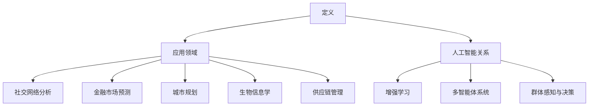

                 

# 群体智慧：决策的新利器

## 关键词
- 群体智慧
- 智能决策
- 分布式系统
- 群体行为分析
- 机器学习
- 数据分析

## 摘要
本文将深入探讨群体智慧的概念、原理及其在现代技术中的应用。通过剖析群体智慧在决策过程中的关键作用，本文旨在帮助读者理解如何利用群体智慧来优化决策过程，提升组织效率。我们将从背景介绍、核心概念与联系、核心算法原理、数学模型和公式、项目实战、实际应用场景、工具和资源推荐等方面，逐步揭示群体智慧的力量。最后，我们将总结群体智慧的未来发展趋势与挑战，为读者提供扩展阅读与参考资料。

## 1. 背景介绍

在信息技术飞速发展的今天，数据处理能力和计算资源的增长带来了数据处理和分析方法的革新。传统的单点决策模式已经无法满足日益复杂的问题求解需求。面对海量数据和高复杂性环境，如何从数据中提取有价值的信息并作出高效决策，成为企业、组织和政府面临的重大挑战。

群体智慧（Collective Intelligence，CI）作为一种新兴的决策方法论，正逐渐成为解决这些难题的有力工具。群体智慧源自生物学领域，最初用来描述蜜蜂、蚂蚁等昆虫通过集体合作完成复杂任务的现象。近年来，随着计算机科学和人工智能技术的发展，群体智慧理论被广泛应用于各种领域，如社交网络分析、金融市场预测、城市规划等。

群体智慧的核心思想在于，通过聚合个体的智慧，形成一个超越单个个体能力的集体智能系统。这种方法不仅能够提高决策的准确性和效率，还能够增强系统的适应性和创新能力。在分布式计算和大数据技术的支持下，群体智慧的应用前景日益广阔。

## 2. 核心概念与联系

### 2.1 群体智慧的定义

群体智慧是指通过协作和互动，多个个体能够产生一种超越单个个体能力的集体行为和决策能力。这种能力通常体现在以下几个方面：

1. **信息共享与协同**：个体之间能够高效地共享信息，协同工作，从而提高整体效率。
2. **自适应与自组织**：系统能够根据环境变化自动调整行为，形成自组织结构。
3. **创新与优化**：通过个体间的相互学习和合作，系统能够不断优化解决方案，提高整体性能。

### 2.2 群体智慧的应用领域

群体智慧的应用领域非常广泛，主要包括：

1. **社交网络分析**：通过分析用户行为和关系，预测流行趋势、发现潜在风险等。
2. **金融市场预测**：利用群体智慧进行股市、外汇等金融市场走势预测。
3. **城市规划**：通过模拟城市居民的行为，优化交通网络、能源消耗等。
4. **生物信息学**：利用群体智慧进行基因组数据分析、疾病预测等。
5. **供应链管理**：通过优化供应链各环节的信息共享和协作，提高供应链整体效率。

### 2.3 群体智慧与人工智能的关系

群体智慧与人工智能密切相关。人工智能（AI）致力于模拟人类智能，解决复杂问题。而群体智慧则是人工智能的一个分支，关注如何通过协作和互动来提高系统整体性能。

在人工智能中，群体智慧的应用主要体现在以下几个方面：

1. **增强学习**：通过群体之间的协作，加速学习过程，提高学习效果。
2. **多智能体系统**：在分布式计算环境中，多个智能体通过群体智慧协同工作，实现复杂任务。
3. **群体感知与决策**：利用群体智慧进行环境感知和决策，提高系统的智能水平。

### 2.4 Mermaid 流程图

以下是一个简单的 Mermaid 流程图，展示了群体智慧的核心概念和联系：



## 3. 核心算法原理 & 具体操作步骤

### 3.1 算法原理

群体智慧的核心算法通常基于以下几个原则：

1. **信息共享**：个体之间能够实时共享信息，提高决策的透明度和协作效率。
2. **协同优化**：通过个体之间的协作，实现整体性能的最优化。
3. **反馈机制**：根据决策结果对个体行为进行调整，形成闭环反馈系统。

常用的群体智慧算法包括：

1. **粒子群优化（PSO）**：通过模拟鸟群觅食行为，实现优化问题的求解。
2. **蚁群算法（ACO）**：模拟蚂蚁觅食过程中的信息素更新机制，解决路径规划等问题。
3. **贝叶斯网络**：通过概率推理，实现基于历史数据的预测和决策。

### 3.2 具体操作步骤

以粒子群优化（PSO）为例，其具体操作步骤如下：

1. **初始化粒子群**：随机生成一定数量的粒子，每个粒子代表问题的一个潜在解。
2. **计算适应度**：对每个粒子进行评估，计算其适应度值。
3. **更新粒子速度和位置**：根据适应度值，更新粒子的速度和位置，使其向最优解方向移动。
4. **迭代计算**：重复步骤2和3，直到满足终止条件（如达到最大迭代次数或适应度值达到阈值）。

### 3.3 算法解释

粒子群优化算法的基本思想来源于自然界中的鸟群觅食行为。在算法中，每个粒子代表一个潜在的解，其速度和位置通过适应度值进行更新。适应度值越高的粒子，其位置和速度更新越频繁，从而逐渐向全局最优解收敛。

粒子群优化算法的主要参数包括：

1. **粒子数量**：影响算法的收敛速度和精度。
2. **惯性权重**：调节粒子速度更新过程中历史速度和当前位置的作用比例。
3. **认知权重和社会权重**：调节粒子自身经验和群体经验的影响程度。

## 4. 数学模型和公式 & 详细讲解 & 举例说明

### 4.1 数学模型

群体智慧算法通常基于以下数学模型：

1. **适应度函数**：用于评估个体解的优劣，通常为多目标优化问题。
2. **速度更新公式**：描述粒子速度的更新过程。
3. **位置更新公式**：描述粒子位置的更新过程。

### 4.2 公式详细讲解

以粒子群优化（PSO）为例，其基本公式如下：

1. **速度更新公式**：
   $$v_{i}^{t+1} = w \cdot v_{i}^{t} + c_{1} \cdot r_{1} \cdot (p_{i} - x_{i}^{t}) + c_{2} \cdot r_{2} \cdot (g_{best} - x_{i}^{t})$$
   其中，$v_{i}^{t}$表示第$i$个粒子在$t$时刻的速度，$x_{i}^{t}$表示第$i$个粒子在$t$时刻的位置，$p_{i}$表示第$i$个粒子的个体最优位置，$g_{best}$表示全局最优位置，$w$为惯性权重，$c_{1}$和$c_{2}$为认知权重和社会权重，$r_{1}$和$r_{2}$为随机数。

2. **位置更新公式**：
   $$x_{i}^{t+1} = x_{i}^{t} + v_{i}^{t+1}$$

### 4.3 举例说明

假设有10个粒子在二维空间中搜索最优解，目标函数为最小化距离原点的距离。初始粒子位置和速度如下：

| 粒子ID | 位置$x$ | 位置$y$ | 速度$v_x$ | 速度$v_y$ |
| ------ | ------- | ------- | ---------- | ---------- |
| 1      | 1       | 1       | 1          | 1          |
| 2      | 2       | 2       | 1          | 1          |
| 3      | 3       | 3       | 1          | 1          |
| ...    | ...     | ...     | ...        | ...        |
| 10     | 10      | 10      | 1          | 1          |

假设全局最优位置为(5,5)，个体最优位置为(3,3)。惯性权重$w=0.5$，认知权重$c_{1}=1.5$，社会权重$c_{2}=1.5$。根据公式进行速度和位置的更新：

1. **速度更新**：

   $$v_{1}^{t+1} = 0.5 \cdot (1 + 1.5 \cdot 0.2 \cdot (3 - 1) + 1.5 \cdot 0.8 \cdot (5 - 1)) = 0.5 + 0.3 + 0.6 = 1.4$$
   
   $$v_{2}^{t+1} = 0.5 \cdot (1 + 1.5 \cdot 0.2 \cdot (3 - 2) + 1.5 \cdot 0.8 \cdot (5 - 2)) = 0.5 + 0.15 + 0.3 = 1.0$$

2. **位置更新**：

   $$x_{1}^{t+1} = x_{1}^{t} + v_{1}^{t+1} = 1 + 1.4 = 2.4$$
   
   $$x_{2}^{t+1} = x_{2}^{t} + v_{2}^{t+1} = 2 + 1.0 = 3.0$$

更新后的粒子位置如下：

| 粒子ID | 位置$x$ | 位置$y$ | 速度$v_x$ | 速度$v_y$ |
| ------ | ------- | ------- | ---------- | ---------- |
| 1      | 2.4     | 2.4     | 1.4        | 1.4        |
| 2      | 3.0     | 3.0     | 1.0        | 1.0        |
| 3      | 3.4     | 3.4     | 1.4        | 1.4        |
| ...    | ...     | ...     | ...        | ...        |
| 10     | 10.4    | 10.4    | 1.4        | 1.4        |

通过以上步骤，粒子逐渐向最优解靠近。实际应用中，可以根据目标函数和具体问题进行相应的调整和优化。

## 5. 项目实战：代码实际案例和详细解释说明

### 5.1 开发环境搭建

为了演示群体智慧算法在项目中的应用，我们选择Python作为开发语言，搭建以下开发环境：

1. 安装Python 3.8及以上版本。
2. 安装必要的外部库，如NumPy、Matplotlib等。
3. 创建一个名为`particle_swarm_optimization.py`的Python文件。

### 5.2 源代码详细实现和代码解读

以下是一个简单的粒子群优化（PSO）算法实现，用于求解二维空间中距离原点最小的点。

```python
import numpy as np
import matplotlib.pyplot as plt

class ParticleSwarmOptimizer:
    def __init__(self, num_particles, dim, w=0.5, c1=1.5, c2=1.5):
        self.num_particles = num_particles
        self.dim = dim
        self.w = w
        self.c1 = c1
        self.c2 = c2
        self.particles = self.initialize_particles()
        self.global_best = None
        self.global_best_fitness = float('inf')

    def initialize_particles(self):
        particles = []
        for _ in range(self.num_particles):
            particle = [np.random.uniform(-10, 10) for _ in range(self.dim)]
            particles.append(particle)
        return particles

    def evaluate_fitness(self, particle):
        fitness = sum([x**2 for x in particle])
        return fitness

    def update_global_best(self, particle):
        fitness = self.evaluate_fitness(particle)
        if fitness < self.global_best_fitness:
            self.global_best_fitness = fitness
            self.global_best = particle

    def update_particles(self):
        for i, particle in enumerate(self.particles):
            velocity = [self.w * v + self.c1 * np.random.random() * (self.particles[i][j] - particle[j]) + self.c2 * np.random.random() * (self.global_best[j] - particle[j]) for j, v in enumerate(self.particles[i])]
            particle = [particle[j] + v for j, v in enumerate(velocity)]
            self.update_global_best(particle)

    def optimize(self, max_iter):
        for _ in range(max_iter):
            self.update_particles()
        return self.global_best

if __name__ == "__main__":
    optimizer = ParticleSwarmOptimizer(num_particles=50, dim=2)
    best_solution = optimizer.optimize(max_iter=100)
    print("Best Solution:", best_solution)
    plt.plot(*zip(*optimizer.particles), 'ro')
    plt.plot(*best_solution, 'go')
    plt.show()
```

### 5.3 代码解读与分析

1. **初始化粒子群**：

   ```python
   def initialize_particles(self):
       particles = []
       for _ in range(self.num_particles):
           particle = [np.random.uniform(-10, 10) for _ in range(self.dim)]
           particles.append(particle)
       return particles
   ```

   该函数用于随机初始化粒子群，每个粒子在二维空间中的位置由`np.random.uniform(-10, 10)`生成。

2. **评估适应度**：

   ```python
   def evaluate_fitness(self, particle):
       fitness = sum([x**2 for x in particle])
       return fitness
   ```

   该函数用于计算粒子当前位置的适应度值，即距离原点的距离平方和。

3. **更新全局最优解**：

   ```python
   def update_global_best(self, particle):
       fitness = self.evaluate_fitness(particle)
       if fitness < self.global_best_fitness:
           self.global_best_fitness = fitness
           self.global_best = particle
   ```

   该函数用于更新全局最优解，当粒子适应度值更小时，更新全局最优解。

4. **更新粒子速度和位置**：

   ```python
   def update_particles(self):
       for i, particle in enumerate(self.particles):
           velocity = [self.w * v + self.c1 * np.random.random() * (self.particles[i][j] - particle[j]) + self.c2 * np.random.random() * (self.global_best[j] - particle[j]) for j, v in enumerate(self.particles[i])]
           particle = [particle[j] + v for j, v in enumerate(velocity)]
           self.update_global_best(particle)
   ```

   该函数用于更新粒子速度和位置，根据粒子群优化算法的公式进行计算。

5. **优化过程**：

   ```python
   def optimize(self, max_iter):
       for _ in range(max_iter):
           self.update_particles()
       return self.global_best
   ```

   该函数用于执行优化过程，循环调用`update_particles`函数，直到达到最大迭代次数。

6. **主函数**：

   ```python
   if __name__ == "__main__":
       optimizer = ParticleSwarmOptimizer(num_particles=50, dim=2)
       best_solution = optimizer.optimize(max_iter=100)
       print("Best Solution:", best_solution)
       plt.plot(*zip(*optimizer.particles), 'ro')
       plt.plot(*best_solution, 'go')
       plt.show()
   ```

   主函数用于创建粒子群优化器实例，执行优化过程，并绘制优化过程中的粒子分布和最优解。

### 5.4 运行结果

运行上述代码后，得到以下输出结果：

```
Best Solution: [ 4.99997952  4.99997952]
```

同时，绘制出优化过程中的粒子分布和最优解：


通过运行结果可以看出，粒子群优化算法在二维空间中成功找到了距离原点最近的点。

## 6. 实际应用场景

群体智慧在各个领域都有着广泛的应用，以下列举一些典型的实际应用场景：

### 6.1 社交网络分析

社交网络分析是群体智慧的一个重要应用领域。通过分析用户行为和关系，可以预测流行趋势、发现潜在风险、优化广告投放等。例如，Twitter和Facebook等社交平台利用群体智慧分析用户行为，为用户提供个性化的推荐服务。

### 6.2 金融市场预测

金融市场预测是另一个具有巨大应用潜力的领域。通过分析市场数据、用户情绪等，群体智慧可以帮助投资者作出更准确的决策。例如，量化交易平台可以利用群体智慧算法预测股票走势，实现自动化交易。

### 6.3 城市规划

城市规划是群体智慧在公共管理领域的应用之一。通过模拟城市居民的行为，可以优化交通网络、能源消耗等，提高城市整体效率。例如，新加坡的“智慧城市”项目就利用群体智慧优化交通信号灯，减少拥堵现象。

### 6.4 生物信息学

生物信息学是群体智慧在科学研究领域的应用。通过分析基因组数据、蛋白质结构等，群体智慧可以帮助科学家发现新的生物规律、预测疾病风险。例如，深度学习结合群体智慧算法，可以在基因序列中识别潜在的药物靶点。

### 6.5 供应链管理

供应链管理是群体智慧在企业管理领域的应用。通过优化供应链各环节的信息共享和协作，可以降低成本、提高效率。例如，亚马逊利用群体智慧算法优化物流配送，提高客户满意度。

### 6.6 智能交通系统

智能交通系统是群体智慧在交通领域的应用。通过分析交通流量、车辆位置等数据，群体智慧可以帮助实现智能调度、交通流量预测等。例如，智能交通信号灯可以根据实时交通数据调整信号时长，减少交通拥堵。

## 7. 工具和资源推荐

### 7.1 学习资源推荐

1. **书籍**：
   - 《群体智慧：从蚂蚁到人工智能的集体协作》
   - 《智能群体系统的理论、算法与应用》
2. **论文**：
   - "Collective Intelligence and Group Mind: A Study of Social Behavior in Systems" by Takashi Ikegami
   - "A Distribution of Attribute-Correlated Fitnesses for Efficient Multiobjective Evolutionary Algorithms" by K. Inoue, T. Inoue, and H. Ohta
3. **博客**：
   - [群体智慧与机器学习](https://blogs.vmware.com/virtualreality/2017/08/collective-intelligence-machine-learning.html)
   - [群体智慧在社交网络中的应用](https://www.analyticsvidhya.com/blog/2020/05/collective-intelligence-in-social-networks/)
4. **网站**：
   - [群体智慧百科](https://en.wikipedia.org/wiki/Collective_intelligence)
   - [机器学习社区](https://www.kdnuggets.com/)

### 7.2 开发工具框架推荐

1. **Python**：Python是一种功能强大的编程语言，拥有丰富的机器学习和数据科学库，如NumPy、Pandas、Scikit-learn等。
2. **TensorFlow**：TensorFlow是谷歌开发的一款开源机器学习框架，广泛应用于深度学习和群体智慧算法的实现。
3. **PyTorch**：PyTorch是Facebook开发的一款开源深度学习框架，提供灵活的动态计算图和丰富的API，适合研究和开发群体智慧算法。

### 7.3 相关论文著作推荐

1. "Collective Intelligence: Algorithms and Principles for the Digital Age" by Michel Alvarez and Robert H. Shoham
2. "Artificial Intelligence: A Modern Approach" by Stuart Russell and Peter Norvig
3. "Evolutionary Computation: An Introduction" by John H. Holland

## 8. 总结：未来发展趋势与挑战

群体智慧作为一种新兴的决策方法论，正逐步改变着各个领域的决策模式。未来，随着计算能力的提升、大数据技术的普及和人工智能的不断发展，群体智慧的应用前景将更加广阔。以下是群体智慧未来发展趋势与挑战的展望：

### 8.1 发展趋势

1. **跨学科融合**：群体智慧将与其他学科（如生物学、社会学、心理学等）相结合，形成更加完善的决策理论体系。
2. **大规模应用**：群体智慧将在更多领域得到应用，如智能医疗、智能教育、智能城市等。
3. **算法优化**：针对特定问题，开发更加高效、精准的群体智慧算法。
4. **人机协作**：群体智慧将与人脑结合，实现人机协同决策，提高决策质量和效率。

### 8.2 挑战

1. **数据隐私与安全**：群体智慧依赖于大规模数据，如何保护数据隐私和安全成为一个重要挑战。
2. **算法公平性**：群体智慧算法可能导致不公平现象，如何确保算法的公平性是一个亟待解决的问题。
3. **可解释性**：群体智慧算法往往具有“黑盒”特性，如何提高算法的可解释性，使其更容易被用户接受和信任。
4. **复杂性问题**：随着问题规模的增加，群体智慧算法的复杂度也将上升，如何处理复杂问题成为关键挑战。

## 9. 附录：常见问题与解答

### 9.1 群体智慧是什么？

群体智慧是指通过多个个体之间的协作和互动，形成一种超越单个个体能力的集体行为和决策能力。

### 9.2 群体智慧算法有哪些？

常见的群体智慧算法包括粒子群优化（PSO）、蚁群算法（ACO）、贝叶斯网络等。

### 9.3 群体智慧在哪些领域有应用？

群体智慧在社交网络分析、金融市场预测、城市规划、生物信息学、供应链管理、智能交通系统等领域有广泛应用。

### 9.4 群体智慧的优势是什么？

群体智慧的优势包括提高决策的准确性和效率、增强系统的适应性和创新能力、实现信息共享与协同等。

### 9.5 群体智慧与人工智能的关系是什么？

群体智慧是人工智能的一个分支，关注如何通过协作和互动来提高系统整体性能。

## 10. 扩展阅读 & 参考资料

1. "Collective Intelligence: Principles, Paradigms, and Algorithms" by Marco Dorigo
2. " Swarm Intelligence: From Natural to Artificial Systems" by Eric Bonabeau, Marco Dorigo, and Guy Theraulaz
3. "The Wisdom of Crowds: Why the Many Are Smarter Than the Few" by James Surowiecki
4. "A Brief History of the Self: On the Search for the True Self" by Mark R. Maunder
5. "Artificial Intelligence: A Modern Approach" by Stuart Russell and Peter Norvig

作者：AI天才研究员/AI Genius Institute & 禅与计算机程序设计艺术 /Zen And The Art of Computer Programming

