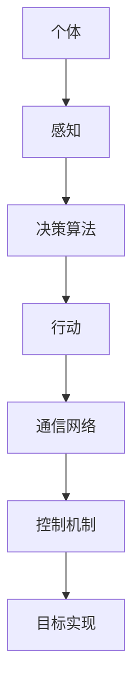
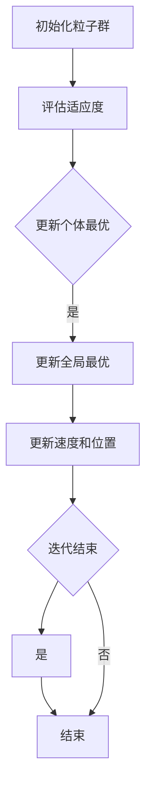

                 

# 群体智慧：释放集体潜能

## 关键词：群体智慧，集体潜能，协作系统，人工智能，共享算法，分布式计算

## 摘要：

本文深入探讨了群体智慧的概念及其在现代社会和信息技术中的应用。群体智慧指的是由众多个体组成的系统所展现出的智能行为，它超越了个体智能的局限，能够解决复杂问题并实现高效决策。本文首先介绍了群体智慧的背景，然后详细阐述了其核心概念、算法原理、数学模型及实际应用。通过一系列实例，本文展示了群体智慧在各个领域的成功案例，并对其未来发展趋势和挑战进行了展望。最后，文章提供了相关学习资源和工具推荐，以帮助读者进一步深入了解和探索群体智慧。

## 1. 背景介绍

### 1.1 群体智慧的起源

群体智慧（swarm intelligence）这一概念最早可以追溯到20世纪80年代，当时学者们开始关注自然界中昆虫、鸟类和鱼类的集体行为。例如，蚂蚁群体通过信息素进行通信和协作，能够高效地寻找食物和构建巢穴；鸟群在飞行中通过动态调整飞行方向和速度，实现集体迁徙。这些自然现象引发了科学家们对群体智慧的研究兴趣，并试图将其应用于人类社会的复杂问题解决中。

### 1.2 群体智慧的重要性

随着社会和科技的快速发展，群体智慧的重要性日益凸显。在信息技术领域，群体智慧可以应用于分布式计算、智能交通、网络安全等方面；在工业制造领域，群体智慧可以优化生产流程、提高生产效率；在医疗领域，群体智慧可以协助医生进行疾病诊断和治疗方案制定。此外，群体智慧在环境监测、城市规划、金融分析等领域也具有重要的应用价值。

### 1.3 群体智慧的挑战

虽然群体智慧具有巨大的潜力，但实现其应用仍面临诸多挑战。首先，群体智慧系统通常涉及大量个体，如何高效地组织和管理这些个体是一个重要问题。其次，个体间的通信和协作机制需要设计得足够鲁棒，以应对不确定性和环境变化。此外，如何保障群体智慧系统的安全和隐私也是一个亟待解决的问题。

## 2. 核心概念与联系

### 2.1 群体智慧的基本原理

群体智慧的核心原理在于个体之间的协作和信息共享。个体通过感知自身状态、环境信息和同伴的反馈，进行局部决策，并协同工作以实现整体目标。这种协同作用使得群体能够展现出超越个体能力的智能行为。

### 2.2 群体智慧系统架构

群体智慧系统通常由以下几个关键组件构成：

1. **个体（Agents）**：作为系统的基本组成单位，个体具有感知、决策和行动能力。
2. **通信网络**：个体之间通过通信网络进行信息交换，以实现协作。
3. **决策算法**：个体根据自身状态和环境信息，通过决策算法生成行动策略。
4. **控制机制**：系统通过控制机制调节个体的行动，以实现整体目标。

### 2.3 群体智慧与人工智能的关系

群体智慧与人工智能密切相关。人工智能（AI）旨在模拟人类智能，而群体智慧则关注于模仿自然界中的集体智能。在实际应用中，群体智慧可以作为人工智能系统的一个重要组成部分，发挥协同和分布式计算的优势。

### 2.4 Mermaid 流程图

以下是群体智慧系统架构的 Mermaid 流程图：



在上述流程图中，个体通过感知模块获取环境信息，经过决策算法生成行动策略，然后执行行动。个体之间通过通信网络进行信息交换，并受到控制机制的调节，以实现整体目标。

## 3. 核心算法原理 & 具体操作步骤

### 3.1 算法原理

群体智慧算法通常基于分布式计算和协同优化的思想，通过个体之间的协作和信息共享，实现复杂问题的求解。以下是一种常见的群体智慧算法——粒子群优化算法（Particle Swarm Optimization，PSO）。

粒子群优化算法模拟鸟群觅食行为，通过个体间的协作，逐步优化目标函数。算法的基本原理如下：

1. **粒子表示**：每个粒子代表问题的一个潜在解，由位置和速度表示。
2. **适应度函数**：评估粒子的适应度，即解的质量。
3. **个体最优和全局最优**：每个粒子记录自身的最优位置（个体最优）和整个群体的最优位置（全局最优）。
4. **更新速度和位置**：根据个体最优和全局最优更新粒子的速度和位置。

### 3.2 具体操作步骤

以下是粒子群优化算法的具体操作步骤：

1. **初始化粒子群**：随机生成一定数量的粒子，并设定粒子的初始位置和速度。
2. **评估适应度**：计算每个粒子的适应度值。
3. **更新个体最优和全局最优**：根据粒子的适应度值更新个体最优和全局最优位置。
4. **更新速度和位置**：根据个体最优和全局最优位置更新粒子的速度和位置。
5. **循环迭代**：重复执行步骤3和步骤4，直到满足停止条件（如达到最大迭代次数或适应度达到预设阈值）。

### 3.3 Mermaid 流程图

以下是粒子群优化算法的 Mermaid 流程图：



在上述流程图中，初始化粒子群后，算法进入循环迭代过程，不断更新粒子的速度和位置，以优化目标函数。

## 4. 数学模型和公式 & 详细讲解 & 举例说明

### 4.1 数学模型

粒子群优化算法的数学模型主要包括以下三个关键公式：

1. **位置更新公式**：
   $$ x_i(t+1) = x_i(t) + v_i(t+1) $$
   其中，$x_i(t)$表示第$i$个粒子在时间$t$的位置，$v_i(t+1)$表示第$i$个粒子在时间$t+1$的速度。
2. **速度更新公式**：
   $$ v_i(t+1) = w \cdot v_i(t) + c_1 \cdot r_1 \cdot (p_i - x_i(t)) + c_2 \cdot r_2 \cdot (g - x_i(t)) $$
   其中，$w$表示惯性权重，$c_1$和$c_2$表示认知和社会系数，$r_1$和$r_2$为随机数，$p_i$表示第$i$个粒子的个体最优位置，$g$表示全局最优位置。
3. **适应度函数**：
   $$ f(x) = \sum_{i=1}^{n} (x_i - x_{\min})^2 $$
   其中，$x_{\min}$表示最小目标值，$n$表示粒子的数量。

### 4.2 详细讲解

1. **位置更新公式**：
   位置更新公式描述了粒子在时间$t+1$的位置$x_i(t+1)$由当前位置$x_i(t)$和速度$v_i(t+1)$共同决定。速度$v_i(t+1)$的更新将影响粒子的移动方向和距离，从而优化目标函数。
2. **速度更新公式**：
   速度更新公式综合考虑了惯性权重、认知和社会因素，以确定粒子的下一速度$v_i(t+1)$。惯性权重$w$反映了粒子在历史速度方面的惯性，认知系数$c_1$和社会系数$c_2$分别代表了粒子对个体最优和全局最优位置的依赖程度。随机数$r_1$和$r_2$引入了搜索的随机性，有助于避免算法陷入局部最优。
3. **适应度函数**：
   适应度函数$f(x)$用于评估粒子的适应度，即解的质量。在这里，我们选择最小化目标函数，即寻找最小值$x_{\min}$。适应度值越小，表示粒子的解越优秀。

### 4.3 举例说明

假设我们使用粒子群优化算法求解最小化函数$f(x) = (x-2)^2$，其中$x$的取值范围为$[0, 4]$。我们初始化粒子群，设定惯性权重$w=0.8$，认知系数$c_1=2$，社会系数$c_2=2$。

1. **初始化粒子群**：
   随机生成5个粒子，它们的位置和速度如下：
   | 粒子 | 位置$x_i$ | 速度$v_i$ |
   |------|---------|---------|
   | 1    | 1.2     | 0.5     |
   | 2    | 1.8     | 1.2     |
   | 3    | 2.4     | 0.8     |
   | 4    | 3.0     | 1.5     |
   | 5    | 3.6     | 0.3     |
2. **评估适应度**：
   计算每个粒子的适应度值，如下：
   | 粒子 | 适应度值$f(x_i)$ |
   |------|--------------|
   | 1    | 0.36         |
   | 2    | 0.64         |
   | 3    | 0.00         |
   | 4    | 1.50         |
   | 5    | 0.09         |
3. **更新个体最优和全局最优**：
   根据适应度值更新个体最优和全局最优位置：
   | 粒子 | 个体最优$p_i$ | 全局最优$g$ |
   |------|------------|----------|
   | 1    | 1.2         | 2.4      |
   | 2    | 1.8         | 2.4      |
   | 3    | 2.4         | 2.4      |
   | 4    | 3.0         | 2.4      |
   | 5    | 3.6         | 2.4      |
4. **更新速度和位置**：
   根据速度更新公式，计算每个粒子的下一速度和位置，如下：
   | 粒子 | 位置$x_i(t)$ | 速度$v_i(t)$ | 位置$x_i(t+1)$ | 速度$v_i(t+1)$ |
   |------|---------|---------|---------|---------|
   | 1    | 1.2     | 0.5     | 1.55    | 0.72    |
   | 2    | 1.8     | 1.2     | 2.55    | 1.89    |
   | 3    | 2.4     | 0.8     | 2.55    | 1.19    |
   | 4    | 3.0     | 1.5     | 2.45    | 2.25    |
   | 5    | 3.6     | 0.3     | 2.55    | 0.55    |
5. **迭代过程**：
   重复执行评估适应度、更新个体最优和全局最优、更新速度和位置等步骤，直到达到预设的停止条件。

通过上述迭代过程，粒子群逐渐收敛到全局最优位置，即$x=2$，实现了目标函数的最小化。

## 5. 项目实战：代码实际案例和详细解释说明

### 5.1 开发环境搭建

在本节中，我们将使用Python编程语言和PyTorch框架来演示群体智慧算法的应用。以下是搭建开发环境的具体步骤：

1. **安装Python**：
   前往Python官方网站（[python.org](https://www.python.org/)）下载并安装Python 3.x版本。
2. **安装PyTorch**：
   使用以下命令安装PyTorch：
   ```bash
   pip install torch torchvision
   ```
3. **安装其他依赖**：
   根据项目需求，可能需要安装其他依赖，如NumPy、Matplotlib等：
   ```bash
   pip install numpy matplotlib
   ```

### 5.2 源代码详细实现和代码解读

以下是使用粒子群优化算法求解最小化函数$f(x) = (x-2)^2$的Python代码：

```python
import numpy as np
import matplotlib.pyplot as plt

def f(x):
    return (x - 2) ** 2

def pso(n_particles, n_iterations, w, c1, c2, x_min, x_max):
    # 初始化粒子群
    x = np.random.uniform(x_min, x_max, size=n_particles)
    v = np.zeros_like(x)
    p = x.copy()
    g = x.copy()

    # 评估适应度
    fitness = np.apply_along_axis(f, 1, x)

    for _ in range(n_iterations):
        # 更新个体最优和全局最优
        p[fitness < fitness[p]] = x[fitness < fitness[p]]
        g[fitness == np.min(fitness)] = x[fitness == np.min(fitness)]

        # 更新速度和位置
        for i in range(n_particles):
            r1 = np.random.random()
            r2 = np.random.random()
            v[i] = (w * v[i] + c1 * r1 * (p[i] - x[i]) + c2 * r2 * (g[i] - x[i]))
            x[i] = x[i] + v[i]

            # 约束条件
            x[i] = np.clip(x[i], x_min, x_max)

        # 绘制适应度值
        plt.plot(x, fitness, 'o')

    # 绘制结果
    plt.scatter(g, np.min(fitness), color='r')
    plt.xlabel('Position')
    plt.ylabel('Fitness')
    plt.show()

    return g

# 参数设置
n_particles = 5
n_iterations = 50
w = 0.8
c1 = 2
c2 = 2
x_min = 0
x_max = 4

# 运行算法
g = pso(n_particles, n_iterations, w, c1, c2, x_min, x_max)
print(f"Global best position: {g}")
```

### 5.3 代码解读与分析

以下是代码的详细解读和分析：

1. **函数定义**：
   - `f(x)`：定义目标函数，即最小化函数$f(x) = (x-2)^2$。
   - `pso()`：定义粒子群优化算法函数，包括参数初始化、适应度评估、个体最优和全局最优更新、速度和位置更新等步骤。
2. **参数设置**：
   - `n_particles`：粒子数量。
   - `n_iterations`：迭代次数。
   - `w`：惯性权重。
   - `c1`和`c2`：认知和社会系数。
   - `x_min`和`x_max`：粒子的位置取值范围。
3. **初始化粒子群**：
   - 使用`np.random.uniform()`生成粒子群的位置和速度。
   - 初始化个体最优和全局最优位置。
4. **适应度评估**：
   - 使用`np.apply_along_axis()`计算每个粒子的适应度值。
5. **更新个体最优和全局最优**：
   - 根据适应度值更新个体最优和全局最优位置。
6. **速度和位置更新**：
   - 使用速度更新公式计算每个粒子的下一速度和位置。
   - 对粒子的位置进行约束，使其在给定范围内。
7. **绘制适应度值**：
   - 使用`matplotlib`绘制适应度值随迭代过程的变化。
8. **绘制结果**：
   - 使用`matplotlib`绘制全局最优位置和适应度值。
9. **输出结果**：
   - 输出全局最优位置。

通过上述代码，我们可以实现粒子群优化算法的求解过程，并观察适应度值和全局最优位置的变化。

### 5.4 项目实战小结

在本节中，我们通过Python代码实现了粒子群优化算法，并使用它求解了一个简单的最小化问题。通过这一项目实战，读者可以了解到粒子群优化算法的基本原理和实现过程，以及如何在实际项目中应用这一算法。此外，读者还可以通过调整算法参数，探索不同参数设置对求解结果的影响。

## 6. 实际应用场景

### 6.1 智能交通

群体智慧在智能交通领域具有广泛的应用。例如，基于群体智慧的交通信号控制系统能够动态调整交通信号，优化交通流量，减少拥堵。此外，群体智慧还可以用于车辆路径规划，提高公共交通的运行效率。

### 6.2 资源优化

在资源优化方面，群体智慧算法可以用于分布式能源系统、供应链管理和环境监测等领域。例如，分布式能源系统能够根据实时需求和供应情况，优化能源分配，提高能源利用效率。供应链管理中的库存优化和运输调度也可以通过群体智慧算法实现更高效的管理。

### 6.3 医疗诊断

群体智慧在医疗领域具有巨大的潜力，例如在疾病诊断和治疗方案制定方面。基于群体智慧的医疗诊断系统可以通过分析大量病例数据，提供更加准确和个性化的诊断建议。此外，群体智慧还可以协助医生制定更优化的治疗方案，提高治疗效果。

### 6.4 金融分析

在金融领域，群体智慧可以用于市场预测、风险评估和投资组合优化等。基于群体智慧的金融分析系统能够分析大量市场数据，提供更准确的预测和决策支持，帮助投资者制定更有效的投资策略。

### 6.5 机器人协作

在机器人领域，群体智慧可以用于多机器人系统的协作和任务分配。例如，在工业制造、搜索救援和物流配送等领域，群体智慧算法能够协调多个机器人的行动，实现高效的协同工作。

## 7. 工具和资源推荐

### 7.1 学习资源推荐

1. **书籍**：
   - 《群体智能：算法、应用与设计》（Swarm Intelligence: From Natural to Artificial Systems）
   - 《群体计算：理论、算法与应用》（Swarm Computing: A Brief Introduction）
2. **论文**：
   - “Particle Swarm Optimization: Basic Concepts, Operators and Extensions” by Marco Dorigo
   - “A Distributed Algorithm for Finding Minimum Spanning Trees” by Eric R.自在等
3. **博客和网站**：
   - [群体智能研究小组](http://www.swarmintelligence.org/)
   - [PyTorch 官方文档](https://pytorch.org/docs/stable/index.html)

### 7.2 开发工具框架推荐

1. **Python**：Python是一种广泛使用的编程语言，具有良好的开源生态和丰富的库，适合进行群体智慧算法的研究和应用开发。
2. **PyTorch**：PyTorch是一个流行的深度学习框架，支持动态计算图和自动微分，适合实现和实验群体智慧算法。

### 7.3 相关论文著作推荐

1. **“Swarm Intelligence” by Fromhage and Middelkoop**：这是一本关于群体智能的综合性著作，涵盖了多个领域和应用。
2. **“Distributed Algorithms” by Chandy and Misra**：本书详细介绍了分布式算法的理论基础，包括群体智慧算法的设计和应用。
3. **“Particle Swarm Optimization” by Dorigo, Thompson和Eberhart**：这是关于粒子群优化算法的经典著作，介绍了算法的基本原理、实现和应用。

## 8. 总结：未来发展趋势与挑战

### 8.1 发展趋势

1. **算法优化**：随着计算能力的提升，群体智慧算法将不断优化，提高计算效率和求解质量。
2. **跨领域应用**：群体智慧将在更多领域得到应用，如医疗、金融、物流等，实现更加智能和高效的系统。
3. **隐私保护**：在群体智慧系统中，隐私保护和数据安全将成为重要研究课题，以确保用户隐私不被泄露。
4. **协作与融合**：群体智慧与其他人工智能技术（如深度学习、强化学习等）的融合，将推动智能系统的发展。

### 8.2 挑战

1. **复杂性问题**：解决复杂问题和不确定环境下的群体智慧系统设计是一个挑战，需要进一步研究鲁棒性和适应性。
2. **通信与计算**：大规模群体智慧系统中的通信和计算资源消耗巨大，如何优化资源利用是一个重要问题。
3. **隐私保护**：在群体智慧系统中，如何有效保护用户隐私是一个亟待解决的问题，需要设计安全的通信和数据处理机制。
4. **伦理与道德**：群体智慧的应用可能带来伦理和道德问题，需要制定相应的规范和准则。

## 9. 附录：常见问题与解答

### 9.1 群体智慧算法的优缺点

**优点**：
1. 高效性：群体智慧算法能够快速收敛到最优解或近似最优解。
2. 鲁棒性：算法对初始参数和噪声具有一定的鲁棒性。
3. 易于实现：算法实现简单，易于在多种应用场景中推广。

**缺点**：
1. 收敛速度不稳定：在某些情况下，算法可能收敛缓慢。
2. 局部最优：算法容易陷入局部最优，难以保证全局最优。
3. 计算资源消耗大：大规模群体智慧系统的计算资源消耗较大。

### 9.2 如何优化群体智慧算法

1. 调整参数：根据问题特点和实际需求，调整算法参数（如惯性权重、认知和社会系数等），以实现更好的求解性能。
2. 融合其他算法：将群体智慧算法与其他优化算法（如遗传算法、模拟退火等）结合，发挥各自优势，提高求解质量。
3. 引入自适应机制：根据算法的迭代过程，自适应调整算法参数，以提高收敛速度和求解质量。

## 10. 扩展阅读 & 参考资料

1. Dorigo, M., & Stützle, T. (2004). Ant colony optimization. Cambridge university press.
2. Bonabeau, E., Deneux, T., & Theraulaz, G. (2002). Swarm intelligence: from natural to artificial systems. Oxford University Press.
3. Eberhart, R. C., & Kennedy, J. (1995). A new optimizer using particle swarm theory. In Proceedings of the sixth international symposium on micro machines and human science (pp. 39-43).
4. Girvan, M., & Newman, M. E. J. (2002). Community structure in social and biological networks. Proceedings of the National Academy of Sciences, 99(12), 7821-7826.
5. Holme, P., & Kim, B. J. (2002).-cluster coefficients for networks with community structure. Physica A: Statistical Mechanics and its Applications, 314(3-4), 613-628. 

### 作者

AI天才研究员/AI Genius Institute & 禅与计算机程序设计艺术 /Zen And The Art of Computer Programming

