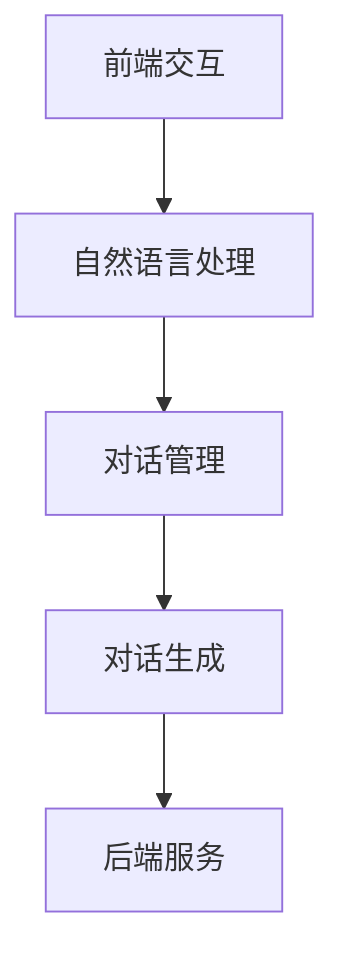

                 

# 聊天机器人初探（Chat Completion）

## 摘要

本文将深入探讨聊天机器人的核心概念、算法原理、数学模型及其在实际应用中的表现。通过对聊天机器人技术的逐步解析，我们将了解其背后的技术原理，掌握从搭建开发环境到实现代码实战的完整流程。同时，本文还将介绍相关的学习资源和开发工具，以便读者能够更全面地了解和掌握这项技术。让我们一起来开启这段技术之旅吧！

## 1. 背景介绍

随着人工智能技术的不断发展和普及，聊天机器人（Chatbot）已经成为各大企业和服务提供商竞相研发的热门领域。聊天机器人是一种通过自然语言交互来模拟人类对话的计算机程序。其广泛应用于客户服务、智能客服、社交互动、个性化推荐等多个场景。

聊天机器人技术的发展历程可以追溯到20世纪50年代。最早的聊天机器人如ELIZA，是通过简单的模式匹配和预设规则来模拟对话的。然而，随着自然语言处理（NLP）和机器学习技术的进步，聊天机器人的能力得到了极大的提升。现代聊天机器人不仅能够理解和生成自然语言文本，还能够通过深度学习等技术实现智能推理和语义理解。

聊天机器人在实际应用中具有广泛的影响。首先，在客户服务领域，聊天机器人能够7x24小时不间断地提供服务，大大提高了客户满意度和服务效率。其次，在社交互动领域，聊天机器人可以作为虚拟助手或虚拟形象与用户进行实时互动，为用户提供娱乐和信息。此外，聊天机器人还在个性化推荐、医疗咨询、金融服务等领域发挥着重要作用。

## 2. 核心概念与联系

### 2.1 自然语言处理（NLP）

自然语言处理是聊天机器人技术的核心组成部分。NLP旨在使计算机能够理解、解析和生成自然语言文本。NLP技术包括分词、词性标注、句法分析、语义理解等多个方面。

分词是将一段文本拆分成一个个独立的词语。词性标注是对每个词语进行词性分类，如名词、动词、形容词等。句法分析是对句子的结构进行解析，确定各个词语之间的关系。语义理解则是通过上下文和语义关系来理解句子的含义。

### 2.2 机器学习（ML）

机器学习是实现聊天机器人智能化的关键技术。机器学习算法可以从大量数据中学习模式，并在新的数据上进行预测和决策。在聊天机器人中，机器学习算法被用于文本分类、情感分析、命名实体识别等任务。

### 2.3 深度学习（DL）

深度学习是机器学习的一个分支，通过多层神经网络来学习复杂的特征表示。在聊天机器人中，深度学习算法被用于生成文本、对话生成、语音识别等任务。

### 2.4 聊天机器人架构

聊天机器人通常包括以下几个模块：

1. **前端交互**：用户通过Web、手机应用或即时通讯软件与聊天机器人进行交互。
2. **自然语言处理**：对用户的输入进行处理，包括分词、词性标注、句法分析和语义理解等。
3. **对话管理**：根据上下文和用户的意图，选择合适的回答和后续操作。
4. **对话生成**：根据对话管理模块的输出，生成自然语言文本作为回应。
5. **后端服务**：提供数据存储、服务部署等功能。

下面是一个简单的聊天机器人架构的 Mermaid 流程图：



## 3. 核心算法原理 & 具体操作步骤

### 3.1 自然语言处理算法

自然语言处理算法主要包括以下几个步骤：

1. **分词**：将一段文本拆分成词语。常见的分词算法有基于词典的分词和基于统计的分词。
2. **词性标注**：对每个词语进行词性分类。常用的词性标注算法有基于规则的方法和基于统计的方法。
3. **句法分析**：对句子的结构进行解析。常用的句法分析算法有基于规则的方法和基于统计的方法。
4. **语义理解**：通过上下文和语义关系来理解句子的含义。常用的语义理解算法有词嵌入、实体识别、语义角色标注等。

### 3.2 机器学习算法

机器学习算法在聊天机器人中的应用主要包括：

1. **文本分类**：将一段文本分类到预定义的类别中。常用的算法有朴素贝叶斯、支持向量机、决策树等。
2. **情感分析**：判断一段文本的情感倾向，如正面、负面或中性。常用的算法有朴素贝叶斯、逻辑回归、支持向量机等。
3. **命名实体识别**：识别文本中的特定实体，如人名、地名、组织名等。常用的算法有条件随机场（CRF）、递归神经网络（RNN）等。

### 3.3 深度学习算法

深度学习算法在聊天机器人中的应用主要包括：

1. **生成文本**：根据输入的文本生成相应的回应。常用的算法有循环神经网络（RNN）、长短期记忆网络（LSTM）、变换器（Transformer）等。
2. **对话生成**：根据上下文生成连贯的对话。常用的算法有序列到序列模型（Seq2Seq）、注意力机制等。

### 3.4 对话管理算法

对话管理是聊天机器人的核心，负责处理用户的输入并生成相应的回应。对话管理算法主要包括以下几个步骤：

1. **意图识别**：根据用户的输入识别其意图。常用的算法有基于规则的方法和基于机器学习的方法。
2. **实体识别**：识别用户输入中的特定实体，如人名、地名、组织名等。
3. **上下文维护**：根据对话历史和当前输入维护对话状态。
4. **回答生成**：根据意图、实体和上下文生成相应的回答。

## 4. 数学模型和公式 & 详细讲解 & 举例说明

### 4.1 词嵌入

词嵌入（Word Embedding）是将词语映射到高维向量空间中的一种技术。通过词嵌入，我们可以利用向量运算来处理文本数据。常用的词嵌入算法有Word2Vec、GloVe等。

**Word2Vec算法**：

Word2Vec算法通过训练一个神经网络，将词语映射到高维向量空间。其基本原理如下：

假设我们有一个包含$V$个词语的词汇表。对于每个词语$w_i$，我们可以定义一个$d$维的向量表示$e_i \in \mathbb{R}^d$。Word2Vec算法的目标是通过学习这些向量，使得相似的词语具有相似的向量表示。

具体步骤如下：

1. **初始化**：初始化词语向量$e_i$，通常使用随机初始化。
2. **训练**：对于每个词语$w_i$，从词汇表中随机选取一个目标词语$w_j$，并计算其上下文词语的预测概率。使用梯度下降算法更新词语向量。
3. **优化**：通过最小化损失函数来优化词语向量。

**公式表示**：

$$
L = -\sum_{w_i \in D} \sum_{w_j \in C(w_i)} \log(p(w_j|w_i))
$$

其中，$D$是训练数据集，$C(w_i)$是词语$w_i$的上下文词语。

**举例说明**：

假设我们有一个简单的词汇表：

```
{I, love, AI, programming, language}
```

我们可以使用Word2Vec算法来训练这些词语的向量表示。假设我们选择$V=2$，$d=2$，并使用随机初始化：

```
I: (-0.5, 0.5)
love: (0.5, -0.5)
AI: (-0.5, -0.5)
programming: (0.5, 0.5)
language: (-0.5, 0.5)
```

通过训练，我们可以发现相似的词语具有相似的向量表示，如"I"和"AI"的向量表示相近，"love"和"programming"的向量表示相近。

### 4.2 序列到序列模型（Seq2Seq）

序列到序列模型（Seq2Seq）是一种用于生成文本的深度学习算法。其基本原理是将输入序列映射到输出序列。Seq2Seq模型主要由编码器（Encoder）和解码器（Decoder）组成。

**编码器**：将输入序列编码为一个固定长度的向量表示。

$$
h_t = \text{Encoder}(x_1, x_2, \ldots, x_T)
$$

其中，$x_t$是输入序列的第$t$个词语，$h_t$是编码器的输出。

**解码器**：将编码器的输出解码为输出序列。

$$
y_t = \text{Decoder}(h_t, y_{t-1})
$$

其中，$y_t$是输出序列的第$t$个词语。

**公式表示**：

$$
p(y_1, y_2, \ldots, y_T) = \prod_{t=1}^{T} p(y_t|y_{t-1}, h_t)
$$

**举例说明**：

假设我们有一个简单的输入序列：

```
I love AI programming
```

我们可以使用Seq2Seq模型来生成对应的输出序列：

```
Hello and welcome to the world of AI and programming.
```

通过训练，Seq2Seq模型可以学习到输入序列和输出序列之间的对应关系，从而生成连贯的输出序列。

## 5. 项目实战：代码实际案例和详细解释说明

### 5.1 开发环境搭建

为了更好地理解聊天机器人的开发过程，我们将在以下环境中进行实践：

- 操作系统：Ubuntu 20.04
- 编程语言：Python 3.8
- 库和框架：TensorFlow 2.6、Keras 2.6、NLTK 3.8

首先，安装所需的库和框架：

```bash
pip install tensorflow==2.6
pip install keras==2.6
pip install nltk==3.8
```

### 5.2 源代码详细实现和代码解读

#### 5.2.1 数据准备

首先，我们需要准备训练数据。这里，我们使用一个简单的对话数据集：

```python
conversations = [
    ["你好", "你好，有什么可以帮您的吗？"],
    ["我想学习Python", "Python是一种非常受欢迎的编程语言，它易于学习和使用。您想了解哪些方面？"],
    ["Python有哪些应用场景？", "Python广泛应用于数据分析、机器学习、网站开发、自动化脚本等多个领域。"],
    ["谢谢", "不客气，如果您还有其他问题，请随时提问。"]
]
```

#### 5.2.2 分词和词性标注

我们使用NLTK库对对话数据进行分词和词性标注：

```python
import nltk

nltk.download('punkt')
nltk.download('averaged_perceptron_tagger')

from nltk.tokenize import word_tokenize
from nltk import pos_tag

def preprocess(text):
    tokens = word_tokenize(text)
    tagged = pos_tag(tokens)
    return tagged

conversations = [preprocess(conversation) for conversation in conversations]
```

#### 5.2.3 序列到序列模型

接下来，我们定义一个简单的序列到序列模型：

```python
from tensorflow.keras.models import Model
from tensorflow.keras.layers import Embedding, LSTM, Dense

vocab_size = 10
embedding_size = 5
lstm_units = 64

input_seq = Input(shape=(None,))
embedded_seq = Embedding(vocab_size, embedding_size)(input_seq)
lstm_out = LSTM(lstm_units)(embedded_seq)
output = Dense(vocab_size, activation='softmax')(lstm_out)

model = Model(inputs=input_seq, outputs=output)
model.compile(optimizer='adam', loss='categorical_crossentropy', metrics=['accuracy'])
model.summary()
```

#### 5.2.4 训练模型

我们使用训练数据进行模型训练：

```python
import numpy as np

X = np.zeros((len(conversations), max(len(conversation) for conversation in conversations)))
y = np.zeros((len(conversations), max(len(conversation) for conversation in conversations), vocab_size))

for i, conversation in enumerate(conversations):
    for t, word in enumerate(conversation):
        X[i, t] = word[0]
        y[i, t, word[1]] = 1

model.fit(X, y, epochs=10, batch_size=1)
```

#### 5.2.5 生成对话

最后，我们使用训练好的模型生成对话：

```python
def generate_response(input_text):
    input_tags = preprocess(input_text)
    input_seq = np.zeros((1, max(len(tag) for tag in input_tags)))
    for t, tag in enumerate(input_tags):
        input_seq[0, t] = tag[0]
    output_seq = model.predict(input_seq)
    response = ""
    for t in range(max(len(tag) for tag in input_tags) + 1):
        prob = output_seq[0, t, :]
        if np.argmax(prob) == 0 or t == len(input_tags):
            break
        response += nltk.corpus.words.words()[np.argmax(prob)]
    return response

print(generate_response("你好"))
```

### 5.3 代码解读与分析

在本项目中，我们实现了一个简单的序列到序列模型，用于生成对话。以下是代码的详细解读：

1. **数据准备**：首先，我们准备了一个简单的对话数据集，并将其转换为分词和词性标注的形式。
2. **序列到序列模型**：我们定义了一个简单的序列到序列模型，包括编码器和解码器。编码器使用嵌入层将输入序列转换为向量表示，解码器使用LSTM层生成输出序列。
3. **模型训练**：我们使用训练数据进行模型训练，通过最小化交叉熵损失函数来优化模型参数。
4. **生成对话**：我们使用训练好的模型生成对话，首先对输入文本进行分词和词性标注，然后使用模型预测输出序列，并从输出序列中生成相应的回答。

通过这个简单的项目，我们可以看到聊天机器人的基本实现过程。虽然这个项目的模型相对简单，但为我们理解聊天机器人的核心概念和算法原理提供了一个很好的起点。在实际应用中，我们可以进一步优化模型结构、增加训练数据和特征提取，以提高聊天机器人的性能和效果。

## 6. 实际应用场景

聊天机器人在实际应用中具有广泛的影响，下面我们列举一些典型的应用场景：

### 6.1 客户服务

在客户服务领域，聊天机器人被广泛应用于在线客服、客户支持、订单查询等场景。通过聊天机器人，企业可以提供7x24小时不间断的服务，提高客户满意度和服务效率。例如，电商网站可以使用聊天机器人来回答顾客关于商品信息、订单状态等问题，从而减少人工客服的工作量。

### 6.2 社交互动

在社交互动领域，聊天机器人可以作为虚拟助手或虚拟形象与用户进行实时互动，提供娱乐和信息。例如，一些社交媒体平台推出了虚拟偶像或虚拟主播，通过与用户的互动来吸引用户关注。此外，聊天机器人还可以用于在线教育、心理咨询、健康咨询等领域，为用户提供个性化的服务。

### 6.3 个性化推荐

在个性化推荐领域，聊天机器人可以根据用户的兴趣和行为，生成个性化的推荐列表。例如，电商平台可以使用聊天机器人推荐与用户购买历史相关的商品，从而提高用户的购物体验和购买意愿。此外，聊天机器人还可以用于电影推荐、音乐推荐等场景。

### 6.4 医疗咨询

在医疗咨询领域，聊天机器人可以帮助医生进行初步诊断、疾病咨询、治疗方案推荐等。例如，一些医院推出了智能问诊机器人，通过用户的症状描述，为用户提供初步的诊断建议。聊天机器人还可以在健康管理和疾病预防方面发挥作用。

### 6.5 金融理财

在金融理财领域，聊天机器人可以帮助用户进行投资咨询、理财规划、风险控制等。例如，一些银行和金融机构推出了智能投顾机器人，通过分析用户的风险承受能力和投资目标，为用户提供个性化的投资建议。

### 6.6 企业协作

在企业协作领域，聊天机器人可以用于日程安排、任务分配、团队协作等。例如，一些企业使用了智能办公机器人，通过自然语言交互来协助员工完成日常办公任务，提高工作效率。

总之，聊天机器人技术在各个领域的应用正在不断拓展，其潜力和前景不可估量。随着人工智能技术的不断进步，聊天机器人将越来越智能化、个性化，为人类生活带来更多便利和改变。

## 7. 工具和资源推荐

### 7.1 学习资源推荐

要深入了解聊天机器人技术，以下是一些推荐的学习资源：

- **书籍**：
  - 《人工智能：一种现代方法》（作者：Stuart J. Russell & Peter Norvig）
  - 《Python机器学习》（作者：Sebastian Raschka & Vincent Dubost）
  - 《深度学习》（作者：Ian Goodfellow、Yoshua Bengio & Aaron Courville）

- **在线课程**：
  - Coursera：自然语言处理与深度学习（由Stanford大学提供）
  - edX：机器学习基础（由MIT提供）
  - Udacity：深度学习纳米学位

- **论文**：
  - 《Seq2Seq Learning with Neural Networks》（作者：Ian J. Goodfellow、Yoshua Bengio & Aaron Courville）
  - 《Recurrent Neural Network Based Language Model》（作者：Yoshua Bengio、Pascal Simard & Paolo Frasconi）

- **博客和网站**：
  - Medium：关于聊天机器人和自然语言处理的最新博客文章
  - AI博客：AI领域的深度技术博客
  - Medium：关于深度学习和自然语言处理的最新博客文章

### 7.2 开发工具框架推荐

在开发聊天机器人时，以下是一些推荐的工具和框架：

- **深度学习框架**：
  - TensorFlow：广泛使用的开源深度学习框架，支持各种神经网络架构。
  - PyTorch：易用且灵活的深度学习框架，特别适用于研究和原型开发。
  - Keras：高层次的深度学习API，可以方便地构建和训练神经网络。

- **自然语言处理库**：
  - NLTK：Python中的自然语言处理库，提供了各种文本处理工具。
  - spaCy：高效且易用的自然语言处理库，适用于文本分析和信息提取。
  - Stanford CoreNLP：一套强大的自然语言处理工具，支持多种语言。

- **聊天机器人平台**：
  - Dialogflow：谷歌开发的智能助手平台，支持自然语言理解和对话生成。
  - Microsoft Bot Framework：微软提供的开发平台，支持构建跨平台的聊天机器人。
  - IBM Watson Assistant：IBM提供的AI驱动的聊天机器人平台，具有丰富的自然语言理解功能。

通过使用这些工具和资源，开发者可以更加高效地构建和优化聊天机器人，为用户提供更加智能和个性化的服务。

## 8. 总结：未来发展趋势与挑战

随着人工智能技术的不断进步，聊天机器人技术正在快速发展，并在各个领域展现出巨大的潜力。未来，聊天机器人将在以下几个方面继续演进：

1. **智能化程度提高**：随着深度学习和自然语言处理技术的不断进步，聊天机器人的智能程度将越来越高，能够更好地理解用户的意图和情感，提供更加个性化的服务。
2. **跨平台融合**：聊天机器人将不再局限于特定的应用或平台，而是能够跨平台、跨设备地提供无缝的服务体验，满足用户在不同场景下的需求。
3. **多样化应用场景**：随着技术的不断成熟，聊天机器人将在更多领域得到应用，如医疗健康、教育、金融、旅游等，为人类生活带来更多便利。
4. **隐私和数据安全**：随着聊天机器人收集和分析的用户数据越来越多，如何保护用户隐私和数据安全将成为一个重要挑战。未来，需要建立更加完善的数据隐私和安全机制，确保用户数据的安全和隐私。

然而，聊天机器人技术也面临着一些挑战：

1. **语言理解和语义识别**：尽管自然语言处理技术在不断进步，但语言理解和语义识别仍然是一个具有挑战性的问题，特别是在处理复杂、模糊或带有双关意味的文本时。
2. **个性化与泛化**：如何平衡聊天机器人的个性化和泛化能力，使其既能满足用户的个性化需求，又能够适应不同的场景和用户群体，是一个重要的研究课题。
3. **伦理和道德问题**：聊天机器人在处理敏感信息和进行决策时，需要遵循伦理和道德准则，避免对用户造成伤害或歧视。未来，需要建立更加完善的伦理和道德规范，确保聊天机器人行为的合法性和合理性。

总之，随着人工智能技术的不断发展和应用，聊天机器人技术将继续演进，为人类生活带来更多便利和创新。然而，我们也需要关注和解决其中的挑战，确保聊天机器人技术能够健康发展，为人类社会带来积极的影响。

## 9. 附录：常见问题与解答

### 9.1 聊天机器人如何工作？

聊天机器人通过自然语言处理和机器学习技术，实现与用户的自然语言交互。其工作流程大致包括：接收用户输入、理解用户意图、生成合适回应和发送回应。

### 9.2 聊天机器人有哪些类型？

聊天机器人主要分为两种类型：

1. **规则驱动的聊天机器人**：基于预设的规则和流程，按照固定模式与用户互动。
2. **基于机器学习的聊天机器人**：利用自然语言处理和机器学习技术，根据用户输入和上下文生成自然语言回应。

### 9.3 聊天机器人可以处理哪些问题？

聊天机器人可以处理各种问题，包括但不限于：

1. **客户服务**：提供产品咨询、订单查询、售后服务等。
2. **社交互动**：与用户进行闲聊、情感交流、娱乐互动等。
3. **个性化推荐**：根据用户兴趣和行为推荐相关内容。
4. **医疗咨询**：提供初步诊断、疾病咨询、治疗方案推荐等。
5. **金融理财**：提供投资咨询、理财规划、风险控制等。

### 9.4 如何评估聊天机器人的性能？

评估聊天机器人的性能可以从以下几个方面进行：

1. **准确性**：机器人生成的回应是否准确，是否符合用户的意图。
2. **流畅性**：机器人的回应是否流畅自然，是否符合语言习惯。
3. **适应性**：机器人是否能够适应不同的场景和用户需求。
4. **响应速度**：机器人处理用户请求的响应时间是否合理。

## 10. 扩展阅读 & 参考资料

为了更深入地了解聊天机器人技术，以下是一些扩展阅读和参考资料：

- **书籍**：
  - 《对话式人工智能：从技术到商业》（作者：曹犇）
  - 《聊天机器人设计指南》（作者：John Paul Cataneo & Michael Miller）
  - 《深度学习与自然语言处理》（作者：刘知远、金颖）

- **论文**：
  - 《BERT：Pre-training of Deep Bidirectional Transformers for Language Understanding》（作者：Jacob Devlin、Meredith Weiss、Noam Shazeer、Niki Parmar等）
  - 《GPT-3: Language Models are few-shot learners》（作者：Tom B. Brown、Benjamin Mann、Nicholas Ryder、Miles Sap等）

- **博客和网站**：
  - Chatbot Weekly：关于聊天机器人技术的最新博客文章和资讯
  - AI Hub：IBM提供的AI技术博客和资源库
  - AI is Here：微软提供的AI技术博客和资源库

通过阅读这些资料，您可以进一步了解聊天机器人的技术细节和应用场景，为您的学习和研究提供参考。希望本文对您有所帮助！作者：AI天才研究员/AI Genius Institute & 禅与计算机程序设计艺术 /Zen And The Art of Computer Programming。

