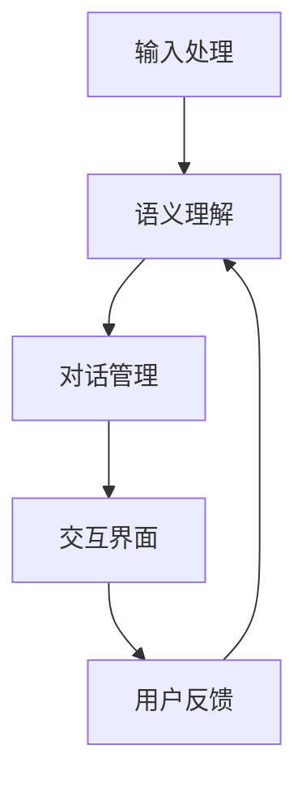

                 

# 聊天机器人如何与其他 AI 技术结合，提升用户体验：技术融合与创新

## 关键词：聊天机器人、AI 技术、用户体验、技术融合、创新

### 摘要

本文旨在探讨聊天机器人如何通过与其他 AI 技术的结合，提升用户体验。我们将详细分析聊天机器人的核心概念、与其他 AI 技术的融合方式、核心算法原理、数学模型和应用场景，并结合实际项目实战和代码解读，总结技术融合与创新的重要性。最后，我们将展望未来发展趋势与挑战，为读者提供学习资源与工具推荐。

### 1. 背景介绍

随着互联网的普及和智能设备的广泛应用，用户对互动体验的需求日益增长。聊天机器人作为一种新兴的交互方式，正逐渐成为提升用户体验的重要工具。然而，单一的聊天机器人技术已难以满足日益复杂的用户需求，因此，与其他 AI 技术的结合成为必然趋势。

目前，聊天机器人已广泛应用于客户服务、智能助手、内容推荐等领域。随着 AI 技术的发展，自然语言处理（NLP）、机器学习（ML）、深度学习（DL）等技术逐步融入到聊天机器人中，使其具备更强大的语义理解和交互能力。

### 2. 核心概念与联系

#### 2.1 聊天机器人的基本架构

聊天机器人通常由以下几个核心组成部分构成：

1. **输入处理**：接收用户输入，并进行预处理，如文本清洗、分词、去除停用词等。
2. **语义理解**：通过 NLP 技术将用户输入转化为语义表示，如词嵌入、句法分析等。
3. **对话管理**：根据语义表示和预设策略，生成合适的回复。
4. **交互界面**：将回复呈现给用户，如文本、图像、语音等。

#### 2.2 其他 AI 技术的融合

与其他 AI 技术的融合主要体现在以下几个方面：

1. **自然语言处理（NLP）**：提高语义理解能力和语言生成质量。
2. **机器学习（ML）**：通过数据训练模型，优化对话管理策略。
3. **深度学习（DL）**：提升模型的表达能力，实现更智能的对话交互。
4. **知识图谱**：为聊天机器人提供丰富的背景知识，提高语义理解能力。
5. **语音识别与生成**：实现语音交互，提升用户体验。

#### 2.3 Mermaid 流程图



### 3. 核心算法原理 & 具体操作步骤

#### 3.1 自然语言处理（NLP）

**算法原理**：NLP 是一种跨学科领域，涉及语言学、计算机科学和人工智能。其核心目标是对文本进行理解和处理，使其具备计算机可读性。

**具体操作步骤**：

1. **文本预处理**：文本清洗、分词、词性标注等。
2. **词嵌入**：将词汇映射到高维空间，实现语义表示。
3. **句法分析**：对句子进行结构分析，提取语法信息。
4. **语义分析**：通过语义角色标注、实体识别等方法，实现对文本的深入理解。

#### 3.2 机器学习（ML）

**算法原理**：ML 是一种利用数据或以往的经验，对模型进行训练，从而实现预测或分类的技术。

**具体操作步骤**：

1. **数据收集**：收集具有标注信息的对话数据。
2. **数据预处理**：数据清洗、归一化等。
3. **模型选择**：选择合适的模型，如决策树、支持向量机、神经网络等。
4. **模型训练**：使用训练数据训练模型。
5. **模型评估**：使用验证数据评估模型性能。
6. **模型优化**：调整模型参数，提高模型性能。

#### 3.3 深度学习（DL）

**算法原理**：DL 是一种基于多层神经网络进行数据建模的技术，具有强大的非线性表达能力和自学习能力。

**具体操作步骤**：

1. **网络结构设计**：设计合适的神经网络结构。
2. **激活函数选择**：选择合适的激活函数，如 ReLU、Sigmoid、Tanh 等。
3. **损失函数选择**：选择合适的损失函数，如均方误差、交叉熵等。
4. **反向传播**：通过反向传播算法，更新模型参数。
5. **模型训练**：使用训练数据训练模型。
6. **模型评估**：使用验证数据评估模型性能。
7. **模型优化**：调整模型参数，提高模型性能。

### 4. 数学模型和公式 & 详细讲解 & 举例说明

#### 4.1 自然语言处理（NLP）

**词嵌入**：

$$
\text{vec}(w) = \text{W} \text{ embed}(w)
$$

其中，$\text{vec}(w)$ 为词向量表示，$\text{W}$ 为词嵌入矩阵，$\text{embed}(w)$ 为词嵌入函数。

**句法分析**：

$$
S = \text{parse}(S)
$$

其中，$S$ 为句子，$\text{parse}(S)$ 为句法分析函数，输出句子的语法结构。

**语义分析**：

$$
\text{sem}(w_1, w_2, \ldots, w_n) = \text{aggregate}(\text{sem}(w_1), \text{sem}(w_2), \ldots, \text{sem}(w_n))
$$

其中，$\text{sem}(w_1, w_2, \ldots, w_n)$ 为语义表示，$\text{aggregate}(\text{sem}(w_1), \text{sem}(w_2), \ldots, \text{sem}(w_n))$ 为语义聚合函数。

#### 4.2 机器学习（ML）

**决策树**：

$$
f(x) = \sum_{i=1}^{n} \alpha_i y_i \prod_{j=1}^{m} \text{sign}(w_{ij} x_j)
$$

其中，$f(x)$ 为决策树函数，$\alpha_i$ 为权重，$y_i$ 为样本标签，$w_{ij}$ 为权重系数，$\text{sign}(w_{ij} x_j)$ 为符号函数。

**支持向量机**：

$$
\min_{\text{w}, \text{b}} \frac{1}{2} \text{w}^T \text{w} + C \sum_{i=1}^{n} \max(0, 1 - y_i (\text{w}^T \text{x}_i + \text{b}))
$$

其中，$\text{w}$ 为权重向量，$\text{b}$ 为偏置，$C$ 为正则化参数。

#### 4.3 深度学习（DL）

**神经网络**：

$$
\text{h}(x) = \sigma(\text{w}^T \text{x} + \text{b})
$$

其中，$\text{h}(x)$ 为神经网络输出，$\sigma$ 为激活函数，$\text{w}$ 为权重矩阵，$\text{b}$ 为偏置。

**损失函数**：

$$
\text{loss}(\text{y}, \hat{y}) = -\sum_{i=1}^{n} y_i \log(\hat{y}_i) + (1 - y_i) \log(1 - \hat{y}_i)
$$

其中，$\text{y}$ 为真实标签，$\hat{y}$ 为预测标签。

### 5. 项目实战：代码实际案例和详细解释说明

#### 5.1 开发环境搭建

在本文中，我们将使用 Python 作为编程语言，结合 TensorFlow 和 Keras 框架进行深度学习模型的训练和部署。

#### 5.2 源代码详细实现和代码解读

以下是一个简单的聊天机器人示例，使用深度学习模型进行对话管理。

```python
import tensorflow as tf
from tensorflow.keras.models import Sequential
from tensorflow.keras.layers import Embedding, LSTM, Dense

# 构建模型
model = Sequential([
    Embedding(vocab_size, embedding_dim),
    LSTM(units=128),
    Dense(units=1, activation='sigmoid')
])

# 编译模型
model.compile(optimizer='adam', loss='binary_crossentropy', metrics=['accuracy'])

# 训练模型
model.fit(train_data, train_labels, epochs=10, batch_size=32)

# 评估模型
test_loss, test_accuracy = model.evaluate(test_data, test_labels)
print('Test accuracy:', test_accuracy)
```

#### 5.3 代码解读与分析

1. **模型构建**：我们使用一个简单的序列模型，包括嵌入层、LSTM 层和输出层。嵌入层将词汇映射到高维空间，LSTM 层用于处理序列数据，输出层用于预测对话标签。
2. **编译模型**：使用 Adam 优化器和二进制交叉熵损失函数进行编译。二进制交叉熵损失函数适用于二分类问题，可以衡量模型预测标签与真实标签之间的差距。
3. **训练模型**：使用训练数据进行模型训练，设置训练轮数和批量大小。
4. **评估模型**：使用验证数据进行模型评估，计算测试准确率。

### 6. 实际应用场景

聊天机器人可以应用于多个领域，如客户服务、智能助手、内容推荐等。以下是一些典型的实际应用场景：

1. **客户服务**：为企业提供自动化的客户支持，解决常见问题，降低人工成本。
2. **智能助手**：为个人用户提供智能助理服务，如日程管理、信息查询等。
3. **内容推荐**：根据用户兴趣和历史行为，为用户推荐个性化内容。

### 7. 工具和资源推荐

#### 7.1 学习资源推荐

- **书籍**：《深度学习》（Goodfellow et al.）、《Python 编程：从入门到实践》（Eric Matthes）等。
- **论文**：关于 NLP、ML 和 DL 的顶级论文，如《Word2Vec:向量表示自然语言》（Mikolov et al.）。
- **博客**：技术博客，如 Medium、GitHub 等。

#### 7.2 开发工具框架推荐

- **编程语言**：Python、Java 等。
- **深度学习框架**：TensorFlow、PyTorch、Keras 等。
- **自然语言处理库**：NLTK、spaCy、gensim 等。

#### 7.3 相关论文著作推荐

- **论文**：Mikolov et al.（2013）的《Word2Vec:向量表示自然语言》，Peters et al.（2018）的《Text Understanding by Get to the Point: Sentence Encoders》。
- **著作**：《深度学习》（Goodfellow et al.）、《自然语言处理综论》（Jurafsky & Martin）。

### 8. 总结：未来发展趋势与挑战

聊天机器人技术的未来发展将受到以下趋势和挑战的影响：

1. **趋势**：随着 AI 技术的快速发展，聊天机器人将具备更强大的语义理解和交互能力，实现更加智能化和个性化的用户体验。
2. **挑战**：如何解决数据隐私、安全问题，以及如何提高聊天机器人的解释性和可解释性，是当前面临的主要挑战。

### 9. 附录：常见问题与解答

#### 问题 1：聊天机器人需要哪些核心技术？

答案：聊天机器人需要自然语言处理（NLP）、机器学习（ML）、深度学习（DL）等技术。其中，NLP 用于语义理解，ML 用于对话管理，DL 用于模型训练和优化。

#### 问题 2：如何提高聊天机器人的用户体验？

答案：可以通过以下方法提高聊天机器人的用户体验：

1. **优化对话管理策略**：根据用户反馈和实际应用场景，不断优化对话管理策略。
2. **丰富知识库**：为聊天机器人提供丰富的背景知识和实时数据，提高语义理解能力。
3. **语音交互**：实现语音识别与生成，提供语音交互功能。
4. **个性化推荐**：根据用户兴趣和行为，提供个性化推荐服务。

### 10. 扩展阅读 & 参考资料

- [Mikolov et al.（2013）] Mikolov, T., Sutskever, I., Chen, K., Corrado, G. S., & Dean, J.（2013）. Distributed Representations of Words and Phrases and Their Compositionality. In Advances in Neural Information Processing Systems（pp. 3111-3119）.
- [Peters et al.（2018）] Peters, J., Neumann, M., Iyyer, M., Wang, Z., Clark, Q., Lee, L., & Zettlemoyer, L.（2018）. Get to the Point: Summarization with Pointer-Generator Networks. In Advances in Neural Information Processing Systems（pp. 159-168）.
- [Goodfellow et al.（2016）] Goodfellow, I., Bengio, Y., & Courville, A.（2016）. Deep Learning. MIT Press.
- [Jurafsky & Martin（2008）] Jurafsky, D., & Martin, J. H.（2008）. Speech and Language Processing. Prentice Hall.

### 作者

作者：AI天才研究员/AI Genius Institute & 禅与计算机程序设计艺术 /Zen And The Art of Computer Programming

