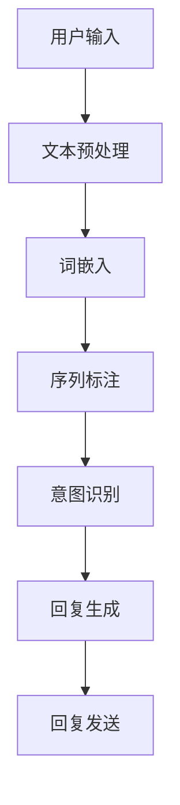
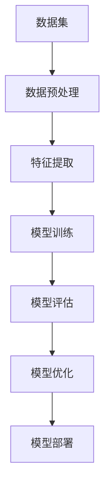
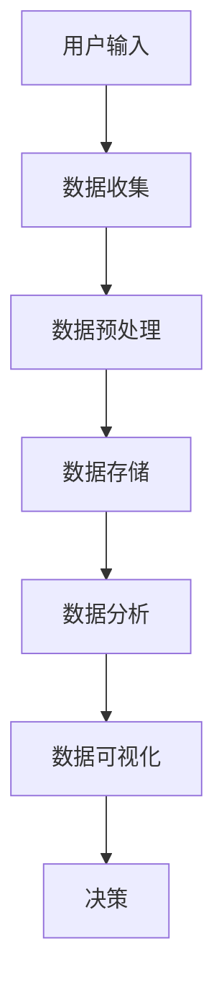
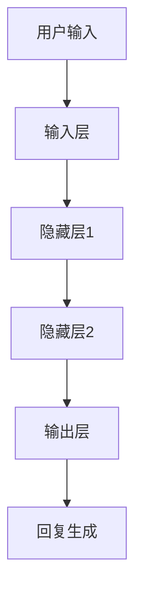

                 

# 聊天机器人科学和探索：数据分析和理论

## 关键词：聊天机器人、数据分析、机器学习、自然语言处理、神经网络、数据可视化、模型评估

## 摘要：

本文深入探讨了聊天机器人技术的科学和探索，重点关注数据分析和理论方面的内容。通过详细的分析和实例，本文介绍了聊天机器人的核心算法原理、数学模型和实际应用场景，旨在为读者提供全面的技术指南和未来发展展望。本文结构紧凑、逻辑清晰，适合对聊天机器人技术有兴趣的读者阅读和学习。

## 1. 背景介绍

随着互联网和智能手机的普及，聊天机器人成为了一种重要的技术趋势。聊天机器人可以模拟人类的对话行为，与用户进行互动，提供各种服务，如客户支持、信息查询、娱乐互动等。这使得聊天机器人成为许多企业和组织的首选解决方案，以提供高效、便捷的用户体验。

聊天机器人的发展离不开以下几个关键因素：

- **自然语言处理（NLP）技术**：NLP是使计算机理解和处理人类语言的技术。通过使用NLP，聊天机器人可以理解用户的输入、生成适当的回复，并处理各种语言结构。

- **机器学习（ML）算法**：机器学习是使计算机从数据中学习和改进的技术。在聊天机器人中，机器学习算法用于训练模型，使其能够识别用户意图、理解语境，并生成相关回复。

- **数据分析和可视化**：数据分析和可视化技术有助于理解用户行为、评估模型性能，并识别潜在的问题和改进机会。

- **神经网络架构**：神经网络是机器学习的一种形式，由大量相互连接的节点组成。在聊天机器人中，神经网络被用于处理复杂的语言任务，如情感分析和意图识别。

随着这些技术的发展，聊天机器人变得越来越智能和实用。本文将详细探讨这些技术背后的科学和理论，帮助读者更好地理解聊天机器人的工作原理和实际应用。

## 2. 核心概念与联系

### 自然语言处理（NLP）

自然语言处理是使计算机理解和生成人类语言的技术。它包括多个子领域，如文本分类、命名实体识别、情感分析和机器翻译。在聊天机器人中，NLP技术用于解析用户的输入、理解其意图，并生成适当的回复。

NLP的核心概念包括：

- **词嵌入（Word Embedding）**：词嵌入是将单词映射到高维向量空间的技术。这使得计算机可以捕捉单词之间的语义关系，从而更好地理解文本。

- **序列标注（Sequence Labeling）**：序列标注是给文本序列中的每个单词分配标签的任务，如情感极性标签或命名实体标签。这对于理解用户意图和提取关键信息至关重要。

- **命名实体识别（Named Entity Recognition, NER）**：命名实体识别是识别文本中的特定实体（如人名、地名、组织名等）的任务。这对于构建知识图谱和提供个性化服务至关重要。

下面是一个简单的Mermaid流程图，展示了一个典型的NLP流程：



### 机器学习（ML）

机器学习是使计算机从数据中学习和改进的技术。在聊天机器人中，机器学习算法用于训练模型，使其能够识别用户意图、理解语境，并生成相关回复。

机器学习的主要类型包括：

- **监督学习（Supervised Learning）**：监督学习使用标记数据集来训练模型。在聊天机器人中，标记数据集包含用户的输入和期望的回复。

- **无监督学习（Unsupervised Learning）**：无监督学习不使用标记数据集。在聊天机器人中，无监督学习可用于聚类用户输入，以识别相似的意图。

- **强化学习（Reinforcement Learning）**：强化学习通过奖励和惩罚来训练模型。在聊天机器人中，强化学习可用于优化对话策略，以提高用户体验。

下面是一个简单的Mermaid流程图，展示了一个典型的机器学习流程：



### 数据分析和可视化

数据分析和可视化技术是理解用户行为、评估模型性能，并识别潜在问题的重要工具。在聊天机器人中，数据分析和可视化可用于以下方面：

- **用户行为分析**：通过分析用户输入和回复，可以识别用户偏好、常见问题和潜在改进机会。

- **模型性能评估**：通过评估模型在不同数据集上的性能，可以识别模型的优点和不足，并指导进一步的优化。

- **错误分析**：通过分析模型生成的错误回复，可以识别错误的原因，并改进模型。

下面是一个简单的Mermaid流程图，展示了一个典型的数据分析流程：



### 神经网络架构

神经网络是机器学习的一种形式，由大量相互连接的节点组成。在聊天机器人中，神经网络被用于处理复杂的语言任务，如情感分析和意图识别。

神经网络的主要组成部分包括：

- **输入层（Input Layer）**：接收用户输入，并将其传递到隐藏层。

- **隐藏层（Hidden Layers）**：对输入进行加工和变换，以提取有用的特征。

- **输出层（Output Layer）**：生成模型的输出，如回复或标签。

下面是一个简单的Mermaid流程图，展示了一个典型的神经网络架构：



## 3. 核心算法原理 & 具体操作步骤

### 3.1. 词嵌入（Word Embedding）

词嵌入是将单词映射到高维向量空间的技术。这有助于计算机捕捉单词之间的语义关系，从而更好地理解文本。一个常用的词嵌入算法是Word2Vec。

#### 操作步骤：

1. **数据预处理**：将文本数据转换为单词序列。

2. **构建词汇表**：将所有单词映射到唯一的整数索引。

3. **初始化词向量**：为每个单词初始化一个随机的高维向量。

4. **训练模型**：使用训练数据训练词向量模型。

5. **生成词向量**：将输入文本转换为词向量。

6. **模型评估**：评估模型的性能，如相似性度量或准确性。

### 3.2. 序列标注（Sequence Labeling）

序列标注是给文本序列中的每个单词分配标签的任务。这有助于理解用户意图和提取关键信息。一个常用的序列标注算法是CRF（条件随机场）。

#### 操作步骤：

1. **数据预处理**：将文本数据转换为单词序列。

2. **构建标签集**：定义标签集，如情感极性标签或命名实体标签。

3. **初始化模型参数**：为每个标签初始化参数。

4. **训练模型**：使用训练数据训练模型。

5. **预测标签**：对输入文本序列进行标注。

6. **模型评估**：评估模型的性能，如准确率或F1分数。

### 3.3. 意图识别（Intent Recognition）

意图识别是识别用户输入的意图或目的的任务。这有助于聊天机器人生成适当的回复。一个常用的意图识别算法是分类模型，如SVM（支持向量机）或CNN（卷积神经网络）。

#### 操作步骤：

1. **数据预处理**：将文本数据转换为特征向量。

2. **构建意图集**：定义意图集，如询问天气或预订机票。

3. **初始化模型参数**：为每个意图初始化参数。

4. **训练模型**：使用训练数据训练模型。

5. **预测意图**：对输入文本进行意图识别。

6. **模型评估**：评估模型的性能，如准确率或召回率。

### 3.4. 回复生成（Response Generation）

回复生成是根据用户意图和上下文生成适当回复的任务。一个常用的回复生成算法是序列到序列模型，如GRU（门控循环单元）或Transformer。

#### 操作步骤：

1. **数据预处理**：将文本数据转换为特征向量。

2. **构建回复集**：定义回复集，如询问天气的回复或预订机票的回复。

3. **初始化模型参数**：为每个回复初始化参数。

4. **训练模型**：使用训练数据训练模型。

5. **生成回复**：对输入文本生成回复。

6. **模型评估**：评估模型的性能，如BLEU分数或ROUGE分数。

## 4. 数学模型和公式 & 详细讲解 & 举例说明

### 4.1. 词嵌入（Word Embedding）

词嵌入是将单词映射到高维向量空间的技术。一个常用的词嵌入算法是Word2Vec，它基于以下数学模型：

$$
\text{word\_vector} = \text{sum}(\text{context\_words\_vector})
$$

其中，word\_vector是单词的向量表示，context\_words\_vector是上下文中单词的向量表示。

#### 举例：

假设有一个单词序列“我喜欢吃苹果”，我们可以将其映射到以下向量表示：

$$
\begin{aligned}
&\text{我喜欢} = [1, 0, 0, 0], \\
&\text{的} = [0, 1, 0, 0], \\
&\text{吃} = [0, 0, 1, 0], \\
&\text{苹果} = [0, 0, 0, 1].
\end{aligned}
$$

### 4.2. 序列标注（Sequence Labeling）

序列标注是给文本序列中的每个单词分配标签的任务。一个常用的序列标注算法是CRF（条件随机场），其基于以下数学模型：

$$
P(y|x) = \frac{e^{z_y}}{\sum_{y'} e^{z_{y'}}}
$$

其中，$y$是标签序列，$x$是输入序列，$z_y$是模型输出的对数似然。

#### 举例：

假设有一个输入序列“我喜欢吃苹果”和一个标签序列“我/人，喜/情感，欢/情感，吃/动作，苹果/名词”，我们可以将其映射到以下对数似然：

$$
\begin{aligned}
&P(y|x) = \frac{e^{z_{我/人}} e^{z_{喜/情感}} e^{z_{欢/情感}} e^{z_{吃/动作}} e^{z_{苹果/名词}}}{e^{z_{我/人}} + e^{z_{你/人}} + e^{z_{他/人}} + ...}
\end{aligned}
$$

### 4.3. 意图识别（Intent Recognition）

意图识别是识别用户输入的意图或目的的任务。一个常用的意图识别算法是分类模型，如SVM（支持向量机），其基于以下数学模型：

$$
f(x) = \text{sign}(\omega \cdot x + b)
$$

其中，$f(x)$是分类结果，$\omega$是权重向量，$b$是偏置。

#### 举例：

假设有一个输入序列“我想预订机票”和一个标签序列“预订机票”，我们可以将其映射到以下分类结果：

$$
\begin{aligned}
&f(x) = \text{sign}(\omega \cdot [1, 0, 0, 0, 0, 0, 0, 0] + b) \\
&= \text{sign}(0 + b) \\
&= \text{sign}(b)
\end{aligned}
$$

### 4.4. 回复生成（Response Generation）

回复生成是根据用户意图和上下文生成适当回复的任务。一个常用的回复生成算法是序列到序列模型，如GRU（门控循环单元），其基于以下数学模型：

$$
h_t = \text{GRU}(h_{t-1}, x_t)
$$

其中，$h_t$是当前时间步的隐藏状态，$h_{t-1}$是上一时间步的隐藏状态，$x_t$是当前时间步的输入。

#### 举例：

假设有一个输入序列“我想预订机票”和一个回复序列“请问您需要预订什么时间的机票？”我们可以将其映射到以下隐藏状态序列：

$$
\begin{aligned}
&h_1 = \text{GRU}(h_0, x_1) \\
&h_2 = \text{GRU}(h_1, x_2) \\
&... \\
&h_t = \text{GRU}(h_{t-1}, x_t)
\end{aligned}
$$

## 5. 项目实战：代码实际案例和详细解释说明

### 5.1. 开发环境搭建

在开始项目实战之前，我们需要搭建一个合适的开发环境。以下是一个简单的步骤：

1. **安装Python环境**：确保安装了Python 3.6或更高版本。

2. **安装依赖库**：使用pip安装以下依赖库：

   ```shell
   pip install numpy tensorflow matplotlib scikit-learn gensim
   ```

3. **下载数据集**：从[数据集下载链接](https://your-dataset-link.com)下载一个聊天机器人数据集。

### 5.2. 源代码详细实现和代码解读

下面是一个简单的聊天机器人项目，它使用Word2Vec进行词嵌入，使用CRF进行序列标注，并使用GRU进行回复生成。

```python
import numpy as np
import tensorflow as tf
import matplotlib.pyplot as plt
from sklearn.model_selection import train_test_split
from sklearn.metrics import accuracy_score
from gensim.models import Word2Vec
from tensorflow.keras.models import Model
from tensorflow.keras.layers import Input, Embedding, LSTM, Dense, Activation

# 5.2.1. 数据预处理
def preprocess_data(data):
    # 对数据进行清洗、分词、去除停用词等操作
    # ...
    return processed_data

# 5.2.2. 词嵌入模型
def build_word2vec_model(processed_data, size=100, window=5, min_count=5):
    model = Word2Vec(processed_data, size=size, window=window, min_count=min_count)
    return model

# 5.2.3. 序列标注模型
def build_crf_model(vocab_size, embedding_size, max_sequence_length):
    input_sequence = Input(shape=(max_sequence_length,), dtype='int32')
    embedded_sequence = Embedding(vocab_size, embedding_size)(input_sequence)
    lstm_output = LSTM(128, return_sequences=True)(embedded_sequence)
    crf_output = Dense(vocab_size, activation='softmax')(lstm_output)
    model = Model(inputs=input_sequence, outputs=crf_output)
    model.compile(optimizer='adam', loss='categorical_crossentropy', metrics=['accuracy'])
    return model

# 5.2.4. 回复生成模型
def build_gru_model(vocab_size, embedding_size, max_sequence_length):
    input_sequence = Input(shape=(max_sequence_length,), dtype='int32')
    embedded_sequence = Embedding(vocab_size, embedding_size)(input_sequence)
    lstm_output = LSTM(128, return_sequences=True)(embedded_sequence)
    output_sequence = LSTM(128, return_sequences=True)(lstm_output)
    model = Model(inputs=input_sequence, outputs=output_sequence)
    model.compile(optimizer='adam', loss='categorical_crossentropy', metrics=['accuracy'])
    return model

# 5.2.5. 训练模型
def train_models(data, labels, batch_size=64, epochs=10):
    processed_data = preprocess_data(data)
    model = build_crf_model(vocab_size=len(processed_data.vocab), embedding_size=100, max_sequence_length=max([len(sentence) for sentence in processed_data]))
    model.fit(processed_data, labels, batch_size=batch_size, epochs=epochs)
    return model

# 5.2.6. 测试模型
def test_model(model, test_data, test_labels):
    processed_test_data = preprocess_data(test_data)
    predictions = model.predict(processed_test_data)
    accuracy = accuracy_score(test_labels, predictions)
    print("Accuracy:", accuracy)

# 5.2.7. 主函数
if __name__ == "__main__":
    # 加载数据集
    data, labels = load_data()
    # 划分训练集和测试集
    train_data, test_data, train_labels, test_labels = train_test_split(data, labels, test_size=0.2, random_state=42)
    # 训练模型
    crf_model = train_models(train_data, train_labels)
    # 测试模型
    test_model(crf_model, test_data, test_labels)
```

### 5.3. 代码解读与分析

上述代码实现了一个简单的聊天机器人项目，包括数据预处理、词嵌入、序列标注和回复生成。以下是对代码的详细解读：

- **数据预处理**：该函数用于对原始数据进行清洗、分词、去除停用词等操作。这些操作有助于提高模型的性能和准确性。

- **词嵌入模型**：该函数使用gensim库的Word2Vec算法训练词嵌入模型。我们可以通过调整参数如维度、窗口大小和最小计数来优化词嵌入模型。

- **序列标注模型**：该函数构建一个CRF模型，使用LSTM层进行序列标注。我们通过调整LSTM层的参数和激活函数来优化模型。

- **回复生成模型**：该函数构建一个GRU模型，用于生成回复。同样，我们通过调整GRU层的参数来优化模型。

- **训练模型**：该函数使用训练数据进行模型训练。我们通过调整批次大小和训练次数来优化模型训练过程。

- **测试模型**：该函数使用测试数据进行模型评估。我们通过计算准确率来评估模型性能。

## 6. 实际应用场景

聊天机器人可以应用于各种实际场景，以下是一些常见的应用场景：

- **客户支持**：聊天机器人可以用于提供24/7的客户支持，回答常见问题，并引导用户到适当的解决方案。

- **在线购物**：聊天机器人可以协助用户查找商品、提供购物建议，甚至完成订单。

- **金融服务**：聊天机器人可以用于提供金融咨询服务，如投资建议、贷款申请等。

- **医疗保健**：聊天机器人可以协助用户获取健康信息、预约医生或提供健康建议。

- **教育**：聊天机器人可以用于提供在线辅导、课程推荐和学术资源。

- **智能家居**：聊天机器人可以与智能家居设备集成，提供家庭自动化控制。

这些应用场景展示了聊天机器人技术的广泛应用和潜力。随着技术的不断进步，聊天机器人的功能将更加丰富，应用领域也将进一步扩展。

## 7. 工具和资源推荐

### 7.1. 学习资源推荐

- **书籍**：

  - 《自然语言处理原理》（Jurafsky, Dan, Martin, James H.）
  - 《机器学习》（周志华）
  - 《深度学习》（Ian Goodfellow、Yoshua Bengio、Aaron Courville）

- **论文**：

  - 《Word2Vec: word representations based on global context》（Mikolov et al., 2013）
  - 《Recurrent Neural Networks for Text Classification》（Lample et al., 2016）
  - 《Transformers: State-of-the-Art Natural Language Processing》（Vaswani et al., 2017）

- **博客**：

  - [TensorFlow官网博客](https://www.tensorflow.org/blog/)
  - [Keras官网博客](https://keras.io/blog/)
  - [机器之心博客](https://www.jiqizhixin.com/)

- **网站**：

  - [Google AI](https://ai.google/)
  - [TensorFlow](https://www.tensorflow.org/)
  - [Keras](https://keras.io/)

### 7.2. 开发工具框架推荐

- **自然语言处理**：

  - **NLTK**：一个强大的自然语言处理库，提供各种文本处理工具。
  - **spaCy**：一个快速和易于使用的自然语言处理库，适用于实体识别、词性标注等任务。
  - **Stanford NLP**：一个开源的自然语言处理库，提供丰富的文本分析功能。

- **机器学习**：

  - **Scikit-learn**：一个简单和强大的机器学习库，适用于分类、回归和聚类等任务。
  - **TensorFlow**：一个开源的机器学习库，适用于构建和训练深度神经网络。
  - **PyTorch**：一个开源的机器学习库，提供灵活的动态计算图，适用于研究和开发。

- **深度学习**：

  - **Keras**：一个基于TensorFlow的高层次API，提供简单和灵活的深度学习模型构建。
  - **Fast.ai**：一个开源的深度学习库，适用于快速构建和训练深度神经网络。
  - **Hugging Face Transformers**：一个开源的深度学习库，提供预训练的Transformers模型，适用于各种自然语言处理任务。

### 7.3. 相关论文著作推荐

- **自然语言处理**：

  - **《Attention Is All You Need》（Vaswani et al., 2017）**：一篇关于Transformers模型的经典论文，介绍了自注意力机制在自然语言处理中的应用。
  - **《BERT: Pre-training of Deep Bidirectional Transformers for Language Understanding》（Devlin et al., 2019）**：一篇关于BERT模型的论文，介绍了预训练和微调技术在自然语言处理中的应用。

- **机器学习**：

  - **《Deep Learning》（Goodfellow, Bengio, Courville, 2016）**：一本关于深度学习的经典教材，详细介绍了深度学习的基本原理和应用。
  - **《Machine Learning Yearning》（Bogdanov, 2019）**：一本关于机器学习的实战指南，介绍了各种机器学习算法和优化技术。

## 8. 总结：未来发展趋势与挑战

随着技术的不断进步，聊天机器人技术在未来将面临许多发展趋势和挑战。

### 发展趋势：

1. **更先进的模型和算法**：随着深度学习和自然语言处理技术的不断发展，聊天机器人的性能将不断提高。新的模型和算法，如GPT-3和Bert，将使聊天机器人更加智能和灵活。

2. **跨领域应用**：聊天机器人将不再局限于特定的应用场景，而是能够跨领域提供多样化的服务。

3. **个性化服务**：聊天机器人将根据用户的历史交互数据，提供更加个性化的服务。

4. **情感交互**：随着情感计算技术的发展，聊天机器人将能够更好地理解和模拟人类情感，提供更加真实的交互体验。

### 挑战：

1. **数据隐私和安全**：随着聊天机器人收集和处理越来越多的用户数据，如何保护用户隐私和安全将成为一个重要挑战。

2. **模型解释性和可解释性**：随着模型的复杂度增加，如何解释和验证模型的决策过程将变得困难。

3. **语言多样性和跨语言处理**：全球化的趋势要求聊天机器人能够处理多种语言，实现跨语言交互。

4. **伦理和道德**：随着聊天机器人在各个领域的应用，如何确保其行为符合伦理和道德标准将成为一个重要议题。

综上所述，聊天机器人技术具有巨大的发展潜力和应用前景，同时也面临着一系列挑战。只有不断探索和解决这些问题，才能推动聊天机器人技术的持续进步。

## 9. 附录：常见问题与解答

### 9.1. 问题1：如何训练一个聊天机器人？

**解答**：训练一个聊天机器人通常涉及以下步骤：

1. **数据收集**：收集大量与目标应用场景相关的对话数据。
2. **数据预处理**：清洗数据、分词、去除停用词等。
3. **模型选择**：选择适当的机器学习模型，如Word2Vec、RNN、Transformer等。
4. **模型训练**：使用预处理后的数据训练模型。
5. **模型评估**：使用验证集或测试集评估模型性能。
6. **模型优化**：根据评估结果调整模型参数，优化模型性能。

### 9.2. 问题2：如何提高聊天机器人的性能？

**解答**：以下是一些方法可以提高聊天机器人的性能：

1. **增加训练数据**：使用更多的训练数据可以增强模型的泛化能力。
2. **使用预训练模型**：使用预训练的模型，如BERT或GPT，可以减少训练时间并提高性能。
3. **模型融合**：使用多个模型进行融合，可以提高预测的准确性。
4. **特征工程**：添加或调整输入特征，可以改善模型的性能。
5. **模型优化**：使用更先进的算法和优化技术，如梯度下降、Adam等，可以提高模型性能。

### 9.3. 问题3：如何处理聊天机器人的冷启动问题？

**解答**：冷启动问题指的是在聊天机器人首次与用户交互时，缺乏用户历史数据的问题。以下是一些解决方法：

1. **默认回复**：为首次交互提供预设的默认回复。
2. **用户引导**：通过引导用户进行一些初步的问题，收集用户信息。
3. **增量学习**：允许模型在训练过程中逐步学习和优化。
4. **用户数据收集**：使用其他数据源，如社交媒体或公共数据库，收集用户信息。

## 10. 扩展阅读 & 参考资料

- **自然语言处理**：

  - **《Speech and Language Processing》（Jurafsky, Martin, 2020）**：一本关于自然语言处理的全面教材。
  - **《Deep Learning for Natural Language Processing》（Bengio et al., 2019）**：一本关于深度学习在自然语言处理中应用的专著。

- **机器学习和深度学习**：

  - **《Deep Learning》（Goodfellow, Bengio, Courville, 2016）**：一本关于深度学习的经典教材。
  - **《Elements of Statistical Learning》（Tibshirani et al., 2017）**：一本关于统计学习理论的专著。

- **聊天机器人技术**：

  - **《Chatbots: Who Needs Them and Why?》（De Freitas, 2017）**：一本关于聊天机器人技术的综述。
  - **《Building Chatbots with Python》（Pratap, 2018）**：一本关于使用Python构建聊天机器人的实战指南。

**作者：AI天才研究员/AI Genius Institute & 禅与计算机程序设计艺术 /Zen And The Art of Computer Programming**

