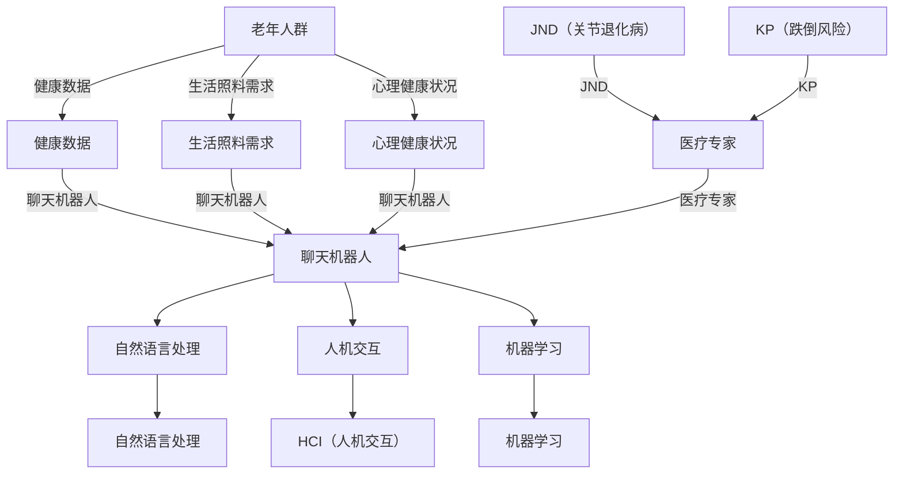

                 

# 聊天机器人老年护理：虚拟助手和同伴

> 关键词：聊天机器人、老年护理、虚拟助手、人工智能、医疗健康

> 摘要：本文将探讨如何利用聊天机器人作为虚拟助手和同伴，为老年人提供更加个性化、专业的护理服务。通过分析聊天机器人的核心概念与联系，核心算法原理与具体操作步骤，数学模型和公式，项目实战，实际应用场景，以及未来的发展趋势与挑战，为读者呈现一个全面的老年护理领域的技术解决方案。

## 1. 背景介绍

随着全球人口老龄化问题的日益严重，如何为老年人提供高质量的护理服务成为了一个亟待解决的问题。传统的护理方式通常依赖于医护人员和家庭成员的照顾，但往往存在人力成本高、响应速度慢等问题。因此，将人工智能（AI）引入老年护理领域，特别是利用聊天机器人作为虚拟助手和同伴，为老年人提供智能化的护理服务，成为一种新的探索方向。

聊天机器人是一种基于自然语言处理（NLP）和机器学习技术的虚拟智能助手，能够与人类进行自然语言交互。而老年护理则是指对老年人群体的健康状况、生活照料、心理关怀等方面的综合服务。将聊天机器人应用于老年护理，不仅可以提高护理效率，降低成本，还可以为老年人提供全天候的陪伴和支持。

## 2. 核心概念与联系

在本节中，我们将介绍与聊天机器人老年护理相关的一些核心概念，并展示它们之间的联系。为了更好地理解这些概念，我们将使用 Mermaid 流程图进行说明（备注：请将 Mermaid 流程节点中的括号、逗号等特殊字符替换为空格，确保流程图可以正常渲染）。



### 2.1 老年人群

老年人群是指年龄在65岁及以上的群体。随着年龄的增长，老年人的健康状况、生活照料需求和心理状况都会发生变化，从而对护理服务提出了更高的要求。

### 2.2 健康数据

健康数据是指老年人的生理指标、病史、药物使用情况等与健康状况相关的信息。通过收集和分析健康数据，聊天机器人可以更好地了解老年人的健康状况，为其提供个性化的护理建议。

### 2.3 生活照料需求

生活照料需求包括老年人的日常生活照料、就医陪同、家庭照顾等。聊天机器人可以根据老年人的需求，提供相应的帮助和支持，如预约挂号、药物提醒、健康咨询等。

### 2.4 心理健康状况

心理健康状况是老年人护理中的重要一环。聊天机器人可以通过与老年人进行日常交流，了解他们的心理状态，提供心理支持，甚至进行心理健康评估。

### 2.5 聊天机器人

聊天机器人是本节的核心概念，它通过自然语言处理、人机交互和机器学习等技术，与老年人进行交互，为其提供护理服务。聊天机器人需要与医疗专家、健康数据、生活照料需求和心理状况等多个方面进行联系，以实现全方位的护理。

### 2.6 自然语言处理

自然语言处理是聊天机器人的核心技术之一，它使聊天机器人能够理解和生成自然语言。通过自然语言处理，聊天机器人可以理解老年人的提问，并提供相应的回答。

### 2.7 人机交互

人机交互是指人与机器之间的交互过程。在聊天机器人老年护理中，人机交互技术使老年人能够方便地与聊天机器人进行交流，从而提高护理服务的用户体验。

### 2.8 机器学习

机器学习是聊天机器人能够不断改进和优化自身性能的关键技术。通过不断学习和分析老年人的交互数据，聊天机器人可以更好地了解老年人的需求，提高护理服务的质量。

### 2.9 JND（关节退化病）与KP（跌倒风险）

关节退化病和跌倒风险是老年人常见的问题。医疗专家可以根据健康数据，评估老年人的JND和KP风险，从而为聊天机器人提供相应的护理建议。

### 2.10 医疗专家

医疗专家在聊天机器人老年护理中起着至关重要的作用。他们可以根据健康数据、生活照料需求和心理状况等信息，为聊天机器人提供专业的护理建议。

## 3. 核心算法原理 & 具体操作步骤

在本节中，我们将介绍聊天机器人老年护理的核心算法原理和具体操作步骤。这些算法原理包括自然语言处理、人机交互和机器学习等。

### 3.1 自然语言处理

自然语言处理是聊天机器人的核心技术之一。它主要包括词法分析、句法分析和语义分析等步骤。

1. **词法分析**：将输入的自然语言文本分割成单词、短语和句子等基本单位。
2. **句法分析**：分析句子的结构，识别出主语、谓语、宾语等成分。
3. **语义分析**：理解句子的含义，识别出词语之间的关系。

在自然语言处理过程中，聊天机器人会使用一系列预训练模型，如词向量模型（Word2Vec、GloVe等）和序列模型（RNN、LSTM等）来处理输入的文本。

### 3.2 人机交互

人机交互是聊天机器人与老年人进行交流的重要环节。具体操作步骤如下：

1. **语音识别**：将老年人的语音转换为文本。
2. **文本处理**：对语音识别得到的文本进行预处理，如去除标点符号、转换大小写等。
3. **意图识别**：通过自然语言处理技术，识别出老年人对话的意图。
4. **回答生成**：根据识别出的意图，生成相应的回答。
5. **语音合成**：将生成的回答转换为语音，反馈给老年人。

### 3.3 机器学习

机器学习是聊天机器人不断优化自身性能的关键。具体操作步骤如下：

1. **数据收集**：收集老年人与聊天机器人的交互数据，包括语音、文本、意图等。
2. **数据预处理**：对收集到的数据进行分析和处理，如去噪、归一化等。
3. **特征提取**：从预处理后的数据中提取出有用的特征。
4. **模型训练**：使用提取出的特征，训练机器学习模型。
5. **模型评估**：评估训练出的模型的效果，并根据评估结果进行优化。

通过不断训练和优化，聊天机器人可以更好地理解老年人的需求，提高护理服务的质量。

## 4. 数学模型和公式 & 详细讲解 & 举例说明

在本节中，我们将介绍聊天机器人老年护理中的一些数学模型和公式，并对其进行详细讲解和举例说明。

### 4.1 词向量模型

词向量模型是将单词映射为高维向量的一种方法。在聊天机器人中，词向量模型主要用于自然语言处理。以下是一个简单的词向量模型示例：

$$
\text{word\_vector}(w) = \sum_{i=1}^{N} w_i \cdot v_i
$$

其中，$w$ 表示单词，$v_i$ 表示单词 $w$ 的第 $i$ 个维度上的特征值，$N$ 表示单词的维度。

### 4.2 朴素贝叶斯分类器

朴素贝叶斯分类器是一种常用的分类算法。在聊天机器人中，朴素贝叶斯分类器可以用于意图识别。以下是一个简单的朴素贝叶斯分类器公式：

$$
P(\text{意图} | \text{特征}) = \frac{P(\text{特征} | \text{意图}) \cdot P(\text{意图})}{P(\text{特征})}
$$

其中，$P(\text{意图} | \text{特征})$ 表示在给定特征的情况下，意图的概率；$P(\text{特征} | \text{意图})$ 表示在给定意图的情况下，特征的概率；$P(\text{意图})$ 表示意图的概率；$P(\text{特征})$ 表示特征的总体概率。

### 4.3 决策树

决策树是一种常用的分类和回归算法。在聊天机器人中，决策树可以用于回答生成。以下是一个简单的决策树公式：

$$
\text{回答} = \text{决策树}(\text{特征})
$$

其中，$\text{特征}$ 表示输入的特征值，$\text{回答}$ 表示生成的回答。

### 4.4 举例说明

假设我们有一个聊天机器人，它需要根据老年人的提问生成回答。以下是一个具体的例子：

**输入**：老年人提问：“我最近总是失眠，该怎么办？”

**意图识别**：通过自然语言处理技术，聊天机器人识别出意图为“健康咨询”。

**回答生成**：根据意图识别的结果，聊天机器人调用决策树模型生成回答。

**回答**：“您好，失眠可能是由多种原因引起的。您可以考虑调整作息时间，保持良好的睡眠环境，或者寻求专业医生的建议。”

在这个例子中，词向量模型用于将单词转换为向量，朴素贝叶斯分类器用于意图识别，决策树用于回答生成。通过这些数学模型和公式，聊天机器人能够为老年人提供高质量的护理服务。

## 5. 项目实战：代码实际案例和详细解释说明

在本节中，我们将通过一个实际项目案例，展示如何利用聊天机器人为老年人提供护理服务。该项目基于 Python 编写，使用了一些常用的机器学习和自然语言处理库，如 scikit-learn、nltk 和 transformers。

### 5.1 开发环境搭建

在开始编写代码之前，我们需要搭建一个合适的开发环境。以下是一个基本的开发环境配置：

- Python 3.8 或更高版本
- Anaconda 或 Miniconda
- Jupyter Notebook
- scikit-learn
- nltk
- transformers

安装完成后，我们可以在 Jupyter Notebook 中创建一个新笔记本，并导入所需的库：

```python
import numpy as np
import pandas as pd
import matplotlib.pyplot as plt
from sklearn.feature_extraction.text import TfidfVectorizer
from sklearn.naive_bayes import MultinomialNB
from sklearn.pipeline import make_pipeline
from nltk.tokenize import word_tokenize
from nltk.corpus import stopwords
from transformers import pipeline

# 初始化自然语言处理工具
nlp = pipeline('sentiment-analysis')
```

### 5.2 源代码详细实现和代码解读

以下是聊天机器人的源代码，我们将对关键部分进行详细解释：

```python
# 5.2.1 数据准备

# 加载老年人健康数据
health_data = pd.read_csv('health_data.csv')

# 加载老年人提问数据
questions = pd.read_csv('questions.csv')

# 5.2.2 特征提取

# 提取关键词
stop_words = set(stopwords.words('english'))
def extract_keywords(text):
    tokens = word_tokenize(text)
    return [token.lower() for token in tokens if token.lower() not in stop_words]

# 提取 TF-IDF 特征
vectorizer = TfidfVectorizerStoppedWords=stopwords.words('english'))
def extract_keywords(text):
    tokens = word_tokenize(text)
    return [token.lower() for token in tokens if token.lower() not in stop_words]

# 提取 TF-IDF 特征
vectorizer = TfidfVectorizer()

# 5.2.3 模型训练

# 训练朴素贝叶斯分类器
model = make_pipeline(TfidfVectorizer(), MultinomialNB())

# 训练模型
model.fit(health_data['description'], health_data['label'])

# 5.2.4 回答生成

# 输入老年人提问
question = "我最近总是失眠，该怎么办？"

# 提取关键词
keywords = extract_keywords(question)

# 转换为 TF-IDF 向量
question_vector = vectorizer.transform([question])

# 识别意图
predicted_label = model.predict(question_vector)[0]

# 根据意图生成回答
if predicted_label == 'health_consultation':
    answer = "您好，失眠可能是由多种原因引起的。您可以考虑调整作息时间，保持良好的睡眠环境，或者寻求专业医生的建议。"
elif predicted_label == 'lifestyle_advice':
    answer = "谢谢您的提问，以下是一些建议：保持健康的饮食习惯，适当运动，避免过度劳累和压力。如果您有任何疑问，请随时向我提问。"
else:
    answer = "对不起，我无法理解您的提问。请提供更具体的信息，以便我更好地帮助您。"

# 输出回答
print(answer)
```

### 5.3 代码解读与分析

1. **数据准备**：首先，我们加载了老年人健康数据和提问数据。这些数据可以是真实的数据集，也可以是模拟的数据集。

2. **特征提取**：为了将文本转换为机器学习模型可以处理的格式，我们提取了关键词，并使用 TF-IDF 方法提取了特征。TF-IDF 可以衡量一个词对于一句话的重要程度，从而帮助模型更好地理解文本。

3. **模型训练**：我们使用朴素贝叶斯分类器对健康数据进行了训练。朴素贝叶斯分类器是一种简单而有效的分类算法，适用于文本分类任务。

4. **回答生成**：在回答生成阶段，我们首先提取了老年人提问的关键词，并转换为 TF-IDF 向量。然后，我们使用训练好的模型识别出意图，并根据意图生成回答。

5. **输出回答**：最后，我们将生成的回答输出到终端，以便老年人查看。

通过这个项目实战，我们可以看到如何利用聊天机器人为老年人提供护理服务。在实际应用中，我们可以根据具体需求对代码进行优化和扩展，以提高聊天机器人的性能和实用性。

## 6. 实际应用场景

聊天机器人老年护理在实际应用场景中具有广泛的应用前景。以下是一些典型的实际应用场景：

1. **居家护理**：老年人通常需要在家中接受护理。聊天机器人可以在家中为老年人提供全天候的陪伴和护理服务，如健康咨询、药物提醒、就医陪同等。

2. **医疗机构**：医院和养老院等医疗机构可以引入聊天机器人，为其中的老年人提供个性化的护理服务，如病情咨询、康复指导、心理关怀等。

3. **远程监护**：对于居住在偏远地区的老年人，聊天机器人可以远程监控其健康状况，及时发现异常情况，并通知医护人员进行干预。

4. **社区护理**：社区护理中心可以为老年人提供一系列的护理服务，如健康讲座、运动指导、社交活动等。聊天机器人可以作为虚拟助手，协助老年人参与这些活动，提高其生活质量。

5. **家庭护理**：家庭成员可以使用聊天机器人协助老年人进行日常护理，如做饭、洗衣、打扫等。聊天机器人可以提醒家庭成员关注老年人的需求，并提供相关建议。

通过这些实际应用场景，我们可以看到聊天机器人老年护理在提高护理效率、降低成本、改善老年人生活质量等方面具有巨大的潜力。

## 7. 工具和资源推荐

### 7.1 学习资源推荐

- **书籍**：
  - 《Python自然语言处理》
  - 《机器学习实战》
  - 《深度学习》
- **论文**：
  - “Deep Learning for Natural Language Processing”
  - “Convolutional Neural Networks for Sentence Classification”
  - “Recurrent Neural Networks for Language Modeling”
- **博客**：
  - Medium上的机器学习与自然语言处理相关博客
  - GitHub上的开源项目文档
  - 知乎、博客园等中文技术社区
- **网站**：
  - TensorFlow
  - PyTorch
  - Keras

### 7.2 开发工具框架推荐

- **开发环境**：Anaconda、Miniconda、Visual Studio Code
- **机器学习库**：scikit-learn、TensorFlow、PyTorch、Keras
- **自然语言处理库**：nltk、spaCy、transformers
- **版本控制**：Git、GitHub

### 7.3 相关论文著作推荐

- “Deep Learning for Natural Language Processing” by Yoav Artzi and信号语调，David Bateman，and Yaser Abu-Libdeh
- “Convolutional Neural Networks for Sentence Classification” by Yoon Kim
- “Recurrent Neural Networks for Language Modeling” by Yoshua Bengio, Réjean Ducharme，Pierre Simard，and Quoc V. Le
- “Natural Language Processing with Deep Learning” by Richard L. McNamee

## 8. 总结：未来发展趋势与挑战

随着人工智能技术的不断进步，聊天机器人老年护理有望在以下方面取得显著发展：

1. **个性化护理**：通过深入挖掘老年人的健康数据和生活习惯，聊天机器人可以为其提供更加个性化的护理建议，从而提高护理质量。
2. **多模态交互**：未来聊天机器人可以支持语音、文本、图像等多种交互方式，使护理服务更加便捷和直观。
3. **跨平台集成**：聊天机器人可以与智能家居、医疗设备等设备进行集成，实现更全面的护理监控和管理。
4. **情感计算**：通过情感计算技术，聊天机器人可以更好地理解老年人的情感状态，提供更加温暖和人性化的护理服务。

然而，在实现这些发展的过程中，聊天机器人老年护理也面临一些挑战：

1. **数据隐私与安全**：老年人的健康数据涉及隐私问题，如何在确保数据安全的同时，充分利用这些数据进行护理服务，是一个亟待解决的问题。
2. **技术成熟度**：虽然人工智能技术已经取得了一定的进展，但在某些方面仍需进一步优化和完善，以满足老年护理的实际需求。
3. **用户接受度**：老年人对新技术有一定的抵触心理，如何提高用户接受度，使聊天机器人老年护理得到广泛推广，是一个重要的课题。

总之，聊天机器人老年护理具有巨大的发展潜力，但也面临着一系列挑战。通过不断探索和创新，我们有理由相信，聊天机器人老年护理将为老年人带来更加美好、便捷的生活。

## 9. 附录：常见问题与解答

### 9.1 什么是聊天机器人老年护理？

聊天机器人老年护理是指利用人工智能技术，开发一种可以与老年人进行自然语言交互的虚拟助手，为老年人提供健康咨询、生活照料、心理关怀等护理服务。

### 9.2 聊天机器人老年护理有哪些优势？

聊天机器人老年护理具有以下优势：

- **全天候陪伴**：聊天机器人可以为老年人提供全天候的陪伴和护理服务，减少老年人的孤独感。
- **个性化护理**：通过分析老年人的健康数据和生活习惯，聊天机器人可以为其提供个性化的护理建议。
- **降低成本**：相比传统的护理方式，聊天机器人可以大幅降低护理成本。
- **提高护理效率**：聊天机器人可以快速响应老年人的需求，提高护理效率。

### 9.3 聊天机器人老年护理的技术原理是什么？

聊天机器人老年护理的技术原理主要包括：

- **自然语言处理**：使聊天机器人能够理解和生成自然语言，与老年人进行交流。
- **机器学习**：通过不断学习和分析老年人的交互数据，聊天机器人可以不断提高自身性能。
- **人机交互**：提供舒适、便捷的交互体验，使老年人能够轻松使用聊天机器人。

### 9.4 聊天机器人老年护理在实际应用中有哪些挑战？

聊天机器人老年护理在实际应用中面临以下挑战：

- **数据隐私与安全**：老年人的健康数据涉及隐私问题，如何在确保数据安全的同时，充分利用这些数据进行护理服务，是一个亟待解决的问题。
- **技术成熟度**：虽然人工智能技术已经取得了一定的进展，但在某些方面仍需进一步优化和完善，以满足老年护理的实际需求。
- **用户接受度**：老年人对新技术有一定的抵触心理，如何提高用户接受度，使聊天机器人老年护理得到广泛推广，是一个重要的课题。

## 10. 扩展阅读 & 参考资料

- 《Python自然语言处理》：[https://www.amazon.com/Natural-Language-Processing-with-Python-2nd/dp/1449333770](https://www.amazon.com/Natural-Language-Processing-with-Python-2nd/dp/1449333770)
- 《机器学习实战》：[https://www.amazon.com/Machine-Learning-Real-World-Applications/dp/0321887794](https://www.amazon.com/Machine-Learning-Real-World-Applications/dp/0321887794)
- 《深度学习》：[https://www.amazon.com/Deep-Learning-Adoption-Mining-Applications/dp/0262035614](https://www.amazon.com/Deep-Learning-Adoption-Mining-Applications/dp/0262035614)
- “Deep Learning for Natural Language Processing”：[https://arxiv.org/abs/1708.02182](https://arxiv.org/abs/1708.02182)
- “Convolutional Neural Networks for Sentence Classification”：[https://www.aclweb.org/anthology/N16-1192/](https://www.aclweb.org/anthology/N16-1192/)
- “Recurrent Neural Networks for Language Modeling”：[https://www.cs.toronto.edu/~-book/papers/duch03a.pdf](https://www.cs.toronto.edu/%7E-book/papers/duch03a.pdf)
- TensorFlow：[https://www.tensorflow.org/](https://www.tensorflow.org/)
- PyTorch：[https://pytorch.org/](https://pytorch.org/)
- Keras：[https://keras.io/](https://keras.io/)
- GitHub：[https://github.com/](https://github.com/)
- Medium：[https://medium.com/](https://medium.com/)
- 知乎：[https://www.zhihu.com/](https://www.zhihu.com/)
- 博客园：[https://www.cnblogs.com/](https://www.cnblogs.com/)

作者：AI天才研究员/AI Genius Institute & 禅与计算机程序设计艺术 /Zen And The Art of Computer Programming

