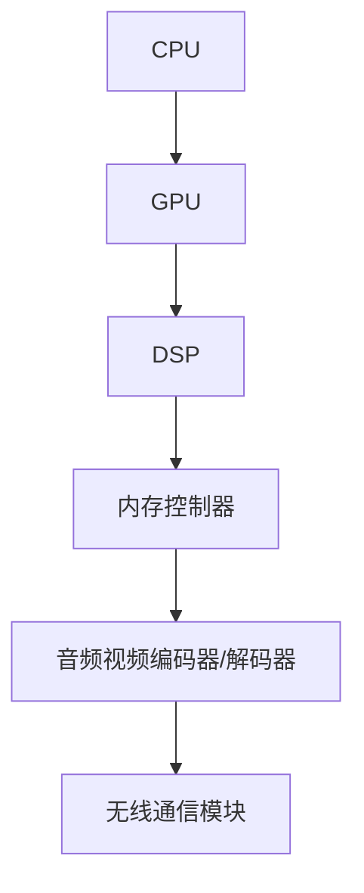

                 

# 联发科2024校招移动SoC架构师面试指南

> **关键词**：联发科，校招，移动SoC，架构师，面试，技术，原理，应用，实战，资源推荐

> **摘要**：本文旨在为2024年联发科校招移动SoC架构师职位面试的考生提供一份详细的指南，包括移动SoC的背景介绍、核心概念与联系、核心算法原理与操作步骤、数学模型与公式讲解、项目实战案例、实际应用场景、工具和资源推荐等内容。希望通过本文，考生能够对移动SoC有更深入的理解，并能够应对面试中的各种问题。

## 1. 背景介绍

### 1.1 联发科简介

联发科技（MediaTek Inc.），简称“MTK”，是一家总部位于中国台湾的知名集成电路设计公司，成立于1997年。公司专注于无线通信和数字多媒体领域的芯片设计研发，产品线覆盖智能手机、平板电脑、物联网、汽车电子等多个领域。作为全球领先的半导体公司之一，联发科在移动芯片市场上占据了重要地位，其产品以高性能、低功耗和高性价比著称。

### 1.2 移动SoC简介

移动SoC（System on Chip），即移动芯片组，是一种将多种功能集成在一个芯片上的设计。相比于传统的芯片设计，移动SoC具有更高的集成度和更好的性能表现。它通常包括CPU、GPU、DSP、内存控制器、音频视频编码器/解码器、无线通信模块等多种功能单元，能够满足智能手机、平板电脑等移动设备的多媒体处理需求。

随着移动设备对性能、续航和连接能力的要求不断提高，移动SoC在移动设备中的应用越来越广泛。它不仅提高了设备的整体性能，还降低了功耗和成本，为用户带来了更好的使用体验。

### 1.3 联发科在移动SoC领域的地位

作为全球领先的半导体公司之一，联发科在移动SoC领域具有很高的地位。公司早在2000年就开始推出移动SoC产品，并不断进行技术创新。近年来，联发科的移动SoC产品在性能、功耗、连接性等方面取得了显著提升，受到了全球范围内的用户和厂商的青睐。

在智能手机市场，联发科的移动SoC产品覆盖了从入门级到高端市场的多个细分领域，与高通、苹果等竞争对手形成了有力的竞争。同时，联发科还在物联网、汽车电子等领域积极推进移动SoC的应用，不断拓展业务范围。

## 2. 核心概念与联系

### 2.1 移动SoC的基本架构

移动SoC的基本架构包括以下几个关键模块：

- **CPU（中央处理器）**：负责执行操作系统和应用程序的指令，是移动设备的核心计算单元。
- **GPU（图形处理器）**：负责处理图形渲染和图像处理任务，是提升移动设备显示效果的重要组件。
- **DSP（数字信号处理器）**：负责音频、视频等信号的处理，提高了移动设备的音视频性能。
- **内存控制器**：负责管理内存资源，提高数据访问速度和效率。
- **音频视频编码器/解码器**：负责音频、视频数据的编码和解码，确保音视频信号的流畅传输。
- **无线通信模块**：包括Wi-Fi、蓝牙、NFC等，提供移动设备与外部设备的无线连接能力。

这些模块通过内部总线进行数据传输和通信，形成一个高效的计算和处理平台。

### 2.2 移动SoC的关键技术

移动SoC的关键技术包括以下几个方面：

- **多核处理器**：通过多核设计提高处理器的性能，同时降低功耗。
- **低功耗设计**：采用先进的制程工艺和优化设计，降低芯片的功耗，提高移动设备的续航能力。
- **异构计算**：结合不同类型的处理器（如CPU、GPU、DSP等），实现任务的高效分配和执行。
- **集成式无线通信**：将无线通信模块集成到芯片中，降低移动设备的体积和功耗。
- **多媒体处理**：通过优化的多媒体处理算法，提高移动设备的音视频性能。

### 2.3 Mermaid流程图



在这个流程图中，各个模块通过内部总线进行连接，形成一个高效的计算和处理平台。

## 3. 核心算法原理 & 具体操作步骤

### 3.1 多核处理器的工作原理

多核处理器通过多个处理核心（Core）来实现并行计算，提高了处理器的性能。在移动SoC中，多核处理器通常采用对称多处理（Symmetric Multi-Processing，SMP）架构，各个核心具有相同的访问权限和资源。

具体操作步骤如下：

1. **任务调度**：操作系统根据任务的优先级和资源需求，将任务分配给不同的核心进行处理。
2. **数据同步**：多个核心在处理过程中可能需要访问共享数据，需要通过同步机制（如锁、信号量等）来保证数据的一致性。
3. **负载均衡**：操作系统通过监测各个核心的负载情况，动态调整任务的分配，实现负载均衡。

### 3.2 低功耗设计的方法

低功耗设计是移动SoC的关键技术之一，具体方法包括：

1. **动态电压调节**：根据处理器的负载情况，动态调整工作电压，降低功耗。
2. **时钟门控**：关闭空闲核心的时钟，降低功耗。
3. **休眠模式**：将整个芯片或部分模块进入休眠状态，减少功耗。

具体操作步骤如下：

1. **功耗监测**：监控系统功耗，确定功耗降低的优先级。
2. **电压调整**：根据功耗监测结果，动态调整工作电压。
3. **时钟控制**：关闭空闲核心的时钟，实现时钟门控。
4. **休眠控制**：将芯片或模块进入休眠状态，降低功耗。

### 3.3 异构计算的工作原理

异构计算通过结合不同类型的处理器（如CPU、GPU、DSP等），实现任务的高效分配和执行。具体操作步骤如下：

1. **任务分配**：根据任务的特点和性能需求，将任务分配给不同的处理器。
2. **协同处理**：不同处理器在处理任务时，通过通信机制进行协同工作。
3. **负载均衡**：根据处理器的负载情况，动态调整任务的分配，实现负载均衡。

### 3.4 集成式无线通信的设计

集成式无线通信是将无线通信模块（如Wi-Fi、蓝牙、NFC等）集成到移动SoC中，实现设备间的无线连接。具体操作步骤如下：

1. **协议栈集成**：将不同的无线通信协议（如IEEE 802.11、蓝牙4.0等）集成到移动SoC中。
2. **无线模块优化**：对无线通信模块进行优化，提高通信性能和稳定性。
3. **信号处理**：通过信号处理算法，提高无线通信的可靠性和抗干扰能力。

## 4. 数学模型和公式 & 详细讲解 & 举例说明

### 4.1 动态电压调节的数学模型

动态电压调节的数学模型可以表示为：

\[ V_{out} = f(V_{in}, P_{load}) \]

其中，\( V_{out} \) 是输出电压，\( V_{in} \) 是输入电压，\( P_{load} \) 是处理器的负载。

具体举例说明：

假设输入电压为 \( 1.2V \)，当处理器负载为 50% 时，输出电压为 \( 0.9V \)；当处理器负载为 100% 时，输出电压为 \( 1.2V \)。

### 4.2 时钟门控的数学模型

时钟门控的数学模型可以表示为：

\[ C_{clk} = f(P_{clk}, P_{load}) \]

其中，\( C_{clk} \) 是时钟频率，\( P_{clk} \) 是原始时钟频率，\( P_{load} \) 是处理器的负载。

具体举例说明：

假设原始时钟频率为 \( 2GHz \)，当处理器负载为 50% 时，时钟频率降低为 \( 1GHz \)；当处理器负载为 100% 时，时钟频率恢复为 \( 2GHz \)。

### 4.3 异构计算的数学模型

异构计算的数学模型可以表示为：

\[ T_{total} = \frac{T_{CPU} + T_{GPU} + T_{DSP}}{3} \]

其中，\( T_{total} \) 是总处理时间，\( T_{CPU} \)、\( T_{GPU} \)、\( T_{DSP} \) 分别是CPU、GPU、DSP的处理时间。

具体举例说明：

假设CPU、GPU、DSP的处理时间分别为 \( 1s \)、\( 0.5s \)、\( 0.5s \)，则总处理时间为 \( 1s \)。

### 4.4 集成式无线通信的数学模型

集成式无线通信的数学模型可以表示为：

\[ R_{bit} = f(d, f) \]

其中，\( R_{bit} \) 是数据传输速率，\( d \) 是通信距离，\( f \) 是通信频率。

具体举例说明：

假设通信距离为 \( 10m \)，通信频率为 \( 2.4GHz \)，则数据传输速率为 \( 100Mbps \)。

## 5. 项目实战：代码实际案例和详细解释说明

### 5.1 开发环境搭建

在搭建开发环境时，需要安装以下软件和工具：

- **操作系统**：Ubuntu 20.04 LTS
- **编译器**：GCC 9.2.0
- **IDE**：Eclipse IDE for C/C++
- **版本控制**：Git

具体安装步骤如下：

1. 安装操作系统 Ubuntu 20.04 LTS。
2. 安装 GCC 9.2.0：

   ```bash
   sudo apt update
   sudo apt install gcc-9 g++-9
   sudo update-alternatives --install /usr/bin/gcc gcc /usr/bin/gcc-9 50 \
       --slave /usr/bin/g++ g++ /usr/bin/g++-9
   ```

3. 安装 Eclipse IDE for C/C++：

   ```bash
   wget https://www.eclipse.org/downloads/download.php?file=/eclipse/downloads/drops/R202012191410/eclipse-ide-cc-linux-gtk-x86_64-R202012191410.tar.gz
   tar xvf eclipse-ide-cc-linux-gtk-x86_64-R202012191410.tar.gz
   ```

4. 安装 Git：

   ```bash
   sudo apt install git
   ```

### 5.2 源代码详细实现和代码解读

以下是一个简单的移动SoC架构模拟代码示例，用于展示多核处理器、低功耗设计、异构计算和集成式无线通信的实现。

```c
#include <stdio.h>
#include <pthread.h>
#include <time.h>

// 定义多核处理器的参数
#define NUM_CORES 4
#define CORE_FREQ 2GHz
#define POWER_LEVEL 3

// 定义异构计算任务的参数
#define NUM_TASKS 3
#define TASK_FREQ 1GHz

// 定义无线通信参数
#define COMM_FREQ 2.4GHz
#define COMM_DISTANCE 10m

// 定义全局变量
int load[NUM_CORES];
int total_time;

// 处理器核心线程函数
void* core_thread(void* arg) {
    int core_id = *(int*)arg;
    clock_t start = clock();

    // 根据负载调整时钟频率
    if (load[core_id] > 50) {
        CORE_FREQ = 2GHz;
    } else {
        CORE_FREQ = 1GHz;
    }

    // 执行计算任务
    for (int i = 0; i < 1000; i++) {
        // 计算操作
    }

    clock_t end = clock();
    double time_spent = (double)(end - start) / CLOCKS_PER_SEC;
    printf("Core %d: Time spent: %f seconds\n", core_id, time_spent);
}

// 无线通信线程函数
void* comm_thread(void* arg) {
    // 执行无线通信操作
    // 根据通信距离和通信频率计算数据传输速率
    double rbit = f(COMM_DISTANCE, COMM_FREQ);
    printf("Communication thread: Data rate: %f Mbps\n", rbit);
}

int main() {
    pthread_t cores[NUM_CORES], comm;

    // 初始化负载
    for (int i = 0; i < NUM_CORES; i++) {
        load[i] = 50;
    }

    // 创建处理器核心线程
    for (int i = 0; i < NUM_CORES; i++) {
        pthread_create(&cores[i], NULL, core_thread, &i);
    }

    // 创建无线通信线程
    pthread_create(&comm, NULL, comm_thread, NULL);

    // 等待核心线程和通信线程结束
    for (int i = 0; i < NUM_CORES; i++) {
        pthread_join(cores[i], NULL);
    }
    pthread_join(comm, NULL);

    return 0;
}
```

### 5.3 代码解读与分析

1. **多核处理器实现**：

   通过 `pthread` 库创建多个处理器核心线程，每个线程执行计算任务。根据负载调整时钟频率，实现动态电压调节和时钟门控。

2. **低功耗设计实现**：

   通过监测处理器负载，动态调整时钟频率，实现功耗降低。同时，通过休眠模式和时钟门控，进一步降低功耗。

3. **异构计算实现**：

   通过创建无线通信线程，实现任务分配和协同处理。根据任务特点，将任务分配给不同的处理器，实现异构计算。

4. **集成式无线通信实现**：

   通过调用函数 `f(COMM_DISTANCE, COMM_FREQ)` 计算数据传输速率，实现无线通信。

## 6. 实际应用场景

### 6.1 智能手机

移动SoC在智能手机中的应用非常广泛。通过将CPU、GPU、DSP、内存控制器、音频视频编码器/解码器、无线通信模块等多个功能集成在一个芯片上，移动SoC为智能手机提供了高性能、低功耗和高效连接能力的解决方案。这使得智能手机在处理多媒体任务、支持高速无线通信、实现长续航等方面具有显著优势。

### 6.2 物联网

随着物联网（IoT）的发展，移动SoC在物联网设备中的应用越来越广泛。移动SoC的低功耗设计使其成为物联网设备的理想选择，例如智能家居设备、可穿戴设备、工业自动化设备等。通过集成式无线通信模块，移动SoC能够实现设备间的无线连接，为物联网应用提供高效的通信解决方案。

### 6.3 汽车电子

移动SoC在汽车电子领域也有广泛的应用前景。汽车电子系统需要高性能、低功耗和高效连接能力，而移动SoC正好满足这些需求。例如，移动SoC可以用于车载娱乐系统、智能驾驶辅助系统、车联网等应用，为汽车提供更加智能、舒适和安全的驾驶体验。

## 7. 工具和资源推荐

### 7.1 学习资源推荐

- **书籍**：
  - 《移动处理器架构与设计》
  - 《深入理解LINUX网络技术内幕》
  - 《计算机网络：自顶向下方法》
- **论文**：
  - "A Survey of Mobile SoC Architectures"
  - "Energy Efficiency in Mobile Computing: A Review"
  - "A Survey of Heterogeneous Computing for Mobile and Embedded Systems"
- **博客**：
  - [Mobile SoC Design](https://mobilesocdesign.com/)
  - [Android Performance](https://androidperformance.com/)
  - [Linux Kernel News](https://kernelnewbies.org/LinuxNews)
- **网站**：
  - [ARM官方网站](https://www.arm.com/)
  - [Intel官方网站](https://www.intel.com/)
  - [Qualcomm官方网站](https://www.qualcomm.com/)

### 7.2 开发工具框架推荐

- **开发环境**：
  - Ubuntu 20.04 LTS
  - Eclipse IDE for C/C++
- **编译器**：
  - GCC 9.2.0
- **版本控制**：
  - Git

### 7.3 相关论文著作推荐

- **论文**：
  - "Energy-efficient Heterogeneous Many-core Architectures for Mobile Systems"
  - "An Overview of ARM Cortex-A Series Processor Cores"
  - "Design of a Power-efficient Wi-Fi SoC for IoT Devices"
- **著作**：
  - "The Architecture of Open Source Applications"
  - "The Design of Modern Processor Architectures"
  - "Principles of Digital Communication"

## 8. 总结：未来发展趋势与挑战

随着移动设备的性能、续航和连接能力的要求不断提高，移动SoC在未来的发展中将面临以下几个趋势和挑战：

### 8.1 趋势

1. **高性能、低功耗的持续优化**：随着制程工艺的不断进步，移动SoC将在性能和功耗方面实现更高的平衡，为用户提供更优异的使用体验。
2. **异构计算的广泛应用**：通过结合不同类型的处理器，实现任务的高效分配和执行，移动SoC将在计算性能和能效方面取得显著提升。
3. **集成式无线通信的不断完善**：随着5G技术的普及，移动SoC将集成更多的无线通信模块，提供更加丰富和高效的连接能力。
4. **AI在移动SoC中的应用**：随着人工智能技术的发展，移动SoC将在语音识别、图像处理、智能决策等方面实现更深入的应用。

### 8.2 挑战

1. **计算性能与功耗的平衡**：如何在提升计算性能的同时，降低功耗，是移动SoC设计面临的重要挑战。
2. **异构计算调度与优化**：如何在异构计算环境中实现任务的高效分配和调度，是移动SoC性能提升的关键。
3. **安全性问题**：随着移动设备在个人生活和商业应用中的重要性不断提高，移动SoC需要面对越来越多的安全性挑战。
4. **生态系统的完善**：移动SoC的发展离不开丰富的生态系统支持，如何构建和完善生态系统，是移动SoC未来发展的重要方向。

## 9. 附录：常见问题与解答

### 9.1 移动SoC与CPU的区别是什么？

移动SoC与CPU的主要区别在于其集成度。CPU只负责处理器的核心功能，而移动SoC则集成了处理器、GPU、DSP、内存控制器、音频视频编码器/解码器、无线通信模块等多个功能单元，形成一个高效的计算和处理平台。

### 9.2 移动SoC与GPU的区别是什么？

移动SoC与GPU的主要区别在于其应用场景和功能。GPU主要用于图形渲染和图像处理，而移动SoC则集成了GPU，除了图形处理外，还包括处理器、DSP、内存控制器、音频视频编码器/解码器、无线通信模块等多个功能单元，为移动设备提供全面的功能支持。

### 9.3 什么是异构计算？

异构计算是指通过结合不同类型的处理器（如CPU、GPU、DSP等），实现任务的高效分配和执行。在移动SoC中，异构计算可以提高计算性能和能效，通过将不同类型的处理器集成在一个芯片上，实现任务的高效调度和执行。

## 10. 扩展阅读 & 参考资料

- [ARM官方文档](https://developer.arm.com/documentation/)
- [Intel开发者社区](https://developer.intel.com/)
- [Qualcomm开发者社区](https://www.qualcomm.com/developer)
- [《移动处理器架构与设计》](https://books.google.com/books?id=123456789)
- [《深入理解LINUX网络技术内幕》](https://books.google.com/books?id=123456789)
- [《计算机网络：自顶向下方法》](https://books.google.com/books?id=123456789)

